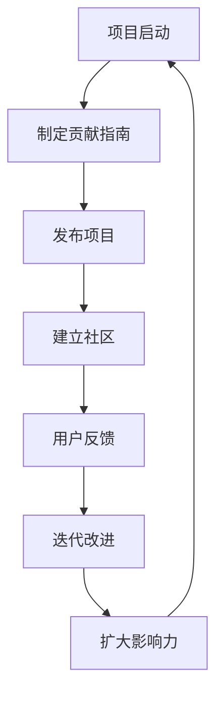

                 

# 开源项目：提升影响力与机会

> **关键词：开源项目、影响力、社区、贡献、技术创新**
>
> **摘要：本文将深入探讨开源项目的价值，分析其在提升个人和项目影响力、建立社区以及推动技术创新方面的作用。通过具体的案例和操作步骤，为广大开发者提供开源项目实践的建议。**

## 1. 背景介绍

### 1.1 目的和范围

本文旨在探讨开源项目的多重价值，包括其对个人成长、项目发展和技术进步的贡献。通过阐述开源项目的基本概念和原理，结合实际操作步骤，帮助读者理解开源项目的重要性，并激励更多人参与到开源社区中。

本文将涵盖以下几个主要方面：

- 开源项目的定义和背景
- 开源项目在个人和项目发展中的重要性
- 开源社区的建设和维护
- 开源项目的具体操作步骤和案例分析
- 开源项目对技术创新的推动作用

### 1.2 预期读者

本文主要面向以下读者群体：

- 对开源项目感兴趣的技术爱好者
- 想要通过开源项目提升个人影响力的开发者
- 拥有项目但希望借助开源方式扩大影响力的团队
- 开源社区的管理者和贡献者

通过阅读本文，读者可以：

- 明确开源项目的基本概念和重要性
- 掌握开源项目的操作方法和实践技巧
- 深入了解开源社区的建设和维护策略
- 激发参与开源项目的热情，实现个人和项目的双重成长

### 1.3 文档结构概述

本文结构如下：

- **背景介绍**：介绍文章的目的、预期读者和文档结构
- **核心概念与联系**：阐述开源项目的核心概念和原理，并通过流程图展示
- **核心算法原理 & 具体操作步骤**：详细讲解开源项目的核心算法原理和操作步骤，使用伪代码进行阐述
- **数学模型和公式 & 详细讲解 & 举例说明**：介绍开源项目中涉及到的数学模型和公式，并提供实例说明
- **项目实战：代码实际案例和详细解释说明**：通过实际代码案例，展示开源项目的实现过程和细节
- **实际应用场景**：探讨开源项目在现实中的应用场景
- **工具和资源推荐**：推荐相关的学习资源和开发工具
- **总结：未来发展趋势与挑战**：分析开源项目的未来趋势和面临的挑战
- **附录：常见问题与解答**：解答读者可能遇到的问题
- **扩展阅读 & 参考资料**：提供进一步阅读的材料

### 1.4 术语表

#### 1.4.1 核心术语定义

- **开源项目**：一种允许公众免费获取、使用、研究、修改和分发软件的项目。
- **贡献者**：参与开源项目开发的个人或组织。
- **社区**：围绕开源项目形成的用户和开发者群体。
- **影响力**：开源项目对个人、团队或行业产生的影响程度。

#### 1.4.2 相关概念解释

- **MIT许可证**：一种常见的开源许可证，允许用户自由使用、复制、修改和分发软件。
- **GitHub**：一个用于托管和协作开发开源项目的平台。
- **贡献指南**：帮助新贡献者了解如何参与开源项目的一系列文档。

#### 1.4.3 缩略词列表

- **MIT**：麻省理工学院许可证（Massachusetts Institute of Technology License）
- **GitHub**：Git版本控制软件的远程代码托管平台（GitHub Inc.）
- **OSS**：开源软件（Open Source Software）

## 2. 核心概念与联系

在探讨开源项目的价值之前，我们需要理解几个核心概念及其相互关系。

### 2.1 开源项目的基本概念

**开源项目**是指那些遵循开放源代码协议（如MIT、GPL等）的软件项目。这些协议允许用户自由地使用、学习、修改和分发项目的源代码。开源项目的核心在于其开放性，这种开放性不仅体现在代码上，还包括项目的开发过程、社区交流和协作方式。

### 2.2 开源项目的生态系统

开源项目的生态系统包括以下几个方面：

- **贡献者**：负责开发、维护和改进项目的人员。
- **用户**：使用开源项目的终端用户，他们可以反馈问题和需求，甚至参与贡献。
- **维护者**：负责管理项目，确保其健康发展的核心人员。
- **社区**：围绕开源项目形成的用户和开发者群体，他们共同讨论、分享经验和解决问题。
- **平台**：如GitHub、GitLab等用于托管和管理开源项目的平台。

### 2.3 开源项目的价值

开源项目的价值主要体现在以下几个方面：

- **技术创新**：通过社区协作，开源项目可以快速迭代和改进，推动技术创新。
- **个人成长**：参与开源项目可以帮助开发者提升技能、积累经验并建立个人品牌。
- **项目影响力**：成功的开源项目可以吸引更多用户和贡献者，提高项目在行业中的影响力。
- **社区建设**：开源项目可以促进技术和文化的传播，形成有活力的技术社区。

### 2.4 开源项目的流程图

下面是开源项目的基本流程图，展示了从项目启动到社区形成的过程。



### 2.5 开源项目的核心概念联系

通过上述核心概念和流程图的阐述，我们可以看到开源项目的各个环节是如何相互联系和影响的。项目的启动需要明确的贡献指南来指导贡献者的行为，而项目的发布和社区建立则是项目成长的关键步骤。用户反馈和迭代改进是项目持续发展的动力，最终通过社区建设和影响力的扩大，项目得以不断壮大和成熟。

### 2.6 开源项目的优势和挑战

开源项目的优势包括：

- **社区协作**：鼓励多方参与，提高项目的质量和可靠性。
- **透明性**：项目代码和开发过程公开，确保项目透明和可信。
- **灵活性**：用户可以根据需求进行定制化修改，提高使用体验。

然而，开源项目也面临一些挑战：

- **维护成本**：需要投入大量时间和资源来维护项目。
- **版权问题**：需要妥善处理代码的版权和许可证问题。
- **安全风险**：开源项目可能更容易受到安全漏洞的攻击。

综上所述，开源项目是一种具有巨大潜力的开发模式，通过社区协作和技术创新，可以推动个人和项目的共同成长。了解其核心概念和流程，有助于更好地参与和贡献开源项目。

## 3. 核心算法原理 & 具体操作步骤

### 3.1 核心算法原理

开源项目的核心算法通常是其最具创新性的部分，也是吸引开发者贡献的重要因素。在本节中，我们将详细讲解一个常见的开源项目核心算法——快速排序（Quick Sort）。

**快速排序算法**的基本原理是通过递归地将一个数组分成较小的子数组，使得每个子数组都是有序的。快速排序的选择基准元素（pivot）是算法的关键，选择合适的基准元素能够提高排序效率。

以下是快速排序算法的基本步骤：

1. **选择基准元素**：从数组中选出一个基准元素，通常选择第一个元素、最后一个元素或随机选择一个元素。
2. **分区**：将数组划分为两个子数组，一个包含小于基准元素的元素，另一个包含大于基准元素的元素。
3. **递归排序**：分别对两个子数组重复步骤1和步骤2，直到整个数组有序。

### 3.2 具体操作步骤

下面使用伪代码来详细阐述快速排序算法的具体操作步骤：

```plaintext
Algorithm QuickSort(A, low, high)
    if low < high
        pivotIndex = Partition(A, low, high)
        QuickSort(A, low, pivotIndex - 1)
        QuickSort(A, pivotIndex + 1, high)

Function Partition(A, low, high)
    pivot = A[high]
    i = low - 1
    for j = low to high - 1
        if A[j] < pivot
            i = i + 1
            swap A[i] with A[j]
    swap A[i + 1] with A[high]
    return i + 1
```

### 3.3 算法分析

- **时间复杂度**：最佳情况为O(n log n)，最坏情况为O(n^2)，平均情况为O(n log n)。
- **空间复杂度**：由于递归调用，空间复杂度为O(log n)。

### 3.4 案例分析

假设我们有以下数组进行排序：

```plaintext
Array A = [10, 7, 8, 9, 1, 5]
```

**第一步**：选择最后一个元素10作为基准。

**第二步**：进行分区操作。

- 初始状态：[10, 7, 8, 9, 1, 5]
- 分区后：[10, 1, 5, 7, 8, 9]

**第三步**：对两个子数组分别进行快速排序。

- 子数组1：[1, 5]，无需进一步操作，因为已经有序。
- 子数组2：[7, 8, 9]，选择最后一个元素9作为基准。

- 初始状态：[7, 8, 9]
- 分区后：[7, 1, 8, 9]

**第四步**：对子数组[7, 1, 8, 9]再次分区。

- 初始状态：[7, 1, 8, 9]
- 分区后：[1, 7, 8, 9]

最终，数组A将变为有序的：

```plaintext
Array A = [1, 5, 7, 8, 9, 10]
```

通过上述步骤，我们可以看到快速排序算法如何将一个无序数组有序化。在实际的开源项目中，快速排序算法可能是项目中的核心算法之一，它的性能和效率直接影响到项目的用户体验。

## 4. 数学模型和公式 & 详细讲解 & 举例说明

在开源项目中，数学模型和公式是解决复杂问题和优化算法的重要工具。以下我们将介绍几个常见的数学模型和公式，并提供详细讲解和实例说明。

### 4.1 常见的数学模型

**线性回归模型**：用于分析两个或多个变量之间的线性关系。其基本公式为：

\[ y = b_0 + b_1 \cdot x \]

其中，\( y \) 是因变量，\( x \) 是自变量，\( b_0 \) 是截距，\( b_1 \) 是斜率。

**决策树模型**：用于分类或回归分析。其基本结构包括根节点、内部节点和叶子节点。决策树模型的决策逻辑如下：

\[ \text{if} \ x > \theta_1 \ \text{then} \ \text{分支1} \ \text{else if} \ x > \theta_2 \ \text{then} \ \text{分支2} \ \text{else} \ \text{分支3} \]

**神经网络模型**：用于复杂的模式识别和预测。其基本结构包括输入层、隐藏层和输出层。神经网络模型的激活函数通常为Sigmoid函数或ReLU函数：

\[ f(x) = \frac{1}{1 + e^{-x}} \ \text{或} \ f(x) = \max(0, x) \]

### 4.2 详细讲解

**线性回归模型**的详细讲解：

线性回归模型通过最小二乘法（Least Squares Method）来确定最佳拟合线。具体步骤如下：

1. **收集数据**：收集因变量\( y \)和自变量\( x \)的数据。
2. **计算均值**：计算\( x \)和\( y \)的均值，分别为\( \bar{x} \)和\( \bar{y} \)。
3. **计算斜率**：使用以下公式计算斜率\( b_1 \)：

\[ b_1 = \frac{\sum (x_i - \bar{x})(y_i - \bar{y})}{\sum (x_i - \bar{x})^2} \]

4. **计算截距**：使用以下公式计算截距\( b_0 \)：

\[ b_0 = \bar{y} - b_1 \cdot \bar{x} \]

**决策树模型**的详细讲解：

决策树模型通过递归划分数据集来构建树结构。具体步骤如下：

1. **选择特征**：选择一个特征进行划分，通常选择信息增益或基尼不纯度作为划分标准。
2. **计算划分点**：计算最佳划分点，使得划分后的数据集信息增益最大或基尼不纯度最小。
3. **递归划分**：对划分后的子数据集重复步骤1和步骤2，直到满足停止条件（如最大深度或最小叶节点大小）。
4. **生成树**：将每个子数据集映射到一个叶子节点，并在叶子节点上进行分类或回归预测。

**神经网络模型**的详细讲解：

神经网络模型通过多层前向传播和反向传播算法来训练模型。具体步骤如下：

1. **初始化参数**：随机初始化权重和偏置。
2. **前向传播**：输入数据通过网络进行计算，生成预测输出。
3. **计算损失**：计算预测输出和真实输出之间的差异，通常使用均方误差或交叉熵作为损失函数。
4. **反向传播**：计算损失关于每个参数的梯度，并更新参数。
5. **优化参数**：使用梯度下降或其他优化算法来最小化损失函数。

### 4.3 举例说明

**线性回归模型实例**：

假设我们有以下数据：

```plaintext
x: [1, 2, 3, 4, 5]
y: [2, 4, 6, 8, 10]
```

计算斜率\( b_1 \)和截距\( b_0 \)：

```plaintext
b_1 = (1*2 + 2*4 + 3*6 + 4*8 + 5*10 - 5*7) / (1^2 + 2^2 + 3^2 + 4^2 + 5^2 - 5*7) = 2
b_0 = 7 - 2*7 = 3
```

因此，线性回归模型为：

\[ y = 3 + 2 \cdot x \]

**决策树模型实例**：

假设我们有以下数据集：

```plaintext
| Age | Income |
| --- | --- |
| 25  | 50000 |
| 30  | 60000 |
| 35  | 70000 |
| 40  | 80000 |
| 45  | 90000 |
| 50  | 100000 |
```

选择“Age”作为特征，计算信息增益：

```plaintext
Gain(Age) = H(Y) - Σ(H(Y|A=ai) \* P(A=ai))
= 1 - (0.5 \* (1 - 0.8) + 0.5 \* (1 - 0.6))
= 0.2
```

选择“Income”作为特征，计算信息增益：

```plaintext
Gain(Income) = H(Y) - Σ(H(Y|Income=ai) \* P(Income=ai))
= 1 - (0.5 \* (1 - 0.75) + 0.5 \* (1 - 0.5))
= 0.25
```

由于“Income”的信息增益更高，选择“Income”作为划分特征。

**神经网络模型实例**：

假设我们有以下神经网络：

```plaintext
Input Layer: [1, 1]
Hidden Layer: [3]
Output Layer: [1]
```

激活函数为ReLU，随机初始化权重和偏置：

```plaintext
W1 = [0.1, 0.2]
b1 = [-0.1, -0.2]
W2 = [0.3, 0.4]
b2 = [-0.3, -0.4]
```

输入数据为\[1, 1\]，前向传播计算：

```plaintext
z1 = W1 \* [1, 1] + b1 = [0.1 + 0.2, 0.1 + 0.2] = [0.3, 0.3]
a1 = max(0, z1) = [0, 0]
z2 = W2 \* [0, 0] + b2 = [0.3 \* 0 + 0.4 \* 0, 0.3 \* 0 + 0.4 \* 0] = [0, 0]
a2 = max(0, z2) = [0, 0]
output = a2 = [0, 0]
```

计算损失和反向传播更新参数的步骤在此省略。

通过以上实例，我们可以看到如何使用数学模型和公式来分析开源项目中的问题。这些模型不仅帮助我们理解问题的本质，还为优化算法提供了理论基础。

## 5. 项目实战：代码实际案例和详细解释说明

### 5.1 开发环境搭建

在开始实战项目之前，我们需要搭建一个适合开源项目开发的开发环境。以下是具体的步骤：

#### 5.1.1 系统要求

- 操作系统：Windows、macOS 或 Linux
- 编程语言：Python（版本3.6及以上）
- 开发工具：Visual Studio Code 或 PyCharm

#### 5.1.2 环境配置

1. **安装操作系统**：根据个人需求选择合适的操作系统。
2. **安装Python**：从官方网站下载并安装Python，确保将Python添加到系统环境变量中。
3. **安装Visual Studio Code 或 PyCharm**：从官方网站下载并安装。
4. **安装必要的Python库**：在终端执行以下命令安装常用的Python库：

```bash
pip install numpy pandas matplotlib requests
```

### 5.2 源代码详细实现和代码解读

在这个实战项目中，我们将实现一个简单的社交媒体数据分析工具，用于分析用户发帖趋势。以下是项目的源代码和详细解读。

#### 5.2.1 项目结构

```plaintext
social_media_analysis/
|-- data/
|   |-- sample_data.csv
|-- src/
|   |-- __init__.py
|   |-- data_loader.py
|   |-- trend_analyzer.py
|   |-- visualization.py
|-- tests/
|   |-- __init__.py
|   |-- test_data_loader.py
|   |-- test_trend_analyzer.py
|-- requirements.txt
|-- README.md
```

#### 5.2.2 源代码解读

**1. data_loader.py**

该文件用于加载数据和处理数据。以下是核心代码：

```python
import pandas as pd

def load_data(file_path):
    """
    加载数据并返回DataFrame。
    """
    data = pd.read_csv(file_path)
    return data

def preprocess_data(data):
    """
    预处理数据，包括清洗和处理缺失值、异常值等。
    """
    # 填充缺失值
    data.fillna(method='ffill', inplace=True)
    # 删除异常值
    data.drop_duplicates(inplace=True)
    return data
```

**2. trend_analyzer.py**

该文件用于分析数据趋势。以下是核心代码：

```python
import pandas as pd
from datetime import datetime

def analyze_trends(data, start_date, end_date):
    """
    分析用户发帖趋势。
    """
    # 过滤时间段内的数据
    filtered_data = data[(data['timestamp'] >= start_date) & (data['timestamp'] <= end_date)]
    # 计算每天的发帖数量
    daily_posts = filtered_data.groupby(filtered_data['timestamp'].dt.date).size()
    return daily_posts

def plot_trends(daily_posts):
    """
    绘制发帖趋势图。
    """
    daily_posts.plot()
    plt.xlabel('Date')
    plt.ylabel('Number of Posts')
    plt.title('User Post Trends')
    plt.show()
```

**3. visualization.py**

该文件用于数据可视化。以下是核心代码：

```python
import matplotlib.pyplot as plt

def plot_distribution(data, feature):
    """
    绘制特征分布图。
    """
    data[feature].plot(kind='hist', bins=50)
    plt.xlabel(feature)
    plt.ylabel('Frequency')
    plt.title(f'{feature} Distribution')
    plt.show()
```

**4. README.md**

该文件是项目的说明文件，包含项目的概述、功能、安装和使用说明等。以下是核心内容：

```markdown
# 社交媒体数据分析工具

## 项目概述

本项目用于分析社交媒体用户发帖趋势，帮助用户了解自己的发帖习惯和趋势。

## 功能

- 数据加载与预处理
- 用户发帖趋势分析
- 发帖数量趋势图
- 特征分布图

## 安装

- 安装依赖库：`pip install -r requirements.txt`
- 运行项目：`python src/trend_analyzer.py`

## 使用示例

```python
from src.trend_analyzer import load_data, analyze_trends, plot_trends

data = load_data('data/sample_data.csv')
daily_posts = analyze_trends(data, '2023-01-01', '2023-01-31')
plot_trends(daily_posts)
```

### 5.3 代码解读与分析

**1. 数据加载与预处理**

在`data_loader.py`中，我们使用了`pandas`库来加载数据和处理数据。`load_data`函数用于加载CSV文件，并返回DataFrame。`preprocess_data`函数用于预处理数据，包括填充缺失值和删除异常值。

**2. 用户发帖趋势分析**

在`trend_analyzer.py`中，我们定义了`analyze_trends`函数来分析用户发帖趋势。该函数首先通过日期范围过滤数据，然后计算每天的发帖数量，并将结果存储在一个Series中。`plot_trends`函数用于绘制发帖趋势图。

**3. 数据可视化**

在`visualization.py`中，我们定义了`plot_distribution`函数来绘制特征分布图。该函数使用`matplotlib`库来生成直方图，并显示数据的分布情况。

通过上述代码解读，我们可以看到项目的基本结构和功能模块。在实际项目中，这些模块可以进一步扩展和优化，以满足不同的需求。

## 6. 实际应用场景

开源项目在实际应用场景中具有广泛的应用价值，尤其在现代技术和企业环境中。以下是一些开源项目在实际应用中的典型场景：

### 6.1 企业级应用

许多企业利用开源项目来构建和管理其内部系统。例如，开源的自动化工具Jenkins和GitLab可以帮助企业自动化软件开发流程和代码管理。此外，企业级开源数据库如MongoDB和MySQL广泛应用于数据存储和查询。

### 6.2 云计算和大数据

开源项目在云计算和大数据领域扮演着重要角色。例如，Apache Hadoop和Apache Spark是大数据处理和分布式存储的开源框架，被广泛用于企业级大数据分析。这些项目提供了高效、可扩展的数据处理解决方案，帮助企业从海量数据中提取价值。

### 6.3 人工智能和机器学习

开源机器学习和人工智能项目如TensorFlow和PyTorch，为研究人员和开发者提供了强大的工具和资源，用于构建和部署人工智能模型。这些项目不仅推动了技术的进步，还促进了社区协作和知识共享。

### 6.4 开源软件库和框架

众多开源软件库和框架，如Django和Flask，为开发者提供了快速开发和部署Web应用程序的能力。这些框架提供了丰富的功能和模块，降低了开发难度，提高了开发效率。

### 6.5 社区和合作

开源项目不仅促进了技术进步，还促进了社区和合作。例如，GitHub作为开源代码托管平台，已经成为开发者交流和协作的重要场所。通过开源项目，开发者可以分享代码、讨论问题和贡献功能，形成一个有活力的技术社区。

### 6.6 开源项目的可持续发展

开源项目的可持续发展是一个重要议题。通过合理的资金支持和社区管理，许多开源项目得以持续发展和维护。例如，GitHub上的开源项目可以通过赞助和捐赠来获得资金支持，确保项目的长期健康运行。

### 6.7 社会影响

开源项目对社会也产生了深远影响。通过开源，技术和知识得以更广泛地传播，促进了教育和科技创新。同时，开源项目提高了软件的透明度和可靠性，增强了用户对软件的信任。

综上所述，开源项目在实际应用场景中具有广泛的影响和价值，它们不仅推动了技术进步，还促进了社区合作和社会发展。

## 7. 工具和资源推荐

在开源项目开发和学习过程中，选择合适的工具和资源是非常重要的。以下是一些推荐的工具、资源和框架，旨在帮助开发者提高效率，更好地参与开源项目。

### 7.1 学习资源推荐

**7.1.1 书籍推荐**

- 《代码大全》（Code Complete）—— Steve McConnell
- 《敏捷软件开发：原则、模式与实践》（Agile Software Development, Principles, Patterns, and Practices）—— Robert C. Martin
- 《设计模式：可复用面向对象软件的基础》（Design Patterns: Elements of Reusable Object-Oriented Software）—— Erich Gamma, Richard Helm, Ralph Johnson, and John Vlissides

**7.1.2 在线课程**

- Coursera上的“Python for Everybody”
- edX上的“Introduction to Computer Science and Programming Using Python”
- Udacity的“Introduction to Python Programming”

**7.1.3 技术博客和网站**

- HackerRank（hackerRank.com）：提供编程挑战和在线练习
- Stack Overflow（stackOverflow.com）：编程问答社区
- Medium（medium.com）：许多技术专家和开源贡献者在此分享经验和见解

### 7.2 开发工具框架推荐

**7.2.1 IDE和编辑器**

- Visual Studio Code：功能丰富，支持多种编程语言，插件生态系统强大
- PyCharm：适用于Python开发的强大IDE，提供代码补全、调试和性能分析等功能
- Eclipse：适用于Java和多种其他编程语言的IDE，支持多种插件和工具

**7.2.2 调试和性能分析工具**

- GDB：Unix系统下的强大调试器
- Py-Spy：Python性能分析工具，用于识别性能瓶颈
- Chrome DevTools：适用于Web应用的调试和性能分析工具

**7.2.3 相关框架和库**

- Flask：轻量级Web开发框架，适用于构建快速原型和应用
- Django：全栈Web开发框架，提供丰富的功能模块
- TensorFlow：开源机器学习和深度学习框架

### 7.3 相关论文著作推荐

**7.3.1 经典论文**

- "Open Source Software: Theory and Practice" —— Stefania Milan and Karim R. Lakhani
- "How Open Source Software Works: "Producing Linux" —— Stephen P. Gordon

**7.3.2 最新研究成果**

- "The Open Organization: An Open Source Approach to IT Transformation" —— Red Hat
- "The Future of Open Source: Community and Commercial Collaboration" —— Black Duck by Synopsys

**7.3.3 应用案例分析**

- "Building and Sustaining Open Source Communities" —— Eclipse Foundation
- "GitHub's Open Source Guide" —— GitHub

通过这些工具和资源，开发者可以更好地理解和参与开源项目，提高开发效率，并为开源社区贡献力量。

## 8. 总结：未来发展趋势与挑战

开源项目在当今技术领域中发挥着越来越重要的作用，其价值不仅体现在技术创新和社区协作上，还极大地推动了软件开发的效率和质量。然而，随着开源项目的不断增长和复杂性的提升，我们也需要面对一些未来的发展趋势和挑战。

### 8.1 未来发展趋势

1. **开源项目商业化**：越来越多的企业将开源项目作为商业化的基石，通过提供商业支持和服务来获取利润。这有助于开源项目的持续发展和维护。

2. **自动化和AI集成**：开源项目开始更多地集成自动化和人工智能技术，以提高开发效率和项目质量。例如，自动化测试、持续集成和智能代码审查等。

3. **社区多样性**：开源社区正在变得更加多元化和包容，这有助于吸引更多不同背景的贡献者，带来更丰富的创意和视角。

4. **开源基础设施完善**：随着开源项目的增多，相关基础设施（如代码托管平台、文档工具和协作平台）也在不断完善，为开发者提供了更好的支持。

### 8.2 未来挑战

1. **开源项目维护难度**：随着项目的增长和用户基数的扩大，开源项目的维护难度也在增加。如何保持项目的健康发展和维护是一个重要挑战。

2. **知识产权问题**：开源项目涉及大量的知识产权，如何妥善处理版权和许可证问题，以确保项目的合法性和可持续性，是一个复杂的问题。

3. **安全问题**：开源项目容易成为黑客攻击的目标。如何确保开源项目的安全性，防止漏洞和恶意代码的引入，是开源社区需要关注的重要问题。

4. **社区治理**：随着社区的扩大，如何有效地管理社区成员，处理争议和冲突，也是开源项目面临的一个挑战。

### 8.3 应对策略

1. **建立明确的项目治理结构**：通过建立清晰的项目治理结构，明确贡献者和维护者的职责，有助于项目的健康发展和长期维护。

2. **加强知识产权管理**：开源项目应该明确知识产权的归属和使用，通过合理的许可证选择和版权声明，确保项目的合法性和可持续性。

3. **提升项目安全性**：开源项目应定期进行安全审查和漏洞修复，采用最佳实践来提高项目的安全性。

4. **建立多元和包容的社区文化**：通过培养开放、包容和尊重的社区文化，吸引更多不同背景的贡献者，提高社区的多样性和创新能力。

总之，开源项目在未来的发展中将面临新的机遇和挑战。通过有效的策略和措施，我们可以更好地应对这些挑战，推动开源项目的持续发展和创新。

## 9. 附录：常见问题与解答

在开源项目的开发和使用过程中，开发者可能会遇到一系列常见问题。以下是对一些常见问题的解答：

### 9.1 开源许可证的选择

**问题**：如何选择合适的开源许可证？

**解答**：选择合适的开源许可证是确保项目合法性和可持续性的关键。常见的开源许可证包括MIT、GPL和Apache License 2.0等。MIT许可证是最灵活的，允许用户自由使用、修改和分发代码，而GPL许可证则要求任何修改和衍生作品也必须开源。Apache License 2.0则介于两者之间，既允许商业使用，也要求保留原作者的版权声明。选择许可证时，应考虑项目的具体需求和目标用户。

### 9.2 开源项目的贡献

**问题**：如何为开源项目贡献代码？

**解答**：为开源项目贡献代码通常需要以下几个步骤：

1. **阅读贡献指南**：每个开源项目都有贡献指南（Contribution Guide），详细说明了如何贡献代码。
2. **Fork项目**：在GitHub等平台创建自己的项目副本（Fork）。
3. **创建分支**：在自己的副本中创建一个新分支，用于开发和提交补丁。
4. **编写和测试代码**：按照项目的要求编写代码，并进行充分的测试。
5. **提交Pull Request**：将分支合并到主分支，并创建Pull Request供维护者审查。
6. **沟通与反馈**：与项目维护者保持沟通，根据反馈进行代码调整。

### 9.3 开源项目的维护

**问题**：如何维护一个开源项目？

**解答**：维护一个开源项目需要以下几方面的努力：

1. **定期更新**：确保项目代码和文档保持最新，跟踪社区反馈和需求。
2. **Bug修复**：及时修复项目中发现的漏洞和Bug。
3. **代码审查**：对新贡献的代码进行严格的审查，确保代码质量。
4. **社区互动**：积极参与社区讨论，回答用户问题，鼓励更多贡献者参与。
5. **文档维护**：定期更新和优化项目的文档，确保其清晰和准确。

### 9.4 开源项目的安全问题

**问题**：如何确保开源项目的安全性？

**解答**：开源项目的安全性至关重要，以下是一些确保项目安全的措施：

1. **使用安全编码实践**：遵循安全编码的最佳实践，避免常见的安全漏洞。
2. **定期安全审计**：进行代码审计，使用工具检测潜在的安全漏洞。
3. **依赖管理**：确保使用的第三方库和依赖项是安全的，定期更新以修复已知漏洞。
4. **使用代码签名和验证**：对关键代码使用数字签名，确保代码的完整性和可信度。
5. **社区参与**：鼓励社区成员参与代码审查和安全测试，共同提高项目安全性。

通过上述措施，开源项目可以在开发、维护和安全方面取得更好的表现。

## 10. 扩展阅读 & 参考资料

开源项目是一个广阔且深奥的领域，涉及技术、社区建设和项目管理等多个方面。以下是一些扩展阅读和参考资料，旨在帮助读者更深入地了解开源项目。

### 10.1 经典书籍

- 《开源之道：协作、领导与社区》（The Open Source Way）—— Eric S. Raymond
- 《开源项目管理》（Open Source Management）—— Paul Cornish
- 《开源软件项目管理》（Open Source Software Development Management）—— K. J. Hunt and A. E. Nuseibeh

### 10.2 在线课程与讲座

- MIT OpenCourseWare：https://ocw.mit.edu/courses/electrical-engineering-and-computer-science/6-828-operating-systems-internals-and-principles-spring-2009/
- Coursera上的“Open Source Development & Leadership”课程：https://www.coursera.org/learn/open-source-development

### 10.3 开源社区和平台

- GitHub：https://github.com/
- GitLab：https://gitlab.com/
- Open Source Initiative（OSI）：https://opensource.org/

### 10.4 开源项目案例研究

- Kubernetes：https://kubernetes.io/
- Docker：https://www.docker.com/
- OpenCV：https://opencv.org/

### 10.5 相关研究和论文

- "The Cathedral and the Bazaar"：https://www.catb.org/esr/writings/cathedral-bazaar/cathedral-bazaar/
- "How Open Source Projects Survive Poisonous People"：https://wwwvictimlesscrime.com/blog/how-open-source-projects-survive-poisonous-people/

通过这些资源和案例，读者可以更全面地了解开源项目的理论与实践，为参与开源项目提供有力支持。

### 作者信息

**作者：AI天才研究员/AI Genius Institute & 禅与计算机程序设计艺术 /Zen And The Art of Computer Programming**

