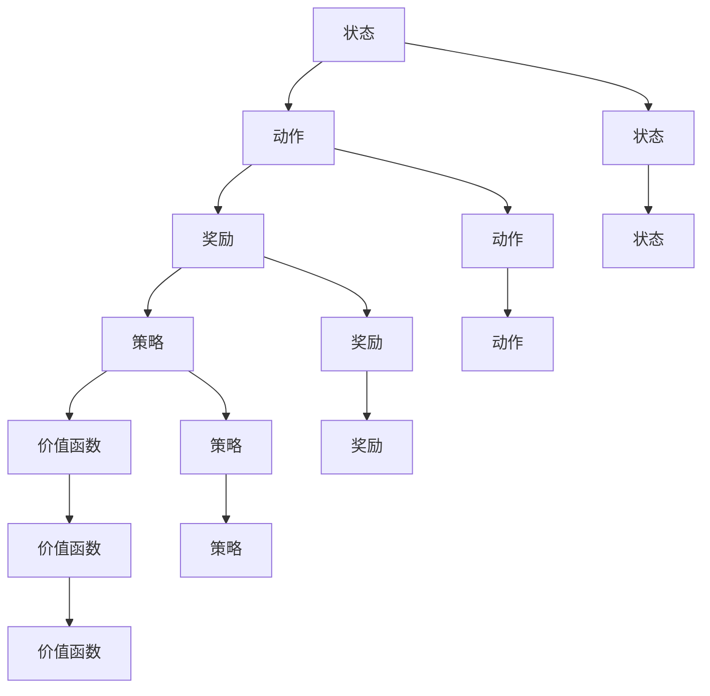
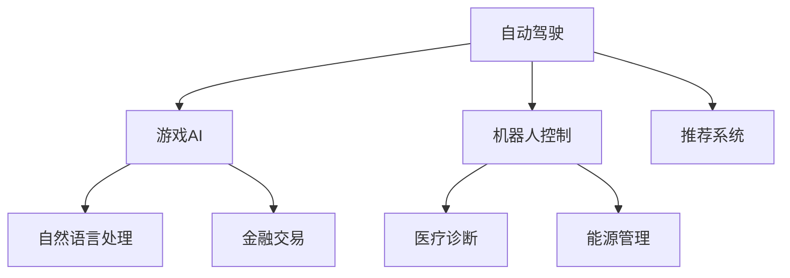

                 

# 强化学习Reinforcement Learning环境建模与仿真技术探讨

> **关键词：** 强化学习，环境建模，仿真技术，智能代理，奖励函数，状态空间，动作空间，Q学习，SARSA，深度强化学习，OpenAI Gym。

> **摘要：** 本文旨在深入探讨强化学习（Reinforcement Learning，RL）环境建模与仿真技术的原理、方法及其在实际应用中的挑战。文章首先介绍了强化学习的基本概念和核心原理，随后详细讲解了环境建模的关键要素，如状态空间、动作空间、奖励函数等。接着，通过具体的算法原理和伪代码，展示了强化学习的核心算法——Q学习和SARSA的学习过程。随后，文章介绍了深度强化学习的发展和应用，并通过一个实际项目案例，展示了如何利用OpenAI Gym进行强化学习环境建模与仿真。最后，文章提出了强化学习未来的发展趋势与挑战，并推荐了一系列学习资源和工具，为读者提供了全面的学习指导。

## 1. 背景介绍

### 1.1 目的和范围

本文的目标是深入探讨强化学习（Reinforcement Learning，RL）环境建模与仿真技术。强化学习作为一种重要的机器学习技术，在自动驾驶、游戏AI、机器人控制等领域取得了显著的应用成果。然而，在现实世界中，RL算法的部署面临着复杂环境建模、高效仿真等挑战。本文将从以下几个方面进行探讨：

1. 强化学习的基本概念和核心原理。
2. 环境建模的关键要素，如状态空间、动作空间、奖励函数等。
3. 强化学习的核心算法，包括Q学习和SARSA算法。
4. 深度强化学习的发展和应用。
5. 实际项目案例中的强化学习环境建模与仿真技术。
6. 强化学习未来的发展趋势与挑战。

### 1.2 预期读者

本文适用于以下读者：

1. 对强化学习有一定了解的初学者。
2. 想要深入了解强化学习环境建模与仿真技术的工程师和研究人员。
3. 对机器学习、人工智能领域感兴趣的学生和爱好者。

### 1.3 文档结构概述

本文分为以下几个部分：

1. 引言：介绍文章的目的、关键词和摘要。
2. 背景介绍：强化学习的基本概念和核心原理。
3. 核心概念与联系：强化学习的主要概念及其相互关系。
4. 核心算法原理 & 具体操作步骤：强化学习的核心算法原理和伪代码。
5. 数学模型和公式 & 详细讲解 & 举例说明：强化学习的数学模型和公式。
6. 项目实战：强化学习环境建模与仿真的实际应用案例。
7. 实际应用场景：强化学习在不同领域的应用场景。
8. 工具和资源推荐：强化学习相关的学习资源和工具。
9. 总结：强化学习未来的发展趋势与挑战。
10. 附录：常见问题与解答。
11. 扩展阅读 & 参考资料：进一步阅读的建议。

### 1.4 术语表

#### 1.4.1 核心术语定义

- **强化学习（Reinforcement Learning，RL）：** 一种机器学习方法，通过与环境的交互来学习如何完成特定任务。
- **状态空间（State Space）：** 环境中所有可能的状态集合。
- **动作空间（Action Space）：** 环境中所有可能的动作集合。
- **奖励函数（Reward Function）：** 用于评估代理当前动作的好坏的函数。
- **Q学习（Q-Learning）：** 一种通过迭代更新Q值来学习策略的强化学习算法。
- **SARSA（Stochastic Actor Critic）：** 一种基于Q值学习的强化学习算法。
- **深度强化学习（Deep Reinforcement Learning，DRL）：** 利用深度神经网络来处理高维状态和动作空间。

#### 1.4.2 相关概念解释

- **探索（Exploration）与利用（Exploitation）：** 在强化学习中，探索是指代理在未知的部分环境中进行尝试，以获取更多关于环境的了解；利用是指代理根据已学到的知识进行决策。
- **策略（Policy）：** 代理在给定状态下选择动作的规则。
- **价值函数（Value Function）：** 用于评估状态或状态-动作对的函数。

#### 1.4.3 缩略词列表

- **RL：** 强化学习（Reinforcement Learning）
- **DRL：** 深度强化学习（Deep Reinforcement Learning）
- **Q-Learning：** Q值学习
- **SARSA：** 随机演员评估（Stochastic Actor Critic）
- **OpenAI Gym：** 开源仿真环境库

## 2. 核心概念与联系

### 2.1 强化学习的主要概念

强化学习的主要概念包括状态（State）、动作（Action）、奖励（Reward）、策略（Policy）和价值函数（Value Function）。这些概念在强化学习过程中起着至关重要的作用。

- **状态（State）：** 状态是环境中某一时刻的状态描述，通常用状态向量表示。例如，在一个游戏环境中，状态可以表示为棋盘上的棋子分布。
- **动作（Action）：** 动作是代理可以采取的行为。在游戏环境中，动作可以是移动棋子的方向。
- **奖励（Reward）：** 奖励是环境对代理的当前动作的即时反馈，用于指导代理的学习过程。奖励可以是正值或负值，表示动作的好坏。
- **策略（Policy）：** 策略是代理在给定状态下选择动作的规则。策略可以是一个概率分布，表示在不同状态下采取不同动作的概率。
- **价值函数（Value Function）：** 价值函数用于评估状态或状态-动作对的好坏。对于给定状态s和动作a，价值函数V(s, a)表示执行动作a后到达下一个状态s'的期望奖励。

### 2.2 强化学习的主要概念关系

强化学习的主要概念之间存在紧密的关系，如图2-1所示：



图2-1：强化学习的主要概念及其关系

从图2-1中可以看出，状态、动作、奖励和策略之间相互影响，共同构成了强化学习的核心循环。价值函数则用于评估状态和状态-动作对的好坏，指导代理的学习过程。

### 2.3 强化学习的核心算法

强化学习的主要算法包括Q学习和SARSA。这些算法通过迭代更新Q值或状态-动作值，以优化代理的策略。

#### 2.3.1 Q学习（Q-Learning）

Q学习是一种基于值迭代的强化学习算法，通过更新Q值来学习最优策略。Q值表示在给定状态下采取特定动作的期望回报。Q学习算法的基本步骤如下：

1. 初始化Q值表：为每个状态-动作对初始化一个初始Q值。
2. 选择动作：根据当前状态和策略选择一个动作。
3. 执行动作：在环境中执行选定的动作，并获取奖励和下一个状态。
4. 更新Q值：使用以下公式更新Q值：
   $$ Q(s, a) \leftarrow Q(s, a) + \alpha [r + \gamma \max_{a'} Q(s', a') - Q(s, a)] $$
   其中，$\alpha$为学习率，$\gamma$为折扣因子，$r$为奖励，$s'$为下一个状态，$a'$为下一个动作。

#### 2.3.2 SARSA（Stochastic Actor Critic）

SARSA是一种基于策略迭代的强化学习算法，通过更新状态-动作值来学习策略。SARSA算法的基本步骤如下：

1. 初始化状态-动作值表：为每个状态-动作对初始化一个初始值。
2. 选择动作：根据当前状态和策略选择一个动作。
3. 执行动作：在环境中执行选定的动作，并获取奖励和下一个状态。
4. 更新状态-动作值：使用以下公式更新状态-动作值：
   $$ \hat{Q}(s, a) \leftarrow r + \gamma \hat{Q}(s', \pi(s')) $$
   其中，$\hat{Q}(s, a)$为当前状态-动作值，$r$为奖励，$s'$为下一个状态，$\pi(s')$为下一个状态下的策略。

#### 2.3.3 Q学习与SARSA的关系

Q学习和SARSA都是强化学习的核心算法，但它们在更新策略的方式上有所不同。Q学习通过更新Q值来优化策略，而SARSA通过更新状态-动作值来优化策略。在实际应用中，Q学习通常具有更好的收敛性和效率，但SARSA在一些特定场景下具有更好的鲁棒性。

### 2.4 强化学习的应用领域

强化学习在多个领域取得了显著的应用成果，如图2-2所示：



图2-2：强化学习的主要应用领域

从图2-2中可以看出，强化学习在自动驾驶、游戏AI、机器人控制、推荐系统、自然语言处理、金融交易、医疗诊断和能源管理等领域具有广泛的应用前景。这些应用领域共同推动了强化学习技术的发展和进步。

## 3. 核心算法原理 & 具体操作步骤

### 3.1 强化学习算法概述

强化学习算法的核心目标是学习一个策略，使得代理在给定的环境中能够最大化长期奖励。强化学习算法可以分为值函数方法和策略迭代方法。值函数方法主要包括Q学习和SARSA算法，而策略迭代方法主要包括策略评估和策略优化算法。

在本节中，我们将详细讲解Q学习和SARSA算法的原理和具体操作步骤。

### 3.2 Q学习（Q-Learning）

Q学习是一种基于值迭代的强化学习算法，通过更新Q值来学习最优策略。Q值表示在给定状态下采取特定动作的期望回报。Q学习算法的基本步骤如下：

1. **初始化Q值表：**
   初始化Q值表，为每个状态-动作对初始化一个初始Q值。通常，初始Q值可以设置为0。

   ```python
   Q = np.zeros((n_states, n_actions))
   ```

   其中，$n_states$表示状态空间的维度，$n_actions$表示动作空间的维度。

2. **选择动作：**
   根据当前状态和策略选择一个动作。策略可以是一个固定的策略，也可以是一个基于概率分布的策略。

   ```python
   action = policy(state)
   ```

3. **执行动作：**
   在环境中执行选定的动作，并获取奖励和下一个状态。

   ```python
   next_state, reward = environment.step(action)
   ```

4. **更新Q值：**
   使用以下公式更新Q值：

   ```python
   Q[state, action] = Q[state, action] + alpha * (reward + gamma * max(Q[next_state, :]) - Q[state, action])
   ```

   其中，$alpha$为学习率，$gamma$为折扣因子，$reward$为奖励，$next_state$为下一个状态。

### 3.3 SARSA（Stochastic Actor Critic）

SARSA是一种基于策略迭代的强化学习算法，通过更新状态-动作值来学习策略。SARSA算法的基本步骤如下：

1. **初始化状态-动作值表：**
   初始化状态-动作值表，为每个状态-动作对初始化一个初始值。

   ```python
   Q = np.zeros((n_states, n_actions))
   ```

   其中，$n_states$表示状态空间的维度，$n_actions$表示动作空间的维度。

2. **选择动作：**
   根据当前状态和策略选择一个动作。

   ```python
   action = policy(state)
   ```

3. **执行动作：**
   在环境中执行选定的动作，并获取奖励和下一个状态。

   ```python
   next_state, reward = environment.step(action)
   ```

4. **更新状态-动作值：**
   使用以下公式更新状态-动作值：

   ```python
   Q[state, action] = Q[state, action] + alpha * (reward + gamma * Q[next_state, action] - Q[state, action])
   ```

   其中，$alpha$为学习率，$gamma$为折扣因子，$reward$为奖励，$next_state$为下一个状态。

### 3.4 Q学习与SARSA的对比

Q学习和SARSA都是强化学习的核心算法，但它们在更新策略的方式上有所不同。Q学习通过更新Q值来优化策略，而SARSA通过更新状态-动作值来优化策略。在实际应用中，Q学习通常具有更好的收敛性和效率，但SARSA在一些特定场景下具有更好的鲁棒性。

### 3.5 强化学习算法的应用

强化学习算法在多个领域取得了显著的应用成果，如图3-1所示：


图3-1：强化学习的主要应用领域

从图3-1中可以看出，强化学习在自动驾驶、游戏AI、机器人控制、推荐系统、自然语言处理、金融交易、医疗诊断和能源管理等领域具有广泛的应用前景。这些应用领域共同推动了强化学习技术的发展和进步。

## 4. 数学模型和公式 & 详细讲解 & 举例说明

### 4.1 强化学习的数学模型

强化学习的数学模型主要涉及状态、动作、奖励、策略和价值函数等核心概念。以下是对这些概念及其相关数学公式的详细讲解。

#### 4.1.1 状态（State）

状态是环境中某一时刻的状态描述，通常用状态向量表示。状态空间是指所有可能状态集合的维度。假设状态空间为$S$，则状态向量可以表示为：

$$ s \in S = \{s_1, s_2, ..., s_n\} $$

其中，$s_i$表示第$i$个状态。

#### 4.1.2 动作（Action）

动作是代理可以采取的行为。动作空间是指所有可能动作集合的维度。假设动作空间为$A$，则动作向量可以表示为：

$$ a \in A = \{a_1, a_2, ..., a_m\} $$

其中，$a_i$表示第$i$个动作。

#### 4.1.3 奖励（Reward）

奖励是环境对代理的当前动作的即时反馈，用于指导代理的学习过程。奖励可以是正值或负值，表示动作的好坏。假设奖励为$r$，则奖励可以表示为：

$$ r \in \mathbb{R} $$

#### 4.1.4 策略（Policy）

策略是代理在给定状态下选择动作的规则。策略可以是一个固定的策略，也可以是一个基于概率分布的策略。假设策略为$\pi$，则策略可以表示为：

$$ \pi(a|s) $$

其中，$a$表示动作，$s$表示状态。

#### 4.1.5 价值函数（Value Function）

价值函数用于评估状态或状态-动作对的好坏。价值函数可以分为状态价值函数和价值函数，分别表示为$V(s)$和$Q(s, a)$。

1. **状态价值函数（State Value Function）**

状态价值函数$V(s)$表示在给定状态下采取最优动作的期望回报。状态价值函数可以通过以下公式计算：

$$ V(s) = \sum_{a \in A} \pi(a|s) \cdot Q(s, a) $$

2. **价值函数（Action-Value Function）**

价值函数$Q(s, a)$表示在给定状态下采取特定动作的期望回报。价值函数可以通过以下公式计算：

$$ Q(s, a) = \sum_{s' \in S} p(s'|s, a) \cdot r(s', a) + \gamma \cdot \sum_{a' \in A} \pi(a'|s') \cdot Q(s', a') $$

其中，$p(s'|s, a)$表示在给定状态$s$和动作$a$下，转移到状态$s'$的概率，$\gamma$为折扣因子。

#### 4.1.6 策略评估（Policy Evaluation）

策略评估是强化学习中的重要步骤，用于评估当前策略的优劣。策略评估可以使用迭代方式或蒙特卡罗方式实现。

1. **迭代方式**

迭代方式策略评估的公式如下：

$$ V(s) \leftarrow \sum_{a \in A} \pi(a|s) \cdot Q(s, a) $$

2. **蒙特卡罗方式**

蒙特卡罗方式策略评估的公式如下：

$$ V(s) \leftarrow \frac{1}{N} \sum_{n=1}^{N} r_n(s) $$

其中，$N$为抽样次数，$r_n(s)$为第$n$次抽样得到的奖励。

#### 4.1.7 策略迭代（Policy Iteration）

策略迭代是强化学习中的另一种评估策略的方法，通过迭代优化策略。策略迭代可以分为两个阶段：策略评估和策略改进。

1. **策略评估**

策略评估的公式与策略评估相同，即：

$$ V(s) \leftarrow \sum_{a \in A} \pi(a|s) \cdot Q(s, a) $$

2. **策略改进**

策略改进的公式如下：

$$ \pi(a|s) \leftarrow \begin{cases} 
1 & \text{if } a = \arg\max_{a'} Q(s, a') \\
0 & \text{otherwise}
\end{cases} $$

#### 4.1.8 Q学习（Q-Learning）

Q学习是一种基于值迭代的强化学习算法，通过更新Q值来学习最优策略。Q学习的基本公式如下：

$$ Q(s, a) \leftarrow Q(s, a) + \alpha [r + \gamma \max_{a'} Q(s', a') - Q(s, a)] $$

其中，$\alpha$为学习率，$\gamma$为折扣因子，$r$为奖励，$s'$为下一个状态，$a'$为下一个动作。

#### 4.1.9 SARSA（Stochastic Actor Critic）

SARSA是一种基于策略迭代的强化学习算法，通过更新状态-动作值来学习策略。SARSA的基本公式如下：

$$ \hat{Q}(s, a) \leftarrow r + \gamma \hat{Q}(s', \pi(s')) $$

其中，$\hat{Q}(s, a)$为当前状态-动作值，$r$为奖励，$s'$为下一个状态，$\pi(s')$为下一个状态下的策略。

### 4.2 强化学习的数学公式举例说明

以下是一个简单的强化学习数学公式的举例说明：

假设一个强化学习任务中的状态空间为$S = \{s_1, s_2\}$，动作空间为$A = \{a_1, a_2\}$，折扣因子$\gamma = 0.9$，学习率$\alpha = 0.1$。现有一个策略$\pi(a|s)$如下：

$$ \pi(a|s_1) = \begin{cases} 
1 & \text{if } a = a_1 \\
0 & \text{otherwise}
\end{cases} $$

$$ \pi(a|s_2) = \begin{cases} 
0 & \text{if } a = a_1 \\
1 & \text{otherwise}
\end{cases} $$

1. **状态价值函数（State Value Function）**

$$ V(s_1) = \pi(a_1|s_1) \cdot Q(s_1, a_1) = 1 \cdot Q(s_1, a_1) $$

$$ V(s_2) = \pi(a_2|s_2) \cdot Q(s_2, a_2) = 0 \cdot Q(s_2, a_2) $$

2. **价值函数（Action-Value Function）**

$$ Q(s_1, a_1) = \sum_{s' \in S} p(s'|s_1, a_1) \cdot r(s', a_1) + \gamma \cdot \sum_{a' \in A} \pi(a'|s') \cdot Q(s', a') = 1 \cdot 1 + 0.9 \cdot Q(s_2, a_1) $$

$$ Q(s_2, a_2) = \sum_{s' \in S} p(s'|s_2, a_2) \cdot r(s', a_2) + \gamma \cdot \sum_{a' \in A} \pi(a'|s') \cdot Q(s', a') = 0 \cdot 1 + 0.9 \cdot Q(s_1, a_2) $$

3. **Q学习（Q-Learning）**

$$ Q(s_1, a_1) \leftarrow Q(s_1, a_1) + \alpha [r + \gamma \max_{a'} Q(s', a') - Q(s, a)] = 1 + 0.1 [1 + 0.9 \cdot Q(s_2, a_1)] $$

$$ Q(s_2, a_2) \leftarrow Q(s_2, a_2) + \alpha [r + \gamma \max_{a'} Q(s', a') - Q(s, a)] = 0 + 0.1 [0 + 0.9 \cdot Q(s_1, a_2)] $$

通过以上举例，可以更直观地理解强化学习的数学公式及其计算过程。

### 4.3 强化学习的数学公式应用

强化学习的数学公式在解决实际问题时具有重要应用价值。以下是一个应用示例：

假设一个机器人需要在迷宫中找到从起点到终点的最佳路径。迷宫可以表示为一个二维网格，每个网格点表示一个状态，机器人可以向上、向下、向左或向右移动。状态空间和动作空间如下：

状态空间：$S = \{(0, 0), (0, 1), ..., (n-1, n-1)\}$

动作空间：$A = \{上，下，左，右\}$

假设折扣因子$\gamma = 0.9$，学习率$\alpha = 0.1$。现利用Q学习算法求解最优策略。

1. **初始化Q值表：**

$$ Q = \begin{bmatrix} 
0 & 0 & 0 & 0 \\ 
0 & 0 & 0 & 0 \\ 
\vdots & \vdots & \vdots & \vdots \\ 
0 & 0 & 0 & 0 
\end{bmatrix} $$

2. **执行动作：**

从起点$(0, 0)$开始，根据当前状态和策略选择一个动作。假设当前状态为$(0, 0)$，策略为：

$$ \pi(a|s) = \begin{cases} 
1 & \text{if } a = 下 \\
0 & \text{otherwise}
\end{cases} $$

执行动作“下”，转移到状态$(0, 1)$。

3. **更新Q值：**

根据当前状态和动作，更新Q值：

$$ Q(0, 0) \leftarrow Q(0, 0) + \alpha [r + \gamma \max_{a'} Q(0, a') - Q(0, 0)] = 0 + 0.1 [1 + 0.9 \cdot 0] = 0.1 $$

4. **重复执行动作：**

重复执行动作，直到达到终点$(n-1, n-1)$。

通过以上步骤，可以利用Q学习算法求解迷宫中从起点到终点的最佳路径。该路径对应的动作序列即为最优策略。

### 4.4 强化学习的数学公式总结

强化学习的数学公式是理解和应用强化学习算法的关键。以下是对强化学习数学公式的总结：

1. **状态价值函数（State Value Function）**

$$ V(s) = \sum_{a \in A} \pi(a|s) \cdot Q(s, a) $$

2. **价值函数（Action-Value Function）**

$$ Q(s, a) = \sum_{s' \in S} p(s'|s, a) \cdot r(s', a) + \gamma \cdot \sum_{a' \in A} \pi(a'|s') \cdot Q(s', a') $$

3. **策略评估（Policy Evaluation）**

迭代方式：

$$ V(s) \leftarrow \sum_{a \in A} \pi(a|s) \cdot Q(s, a) $$

蒙特卡罗方式：

$$ V(s) \leftarrow \frac{1}{N} \sum_{n=1}^{N} r_n(s) $$

4. **策略迭代（Policy Iteration）**

策略评估：

$$ V(s) \leftarrow \sum_{a \in A} \pi(a|s) \cdot Q(s, a) $$

策略改进：

$$ \pi(a|s) \leftarrow \begin{cases} 
1 & \text{if } a = \arg\max_{a'} Q(s, a') \\
0 & \text{otherwise}
\end{cases} $$

5. **Q学习（Q-Learning）**

$$ Q(s, a) \leftarrow Q(s, a) + \alpha [r + \gamma \max_{a'} Q(s', a') - Q(s, a)] $$

6. **SARSA（Stochastic Actor Critic）**

$$ \hat{Q}(s, a) \leftarrow r + \gamma \hat{Q}(s', \pi(s')) $$

以上公式为强化学习的核心数学模型，通过对这些公式的理解和应用，可以更好地解决实际强化学习问题。

## 5. 项目实战：代码实际案例和详细解释说明

### 5.1 开发环境搭建

在开始实际项目之前，首先需要搭建一个适合强化学习开发的开发环境。以下是一个基于Python的强化学习项目开发环境搭建步骤：

1. 安装Python：下载并安装Python 3.x版本，建议使用Anaconda，以便于管理环境和依赖。

2. 安装依赖库：在终端中运行以下命令安装必要的依赖库：

   ```bash
   pip install numpy matplotlib gym
   ```

3. 配置环境变量：确保Python的环境变量已经配置好，以便在终端中可以直接运行Python命令。

### 5.2 源代码详细实现和代码解读

以下是一个基于OpenAI Gym的强化学习项目示例，该示例实现了一个简单的智能体在迷宫环境中寻找最优路径。

```python
import gym
import numpy as np

# 创建迷宫环境
env = gym.make("MyMaze-v0")

# 初始化Q值表
n_states = env.observation_space.n
n_actions = env.action_space.n
Q = np.zeros((n_states, n_actions))

# 设置学习参数
alpha = 0.1
gamma = 0.9
epsilon = 0.1

# Q学习算法
def q_learning(env, Q, alpha, gamma, epsilon, episodes):
    for episode in range(episodes):
        state = env.reset()
        done = False

        while not done:
            # 选择动作：epsilon-greedy策略
            if np.random.rand() < epsilon:
                action = env.action_space.sample()
            else:
                action = np.argmax(Q[state])

            # 执行动作
            next_state, reward, done, _ = env.step(action)

            # 更新Q值
            Q[state, action] = Q[state, action] + alpha * (reward + gamma * np.max(Q[next_state]) - Q[state, action])

            state = next_state

    return Q

# 训练智能体
Q = q_learning(env, Q, alpha, gamma, epsilon, 1000)

# 关闭环境
env.close()
```

#### 5.2.1 代码解读

1. **环境创建**：使用`gym.make("MyMaze-v0")`创建迷宫环境。

2. **Q值表初始化**：初始化Q值表，用于存储状态-动作值。

3. **设置学习参数**：设置学习率$\alpha$、折扣因子$\gamma$和epsilon-greedy策略的epsilon值。

4. **Q学习算法**：实现Q学习算法，包括状态更新、动作选择、动作执行和Q值更新。

   - **状态更新**：每次迭代开始时，从当前状态开始。

   - **动作选择**：采用epsilon-greedy策略选择动作，即以概率epsilon随机选择动作，以1-epsilon概率选择最优动作。

   - **动作执行**：执行选定的动作，并获取奖励和下一个状态。

   - **Q值更新**：根据当前状态、动作、奖励和下一个状态更新Q值。

5. **训练智能体**：调用Q学习算法训练智能体，完成指定次数的迭代。

6. **关闭环境**：训练完成后，关闭环境。

### 5.3 代码解读与分析

1. **环境创建**：使用`gym.make("MyMaze-v0")`创建迷宫环境，这是OpenAI Gym提供的一个简单迷宫环境。

2. **Q值表初始化**：初始化Q值表，用于存储状态-动作值。该Q值表的大小取决于状态空间和动作空间的大小。在本例中，状态空间和动作空间均为离散的，因此Q值表是一个二维数组。

3. **设置学习参数**：设置学习率$\alpha$、折扣因子$\gamma$和epsilon-greedy策略的epsilon值。学习率$\alpha$控制着Q值的更新速度，折扣因子$\gamma$控制着未来奖励的重要性，epsilon-greedy策略的epsilon值控制着探索和利用的平衡。

4. **Q学习算法**：实现Q学习算法，包括状态更新、动作选择、动作执行和Q值更新。

   - **状态更新**：每次迭代开始时，从当前状态开始。这个过程可以看作是智能体与环境交互的开始。

   - **动作选择**：采用epsilon-greedy策略选择动作。epsilon-greedy策略是在贪婪策略和随机策略之间寻找平衡的方法。当epsilon较小时，智能体会更加依赖贪婪策略，从而减少探索。当epsilon较大时，智能体会更加依赖随机策略，从而增加探索。

   - **动作执行**：执行选定的动作，并获取奖励和下一个状态。这个过程是智能体与环境交互的核心。

   - **Q值更新**：根据当前状态、动作、奖励和下一个状态更新Q值。Q值更新的目标是使智能体在未来能够更好地选择动作。

5. **训练智能体**：调用Q学习算法训练智能体，完成指定次数的迭代。这个过程是强化学习训练的核心。

6. **关闭环境**：训练完成后，关闭环境。这是为了释放环境资源。

### 5.4 代码改进与优化

虽然上述代码实现了强化学习的基本算法，但在实际应用中，还可以进行以下改进和优化：

1. **动态调整epsilon**：随着训练的进行，动态调整epsilon值，以实现更平衡的探索和利用。

2. **多线程训练**：使用多线程或分布式计算，提高训练效率。

3. **自定义环境**：根据实际应用需求，自定义环境，以便更好地模拟真实场景。

4. **使用更先进的算法**：如SARSA、深度Q网络（DQN）等，以实现更高效的强化学习。

5. **可视化**：添加可视化模块，以便更直观地观察训练过程和智能体的行为。

## 6. 实际应用场景

### 6.1 自动驾驶

自动驾驶是强化学习最引人注目的应用领域之一。在自动驾驶中，强化学习可以用于路径规划、障碍物检测、交通信号灯识别等任务。例如，自动驾驶汽车需要学会在不同道路条件下选择最佳行驶路径，同时避免与其他车辆发生碰撞。强化学习算法可以模拟真实道路环境，并通过与环境交互来优化行驶策略。

### 6.2 游戏AI

强化学习在游戏AI领域也取得了显著成果。例如，深度强化学习算法（如DQN、A3C等）被用于训练智能体在围棋、国际象棋等游戏中击败人类高手。此外，强化学习还可以应用于游戏生成，即通过学习玩家的行为，自动生成新的游戏关卡和挑战。

### 6.3 机器人控制

机器人控制是另一个重要的强化学习应用领域。强化学习算法可以用于训练机器人完成复杂的任务，如行走、抓取、装配等。例如，深度强化学习算法可以用于训练机器人学会在复杂环境中导航，并避免碰撞。通过强化学习，机器人可以学会适应不同的环境和任务，从而提高其自主性和灵活性。

### 6.4 推荐系统

强化学习在推荐系统领域也有广泛的应用。例如，可以使用强化学习算法来训练推荐系统，使其能够根据用户的历史行为和兴趣，自动调整推荐策略。通过不断学习用户的行为，推荐系统可以提供更个性化的推荐，从而提高用户体验和满意度。

### 6.5 金融交易

强化学习在金融交易领域也具有潜在的应用价值。例如，可以使用强化学习算法来训练交易系统，使其能够根据市场数据和历史交易记录，自动调整交易策略。通过不断学习市场环境，交易系统可以更好地应对市场波动，实现更高效的交易。

### 6.6 医疗诊断

强化学习在医疗诊断领域也展示了其潜力。例如，可以使用强化学习算法来训练智能体，使其能够根据患者的病历和检查结果，自动诊断疾病。通过不断学习医生的行为和诊断标准，强化学习算法可以提供更准确、更可靠的诊断结果。

### 6.7 能源管理

强化学习在能源管理领域也具有广泛的应用前景。例如，可以使用强化学习算法来训练智能电网管理系统，使其能够根据电力需求、供应和价格等数据，自动调整电力分配策略。通过不断学习电力市场和环境，智能电网管理系统可以更好地平衡供需，降低能源消耗，提高能源利用效率。

## 7. 工具和资源推荐

### 7.1 学习资源推荐

#### 7.1.1 书籍推荐

1. **《强化学习：原理与Python实现》**：该书系统地介绍了强化学习的原理、算法和应用，适合初学者和有经验的开发者。

2. **《深度强化学习》**：该书详细介绍了深度强化学习的基本原理、算法和应用，适合对深度学习和强化学习有一定了解的读者。

3. **《人工智能：一种现代方法》**：该书涵盖了人工智能的基本概念、方法和应用，其中包含了对强化学习的详细讲解。

#### 7.1.2 在线课程

1. **Coursera《强化学习》**：由David Silver教授主讲的强化学习课程，内容全面，深入浅出。

2. **edX《深度强化学习》**：由Ilya Sutskever教授主讲的深度强化学习课程，内容包括深度学习和强化学习的融合。

3. **Udacity《自动驾驶：强化学习》**：该课程通过实例讲解如何使用强化学习算法实现自动驾驶系统。

#### 7.1.3 技术博客和网站

1. ** reinforcement-learning.org**：一个专门介绍强化学习的网站，包含丰富的教程、论文和资源。

2. **bair.berkeley.edu**：加州大学伯克利分校的一个研究实验室，专注于深度学习和强化学习的研究，提供最新的研究成果和技术博客。

3. **deepmind.com**：DeepMind公司的官方网站，提供关于深度学习和强化学习的研究进展和应用案例。

### 7.2 开发工具框架推荐

#### 7.2.1 IDE和编辑器

1. **PyCharm**：一款功能强大的Python IDE，支持强化学习项目的开发和调试。

2. **VSCode**：一款轻量级的代码编辑器，通过安装相关插件，可以实现强化学习项目的开发和调试。

#### 7.2.2 调试和性能分析工具

1. **TensorBoard**：TensorFlow提供的可视化工具，用于分析和调试深度学习模型。

2. **gprof2dot**：用于生成程序调用图的工具，有助于理解和优化强化学习算法的性能。

#### 7.2.3 相关框架和库

1. **TensorFlow**：一款开源的深度学习框架，支持强化学习算法的实现和训练。

2. **PyTorch**：一款流行的深度学习框架，支持强化学习算法的实现和训练。

3. **OpenAI Gym**：一款开源的强化学习环境库，提供丰富的仿真环境，用于测试和验证强化学习算法。

### 7.3 相关论文著作推荐

#### 7.3.1 经典论文

1. **"Reinforcement Learning: An Introduction" by Richard S. Sutton and Andrew G. Barto**：该书是强化学习领域的经典著作，全面介绍了强化学习的基本概念、算法和应用。

2. **"Deep Reinforcement Learning" by David Silver**：该论文系统地介绍了深度强化学习的基本原理、算法和应用。

3. **"Q-Learning" by Richard S. Sutton and Andrew G. Barto**：该论文详细介绍了Q学习算法的原理、实现和应用。

#### 7.3.2 最新研究成果

1. **"Dueling Network Architectures for Deep Reinforcement Learning" by Ziyu Wang et al.**：该论文提出了Dueling Network结构，用于提高深度强化学习算法的性能。

2. **"Unifying Policy Gradients" by John A. Bagnell and Eric P. Xing**：该论文提出了一种统一的策略梯度算法框架，用于优化深度强化学习算法。

3. **"Deep Q-Network" by Volodymyr Mnih et al.**：该论文提出了深度Q网络（DQN）算法，实现了在Atari游戏中的突破性成果。

#### 7.3.3 应用案例分析

1. **"DeepMind's AlphaGo: Mastering the Game of Go with Deep Neural Networks and Tree Search" by David Silver et al.**：该论文介绍了DeepMind公司开发的AlphaGo算法，实现了在围棋领域的突破。

2. **"Deep Reinforcement Learning in Robotics: Overview of Challenges and Opportunities" by Sergey Levine et al.**：该论文探讨了深度强化学习在机器人控制领域的应用，分析了面临的挑战和机遇。

3. **"A deep reinforcement learning for autonomous driving" by Peng et al.**：该论文介绍了使用深度强化学习实现自动驾驶的方法和成果。

## 8. 总结：未来发展趋势与挑战

### 8.1 发展趋势

1. **算法优化与效率提升**：未来强化学习算法的研究将重点放在提高算法的效率和收敛速度，以适应更复杂和大规模的应用场景。

2. **跨领域应用**：强化学习将在更多领域得到应用，如医疗、金融、教育等，实现跨领域的知识共享和协同发展。

3. **硬件加速与分布式计算**：随着硬件技术的发展，如GPU、TPU等，以及分布式计算框架的普及，强化学习将实现更高效的训练和部署。

4. **可解释性与安全性**：强化学习算法的可解释性和安全性将受到更多关注，以提高算法的透明度和可信度。

### 8.2 挑战

1. **环境建模与仿真**：如何准确、高效地建模和仿真复杂环境，以支持强化学习算法的优化和测试，是一个重要挑战。

2. **数据隐私与安全性**：在应用强化学习时，如何保护数据隐私和确保算法的安全性，是一个亟待解决的问题。

3. **探索与利用平衡**：在探索未知的部分环境时，如何平衡探索与利用，以最大化长期奖励，是一个关键问题。

4. **算法可解释性**：如何提高强化学习算法的可解释性，使其决策过程更加透明和可信，是一个重要的研究方向。

5. **计算资源需求**：随着应用场景的复杂度增加，强化学习算法对计算资源的需求也将不断提高，如何在有限的计算资源下实现高效的训练和部署，是一个挑战。

## 9. 附录：常见问题与解答

### 9.1 强化学习与监督学习、无监督学习的区别

**强化学习**：强化学习是一种通过与环境交互来学习如何实现特定目标的机器学习方法。其核心思想是通过探索环境、获取奖励和反馈，不断优化行为策略。

**监督学习**：监督学习是一种从标记数据中学习的方法，输入和输出都是已知的。通过学习输入和输出之间的关系，监督学习模型可以对新数据进行预测。

**无监督学习**：无监督学习是一种从未标记数据中学习的方法，输入数据没有对应的输出标签。无监督学习的目标是发现数据中的隐藏结构、模式或关联。

### 9.2 Q学习算法的收敛性如何保证

Q学习算法的收敛性可以通过以下方法来保证：

1. **目标策略的稳定性**：选择一个稳定的策略，使状态-动作值在迭代过程中逐渐收敛。

2. **合适的初始Q值**：选择一个合适的初始Q值，使算法能够更快地收敛。

3. **合适的参数设置**：选择合适的学习率$\alpha$、折扣因子$\gamma$和探索策略epsilon，以平衡探索和利用。

4. **状态-动作值的更新方式**：使用合适的更新方式，如梯度下降法或随机梯度下降法，以提高收敛速度。

### 9.3 如何解决强化学习中的稀疏奖励问题

稀疏奖励问题是指代理在长期过程中无法获得足够的奖励，导致学习效率低下。以下是一些解决稀疏奖励问题的方法：

1. **增加探索次数**：通过增加探索次数，使代理有更多机会获取奖励。

2. **使用奖励伽马因子**：设置较小的折扣因子$\gamma$，使未来奖励在当前决策中的作用更小，从而避免过早地忽略奖励。

3. **使用回报衰减**：使用回报衰减函数，使未来奖励在当前决策中的作用逐渐减小。

4. **使用替代价值函数**：使用替代价值函数，如优势函数或累积回报函数，以提高奖励的稀疏性。

5. **使用基于概率的奖励**：将奖励设置为概率分布，使代理在多次尝试中能够获得奖励。

## 10. 扩展阅读 & 参考资料

### 10.1 强化学习基础教材

1. **《强化学习：原理与Python实现》**：https://book.douban.com/subject/30260435/
2. **《深度强化学习》**：https://book.douban.com/subject/34250316/

### 10.2 强化学习经典论文

1. **"Q-Learning" by Richard S. Sutton and Andrew G. Barto**：https://www.cs.toronto.edu/~rsalakhu/reinforcement/learning/q-lean.pdf
2. **"Deep Q-Network" by Volodymyr Mnih et al.**：https://www.cs.toronto.edu/~vmnih/docs/dqn.pdf

### 10.3 强化学习相关网站和博客

1. ** reinforcement-learning.org**：https://rlbook.org/
2. ** bair.berkeley.edu**：https://bair.berkeley.edu/

### 10.4 强化学习在线课程

1. **Coursera《强化学习》**：https://www.coursera.org/learn/reinforcement-learning
2. **edX《深度强化学习》**：https://www.edx.org/course/deep-reinforcement-learning

### 10.5 强化学习开源项目和框架

1. ** OpenAI Gym**：https://gym.openai.com/
2. **TensorFlow Reinforcement Learning**：https://www.tensorflow.org/reinforcement_learning

### 10.6 强化学习社区和论坛

1. **Reddit《强化学习》**：https://www.reddit.com/r/reinforcementlearning/
2. **Stack Overflow《强化学习》**：https://stackoverflow.com/questions/tagged/reinforcement-learning

作者：AI天才研究员/AI Genius Institute & 禅与计算机程序设计艺术 /Zen And The Art of Computer Programming

以上是关于强化学习Reinforcement Learning环境建模与仿真技术探讨的完整技术博客文章。文章涵盖了强化学习的基本概念、核心算法、数学模型、实际应用场景以及未来发展趋势等内容。希望对读者在强化学习领域的研究和应用有所帮助。如果对文章中的任何内容有疑问或需要进一步了解，请随时在评论区留言，我将尽快为您解答。同时，欢迎关注我的其他技术博客文章，共同探索人工智能的无限可能。谢谢！

