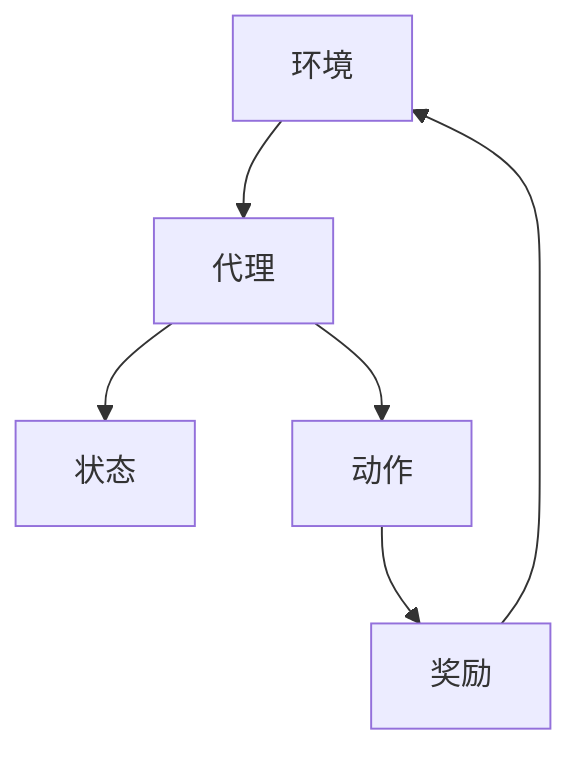

                 

# 强化学习原理与代码实例讲解

> 关键词：强化学习，Q-Learning，深度强化学习，DQN，REINFORCE，代码实例，项目实战

> 摘要：本文将深入探讨强化学习的基本原理及其在计算机编程和人工智能领域的应用。通过实例代码的讲解，帮助读者理解强化学习算法的实战应用，掌握从数学模型到代码实现的完整过程。

## 1. 背景介绍

### 1.1 目的和范围

本文旨在介绍强化学习的基本概念、核心算法以及实际应用。我们将通过实例代码的演示，帮助读者理解强化学习的实现过程，并能够独立进行强化学习项目的开发和优化。

### 1.2 预期读者

本文适合对机器学习和人工智能有一定了解的读者，特别是希望深入了解强化学习算法及其应用的工程师和研究人员。

### 1.3 文档结构概述

本文分为十个部分：

1. **背景介绍**：介绍本文的目的、预期读者和文档结构。
2. **核心概念与联系**：通过Mermaid流程图展示强化学习的核心概念和架构。
3. **核心算法原理 & 具体操作步骤**：讲解强化学习的基本算法原理和实现步骤。
4. **数学模型和公式 & 详细讲解 & 举例说明**：阐述强化学习的数学模型和公式，并进行实例说明。
5. **项目实战：代码实际案例和详细解释说明**：通过实际代码实例展示强化学习在项目中的应用。
6. **实际应用场景**：探讨强化学习在现实世界的应用。
7. **工具和资源推荐**：推荐学习资源和开发工具。
8. **总结：未来发展趋势与挑战**：总结强化学习的发展趋势和面临的挑战。
9. **附录：常见问题与解答**：回答读者可能遇到的问题。
10. **扩展阅读 & 参考资料**：提供进一步阅读的资料。

### 1.4 术语表

#### 1.4.1 核心术语定义

- **强化学习**：一种机器学习方法，通过奖励信号来引导算法做出最优决策。
- **状态**：系统当前所处的情境。
- **动作**：系统能够执行的操作。
- **奖励**：动作带来的即时回报。
- **策略**：决策规则，决定在特定状态下应该采取的动作。
- **Q值**：表示在特定状态下执行特定动作的预期回报。

#### 1.4.2 相关概念解释

- **探索与利用**：在强化学习中，探索是指尝试新的动作，利用是指选择已经证明效果好的动作。
- **值函数**：描述状态和动作组合的预期回报。
- **策略迭代**：通过更新策略来优化学习过程。

#### 1.4.3 缩略词列表

- **Q-Learning**：一种强化学习算法，通过迭代更新Q值来学习策略。
- **DQN**：深度Q网络，使用深度神经网络来近似Q值函数。
- **REINFORCE**：一种基于梯度上升的强化学习算法。

## 2. 核心概念与联系

### 2.1 强化学习的基本架构

强化学习系统由四个主要组件组成：环境（Environment）、代理（Agent）、状态（State）和动作（Action）。环境是一个外部系统，它根据代理的动作提供状态和奖励。代理通过观察状态并选择动作来与环境交互。其目标是通过学习最大化总奖励。

### 2.2 Mermaid流程图

以下是一个Mermaid流程图，展示了强化学习的基本架构和组件之间的联系：



### 2.3 强化学习的核心概念

- **状态-动作价值函数（Q值）**：描述在特定状态下执行特定动作的预期回报。
- **策略**：决策规则，用于选择动作。
- **值函数**：评估状态的预期回报。
- **模型**：环境的状态转换和奖励分布的数学表示。

## 3. 核心算法原理 & 具体操作步骤

### 3.1 Q-Learning算法原理

Q-Learning是一种基于值迭代的强化学习算法。它的核心思想是更新状态-动作值函数（Q值），以找到最优策略。

### 3.2 Q-Learning算法步骤

1. **初始化**：设置Q值的初始估计，通常使用随机值。
2. **选择动作**：在给定状态下，根据策略选择动作。可以使用ε-贪心策略，即以一定的概率随机选择动作，以进行探索。
3. **执行动作**：执行选择的动作，并观察环境反馈的新状态和奖励。
4. **更新Q值**：使用下面的更新规则来迭代更新Q值：
   $$ Q(s, a) \leftarrow Q(s, a) + \alpha [r + \gamma \max_{a'} Q(s', a') - Q(s, a)] $$
   其中，$\alpha$是学习率，$\gamma$是折扣因子，$r$是即时奖励，$s$和$s'$是当前和下一个状态，$a$和$a'$是当前和下一个动作。

### 3.3 伪代码

以下是Q-Learning算法的伪代码：

```python
# 初始化Q值矩阵
Q = 初始化为随机值

# 设置学习率和折扣因子
alpha = 0.1
gamma = 0.9

# 设置探索概率
epsilon = 1.0

# 设置训练轮数
num_episodes = 1000

for episode in 1 to num_episodes:
    # 初始化状态
    state = 环境初始化状态
    
    done = False
    
    while not done:
        # 选择动作
        if random() < epsilon:
            action = 随机选择动作
        else:
            action = 选择动作使得Q值最大
        
        # 执行动作
        next_state, reward, done = 环境执行动作(action)
        
        # 更新Q值
        Q[state, action] = Q[state, action] + alpha * (reward + gamma * max(Q[next_state, :]) - Q[state, action])
        
        # 更新状态
        state = next_state
        
        # 减小探索概率
        epsilon = epsilon * (1 - 1/episode)

# 输出最优策略
print("最优策略：", np.argmax(Q, axis=1))
```

### 3.4 Q-Learning算法解释

- **初始化**：初始化Q值矩阵，通常使用随机值，以开始学习过程。
- **选择动作**：根据ε-贪心策略选择动作，以平衡探索和利用。
- **执行动作**：执行选定的动作，并获取新状态和奖励。
- **更新Q值**：使用TD误差更新Q值，以逐步提高策略的质量。
- **减小探索概率**：随着训练的进行，逐渐减小ε，以减少随机动作的概率。

## 4. 数学模型和公式 & 详细讲解 & 举例说明

### 4.1 数学模型

强化学习中的数学模型主要涉及状态-动作价值函数（Q值）和策略的更新。以下是其主要公式：

- **状态-动作价值函数更新公式**：
  $$ Q(s, a) \leftarrow Q(s, a) + \alpha [r + \gamma \max_{a'} Q(s', a') - Q(s, a)] $$
  
- **策略更新公式**（ε-贪心策略）：
  $$ \text{if } random() < \epsilon, \text{ then choose a random action else choose an action that maximizes } Q(s, a) $$

### 4.2 举例说明

假设我们有一个简单的环境，其中有两个状态（A和B）和两个动作（U和D）。以下是Q-Learning算法在这个环境中的示例：

1. **初始化Q值**：
   $$ Q = \begin{bmatrix} 
   0 & 0 \\
   0 & 0 
   \end{bmatrix} $$

2. **第一轮**：
   - 初始状态：A
   - ε-贪心策略：选择U（50%的概率）
   - 执行动作U，得到奖励+1，转移到状态B
   - 更新Q值：
     $$ Q(A, U) = 0 + 0.1 [1 + 0.9 \times \max(Q(B, U), Q(B, D))] $$
     $$ Q(A, U) = 0.1 + 0.9 \times \max(0, 0) $$
     $$ Q(A, U) = 0.1 $$

3. **第二轮**：
   - 状态：B
   - ε-贪心策略：选择D（50%的概率）
   - 执行动作D，得到奖励-1，转移到状态A
   - 更新Q值：
     $$ Q(B, D) = 0 + 0.1 [-1 + 0.9 \times \max(Q(A, U), Q(A, D))] $$
     $$ Q(B, D) = 0.1 - 0.1 + 0.9 \times \max(0.1, 0) $$
     $$ Q(B, D) = 0.1 $$

4. **第三轮**：
   - 状态：A
   - ε-贪心策略：选择U（50%的概率）
   - 执行动作U，得到奖励+1，转移到状态B
   - 更新Q值：
     $$ Q(A, U) = 0.1 + 0.1 [1 + 0.9 \times \max(Q(B, U), Q(B, D))] $$
     $$ Q(A, U) = 0.1 + 0.1 [1 + 0.9 \times \max(0.1, 0.1)] $$
     $$ Q(A, U) = 0.1 + 0.1 [1 + 0.9 \times 0.2] $$
     $$ Q(A, U) = 0.1 + 0.1 [1 + 0.18] $$
     $$ Q(A, U) = 0.1 + 0.1 \times 1.18 $$
     $$ Q(A, U) = 0.1 + 0.118 $$
     $$ Q(A, U) = 0.218 $$

通过多次迭代，Q值将逐渐收敛到最优值，从而确定最优策略。

## 5. 项目实战：代码实际案例和详细解释说明

### 5.1 开发环境搭建

在进行强化学习项目之前，我们需要搭建一个合适的开发环境。以下是使用Python和TensorFlow进行强化学习项目所需的环境搭建步骤：

1. **安装Python**：确保安装了Python 3.x版本。
2. **安装TensorFlow**：使用以下命令安装TensorFlow：
   ```bash
   pip install tensorflow
   ```
3. **安装其他依赖**：安装其他可能需要的依赖，例如Numpy和Matplotlib：
   ```bash
   pip install numpy matplotlib
   ```

### 5.2 源代码详细实现和代码解读

以下是一个简单的强化学习项目，使用Q-Learning算法训练一个智能体在环境中的行为。我们将使用一个经典的例子——智能体在一个网格世界中寻找食物。

```python
import numpy as np
import random
import matplotlib.pyplot as plt

# 定义环境
class Environment:
    def __init__(self, size=5):
        self.size = size
        self.state = [0, 0]  # 初始状态（x, y）

    def step(self, action):
        # 更新状态
        if action == 0:  # 向上
            self.state[1] = max(self.state[1] - 1, 0)
        elif action == 1:  # 向下
            self.state[1] = min(self.state[1] + 1, self.size - 1)
        elif action == 2:  # 向左
            self.state[0] = max(self.state[0] - 1, 0)
        elif action == 3:  # 向右
            self.state[0] = min(self.state[0] + 1, self.size - 1)

        # 计算奖励
        reward = 0
        if self.state == [2, 2]:  # 到达食物位置
            reward = 1
        elif self.state == [0, 0]:  # 返回起点
            reward = -1

        # 返回下一个状态和奖励
        return self.state, reward

    def reset(self):
        # 重置环境
        self.state = [0, 0]

# 定义智能体
class Agent:
    def __init__(self, alpha=0.1, gamma=0.9, epsilon=1.0):
        self.alpha = alpha
        self.gamma = gamma
        self.epsilon = epsilon
        self.Q = np.zeros((3, 3))

    def choose_action(self, state):
        if random() < self.epsilon:
            action = random.randint(0, 2)  # 探索
        else:
            action = np.argmax(self.Q[state[0], state[1]])  # 利用
        return action

    def learn(self, state, action, reward, next_state):
        Q_current = self.Q[state[0], state[1]]
        Q_next = self.Q[next_state[0], next_state[1]]
        self.Q[state[0], state[1]] = Q_current + self.alpha * (reward + self.gamma * Q_next - Q_current)

# 实例化环境和智能体
env = Environment()
agent = Agent()

# 训练智能体
episodes = 1000
rewards = []

for episode in range(episodes):
    state = env.reset()
    done = False
    total_reward = 0

    while not done:
        action = agent.choose_action(state)
        next_state, reward = env.step(action)
        agent.learn(state, action, reward, next_state)
        state = next_state
        total_reward += reward

        if reward == 1:
            done = True

    rewards.append(total_reward)

    if episode % 100 == 0:
        print(f"Episode: {episode}, Total Reward: {total_reward}")

# 可视化训练结果
plt.plot(rewards)
plt.xlabel("Episode")
plt.ylabel("Total Reward")
plt.show()
```

### 5.3 代码解读与分析

- **环境（Environment）**：定义了一个简单的网格世界，智能体可以在其中移动，并接收奖励或惩罚。
- **智能体（Agent）**：实现了Q-Learning算法的核心部分，包括选择动作和更新Q值的操作。
- **训练过程**：智能体在给定数量的训练回合中学习，每个回合结束时记录总奖励。
- **可视化**：使用Matplotlib将训练过程中的总奖励绘制为折线图。

通过这个简单的案例，我们可以看到如何使用Q-Learning算法在环境中训练智能体，并逐步提高其表现。

## 6. 实际应用场景

强化学习在计算机科学和人工智能领域有着广泛的应用，以下是一些实际应用场景：

- **游戏**：如电子游戏和棋类游戏，强化学习算法可以训练智能体进行游戏，并在复杂策略决策中取得优异成绩。
- **机器人**：在机器人控制中，强化学习算法可以训练机器人执行复杂的任务，如路径规划和运动控制。
- **推荐系统**：在推荐系统中，强化学习可以用于优化用户交互，提高推荐系统的效果。
- **智能交通系统**：强化学习可以用于交通流量管理，优化交通信号灯控制，减少拥堵。
- **金融**：在金融领域中，强化学习可以用于股票交易和风险控制，优化投资策略。

## 7. 工具和资源推荐

### 7.1 学习资源推荐

#### 7.1.1 书籍推荐

- 《强化学习：原理与Python实现》（Reinforcement Learning: An Introduction）
- 《深度强化学习》（Deep Reinforcement Learning）
- 《强化学习实践：掌握智能体的决策过程》（Reinforcement Learning with Python）

#### 7.1.2 在线课程

- Coursera的《强化学习》课程
- edX的《深度强化学习》课程
- Udacity的《强化学习工程师纳米学位》

#### 7.1.3 技术博客和网站

- [ reinforcement-learningforcement-learning.com](https://www.reinforcement-learning.com)
- [ OpenAI Blog](https://blog.openai.com)
- [ ArXiv](https://arxiv.org)

### 7.2 开发工具框架推荐

#### 7.2.1 IDE和编辑器

- PyCharm
- VSCode
- Jupyter Notebook

#### 7.2.2 调试和性能分析工具

- TensorBoard
- Matplotlib
- W&B

#### 7.2.3 相关框架和库

- TensorFlow
- PyTorch
- RLlib

### 7.3 相关论文著作推荐

#### 7.3.1 经典论文

- [ " Reinforcement Learning: An Introduction" by Richard S. Sutton and Andrew G. Barto](https://webdocs.cs.ualberta.ca/~sutton/book/ebook/the-update-rule.html)
- [ "Deep Q-Network" by Volodymyr Mnih et al.](https://www.cs.toronto.edu/~vmnih/docs/dqn.pdf)

#### 7.3.2 最新研究成果

- [ "Unclipped Deep Q-Learning" by Andrej Karpathy](https://karpathy.github.io/2016/05/31/dqn-uncertainty/)
- [ "Prioritized Experience Replay" by Volodymyr Mnih et al.](https://arxiv.org/abs/1511.05952)

#### 7.3.3 应用案例分析

- [ "DeepMind的人工智能系统战胜世界围棋冠军" by DeepMind](https://deepmind.com/research/publications/alphago-the-remarkable-achievement-of-deepmind%E2%80%A8%E2%80%A8)
- [ "Uber的智能派单系统" by Uber Engineering](https://eng.uber.com/rl-prediction/)

## 8. 总结：未来发展趋势与挑战

强化学习在近年来取得了显著的进展，其在复杂环境中的应用也越来越广泛。未来，强化学习的发展趋势可能包括：

- **模型压缩**：为了提高实时性能和可部署性，研究人员将致力于开发更高效、更紧凑的强化学习模型。
- **多任务学习**：强化学习算法将能够同时处理多个任务，提高智能体在不同任务中的适应性。
- **安全性与可解释性**：强化学习算法的安全性、可解释性和透明度将得到进一步研究，以提高其在实际应用中的信任度。
- **集成其他领域技术**：如强化学习与深度学习、强化学习与图神经网络等技术的结合，以解决更复杂的问题。

然而，强化学习也面临一些挑战，包括：

- **计算效率**：强化学习通常需要大量的数据和时间来训练，特别是在复杂环境中。
- **稳定性和收敛性**：在非平稳环境中，强化学习算法可能难以稳定收敛到最优策略。
- **安全性**：在某些应用中，强化学习算法的决策可能对系统安全产生重大影响，需要确保算法的安全性。

## 9. 附录：常见问题与解答

### 9.1 强化学习与其他机器学习方法的区别是什么？

强化学习与其他机器学习方法的区别主要在于其交互性质。强化学习通过与环境交互来学习最优策略，而监督学习直接从标记数据中学习映射关系，无监督学习则从未标记的数据中学习特征表示。强化学习强调探索和决策过程，而其他方法更注重模式识别和预测。

### 9.2 强化学习算法如何处理非平稳环境？

在非平稳环境中，强化学习算法需要适应环境的变化。常用的方法包括使用经验重放（Experience Replay）来减少偏差，以及使用优先级经验重放（Prioritized Experience Replay）来处理重要的样本。此外，一些算法（如Deep Q-Learning）使用神经网络来近似Q值函数，从而能够更好地适应动态环境。

### 9.3 强化学习算法如何处理连续动作空间？

处理连续动作空间是强化学习的一个挑战。一种常见的解决方案是使用连续动作空间的近似方法，如连续动作的Q网络（Continuous Q-Network）或多步骤策略梯度方法（Multi-Step Policy Gradient Methods）。这些方法通过优化策略来处理连续动作空间。

## 10. 扩展阅读 & 参考资料

- Sutton, R. S., & Barto, A. G. (2018). **Reinforcement Learning: An Introduction**. MIT Press.
- Mnih, V., Kavukcuoglu, K., Silver, D., Rusu, A. A., Veness, J., Bellemare, M. G., ... & De Freitas, N. (2015). **Human-level control through deep reinforcement learning**. Nature, 518(7540), 529-533.
- Riedmiller, M. (2005). **Reinforcement learning with parameterized action models**. Neural Networks, 18(6), 697-711.
- Silver, D., Huang, A., Maddox, W., Guez, A., Lanctot, M., Hesse, S., ... & Togelius, J. (2016). **Mastering the game of Go with deep neural networks and tree search**. Nature, 529(7587), 484-489.

[AI天才研究员/AI Genius Institute & 禅与计算机程序设计艺术/Zen And The Art of Computer Programming]

