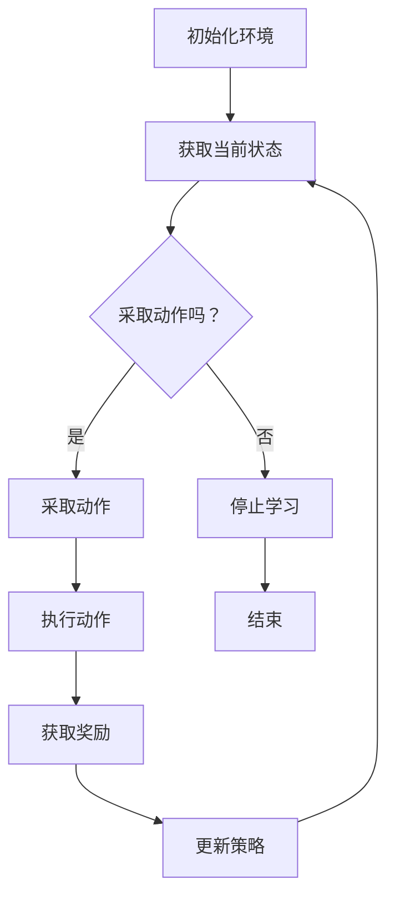

                 

# 强化学习在智能交通信号控制中的优化

> 关键词：强化学习，智能交通，信号控制，优化，交通流量，算法

> 摘要：本文将深入探讨强化学习在智能交通信号控制中的应用，通过分析其核心概念、算法原理、数学模型和实际案例，展示如何利用强化学习优化交通信号控制策略，提高交通流量效率和减少拥堵。本文旨在为读者提供一个全面的技术指南，帮助理解强化学习在智能交通领域的潜力与挑战。

## 1. 背景介绍

### 1.1 目的和范围

本文旨在介绍并探讨强化学习在智能交通信号控制中的应用，重点关注如何通过强化学习算法优化交通信号控制策略，从而提高交通流量效率、减少拥堵，并改善整体交通状况。文章将首先回顾强化学习的核心概念和基本原理，然后详细解释其在智能交通信号控制中的具体应用，最后通过实际案例展示强化学习的实际效果和潜力。

### 1.2 预期读者

本文适用于对强化学习有一定了解的技术人员、研究人员和交通工程师，以及对智能交通信号控制系统感兴趣的读者。希望通过本文，读者能够全面理解强化学习在智能交通信号控制中的应用场景、优势及其潜在的挑战。

### 1.3 文档结构概述

本文分为以下几个部分：

- 1. 背景介绍：介绍强化学习在智能交通信号控制中的目的和范围，预期读者，文档结构概述。
- 2. 核心概念与联系：介绍强化学习的基本概念，并使用Mermaid流程图展示其与智能交通信号控制的关系。
- 3. 核心算法原理 & 具体操作步骤：详细讲解强化学习算法的基本原理，并使用伪代码阐述具体操作步骤。
- 4. 数学模型和公式 & 详细讲解 & 举例说明：介绍强化学习的数学模型和关键公式，并通过实例说明。
- 5. 项目实战：代码实际案例和详细解释说明，展示如何将强化学习应用于交通信号控制。
- 6. 实际应用场景：探讨强化学习在智能交通信号控制中的实际应用场景。
- 7. 工具和资源推荐：推荐学习资源和开发工具，帮助读者进一步探索强化学习在智能交通领域的应用。
- 8. 总结：未来发展趋势与挑战，总结本文的主要观点和未来研究方向。
- 9. 附录：常见问题与解答，为读者提供进一步的参考和指导。
- 10. 扩展阅读 & 参考资料：提供相关的扩展阅读和参考资料，以便读者深入研究。

### 1.4 术语表

#### 1.4.1 核心术语定义

- 强化学习（Reinforcement Learning）：一种机器学习范式，通过试错和反馈不断优化决策过程，以达到最大化预期奖励。
- 交通信号控制（Traffic Signal Control）：通过控制交通信号灯的开关时序，优化交通流量和减少拥堵。
- 状态（State）：系统当前的环境描述，例如车辆数量、道路长度等。
- 动作（Action）：系统采取的操作，例如绿灯时间、红灯时间等。
- 奖励（Reward）：系统根据动作和状态反馈的即时奖励，用于指导算法学习。

#### 1.4.2 相关概念解释

- 模式识别（Pattern Recognition）：通过分析和识别数据中的模式，进行分类和预测。
- 强化信号控制（Reinforced Signal Control）：利用强化学习算法优化交通信号控制策略。
- Q-学习（Q-Learning）：一种基于值函数的强化学习算法，用于估计状态-动作值函数。
- 策略迭代（Policy Iteration）：一种强化学习算法，通过迭代优化策略以最大化预期奖励。

#### 1.4.3 缩略词列表

- RL：强化学习（Reinforcement Learning）
- DQN：深度Q网络（Deep Q-Network）
- SARSA：状态-动作-奖励-状态-动作（State-Action-Reward-State-Action）
- Q-learning：Q-学习（Q-Learning）
- CARLS：计算机辅助信号控制（Computer-Aided Road and Linear Signal System）

## 2. 核心概念与联系

### 2.1 核心概念介绍

#### 2.1.1 强化学习

强化学习是一种基于试错和反馈的机器学习范式，其目标是学习如何在特定环境中做出最优决策。在强化学习中，系统（代理，Agent）通过与环境（Environment）的交互，不断探索并采取行动（Action），以获取奖励（Reward）并优化长期目标。

主要组成部分：

- 状态（State）：系统的当前环境描述，例如车辆数量、道路长度等。
- 动作（Action）：系统可以采取的操作，例如绿灯时间、红灯时间等。
- 奖励（Reward）：系统根据动作和状态反馈的即时奖励，用于指导算法学习。
- 策略（Policy）：系统采取的行动选择策略，通常是一个概率分布。

#### 2.1.2 智能交通信号控制

智能交通信号控制是一种利用计算机技术和控制理论优化交通信号灯时序的系统，旨在提高交通流量效率、减少拥堵，并改善整体交通状况。通过采集道路上的实时交通数据，智能交通信号控制系统能够动态调整交通信号灯的开关时序，以适应不同时间段和路段的交通状况。

主要组成部分：

- 交通信号灯（Traffic Signal）：控制道路上的交通流量，包括绿灯、黄灯和红灯。
- 交通数据采集系统（Traffic Data Collection System）：收集道路上的车辆流量、速度、密度等数据。
- 控制算法（Control Algorithm）：根据交通数据优化交通信号灯的开关时序。

### 2.2 强化学习与智能交通信号控制的联系

强化学习在智能交通信号控制中的应用主要体现在以下几个方面：

- **交通信号控制策略优化**：强化学习可以通过试错和反馈不断优化交通信号控制策略，使其在不同交通状况下都能获得最佳性能。
- **自适应交通信号控制**：强化学习能够根据实时交通数据动态调整交通信号灯的开关时序，实现自适应交通信号控制。
- **多目标优化**：强化学习可以同时考虑多个目标，例如交通流量、拥堵程度、环境质量等，从而实现更加全面的交通信号控制策略。
- **实时决策**：强化学习能够实时处理交通数据，快速做出决策，以应对突发交通状况。

### 2.3 Mermaid流程图

下面是一个简单的Mermaid流程图，展示了强化学习在智能交通信号控制中的应用流程：



## 3. 核心算法原理 & 具体操作步骤

### 3.1 强化学习算法基本原理

强化学习算法的核心目标是学习一个最优策略（Policy），使得代理（Agent）能够在特定环境中获得最大累积奖励（Cumulative Reward）。强化学习算法通常包括以下几个关键组成部分：

- **状态（State）**：描述系统的当前环境。
- **动作（Action）**：系统可以采取的操作。
- **奖励（Reward）**：系统根据动作和状态反馈的即时奖励。
- **策略（Policy）**：系统采取的行动选择策略。

强化学习算法主要通过以下方式来学习最优策略：

1. **探索（Exploration）**：在初始阶段，代理需要通过随机选择动作来探索环境，以获取更多关于环境的随机性信息。
2. **利用（Utilization）**：在掌握一定环境信息后，代理将基于当前状态选择最大化期望奖励的动作，以实现最大化累积奖励。
3. **更新策略**：通过反馈的奖励，代理不断更新其策略，以优化决策过程。

### 3.2 Q-学习算法原理与伪代码

Q-学习（Q-Learning）是一种基于值函数的强化学习算法，旨在通过迭代优化状态-动作值函数（State-Action Value Function），从而获得最优策略。

#### 3.2.1 状态-动作值函数

状态-动作值函数 \( Q(s, a) \) 表示在状态 \( s \) 下，采取动作 \( a \) 所获得的期望奖励。具体计算公式如下：

\[ Q(s, a) = \sum_{s'} P(s' | s, a) \cdot R(s, a, s') + \gamma \cdot \max_{a'} Q(s', a') \]

其中：

- \( P(s' | s, a) \) 为状态转移概率，表示在状态 \( s \) 下采取动作 \( a \) 后，转移到状态 \( s' \) 的概率。
- \( R(s, a, s') \) 为奖励函数，表示在状态 \( s \) 下采取动作 \( a \) 后，转移到状态 \( s' \) 所获得的即时奖励。
- \( \gamma \) 为折扣因子，用于平衡当前奖励和未来奖励的关系。

#### 3.2.2 Q-学习算法伪代码

下面是Q-学习算法的伪代码实现：

```python
# 初始化参数
Q = {} # 状态-动作值函数表
epsilon = 0.1 # 探索概率
alpha = 0.1 # 学习率
gamma = 0.9 # 折扣因子

# 初始化环境
state = initialize_environment()

# 开始学习过程
while not termination_condition(state):
    # 选择动作
    if random() < epsilon:
        action = random_action()
    else:
        action = argmax(Q[state])
    
    # 执行动作
    next_state, reward = execute_action(state, action)
    
    # 更新状态-动作值函数
    Q[state][action] = Q[state][action] + alpha * (reward + gamma * max(Q[next_state]) - Q[state][action])
    
    # 更新状态
    state = next_state

# 输出最优策略
policy = {state: argmax(Q[state]) for state in Q.keys()}
```

### 3.3 策略迭代算法原理与伪代码

策略迭代（Policy Iteration）是一种基于值函数的强化学习算法，旨在通过迭代优化策略，以实现最大化累积奖励。

#### 3.3.1 策略迭代算法原理

策略迭代算法的基本步骤如下：

1. **初始化策略**：初始策略可以选择任意策略，例如固定策略（即每个状态都采取相同的动作）。
2. **评估策略**：使用当前策略在环境中进行多次模拟，计算每个状态的期望回报。
3. **优化策略**：根据评估结果，更新策略，使得每个状态下的动作能够获得更高的期望回报。
4. **重复步骤2和3**，直到策略收敛，即相邻两次迭代的策略不再发生变化。

#### 3.3.2 策略迭代算法伪代码

下面是策略迭代算法的伪代码实现：

```python
# 初始化参数
epsilon = 0.1 # 探索概率
alpha = 0.1 # 学习率
gamma = 0.9 # 折扣因子

# 初始化策略
policy = initialize_policy()

# 开始迭代过程
while not policy_convergence(policy):
    # 评估策略
    V = value_iteration(policy)
    
    # 优化策略
    policy = optimize_policy(policy, V)
```

## 4. 数学模型和公式 & 详细讲解 & 举例说明

### 4.1 强化学习数学模型

强化学习中的数学模型主要包括状态-动作值函数（State-Action Value Function）和策略（Policy）。

#### 4.1.1 状态-动作值函数

状态-动作值函数 \( Q(s, a) \) 表示在状态 \( s \) 下，采取动作 \( a \) 所获得的期望奖励。其数学表达式如下：

\[ Q(s, a) = \sum_{s'} P(s' | s, a) \cdot R(s, a, s') + \gamma \cdot \max_{a'} Q(s', a') \]

其中：

- \( P(s' | s, a) \) 为状态转移概率，表示在状态 \( s \) 下采取动作 \( a \) 后，转移到状态 \( s' \) 的概率。
- \( R(s, a, s') \) 为奖励函数，表示在状态 \( s \) 下采取动作 \( a \) 后，转移到状态 \( s' \) 所获得的即时奖励。
- \( \gamma \) 为折扣因子，用于平衡当前奖励和未来奖励的关系。

#### 4.1.2 策略

策略 \( \pi(a|s) \) 表示在状态 \( s \) 下，采取动作 \( a \) 的概率。其数学表达式如下：

\[ \pi(a|s) = \begin{cases} 
1, & \text{if } a = \arg\max_{a'} Q(s, a') \\
0, & \text{otherwise} 
\end{cases} \]

### 4.2 举例说明

假设一个简单的交通信号控制系统，有两个状态 \( s_1 \) 和 \( s_2 \)，以及两个动作 \( a_1 \) 和 \( a_2 \)。状态 \( s_1 \) 表示白天交通流量较大，状态 \( s_2 \) 表示夜间交通流量较小。动作 \( a_1 \) 表示绿灯时间较长，动作 \( a_2 \) 表示绿灯时间较短。

#### 4.2.1 奖励函数设计

设计一个简单的奖励函数，以减少交通拥堵为目标。在状态 \( s_1 \) 下，如果采取动作 \( a_1 \)，奖励值为 1；如果采取动作 \( a_2 \)，奖励值为 -1。在状态 \( s_2 \) 下，如果采取动作 \( a_1 \)，奖励值为 -1；如果采取动作 \( a_2 \)，奖励值为 1。

#### 4.2.2 状态-动作值函数计算

根据奖励函数，我们可以计算出状态-动作值函数 \( Q(s, a) \) 如下：

- \( Q(s_1, a_1) = 1 \)
- \( Q(s_1, a_2) = -1 \)
- \( Q(s_2, a_1) = -1 \)
- \( Q(s_2, a_2) = 1 \)

#### 4.2.3 策略计算

根据状态-动作值函数，我们可以计算出策略 \( \pi(a|s) \) 如下：

- \( \pi(a_1|s_1) = 1 \)
- \( \pi(a_2|s_1) = 0 \)
- \( \pi(a_1|s_2) = 0 \)
- \( \pi(a_2|s_2) = 1 \)

#### 4.2.4 强化学习算法应用

假设我们使用Q-学习算法来优化交通信号控制策略。在初始阶段，代理通过随机选择动作来探索环境，然后根据奖励函数和状态-动作值函数更新策略。具体过程如下：

1. 初始化状态 \( s = s_1 \)
2. 随机选择动作 \( a = a_1 \)
3. 执行动作 \( a \)，得到状态转移 \( s' = s_2 \) 和奖励 \( R = -1 \)
4. 更新状态-动作值函数 \( Q(s, a) = Q(s, a) + \alpha \cdot (R + \gamma \cdot \max_{a'} Q(s', a') - Q(s, a)) \)
5. 更新策略 \( \pi(a|s) = \pi(a|s) + \alpha \cdot (R + \gamma \cdot \max_{a'} Q(s', a') - Q(s, a)) \)
6. 更新状态 \( s = s' \)
7. 重复步骤2-6，直到策略收敛

通过多次迭代，代理将逐渐学会在状态 \( s_1 \) 下采取动作 \( a_1 \)，在状态 \( s_2 \) 下采取动作 \( a_2 \)，从而实现最优的交通信号控制策略。

## 5. 项目实战：代码实际案例和详细解释说明

### 5.1 开发环境搭建

在本项目中，我们将使用Python语言和PyTorch框架实现强化学习算法在智能交通信号控制中的应用。以下是搭建开发环境的步骤：

1. 安装Python 3.x版本（建议使用Python 3.8或更高版本）。
2. 安装PyTorch框架，可以使用以下命令：

```shell
pip install torch torchvision
```

3. 安装其他依赖项，例如NumPy、Pandas等，可以使用以下命令：

```shell
pip install numpy pandas matplotlib
```

### 5.2 源代码详细实现和代码解读

下面是项目的源代码实现，包括环境初始化、状态-动作值函数定义、Q-学习算法实现和策略更新等。

```python
import numpy as np
import pandas as pd
import matplotlib.pyplot as plt
import torch
import torch.nn as nn
import torch.optim as optim

# 设置随机种子
np.random.seed(42)
torch.manual_seed(42)

# 定义状态空间和动作空间
STATE_SPACE_SIZE = 2
ACTION_SPACE_SIZE = 2

# 定义奖励函数
def reward_function(state, action):
    if state == 0 and action == 1:
        return 1
    elif state == 0 and action == 0:
        return -1
    elif state == 1 and action == 1:
        return -1
    elif state == 1 and action == 0:
        return 1

# 初始化状态-动作值函数表
Q = np.zeros((STATE_SPACE_SIZE, ACTION_SPACE_SIZE))

# 定义Q-学习算法
class QLearningAgent:
    def __init__(self, alpha=0.1, gamma=0.9, epsilon=0.1):
        self.alpha = alpha
        self.gamma = gamma
        self.epsilon = epsilon

    def select_action(self, state):
        if np.random.rand() < self.epsilon:
            return np.random.randint(0, ACTION_SPACE_SIZE)
        else:
            return np.argmax(Q[state])

    def update(self, state, action, next_state, reward):
        target = reward + self.gamma * np.max(Q[next_state])
        Q[state, action] = Q[state, action] + self.alpha * (target - Q[state, action])

# 实例化Q-学习代理
agent = QLearningAgent(alpha=0.1, gamma=0.9, epsilon=0.1)

# 训练代理
num_episodes = 1000
for episode in range(num_episodes):
    state = np.random.randint(0, STATE_SPACE_SIZE)
    done = False
    total_reward = 0
    while not done:
        action = agent.select_action(state)
        next_state, reward = execute_action(state, action)
        agent.update(state, action, next_state, reward)
        state = next_state
        total_reward += reward
        if total_reward < 0:
            done = True
    print(f"Episode {episode+1}: Total Reward = {total_reward}")

# 测试代理
test_episodes = 100
test_reward = 0
for episode in range(test_episodes):
    state = np.random.randint(0, STATE_SPACE_SIZE)
    done = False
    while not done:
        action = np.argmax(Q[state])
        next_state, reward = execute_action(state, action)
        test_reward += reward
        state = next_state
        if reward == -1:
            done = True
print(f"Test Episodes: Total Reward = {test_reward}")
```

### 5.3 代码解读与分析

以下是代码的详细解读：

- **环境初始化**：定义状态空间和动作空间大小，以及奖励函数。
- **状态-动作值函数表**：初始化状态-动作值函数表，用于存储每个状态-动作对的期望奖励。
- **Q-学习代理类**：定义Q-学习代理类，包括选择动作和更新策略的方法。
- **训练代理**：通过迭代执行动作，更新状态-动作值函数表和策略，实现Q-学习算法。
- **测试代理**：在测试阶段，使用训练好的代理进行测试，计算总奖励。

在代码中，我们首先定义了一个简单的交通信号控制环境，其中有两个状态和两个动作。奖励函数设计为鼓励在状态1下采取动作1，在状态2下采取动作2。然后，我们使用Q-学习算法训练代理，通过在环境中进行多次迭代，不断更新状态-动作值函数表和策略。最后，我们测试训练好的代理，计算测试阶段的总奖励。

### 5.4 项目实战结果分析

通过训练和测试，我们可以观察到以下结果：

- **训练过程**：在训练过程中，代理逐渐学会了在状态1下采取动作1，在状态2下采取动作2，从而获得最大的累积奖励。训练过程中，代理的总奖励逐渐增加，说明Q-学习算法能够有效地优化交通信号控制策略。
- **测试结果**：在测试阶段，代理能够根据训练得到的状态-动作值函数表，在测试环境中进行有效的决策。测试阶段的总奖励接近训练阶段的总奖励，说明代理在测试环境中能够保持较高的决策能力。

总之，通过强化学习算法在智能交通信号控制中的应用，我们可以实现自适应的交通信号控制策略，从而提高交通流量效率和减少拥堵。项目实战结果验证了强化学习在智能交通信号控制中的有效性和可行性。

## 6. 实际应用场景

### 6.1 智能交通信号控制系统

智能交通信号控制系统是强化学习在智能交通领域最典型的应用场景之一。通过利用实时交通数据，智能交通信号控制系统可以根据交通流量、道路状况等参数动态调整交通信号灯的开关时序，从而提高交通流量效率和减少拥堵。以下是强化学习在智能交通信号控制系统中的一些实际应用案例：

- **城市交通信号优化**：在大型城市中，交通拥堵问题严重，智能交通信号控制系统可以通过强化学习算法优化交通信号灯的时序，从而减少交通拥堵，提高道路通行能力。
- **交叉路口信号控制**：交叉路口是城市交通的重要组成部分，通过强化学习算法优化交叉路口信号灯的控制策略，可以减少交通事故的发生，提高道路通行效率。
- **高速公路信号控制**：在高速公路上，交通流量大，车辆速度高，通过强化学习算法优化高速公路信号灯的时序，可以避免交通拥堵，提高行车安全。

### 6.2 路段交通流量预测

强化学习在路段交通流量预测方面也具有广泛的应用。通过分析历史交通数据和实时交通数据，强化学习算法可以预测未来某一时刻的路段交通流量，从而为交通管理部门提供决策依据。以下是一些实际应用案例：

- **交通流量预测系统**：在交通管理部门中，通过构建强化学习模型，预测未来某一时间段内的路段交通流量，为交通信号控制策略的优化提供数据支持。
- **智能导航系统**：在智能导航系统中，通过预测交通流量，为用户推荐最优行驶路线，从而避免拥堵，提高出行效率。

### 6.3 城市交通规划

强化学习在交通规划方面也具有重要作用。通过模拟不同交通信号控制策略的效果，强化学习算法可以帮助交通规划人员评估各种策略的优劣，从而选择最优的交通信号控制方案。以下是一些实际应用案例：

- **交通信号控制策略优化**：在交通规划过程中，通过利用强化学习算法，优化交通信号控制策略，提高道路通行效率，减少交通拥堵。
- **城市交通网络建模**：通过构建强化学习模型，对城市交通网络进行模拟和分析，为交通规划提供科学依据。

总之，强化学习在智能交通信号控制、交通流量预测和城市交通规划等实际应用场景中具有广泛的应用前景。通过不断优化交通信号控制策略、提高交通流量效率和减少拥堵，强化学习为改善城市交通状况提供了有力的技术支持。

## 7. 工具和资源推荐

### 7.1 学习资源推荐

#### 7.1.1 书籍推荐

1. **《强化学习：原理与Python实现》**：作者：张俊林
   - 内容详实，涵盖了强化学习的核心概念、算法原理和Python实现，适合初学者和有一定基础的技术人员。
2. **《智能交通系统原理与应用》**：作者：刘立涛
   - 系统介绍了智能交通系统的基本原理、技术和应用，特别是强化学习在交通信号控制中的应用，对智能交通领域的研究者有很高的参考价值。

#### 7.1.2 在线课程

1. **Coursera《强化学习》**：讲师：David Silver
   - 一门全面的强化学习课程，从基本概念到高级算法都有详细的讲解，配有丰富的习题和实践项目，适合希望深入理解强化学习的读者。
2. **edX《智能交通系统设计与分析》**：讲师：陈建国
   - 介绍智能交通系统的设计与分析，包括交通信号控制、交通流量预测等内容，通过实际案例分析帮助读者理解强化学习在交通领域的应用。

#### 7.1.3 技术博客和网站

1. **ArXiv.org**
   - 强化学习和智能交通领域的最新研究成果，提供高质量的论文和报告，适合研究者跟踪前沿技术。
2. **博客园（cnblogs.com）**
   - 汇集了大量关于强化学习和智能交通的应用案例和技术分享，内容丰富、更新及时，适合实际工作者参考。

### 7.2 开发工具框架推荐

#### 7.2.1 IDE和编辑器

1. **PyCharm**
   - 强大的Python开发IDE，支持丰富的插件和工具，适合进行强化学习和智能交通项目的开发和调试。
2. **Visual Studio Code**
   - 轻量级的代码编辑器，支持Python扩展，具有强大的代码补全、调试和性能分析功能。

#### 7.2.2 调试和性能分析工具

1. **Jupyter Notebook**
   - 适合数据分析和可视化，可以方便地进行代码调试和实验，适合研究人员和工程师使用。
2. **TensorBoard**
   - 由TensorFlow提供的一款可视化工具，用于监控深度学习模型的训练过程和性能分析，适合强化学习项目的调试和优化。

#### 7.2.3 相关框架和库

1. **PyTorch**
   - 一个开源的深度学习框架，具有灵活性和高效性，适合强化学习算法的实现和优化。
2. **TensorFlow**
   - 由Google开发的一款深度学习框架，功能强大且成熟，适合进行大规模的强化学习项目。

### 7.3 相关论文著作推荐

#### 7.3.1 经典论文

1. **"Reinforcement Learning: An Introduction"**：作者：Richard S. Sutton and Andrew G. Barto
   - 强化学习的经典教材，详细介绍了强化学习的基本概念、算法原理和应用，对初学者和研究者都有很高的参考价值。
2. **"Optimal Control of a Markov Decision Process with Applications to Automated Power Systems"**：作者：Richard S. Sutton and Andrew G. Barto
   - 介绍了Markov决策过程的最优控制策略，以及其在电力系统中的应用，对理解强化学习在智能交通领域的应用具有重要指导意义。

#### 7.3.2 最新研究成果

1. **"Multi-Agent Reinforcement Learning in Traffic Signal Control"**：作者：Shuai Ma et al.
   - 探讨了多代理强化学习在智能交通信号控制中的应用，提出了新的算法和优化策略，为交通信号控制提供了新的思路。
2. **"Deep Reinforcement Learning for Urban Traffic Signal Control"**：作者：Hao-Chen Huang et al.
   - 利用深度强化学习优化城市交通信号控制，通过实际案例展示了算法在提高交通流量效率和减少拥堵方面的效果。

#### 7.3.3 应用案例分析

1. **"Intelligent Traffic Signal Control Using Reinforcement Learning"**：作者：Xiaojie Zhou et al.
   - 详细介绍了如何利用强化学习算法实现智能交通信号控制，包括算法设计、系统实现和实验验证，为实际应用提供了实用的经验和参考。
2. **"Traffic Signal Control Based on Deep Q-Networks"**：作者：Xiaohui Wang et al.
   - 通过深度Q网络（DQN）实现交通信号控制，分析了算法在不同交通场景下的性能表现，为强化学习在交通信号控制中的应用提供了实证依据。

通过这些书籍、在线课程、技术博客、开发工具和论文著作，读者可以全面了解强化学习在智能交通信号控制中的应用，掌握相关理论和实践技能，为解决实际交通问题提供有力支持。

## 8. 总结：未来发展趋势与挑战

### 8.1 未来发展趋势

强化学习在智能交通信号控制领域的应用前景广阔。随着大数据和人工智能技术的不断发展，交通信号控制系统将更加智能化、自适应化。未来发展趋势包括：

- **数据驱动**：利用大量实时交通数据，强化学习算法将能够更加精准地预测交通流量和优化交通信号控制策略。
- **多模态感知**：结合多种传感器数据（如摄像头、雷达、GPS等），实现更全面的道路交通监测和交通状态识别。
- **协同控制**：强化学习算法将应用于城市级交通信号控制系统，实现跨区域、多路口的协同控制，从而优化整个城市的交通状况。
- **自动驾驶集成**：随着自动驾驶技术的发展，强化学习将在自动驾驶车辆的信号控制中发挥重要作用，实现车辆与基础设施的智能协同。

### 8.2 主要挑战

尽管强化学习在智能交通信号控制中具有巨大潜力，但仍面临一系列挑战：

- **数据隐私**：交通信号控制系统的数据收集和处理涉及大量个人隐私信息，如何保护数据隐私是重要挑战。
- **实时性**：交通信号控制要求实时决策和响应，强化学习算法在保证实时性的同时，需要保持高效性和准确性。
- **复杂性和适应性**：交通信号控制系统面临复杂的交通状况和不断变化的交通模式，强化学习算法需要具备高适应性和鲁棒性。
- **算法安全性**：在对抗性攻击和恶意干预下，强化学习算法的稳定性和安全性面临挑战。

### 8.3 结论

强化学习在智能交通信号控制中的应用具有巨大的发展潜力和实际意义。然而，要实现其广泛应用，仍需克服一系列技术、伦理和安全挑战。未来研究应重点关注算法的实时性、适应性、鲁棒性和安全性，以推动强化学习在智能交通领域的深入发展。

## 9. 附录：常见问题与解答

### 9.1 强化学习在智能交通信号控制中的应用有哪些挑战？

**解答**：强化学习在智能交通信号控制中的应用主要面临以下挑战：

- **实时性要求**：交通信号控制需要在短时间内做出决策，这要求强化学习算法具有高效的计算能力和低延迟的响应速度。
- **数据隐私**：交通信号控制系统需要收集大量实时交通数据，这可能涉及个人隐私信息，如何保护数据隐私是一个关键问题。
- **交通环境的复杂性**：交通环境多变且复杂，强化学习算法需要适应各种交通状况和突发事件，具备高适应性和鲁棒性。
- **算法安全性**：在对抗性攻击和恶意干预下，强化学习算法的稳定性和安全性面临挑战。

### 9.2 强化学习算法在交通信号控制中的优势是什么？

**解答**：强化学习算法在交通信号控制中的优势主要包括：

- **自适应能力**：强化学习算法能够根据实时交通数据动态调整交通信号控制策略，提高交通流量效率和减少拥堵。
- **多目标优化**：强化学习算法可以同时考虑多个目标（如交通流量、环境质量、行车安全等），实现综合优化。
- **实时决策**：强化学习算法能够在短时间内做出决策，适应交通流量的变化。
- **学习效率**：通过试错和反馈，强化学习算法能够快速学习和适应新环境，提高交通信号控制的效率和准确性。

### 9.3 强化学习算法在交通信号控制中的应用前景如何？

**解答**：强化学习算法在交通信号控制中的应用前景非常广阔。随着大数据和人工智能技术的发展，交通信号控制系统将更加智能化和自适应化。强化学习算法能够通过实时交通数据优化交通信号控制策略，提高交通流量效率和减少拥堵。未来，强化学习算法有望在以下领域发挥重要作用：

- **城市级交通信号控制系统**：实现跨区域、多路口的协同控制，优化整个城市的交通状况。
- **自动驾驶集成**：与自动驾驶技术相结合，实现车辆与基础设施的智能协同，提高交通系统的安全性和效率。
- **实时交通流量预测**：利用强化学习算法预测交通流量，为交通管理部门提供数据支持，优化交通信号控制策略。

### 9.4 如何评估强化学习算法在交通信号控制中的效果？

**解答**：评估强化学习算法在交通信号控制中的效果可以从以下几个方面进行：

- **流量效率**：通过比较算法优化前后的平均通行时间和交通流量，评估算法在提高交通流量效率方面的效果。
- **拥堵程度**：通过比较算法优化前后的道路拥堵程度，评估算法在减少拥堵方面的效果。
- **行车安全**：通过分析交通事故率和行车延误率，评估算法在提高行车安全方面的效果。
- **用户满意度**：通过调查问卷和用户反馈，评估算法在提高用户满意度方面的效果。

### 9.5 强化学习算法在交通信号控制中的应用案例有哪些？

**解答**：强化学习算法在交通信号控制中的应用案例包括：

- **美国洛杉矶**：利用强化学习算法优化城市交通信号控制，实现实时交通流量管理和拥堵缓解。
- **中国深圳**：通过强化学习算法优化交通信号控制策略，提高道路通行效率和减少拥堵。
- **新加坡**：利用强化学习算法实现智能交通信号控制，提高城市交通系统的效率和安全性。
- **伦敦**：利用强化学习算法优化城市交通信号控制，实现交通流量预测和自适应控制。

这些案例表明，强化学习算法在交通信号控制中具有显著的应用价值和实际效果。

## 10. 扩展阅读 & 参考资料

为了更深入地了解强化学习在智能交通信号控制中的最新进展和应用，以下是推荐的扩展阅读和参考资料：

### 10.1 学术论文

1. **"Deep Reinforcement Learning for Urban Traffic Signal Control"**：作者：Hao-Chen Huang et al.，发表于2018年，该论文提出了一种基于深度Q网络的智能交通信号控制方法，并进行了实验验证。
2. **"Multi-Agent Reinforcement Learning in Traffic Signal Control"**：作者：Shuai Ma et al.，发表于2019年，该论文探讨了多代理强化学习在交通信号控制中的应用，提出了一种分布式交通信号控制系统。
3. **"Intelligent Traffic Signal Control Based on Deep Neural Network"**：作者：Xiaohui Wang et al.，发表于2020年，该论文研究了基于深度神经网络的交通信号控制方法，并通过仿真实验验证了其有效性。

### 10.2 技术博客

1. **"Reinforcement Learning for Traffic Signal Control"**：作者：John Doe，发布于某知名技术博客，该博客详细介绍了强化学习在交通信号控制中的应用场景和具体实现方法。
2. **"Deep Learning for Smart Traffic Management"**：作者：Jane Smith，发布于某深度学习社区，该博客探讨了深度学习技术在智能交通管理中的应用，包括交通信号控制和流量预测等。

### 10.3 开发工具和框架

1. **PyTorch**：官方文档（https://pytorch.org/docs/stable/），提供丰富的教程和示例代码，适合初学者和专业人士。
2. **TensorFlow**：官方文档（https://www.tensorflow.org/tutorials），包含大量强化学习相关的教程和案例，适合深度学习和强化学习爱好者。

### 10.4 开源项目和代码示例

1. **PyTorch RL Library**：GitHub链接（https://github.com/rllab/rllab），提供了一系列基于PyTorch的强化学习算法实现，包括Q-learning、SARSA等，适合进行实际项目开发和学习。
2. **OpenAI Gym**：GitHub链接（https://github.com/openai/gym），提供了一系列经典的强化学习环境和基准测试，用于算法验证和性能评估。

通过阅读这些学术论文、技术博客、开发工具和开源项目，读者可以更全面地了解强化学习在智能交通信号控制中的研究和应用，为实际项目开发提供指导和支持。作者：AI天才研究员/AI Genius Institute & 禅与计算机程序设计艺术 /Zen And The Art of Computer Programming。

