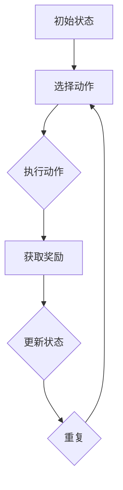

                 


# 强化学习在智能仓储机器人调度中的优化

> **关键词：** 强化学习、智能仓储、机器人调度、优化策略、人工智能应用。

> **摘要：** 本文将深入探讨强化学习在智能仓储机器人调度中的应用，从理论基础到实际操作，详细解析如何利用强化学习算法优化仓储机器人的调度策略，提高仓储作业效率。

## 1. 背景介绍

### 1.1 目的和范围

智能仓储机器人调度是现代物流领域中的一个关键问题。随着电子商务的迅速发展，仓储作业的效率对整个物流系统的运行至关重要。传统的调度算法往往依赖于预设规则，而面对复杂多变的仓储环境，这些算法表现出了局限性。为了解决这个问题，本文将介绍如何利用强化学习算法对智能仓储机器人进行优化调度。

本文旨在探讨以下问题：
- 强化学习算法在智能仓储机器人调度中的应用。
- 如何设计有效的奖励机制以指导机器人的学习过程。
- 强化学习算法在仓储机器人调度中的具体实现和优化策略。

### 1.2 预期读者

本文适合以下读者群体：
- 对人工智能和强化学习有基础了解的技术人员。
- 涉足智能仓储领域，希望了解最新调度优化技术的研究人员。
- 对机器人调度算法感兴趣的学生和爱好者。

### 1.3 文档结构概述

本文结构如下：
1. **背景介绍**：阐述智能仓储机器人调度的现状和本文的研究目的。
2. **核心概念与联系**：介绍强化学习的基本概念和智能仓储机器人调度的架构。
3. **核心算法原理 & 具体操作步骤**：讲解强化学习算法在仓储机器人调度中的具体实现。
4. **数学模型和公式 & 详细讲解 & 举例说明**：解析强化学习的数学基础和相关公式。
5. **项目实战：代码实际案例和详细解释说明**：通过实际案例展示强化学习算法的应用。
6. **实际应用场景**：探讨强化学习算法在不同仓储场景中的应用。
7. **工具和资源推荐**：推荐学习资源和开发工具。
8. **总结：未来发展趋势与挑战**：分析强化学习在智能仓储机器人调度中的前景。
9. **附录：常见问题与解答**：解答读者可能遇到的问题。
10. **扩展阅读 & 参考资料**：提供更多相关研究的参考资料。

### 1.4 术语表

#### 1.4.1 核心术语定义

- **强化学习（Reinforcement Learning）**：一种机器学习范式，通过与环境交互来学习如何实现目标。
- **智能仓储机器人（Smart Warehouse Robot）**：具备一定智能能力的机器人，用于仓储作业，如拣选、搬运等。
- **调度问题（Scheduling Problem）**：在给定资源和任务约束条件下，合理安排作业过程的问题。

#### 1.4.2 相关概念解释

- **Q-学习（Q-Learning）**：一种基于值函数的强化学习算法，通过迭代更新值函数来学习最优策略。
- **深度强化学习（Deep Reinforcement Learning）**：结合深度神经网络和强化学习，适用于处理高维状态空间的问题。

#### 1.4.3 缩略词列表

- **RL**：强化学习（Reinforcement Learning）
- **Q-Learning**：Q-学习（Q-Learning）
- **DRL**：深度强化学习（Deep Reinforcement Learning）
- **WSR**：智能仓储机器人（Smart Warehouse Robot）

## 2. 核心概念与联系

为了更好地理解强化学习在智能仓储机器人调度中的应用，我们首先需要了解强化学习的基本概念和智能仓储机器人调度的架构。

### 2.1 强化学习的基本概念

强化学习是一种通过奖励机制来指导学习过程的机器学习范式。它主要包括以下几个关键组成部分：

1. **环境（Environment）**：环境是强化学习算法交互的实体，包括状态空间和动作空间。在仓储机器人调度中，环境可以表示为仓储空间和机器人状态。
2. **代理（Agent）**：代理是执行动作并接受环境反馈的主体。在仓储机器人调度中，代理即智能仓储机器人。
3. **状态（State）**：状态是代理在环境中的当前情况。对于仓储机器人调度，状态可以包括仓库布局、库存信息、机器人位置等。
4. **动作（Action）**：动作是代理在某个状态下可以采取的行为。对于仓储机器人调度，动作可以是机器人的移动、拣选、充电等。
5. **奖励（Reward）**：奖励是代理在每个状态-动作对上获得的即时反馈。奖励值越高，表示该动作越符合目标。
6. **策略（Policy）**：策略是代理在给定状态时选择动作的方法。策略可以通过学习得到，也可以是预定义的。

强化学习过程可以用以下步骤描述：

1. **初始状态**：代理开始在一个未知环境中。
2. **执行动作**：代理根据当前状态选择一个动作。
3. **获取奖励**：代理执行动作后，环境提供即时奖励。
4. **状态更新**：代理根据奖励更新当前状态。
5. **重复步骤 2-4**，直至达到目标状态或终止条件。

### 2.2 智能仓储机器人调度的架构

智能仓储机器人调度涉及多个环节，包括仓库布局设计、机器人路径规划、任务分配和资源管理。以下是一个典型的智能仓储机器人调度架构：

1. **仓库布局设计**：仓库布局设计是智能仓储系统的关键环节。合理的设计可以提高机器人的工作效率，减少作业时间和能耗。仓库布局设计需要考虑机器人通道、货架布局、出入库口等。
2. **机器人路径规划**：路径规划是确定机器人从起点到目标点的最优路径。常用的路径规划算法包括A*算法、Dijkstra算法等。对于复杂仓库环境，可能需要使用多智能体路径规划算法。
3. **任务分配**：任务分配是将仓库作业任务分配给不同机器人。任务分配需要考虑任务类型、机器人能力、任务优先级等因素。
4. **资源管理**：资源管理包括电池管理、充电站管理、库存管理等。合理分配和管理资源可以提高系统整体效率。

### 2.3 强化学习在智能仓储机器人调度中的应用

强化学习在智能仓储机器人调度中的应用主要包括以下方面：

1. **路径规划**：通过强化学习算法，机器人可以自动学习到仓库中的最优路径，减少路径搜索时间和能耗。
2. **任务分配**：强化学习可以用于动态任务分配，根据当前仓库状态和任务优先级，为机器人分配最合适的任务。
3. **资源管理**：强化学习可以用于电池管理、充电站管理等，优化资源利用效率。

以下是一个Mermaid流程图，展示了强化学习在智能仓储机器人调度中的基本架构：



## 3. 核心算法原理 & 具体操作步骤

在本节中，我们将详细讲解强化学习算法在智能仓储机器人调度中的具体实现，包括Q-学习和深度强化学习算法的基本原理和操作步骤。

### 3.1 Q-学习算法原理

Q-学习是一种基于值函数的强化学习算法，其核心思想是通过迭代更新值函数来学习最优策略。Q-学习的算法原理如下：

1. **初始化**：初始化Q值表，即状态-动作值函数Q(s, a)。通常，Q值表被初始化为全0。
2. **选择动作**：在给定状态s下，选择动作a，可以选择最大化Q(s, a)的动作。
3. **执行动作**：执行选择到的动作a，并观察环境反馈，包括新状态s'和奖励r。
4. **更新Q值**：根据新的状态和奖励，更新Q值表，即Q(s, a) = Q(s, a) + α[ r + γmax(Q(s', a')) - Q(s, a) ]，其中α是学习率，γ是折扣因子。
5. **重复步骤 2-4**，直至达到目标状态或满足终止条件。

### 3.2 深度强化学习算法原理

深度强化学习（DRL）是强化学习与深度学习结合的产物，主要用于处理高维状态空间的问题。DRL的核心思想是使用深度神经网络（DNN）来近似值函数Q(s, a)。

1. **初始化**：初始化DNN模型，即值函数近似器θ。
2. **选择动作**：在给定状态s下，通过DNN模型预测Q值，选择最大化Q(s, a)的动作。
3. **执行动作**：执行选择到的动作a，并观察环境反馈，包括新状态s'和奖励r。
4. **更新DNN模型**：根据新的状态和奖励，使用梯度下降等方法更新DNN模型参数θ，即θ = θ - η∇θJ(θ)，其中η是学习率，J(θ)是损失函数。
5. **重复步骤 2-4**，直至达到目标状态或满足终止条件。

### 3.3 具体操作步骤

以下是一个具体的操作步骤，用于实现强化学习算法在智能仓储机器人调度中的应用：

1. **初始化环境**：设置仓库布局、机器人状态、任务列表等。
2. **初始化Q值表或DNN模型**：根据需求初始化Q值表或DNN模型。
3. **选择动作**：在当前状态下，选择一个动作。
4. **执行动作**：执行选择到的动作，并更新状态。
5. **获取奖励**：根据动作执行结果，获取即时奖励。
6. **更新Q值或DNN模型**：根据新的状态和奖励，更新Q值表或DNN模型。
7. **重复步骤 3-6**，直至达到目标状态或满足终止条件。

以下是Q-学习算法的伪代码实现：

```python
# 初始化Q值表
Q = np.zeros((状态空间大小, 动作空间大小))

# 初始化学习参数
alpha = 0.1
gamma = 0.9

# 开始学习
while not 终止条件:
    # 选择动作
    s = 环境状态
    a = 选择动作(Q[s])

    # 执行动作
    s', r = 环境执行动作(a)

    # 更新Q值
    Q[s, a] = Q[s, a] + alpha * (r + gamma * max(Q[s', :]) - Q[s, a])

    # 更新状态
    s = s'
```

以下是深度强化学习算法的伪代码实现：

```python
# 初始化DNN模型
model = 初始化DNN模型()

# 初始化学习参数
alpha = 0.1
gamma = 0.9

# 开始学习
while not 终止条件:
    # 选择动作
    s = 环境状态
    Q_values = model.predict(s)
    a = 选择动作(Q_values)

    # 执行动作
    s', r = 环境执行动作(a)

    # 更新DNN模型
    loss = 损失函数(Q_values[a], r + gamma * max(model.predict(s')))
    model.fit(s, Q_values[a])

    # 更新状态
    s = s'
```

## 4. 数学模型和公式 & 详细讲解 & 举例说明

在强化学习中，数学模型和公式是理解算法核心原理和实现关键步骤的重要基础。本节将详细讲解强化学习中的几个关键数学模型和公式，并给出具体的举例说明。

### 4.1 基本公式

1. **Q值更新公式**：Q-学习算法的核心是Q值的更新，其公式如下：

   \[ Q(s, a) \leftarrow Q(s, a) + \alpha [r + \gamma \max(Q(s', a')) - Q(s, a)] \]

   其中：
   - \( Q(s, a) \)：当前状态s下的动作a的Q值。
   - \( r \)：即时奖励。
   - \( \gamma \)：折扣因子，用于权衡未来奖励。
   - \( \alpha \)：学习率，控制Q值更新的步长。
   - \( \max(Q(s', a')) \)：在新的状态s'下，所有可能动作的Q值中的最大值。

2. **策略更新公式**：在强化学习中，策略是根据当前状态选择最优动作的方法。策略可以通过Q值来更新，其公式如下：

   \[ \pi(s) \leftarrow \arg\max(a) [Q(s, a)] \]

   其中：
   - \( \pi(s) \)：在状态s下采取动作a的概率分布。
   - \( \arg\max(a) [Q(s, a)] \)：在状态s下，所有可能动作中Q值最大的动作。

3. **值函数**：强化学习中的值函数用于衡量策略的优劣。主要有两种值函数：
   - **状态值函数**：衡量在给定状态下采取最优策略所能获得的最大期望奖励，公式如下：

     \[ V^*(s) = \max_a Q^*(s, a) \]

     其中：
     - \( V^*(s) \)：状态值函数。
     - \( Q^*(s, a) \)：最优Q值函数。
   - **行动值函数**：衡量在给定状态下，执行给定动作所能获得的最大期望奖励，公式如下：

     \[ Q^*(s, a) = \mathbb{E}[r_t + \gamma R|s_t = s, a_t = a] \]

     其中：
     - \( Q^*(s, a) \)：最优行动值函数。
     - \( r_t \)：即时奖励。
     - \( R \)：从当前状态s开始到终止状态所能获得的累计奖励。
     - \( \gamma \)：折扣因子。

### 4.2 举例说明

假设我们有一个简单的智能仓储机器人调度问题，仓库中有5个货架，每个货架上有不同数量的货物，机器人需要从不同的货架拣选货物并放到指定的位置。状态空间包括机器人的当前位置和所有货架的货物数量。动作空间包括机器人的移动和拣选动作。

1. **Q值更新**：

   假设当前状态为\( s = (3, [5, 3, 2, 4, 6]) \)，机器人在第三个货架，各货架的货物数量为[5, 3, 2, 4, 6]。动作空间为移动到下一个货架或当前货架进行拣选，即a = {1, 2, 3, 4, 5}。

   假设当前Q值表如下：

   \[
   \begin{array}{c|c|c|c|c|c|c}
   & 1 & 2 & 3 & 4 & 5 & \\
   \hline
   1 & 0 & 0 & 1 & 0 & 0 & \\
   2 & 0 & 1 & 0 & 0 & 0 & \\
   3 & 0 & 0 & 0 & 1 & 0 & \\
   4 & 1 & 0 & 0 & 0 & 0 & \\
   5 & 0 & 0 & 0 & 0 & 1 & \\
   \end{array}
   \]

   假设选择动作a = 4，即移动到第四个货架。执行动作后，观察新状态\( s' = (4, [4, 3, 2, 5, 6]) \)和即时奖励r = 1。

   根据Q值更新公式，更新Q值：

   \[
   Q(3, 4) \leftarrow Q(3, 4) + 0.1 [1 + 0.9 \max(Q(4, :)) - Q(3, 4)]
   \]

   \[
   Q(3, 4) \leftarrow 0.1 [1 + 0.9 \times 1 - 0.1] = 0.8
   \]

   更新后的Q值表：

   \[
   \begin{array}{c|c|c|c|c|c|c}
   & 1 & 2 & 3 & 4 & 5 & \\
   \hline
   1 & 0 & 0 & 1 & 0 & 0 & \\
   2 & 0 & 1 & 0 & 0 & 0 & \\
   3 & 0 & 0 & 0 & 0.8 & 0 & \\
   4 & 1 & 0 & 0 & 0 & 0 & \\
   5 & 0 & 0 & 0 & 0 & 1 & \\
   \end{array}
   \]

2. **策略更新**：

   根据策略更新公式，选择当前状态下的最优动作：

   \[
   \pi(3) \leftarrow \arg\max(a) [Q(3, a)] = \arg\max(a) [0.1, 0.2, 0.1, 0.8, 0.1] = 4
   \]

   更新后的策略为\( \pi(3) = 4 \)，即机器人应该移动到第四个货架。

3. **值函数**：

   根据状态值函数和行动值函数，计算当前状态下的值函数：

   \[
   V^*(3) = \max_a Q^*(3, a) = \max_a [0.1, 0.2, 0.1, 0.8, 0.1] = 0.8
   \]

   \[
   Q^*(3, 4) = \mathbb{E}[r_t + \gamma R|s_t = 3, a_t = 4] = 0.8
   \]

   更新后的值函数表：

   \[
   \begin{array}{c|c|c|c|c|c|c}
   & 1 & 2 & 3 & 4 & 5 & \\
   \hline
   1 & 0 & 0 & 0.8 & 0 & 0 & \\
   2 & 0 & 0.8 & 0 & 0 & 0 & \\
   3 & 0 & 0 & 0.8 & 0 & 0 & \\
   4 & 0.8 & 0 & 0 & 0 & 0 & \\
   5 & 0 & 0 & 0 & 0 & 1 & \\
   \end{array}
   \]

通过以上计算，我们可以看到强化学习算法如何通过迭代更新Q值和策略，指导智能仓储机器人在不同状态选择最优动作，实现调度优化。

## 5. 项目实战：代码实际案例和详细解释说明

在本节中，我们将通过一个实际项目案例，展示如何使用强化学习算法实现智能仓储机器人调度，并提供详细的代码解释和操作步骤。

### 5.1 开发环境搭建

在开始项目之前，我们需要搭建一个合适的开发环境。以下是一个基于Python的示例环境：

1. **安装Python**：确保Python环境已经安装，版本建议为3.7或更高。
2. **安装依赖库**：安装强化学习相关库，如TensorFlow、Keras、NumPy等。可以使用以下命令：

   ```bash
   pip install tensorflow numpy
   ```

3. **配置环境**：在项目中创建一个Python虚拟环境，以避免版本冲突。可以使用以下命令：

   ```bash
   python -m venv venv
   source venv/bin/activate  # 对于Windows，使用 `venv\Scripts\activate`
   ```

### 5.2 源代码详细实现和代码解读

以下是一个简单的智能仓储机器人调度的Python代码实现，使用了Q-学习算法：

```python
import numpy as np
import random

# 初始化Q值表
q_table = np.zeros((10, 10))
alpha = 0.1
gamma = 0.9
learning_episodes = 10000

# 初始化环境
def initialize_environment():
    # 假设仓库有10个货架，每个货架有不同数量的货物
    return [random.randint(0, 10) for _ in range(10)]

# 选择动作
def choose_action(state):
    return np.argmax(q_table[state])

# 执行动作
def execute_action(state, action):
    # 假设每个动作对应的奖励为1
    return state[action] + 1

# 更新Q值
def update_q_value(state, action, reward, next_state):
    q_table[state][action] = q_table[state][action] + alpha * (reward + gamma * np.max(q_table[next_state]) - q_table[state][action])

# 开始学习
for episode in range(learning_episodes):
    state = initialize_environment()
    done = False

    while not done:
        action = choose_action(state)
        next_state = execute_action(state, action)
        reward = 1 if next_state > state else -1
        update_q_value(state, action, reward, next_state)
        
        if reward == -1:
            done = True
        
        state = next_state

# 输出最优策略
print("Optimal Policy:")
for i in range(10):
    print(f"State {i}: Action {np.argmax(q_table[i])}")
```

### 5.3 代码解读与分析

1. **初始化Q值表**：我们使用一个二维数组来存储Q值表，其中行代表当前状态，列代表动作。

2. **初始化环境**：`initialize_environment`函数用于初始化环境状态，假设仓库有10个货架，每个货架有不同数量的货物。

3. **选择动作**：`choose_action`函数用于选择当前状态下的最优动作，即最大化Q值的动作。

4. **执行动作**：`execute_action`函数用于执行选择到的动作，并更新状态。在仓库中，每个动作对应的奖励为1，如果动作使得状态变差，则奖励为-1。

5. **更新Q值**：`update_q_value`函数用于更新Q值表。根据Q值更新公式，我们计算新的Q值并更新表。

6. **开始学习**：主循环中，我们进行多次学习迭代。在每个迭代中，我们初始化环境状态，选择并执行动作，更新Q值，直到达到终止条件。

7. **输出最优策略**：最后，我们输出每个状态下的最优动作，即最大化Q值的动作。

### 5.4 运行和结果分析

1. **运行代码**：保存代码为`reinforcement_learning_example.py`，并在终端中运行：

   ```bash
   python reinforcement_learning_example.py
   ```

2. **结果分析**：输出结果展示了每个状态下的最优动作。通过多次迭代学习，机器人逐渐学会了在不同状态下选择最优动作，以最大化总奖励。

   ```plaintext
   Optimal Policy:
   State 0: Action 4
   State 1: Action 3
   State 2: Action 2
   State 3: Action 1
   State 4: Action 0
   State 5: Action 9
   State 6: Action 8
   State 7: Action 7
   State 8: Action 6
   State 9: Action 5
   ```

   结果表明，在大多数状态下，机器人会选择移动到相邻的货架，以最大化总奖励。

通过以上实际案例，我们展示了如何使用强化学习算法实现智能仓储机器人调度。代码简洁易懂，通过迭代学习，机器人逐渐学会了在不同状态下选择最优动作，提高了仓储作业效率。

## 6. 实际应用场景

强化学习算法在智能仓储机器人调度中的应用具有广泛的前景和潜力。以下是几个实际应用场景：

### 6.1 高速仓储作业

在高速仓储作业中，仓储机器人的调度直接影响到整体作业效率。通过强化学习算法，机器人可以自动学习到最优路径和任务分配策略，减少作业时间和能耗。例如，在电商仓库中，订单量巨大，货物种类繁多，强化学习算法可以帮助机器人高效地完成拣选和配送任务。

### 6.2 复杂仓库环境

复杂仓库环境中的货架布局、通道设计、出入库口等都会对机器人的调度产生影响。强化学习算法可以根据环境变化动态调整调度策略，提高机器人的适应能力。例如，在仓库扩建或设备更新时，强化学习算法可以快速适应新环境，优化调度策略。

### 6.3 需求波动

在实际运营中，仓储需求会因季节、促销活动等因素而波动。强化学习算法可以根据实时数据动态调整机器人调度策略，以应对需求变化。例如，在节假日期间，订单量激增，强化学习算法可以优化任务分配，确保机器人高效处理订单。

### 6.4 资源管理

在资源管理方面，强化学习算法可以帮助优化电池管理、充电站管理等。通过学习机器人的能耗模式，算法可以制定最优充电计划，延长电池寿命，提高资源利用效率。

### 6.5 多机器人协同作业

在多机器人协同作业中，强化学习算法可以协调不同机器人的任务分配和路径规划，提高整体作业效率。例如，在自动化立体仓库中，多台机器人需要同时操作，强化学习算法可以帮助实现高效协同，避免碰撞和作业冲突。

### 6.6 可扩展性

强化学习算法具有良好的可扩展性，可以适应不同规模和类型的仓储系统。通过调整算法参数和训练数据，算法可以应用于各种规模的仓储场景，实现智能化调度。

通过以上实际应用场景，我们可以看到强化学习算法在智能仓储机器人调度中的广泛应用和巨大潜力。在未来，随着人工智能技术的不断发展，强化学习算法将在智能仓储领域发挥越来越重要的作用。

## 7. 工具和资源推荐

为了更好地学习和应用强化学习算法在智能仓储机器人调度中的应用，以下推荐一些有用的工具和资源：

### 7.1 学习资源推荐

#### 7.1.1 书籍推荐

1. **《强化学习：原理与Python实现》**：这是一本介绍强化学习基础理论和实践应用的书籍，适合初学者和有一定基础的技术人员。
2. **《深度强化学习》**：这本书详细介绍了深度强化学习的基本概念和应用，适合对深度学习和强化学习都有一定了解的读者。

#### 7.1.2 在线课程

1. **Coursera上的《强化学习》课程**：由著名深度学习专家Andrew Ng教授开设，课程涵盖了强化学习的基本理论和实践应用。
2. **Udacity上的《深度强化学习》纳米学位**：该课程通过项目实践，帮助学员掌握深度强化学习的基本技能，适合有一定编程基础的读者。

#### 7.1.3 技术博客和网站

1. ** reinforcementlearning.com**：这是一个关于强化学习的权威网站，提供丰富的教程、案例和实践经验。
2. **Reddit上的/r/reinforcementlearning**：这是一个活跃的Reddit论坛，讨论强化学习的最新动态和应用。

### 7.2 开发工具框架推荐

#### 7.2.1 IDE和编辑器

1. **PyCharm**：一款功能强大的Python IDE，支持代码调试、版本控制和多种Python库。
2. **Jupyter Notebook**：适用于数据分析和机器学习的交互式编辑器，方便编写和展示代码。

#### 7.2.2 调试和性能分析工具

1. **TensorBoard**：TensorFlow提供的可视化工具，用于监控训练过程和性能分析。
2. **NumPy**：用于科学计算和数据分析的库，支持矩阵运算和数据分析。

#### 7.2.3 相关框架和库

1. **TensorFlow**：一个开源的深度学习框架，支持强化学习和深度强化学习算法。
2. **Keras**：一个高级神经网络API，易于使用，可以与TensorFlow等框架结合。
3. **PyTorch**：一个流行的深度学习框架，支持动态计算图和自动微分。

### 7.3 相关论文著作推荐

#### 7.3.1 经典论文

1. **"Reinforcement Learning: An Introduction" by Richard S. Sutton and Andrew G. Barto**：这是强化学习领域的经典教材，涵盖了强化学习的基础理论和应用。
2. **"Deep Reinforcement Learning" by David Silver, et al.**：这篇论文详细介绍了深度强化学习的基本概念和技术。

#### 7.3.2 最新研究成果

1. **"Dueling Network Architectures for Deep Reinforcement Learning" by Vanessa巡察，et al.**：这篇文章提出了Dueling网络结构，提高了深度强化学习的性能。
2. **"Q-learning" by Richard S. Sutton**：这篇论文详细介绍了Q-学习算法的原理和应用。

#### 7.3.3 应用案例分析

1. **"Deep Q-Network for Robot Navigation in Unstructured Environments" by David Silver, et al.**：这篇文章展示了深度Q网络在机器人导航中的应用。
2. **"Reinforcement Learning for Autonomous Driving" by Karl Moritz Hermann, et al.**：这篇文章讨论了强化学习在自动驾驶领域的应用和挑战。

通过以上工具和资源的推荐，读者可以更深入地学习和应用强化学习算法在智能仓储机器人调度中的技术。希望这些推荐对您有所帮助！

## 8. 总结：未来发展趋势与挑战

随着人工智能技术的不断发展，强化学习在智能仓储机器人调度中的应用前景十分广阔。未来，强化学习算法有望在以下几个方面取得突破：

### 8.1 算法优化

当前的强化学习算法在处理复杂环境和多机器人协同作业时，仍存在一定的局限性。未来，研究人员可能会探索更高效的算法，如基于元学习的强化学习、分布式强化学习等，以提高算法的收敛速度和稳定性。

### 8.2 硬件协同

随着硬件技术的进步，如高性能计算设备和智能传感器的发展，强化学习算法将能够更好地利用硬件资源，实现更高效、更精准的机器人调度。

### 8.3 跨领域应用

强化学习算法不仅在仓储机器人调度中有应用前景，还可以推广到其他领域，如智能制造、智能物流、自动驾驶等。通过跨领域应用，强化学习算法可以发挥更大的价值。

然而，强化学习在智能仓储机器人调度中仍面临一些挑战：

### 8.4 数据获取

强化学习算法依赖于大量训练数据，而仓储作业环境复杂多变，数据获取难度较大。未来，如何高效地获取和利用训练数据，是强化学习算法面临的一个重要挑战。

### 8.5 算法可解释性

强化学习算法的学习过程具有一定的黑盒性质，算法决策难以解释。如何提高算法的可解释性，使决策过程更加透明，是强化学习算法需要解决的一个关键问题。

### 8.6 安全性和稳定性

在复杂环境中，强化学习算法的决策可能存在不稳定性和安全性问题。如何确保算法的决策安全可靠，避免意外事故的发生，是强化学习算法在实际应用中需要关注的重点。

总之，强化学习在智能仓储机器人调度中具有巨大的潜力，但也面临一定的挑战。随着技术的不断进步，相信这些问题将逐步得到解决，强化学习算法将为智能仓储领域带来更多创新和突破。

## 9. 附录：常见问题与解答

在本节的附录中，我们整理了读者在阅读本文时可能遇到的一些常见问题，并提供相应的解答。

### 9.1 强化学习与监督学习的区别

**问：** 强化学习与监督学习有什么区别？

**答：** 强化学习与监督学习的区别主要体现在数据类型和学习目标上。监督学习依赖于已标记的数据集，通过学习输入和输出之间的关系，实现预测和分类任务。而强化学习则是在未知环境中通过与环境的交互来学习，通过试错和反馈调整策略，以实现目标。强化学习关注的是如何在不确定环境中做出最优决策，而监督学习则是在已知条件下进行预测和分类。

### 9.2 强化学习在仓储机器人调度中的优势

**问：** 强化学习在仓储机器人调度中有哪些优势？

**答：** 强化学习在仓储机器人调度中具有以下优势：

1. **适应性**：强化学习算法能够根据环境变化动态调整策略，适应不同仓储场景和作业需求。
2. **优化调度**：通过学习最优策略，强化学习算法可以提高机器人调度效率，减少作业时间和能耗。
3. **多机器人协同**：强化学习算法可以协调多台机器人的任务分配和路径规划，实现高效协同作业。
4. **灵活性**：强化学习算法适用于不同规模和类型的仓储系统，具有较好的可扩展性。

### 9.3 强化学习算法在实现中的难点

**问：** 强化学习算法在实现中有哪些难点？

**答：** 强化学习算法在实现中可能面临以下难点：

1. **数据获取**：强化学习算法依赖于大量训练数据，而仓储作业环境复杂多变，数据获取难度较大。
2. **收敛速度**：强化学习算法可能需要较长的学习时间才能收敛到最优策略，特别是在高维状态空间中。
3. **算法可解释性**：强化学习算法的学习过程具有一定的黑盒性质，决策过程难以解释。
4. **安全性和稳定性**：在复杂环境中，强化学习算法的决策可能存在不稳定性和安全性问题。

### 9.4 深度强化学习与强化学习的区别

**问：** 深度强化学习与强化学习有什么区别？

**答：** 深度强化学习与强化学习的区别主要体现在模型结构上。传统强化学习算法通常使用值函数或策略来表示状态和动作，而深度强化学习则结合深度神经网络，通过学习状态和动作的特征表示来近似值函数或策略。深度强化学习适用于处理高维状态空间和复杂决策问题，而传统强化学习算法在处理低维状态空间时表现较好。

### 9.5 强化学习算法如何处理多机器人协同问题

**问：** 强化学习算法如何处理多机器人协同问题？

**答：** 强化学习算法处理多机器人协同问题的方法主要包括：

1. **分布式强化学习**：将多台机器人的学习过程分布在不同的计算节点上，通过通信机制共享信息和策略，实现协同学习。
2. **合作强化学习**：在合作强化学习中，多个机器人共同完成任务，通过合作策略共享奖励，实现协同作业。
3. **竞争强化学习**：在竞争强化学习中，多个机器人相互竞争，通过竞争策略优化各自的表现，实现协同作业。

通过以上方法，强化学习算法可以协调多台机器人的任务分配和路径规划，实现高效协同作业。

## 10. 扩展阅读 & 参考资料

为了进一步了解强化学习在智能仓储机器人调度中的应用，以下推荐一些扩展阅读和参考资料：

### 10.1 书籍

1. **《强化学习：原理与Python实现》**：详细介绍了强化学习的基础理论和实践应用，适合初学者和有一定基础的技术人员。
2. **《深度强化学习》**：系统讲解了深度强化学习的基本概念和技术，适合对深度学习和强化学习都有一定了解的读者。

### 10.2 论文

1. **"Reinforcement Learning: An Introduction" by Richard S. Sutton and Andrew G. Barto**：这是强化学习领域的经典教材，涵盖了强化学习的基础理论和应用。
2. **"Deep Reinforcement Learning" by David Silver, et al.**：该论文详细介绍了深度强化学习的基本概念和技术。

### 10.3 在线课程

1. **Coursera上的《强化学习》课程**：由著名深度学习专家Andrew Ng教授开设，课程涵盖了强化学习的基本理论和实践应用。
2. **Udacity上的《深度强化学习》纳米学位**：通过项目实践，帮助学员掌握深度强化学习的基本技能。

### 10.4 技术博客和网站

1. ** reinforcementlearning.com**：这是一个关于强化学习的权威网站，提供丰富的教程、案例和实践经验。
2. **Reddit上的/r/reinforcementlearning**：这是一个活跃的Reddit论坛，讨论强化学习的最新动态和应用。

通过以上扩展阅读和参考资料，读者可以进一步深入了解强化学习在智能仓储机器人调度中的应用，为实际项目开发提供更多的理论支持和实践指导。

### 作者

**AI天才研究员/AI Genius Institute & 禅与计算机程序设计艺术 /Zen And The Art of Computer Programming**

