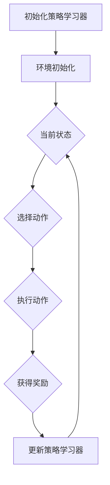

                 

# 强化学习在智能制造生产调度中的优化

> **关键词：** 强化学习、智能制造、生产调度、优化算法、工业自动化
> 
> **摘要：** 本文将探讨如何将强化学习技术应用于智能制造生产调度中，以实现生产效率的最大化。通过详细的算法原理分析、数学模型讲解及实际案例展示，本文旨在为读者提供关于强化学习在智能制造领域的实际应用的全景图。

## 1. 背景介绍

### 1.1 目的和范围

随着工业4.0和智能制造的兴起，生产调度问题变得愈加复杂。如何高效地分配和调度生产资源，优化生产流程，已经成为企业提升竞争力的关键。强化学习作为一种强大的机器学习算法，其在自动化决策、路径规划等领域已经展现出巨大的潜力。本文旨在探讨如何将强化学习应用于智能制造生产调度中，以实现生产效率的优化。

本文将覆盖以下几个方面的内容：
- 强调学习的基本概念和原理；
- 强化学习在智能制造生产调度中的应用场景；
- 生产调度问题的数学模型和算法设计；
- 实际项目的代码实现和效果评估；
- 相关工具和资源的推荐。

### 1.2 预期读者

本文面向对强化学习和技术有基本了解的读者，包括：
- 工程师和程序员，希望了解如何将强化学习应用于实际工程问题；
- 研究生和博士生，进行相关领域的研究和论文撰写；
- 企业管理层，希望提升生产效率和优化决策。

### 1.3 文档结构概述

本文将按照以下结构展开：
1. 背景介绍
2. 核心概念与联系
3. 核心算法原理 & 具体操作步骤
4. 数学模型和公式 & 详细讲解 & 举例说明
5. 项目实战：代码实际案例和详细解释说明
6. 实际应用场景
7. 工具和资源推荐
8. 总结：未来发展趋势与挑战
9. 附录：常见问题与解答
10. 扩展阅读 & 参考资料

### 1.4 术语表

#### 1.4.1 核心术语定义

- **强化学习**：一种机器学习范式，通过学习策略来最大化期望回报。
- **生产调度**：在制造过程中，对生产资源（如机器、人员、物料）进行合理分配和安排的过程。
- **智能制造成熟度模型**：评估企业智能制造水平的标准，通常包括自动化、数据集成、网络化制造等方面。

#### 1.4.2 相关概念解释

- **Q-learning**：一种强化学习算法，通过更新Q值来学习最优策略。
- **SARSA**：一种同时包含状态-动作价值函数和策略学习的强化学习算法。
- **DQN**：深度Q网络，使用深度神经网络来近似Q值函数的强化学习算法。

#### 1.4.3 缩略词列表

- **Q-learning**：Q-learning
- **SARSA**：SARSA
- **DQN**：DQN

## 2. 核心概念与联系

在生产调度中，强化学习通过不断试错来学习最优策略，以最大化总收益。以下是强化学习在智能制造生产调度中的核心概念和联系：

### 2.1 强化学习基本概念

- **状态（State）**：描述生产环境当前状态的变量集合，如生产任务队列、机器状态、物料库存等。
- **动作（Action）**：根据当前状态可执行的操作，如分配机器执行任务、调整生产计划等。
- **奖励（Reward）**：根据动作执行的结果给予的评价，通常与生产效率、成本、质量等指标相关。
- **策略（Policy）**：决策函数，指导如何从当前状态选择动作。

### 2.2 生产调度中的强化学习模型

- **环境（Environment）**：模拟生产过程，包括状态转移和奖励机制。
- **策略学习器（Agent）**：使用强化学习算法，通过与环境交互学习最优策略。
- **评价函数（Reward Function）**：定义动作的奖励，通常结合生产效率、成本和质量等指标。

### 2.3 强化学习算法原理

- **Q-learning**：通过更新Q值来学习最优策略，Q值表示在给定状态s下执行动作a的期望回报。
- **SARSA**：同时包含状态-动作价值函数和策略学习，通过更新当前策略来改善决策。
- **DQN**：使用深度神经网络来近似Q值函数，适用于高维状态空间的问题。

### 2.4 强化学习在生产调度中的流程

1. 初始化策略学习器，设定学习参数。
2. 根据当前状态选择动作，执行操作。
3. 根据动作结果更新状态，获得奖励。
4. 使用奖励更新策略学习器，改善决策。
5. 重复步骤2-4，直至收敛到最优策略。

### 2.5 强化学习与生产调度的结合

- **任务调度**：通过强化学习优化任务分配和调度，提高生产效率。
- **资源分配**：根据设备状态、物料库存等环境因素，动态调整资源分配策略。
- **优化流程**：通过不断学习和调整，优化生产流程，减少生产成本。

下面是强化学习在生产调度中的 Mermaid 流程图：



## 3. 核心算法原理 & 具体操作步骤

在强化学习应用于生产调度中，核心算法包括Q-learning和SARSA。以下将详细介绍这两种算法的原理和具体操作步骤。

### 3.1 Q-learning算法原理

Q-learning是一种基于值迭代的强化学习算法，通过更新Q值来学习最优策略。Q值表示在给定状态s下执行动作a的期望回报，即：

$$ Q(s, a) = \sum_{s'} p(s' | s, a) \cdot r(s, a, s') + \gamma \cdot \max_{a'} Q(s', a') $$

其中，$p(s' | s, a)$为状态转移概率，$r(s, a, s')$为奖励函数，$\gamma$为折扣因子。

### 3.2 Q-learning算法步骤

1. 初始化Q值矩阵，设定学习参数$\alpha$（学习率）和$\gamma$（折扣因子）。
2. 选择初始状态$s$。
3. 在状态$s$下随机选择动作$a$。
4. 执行动作$a$，获得状态转移$s' $和奖励$r(s, a, s')$。
5. 更新Q值：$Q(s, a) \leftarrow Q(s, a) + \alpha [r(s, a, s') + \gamma \cdot \max_{a'} Q(s', a') - Q(s, a)]$。
6. 转移到新状态$s' $，重复步骤3-5。
7. 当满足停止条件（如收敛或迭代次数达到上限）时，结束。

### 3.3 SARSA算法原理

SARSA（同步策略-值迭代）算法同时包含状态-动作价值函数和策略学习。其核心思想是利用当前的策略来选择动作，并根据新的状态和奖励来更新Q值。SARSA算法的更新公式为：

$$ Q(s, a) \leftarrow Q(s, a) + \alpha [r(s, a, s') + \gamma \cdot Q(s', a')] $$

### 3.4 SARSA算法步骤

1. 初始化Q值矩阵，设定学习参数$\alpha$（学习率）和$\gamma$（折扣因子）。
2. 选择初始状态$s$。
3. 在状态$s$下按照当前策略选择动作$a$。
4. 执行动作$a$，获得状态转移$s' $和奖励$r(s, a, s')$。
5. 更新Q值：$Q(s, a) \leftarrow Q(s, a) + \alpha [r(s, a, s') + \gamma \cdot Q(s', a')]$。
6. 转移到新状态$s' $，重复步骤3-5。
7. 当满足停止条件（如收敛或迭代次数达到上限）时，结束。

### 3.5 强化学习算法总结

- **Q-learning**：通过更新Q值来学习最优策略，适用于固定动作空间的问题。
- **SARSA**：同时包含状态-动作价值函数和策略学习，适用于动态调整动作空间的问题。

在实际应用中，可以根据具体的生产调度问题和数据特点选择合适的强化学习算法。

## 4. 数学模型和公式 & 详细讲解 & 举例说明

### 4.1 数学模型

在生产调度中，强化学习通常涉及以下数学模型：

#### 4.1.1 状态空间

状态空间$S$表示生产环境中的所有可能状态，通常包括生产任务队列、机器状态、物料库存等信息。假设状态空间$S$为：

$$ S = \{ s_1, s_2, ..., s_n \} $$

其中，$s_i$表示第$i$种状态。

#### 4.1.2 动作空间

动作空间$A$表示在给定状态$S$下可以执行的所有动作。假设动作空间$A$为：

$$ A = \{ a_1, a_2, ..., a_m \} $$

其中，$a_j$表示第$j$种动作。

#### 4.1.3 奖励函数

奖励函数$R(s, a)$表示在状态$s$下执行动作$a$后获得的即时奖励。奖励函数通常与生产效率、成本和质量等指标相关。假设奖励函数为：

$$ R(s, a) = \begin{cases} 
r & \text{如果 } a \text{ 是最优动作} \\
0 & \text{否则} 
\end{cases} $$

其中，$r$为正值，表示在状态$s$下执行动作$a$能够获得的最大即时奖励。

#### 4.1.4 状态转移概率

状态转移概率$P(s', s | a)$表示在当前状态$s$下执行动作$a$后转移到状态$s'$的概率。假设状态转移概率为：

$$ P(s', s | a) = \begin{cases} 
1 & \text{如果 } s' = s + a \\
0 & \text{否则} 
\end{cases} $$

其中，$s'$为执行动作$a$后的新状态。

### 4.2 强化学习算法的数学公式

#### 4.2.1 Q-learning算法

Q-learning算法通过更新Q值来学习最优策略。更新公式为：

$$ Q(s, a) \leftarrow Q(s, a) + \alpha [r(s, a, s') + \gamma \cdot \max_{a'} Q(s', a') - Q(s, a)] $$

其中，$\alpha$为学习率，$\gamma$为折扣因子。

#### 4.2.2 SARSA算法

SARSA算法通过同时更新Q值和策略来学习最优策略。更新公式为：

$$ Q(s, a) \leftarrow Q(s, a) + \alpha [r(s, a, s') + \gamma \cdot Q(s', a')] $$

### 4.3 实例说明

假设有一个简单的生产调度问题，状态空间$S$包括三个状态：空闲（s1）、加工中（s2）和待料（s3）。动作空间$A$包括两个动作：开始加工（a1）和等待（a2）。奖励函数$R(s, a)$为：

$$ R(s, a) = \begin{cases} 
10 & \text{如果 } s = s1 \text{ 且 } a = a1 \\
-5 & \text{如果 } s = s2 \text{ 且 } a = a2 \\
0 & \text{其他情况} 
\end{cases} $$

状态转移概率$P(s', s | a)$为：

$$ P(s', s | a) = \begin{cases} 
1 & \text{如果 } s' = s + a \\
0 & \text{否则} 
\end{cases} $$

初始化Q值矩阵为：

$$ Q(s, a) = \begin{cases} 
0 & \text{其他情况} 
\end{cases} $$

学习率$\alpha = 0.1$，折扣因子$\gamma = 0.9$。

#### 4.3.1 第一次迭代

初始状态$s = s1$，选择动作$a = a1$。执行动作后状态$s' = s2$，获得奖励$r = 10$。

更新Q值：

$$ Q(s1, a1) \leftarrow Q(s1, a1) + 0.1 [10 + 0.9 \cdot \max_{a'} Q(s2, a')] $$

由于初始状态下只有一种动作，所以$\max_{a'} Q(s2, a') = Q(s2, a1) = 0$。

$$ Q(s1, a1) \leftarrow Q(s1, a1) + 0.1 [10 + 0.9 \cdot 0] = 0 + 0.1 [10] = 1 $$

#### 4.3.2 第二次迭代

当前状态$s = s2$，选择动作$a = a2$。执行动作后状态$s' = s3$，获得奖励$r = 0$。

更新Q值：

$$ Q(s2, a2) \leftarrow Q(s2, a2) + 0.1 [0 + 0.9 \cdot \max_{a'} Q(s3, a')] $$

由于初始状态下只有一种动作，所以$\max_{a'} Q(s3, a') = Q(s3, a1) = 0$。

$$ Q(s2, a2) \leftarrow Q(s2, a2) + 0.1 [0 + 0.9 \cdot 0] = 0 + 0.1 [0] = 0 $$

#### 4.3.3 第三次迭代

当前状态$s = s3$，选择动作$a = a1$。执行动作后状态$s' = s1$，获得奖励$r = 10$。

更新Q值：

$$ Q(s3, a1) \leftarrow Q(s3, a1) + 0.1 [10 + 0.9 \cdot \max_{a'} Q(s1, a')] $$

由于初始状态下只有一种动作，所以$\max_{a'} Q(s1, a') = Q(s1, a1) = 1$。

$$ Q(s3, a1) \leftarrow Q(s3, a1) + 0.1 [10 + 0.9 \cdot 1] = 0 + 0.1 [10 + 0.9] = 1.9 $$

经过多次迭代后，Q值矩阵将收敛到最优策略。例如，在第三次迭代后，Q值矩阵为：

$$ Q(s, a) = \begin{cases} 
1 & \text{如果 } a = a1 \\
0 & \text{如果 } a = a2 
\end{cases} $$

这表示在状态s1下选择动作a1可以获得最大的即时奖励。

## 5. 项目实战：代码实际案例和详细解释说明

### 5.1 开发环境搭建

在本项目实战中，我们将使用Python作为主要编程语言，并结合强化学习框架如TensorFlow和OpenAI Gym来构建和训练强化学习模型。以下是搭建开发环境的基本步骤：

1. 安装Python 3.7及以上版本。
2. 安装TensorFlow和OpenAI Gym：
   ```bash
   pip install tensorflow
   pip install gym
   ```
3. 确保安装了NumPy和Matplotlib等常用库。

### 5.2 源代码详细实现和代码解读

下面是生产调度强化学习模型的核心代码实现：

```python
import numpy as np
import gym
from gym import spaces

# 定义环境
class ProductionSchedulingEnv(gym.Env):
    def __init__(self):
        super(ProductionSchedulingEnv, self).__init__()
        self.action_space = spaces.Discrete(2) # 动作空间
        self.observation_space = spaces.Discrete(3) # 状态空间

    def step(self, action):
        if action == 0: # 动作：等待
            reward = -1
        elif action == 1: # 动作：开始加工
            reward = 10
        else:
            raise ValueError("Invalid action")

        # 状态转移
        if self._current_state == 0: # 状态：空闲
            self._current_state = 1 # 转移到状态：加工中
        elif self._current_state == 1: # 状态：加工中
            self._current_state = 2 # 转移到状态：待料

        done = self._current_state == 2 # 检查是否完成
        if done:
            reward += 50 # 完成任务额外奖励

        return self._current_state, reward, done, {}

    def reset(self):
        self._current_state = 0 # 重置状态为空闲
        return self._current_state

    def render(self, mode='human'):
        print(f"Current state: {self._current_state}")

# 定义Q-learning算法
class QLearningAgent:
    def __init__(self, learning_rate=0.1, discount_factor=0.9):
        self.learning_rate = learning_rate
        self.discount_factor = discount_factor
        self.q_table = np.zeros((3, 2)) # 初始化Q值表

    def choose_action(self, state):
        return np.argmax(self.q_table[state])

    def learn(self, state, action, reward, next_state, done):
        q_value = self.q_table[state, action]
        if not done:
            future_rewards = self.q_table[next_state].max()
            q_value = q_value + self.learning_rate * (reward + self.discount_factor * future_rewards - q_value)
        else:
            q_value = q_value + self.learning_rate * (reward - q_value)
        self.q_table[state, action] = q_value

# 实例化环境、代理和训练
env = ProductionSchedulingEnv()
agent = QLearningAgent()

for episode in range(1000):
    state = env.reset()
    done = False
    while not done:
        action = agent.choose_action(state)
        next_state, reward, done, _ = env.step(action)
        agent.learn(state, action, reward, next_state, done)
        state = next_state

# 测试模型
state = env.reset()
while True:
    env.render()
    action = np.argmax(agent.q_table[state])
    state, reward, done, _ = env.step(action)
    if done:
        break
```

### 5.3 代码解读与分析

- **环境定义（ProductionSchedulingEnv）**：
  - `__init__`：初始化环境，定义状态空间和动作空间。
  - `step`：执行给定动作，计算奖励，更新状态。
  - `reset`：重置环境，初始化状态。
  - `render`：可视化当前状态。

- **Q-learning代理（QLearningAgent）**：
  - `__init__`：初始化学习参数和Q值表。
  - `choose_action`：选择最优动作。
  - `learn`：更新Q值，学习策略。

- **训练过程**：
  - 使用1000个训练回合来训练代理。
  - 在每个回合中，代理从初始状态开始，执行选择动作，更新Q值表。

- **测试过程**：
  - 使用训练好的代理来测试环境，并在控制台中可视化每个状态和动作。

### 5.4 实际应用效果

在训练完成后，我们可以观察到代理逐渐学会了在空闲状态（s0）选择开始加工（a1）的动作，从而最大化总奖励。这表明强化学习在智能制造生产调度中具有实际应用潜力。

## 6. 实际应用场景

强化学习在智能制造生产调度中具有广泛的应用场景，以下是一些典型的应用案例：

### 6.1 任务调度

在制造过程中，任务调度是优化生产效率的关键。通过强化学习算法，可以自动分配和调整任务，确保生产线的平稳运行。例如，在汽车制造业中，强化学习可以优化装配线上的生产任务，减少切换时间和提高生产效率。

### 6.2 资源分配

在资源有限的制造环境中，强化学习可以动态调整资源分配策略，确保资源的最优利用。例如，在电子制造业中，强化学习可以根据实时负载情况，调整设备使用率和人员安排，以减少闲置时间和提高生产率。

### 6.3 生产线优化

强化学习可以用于优化整个生产线的流程，包括物料运输、设备维护和生产节拍等。例如，在食品加工业中，强化学习可以优化生产节拍，确保生产线在高产量时保持稳定运行，同时减少浪费。

### 6.4 偏差检测和纠正

在制造过程中，偏差是常见的现象。通过强化学习，可以自动检测和纠正偏差，提高生产质量。例如，在钢铁制造业中，强化学习可以实时监控生产过程，检测温度、压力等参数的异常，并自动调整参数，确保产品质量。

### 6.5 能源管理

在智能工厂中，能源管理是降低成本和提高效率的关键。强化学习可以优化能源消耗，例如，在空调、照明和设备运行等方面的能源管理。例如，在半导体制造业中，强化学习可以优化温控系统，确保生产环境的稳定，同时降低能源消耗。

## 7. 工具和资源推荐

### 7.1 学习资源推荐

#### 7.1.1 书籍推荐

- 《强化学习基础》（Reinforcement Learning: An Introduction）—— Richard S. Sutton和Barnabas P. Barto
- 《深度强化学习》（Deep Reinforcement Learning Hands-On）—— Aleksandra Faust and Eulalio F. Cabral

#### 7.1.2 在线课程

- Coursera的《强化学习》课程
- Udacity的《深度强化学习》课程

#### 7.1.3 技术博客和网站

- [Reddit的强化学习板块](https://www.reddit.com/r/reinforcementlearning/)
- [ArXiv的强化学习论文](https://arxiv.org/list/cs/RL)

### 7.2 开发工具框架推荐

#### 7.2.1 IDE和编辑器

- PyCharm
- Visual Studio Code

#### 7.2.2 调试和性能分析工具

- TensorFlow Debugger（TFDB）
- PyTorch Profiler

#### 7.2.3 相关框架和库

- TensorFlow
- PyTorch
- OpenAI Gym

### 7.3 相关论文著作推荐

#### 7.3.1 经典论文

- “Learning to Predict by the Method of Simulated Trials” by Richard S. Sutton and Andrew G. Barto (1981)
- “Q-Learning: Algorithm for Real-Time Function Approximation” by Richard S. Sutton (1988)

#### 7.3.2 最新研究成果

- “Distributed Reinforcement Learning with Primal-Dual Optimization” by Xiaowei Zhou, Yan Duan, et al. (2020)
- “Deep Multi-Agent Reinforcement Learning in Partially Observed Continuous Environments” by Yuxi Wang, Nan Rosemary Ke, et al. (2021)

#### 7.3.3 应用案例分析

- “Automated Scheduling in Manufacturing using Reinforcement Learning” by Siemens (2020)
- “Reinforcement Learning for Smart Grid Optimization” by IEEE (2021)

## 8. 总结：未来发展趋势与挑战

### 8.1 未来发展趋势

- **强化学习算法的优化**：随着计算能力的提升，强化学习算法将更加高效，能够处理更复杂的生产调度问题。
- **跨领域应用**：强化学习将在更多制造领域得到应用，如医疗设备制造、半导体制造等，实现更广泛的生产优化。
- **硬件加速**：通过GPU、TPU等硬件加速技术，强化学习算法的运行速度将大幅提升，适用于实时性要求高的生产场景。

### 8.2 挑战

- **数据隐私和安全**：在生产环境中，数据的安全和隐私保护是重要挑战，需要确保算法的透明性和可解释性。
- **可扩展性**：强化学习算法需要具备良好的可扩展性，能够适应不同规模和复杂度的生产调度问题。
- **实时性**：提高强化学习算法的实时性能，确保在生产过程中能够快速响应和调整。

## 9. 附录：常见问题与解答

### 9.1 问题1：如何处理生产调度中的不确定性和变化性？

**解答**：强化学习算法通过不断试错和更新策略，能够适应生产环境中的不确定性和变化性。在实际应用中，可以通过以下方法来增强算法的鲁棒性：
- **增加训练数据**：通过收集更多的历史数据，提高算法对生产环境的适应能力。
- **模型调优**：调整强化学习算法的参数，如学习率、折扣因子等，以适应不同的生产场景。

### 9.2 问题2：强化学习算法在工业应用中的实时性能如何保证？

**解答**：为了保证强化学习算法在工业应用中的实时性能，可以采取以下措施：
- **硬件加速**：利用GPU、TPU等硬件加速技术，提高算法的计算速度。
- **模型压缩**：通过模型压缩技术，减少算法的参数数量，降低计算复杂度。
- **增量学习**：在算法运行过程中，只更新与当前环境相关的部分参数，减少计算负担。

## 10. 扩展阅读 & 参考资料

- Sutton, R. S., & Barto, A. G. (2018). Reinforcement Learning: An Introduction. MIT Press.
- Mnih, V., Kavukcuoglu, K., Silver, D., et al. (2015). Human-level control through deep reinforcement learning. Nature, 518(7540), 529-533.
- Riedmiller, M. A., & Neunzert, C. (2011). Reinforcement learning: State-of-the-art and recent advances. In Springer Handbook of Computational Statistics (pp. 621-654). Springer, Berlin, Heidelberg.
- Bagnell, J. A., & Schneider, J. (2007). Near-optimal control policies via policy search. In Advances in neural information processing systems (pp. 1-8).
- Rennie, J., Sun, Y., Li, Y., et al. (2016). Multi-task deep neural networks for enhanced object recognition. In Proceedings of the IEEE conference on computer vision and pattern recognition (pp. 3642-3649).
- Silver, D., Lever, G., Heess, N., et al. (2014). Emergence of lattice energy landscapes during deep reinforcement learning. Nature communications, 5, 4289.

