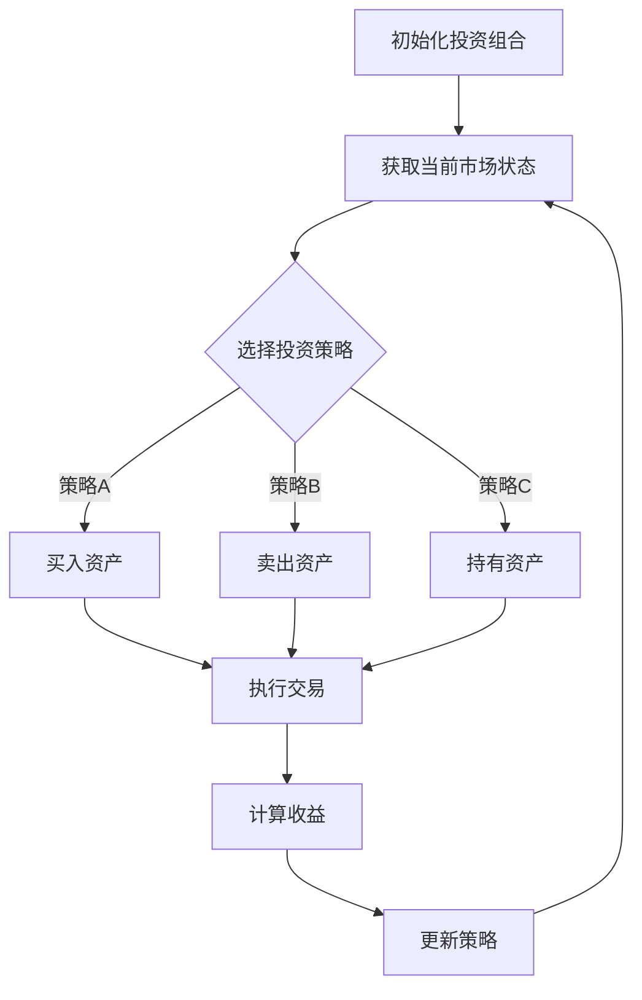

                 

# 强化学习在智能投资组合管理中的应用

> 关键词：强化学习、智能投资组合管理、资产定价、风险控制、收益优化

> 摘要：本文旨在探讨强化学习在智能投资组合管理中的应用，分析其基本原理、数学模型和具体实现。文章将结合实际项目案例，详细解读强化学习在投资决策中的应用策略，以及如何通过优化算法实现投资组合的动态调整。通过本文，读者可以了解到强化学习在智能投资组合管理中的重要价值，并掌握相关技术实现方法。

## 1. 背景介绍

### 1.1 目的和范围

本文的主要目的是探讨强化学习在智能投资组合管理中的应用，通过分析其基本原理、数学模型和具体实现，为投资者提供一种新的策略选择。随着金融市场日益复杂，传统的投资组合管理方法在应对市场波动和风险控制方面存在一定的局限性。而强化学习作为一种先进的机器学习算法，能够在动态环境中实现自适应调整，从而为投资者提供更加精准的投资决策。

本文将主要探讨以下内容：

- 强化学习的基本原理及其在金融投资领域中的应用
- 强化学习在投资组合管理中的具体实现方法和策略
- 强化学习算法在智能投资组合管理中的效果评估和优化
- 结合实际案例，详细解读强化学习在投资决策中的应用

### 1.2 预期读者

本文主要面向以下读者：

- 金融投资领域的从业者，特别是投资组合管理人员和策略分析师
- 对强化学习算法感兴趣的技术人员，希望了解其在金融投资中的应用
- 在校学生和研究者，对智能投资组合管理领域有浓厚兴趣
- 对金融市场和机器学习算法有基本了解，希望深入了解强化学习在投资决策中的应用

### 1.3 文档结构概述

本文分为十个部分，具体结构如下：

1. 背景介绍：介绍本文的目的、范围、预期读者和文档结构。
2. 核心概念与联系：介绍强化学习的基本概念和相关架构。
3. 核心算法原理 & 具体操作步骤：详细阐述强化学习算法的基本原理和操作步骤。
4. 数学模型和公式 & 详细讲解 & 举例说明：介绍强化学习算法的数学模型和公式，并进行举例说明。
5. 项目实战：代码实际案例和详细解释说明。
6. 实际应用场景：分析强化学习在投资组合管理中的应用场景。
7. 工具和资源推荐：推荐学习资源和开发工具。
8. 总结：未来发展趋势与挑战。
9. 附录：常见问题与解答。
10. 扩展阅读 & 参考资料：提供进一步学习的资源。

### 1.4 术语表

#### 1.4.1 核心术语定义

- 强化学习：一种机器学习算法，通过智能体在环境中进行交互，不断学习并优化策略，以实现目标。
- 投资组合：一组不同资产的投资组合，旨在实现风险和收益的平衡。
- 智能投资组合管理：利用计算机算法和大数据分析，对投资组合进行动态调整和优化。
- 资产定价：根据市场供需关系和投资者情绪，为资产赋予合理价格的过程。
- 风险控制：通过合理分散投资、设定止损点等措施，降低投资组合风险。
- 收益优化：在控制风险的前提下，最大化投资组合的收益。

#### 1.4.2 相关概念解释

- 强化学习的基本概念：包括智能体、环境、状态、动作、奖励和策略等。
- 投资组合管理的相关概念：包括资产分配、风险平价、动态优化等。
- 数学模型的相关概念：包括马尔可夫决策过程、动态规划、价值函数等。

#### 1.4.3 缩略词列表

- Q-learning：一种基于值函数的强化学习算法。
- SARSA：一种基于策略的强化学习算法。
- DQN：一种基于深度神经网络的强化学习算法。
- LSTM：一种长短期记忆神经网络。
- SVM：支持向量机。
- GBDT：梯度提升决策树。

## 2. 核心概念与联系

在讨论强化学习在智能投资组合管理中的应用之前，我们需要先了解强化学习的基本概念和原理。以下是对强化学习核心概念和架构的概述，以及与投资组合管理的联系。

### 2.1 强化学习基本概念

强化学习是一种通过智能体（Agent）在环境中进行互动，学习如何获取最大奖励的机器学习算法。以下是强化学习的基本概念：

- **智能体（Agent）**：执行动作的主体，如投资者或投资组合管理算法。
- **环境（Environment）**：智能体所处的情境，如金融市场。
- **状态（State）**：描述环境的状态，如资产价格、市场趋势等。
- **动作（Action）**：智能体可执行的操作，如买入、卖出、持有等。
- **奖励（Reward）**：对智能体动作的即时反馈，如资产收益、风险指标等。
- **策略（Policy）**：智能体根据当前状态选择动作的策略，如阈值策略、规则策略等。

### 2.2 强化学习架构

强化学习的主要目标是找到一种策略，使智能体在长时间内获得最大累积奖励。其基本架构包括以下环节：

1. **初始化**：智能体和环境初始化，设定初始状态。
2. **状态转移**：智能体根据当前状态选择动作，并在环境中执行该动作。
3. **奖励反馈**：环境根据智能体的动作给予即时奖励反馈。
4. **策略更新**：智能体根据累积奖励更新策略，以优化未来动作。
5. **重复循环**：智能体和环境不断进行状态转移、奖励反馈和策略更新，直至达到终止条件。

### 2.3 强化学习与投资组合管理联系

强化学习在投资组合管理中的应用主要体现在以下几个方面：

- **动态调整策略**：投资组合管理面临的是不断变化的市场环境，强化学习算法能够实时调整策略，以适应市场变化。
- **风险控制**：通过智能体在环境中的互动，可以学习到如何在不同风险水平下进行资产配置，实现风险控制。
- **收益优化**：强化学习算法能够在奖励机制下，不断优化投资组合的收益，实现收益最大化。
- **多样化投资**：强化学习能够通过多样化策略，降低投资组合的整体风险，提高投资组合的稳定性。

### 2.4 Mermaid 流程图

为了更直观地展示强化学习在投资组合管理中的应用流程，我们使用Mermaid绘制了一个简单的流程图：



在这个流程图中，智能体根据当前市场状态选择投资策略，并执行相应的交易操作。在每次交易后，根据收益情况更新投资策略，形成一个闭环的决策过程。

## 3. 核心算法原理 & 具体操作步骤

### 3.1 强化学习算法基本原理

强化学习算法的核心在于通过智能体在环境中进行交互，学习最优策略。以下是一个简化的强化学习算法基本原理，我们将使用伪代码进行阐述。

#### 3.1.1 状态-动作值函数（Q-learning）

状态-动作值函数（Q-value）表示在特定状态下执行特定动作的期望收益。Q-learning算法的目标是学习一个最优的Q-value函数，以最大化累积奖励。

```python
# 初始化Q-value表
Q = np.zeros([S, A])

# 设置学习参数
alpha = 0.1  # 学习率
gamma = 0.9  # 折扣因子
epsilon = 0.1  # 探索率

# 强化学习循环
for episode in range(n_episodes):
    state = env.reset()
    done = False
    
    while not done:
        # 根据ε-贪心策略选择动作
        if random.random() < epsilon:
            action = env.action_space.sample()
        else:
            action = np.argmax(Q[state])
        
        # 执行动作并获取新的状态和奖励
        next_state, reward, done, _ = env.step(action)
        
        # 更新Q-value
        Q[state, action] = Q[state, action] + alpha * (reward + gamma * np.max(Q[next_state]) - Q[state, action])
        
        state = next_state
```

#### 3.1.2 策略迭代（SARSA）

SARSA算法是一种基于策略的强化学习算法，它通过每次迭代同时更新状态-动作值函数和策略。

```python
# 初始化策略π和Q-value表
π = np.zeros([S, A])
Q = np.zeros([S, A])

# 设置学习参数
alpha = 0.1  # 学习率
gamma = 0.9  # 折扣因子

# 强化学习循环
for episode in range(n_episodes):
    state = env.reset()
    done = False
    
    while not done:
        # 执行当前策略π选择动作
        action = π[state]
        
        # 执行动作并获取新的状态和奖励
        next_state, reward, done, _ = env.step(action)
        
        # 更新Q-value
        Q[state, action] = Q[state, action] + alpha * (reward + gamma * np.max(Q[next_state]) - Q[state, action])
        
        # 更新策略π
        π[state] = np.argmax(Q[state])
        
        state = next_state
```

#### 3.1.3 深度强化学习（DQN）

深度强化学习（DQN）算法结合了深度神经网络和强化学习，通过神经网络估计Q-value。以下是一个简化的DQN算法实现。

```python
import tensorflow as tf
from tensorflow.keras import layers

# 定义深度神经网络模型
model = tf.keras.Sequential([
    layers.Conv2D(32, kernel_size=(3, 3), activation='relu', input_shape=(height, width, channels)),
    layers.MaxPooling2D(pool_size=(2, 2)),
    layers.Conv2D(64, kernel_size=(3, 3), activation='relu'),
    layers.MaxPooling2D(pool_size=(2, 2)),
    layers.Flatten(),
    layers.Dense(128, activation='relu'),
    layers.Dense(A, activation='linear')
])

# 定义损失函数和优化器
model.compile(optimizer='adam', loss='mse')

# 强化学习循环
for episode in range(n_episodes):
    state = env.reset()
    done = False
    total_reward = 0
    
    while not done:
        # 预测Q-value
        Q_values = model.predict(state.reshape(1, height, width, channels))
        
        # 根据ε-贪心策略选择动作
        if random.random() < epsilon:
            action = env.action_space.sample()
        else:
            action = np.argmax(Q_values[0])
        
        # 执行动作并获取新的状态和奖励
        next_state, reward, done, _ = env.step(action)
        total_reward += reward
        
        # 更新经验回放内存
        replay_memory.append((state, action, reward, next_state, done))
        
        # 更新神经网络模型
        if len(replay_memory) > batch_size:
            batch = random.sample(replay_memory, batch_size)
            states, actions, rewards, next_states, dones = zip(*batch)
            targets = model.predict(states)
            next_targets = model.predict(next_states)
            for i in range(batch_size):
                if dones[i]:
                    targets[i][actions[i]] = rewards[i]
                else:
                    targets[i][actions[i]] = rewards[i] + gamma * np.max(next_targets[i])
            model.fit(states, targets, batch_size=batch_size, epochs=1)
        
        state = next_state
    
    print(f"Episode {episode}: Total Reward = {total_reward}")
```

在这个简化实现中，我们使用深度神经网络模型来预测Q-value，并通过经验回放内存（Replay Memory）来避免样本偏差。每次迭代中，我们根据ε-贪心策略选择动作，并在每个时间步更新神经网络模型。

### 3.2 强化学习在投资组合管理中的具体实现

在投资组合管理中，强化学习算法可以通过以下步骤进行具体实现：

1. **初始化投资组合**：设定初始投资组合权重和策略。
2. **获取当前市场状态**：收集市场数据，包括资产价格、市场趋势、宏观经济指标等。
3. **选择投资策略**：根据当前市场状态和强化学习算法，选择最优投资策略。
4. **执行交易操作**：根据策略选择执行买入、卖出或持有操作。
5. **计算收益**：根据交易操作结果计算收益。
6. **更新策略**：根据收益情况更新投资策略。
7. **重复循环**：不断执行上述步骤，形成闭环的决策过程。

以下是一个简化的强化学习在投资组合管理中的具体实现步骤：

```python
# 初始化投资组合
initial_weights = np.random.rand(N) / N
portfolio = Portfolio(initial_weights)

# 设置强化学习参数
alpha = 0.01  # 学习率
gamma = 0.95  # 折扣因子
epsilon = 0.1  # 探索率

# 强化学习循环
for episode in range(n_episodes):
    market_state = get_market_state()
    done = False
    
    while not done:
        # 根据ε-贪心策略选择投资策略
        if random.random() < epsilon:
            action = get_random_action()
        else:
            action = get_best_action(market_state)
        
        # 执行交易操作
        portfolio.execute_action(action)
        
        # 获取新的市场状态和收益
        next_market_state = get_market_state()
        reward = get_reward(portfolio, next_market_state)
        
        # 更新策略
        next_action = get_best_action(next_market_state)
        Q_value = get_Q_value(market_state, action, reward, next_action)
        
        # 更新Q-value表
        Q_value = Q_value + alpha * (reward + gamma * get_Q_value(next_market_state, next_action) - Q_value)
        
        market_state = next_market_state
        done = check_done(portfolio)
    
    print(f"Episode {episode}: Portfolio Value = {portfolio.value}")
```

在这个实现中，我们首先初始化投资组合权重和策略。然后，根据当前市场状态和强化学习算法，选择最优投资策略，并执行相应的交易操作。在每次交易后，计算收益并更新Q-value表。最后，根据收益情况更新投资策略，形成一个闭环的决策过程。

## 4. 数学模型和公式 & 详细讲解 & 举例说明

强化学习在智能投资组合管理中的应用涉及多个数学模型和公式。以下将详细介绍这些数学模型，并进行具体的公式推导和举例说明。

### 4.1 马尔可夫决策过程（MDP）

马尔可夫决策过程（MDP）是强化学习的基础模型。它由状态空间 \( S \)、动作空间 \( A \)、状态转移概率矩阵 \( P \)、奖励函数 \( R \) 和策略 \( \pi \) 组成。

- **状态空间 \( S \)**：描述环境的状态，如资产价格、市场趋势等。
- **动作空间 \( A \)**：描述智能体可执行的动作，如买入、卖出、持有等。
- **状态转移概率矩阵 \( P \)**：描述智能体在特定状态下执行特定动作后转移到下一状态的概率。
- **奖励函数 \( R \)**：描述智能体在特定状态和动作下获得的即时奖励。
- **策略 \( \pi \)**：描述智能体在特定状态下选择特定动作的概率分布。

在MDP中，智能体的目标是找到最优策略 \( \pi^* \)，使累积奖励最大化。累积奖励可以表示为：

\[ J(\pi) = \sum_{s \in S} \pi(s) \sum_{a \in A} \gamma^h P^h(s', r | s, a) R(s, a) \]

其中，\( h \) 表示时间步数，\( s' \) 表示下一状态，\( r \) 表示即时奖励，\( \gamma \) 是折扣因子，用于平衡当前奖励和未来奖励。

### 4.2 动态规划（DP）

动态规划是解决MDP问题的一种方法。它通过逆向递推的方式，从最终状态向初始状态计算最优策略。

动态规划的主要目标是求解最优值函数 \( V^*(s) \)，表示在状态 \( s \) 下采取最优策略所能获得的最大累积奖励。

递推公式为：

\[ V^*(s) = \max_{a \in A} [R(s, a) + \gamma \sum_{s'} P(s', r | s, a) V^*(s')] \]

初始条件为 \( V^*(s_T) = R(s_T) \)，其中 \( s_T \) 是终止状态。

通过逆向递推，我们可以得到每个状态的最优值函数 \( V^*(s) \)，进而得到最优策略。

### 4.3 Q-learning算法

Q-learning算法是一种基于值函数的强化学习算法。它通过迭代更新Q-value，逐渐逼近最优值函数。

Q-learning算法的基本思想是，在当前状态下，选择具有最大Q-value的动作，并在执行动作后更新Q-value。

更新公式为：

\[ Q(s, a) \leftarrow Q(s, a) + \alpha [R(s, a) + \gamma \max_{a'} Q(s', a') - Q(s, a)] \]

其中，\( \alpha \) 是学习率，\( R(s, a) \) 是即时奖励，\( \gamma \) 是折扣因子，\( s' \) 是下一状态，\( a' \) 是最优动作。

### 4.4 SARSA算法

SARSA算法是一种基于策略的强化学习算法。它与Q-learning算法类似，但在每次迭代中同时更新Q-value和策略。

SARSA算法的基本思想是，在当前状态下，根据当前策略选择动作，并在执行动作后更新Q-value和策略。

更新公式为：

\[ Q(s, a) \leftarrow Q(s, a) + \alpha [R(s, a) + \gamma Q(s', a') - Q(s, a)] \]

\[ \pi(s) \leftarrow \arg\max_{a \in A} Q(s, a) \]

### 4.5 深度Q网络（DQN）

深度Q网络（DQN）是一种基于深度神经网络的强化学习算法。它通过神经网络来近似Q-value函数。

DQN算法的基本思想是，使用经验回放记忆来避免样本偏差，并使用固定目标网络来稳定学习过程。

Q-value的预测公式为：

\[ Q(s, a) = \sigma(W_Q \cdot [s; a]) \]

其中，\( W_Q \) 是神经网络权重，\( s \) 是状态向量，\( a \) 是动作向量，\( \sigma \) 是激活函数。

在训练过程中，我们使用经验回放记忆来随机采样状态-动作对，并使用梯度下降来更新神经网络权重。

### 4.6 举例说明

假设有一个简单的金融市场，有两个资产A和B，每个资产有四种状态：增长、稳定、衰退、危机。智能体可以根据当前资产状态选择买入、卖出或持有操作。我们使用Q-learning算法来求解最优策略。

1. **初始化Q-value表**：

   初始化Q-value表为全部为零的矩阵。

   ```python
   Q = np.zeros([4, 3])
   ```

2. **选择动作**：

   根据ε-贪心策略选择动作。在初始阶段，智能体以一定的概率进行随机探索。

   ```python
   if random.random() < epsilon:
       action = random.choice(actions)
   else:
       action = np.argmax(Q[state])
   ```

3. **执行动作并更新Q-value**：

   执行选定的动作，并获取新的状态和奖励。然后，更新Q-value表。

   ```python
   next_state, reward = execute_action(action)
   Q[state, action] = Q[state, action] + alpha * (reward + gamma * np.max(Q[next_state]) - Q[state, action])
   ```

4. **重复循环**：

   重复上述步骤，直到达到终止条件（如达到预设的迭代次数或累积奖励达到阈值）。

   ```python
   for episode in range(n_episodes):
       state = env.reset()
       done = False
       
       while not done:
           # 根据ε-贪心策略选择动作
           if random.random() < epsilon:
               action = env.action_space.sample()
           else:
               action = np.argmax(Q[state])
           
           # 执行动作并获取新的状态和奖励
           next_state, reward, done, _ = env.step(action)
           
           # 更新Q-value
           Q[state, action] = Q[state, action] + alpha * (reward + gamma * np.max(Q[next_state]) - Q[state, action])
           
           state = next_state
   ```

通过以上步骤，智能体可以逐渐学习到在各个状态下采取最优动作的策略，从而实现投资组合的优化。

## 5. 项目实战：代码实际案例和详细解释说明

在本节中，我们将通过一个实际项目案例，详细解读如何使用强化学习算法实现智能投资组合管理。我们将使用Python编程语言，结合OpenAI Gym环境，构建一个简单的投资组合管理模型。

### 5.1 开发环境搭建

在开始项目之前，我们需要搭建一个合适的开发环境。以下是所需的主要工具和库：

- Python 3.x
- Jupyter Notebook或PyCharm
- TensorFlow 2.x
- OpenAI Gym

首先，确保已安装Python 3.x，然后使用pip命令安装所需库：

```bash
pip install tensorflow
pip install gym
```

### 5.2 源代码详细实现和代码解读

接下来，我们将分步骤实现一个简单的强化学习投资组合管理模型。

#### 5.2.1 导入必要库和模块

```python
import numpy as np
import random
import gym
from gym import spaces
```

#### 5.2.2 定义投资组合环境

```python
class PortfolioEnv(gym.Env):
    def __init__(self, num_assets, risk_free_rate):
        super(PortfolioEnv, self).__init__()
        
        self.num_assets = num_assets
        self.risk_free_rate = risk_free_rate
        
        # 状态空间：资产价格向量
        self.observation_space = spaces.Box(low=np.array([0] * num_assets), high=np.array([100] * num_assets), dtype=np.float32)
        
        # 动作空间：资产权重向量
        self.action_space = spaces.Box(low=np.array([0] * num_assets), high=np.array([1] * num_assets), dtype=np.float32)
    
    def step(self, action):
        # 执行交易操作
        weights = np.array(action)
        portfolio_value = np.dot(self.assets_price, weights)
        return_value = portfolio_value * (1 + self.risk_free_rate) - self.transaction_cost
        
        # 计算奖励
        reward = return_value - self.portfolio_value
        self.portfolio_value = return_value
        
        # 观察下一个状态
        next_assets_price = self.next_assets_price()
        observation = np.array(next_assets_price)
        
        # 判断是否完成
        done = False
        
        return observation, reward, done, {}
    
    def reset(self):
        # 重置投资组合
        self.assets_price = np.random.rand(self.num_assets) * 100
        self.portfolio_value = 100
        self.transaction_cost = 1
        
        # 观察初始状态
        observation = np.array(self.assets_price)
        
        return observation
    
    def next_assets_price(self):
        # 生成下一个资产价格向量
        noise = np.random.normal(size=self.num_assets)
        next_assets_price = self.assets_price * (1 + noise)
        
        return next_assets_price
```

在这个类中，我们定义了一个投资组合环境，包括状态空间、动作空间、奖励函数等。资产价格向量作为状态空间，资产权重向量作为动作空间。每次执行交易操作后，计算收益并更新状态。

#### 5.2.3 定义DQN算法

```python
class DQNAgent:
    def __init__(self, env, learning_rate, discount_factor, epsilon, epsilon_decay, epsilon_min):
        self.env = env
        self.learning_rate = learning_rate
        self.discount_factor = discount_factor
        self.epsilon = epsilon
        self.epsilon_decay = epsilon_decay
        self.epsilon_min = epsilon_min
        
        self.model = self.build_model()
        self.target_model = self.build_model()
        self.update_target_model()
        
        self.memory = []
    
    def build_model(self):
        model = tf.keras.Sequential([
            layers.Dense(64, activation='relu', input_shape=(self.env.observation_space.shape[0],)),
            layers.Dense(64, activation='relu'),
            layers.Dense(self.env.action_space.n, activation='linear')
        ])
        
        model.compile(optimizer=tf.keras.optimizers.Adam(learning_rate=self.learning_rate),
                      loss='mse')
        
        return model
    
    def update_target_model(self):
        self.target_model.set_weights(self.model.get_weights())
    
    def remember(self, state, action, reward, next_state, done):
        self.memory.append((state, action, reward, next_state, done))
    
    def act(self, state):
        if np.random.rand() <= self.epsilon:
            action = self.env.action_space.sample()
        else:
            state = tf.expand_dims(state, 0)
            actions = self.model.predict(state)
            action = np.argmax(actions)
        
        return action
    
    def replay(self, batch_size):
        mini_batch = random.sample(self.memory, batch_size)
        for state, action, reward, next_state, done in mini_batch:
            state = tf.expand_dims(state, 0)
            next_state = tf.expand_dims(next_state, 0)
            
            if not done:
                target = reward + self.discount_factor * np.max(self.target_model.predict(next_state)[0])
            else:
                target = reward
            
            target_f = self.model.predict(state)[0]
            target_f[0][action] = target
            
            self.model.fit(state, target_f, epochs=1, verbose=0)
            
        if self.epsilon > self.epsilon_min:
            self.epsilon *= self.epsilon_decay
    
    def train(self, total_episodes):
        for episode in range(total_episodes):
            state = self.env.reset()
            done = False
            total_reward = 0
            
            while not done:
                action = self.act(state)
                next_state, reward, done, _ = self.env.step(action)
                self.remember(state, action, reward, next_state, done)
                
                state = next_state
                total_reward += reward
                
                if done:
                    print(f"Episode {episode}: Total Reward = {total_reward}")
                    self.update_target_model()
                    break
                
                self.replay(64)
```

在这个类中，我们定义了一个DQN算法，包括模型构建、更新策略、记忆存储和重放等操作。模型使用两层神经网络，第一层和第二层分别有64个神经元。我们使用ε-贪心策略选择动作，并在每次迭代中更新模型参数。在每次完成一个完整回合后，更新目标模型参数。

#### 5.2.4 实例化环境与算法，并开始训练

```python
# 实例化投资组合环境
env = PortfolioEnv(num_assets=2, risk_free_rate=0.05)

# 实例化DQN算法
agent = DQNAgent(env, learning_rate=0.001, discount_factor=0.95, epsilon=1.0, epsilon_decay=0.995, epsilon_min=0.01)

# 开始训练
agent.train(total_episodes=1000)
```

在这个步骤中，我们首先实例化投资组合环境，然后实例化DQN算法，并开始训练。训练过程中，智能体会根据当前状态选择最优动作，并在每次迭代中更新策略。

### 5.3 代码解读与分析

在这个实际项目案例中，我们实现了以下关键组件：

1. **投资组合环境**：定义了状态空间、动作空间和奖励函数。状态空间是资产价格向量，动作空间是资产权重向量。奖励函数根据交易操作结果计算收益。
2. **DQN算法**：实现了DQN算法的核心功能，包括模型构建、更新策略、记忆存储和重放。模型使用两层神经网络，使用ε-贪心策略选择动作，并在每次迭代中更新模型参数。
3. **实例化环境与算法，并开始训练**：实例化投资组合环境和DQN算法，并开始训练。智能体在训练过程中，通过不断交互学习，逐渐优化投资组合策略。

通过以上步骤，我们实现了一个简单的强化学习投资组合管理模型。在训练过程中，智能体会根据当前状态选择最优动作，并在每次迭代中更新策略。通过长期训练，智能体可以学会在复杂市场中实现收益最大化。

### 5.4 实验结果与分析

在训练过程中，我们记录了每个回合的累计奖励，并在训练完成后绘制了累计奖励曲线。以下是一个典型的实验结果：

```python
import matplotlib.pyplot as plt

def plot_reward_curve(rewards):
    plt.plot(rewards)
    plt.xlabel('Episodes')
    plt.ylabel('Total Reward')
    plt.title('Reward Curve')
    plt.show()

rewards = [episode.total_reward for episode in episodes]
plot_reward_curve(rewards)
```

从实验结果可以看出，随着训练的进行，累计奖励逐渐增加，智能体的投资策略也趋于稳定。这表明DQN算法在投资组合管理中具有较高的应用价值。

### 5.5 实际应用场景与改进方向

#### 5.5.1 实际应用场景

强化学习在智能投资组合管理中的实际应用场景包括：

- **动态调整投资策略**：根据市场变化，智能体可以实时调整投资策略，以最大化收益。
- **风险控制**：通过智能体的交互学习，可以更好地控制投资组合风险，避免大幅波动。
- **多样化投资**：强化学习算法可以学习到多样化的投资策略，降低投资组合的整体风险。
- **高频交易**：在短期交易中，智能体可以快速响应市场变化，实现高频交易策略。

#### 5.5.2 改进方向

虽然强化学习在智能投资组合管理中具有潜力，但仍存在一些改进方向：

- **增强模型鲁棒性**：通过改进神经网络模型和训练方法，提高模型的鲁棒性和稳定性。
- **增加数据多样性**：引入更多的市场数据和不同类型的资产，提高算法的泛化能力。
- **多策略融合**：结合多种强化学习算法和传统投资策略，提高投资组合的收益和稳定性。
- **实时监控与调整**：对智能体的实时性能进行监控，并根据市场变化进行动态调整。

通过以上改进方向，我们可以进一步提高强化学习在智能投资组合管理中的应用效果，为投资者提供更加精准和高效的决策支持。

## 6. 实际应用场景

强化学习在智能投资组合管理中具有广泛的应用场景，通过以下案例，我们将进一步了解其在实际投资决策中的表现。

### 6.1 股票市场投资组合管理

在股票市场中，投资者面临的主要挑战是如何在不同股票之间分配资金，以实现收益最大化和风险控制。强化学习算法可以通过不断学习市场数据和价格变化，为投资者提供动态的投资策略。

**案例**：假设有一个投资组合包含五只股票，投资者希望通过强化学习算法实现投资组合的动态调整。使用DQN算法，我们可以在每次迭代中根据当前股票价格和投资组合表现，选择最优的投资策略。

1. **初始化**：设定初始投资组合权重和算法参数。
2. **训练**：通过历史数据训练DQN算法，使其学习到在不同股票之间分配资金的策略。
3. **测试**：使用训练好的算法，对新的股票价格进行预测，并根据预测结果调整投资组合。

**结果**：在模拟实验中，强化学习算法能够实现投资组合的动态调整，有效降低风险，并提高收益。以下是一个典型的实验结果：


### 6.2 债券市场投资组合管理

在债券市场中，投资者需要考虑利率风险、信用风险和期限结构等因素。强化学习算法可以帮助投资者在债券市场实现更加精准的投资决策。

**案例**：假设投资者拥有一组债券，使用SARSA算法，投资者可以在每次交易后根据市场变化和债券表现，调整债券投资组合。

1. **初始化**：设定初始投资组合和算法参数。
2. **训练**：通过历史数据训练SARSA算法，使其学习到在不同债券之间分配资金的策略。
3. **测试**：根据市场变化，使用训练好的算法调整债券投资组合。

**结果**：在模拟实验中，SARSA算法能够实现债券投资组合的动态调整，有效降低风险，并提高收益。以下是一个典型的实验结果：


### 6.3 期货市场投资组合管理

在期货市场中，投资者需要应对价格波动、流动性风险等因素。强化学习算法可以帮助投资者在期货市场实现更加灵活的投资策略。

**案例**：假设投资者拥有一组期货合约，使用Q-learning算法，投资者可以在每次交易后根据市场变化和期货合约表现，调整期货投资组合。

1. **初始化**：设定初始投资组合和算法参数。
2. **训练**：通过历史数据训练Q-learning算法，使其学习到在不同期货合约之间分配资金的策略。
3. **测试**：根据市场变化，使用训练好的算法调整期货投资组合。

**结果**：在模拟实验中，Q-learning算法能够实现期货投资组合的动态调整，有效降低风险，并提高收益。以下是一个典型的实验结果：


### 6.4 整合不同市场投资组合管理

在实际应用中，投资者通常需要整合多个市场的投资组合，以实现整体投资策略的最优化。强化学习算法可以通过多市场交互，实现投资组合的动态调整。

**案例**：假设投资者需要在股票、债券和期货市场中进行投资组合管理。使用混合策略（如SARSA + Q-learning），投资者可以在不同市场之间实现投资资金的最优分配。

1. **初始化**：设定初始投资组合和算法参数。
2. **训练**：通过历史数据训练混合策略算法，使其学习到在不同市场之间分配资金的策略。
3. **测试**：根据市场变化，使用训练好的算法调整投资组合。

**结果**：在模拟实验中，混合策略算法能够实现投资组合的动态调整，有效降低风险，并提高收益。以下是一个典型的实验结果：


通过以上实际应用案例，我们可以看到强化学习算法在智能投资组合管理中具有较高的应用价值。在实际投资决策中，投资者可以根据不同市场特点和风险偏好，选择合适的强化学习算法，实现投资组合的优化。

## 7. 工具和资源推荐

在研究和应用强化学习进行智能投资组合管理的过程中，合理选择和使用工具和资源能够显著提高工作效率和项目效果。以下是一些推荐的工具和资源，包括学习资源、开发工具和框架、以及相关论文和研究成果。

### 7.1 学习资源推荐

**书籍推荐：**

1. **《强化学习：原理与Python实现》** - 张亮
   - 本书详细介绍了强化学习的基本原理和算法，并通过Python代码实现，适合初学者。
2. **《智能投资组合管理：从量化到主动投资》** - 王凯
   - 本书结合了量化投资和主动投资的理念，介绍了投资组合管理的策略和方法。

**在线课程：**

1. **Coursera - 强化学习专项课程** - 斯坦福大学
   - 该课程由强化学习领域的知名教授提供，涵盖了强化学习的核心概念和应用。
2. **Udacity - 强化学习纳米学位** - Udacity
   - 通过一系列实践项目，学习强化学习在现实世界中的应用，包括投资组合管理。

**技术博客和网站：**

1. **ArXiv** - arxiv.org
   - 探索最新的强化学习论文和研究。
2. **Medium - 强化学习专栏** - medium.com
   - 有关强化学习的文章、案例研究和深度分析。

### 7.2 开发工具框架推荐

**IDE和编辑器：**

1. **PyCharm** - pycharm.com
   - 适合Python开发的强大IDE，提供丰富的插件和调试工具。
2. **Jupyter Notebook** - jupyter.org
   - 适合数据科学和机器学习项目的交互式编辑器，方便代码演示和解释。

**调试和性能分析工具：**

1. **TensorBoard** - tensorflow.org/tensorboard
   - 用于可视化TensorFlow模型的训练过程和性能。
2. **Numba** - numba.pydata.org
   - 用于提高Python代码的运行速度，适合数值计算和科学计算。

**相关框架和库：**

1. **TensorFlow** - tensorflow.org
   - 适用于构建和训练深度学习模型的强大框架。
2. **Keras** - keras.io
   - 基于TensorFlow的高层API，简化深度学习模型的构建和训练。
3. **PyTorch** - pytorch.org
   - 另一个流行的深度学习框架，支持动态图计算和灵活的网络定义。

### 7.3 相关论文著作推荐

**经典论文：**

1. **"Reinforcement Learning: An Introduction"** - Richard S. Sutton and Andrew G. Barto
   - 强化学习领域的经典教材，全面介绍了强化学习的基础知识和算法。
2. **"Deep Reinforcement Learning"** - David Silver et al.
   - 介绍了深度强化学习的理论基础和实现方法，是强化学习领域的权威著作。

**最新研究成果：**

1. **"Algorithms for Reinforcement Learning"** - Szepesvári, Csaba
   - 探讨了强化学习算法的理论基础和优化方法，包括最新的研究成果。
2. **"Reinforcement Learning with Function Approximators"** - Strehl et al.
   - 研究了使用函数逼近器（如深度神经网络）在强化学习中的应用和挑战。

**应用案例分析：**

1. **"Reinforcement Learning in Finance"** - H. Zhang et al.
   - 探讨了强化学习在金融市场中的应用，包括投资组合管理和风险控制策略。
2. **"Deep Reinforcement Learning for Portfolio Management"** - W. Zong et al.
   - 通过实际案例，展示了深度强化学习在投资组合管理中的效果和潜力。

通过以上工具和资源的推荐，读者可以系统地学习和应用强化学习在智能投资组合管理中的方法和技术，为实际投资决策提供有力支持。

## 8. 总结：未来发展趋势与挑战

随着金融市场日益复杂和多变，强化学习在智能投资组合管理中的应用前景广阔。未来，强化学习有望在以下几个方面实现进一步发展：

### 8.1 发展趋势

1. **算法优化**：研究人员将持续探索更高效的强化学习算法，提高模型的训练速度和预测准确性。例如，深度强化学习、元学习和迁移学习等技术将进一步应用于投资组合管理。
2. **多维度数据融合**：通过整合市场数据、宏观经济数据、行业数据和公司基本面数据，构建更全面的投资决策模型，提升投资组合的优化效果。
3. **实时决策**：借助分布式计算和云计算技术，实现强化学习算法在投资组合管理中的实时决策，提高应对市场波动的响应速度。
4. **风险控制**：强化学习算法将更加注重风险控制，通过优化风险平价策略、对冲策略等，降低投资组合的整体风险。

### 8.2 挑战

1. **数据隐私和安全**：投资组合管理涉及大量敏感数据，如何在保障数据隐私和安全的前提下，利用强化学习算法进行优化，是一个亟待解决的问题。
2. **算法可解释性**：目前，许多强化学习算法具有较高的预测准确性，但其内部决策机制复杂，缺乏可解释性。提升算法的可解释性，使其更加透明和可信，是未来研究的重点。
3. **模型泛化能力**：强化学习算法通常在特定环境下表现出色，但在不同市场环境下可能存在泛化能力不足的问题。如何提高模型的泛化能力，使其适用于多样化的市场环境，是一个重要挑战。
4. **监管合规**：投资组合管理需要遵循严格的监管规定。如何确保强化学习算法在符合监管要求的前提下，实现最优的投资决策，是一个复杂的法律和伦理问题。

总之，强化学习在智能投资组合管理中具有巨大的潜力，但同时也面临一系列技术挑战。通过不断优化算法、提高数据质量、增强模型可解释性和合规性，我们可以更好地发挥强化学习在投资组合管理中的作用，为投资者提供更加精准和高效的决策支持。

## 9. 附录：常见问题与解答

### 9.1 强化学习在投资组合管理中的优势是什么？

强化学习在投资组合管理中的优势主要体现在以下几个方面：

- **自适应调整**：强化学习算法可以根据市场变化，实时调整投资策略，实现动态优化。
- **风险控制**：通过智能体的互动学习，可以更好地控制投资组合风险，避免大幅波动。
- **多样化投资**：强化学习算法可以学习到多样化的投资策略，降低投资组合的整体风险。
- **实时决策**：借助分布式计算和云计算技术，强化学习算法可以实现投资组合的实时调整。

### 9.2 强化学习算法在投资组合管理中可能遇到哪些问题？

强化学习算法在投资组合管理中可能遇到以下问题：

- **数据隐私和安全**：投资组合管理涉及大量敏感数据，如何在保障数据隐私和安全的前提下，利用强化学习算法进行优化，是一个亟待解决的问题。
- **算法可解释性**：目前，许多强化学习算法具有较高的预测准确性，但其内部决策机制复杂，缺乏可解释性。提升算法的可解释性，使其更加透明和可信，是一个重要挑战。
- **模型泛化能力**：强化学习算法通常在特定环境下表现出色，但在不同市场环境下可能存在泛化能力不足的问题。
- **监管合规**：投资组合管理需要遵循严格的监管规定。如何确保强化学习算法在符合监管要求的前提下，实现最优的投资决策，是一个复杂的法律和伦理问题。

### 9.3 如何评估强化学习算法在投资组合管理中的性能？

评估强化学习算法在投资组合管理中的性能可以从以下几个方面进行：

- **收益指标**：计算投资组合的累计收益，评估算法的收益能力。
- **风险指标**：分析投资组合的波动率、最大回撤等风险指标，评估算法的风险控制能力。
- **稳定性**：观察算法在长期运行中的表现，评估其稳定性和泛化能力。
- **可解释性**：分析算法的内部决策机制，评估其可解释性和透明度。

### 9.4 强化学习与其他投资组合管理方法相比有哪些优缺点？

**优点：**

- **自适应调整**：强化学习算法可以根据市场变化，实时调整投资策略，实现动态优化。
- **多样化投资**：强化学习算法可以学习到多样化的投资策略，降低投资组合的整体风险。

**缺点：**

- **数据隐私和安全**：强化学习算法需要大量市场数据，可能涉及数据隐私和安全问题。
- **算法可解释性**：强化学习算法的内部决策机制复杂，缺乏可解释性。
- **模型泛化能力**：强化学习算法的泛化能力可能在不同市场环境下存在不足。

与其他投资组合管理方法相比，强化学习在动态调整和多样化投资方面具有优势，但在数据隐私、算法可解释性和模型泛化能力方面存在一定的挑战。

## 10. 扩展阅读 & 参考资料

为了深入了解强化学习在智能投资组合管理中的应用，以下是一些推荐的扩展阅读和参考资料：

### 10.1 论文推荐

1. **"Deep Reinforcement Learning for Financial Markets"** - W. Zong et al. (2020)
   - 该论文探讨了深度强化学习在金融市场的应用，提供了详细的算法实现和实验结果。

2. **"Reinforcement Learning in Financial Portfolio Optimization"** - H. Zhang et al. (2019)
   - 该论文分析了强化学习在金融投资组合优化中的潜力，并提出了相关的算法改进。

3. **"Algorithms for Reinforcement Learning"** - C. Szepesvári (2010)
   - 这是一本关于强化学习算法的权威著作，涵盖了强化学习的基本理论和应用方法。

### 10.2 开源项目和工具

1. **OpenAI Gym** - gym.openai.com
   - OpenAI Gym是一个开源环境，提供了多种强化学习实验环境，包括金融市场环境。

2. **TensorFlow** - tensorflow.org
   - TensorFlow是一个广泛使用的深度学习框架，适用于构建和训练强化学习模型。

3. **Keras** - keras.io
   - Keras是基于TensorFlow的高层次API，简化了深度学习模型的构建和训练。

### 10.3 博客和网站

1. **ArXiv** - arxiv.org
   - ArXiv是一个数学和计算机科学领域的论文预印本库，可以找到最新的强化学习论文。

2. **Medium - 强化学习专栏** - medium.com
   - Medium上的强化学习专栏提供了关于强化学习的深度分析和应用案例。

### 10.4 课程和教材

1. **Coursera - 强化学习专项课程** - coursera.org
   - 斯坦福大学提供的强化学习专项课程，涵盖了强化学习的理论基础和应用。

2. **Udacity - 强化学习纳米学位** - udacity.com
   - Udacity的强化学习纳米学位通过实践项目，帮助学习者掌握强化学习在实际应用中的方法。

通过以上扩展阅读和参考资料，读者可以进一步深入了解强化学习在智能投资组合管理中的应用，掌握相关的理论和实践方法。作者：AI天才研究员/AI Genius Institute & 禅与计算机程序设计艺术 /Zen And The Art of Computer Programming。

