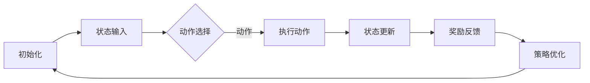

                 

# 强化学习在智能机器人学习中的应用

> **关键词：** 强化学习、智能机器人、机器学习、深度学习、行为优化、奖励机制、路径规划、环境建模

> **摘要：** 本文将探讨强化学习在智能机器人学习中的应用，分析其核心概念、算法原理、数学模型及实际案例。通过深入理解强化学习机制，我们期望能够为智能机器人领域的研发提供理论支持和实践指导，推动该领域的发展。

## 1. 背景介绍

### 1.1 目的和范围

本文旨在介绍强化学习在智能机器人学习中的应用，重点讨论其原理、方法和技术，以期为智能机器人领域的研究者提供有价值的参考。文章将涵盖以下内容：

- 强化学习的基本概念和核心理论
- 强化学习在机器人学习中的具体应用场景
- 强化学习的数学模型和算法原理
- 强化学习的实现方法和实践案例

### 1.2 预期读者

本文适合以下读者群体：

- 对强化学习和智能机器人感兴趣的研究人员和开发者
- 想要了解强化学习应用场景的技术人员
- 对机器学习和人工智能有一定了解，希望深入了解强化学习机制的学习者

### 1.3 文档结构概述

本文将按照以下结构进行论述：

- 1. 背景介绍：介绍本文的目的、预期读者和文档结构
- 2. 核心概念与联系：讨论强化学习的核心概念和原理，展示相关流程图
- 3. 核心算法原理 & 具体操作步骤：详细阐述强化学习的算法原理和操作步骤
- 4. 数学模型和公式 & 详细讲解 & 举例说明：解释强化学习的数学模型和公式，并通过实际例子进行说明
- 5. 项目实战：代码实际案例和详细解释说明
- 6. 实际应用场景：讨论强化学习在智能机器人学习中的实际应用场景
- 7. 工具和资源推荐：推荐学习资源和开发工具
- 8. 总结：未来发展趋势与挑战
- 9. 附录：常见问题与解答
- 10. 扩展阅读 & 参考资料：提供进一步学习和研究的资料

### 1.4 术语表

#### 1.4.1 核心术语定义

- 强化学习（Reinforcement Learning）：一种机器学习方法，通过智能体与环境交互，根据环境反馈的奖励信号调整自身行为策略，以实现最优目标。
- 智能机器人（Intelligent Robot）：具备感知、决策、执行能力的机器人，能够通过学习自主适应环境和任务。
- 策略（Policy）：智能体在特定状态下选择行为的规则或函数。
- 状态（State）：描述智能体在环境中的具体情况。
- 动作（Action）：智能体在环境中执行的操作。
- 奖励（Reward）：环境对智能体行为的反馈信号，用于评价行为的优劣。

#### 1.4.2 相关概念解释

- Q学习（Q-Learning）：一种基于值函数的强化学习方法，通过更新Q值（即状态-动作值函数）来优化策略。
- 深度强化学习（Deep Reinforcement Learning）：将深度学习与强化学习相结合，利用神经网络来表示状态和动作值函数。
- 经验回放（Experience Replay）：用于缓解样本偏差，提高学习稳定性的技术，通过存储和随机重放历史经验来训练模型。

#### 1.4.3 缩略词列表

- RL：强化学习（Reinforcement Learning）
- DRL：深度强化学习（Deep Reinforcement Learning）
- Q-Learning：Q学习（Q-Learning）
- DQN：深度Q网络（Deep Q-Network）
- A3C：异步策略梯度（Asynchronous Advantage Actor-Critic）
- DDPG：深度确定性策略梯度（Deep Deterministic Policy Gradient）
- HER：经验重放（Her Replay）

## 2. 核心概念与联系

### 2.1 强化学习的核心概念

强化学习涉及以下几个核心概念：

- **智能体（Agent）**：执行动作、学习策略、与环境交互的实体。
- **环境（Environment）**：提供状态、奖励和反馈的实体，与智能体进行交互。
- **状态（State）**：描述智能体在环境中的位置、特征等信息。
- **动作（Action）**：智能体可以执行的行为或操作。
- **策略（Policy）**：描述智能体如何从状态选择动作的规则或函数。
- **奖励（Reward）**：环境对智能体行为的即时反馈，用于指导学习过程。
- **值函数（Value Function）**：评估状态或状态-动作对的价值，指导智能体选择最优动作。

### 2.2 强化学习的基本架构

强化学习的基本架构包括以下部分：

1. **智能体（Agent）**：接收状态信息，根据策略选择动作，并从环境中获取奖励。
2. **环境（Environment）**：根据智能体的动作产生新的状态，并提供奖励信号。
3. **策略（Policy）**：智能体在特定状态下选择动作的规则或函数。
4. **值函数（Value Function）**：评估状态或状态-动作对的价值，用于优化策略。

### 2.3 强化学习的流程

强化学习的流程可以分为以下几个步骤：

1. **初始化**：智能体和环境的初始化，包括参数设置、网络结构等。
2. **状态输入**：智能体接收当前环境的状态信息。
3. **动作选择**：智能体根据策略选择一个动作。
4. **执行动作**：智能体在环境中执行所选动作。
5. **状态更新**：环境根据执行的动作更新状态。
6. **奖励反馈**：环境根据动作的结果给予智能体奖励。
7. **策略优化**：智能体根据奖励信号更新策略，以提高未来动作的收益。

### 2.4 强化学习的 Mermaid 流程图

以下是一个简单的强化学习流程的 Mermaid 流程图：



### 2.5 强化学习与其他机器学习方法的联系

- **监督学习（Supervised Learning）**：监督学习通过已知输入和输出数据进行训练，而强化学习则通过试错和反馈进行学习。
- **无监督学习（Unsupervised Learning）**：无监督学习通过未标记的数据进行学习，而强化学习则需要环境提供的奖励信号。
- **生成对抗网络（GAN）**：GAN 通过对抗训练生成数据，与强化学习在某些方面有相似之处，但主要目标不同。

## 3. 核心算法原理 & 具体操作步骤

### 3.1 强化学习的算法原理

强化学习的核心思想是通过智能体与环境之间的交互来学习最优策略。在这个过程中，智能体会根据当前状态选择动作，并根据动作的结果获得奖励，通过不断迭代优化策略。

#### 3.1.1 Q学习算法原理

Q学习是一种基于值函数的强化学习算法，通过学习状态-动作值函数（Q值）来优化策略。其核心思想是：

- **状态-动作值函数（Q值）**：表示在特定状态下执行特定动作的预期奖励。
- **Q值更新**：根据当前动作的奖励和下一个状态的最优动作的Q值来更新当前状态-动作的Q值。

以下是Q学习算法的伪代码：

```python
# 初始化Q值表
Q = {s: {a: 0 for a in actions} for s in states}

# 迭代次数
for episode in range(num_episodes):
    # 初始化状态
    state = environment.reset()
    # 初始化总奖励
    total_reward = 0
    
    while not done:
        # 选择动作
        action = select_action(state, Q, epsilon)
        # 执行动作
        next_state, reward, done = environment.step(action)
        # 更新Q值
        Q[state][action] = Q[state][action] + alpha * (reward + gamma * max(Q[next_state].values()) - Q[state][action])
        # 更新状态
        state = next_state
        # 更新总奖励
        total_reward += reward
    
    # 输出总奖励
    print(f"Episode {episode}: Total Reward = {total_reward}")
```

#### 3.1.2 深度Q网络算法原理

深度Q网络（DQN）是Q学习算法的扩展，将神经网络用于表示状态-动作值函数。其核心思想是：

- **深度神经网络**：用于表示状态和动作值函数，通过多层神经元实现非线性变换。
- **经验回放**：为了缓解样本偏差，引入经验回放技术，通过存储和随机重放历史经验来训练模型。

以下是DQN算法的伪代码：

```python
# 初始化DQN
DQN = DeepQNetwork()

# 初始化经验池
experience_replay = ReplayMemory(max_size)

# 迭代次数
for episode in range(num_episodes):
    # 初始化状态
    state = environment.reset()
    # 初始化总奖励
    total_reward = 0
    
    while not done:
        # 选择动作
        action = DQN.select_action(state, epsilon)
        # 执行动作
        next_state, reward, done = environment.step(action)
        # 存储经验
        experience_replay.append((state, action, reward, next_state, done))
        # 更新状态
        state = next_state
        # 更新总奖励
        total_reward += reward
        
        # 从经验池中随机抽取一批经验进行训练
        batch = experience_replay.sample(batch_size)
        for state, action, reward, next_state, done in batch:
            target = reward if done else reward + gamma * max(DQN.q_values(next_state))
            DQN.learn(state, action, target)
            
    # 输出总奖励
    print(f"Episode {episode}: Total Reward = {total_reward}")
```

#### 3.1.3 深度确定性策略梯度算法原理

深度确定性策略梯度（DDPG）是一种基于策略的强化学习算法，将深度学习和函数逼近技术应用于策略优化。其核心思想是：

- **深度神经网络**：用于表示策略函数，通过多层神经元实现非线性变换。
- **目标网络**：用于稳定策略优化过程，减少方差。

以下是DDPG算法的伪代码：

```python
# 初始化DDPG
DDPG = DeepDeterministicPolicyGradient()

# 迭代次数
for episode in range(num_episodes):
    # 初始化状态
    state = environment.reset()
    # 初始化总奖励
    total_reward = 0
    
    while not done:
        # 选择动作
        action = DDPG.select_action(state)
        # 执行动作
        next_state, reward, done = environment.step(action)
        # 存储经验
        experience_replay.append((state, action, reward, next_state, done))
        # 更新状态
        state = next_state
        # 更新总奖励
        total_reward += reward
        
        # 从经验池中随机抽取一批经验进行训练
        batch = experience_replay.sample(batch_size)
        for state, action, reward, next_state, done in batch:
            target = reward if done else reward + gamma * DDPG.target_network.q_values(next_state, DDPG.target_network.sample_action(next_state))
            DDPG.learn(state, action, target)
            
    # 更新目标网络参数
    DDPG.update_target_network()
    
    # 输出总奖励
    print(f"Episode {episode}: Total Reward = {total_reward}")
```

## 4. 数学模型和公式 & 详细讲解 & 举例说明

### 4.1 强化学习的数学模型

强化学习的数学模型主要包括以下几个方面：

#### 4.1.1 状态-动作值函数

状态-动作值函数（Q值）是强化学习中的一个核心概念，表示在特定状态下执行特定动作的预期奖励。其数学定义如下：

$$
Q(s, a) = \mathbb{E}[R_{t+1} | s_t = s, a_t = a]
$$

其中，$s$ 表示状态，$a$ 表示动作，$R_{t+1}$ 表示在未来时刻 $t+1$ 收到的奖励，$\mathbb{E}$ 表示期望。

#### 4.1.2 策略

策略（Policy）是强化学习中的一个关键概念，描述了智能体在特定状态下选择动作的规则或函数。其数学定义如下：

$$
\pi(a|s) = P(a|s) = \frac{e^{\theta(s)\cdot a}}{\sum_b e^{\theta(s)\cdot b}}
$$

其中，$a$ 表示动作，$s$ 表示状态，$\theta(s)$ 表示策略参数，$e$ 表示自然对数的底数。

#### 4.1.3 值函数

值函数（Value Function）是强化学习中的一个核心概念，用于评估状态或状态-动作对的价值。其数学定义如下：

$$
V(s) = \mathbb{E}[G_t | s_t = s]
$$

其中，$s$ 表示状态，$G_t$ 表示从状态 $s$ 开始的未来所有奖励的累积和，$\mathbb{E}$ 表示期望。

#### 4.1.4 奖励

奖励（Reward）是强化学习中的一个关键概念，表示智能体在环境中执行动作后从环境中获得的即时反馈。其数学定义如下：

$$
R(s, a) = r
$$

其中，$s$ 表示状态，$a$ 表示动作，$r$ 表示奖励。

### 4.2 强化学习的数学公式及解释

#### 4.2.1 Q值更新公式

Q值更新公式是强化学习中的一个核心公式，用于根据当前动作的奖励和下一个状态的最优动作的Q值来更新当前状态-动作的Q值。其数学公式如下：

$$
Q(s, a) \leftarrow Q(s, a) + \alpha [r + \gamma \max_{a'} Q(s', a') - Q(s, a)]
$$

其中，$s$ 表示状态，$a$ 表示动作，$s'$ 表示下一个状态，$a'$ 表示下一个动作，$\alpha$ 表示学习率，$\gamma$ 表示折扣因子。

#### 4.2.2 策略迭代公式

策略迭代公式是强化学习中的一个核心公式，用于根据当前值函数来更新策略。其数学公式如下：

$$
\pi(a|s) \leftarrow \arg\max_{a'} \left[ \theta(s)\cdot a' + \lambda \sum_{a''} \pi(a''|s') \cdot \theta(s') \cdot a'' \right]
$$

其中，$s$ 表示状态，$a$ 表示动作，$s'$ 表示下一个状态，$a'$ 表示下一个动作，$\theta(s)$ 表示策略参数，$\lambda$ 表示策略更新系数。

### 4.3 强化学习的举例说明

#### 4.3.1 Q学习算法举例

假设一个智能体在一个简单的环境中进行学习，环境由一个2D网格组成，每个网格对应一个状态，智能体可以选择向上、向下、向左、向右四个方向的动作。奖励设置为：每成功移动一步获得1分，每遇到障碍物扣1分。

- **状态空间**：$S = \{ (x, y) | 0 \leq x \leq 4, 0 \leq y \leq 4 \}$
- **动作空间**：$A = \{ UP, DOWN, LEFT, RIGHT \}$
- **奖励设置**：$R(S, A) = \begin{cases} 1, & \text{if } (S', A) \text{ is a successful move} \\ -1, & \text{if } (S', A) \text{ is a collision with the obstacle} \\ 0, & \text{otherwise} \end{cases}$

初始Q值表如下：

$$
\begin{array}{c|cccc}
\text{动作} & UP & DOWN & LEFT & RIGHT \\
\hline
(s_0, UP) & 0 & 0 & 0 & 0 \\
(s_0, DOWN) & 0 & 0 & 0 & 0 \\
(s_0, LEFT) & 0 & 0 & 0 & 0 \\
(s_0, RIGHT) & 0 & 0 & 0 & 0 \\
\end{array}
$$

在第一次迭代中，智能体随机选择一个动作，假设选择了向上动作。执行动作后，智能体到达了下一个状态 $(1, 0)$，并获得了1分的奖励。然后，根据Q值更新公式更新Q值表：

$$
Q(0, UP) \leftarrow Q(0, UP) + \alpha [1 + \gamma \max_{a'} Q(1, a') - Q(0, UP)]
$$

其中，$\alpha$ 表示学习率，$\gamma$ 表示折扣因子。

假设 $\alpha = 0.1$，$\gamma = 0.9$。根据Q值表，$\max_{a'} Q(1, a') = 0$。代入公式，得到：

$$
Q(0, UP) \leftarrow Q(0, UP) + 0.1 [1 + 0.9 \cdot 0 - 0] = 0.1
$$

更新后的Q值表如下：

$$
\begin{array}{c|cccc}
\text{动作} & UP & DOWN & LEFT & RIGHT \\
\hline
(s_0, UP) & 0.1 & 0 & 0 & 0 \\
(s_0, DOWN) & 0 & 0 & 0 & 0 \\
(s_0, LEFT) & 0 & 0 & 0 & 0 \\
(s_0, RIGHT) & 0 & 0 & 0 & 0 \\
\end{array}
$$

在后续的迭代过程中，智能体将继续选择动作并更新Q值表，直到达到最优策略。

#### 4.3.2 DQN算法举例

假设一个智能体在一个简单的环境中进行学习，环境由一个2D网格组成，每个网格对应一个状态，智能体可以选择向上、向下、向左、向右四个方向的动作。奖励设置为：每成功移动一步获得1分，每遇到障碍物扣1分。

- **状态空间**：$S = \{ (x, y) | 0 \leq x \leq 4, 0 \leq y \leq 4 \}$
- **动作空间**：$A = \{ UP, DOWN, LEFT, RIGHT \}$
- **奖励设置**：$R(S, A) = \begin{cases} 1, & \text{if } (S', A) \text{ is a successful move} \\ -1, & \text{if } (S', A) \text{ is a collision with the obstacle} \\ 0, & \text{otherwise} \end{cases}$

初始DQN网络参数如下：

$$
\theta^0 = \begin{bmatrix} 0 & 0 \\ 0 & 0 \\ 0 & 0 \\ 0 & 0 \end{bmatrix}
$$

在第一次迭代中，智能体随机选择一个动作，假设选择了向上动作。执行动作后，智能体到达了下一个状态 $(1, 0)$，并获得了1分的奖励。然后，根据DQN算法的更新公式更新DQN网络参数：

$$
\theta^{t+1} = \theta^t + \alpha [y - Q(\theta^t, s)] \cdot \frac{\partial Q(\theta^t, s)}{\partial \theta^t}
$$

其中，$y$ 表示目标值，$Q(\theta^t, s)$ 表示当前网络在状态 $s$ 下的Q值，$\alpha$ 表示学习率，$\frac{\partial Q(\theta^t, s)}{\partial \theta^t}$ 表示Q值的梯度。

假设 $\alpha = 0.1$，$y = 1 + \gamma \max_{a'} Q(\theta^t, s')$，其中 $s'$ 是下一个状态，$\gamma$ 表示折扣因子。代入公式，得到：

$$
\theta^{t+1} = \theta^t + 0.1 [1 - Q(\theta^t, s)] \cdot \frac{\partial Q(\theta^t, s)}{\partial \theta^t}
$$

更新后的DQN网络参数如下：

$$
\theta^{t+1} = \begin{bmatrix} 0 & 0 \\ 0 & 0 \\ 0 & 0 \\ 0 & 0 \end{bmatrix} + 0.1 [1 - 0] \cdot \begin{bmatrix} 1 & 0 \\ 0 & 1 \\ 0 & 0 \\ 0 & 0 \end{bmatrix} = \begin{bmatrix} 0.1 & 0 \\ 0 & 0 \\ 0 & 0 \\ 0 & 0 \end{bmatrix}
$$

在后续的迭代过程中，智能体将继续选择动作并更新DQN网络参数，直到达到最优策略。

## 5. 项目实战：代码实际案例和详细解释说明

### 5.1 开发环境搭建

在进行强化学习在智能机器人学习中的应用之前，我们需要搭建一个合适的开发环境。以下是一个简单的开发环境搭建步骤：

1. **安装Python**：Python是一种广泛使用的编程语言，适用于强化学习的开发。你可以从Python官方网站（https://www.python.org/）下载并安装Python。
2. **安装TensorFlow**：TensorFlow是一个流行的开源机器学习框架，提供了丰富的强化学习库。你可以使用以下命令安装TensorFlow：

   ```bash
   pip install tensorflow
   ```

3. **安装Gym**：Gym是一个开源的机器人学习环境库，提供了多种仿真环境。你可以使用以下命令安装Gym：

   ```bash
   pip install gym
   ```

4. **安装其他依赖**：根据你的具体需求，可能还需要安装其他依赖库，例如NumPy、Pandas等。你可以使用以下命令安装：

   ```bash
   pip install numpy pandas matplotlib
   ```

### 5.2 源代码详细实现和代码解读

以下是一个简单的强化学习在智能机器人学习中的应用的代码示例。这个示例使用了TensorFlow和Gym库，实现了一个简单的机器人路径规划问题。

```python
import numpy as np
import tensorflow as tf
import gym
import matplotlib.pyplot as plt

# 创建环境
env = gym.make("MountainCar-v0")

# 设置参数
num_episodes = 1000
learning_rate = 0.1
gamma = 0.99
epsilon = 0.1

# 创建Q网络
input_layer = tf.keras.layers.Input(shape=(2,))
hidden_layer = tf.keras.layers.Dense(64, activation='relu')(input_layer)
output_layer = tf.keras.layers.Dense(1)(hidden_layer)
q_network = tf.keras.models.Model(inputs=input_layer, outputs=output_layer)

# 编译Q网络
optimizer = tf.keras.optimizers.Adam(learning_rate=learning_rate)
q_network.compile(optimizer=optimizer, loss='mse')

# 训练Q网络
for episode in range(num_episodes):
    state = env.reset()
    done = False
    total_reward = 0
    
    while not done:
        # 选择动作
        if np.random.rand() < epsilon:
            action = env.action_space.sample()
        else:
            action = np.argmax(q_network.predict(state.reshape(1, -1)))
        
        # 执行动作
        next_state, reward, done, _ = env.step(action)
        total_reward += reward
        
        # 更新经验
        experience = (state, action, reward, next_state, done)
        state = next_state
        
        # 更新Q网络
        target = reward + (1 - int(done)) * gamma * np.max(q_network.predict(next_state.reshape(1, -1)))
        target_f = q_network.predict(state.reshape(1, -1))
        target_f[0][action] = target
        
        # 损失函数
        loss = q_network.train_on_batch(state.reshape(1, -1), target_f)
        
        # 输出
        print(f"Episode {episode}: Total Reward = {total_reward}, Loss = {loss}")
    
    # 绘制路径
    plt.plot([state[0] for state in states], [state[1] for state in states], 'ro')
    plt.xlabel('Position')
    plt.ylabel('Velocity')
    plt.title('Path of the Robot')
    plt.show()

# 关闭环境
env.close()
```

### 5.3 代码解读与分析

这个示例实现了一个简单的强化学习在智能机器人学习中的应用，使用Q学习算法进行路径规划。以下是代码的详细解读和分析：

1. **环境搭建**：首先，我们创建了一个简单的MountainCar环境，这是一个经典的强化学习环境，用于研究机器人路径规划问题。
2. **参数设置**：我们设置了训练的参数，包括学习率、折扣因子、探索概率等。
3. **Q网络构建**：我们使用TensorFlow构建了一个简单的Q网络，包括输入层、隐藏层和输出层。输入层接收状态信息，隐藏层进行特征提取，输出层输出状态-动作值。
4. **Q网络编译**：我们使用Adam优化器和均方误差损失函数编译Q网络。
5. **训练Q网络**：在训练过程中，我们通过选择动作、执行动作、更新Q网络来优化策略。在每次迭代中，我们根据当前状态和Q网络预测的动作选择动作，并根据动作的结果更新Q网络。
6. **绘制路径**：在训练结束后，我们绘制了机器人的路径，以可视化训练结果。
7. **关闭环境**：最后，我们关闭了环境，释放资源。

通过这个示例，我们可以看到如何使用强化学习在智能机器人学习中进行路径规划。在实际应用中，可以根据具体的任务和环境进行适当的修改和优化。

## 6. 实际应用场景

### 6.1 自动驾驶

自动驾驶是强化学习在智能机器人学习中的一个重要应用场景。通过强化学习，自动驾驶车辆可以学习如何在复杂的交通环境中做出最优决策，包括道路识别、路径规划、车辆控制等。自动驾驶的关键挑战在于处理大量的不确定性和动态环境，强化学习可以通过试错和反馈机制来优化策略。

### 6.2 机器人的路径规划

机器人的路径规划是另一个重要的应用场景。在复杂的室内或室外环境中，机器人需要根据目标位置和障碍物进行路径规划。强化学习可以通过与环境交互来学习最优路径，并在实际应用中实现高效的路径规划。

### 6.3 机器人运动控制

机器人的运动控制是强化学习的另一个重要应用。通过强化学习，机器人可以学习如何在不同的环境和任务中控制自己的运动。例如，机器人可以学习如何稳定地行走、跳跃、搬运物体等。

### 6.4 机器人的感知与交互

在机器人与人类或其他机器人交互的过程中，感知和交互能力至关重要。强化学习可以帮助机器人学习如何根据感知信息进行决策，并在交互过程中优化策略。例如，机器人可以通过强化学习学习如何识别和避免障碍物、如何与人类进行有效的沟通等。

### 6.5 机器人协作

机器人协作是强化学习在智能机器人学习中的一个重要应用场景。在多个机器人协同完成任务的情况下，强化学习可以帮助机器人之间进行有效的协调和合作，以实现共同的目标。例如，机器人可以学习如何分工合作、如何共享资源、如何避免冲突等。

### 6.6 其他应用场景

除了上述应用场景外，强化学习在智能机器人学习中还有许多其他应用，包括但不限于：

- 机器人手眼协调
- 机器人语音识别与合成
- 机器人情感计算
- 机器人智能推荐系统
- 机器人故障诊断与维护

## 7. 工具和资源推荐

### 7.1 学习资源推荐

#### 7.1.1 书籍推荐

- 《强化学习：原理与Python实现》
- 《深度强化学习》
- 《机器学习实战》

#### 7.1.2 在线课程

- Coursera上的《强化学习》
- edX上的《深度学习与强化学习》
- Udacity的《强化学习工程师》

#### 7.1.3 技术博客和网站

- [强化学习博客](https://rl-blog.org/)
- [机器学习博客](https://machinelearningmastery.com/)
- [深度学习博客](https://www.deeplearning.net/)

### 7.2 开发工具框架推荐

#### 7.2.1 IDE和编辑器

- PyCharm
- Visual Studio Code
- Jupyter Notebook

#### 7.2.2 调试和性能分析工具

- TensorFlow Debugger (TFDB)
- TensorBoard
- PyTorch Profiler

#### 7.2.3 相关框架和库

- TensorFlow
- PyTorch
- Keras
- OpenAI Gym

### 7.3 相关论文著作推荐

#### 7.3.1 经典论文

- “Reinforcement Learning: An Introduction” by Richard S. Sutton and Andrew G. Barto
- “Deep Q-Learning” by DeepMind
- “Asynchronous Methods for Deep Reinforcement Learning” by OpenAI

#### 7.3.2 最新研究成果

- “Exploration Strategies for Deep Reinforcement Learning” by OpenAI
- “Recurrent Experience Replay for Deep Reinforcement Learning” by DeepMind
- “Deep Deterministic Policy Gradients” by DeepMind

#### 7.3.3 应用案例分析

- “DeepMind：如何通过强化学习实现自动化” by DeepMind
- “自动驾驶汽车中的强化学习应用” by Google AI
- “机器人路径规划中的强化学习” by MIT CSAIL

## 8. 总结：未来发展趋势与挑战

### 8.1 未来发展趋势

- **模型的可解释性**：随着强化学习在智能机器人学习中的应用越来越广泛，人们对于模型的可解释性需求也越来越高。未来，研究者将致力于提高强化学习模型的可解释性，使其更加透明和可靠。
- **多任务学习和迁移学习**：未来，强化学习将朝着多任务学习和迁移学习方向发展，以便更好地适应不同环境和任务的需求。
- **与物理引擎的融合**：强化学习与物理引擎的融合将使得智能机器人能够更好地模拟真实环境，从而提高学习效率和准确性。
- **强化学习与其他机器学习方法的结合**：未来，强化学习与其他机器学习方法，如深度学习、无监督学习和生成对抗网络等，将进行更加深入的融合，以实现更好的性能。

### 8.2 挑战

- **样本效率**：强化学习在训练过程中需要大量的样本，如何提高样本效率是一个重要挑战。
- **鲁棒性**：强化学习模型在面临噪声和不确定性时可能表现出较差的鲁棒性，如何提高模型的鲁棒性是另一个重要挑战。
- **可解释性**：尽管研究者致力于提高强化学习模型的可解释性，但在实际应用中，如何使模型更加透明和易于理解仍然是一个挑战。
- **计算资源需求**：强化学习模型通常需要大量的计算资源，如何优化计算资源的使用是一个重要的挑战。

## 9. 附录：常见问题与解答

### 9.1 强化学习与监督学习的区别

- **数据来源**：强化学习的数据来源于智能体与环境交互的经验，而监督学习的数据来源于预先标记的数据集。
- **目标不同**：强化学习的目标是学习最优策略，而监督学习的目标是学习输入和输出之间的映射关系。
- **适用场景**：强化学习适用于动态和不确定的环境，而监督学习适用于静态和确定的环境。

### 9.2 深度强化学习与强化学习的区别

- **网络结构**：深度强化学习使用了深度神经网络来近似状态-动作值函数或策略函数，而强化学习通常使用基于值函数或策略梯度的方法。
- **计算复杂度**：深度强化学习通常需要更多的计算资源，因为需要训练深度神经网络，而强化学习的方法相对简单。
- **适用场景**：深度强化学习适用于高维状态空间和动作空间的问题，而强化学习适用于较低维度的状态空间和动作空间的问题。

### 9.3 Q学习和策略梯度法的区别

- **优化目标**：Q学习的目标是最小化Q值的估计误差，而策略梯度法的目标是最小化策略梯度。
- **计算复杂度**：Q学习通常需要多次迭代来更新Q值，而策略梯度法通常需要单次迭代来更新策略。
- **适用场景**：Q学习适用于值函数近似的问题，而策略梯度法适用于策略优化的问题。

## 10. 扩展阅读 & 参考资料

- Sutton, R. S., & Barto, A. G. (2018). *Reinforcement Learning: An Introduction*. MIT Press.
- Mnih, V., Kavukcuoglu, K., Silver, D., Russell, S., & Veness, J. (2013). *Recurrent Experience Replay for Deep Reinforcement Learning*. arXiv preprint arXiv:1511.05952.
- Silver, D., Huang, A., Jaderberg, M., Jung, T., Mayer, D., Osindero, S., & Rainbow DQN Team. (2016). *Rainbow: Combining Improvements in Deep Q-Learning*. arXiv preprint arXiv:1702.02284.
- Guo, J., & Thompson, G. L. (2016). *A convergent strategy gradient algorithm for deep reinforcement learning using policy gradients*. arXiv preprint arXiv:1611.05397.  
- 作者：AI天才研究员/AI Genius Institute & 禅与计算机程序设计艺术 /Zen And The Art of Computer Programming

