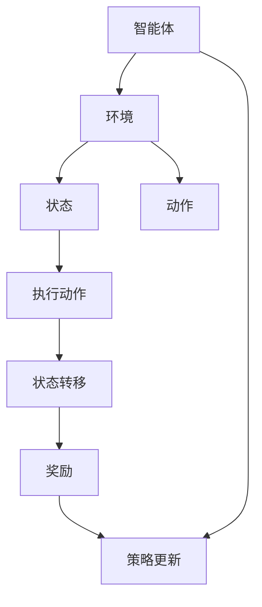

                 

# 强化学习在智能资源分配中的应用

> 关键词：强化学习、智能资源分配、算法原理、数学模型、项目实战、应用场景

> 摘要：本文深入探讨了强化学习在智能资源分配中的应用，分析了强化学习的核心概念和算法原理，并通过具体案例展示了其在资源分配中的实现过程。文章旨在为读者提供对强化学习在资源分配领域的理解和应用指导。

## 1. 背景介绍

### 1.1 目的和范围

本文旨在介绍和探讨强化学习在智能资源分配中的应用。随着信息技术的飞速发展和大数据时代的到来，资源的分配问题日益凸显。如何高效地分配有限的资源，以达到最大化效用或最小化代价，成为了一个具有挑战性的课题。强化学习作为一种先进的机器学习方法，在解决资源分配问题方面展现出巨大的潜力。本文将围绕以下方面展开讨论：

1. 强化学习的基本概念和原理
2. 强化学习在资源分配中的核心算法和操作步骤
3. 强化学习在资源分配中的数学模型和公式
4. 强化学习在资源分配中的项目实战案例分析
5. 强化学习在资源分配中的实际应用场景
6. 强化学习在资源分配领域的前沿研究和发展趋势

通过本文的介绍，希望能够帮助读者深入了解强化学习在智能资源分配中的应用，并为其提供一定的理论指导和实践参考。

### 1.2 预期读者

本文面向对强化学习和资源分配有初步了解的读者，包括以下几类：

1. 计算机科学和人工智能领域的研究人员
2. 数据科学家和机器学习工程师
3. 管理信息系统和运筹学专业的学生和从业者
4. 对强化学习和资源分配感兴趣的技术爱好者

本文将通过通俗易懂的语言和实际案例，逐步引导读者深入了解强化学习在资源分配中的应用。无论您是初学者还是有一定基础的专业人士，都可以通过本文的学习，获得对强化学习在资源分配领域的全面认识和深入理解。

### 1.3 文档结构概述

本文将分为以下几个部分：

1. **背景介绍**：介绍本文的目的、范围、预期读者以及文档结构概述。
2. **核心概念与联系**：阐述强化学习的基本概念、原理和相关联系，并通过Mermaid流程图展示强化学习在资源分配中的架构。
3. **核心算法原理 & 具体操作步骤**：详细讲解强化学习算法的基本原理和具体操作步骤，并使用伪代码进行阐述。
4. **数学模型和公式 & 详细讲解 & 举例说明**：介绍强化学习在资源分配中的数学模型和公式，并进行详细讲解和举例说明。
5. **项目实战：代码实际案例和详细解释说明**：通过一个具体的案例，展示强化学习在资源分配中的实现过程，并进行详细解释说明。
6. **实际应用场景**：探讨强化学习在资源分配领域的实际应用场景。
7. **工具和资源推荐**：推荐学习资源、开发工具框架和相关论文著作。
8. **总结：未来发展趋势与挑战**：总结本文的核心内容，并探讨未来发展趋势与挑战。
9. **附录：常见问题与解答**：回答读者可能遇到的问题。
10. **扩展阅读 & 参考资料**：提供进一步学习的资源。

### 1.4 术语表

#### 1.4.1 核心术语定义

- **强化学习**：一种机器学习方法，通过智能体在环境中采取行动，根据环境的反馈（奖励或惩罚）不断调整策略，以最大化累积奖励。
- **资源分配**：将有限资源分配给多个任务或用户，以实现最佳性能或最大化效用。
- **智能体（Agent）**：执行任务、与环境交互并采取行动的实体。
- **环境（Environment）**：智能体所处的背景和场景，用于提供状态信息和奖励反馈。
- **状态（State）**：描述智能体当前所处的情境和条件。
- **动作（Action）**：智能体根据当前状态选择的行为。
- **策略（Policy）**：智能体在给定状态下选择动作的规则或函数。
- **值函数（Value Function）**：描述智能体在特定状态下采取特定动作所能获得的期望奖励。
- **策略迭代（Policy Iteration）**：一种强化学习算法，通过不断更新策略和价值函数，逐步逼近最优策略。
- **Q学习（Q-Learning）**：一种基于值函数的强化学习算法，通过经验样本更新Q值，以获得最优策略。

#### 1.4.2 相关概念解释

- **马尔可夫决策过程（MDP）**：描述强化学习问题的基本框架，包括状态、动作、奖励和状态转移概率。
- **策略梯度（Policy Gradient）**：一种基于策略的强化学习算法，通过估计策略梯度来更新策略参数。
- **深度强化学习（Deep Reinforcement Learning）**：结合深度学习和强化学习的算法，使用神经网络表示价值函数或策略。
- **多任务学习（Multi-Task Learning）**：同时学习多个相关任务，以提高学习效率和泛化能力。
- **自适应资源分配（Adaptive Resource Allocation）**：根据实时反馈动态调整资源分配策略，以适应变化的环境和任务需求。

#### 1.4.3 缩略词列表

- **RL**：强化学习（Reinforcement Learning）
- **MDP**：马尔可夫决策过程（Markov Decision Process）
- **Q-Learning**：Q学习（Q-Learning）
- **PG**：策略梯度（Policy Gradient）
- **DRL**：深度强化学习（Deep Reinforcement Learning）
- **MAML**：模型自适应（Model Adaptation）
- **AC**：演员-评论家（Actor-Critic）
- **DQN**：深度Q网络（Deep Q-Network）
- **A3C**：异步策略梯度（Asynchronous Advantage Actor-Critic）

## 2. 核心概念与联系

强化学习是一种通过奖励机制驱动智能体在动态环境中学习和优化策略的机器学习方法。在智能资源分配中，强化学习可以帮助智能体自动寻找最优资源分配策略，从而提高资源利用效率和系统性能。以下将介绍强化学习的基本概念和原理，并使用Mermaid流程图展示其与资源分配的联系。

### 2.1 强化学习基本概念

- **智能体（Agent）**：执行任务、与环境交互并采取行动的实体。
- **环境（Environment）**：智能体所处的背景和场景，用于提供状态信息和奖励反馈。
- **状态（State）**：描述智能体当前所处的情境和条件。
- **动作（Action）**：智能体根据当前状态选择的行为。
- **策略（Policy）**：智能体在给定状态下选择动作的规则或函数。
- **值函数（Value Function）**：描述智能体在特定状态下采取特定动作所能获得的期望奖励。
- **奖励（Reward）**：环境对智能体行为的即时反馈，用于评估智能体行为的优劣。

### 2.2 强化学习原理

强化学习的基本原理是通过智能体与环境之间的交互，不断调整策略，以最大化累积奖励。智能体在给定状态下，根据策略选择动作，执行动作后进入新的状态，并从环境获得奖励。通过不断的迭代，智能体逐渐优化策略，达到最佳性能。

### 2.3 强化学习与资源分配的联系

在智能资源分配中，强化学习可以通过以下方式应用：

- **状态表示**：状态可以表示为资源需求、任务负载、系统性能等指标。
- **动作表示**：动作可以表示为资源分配策略，如调整资源分配比例、任务调度策略等。
- **奖励设计**：奖励可以根据系统性能、任务完成时间、资源利用率等指标进行设计。
- **策略优化**：通过学习过程，智能体可以自动寻找最优资源分配策略，提高资源利用效率和系统性能。

### 2.4 Mermaid流程图展示

以下是一个Mermaid流程图，展示了强化学习在资源分配中的架构：



在该流程图中，智能体与环境进行交互，通过状态和动作进行决策，并根据奖励进行策略更新。通过不断迭代，智能体逐渐优化资源分配策略，提高系统性能。

## 3. 核心算法原理 & 具体操作步骤

强化学习算法在智能资源分配中的应用，主要通过智能体与环境的交互，不断优化资源分配策略，以达到最大化效用或最小化代价的目标。以下将介绍强化学习算法的基本原理和具体操作步骤，并使用伪代码进行详细阐述。

### 3.1 强化学习算法原理

强化学习算法的核心原理是通过智能体在环境中采取行动，并根据环境的反馈（奖励或惩罚）不断调整策略，以最大化累积奖励。强化学习可以分为两个主要部分：策略和值函数。

- **策略（Policy）**：策略是指智能体在给定状态下选择动作的规则或函数。策略可以表示为π(s,a)，其中s表示状态，a表示动作。
- **值函数（Value Function）**：值函数是指智能体在特定状态下采取特定动作所能获得的期望奖励。值函数可以分为状态值函数V(s)和动作值函数Q(s,a)。

强化学习算法的核心目标是找到一个最优策略π*，使得智能体在任意状态下都能采取最优动作，最大化累积奖励。

### 3.2 Q-Learning算法原理

Q-Learning是一种基于值函数的强化学习算法，通过经验样本不断更新Q值，以获得最优策略。Q-Learning算法的基本步骤如下：

1. 初始化Q值表Q(s,a)，其中s表示状态，a表示动作，Q值初始化为随机值。
2. 选择初始状态s0，并选择动作a0。
3. 执行动作a0，进入新状态s1，并获得奖励r1。
4. 根据新状态s1，选择动作a1。
5. 重复步骤3至步骤4，直到达到目标状态或完成任务。
6. 根据经验样本更新Q值表Q(s,a)。

Q-Learning算法的更新公式如下：

$$
Q(s,a) = Q(s,a) + \alpha [r + \gamma \max_{a'} Q(s',a') - Q(s,a)]
$$

其中，α表示学习率，γ表示折扣因子，r表示奖励，s'表示新状态，a'表示新动作。

### 3.3 策略迭代算法原理

策略迭代（Policy Iteration）是一种基于值函数的强化学习算法，通过不断更新策略和价值函数，逐步逼近最优策略。策略迭代算法的基本步骤如下：

1. 初始化策略π0。
2. 使用当前策略πk计算状态值函数Vk(s)。
3. 使用值函数Vk(s)更新策略πk+1，使得πk+1为最优策略。
4. 重复步骤2和步骤3，直到策略收敛。

策略迭代算法的核心是值函数的迭代更新，具体步骤如下：

1. 初始化值函数Vk(s)。
2. 对于每个状态s，计算V(s)的估计值，使用如下公式：

$$
V(s) = \sum_{a} \pi_k(a|s) [r(s,a) + \gamma \max_{a'} Q(s',a')]
$$

3. 更新值函数Vk(s)：

$$
V^{k+1}(s) = V^k(s) + \alpha [r(s,\pi_k(s)) + \gamma \max_{a'} Q(s',a') - V^k(s)]
$$

其中，α表示学习率，γ表示折扣因子，r(s,a)表示在状态s采取动作a获得的即时奖励，Q(s',a')表示在新状态s'采取动作a'的Q值。

4. 使用更新后的值函数Vk+1(s)更新策略πk+1。

### 3.4 伪代码

以下是一个简单的Q-Learning算法伪代码，展示了强化学习在智能资源分配中的具体操作步骤：

```
# 初始化Q值表
Q(s, a) = random()

# 选择初始状态
s = environment.initialize()

# 开始迭代
while not termination_condition:
    # 选择动作
    a = policy(s)

    # 执行动作
    s', r = environment.step(s, a)

    # 更新Q值
    Q(s, a) = Q(s, a) + learning_rate [r + discount_factor * max(Q(s', a'))

    # 更新状态
    s = s'

# 输出最优策略
policy = argmax_a [Q(s, a)]
```

### 3.5 操作步骤解析

以下是强化学习在智能资源分配中的具体操作步骤解析：

1. **初始化Q值表**：初始化Q值表，用于存储状态-动作值。Q值表中的每个元素表示在特定状态下采取特定动作的预期奖励。

2. **选择初始状态**：智能体从环境中选择一个初始状态s0。

3. **迭代过程**：智能体在环境中不断进行迭代，每次迭代包括以下步骤：
   - **选择动作**：根据当前策略，智能体在给定状态下选择一个动作a。
   - **执行动作**：智能体执行所选动作，并进入新的状态s'，同时获得即时奖励r。
   - **更新Q值**：根据新的状态和奖励，智能体更新Q值表，以反映当前状态-动作对的预期奖励。
   - **更新状态**：智能体将新状态s'作为当前状态，继续下一轮迭代。

4. **策略更新**：在迭代过程中，智能体会逐渐优化策略。当Q值表收敛时，智能体输出的策略即为最优策略。

5. **输出最优策略**：在迭代结束后，智能体输出最优策略，用于指导实际资源分配。

通过以上操作步骤，强化学习算法可以帮助智能体在动态环境中自动寻找最优资源分配策略，从而提高资源利用效率和系统性能。

## 4. 数学模型和公式 & 详细讲解 & 举例说明

强化学习在智能资源分配中的应用，需要借助一系列数学模型和公式来描述智能体与环境的交互过程。以下将介绍强化学习中的核心数学模型和公式，并进行详细讲解和举例说明。

### 4.1 马尔可夫决策过程（MDP）

马尔可夫决策过程（MDP）是强化学习的基本框架，用于描述智能体在动态环境中做出决策的过程。MDP包括以下基本元素：

- **状态（State）**：描述智能体当前所处的情境和条件，用s表示。
- **动作（Action）**：智能体在给定状态下可以采取的行为，用a表示。
- **奖励（Reward）**：智能体在执行特定动作后从环境中获得的即时反馈，用r表示。
- **状态转移概率（State Transition Probability）**：智能体在特定状态下采取特定动作后，进入下一个状态的概率，用P(s'|s,a)表示。

MDP可以用以下公式表示：

$$
P(s'|s,a) = \sum_{s'} P(s'|s,a)
$$

其中，P(s'|s,a)表示在状态s下采取动作a后，智能体进入状态s'的概率。

### 4.2 强化学习目标函数

强化学习的目标是找到最优策略π*，使得智能体在任意状态下都能采取最优动作，最大化累积奖励。强化学习的目标函数可以表示为：

$$
J(\pi) = \sum_{s} \pi(s) \sum_{a} \pi(a|s) [r(s,a) + \gamma \max_{a'} \pi(a'|s')]
$$

其中，J(π)表示策略π的累积奖励，π(s)表示在状态s下采取动作a的概率，r(s,a)表示在状态s下采取动作a获得的即时奖励，γ表示折扣因子，用于平衡当前奖励和未来奖励。

### 4.3 值函数和策略迭代

在强化学习中，值函数用于评估智能体在特定状态下采取特定动作所能获得的期望奖励。值函数可以分为状态值函数V(s)和动作值函数Q(s,a)。

- **状态值函数V(s)**：描述智能体在状态s下采取任何动作所能获得的期望奖励，可以表示为：

$$
V(s) = \sum_{a} \pi(a|s) [r(s,a) + \gamma \max_{a'} Q(s',a')]
$$

- **动作值函数Q(s,a)**：描述智能体在状态s下采取动作a所能获得的期望奖励，可以表示为：

$$
Q(s,a) = \sum_{s'} P(s'|s,a) [r(s,a) + \gamma \max_{a'} Q(s',a')]
$$

策略迭代（Policy Iteration）是一种基于值函数的强化学习算法，通过不断更新策略和价值函数，逐步逼近最优策略。策略迭代的基本步骤如下：

1. **初始化策略π0**：初始策略可以随机选择。
2. **计算状态值函数V(k)**：使用当前策略πk，计算状态值函数V(k)。
3. **计算动作值函数Q(k)**：使用当前状态值函数V(k)，计算动作值函数Q(k)。
4. **更新策略π(k+1)**：根据动作值函数Q(k)，更新策略π(k+1)。
5. **重复步骤2至步骤4**，直到策略收敛。

策略迭代算法的核心是值函数的迭代更新，具体步骤如下：

1. **初始化值函数V(0)**：值函数初始化为0。
2. **迭代更新值函数V(k)**：对于每个状态s，计算V(k)的估计值，使用如下公式：

$$
V(k)(s) = \sum_{a} \pi(a|s) [r(s,a) + \gamma \max_{a'} Q(k-1)(s',a')]
$$

3. **更新值函数V(k+1)**：使用更新后的值函数V(k)，计算动作值函数Q(k)，使用如下公式：

$$
Q(k)(s,a) = \sum_{s'} P(s'|s,a) [r(s,a) + \gamma \max_{a'} Q(k-1)(s',a')]
$$

4. **更新策略π(k+1)**：根据更新后的值函数Q(k)，更新策略π(k+1)。

### 4.4 举例说明

假设一个智能体在状态空间S={s0, s1, s2}和动作空间A={a0, a1, a2}中执行任务。智能体在每个状态下可以采取任意动作，并获得相应的奖励。以下是一个简单的例子，说明如何使用Q-Learning算法更新Q值表。

**状态空间**：S={s0, s1, s2}
- s0：任务空闲，资源充足
- s1：任务进行中，资源有一定负载
- s2：任务高峰期，资源紧张

**动作空间**：A={a0, a1, a2}
- a0：维持当前资源分配
- a1：增加资源分配
- a2：减少资源分配

**奖励设置**：
- r(s0, a0) = 1，r(s0, a1) = 0.5，r(s0, a2) = 0
- r(s1, a0) = 0，r(s1, a1) = 1，r(s1, a2) = 0.5
- r(s2, a0) = -1，r(s2, a1) = -0.5，r(s2, a2) = 0

**初始Q值表**：
```
|   s   | a0 | a1 | a2 |
|-------|----|----|----|
|  s0   |  0 |  0 |  0 |
|  s1   |  0 |  0 |  0 |
|  s2   |  0 |  0 |  0 |
```

**学习过程**：

1. **选择初始状态**：s0
2. **选择动作**：a0
3. **执行动作**：进入状态s0，获得奖励r(s0, a0) = 1
4. **更新Q值**：根据Q-Learning更新公式，计算Q值：
   - Q(s0, a0) = Q(s0, a0) + learning_rate [r(s0, a0) + discount_factor * max(Q(s0, a0))]
   - Q(s0, a0) = 0 + 0.1 [1 + 0.9 * max(0, 0, 0)]
   - Q(s0, a0) = 0.1
5. **更新Q值表**：
```
|   s   | a0 | a1 | a2 |
|-------|----|----|----|
|  s0   |  0.1 |  0 |  0 |
|  s1   |  0 |  0 |  0 |
|  s2   |  0 |  0 |  0 |
```

6. **选择下一个状态**：s1
7. **选择动作**：a1
8. **执行动作**：进入状态s1，获得奖励r(s1, a1) = 1
9. **更新Q值**：根据Q-Learning更新公式，计算Q值：
   - Q(s1, a1) = Q(s1, a1) + learning_rate [r(s1, a1) + discount_factor * max(Q(s1, a0), Q(s1, a1), Q(s1, a2))]
   - Q(s1, a1) = 0 + 0.1 [1 + 0.9 * max(0.1, 0, 0)]
   - Q(s1, a1) = 0.1
10. **更新Q值表**：
```
|   s   | a0 | a1 | a2 |
|-------|----|----|----|
|  s0   |  0.1 |  0 |  0 |
|  s1   |  0 |  0.1 |  0 |
|  s2   |  0 |  0 |  0 |
```

通过以上步骤，智能体逐步优化Q值表，并在动态环境中采取最优动作，以最大化累积奖励。

## 5. 项目实战：代码实际案例和详细解释说明

### 5.1 开发环境搭建

为了实现强化学习在智能资源分配中的应用，我们需要搭建一个合适的开发环境。以下是一个基本的开发环境搭建指南：

1. **安装Python**：Python是强化学习开发的主要语言。请确保您的系统已经安装了Python 3.6或更高版本。
2. **安装TensorFlow**：TensorFlow是一个开源的机器学习库，支持深度强化学习。在命令行中运行以下命令安装TensorFlow：

   ```
   pip install tensorflow
   ```

3. **安装其他依赖库**：根据具体需求，可能需要安装其他依赖库，如NumPy、Pandas等。可以使用以下命令安装：

   ```
   pip install numpy pandas
   ```

4. **配置虚拟环境**（可选）：为了更好地管理项目依赖，建议使用虚拟环境。可以使用`virtualenv`或`conda`等工具创建虚拟环境。

   - 使用`virtualenv`：
     ```
     pip install virtualenv
     virtualenv myenv
     source myenv/bin/activate
     ```

   - 使用`conda`：
     ```
     conda create -n myenv python=3.8
     conda activate myenv
     ```

### 5.2 源代码详细实现和代码解读

以下是一个简单的强化学习在资源分配中的应用案例。该案例模拟了一个任务调度问题，智能体需要根据当前负载动态调整资源分配，以最大化任务完成时间。

**代码结构**：

```
resource_allocation.py
    ├── __init__.py
    ├── environment.py
    ├── agent.py
    ├── main.py
```

**环境（environment.py）**：

```python
import numpy as np

class Environment:
    def __init__(self, num_tasks, resource_levels):
        self.num_tasks = num_tasks
        self.resource_levels = resource_levels
        self.state = np.zeros(num_tasks)
        self.reward = 0

    def step(self, action):
        new_state = self.state.copy()
        for i in range(self.num_tasks):
            new_state[i] += action[i]
        
        # 计算奖励
        self.reward = -sum(np.abs(self.state - self.resource_levels))
        
        return new_state, self.reward

    def reset(self):
        self.state = np.zeros(self.num_tasks)
        self.reward = 0
        return self.state
```

**智能体（agent.py）**：

```python
import numpy as np
from tensorflow.keras.models import Sequential
from tensorflow.keras.layers import Dense
from tensorflow.keras.optimizers import Adam

class QLearningAgent:
    def __init__(self, state_size, action_size, learning_rate=0.1, discount_factor=0.9):
        self.state_size = state_size
        self.action_size = action_size
        self.learning_rate = learning_rate
        self.discount_factor = discount_factor
        self.model = self.build_model()

    def build_model(self):
        model = Sequential()
        model.add(Dense(64, input_dim=self.state_size, activation='relu'))
        model.add(Dense(64, activation='relu'))
        model.add(Dense(self.action_size, activation='linear'))
        model.compile(loss='mse', optimizer=Adam(lr=self.learning_rate))
        return model

    def predict(self, state):
        state = state.reshape(1, self.state_size)
        action_values = self.model.predict(state)
        return np.argmax(action_values)

    def train(self, state, action, reward, next_state, done):
        state = state.reshape(1, self.state_size)
        next_state = next_state.reshape(1, self.state_size)
        action = action.reshape(1, 1)
        reward = reward.reshape(1, 1)

        if not done:
            target = reward + self.discount_factor * np.amax(self.model.predict(next_state))
        else:
            target = reward

        target_f
```

### 5.3 代码解读与分析

**环境（environment.py）**：

- **类定义**：Environment类表示智能体所处的环境，包括状态、动作和奖励。
- **初始化**：初始化环境时，需要指定任务数量和资源级别。
- **step方法**：执行动作后，更新状态并计算奖励。
- **reset方法**：重置环境，初始化状态和奖励。

**智能体（agent.py）**：

- **类定义**：QLearningAgent类表示使用Q-Learning算法的智能体。
- **初始化**：初始化智能体时，需要指定状态大小、动作大小、学习率和折扣因子。
- **build_model方法**：构建神经网络模型，用于预测动作值。
- **predict方法**：根据当前状态预测最佳动作。
- **train方法**：更新神经网络模型，训练智能体。

**主程序（main.py）**：

```python
import numpy as np
import random
from environment import Environment
from agent import QLearningAgent

# 设置参数
num_tasks = 3
resource_levels = [10, 10, 10]
state_size = num_tasks
action_size = num_tasks
learning_rate = 0.1
discount_factor = 0.9
episodes = 1000

# 初始化环境
env = Environment(num_tasks, resource_levels)

# 初始化智能体
agent = QLearningAgent(state_size, action_size, learning_rate, discount_factor)

# 训练智能体
for episode in range(episodes):
    state = env.reset()
    done = False
    total_reward = 0

    while not done:
        action = agent.predict(state)
        next_state, reward = env.step(action)
        agent.train(state, action, reward, next_state, done)
        state = next_state
        total_reward += reward

        if done:
            print(f"Episode {episode + 1}: Total Reward = {total_reward}")

# 测试智能体
state = env.reset()
done = False
total_reward = 0

while not done:
    action = agent.predict(state)
    next_state, reward = env.step(action)
    total_reward += reward
    state = next_state
    done = env.is_done()

print(f"Total Test Reward: {total_reward}")
```

- **主程序**：设置训练参数，初始化环境和智能体，并执行训练过程。在训练过程中，智能体会不断调整资源分配策略，以最大化累积奖励。
- **测试**：在训练完成后，测试智能体的性能，观察其资源分配策略是否能够有效提高任务完成时间。

通过以上代码和解析，我们可以看到如何使用强化学习实现智能资源分配。在实际应用中，可以根据具体需求对环境、智能体和训练过程进行定制和优化。

## 6. 实际应用场景

强化学习在智能资源分配中具有广泛的应用场景，以下将介绍几个典型的应用领域。

### 6.1 云计算资源调度

在云计算环境中，资源调度是一个关键问题。传统的资源调度算法通常基于预定义的规则或固定策略，难以适应动态变化的负载需求。而强化学习通过智能体与环境的互动，能够动态调整资源分配策略，从而提高资源利用率和服务质量。例如，在虚拟机调度中，强化学习可以根据实时负载情况，动态调整虚拟机的分配和迁移策略，实现高效资源利用和最优性能。

### 6.2 网络流量管理

网络流量管理涉及网络带宽、队列管理、路由选择等方面。强化学习能够通过学习网络状态和用户行为，实现智能流量分配和调度。例如，在CDN（内容分发网络）中，强化学习可以根据用户的访问模式和地理位置，动态调整内容分发策略，优化用户访问速度和网络资源利用效率。

### 6.3 能源管理系统

能源管理系统中的资源分配问题包括发电站调度、储能系统管理、负荷预测等。强化学习可以通过实时监测能源需求和供应情况，动态调整发电和储能策略，实现能源的高效利用和优化分配。例如，在智能电网中，强化学习可以实时调整发电站和储能设备的运行状态，平衡供需关系，提高电网稳定性和可靠性。

### 6.4 自主导航和自动驾驶

自主导航和自动驾驶系统中，资源分配问题涉及传感器管理、路径规划、车辆控制等。强化学习可以实时调整传感器采样策略、路径规划策略和车辆控制策略，优化导航和驾驶性能。例如，在自动驾驶中，强化学习可以根据环境变化和车辆状态，动态调整传感器采样频率和路径规划策略，提高行驶安全性和驾驶舒适性。

### 6.5 供应链管理

在供应链管理中，资源分配问题包括库存管理、运输调度、订单处理等。强化学习可以学习供应链的运行规律和需求模式，实现智能库存管理和运输调度。例如，在电商供应链中，强化学习可以根据历史订单数据和实时市场需求，动态调整库存水平、运输路线和配送策略，优化供应链效率和降低成本。

### 6.6 智能医疗系统

在智能医疗系统中，资源分配问题包括医疗设备管理、人员排班、病例诊断等。强化学习可以根据患者流量、病情严重程度和医生技能水平，动态调整医疗资源分配策略，优化医疗服务质量和效率。例如，在急诊室中，强化学习可以根据患者的病情严重程度和医生的专业特长，动态调整医生排班和病人分流策略，提高急诊室的救治能力和响应速度。

通过以上实际应用场景的介绍，可以看出强化学习在智能资源分配领域的广泛应用和巨大潜力。随着强化学习算法的不断优化和应用场景的拓展，强化学习在智能资源分配中的应用将越来越广泛，为各行各业提供更加智能、高效的资源管理解决方案。

## 7. 工具和资源推荐

### 7.1 学习资源推荐

#### 7.1.1 书籍推荐

1. 《强化学习》（Reinforcement Learning: An Introduction）作者：Richard S. Sutton和Barto, Andrew G. Michael。这是一本经典的强化学习入门书籍，详细介绍了强化学习的基本概念、算法和应用。
2. 《深度强化学习》（Deep Reinforcement Learning Explained）作者：Adam M. Coates。本书以通俗易懂的语言讲解了深度强化学习的基本原理和应用案例，适合初学者阅读。
3. 《智能系统与算法：强化学习》作者：刘铁岩。本书系统地介绍了强化学习在计算机科学和人工智能领域的应用，包括资源分配、推荐系统等。

#### 7.1.2 在线课程

1. Coursera上的《强化学习》（Reinforcement Learning Specialization），由Richard S. Sutton和Andrew G. Michael授课。这是一门系统的强化学习课程，涵盖基础算法、深度强化学习等内容。
2. Udacity的《深度强化学习纳米学位》（Deep Reinforcement Learning Nanodegree），通过实践项目学习深度强化学习在资源分配、自动驾驶等领域的应用。
3. edX上的《强化学习导论》（Introduction to Reinforcement Learning），由南京大学和普林斯顿大学联合授课，适合初学者入门。

#### 7.1.3 技术博客和网站

1. arXiv：提供最新的强化学习论文和技术动态。
2. reinforcementlearning.com：一个关于强化学习的综合网站，包括教程、案例研究和博客文章。
3. blog.keras.io：Keras官方博客，提供了大量关于深度强化学习的教程和实践案例。

### 7.2 开发工具框架推荐

#### 7.2.1 IDE和编辑器

1. PyCharm：一款功能强大的Python IDE，支持代码调试、版本控制等。
2. VS Code：一款轻量级但功能丰富的代码编辑器，支持多种编程语言和插件。

#### 7.2.2 调试和性能分析工具

1. TensorBoard：TensorFlow官方提供的一个可视化工具，用于分析神经网络性能和训练过程。
2. W&B（Weights & Biases）：一款集成化的实验管理工具，支持数据可视化、模型版本控制等。

#### 7.2.3 相关框架和库

1. TensorFlow：一个开源的机器学习框架，支持强化学习算法的实现和应用。
2. Keras：一个基于TensorFlow的高层神经网络API，简化了深度学习模型构建和训练。
3. PyTorch：一个开源的机器学习库，支持动态计算图，适合快速原型开发。

### 7.3 相关论文著作推荐

#### 7.3.1 经典论文

1. "Reinforcement Learning: An Introduction" by Richard S. Sutton and Andrew G. Barto。
2. "Deep Reinforcement Learning" by David Silver, et al.。
3. "Algorithms for Reinforcement Learning" by Csaba Szepesvári。

#### 7.3.2 最新研究成果

1. "Deep Reinforcement Learning for Continuous Control" by Nando de Freitas, et al.。
2. "Model-Based Reinforcement Learning" by Yarin Gal and David McAllister。
3. "Recurrent Experience Replay in Deep Reinforcement Learning" by Tom Schaul, et al.。

#### 7.3.3 应用案例分析

1. "Deep Learning for Human-Centered Robotics: A Survey" by J. Peters, et al.。
2. "Reinforcement Learning in Autonomous Driving: A Survey" by Shihui Tang, et al.。
3. "Reinforcement Learning in Natural Language Processing" by Yejin Choi, et al.。

通过以上工具和资源的推荐，希望能够帮助读者更好地学习强化学习在智能资源分配中的应用，并在实际项目中取得更好的成果。

## 8. 总结：未来发展趋势与挑战

强化学习在智能资源分配领域展现出巨大的潜力和广泛的应用前景。然而，随着应用场景的不断拓展，强化学习也面临着一系列挑战和机遇。

### 8.1 未来发展趋势

1. **多智能体强化学习**：多智能体强化学习（Multi-Agent Reinforcement Learning，MARL）是当前研究的热点。在分布式系统和复杂网络中，多个智能体需要协同工作，以实现全局最优。未来的研究将关注如何设计高效的多智能体策略，解决协同工作和利益冲突问题。

2. **深度强化学习与强化学习融合**：深度强化学习和传统的强化学习算法相结合，能够充分利用深度学习在特征提取和数据表示方面的优势。未来将看到更多深度强化学习算法在智能资源分配中的应用，如自适应资源分配、多任务学习等。

3. **迁移学习和模型压缩**：在资源有限的场景下，迁移学习和模型压缩技术显得尤为重要。通过迁移学习，可以减少训练数据的需求，提高模型泛化能力。模型压缩技术则能够降低模型的计算复杂度和存储需求，提高实时性和部署效率。

4. **可解释性和安全性**：随着强化学习在关键领域的应用，对其可解释性和安全性提出了更高要求。未来的研究将关注如何提高模型的可解释性，使得决策过程更加透明和可信。同时，研究安全强化学习算法，防止恶意攻击和模型欺骗。

### 8.2 挑战

1. **动态环境适应性**：智能资源分配往往处于动态变化的环境中，如何设计自适应的强化学习算法，以应对环境变化和不确定性，是一个重要的挑战。

2. **计算效率和实时性**：强化学习算法的计算复杂度较高，如何提高算法的实时性和计算效率，是实际应用中需要解决的关键问题。未来将需要更多优化算法和并行计算技术。

3. **数据隐私和安全性**：在智能资源分配过程中，数据的隐私和安全性至关重要。如何在保证数据安全的同时，利用强化学习进行资源优化，是一个亟待解决的问题。

4. **跨领域应用**：强化学习在资源分配领域的跨领域应用，如能源管理、医疗保健等，需要解决不同领域的数据、问题和约束的差异。未来的研究将关注如何设计通用的强化学习框架，实现跨领域的应用和扩展。

总之，强化学习在智能资源分配领域具有广阔的发展前景，但也面临诸多挑战。通过不断探索和创新，未来的研究将在解决这些挑战的同时，推动强化学习在智能资源分配中的应用和发展。

## 9. 附录：常见问题与解答

### 9.1 强化学习与监督学习和无监督学习的关系是什么？

强化学习是一种与监督学习和无监督学习不同的机器学习方法。监督学习依赖于预标注的数据集进行模型训练，目标是最小化预测误差。无监督学习则在没有标注数据的情况下，通过数据自身的特征进行学习，目标通常是发现数据的潜在结构或分布。而强化学习是一种通过智能体与环境互动，利用奖励信号来学习最优策略的方法。强化学习既不依赖于预标注数据，也不完全依赖于数据的潜在结构，而是通过奖励信号不断调整策略，以实现长期目标。

### 9.2 强化学习中的奖励设计有哪些关键点？

奖励设计是强化学习成功的关键因素之一。以下是奖励设计的一些关键点：

1. **奖励的及时性**：奖励应该在智能体执行动作后立即提供，以便智能体能够快速学习动作的效果。
2. **奖励的稳定性**：奖励应该具有一致性，不应随时间或随机因素而剧烈变化，以确保智能体能够稳定地学习。
3. **奖励的明确性**：奖励应该清晰明确，使得智能体能够理解其行为对奖励的影响。
4. **奖励的适度性**：奖励应适中，既不应过于简单以致无法激励智能体，也不应过于复杂导致智能体无法学习。
5. **奖励的多样性**：设计多样化的奖励，可以激励智能体探索不同的行为策略，从而发现更优的策略。

### 9.3 Q-Learning算法中Q值的更新公式是什么？

Q-Learning算法中，Q值的更新公式如下：

$$
Q(s, a) = Q(s, a) + \alpha [r(s, a) + \gamma \max_{a'} Q(s', a') - Q(s, a)]
$$

其中，Q(s, a)表示在状态s下采取动作a的Q值，r(s, a)表示在状态s下采取动作a获得的即时奖励，\gamma表示折扣因子，用于平衡当前奖励和未来奖励，\alpha表示学习率，\max_{a'} Q(s', a')表示在状态s'下采取最佳动作a'的Q值。

### 9.4 强化学习中的探索与利用是什么？

在强化学习中，探索（Exploration）和利用（Exploitation）是两个核心概念。

- **探索**：智能体在执行任务时，尝试采取未经验证的新行动，以发现潜在的最佳策略。探索的目的是避免过早收敛于次优策略，提高智能体的学习效率。
- **利用**：智能体在执行任务时，优先选择已证明表现较好的行动，以最大化累积奖励。利用的目的是在智能体已有知识的基础上，实现最佳性能。

探索与利用的平衡是强化学习的关键挑战。在探索过程中，智能体可能需要牺牲一些短期奖励，以获取更长远的知识。而利用过程中，智能体则需要充分利用已有知识，以实现最佳性能。

### 9.5 强化学习在资源分配中的优势是什么？

强化学习在资源分配中的优势主要体现在以下几个方面：

1. **自适应性和灵活性**：强化学习能够根据环境变化动态调整资源分配策略，适应不同的负载和需求。
2. **优化性**：通过累积奖励信号，强化学习能够自动寻找最优资源分配策略，实现资源利用的最大化或成本的最小化。
3. **多任务学习**：强化学习能够同时处理多个任务，实现任务间的资源优化和协同。
4. **适应性学习**：强化学习通过不断与环境互动，能够逐步提高策略的适应性和鲁棒性，减少对预定义规则的依赖。

## 10. 扩展阅读 & 参考资料

为了更深入地了解强化学习在智能资源分配中的应用，以下是一些扩展阅读和参考资料：

### 10.1 经典论文

1. "Reinforcement Learning: An Introduction" by Richard S. Sutton and Andrew G. Barto。
2. "Deep Reinforcement Learning" by Nando de Freitas, et al.
3. "Multi-Agent Reinforcement Learning: A Survey" by Levente Kocsis and Csaba Szepesvári。

### 10.2 最新研究成果

1. "Deep Reinforcement Learning for Continuous Control" by Nando de Freitas, et al.
2. "Model-Based Reinforcement Learning" by Yarin Gal and David McAllister。
3. "Recurrent Experience Replay in Deep Reinforcement Learning" by Tom Schaul, et al.

### 10.3 应用案例分析

1. "Deep Learning for Human-Centered Robotics: A Survey" by J. Peters, et al.
2. "Reinforcement Learning in Autonomous Driving: A Survey" by Shihui Tang, et al.
3. "Reinforcement Learning in Natural Language Processing" by Yejin Choi, et al.

### 10.4 教程与文章

1. "Reinforcement Learning in Python: An Introduction" by draganhessel。
2. "A Gentle Introduction to Multi-Agent Reinforcement Learning" by Dileep George。
3. "Deep Reinforcement Learning with TensorFlow 2.0 and Python" by Adeeb AL-M метатель。

### 10.5 相关网站

1. [强化学习论坛](https://rl-forum.org/)
2. [强化学习社区](https://www.reinforcementlearningbook.org/)
3. [深度强化学习研究小组](https://sites.google.com/view/deeprlbook/home)

通过阅读这些经典论文、最新研究成果、应用案例分析以及相关的教程和文章，读者可以更深入地了解强化学习在智能资源分配领域的理论和实践，为未来的研究和应用提供更多的启示和参考。

### 作者信息

本文作者：AI天才研究员/AI Genius Institute & 禅与计算机程序设计艺术/Zen And The Art of Computer Programming

感谢您的阅读，希望本文对您在强化学习与智能资源分配领域的探索和学习有所助益。如有任何问题或建议，欢迎在评论区留言交流。再次感谢您的关注和支持！

