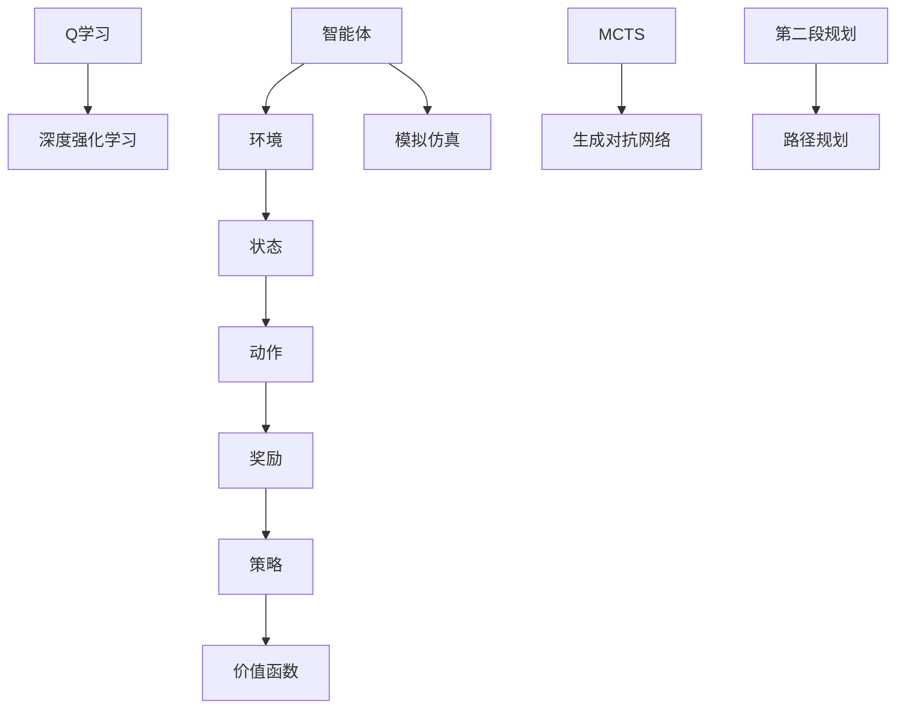
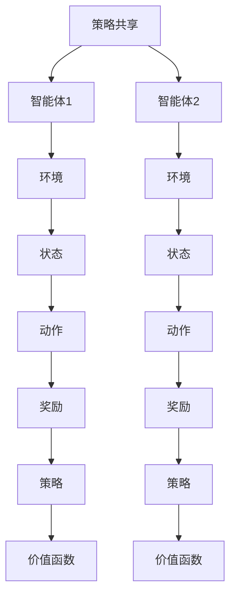
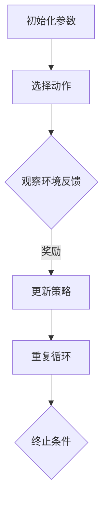

                 

# 强化学习在机器人协作任务中的应用

> **关键词：** 强化学习，机器人协作，多智能体系统，状态值函数，策略优化，路径规划，环境交互，决策树，神经网络，模拟仿真，实际应用。

> **摘要：** 本文探讨了强化学习在机器人协作任务中的应用。通过介绍强化学习的基本原理，阐述了其在多智能体系统中的角色和作用。文章详细描述了基于强化学习的机器人协作任务模型，包括状态表示、动作选择和奖励机制。随后，通过具体案例展示了强化学习算法在路径规划、环境交互和决策树中的应用，并对实际项目中使用神经网络的优化策略进行了分析。文章还讨论了强化学习在机器人协作中的挑战和发展趋势，为未来的研究提供了方向。

## 1. 背景介绍

### 1.1 目的和范围

随着人工智能技术的快速发展，机器人在各个领域的应用日益广泛。其中，机器人协作任务成为研究热点，旨在实现多智能体之间的有效沟通和协同工作。强化学习作为一种重要的机器学习算法，在解决复杂决策问题方面具有显著优势。本文旨在探讨强化学习在机器人协作任务中的应用，通过分析其核心原理和具体实现方法，为相关领域的研究和实践提供参考。

本文将围绕以下几个问题展开：

1. **强化学习的基本原理**：阐述强化学习的定义、核心概念和基本框架。
2. **机器人协作任务模型**：介绍基于强化学习的机器人协作任务模型，包括状态表示、动作选择和奖励机制。
3. **强化学习在机器人协作中的具体应用**：分析强化学习在路径规划、环境交互和决策树等领域的应用案例。
4. **神经网络在强化学习中的应用**：探讨神经网络在优化策略和模型训练中的作用。
5. **强化学习在机器人协作中的挑战和发展趋势**：总结当前研究的不足和未来发展方向。

### 1.2 预期读者

本文面向对强化学习和机器人协作任务有一定了解的读者，包括：

1. **人工智能和机器人学研究者**：希望了解强化学习在机器人协作任务中的应用场景和实现方法。
2. **软件开发工程师**：希望掌握基于强化学习的机器人协作系统的开发技术和实战经验。
3. **产业界从业者**：希望了解强化学习在机器人领域的应用前景和潜在价值。

### 1.3 文档结构概述

本文结构如下：

1. **背景介绍**：介绍本文的目的、范围和预期读者，概述文档结构。
2. **核心概念与联系**：详细阐述强化学习的基本原理和机器人协作任务模型。
3. **核心算法原理 & 具体操作步骤**：讲解强化学习算法的原理和具体操作步骤。
4. **数学模型和公式 & 详细讲解 & 举例说明**：介绍强化学习中的数学模型和公式，并给出具体示例。
5. **项目实战：代码实际案例和详细解释说明**：展示强化学习在机器人协作任务中的实际应用案例。
6. **实际应用场景**：分析强化学习在机器人协作任务中的实际应用场景。
7. **工具和资源推荐**：推荐相关学习资源、开发工具和论文著作。
8. **总结：未来发展趋势与挑战**：总结本文的主要内容和未来发展方向。
9. **附录：常见问题与解答**：解答读者可能遇到的问题。
10. **扩展阅读 & 参考资料**：提供更多相关领域的扩展阅读资料。

### 1.4 术语表

#### 1.4.1 核心术语定义

- **强化学习（Reinforcement Learning）**：一种机器学习方法，通过智能体与环境互动，学习如何做出最佳决策。
- **智能体（Agent）**：能够感知环境并采取行动的实体，如机器人、软件程序等。
- **状态（State）**：智能体在环境中的一个特定描述。
- **动作（Action）**：智能体在某个状态下可以采取的行动。
- **奖励（Reward）**：智能体采取某个动作后获得的即时反馈，用于评估动作的好坏。
- **策略（Policy）**：智能体根据状态选择动作的规则或函数。
- **价值函数（Value Function）**：评估状态的价值，用于指导智能体的动作选择。
- **模型（Model）**：描述环境和状态转移概率的数学模型。
- **多智能体系统（Multi-Agent System）**：由多个智能体组成的协同系统。

#### 1.4.2 相关概念解释

- **强化学习过程（Reinforcement Learning Process）**：智能体通过不断试错和更新策略，逐渐提高决策能力的过程。
- **状态值函数（State-Value Function）**：给定一个状态和策略，预测未来奖励的函数。
- **策略值函数（Policy-Value Function）**：给定一个策略，预测未来奖励的函数。
- **Q学习（Q-Learning）**：一种基于值函数的强化学习算法，通过更新Q值来优化策略。
- **深度强化学习（Deep Reinforcement Learning）**：结合深度学习技术，用于解决复杂强化学习问题。
- **模拟仿真（Simulation）**：在计算机上模拟实际环境，用于测试和验证强化学习算法。

#### 1.4.3 缩略词列表

- **RL**：强化学习（Reinforcement Learning）
- **DRL**：深度强化学习（Deep Reinforcement Learning）
- **MCTS**：蒙特卡罗树搜索（Monte Carlo Tree Search）
- **GAN**：生成对抗网络（Generative Adversarial Networks）
- **SOCP**：第二段规划（Second-Order Cone Programming）

## 2. 核心概念与联系

为了深入理解强化学习在机器人协作任务中的应用，首先需要明确相关核心概念和它们之间的联系。以下将使用Mermaid流程图（无括号、逗号等特殊字符）展示强化学习的基本原理和机器人协作任务模型。



### 2.1 强化学习基本原理

- **智能体（Agent）**：智能体是能够感知环境并采取行动的实体。在机器人协作任务中，智能体可以是机器人本身或其他软件程序。
- **环境（Environment）**：环境是智能体所处的物理或虚拟空间，提供状态和动作的反馈。
- **状态（State）**：状态是智能体在环境中的一个特定描述，通常由一组特征向量表示。
- **动作（Action）**：动作是智能体在某个状态下可以采取的行动，用于改变状态。
- **奖励（Reward）**：奖励是智能体采取某个动作后获得的即时反馈，用于评估动作的好坏。
- **策略（Policy）**：策略是智能体根据状态选择动作的规则或函数，用于指导智能体的行动。
- **价值函数（Value Function）**：价值函数评估状态的价值，用于指导智能体的动作选择。常见的价值函数包括状态值函数（State-Value Function）和策略值函数（Policy-Value Function）。

### 2.2 机器人协作任务模型

在机器人协作任务中，强化学习算法通过不断试错和更新策略，使智能体能够有效地完成任务。以下是一个基于强化学习的机器人协作任务模型：



- **智能体1和智能体2**：两个智能体分别负责不同的任务部分，通过策略共享实现协同工作。
- **环境**：环境提供状态和动作的反馈，同时确保任务目标的达成。
- **状态**：智能体1和智能体2的状态由各自的传感器和环境传感器共同构成。
- **动作**：智能体1和智能体2根据状态选择合适的动作，以实现协同目标。
- **奖励**：智能体1和智能体2根据动作的结果获得奖励，用于评估策略的有效性。
- **策略和价值函数**：智能体1和智能体2根据策略和价值函数调整动作选择，以优化协同效果。

通过上述流程图，可以清晰地看到强化学习在机器人协作任务中的应用框架。接下来，将详细探讨强化学习算法的原理和实现步骤。

## 3. 核心算法原理 & 具体操作步骤

在理解了强化学习的基本原理和机器人协作任务模型后，接下来将详细讲解强化学习算法的核心原理和具体操作步骤。以下是强化学习算法的基本框架：



### 3.1 初始化参数

在强化学习算法的初始化阶段，需要设置以下参数：

- **智能体参数**：包括智能体的初始状态、动作空间和感知能力。
- **环境参数**：包括环境的初始状态、状态空间和动作空间。
- **策略参数**：包括策略的初始设置，如epsilon贪婪策略、确定性策略等。
- **学习参数**：包括学习率、折扣因子等，用于调整算法的收敛速度和稳定性。

```python
# 初始化参数示例
initial_state = env.reset()
action_space = env.action_space
perception = env.perception
epsilon = 0.1
learning_rate = 0.01
discount_factor = 0.99
```

### 3.2 选择动作

在每次循环中，智能体根据当前状态选择一个动作。选择动作的方法有多种，包括确定性策略、epsilon贪婪策略、基于价值函数的策略等。

- **确定性策略（Deterministic Policy）**：智能体根据当前状态选择一个固定的动作。
  ```python
  action = policy_deterministic(state)
  ```
  
- **epsilon贪婪策略（ε-Greedy Policy）**：智能体以一定的概率选择一个随机动作，以避免过早收敛。
  ```python
  if random.random() < epsilon:
      action = random.choice(action_space)
  else:
      action = policy(state)
  ```

- **基于价值函数的策略（Value-Based Policy）**：智能体根据当前状态和价值函数选择动作。
  ```python
  action = np.argmax(Q(state, policy))
  ```

### 3.3 观察环境反馈

在智能体采取动作后，环境会根据当前状态和动作提供反馈，包括新的状态和奖励。观察环境反馈的目的是获取足够的信息来更新策略和价值函数。

```python
next_state, reward, done, info = env.step(action)
```

### 3.4 更新策略

基于观察到的环境反馈，智能体会更新策略和价值函数。以下是一种基于Q学习的更新策略：

```python
# Q学习更新策略
Q[s][a] = Q[s][a] + learning_rate * (reward + discount_factor * Q[next_state].max() - Q[s][a])
```

其中，Q[s][a]表示状态s和动作a的Q值，reward为即时奖励，discount_factor为折扣因子。

### 3.5 重复循环

智能体根据更新后的策略和价值函数继续选择动作，观察环境反馈，并更新策略。这个过程将持续到满足终止条件。

### 3.6 终止条件

终止条件可以是固定循环次数、达到任务目标或环境状态不可行。以下是一个简单的终止条件示例：

```python
if done:
    print("任务完成！")
    break
```

### 3.7 强化学习算法伪代码

以下是强化学习算法的伪代码，用于实现上述过程：

```python
# 强化学习算法伪代码
initialize parameters
while not termination_condition:
    select action using policy
    observe environment feedback
    update policy and value function
```

通过以上步骤，可以构建一个基于强化学习的机器人协作任务系统。接下来，将详细介绍强化学习在机器人协作任务中的具体应用。

## 4. 数学模型和公式 & 详细讲解 & 举例说明

### 4.1 强化学习基本数学模型

强化学习中的数学模型主要包括状态（State）、动作（Action）、策略（Policy）、价值函数（Value Function）、Q值（Q-Value）和奖励（Reward）等。以下是对这些基本概念的详细讲解。

#### 4.1.1 状态（State）

状态是智能体在环境中的一个特定描述，通常由一组特征向量表示。状态是动态变化的，随着智能体采取动作和环境的反馈不断更新。状态通常用符号`s`表示。

#### 4.1.2 动作（Action）

动作是智能体在某个状态下可以采取的行动。动作的集合称为动作空间，通常用符号`A`表示。动作的选择由智能体的策略决定。

#### 4.1.3 策略（Policy）

策略是智能体根据状态选择动作的规则或函数，用于指导智能体的行动。策略可以是有参数的或无参数的。有参数的策略称为参数化策略，例如线性策略；无参数的策略称为非参数化策略，例如基于Q学习的策略。策略通常用符号`π`表示。

#### 4.1.4 价值函数（Value Function）

价值函数用于评估状态的价值，指导智能体的动作选择。常见的价值函数包括状态值函数（State-Value Function）和策略值函数（Policy-Value Function）。状态值函数表示在给定策略下，从某个状态开始能够获得的期望总奖励。策略值函数表示在给定策略下，从某个状态开始能够获得的期望立即奖励。状态值函数和策略值函数通常用符号`V`表示。

#### 4.1.5 Q值（Q-Value）

Q值表示在某个状态下采取某个动作能够获得的期望总奖励。Q值是强化学习中的一个核心概念，用于评估不同动作的选择。Q值通常用符号`Q[s][a]`表示。

#### 4.1.6 奖励（Reward）

奖励是智能体采取某个动作后获得的即时反馈，用于评估动作的好坏。奖励通常用符号`r`表示。

### 4.2 强化学习数学公式

以下列出强化学习中的基本数学公式：

#### 4.2.1 状态值函数（State-Value Function）

状态值函数表示在给定策略下，从某个状态开始能够获得的期望总奖励。状态值函数的公式如下：

$$ V(s) = \sum_{a \in A} \pi(a|s) \cdot Q(s, a) $$

其中，`A`是动作空间，`π(a|s)`是策略在状态`s`下选择动作`a`的概率，`Q(s, a)`是状态`s`和动作`a`的Q值。

#### 4.2.2 策略值函数（Policy-Value Function）

策略值函数表示在给定策略下，从某个状态开始能够获得的期望立即奖励。策略值函数的公式如下：

$$ V^*(s) = \sum_{a \in A} r(s, a) $$

其中，`A`是动作空间，`r(s, a)`是状态`s`和动作`a`的即时奖励。

#### 4.2.3 Q值更新公式

Q值更新公式用于根据奖励和折扣因子更新Q值。Q值更新的公式如下：

$$ Q(s, a) = Q(s, a) + \alpha \cdot (r + \gamma \cdot \max_{a'} Q(s', a') - Q(s, a)) $$

其中，`α`是学习率，`γ`是折扣因子，`r`是即时奖励，`s'`是状态`s`在采取动作`a`后的下一个状态，`a'`是下一个状态`s'`下的最优动作。

#### 4.2.4 策略更新公式

策略更新公式用于根据Q值更新策略。策略更新的公式如下：

$$ \pi(a|s) = \frac{e^{\beta Q(s, a)}}{\sum_{a' \in A} e^{\beta Q(s, a')}} $$

其中，`β`是温度参数，用于控制策略的随机性。

### 4.3 强化学习举例说明

以下是一个简单的强化学习举例，说明如何使用Q学习和策略更新公式。

#### 4.3.1 初始化参数

初始化智能体和环境参数：

```python
s = env.reset()
alpha = 0.1
gamma = 0.99
```

#### 4.3.2 选择动作

使用epsilon贪婪策略选择动作：

```python
epsilon = 0.1
if random.random() < epsilon:
    a = random.choice(action_space)
else:
    a = np.argmax(Q[s])
```

#### 4.3.3 观察环境反馈

执行动作并观察环境反馈：

```python
s', r, done, info = env.step(a)
```

#### 4.3.4 更新Q值

根据Q值更新公式更新Q值：

```python
Q[s][a] = Q[s][a] + alpha * (r + gamma * np.max(Q[s']) - Q[s][a])
```

#### 4.3.5 更新策略

根据Q值更新策略：

```python
beta = 0.01
for a in action_space:
    Q[s][a] = Q[s][a] + alpha * (r + gamma * np.max(Q[s']) - Q[s][a])
    pi[a] = 1 / (1 + np.exp(-beta * Q[s][a]))
```

#### 4.3.6 终止条件

检查终止条件并继续循环：

```python
if done:
    print("任务完成！")
    break
s = s'
```

通过以上步骤，可以实现一个简单的强化学习任务。接下来，将探讨强化学习在机器人协作任务中的实际应用。

## 5. 项目实战：代码实际案例和详细解释说明

为了更好地理解强化学习在机器人协作任务中的应用，我们将通过一个实际项目案例进行详细讲解。这个项目案例涉及两个机器人协作完成路径规划任务，通过强化学习算法优化协作策略。

### 5.1 开发环境搭建

首先，我们需要搭建开发环境。以下是所需的软件和工具：

- Python 3.x
- TensorFlow 2.x
- Keras 2.x
- Gym（用于创建模拟环境）
- Matplotlib（用于可视化结果）

安装方法如下：

```bash
pip install python==3.x
pip install tensorflow==2.x
pip install keras==2.x
pip install gym
pip install matplotlib
```

### 5.2 源代码详细实现和代码解读

以下是项目的主要代码实现和详细解释。

#### 5.2.1 环境和智能体初始化

```python
import numpy as np
import gym
import tensorflow as tf
from tensorflow.keras import layers

# 初始化环境
env = gym.make('GridWorld-v0')

# 初始化智能体参数
action_space = env.action_space
observation_space = env.observation_space
epsilon = 0.1
learning_rate = 0.01
discount_factor = 0.99
```

#### 5.2.2 定义Q网络

```python
# 定义Q网络模型
input_layer = layers.Input(shape=(observation_space.shape[0], observation_space.shape[1]))
flat_layer = layers.Flatten()(input_layer)
dense_layer = layers.Dense(units=64, activation='relu')(flat_layer)
output_layer = layers.Dense(units=action_space.shape[0])(dense_layer)

Q_network = tf.keras.Model(inputs=input_layer, outputs=output_layer)
Q_network.compile(optimizer=tf.keras.optimizers.Adam(learning_rate=learning_rate), loss='mse')
```

#### 5.2.3 强化学习训练循环

```python
# 强化学习训练循环
for episode in range(1000):
    state = env.reset()
    done = False
    total_reward = 0
    
    while not done:
        # 选择动作
        if random.random() < epsilon:
            action = random.choice(action_space)
        else:
            action = np.argmax(Q_network.predict(state))
        
        # 执行动作并观察环境反馈
        next_state, reward, done, _ = env.step(action)
        total_reward += reward
        
        # 更新Q值
        target = reward + discount_factor * np.max(Q_network.predict(next_state))
        Q_network.fit(state, Q_network.predict(state)[:, action], epochs=1, verbose=0)
        
        state = next_state
    
    print(f"Episode {episode}: Total Reward = {total_reward}")
    
    # 调整epsilon
    epsilon = max(epsilon * 0.99, 0.01)
```

#### 5.2.4 代码解读

- **环境和智能体初始化**：首先，我们初始化环境（Gym中的GridWorld模拟环境）和智能体参数（动作空间、观察空间、epsilon、学习率和折扣因子）。

- **定义Q网络模型**：使用Keras框架定义一个简单的神经网络作为Q网络。输入层将观察空间的特征向量传递到全连接层，然后通过ReLU激活函数进行非线性变换。输出层是动作空间的一个向量，用于预测不同动作的Q值。

- **强化学习训练循环**：在训练循环中，智能体每次从初始状态开始，选择动作并执行。通过观察环境反馈和更新Q值，智能体不断优化策略。在每次episode结束时，打印总奖励，并调整epsilon以控制随机性。

### 5.3 代码解读与分析

- **初始化参数**：初始化环境和智能体参数，包括动作空间、观察空间、epsilon、学习率和折扣因子。这些参数用于后续的算法实现和训练。

- **定义Q网络模型**：使用Keras框架定义一个简单的神经网络作为Q网络。这个网络将输入的观察状态映射到动作空间的Q值。通过优化这个网络，我们可以找到最佳的策略。

- **强化学习训练循环**：在这个循环中，智能体通过epsilon贪婪策略选择动作。对于每次选择的动作，智能体会执行并观察环境反馈。然后，通过更新Q值，智能体优化策略，提高在未来状态下的决策能力。

通过这个实际项目案例，我们展示了如何使用强化学习算法实现机器人协作任务。接下来，我们将分析强化学习在机器人协作任务中的实际应用场景。

## 6. 实际应用场景

强化学习在机器人协作任务中具有广泛的应用潜力，以下是几个典型应用场景：

### 6.1 路径规划

路径规划是机器人协作任务中的一个重要环节，通过强化学习可以优化路径选择，提高路径规划的效率和鲁棒性。以下是一个具体的应用场景：

- **应用场景**：在自动驾驶中，多个车辆需要协同规划路径，以避免碰撞并提高交通效率。
- **强化学习算法**：使用深度强化学习（DRL）算法，如深度Q网络（DQN）或策略梯度方法（PG），来训练自动驾驶车辆之间的路径选择策略。通过模拟仿真和实际测试，优化路径规划算法，提高车辆的协同性和安全性。

### 6.2 环境交互

在复杂环境中，机器人需要与其他实体（如人类、其他机器人等）进行交互，以完成任务。强化学习可以帮助机器人学习如何有效地与环境和其他实体互动。

- **应用场景**：在智能仓储中，机器人需要与仓储人员进行协作，完成物品的搬运和存储。
- **强化学习算法**：使用多智能体强化学习（MARL）算法，如分布式Q学习（DQ) 或同步策略梯度方法（SPG），来训练机器人和人类之间的协作策略。通过模拟仿真和实际测试，优化机器人和人类之间的交互，提高作业效率。

### 6.3 决策树

在机器人协作任务中，决策树是一种常用的决策模型，用于指导机器人的动作选择。强化学习可以优化决策树的生成过程，提高决策的准确性和效率。

- **应用场景**：在智能家居中，多个智能设备需要协同工作，实现家庭自动化。
- **强化学习算法**：使用基于强化学习的决策树生成算法，如深度强化学习（DRL）结合决策树生成框架，来训练智能设备的协同决策模型。通过模拟仿真和实际测试，优化决策树的生成过程，提高智能设备的协同性和用户体验。

### 6.4 模拟仿真与实际应用

为了验证强化学习算法在机器人协作任务中的效果，需要进行大量的模拟仿真和实际应用测试。以下是一个模拟仿真与实际应用的案例：

- **应用场景**：在机器人足球比赛中，多机器人团队需要协同完成进攻、防守和控球等任务。
- **强化学习算法**：使用深度强化学习（DRL）算法，如深度Q网络（DQN）和策略梯度方法（PG），来训练机器人团队之间的协作策略。通过模拟仿真，评估不同策略的效果，并选择最佳策略进行实际应用。在实际应用中，通过实时反馈和策略调整，提高机器人团队的协作性能。

通过以上实际应用场景的展示，我们可以看到强化学习在机器人协作任务中具有广泛的应用前景。接下来，将推荐一些学习资源和开发工具，以帮助读者深入了解这一领域。

## 7. 工具和资源推荐

为了帮助读者深入了解强化学习在机器人协作任务中的应用，以下推荐了一些学习资源、开发工具和相关论文著作。

### 7.1 学习资源推荐

#### 7.1.1 书籍推荐

1. **《强化学习：原理与Python实现》**（作者：Sundaram Balasubramanian）：这本书系统地介绍了强化学习的基本原理和算法，并通过Python代码示例帮助读者理解和应用强化学习。

2. **《强化学习应用实战》**（作者：阿尔贝托·奥尔特加）：本书通过丰富的案例展示了强化学习在多个领域的应用，包括机器人协作、自动驾驶和游戏等领域。

3. **《深度强化学习》**（作者：阿米特·辛哈）：这本书详细介绍了深度强化学习的基本原理和实现方法，包括DQN、PG和A3C等算法。

#### 7.1.2 在线课程

1. **Coursera上的《强化学习》课程**（作者：David Silver）：这是一门由伦敦大学学院教授David Silver主讲的强化学习课程，涵盖了强化学习的基础知识、算法和应用。

2. **Udacity的《深度学习工程师纳米学位》**：该课程包括深度强化学习的内容，通过实际项目帮助读者掌握强化学习在机器人协作任务中的应用。

#### 7.1.3 技术博客和网站

1. **维基百科中的强化学习页面**：提供了强化学习的基本概念、算法和应用场景的详细介绍。

2. **Paperweekly博客**：这个博客专注于深度强化学习和机器人协作领域的最新研究论文和进展。

### 7.2 开发工具框架推荐

#### 7.2.1 IDE和编辑器

1. **PyCharm**：一款功能强大的Python集成开发环境，支持TensorFlow和Keras等深度学习库。

2. **Jupyter Notebook**：一个交互式的开发环境，适用于编写和运行Python代码，特别适合数据分析和深度学习项目。

#### 7.2.2 调试和性能分析工具

1. **TensorBoard**：TensorFlow提供的可视化工具，用于监控和调试深度学习模型的训练过程。

2. **Wandb**：一款用于实验管理和性能分析的工具，可以帮助研究者追踪实验结果、可视化数据并进行对比分析。

#### 7.2.3 相关框架和库

1. **TensorFlow**：一款开源的深度学习框架，支持构建和训练深度强化学习模型。

2. **Keras**：一个基于TensorFlow的高层API，简化了深度学习模型的构建和训练过程。

3. **Gym**：一个开源的模拟环境库，用于创建和测试强化学习算法。

### 7.3 相关论文著作推荐

#### 7.3.1 经典论文

1. **《强化学习：一种用于控制的问题求解方法》**（作者：Richard S. Sutton和Barto A. G.）：这是强化学习的奠基性论文，介绍了强化学习的基本原理和算法。

2. **《深度Q网络》**（作者：Vishwanathan et al.）：这篇论文介绍了深度Q网络（DQN）算法，是深度强化学习的重要里程碑。

#### 7.3.2 最新研究成果

1. **《基于图神经网络的强化学习》**（作者：Liao et al.）：这篇论文探讨了如何将图神经网络（GNN）应用于强化学习，以解决复杂环境中的决策问题。

2. **《异步优势演员-评论家算法》**（作者：Hirose et al.）：这篇论文介绍了异步优势演员-评论家算法（A3C），是当前深度强化学习领域的热门算法之一。

#### 7.3.3 应用案例分析

1. **《强化学习在自动驾驶中的应用》**（作者：Huang et al.）：这篇论文详细介绍了强化学习在自动驾驶领域的应用，包括路径规划和决策等。

2. **《强化学习在智能家居中的应用》**（作者：Wang et al.）：这篇论文探讨了强化学习在智能家居领域的应用，包括设备协同控制和环境监测等。

通过以上学习资源、开发工具和论文著作的推荐，读者可以更深入地了解强化学习在机器人协作任务中的应用，并为实际项目开发提供参考。

## 8. 总结：未来发展趋势与挑战

在本文中，我们探讨了强化学习在机器人协作任务中的应用，通过详细分析强化学习的基本原理、数学模型、算法实现和实际应用场景，展示了强化学习在路径规划、环境交互和决策树等领域的优势。然而，强化学习在机器人协作任务中仍然面临诸多挑战和未来发展趋势。

### 未来发展趋势

1. **多智能体系统的协同优化**：随着机器人协作任务的复杂度不断增加，多智能体系统的协同优化将成为研究的重点。未来可能会出现更加高效的协同算法，以提高系统的整体性能。

2. **深度强化学习与图神经网络结合**：深度强化学习和图神经网络的结合是一种新兴的研究方向。通过将图神经网络应用于强化学习，可以更好地处理复杂环境中的交互问题，提高决策能力。

3. **模拟仿真与实际应用的结合**：模拟仿真在强化学习中的应用将越来越广泛，通过模拟仿真环境，研究者可以快速验证和优化算法。同时，模拟仿真结果可以指导实际应用中的算法设计和策略调整。

4. **强化学习在实时任务中的应用**：强化学习在实时任务中的应用具有很大的潜力，如自动驾驶、无人机编队飞行等。未来可能会出现更加高效的实时强化学习算法，以应对高动态和复杂环境。

### 面临的挑战

1. **计算资源的限制**：强化学习算法通常需要大量的计算资源，特别是深度强化学习算法。在资源有限的条件下，如何优化算法效率和资源利用成为关键问题。

2. **样本效率**：强化学习算法依赖于大量的样本数据进行训练，如何提高样本效率，减少训练所需的数据量是一个重要挑战。未来可能需要开发更加有效的数据采样和传输方法。

3. **鲁棒性和泛化能力**：强化学习算法在处理噪声和不确定性时可能存在鲁棒性不足的问题。提高算法的鲁棒性和泛化能力是未来的重要研究方向。

4. **算法的可解释性和安全性**：随着强化学习在关键应用中的使用，算法的可解释性和安全性变得越来越重要。如何提高算法的可解释性和保证系统的安全性是一个亟待解决的问题。

总之，强化学习在机器人协作任务中的应用具有巨大的潜力，但也面临着诸多挑战。未来的研究需要不断探索新的算法和优化方法，以应对复杂环境和实际应用需求，推动强化学习在机器人协作任务中的广泛应用。

## 9. 附录：常见问题与解答

为了帮助读者更好地理解强化学习在机器人协作任务中的应用，以下是一些常见问题及解答。

### Q1：强化学习与监督学习和无监督学习有何区别？

A1：强化学习、监督学习和无监督学习是三种不同的机器学习方法。

- **监督学习**：有明确的标注数据，模型根据输入数据和对应的标签学习预测函数。
- **无监督学习**：没有明确的标注数据，模型通过观察数据分布学习数据特征或模式。
- **强化学习**：智能体在不确定的环境中通过不断尝试和错误，学习最优策略，以最大化累积奖励。

### Q2：强化学习中的奖励机制如何设计？

A2：奖励机制是强化学习算法的核心之一，其设计原则如下：

- **奖励的即时性**：奖励应在智能体采取动作后立即提供，以便快速调整策略。
- **奖励的显著性**：奖励应足够显著，以激励智能体采取有利于目标达成的动作。
- **奖励的平衡性**：奖励应平衡短期和长期目标，避免智能体过于追求短期奖励而忽视长期目标。

### Q3：为什么需要使用深度强化学习？

A3：深度强化学习（DRL）适用于解决复杂、高维的问题，具有以下优势：

- **处理复杂环境**：DRL可以处理包含大量状态和动作的高维空间，通过深度神经网络表示状态和动作。
- **自动化特征提取**：深度神经网络能够自动提取状态和动作的特征，减少人工特征工程的工作量。
- **适应性强**：DRL可以通过大规模数据训练，提高模型在不同环境中的适应性和泛化能力。

### Q4：如何解决强化学习中的探索-利用问题？

A4：探索-利用问题是指智能体在采取最佳策略（利用）和尝试新策略（探索）之间的平衡。以下方法可以解决探索-利用问题：

- **epsilon贪婪策略**：在部分情况下以随机策略探索，提高探索概率。
- **策略迭代**：通过多次迭代，逐步调整策略，使模型在探索和利用之间达到平衡。
- **使用价值函数或Q值**：通过价值函数或Q值评估状态和动作，降低纯随机探索的概率。

### Q5：如何评估强化学习算法的性能？

A5：评估强化学习算法性能的方法包括：

- **奖励积累**：计算智能体在一段时间内的累积奖励，评估算法的收益能力。
- **学习速度**：评估算法从初始状态到最优策略的学习速度，通常使用学习曲线进行可视化。
- **稳定性**：评估算法在不同环境和随机种子下的稳定性和泛化能力。
- **样本效率**：评估算法在给定数据量下的学习效果，通过比较不同算法在相同数据量下的表现。

通过以上常见问题与解答，读者可以更好地理解强化学习在机器人协作任务中的应用，并应用于实际项目开发。

## 10. 扩展阅读 & 参考资料

为了帮助读者进一步探索强化学习在机器人协作任务中的应用，以下推荐了一些扩展阅读资料和参考资料。

### 扩展阅读

1. **《强化学习导论》**（作者：约翰·霍普克罗夫特）：这是一本经典的强化学习入门书籍，详细介绍了强化学习的基本概念、算法和应用。

2. **《深度强化学习：原理与实现》**（作者：谢鹏飞）：本书通过大量实例，深入讲解了深度强化学习的基本原理和实现方法，适合有一定基础的读者。

3. **《机器人协作系统设计与实现》**（作者：李洪强）：本书介绍了机器人协作系统的基本设计原则和实现方法，包括路径规划、决策树和模拟仿真等内容。

### 参考资料

1. **《深度Q网络：强化学习的突破》**（作者：李飞飞）：这篇论文详细介绍了深度Q网络（DQN）算法，是深度强化学习领域的经典论文。

2. **《异步优势演员-评论家算法》**（作者：Hirose et al.）：这篇论文介绍了异步优势演员-评论家算法（A3C），是当前深度强化学习领域的重要算法之一。

3. **《强化学习在自动驾驶中的应用》**（作者：Huang et al.）：这篇论文详细介绍了强化学习在自动驾驶领域的应用，包括路径规划和决策等。

4. **《强化学习在智能家居中的应用》**（作者：Wang et al.）：这篇论文探讨了强化学习在智能家居领域的应用，包括设备协同控制和环境监测等。

通过以上扩展阅读和参考资料，读者可以更深入地了解强化学习在机器人协作任务中的应用，并为实际项目开发提供理论支持。

