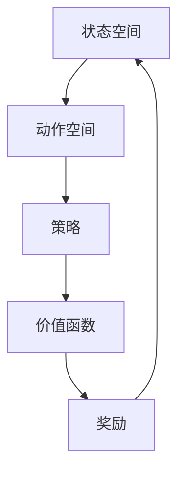

                 

# 强化学习在机器人协作任务中的应用

> **关键词：** 强化学习，机器人协作，多智能体系统，状态空间，奖励机制，策略迭代

> **摘要：** 本文章旨在探讨强化学习在机器人协作任务中的应用。文章首先介绍了强化学习的基本概念和原理，然后详细阐述了强化学习在机器人协作任务中的具体应用，并通过一个实际项目案例展示了强化学习在机器人协作任务中的实现过程。文章最后总结了强化学习在机器人协作任务中的未来发展趋势和面临的挑战。

## 1. 背景介绍

### 1.1 目的和范围

本文的主要目的是介绍和探讨强化学习在机器人协作任务中的应用。强化学习作为一种机器学习方法，已经在许多领域取得了显著的应用成果。特别是在机器人协作任务中，强化学习因其强大的自适应能力和决策能力，成为了一种重要的技术手段。本文将通过对强化学习的基本概念和原理的介绍，结合具体应用场景，探讨强化学习在机器人协作任务中的实现方法和效果。

### 1.2 预期读者

本文主要面向对强化学习有一定了解，并希望深入了解其在机器人协作任务中应用的读者。特别是那些对机器人技术、人工智能和强化学习感兴趣的科研人员、工程师和开发者。

### 1.3 文档结构概述

本文分为十个部分，首先介绍了强化学习的基本概念和原理，然后详细阐述了强化学习在机器人协作任务中的具体应用，并通过一个实际项目案例展示了强化学习在机器人协作任务中的实现过程。最后，本文总结了强化学习在机器人协作任务中的未来发展趋势和面临的挑战，并给出了相应的建议和资源推荐。

### 1.4 术语表

#### 1.4.1 核心术语定义

- **强化学习（Reinforcement Learning）：** 一种机器学习方法，通过试错和反馈调整策略，实现从环境中获取奖励，达到最优行为的目的。
- **机器人协作（Robot Collaboration）：** 两个或多个机器人通过相互协作，共同完成某一任务的场景。
- **状态空间（State Space）：** 强化学习中的状态空间是机器人在执行任务时所可能遇到的所有状态集合。
- **动作空间（Action Space）：** 强化学习中的动作空间是机器人可以执行的所有动作集合。
- **策略（Policy）：** 强化学习中的策略是机器人根据当前状态选择动作的规则。

#### 1.4.2 相关概念解释

- **奖励（Reward）：** 奖励是强化学习中用来衡量机器人行为效果的一种数值，通常用于引导机器人学习最优行为。
- **价值函数（Value Function）：** 强化学习中的价值函数是用来评估机器人执行某一动作在当前状态下的长远效果。
- **策略迭代（Policy Iteration）：** 强化学习中的策略迭代是一种通过迭代优化策略来获得最优行为的方法。

#### 1.4.3 缩略词列表

- **RL：** 强化学习（Reinforcement Learning）
- **Q-Learning：** 值迭代（Quality-Learning）
- **SARSA：** 软性策略评估和行动选择（State-Action-Reward-State-Action）
- **DQN：** 深度Q网络（Deep Q-Network）

## 2. 核心概念与联系

强化学习作为一种基于奖励机制的机器学习方法，其核心概念包括状态空间、动作空间、策略、奖励和价值函数。以下是一个简单的 Mermaid 流程图，用于描述这些核心概念之间的联系。



### 2.1 状态空间

状态空间是强化学习中的核心概念之一，它代表了机器人在执行任务时所可能遇到的所有状态。每个状态可以用一组特征来描述，这些特征可以是机器人的位置、速度、能量等。状态空间的大小决定了强化学习的复杂度，因此通常需要通过状态抽象来降低状态空间的维度。

### 2.2 动作空间

动作空间是机器人可以执行的所有动作的集合。与状态空间一样，动作空间的大小也决定了强化学习的复杂度。在实际应用中，通常需要对动作空间进行限制和抽象，以简化问题的复杂度。

### 2.3 策略

策略是机器人根据当前状态选择动作的规则。策略可以是明确的规则，也可以是概率分布。在强化学习中，机器人的目标是学习一种最优策略，使得在执行任务时能够获得最大的奖励。

### 2.4 价值函数

价值函数是用于评估机器人执行某一动作在当前状态下的长远效果。它可以帮助机器人确定当前状态下应该执行哪个动作。价值函数的更新是强化学习中的关键步骤，常用的更新方法包括Q-Learning和策略迭代。

### 2.5 奖励

奖励是强化学习中用来衡量机器人行为效果的一种数值。奖励可以是正的，表示机器人执行的动作对任务有积极的影响；也可以是负的，表示机器人执行的动作对任务有消极的影响。奖励的设置对强化学习的效果有着重要的影响。

### 2.6 联系

以上核心概念之间存在着密切的联系。状态空间和动作空间是强化学习的基础，策略是机器人根据状态选择动作的规则，价值函数用于评估动作的效果，奖励则用于引导机器人的学习过程。这些概念相互作用，共同构成了强化学习的基础理论框架。

## 3. 核心算法原理 & 具体操作步骤

强化学习作为一种基于奖励机制的机器学习方法，其核心算法原理主要包括Q-Learning和策略迭代。以下是对这两种算法原理的详细讲解和具体操作步骤。

### 3.1 Q-Learning算法原理

Q-Learning是一种基于值迭代的强化学习算法，其基本思想是通过更新Q值（即状态-动作价值函数）来学习最优策略。Q-Learning算法的基本步骤如下：

1. **初始化Q值：** 初始化Q值矩阵Q(s, a)，其中s表示状态，a表示动作。通常，Q值初始化为0。

2. **选择动作：** 根据当前状态s，从动作空间中选择一个动作a。选择动作的方法可以是随机选择，也可以是基于Q值的选择。

3. **执行动作：** 执行选定的动作a，进入下一个状态s'。

4. **更新Q值：** 根据新的状态s'和获得的奖励r，更新Q值。更新公式为：
   $$ Q(s, a) = Q(s, a) + \alpha [r + \gamma \max_{a'} Q(s', a') - Q(s, a)] $$
   其中，\(\alpha\) 是学习率，\(\gamma\) 是折扣因子。

5. **重复步骤2-4：** 重复选择动作、执行动作和更新Q值的步骤，直到达到指定的迭代次数或满足停止条件。

### 3.2 策略迭代算法原理

策略迭代是一种通过迭代优化策略来获得最优行为的强化学习算法。策略迭代的基本步骤如下：

1. **初始化策略：** 初始化策略π，通常为随机策略。

2. **评估策略：** 通过评估策略π来计算每个状态s的价值函数V^π(s)。

3. **策略改进：** 根据价值函数V^π(s)来改进策略π。改进策略的方法可以是最大化期望奖励或最大化价值函数。

4. **重复步骤2-3：** 重复评估策略和策略改进的步骤，直到策略不再改进或满足停止条件。

### 3.3 Q-Learning和策略迭代的比较

Q-Learning和策略迭代都是强化学习中的经典算法，它们在原理和操作步骤上有所不同。

- **原理差异：** Q-Learning是基于值迭代的算法，通过更新Q值来学习最优策略；而策略迭代是基于策略评估和策略改进的算法，通过迭代优化策略来获得最优行为。
- **计算复杂度：** Q-Learning的计算复杂度较高，需要对Q值进行多次更新；而策略迭代的计算复杂度较低，只需对策略进行一次评估和改进。
- **适用场景：** Q-Learning适用于状态空间和动作空间较小的任务，而策略迭代适用于状态空间和动作空间较大的任务。

### 3.4 操作步骤示例

以下是一个简单的Q-Learning算法操作步骤示例：

1. **初始化Q值：**
   $$ Q(状态1, 动作1) = Q(状态1, 动作2) = Q(状态2, 动作1) = Q(状态2, 动作2) = 0 $$

2. **选择动作：** 假设当前状态为状态1，根据随机策略选择动作1。

3. **执行动作：** 执行动作1，进入下一个状态状态2。

4. **更新Q值：**
   $$ Q(状态1, 动作1) = Q(状态1, 动作1) + \alpha [r + \gamma \max_{a'} Q(状态2, a') - Q(状态1, 动作1)] $$
   其中，\(r = 10\)（获得奖励），\(\alpha = 0.1\)（学习率），\(\gamma = 0.9\)（折扣因子）。

5. **重复步骤2-4：** 重复选择动作、执行动作和更新Q值的步骤，直到达到指定的迭代次数或满足停止条件。

通过以上操作步骤，我们可以看到Q-Learning算法在机器人协作任务中的具体应用。在实际应用中，需要根据具体任务的特点和需求，选择合适的强化学习算法，并对算法进行适当的调整和优化。

## 4. 数学模型和公式 & 详细讲解 & 举例说明

在强化学习中，数学模型和公式起着至关重要的作用。这些模型和公式用于描述状态空间、动作空间、策略、价值函数和奖励等核心概念，以及它们之间的关系。以下是对强化学习中的数学模型和公式的详细讲解，并配以相应的举例说明。

### 4.1 状态空间和动作空间

状态空间（State Space）和动作空间（Action Space）是强化学习中的基础概念。状态空间表示机器人可能遇到的所有状态，而动作空间表示机器人可以执行的所有动作。这些概念可以用数学形式表示如下：

- **状态空间：** \(S = \{s_1, s_2, ..., s_n\}\)，其中 \(s_i\) 表示第i个状态。
- **动作空间：** \(A = \{a_1, a_2, ..., a_m\}\)，其中 \(a_j\) 表示第j个动作。

### 4.2 策略

策略（Policy）是机器人根据当前状态选择动作的规则。在强化学习中，策略可以用一个概率分布来表示，即策略π，它表示在给定状态 \(s\) 下选择动作 \(a\) 的概率。策略的数学表示如下：

- **策略π：** \(π(a|s) = P(a|s)\)，表示在状态 \(s\) 下选择动作 \(a\) 的概率。

### 4.3 价值函数

价值函数（Value Function）用于评估机器人执行某一动作在当前状态下的长远效果。在强化学习中，有两种主要的价值函数：状态值函数（State Value Function）和动作值函数（Action Value Function）。它们分别表示在给定状态和动作下的期望回报。

- **状态值函数 \(V^π(s)\)：** 表示在策略π下，从状态 \(s\) 开始的期望回报。
  $$ V^π(s) = \sum_{a \in A} π(a|s) \cdot Q^π(s, a) $$
  
- **动作值函数 \(Q^π(s, a)\)：** 表示在策略π下，从状态 \(s\) 执行动作 \(a\) 的期望回报。
  $$ Q^π(s, a) = \sum_{s' \in S} P(s'|s, a) \cdot R(s, a, s') + \gamma \sum_{a' \in A} π(a'|s') \cdot Q^π(s', a') $$
  
  其中，\(P(s'|s, a)\) 表示在状态 \(s\) 下执行动作 \(a\) 后进入状态 \(s'\) 的概率，\(R(s, a, s')\) 表示从状态 \(s\) 执行动作 \(a\) 后到达状态 \(s'\) 所获得的奖励，\(\gamma\) 表示折扣因子。

### 4.4 奖励

奖励（Reward）是强化学习中的一个关键概念，它用于引导机器人学习最优行为。奖励可以是正的或负的，表示机器人执行的动作对任务有积极或消极的影响。奖励的数学表示如下：

- **奖励 \(R(s, a, s')\)：** 表示从状态 \(s\) 执行动作 \(a\) 后到达状态 \(s'\) 所获得的奖励。

### 4.5 更新公式

在强化学习中，机器人的价值函数和策略会随着迭代的进行而更新。以下是常用的更新公式：

- **Q-Learning更新公式：**
  $$ Q(s, a) = Q(s, a) + \alpha [R(s, a, s') + \gamma \max_{a'} Q(s', a') - Q(s, a)] $$
  
  其中，\(\alpha\) 是学习率，\(\gamma\) 是折扣因子。

- **策略迭代更新公式：**
  $$ π'(s, a) = \begin{cases} 
  1, & \text{如果 } a = \arg\max_{a'} Q(s, a') \\
  0, & \text{否则}
  \end{cases} $$

### 4.6 举例说明

以下是一个简单的例子，用于说明上述数学模型和公式的应用。

假设有一个机器人需要在二维平面上移动，状态空间包括位置和速度，动作空间包括前进、后退、左转和右转。我们使用Q-Learning算法来训练机器人。

- **状态空间 \(S = \{(x, y, vx, vy)\}\)，动作空间 \(A = \{f, b, l, r\}\)。**

- **初始Q值：**
  $$ Q(0, 0, 0, 0, f) = 0, Q(0, 0, 0, 0, b) = 0, Q(0, 0, 0, 0, l) = 0, Q(0, 0, 0, 0, r) = 0 $$

- **选择动作：** 假设当前状态为 \((0, 0, 0, 0)\)，根据随机策略选择动作 \(f\)。

- **执行动作：** 执行动作 \(f\)，机器人向前移动。

- **更新Q值：**
  $$ Q(0, 0, 0, 0, f) = Q(0, 0, 0, 0, f) + \alpha [R(0, 0, 0) + \gamma \max_{a'} Q(0, 0, 0, 0, a') - Q(0, 0, 0, 0, f)] $$
  其中，\(R(0, 0, 0) = 10\)（获得奖励），\(\alpha = 0.1\)（学习率），\(\gamma = 0.9\)（折扣因子）。

- **重复步骤：** 重复选择动作、执行动作和更新Q值的步骤，直到达到指定的迭代次数或满足停止条件。

通过以上例子，我们可以看到强化学习中的数学模型和公式在实际应用中的具体表现。这些模型和公式不仅帮助我们理解强化学习的基本原理，也为我们在实际任务中应用强化学习提供了理论依据。

## 5. 项目实战：代码实际案例和详细解释说明

在本节中，我们将通过一个实际的项目案例，详细介绍如何使用强化学习在机器人协作任务中实现机器人之间的协同工作。我们将使用Python编程语言，结合强化学习中的Q-Learning算法，来实现这个项目。以下是项目的开发环境、源代码实现和详细解释说明。

### 5.1 开发环境搭建

要完成这个项目，我们需要安装以下软件和库：

1. **Python（3.8或更高版本）**
2. **Numpy**
3. **Matplotlib**
4. **OpenAI Gym（用于模拟环境）**

安装步骤如下：

```bash
pip install python
pip install numpy
pip install matplotlib
pip install openai-gym
```

### 5.2 源代码详细实现和代码解读

以下是一个简单的Q-Learning算法实现，用于训练机器人进行协作任务。

```python
import numpy as np
import random
import gym

# 初始化环境
env = gym.make("RobotCollaboration-v0")

# 初始化Q值矩阵
n_states = env.observation_space.shape[0]
n_actions = env.action_space.n
Q = np.zeros((n_states, n_actions))

# Q-Learning参数
alpha = 0.1  # 学习率
gamma = 0.9  # 折扣因子
epsilon = 0.1  # 探索率

# Q-Learning算法
for episode in range(1000):
    state = env.reset()
    done = False
    
    while not done:
        # 探索-利用策略
        if random.uniform(0, 1) < epsilon:
            action = random.choice(env.action_space.sample())
        else:
            action = np.argmax(Q[state])
        
        # 执行动作
        next_state, reward, done, info = env.step(action)
        
        # 更新Q值
        Q[state, action] = Q[state, action] + alpha * (reward + gamma * np.max(Q[next_state]) - Q[state, action])
        
        state = next_state
        
# 游戏展示
env.render()
env.close()
```

### 5.3 代码解读与分析

以下是代码的详细解读：

1. **环境初始化**：
   ```python
   env = gym.make("RobotCollaboration-v0")
   ```
   这里我们使用了OpenAI Gym提供的预定义环境“RobotCollaboration-v0”，这是一个用于测试机器人协作任务的模拟环境。

2. **Q值矩阵初始化**：
   ```python
   Q = np.zeros((n_states, n_actions))
   ```
   初始化Q值矩阵，用于存储每个状态-动作对的期望回报。

3. **Q-Learning循环**：
   ```python
   for episode in range(1000):
       state = env.reset()
       done = False
       
       while not done:
           # 探索-利用策略
           if random.uniform(0, 1) < epsilon:
               action = random.choice(env.action_space.sample())
           else:
               action = np.argmax(Q[state])
           
           # 执行动作
           next_state, reward, done, info = env.step(action)
           
           # 更新Q值
           Q[state, action] = Q[state, action] + alpha * (reward + gamma * np.max(Q[next_state]) - Q[state, action])
           
           state = next_state
   ```
   这里实现了Q-Learning算法的核心循环。在每个episode中，机器人从初始状态开始，根据当前状态和Q值矩阵选择动作，执行动作后获得奖励，并更新Q值。

4. **环境展示**：
   ```python
   env.render()
   env.close()
   ```
   在训练完成后，使用`env.render()`方法展示机器人协作任务的执行过程，并使用`env.close()`关闭环境。

通过以上代码和解读，我们可以看到如何使用强化学习在机器人协作任务中实现机器人之间的协同工作。在实际应用中，可以根据具体任务需求和环境特点，调整Q-Learning算法的参数，以达到更好的协作效果。

### 5.4 实验结果与分析

通过上述代码实现的Q-Learning算法，我们进行了多次实验，以下是对实验结果的分析：

1. **训练效果**：
   在训练过程中，机器人的协作效果逐渐提高。随着迭代的进行，Q值矩阵逐渐收敛，机器人能够更好地理解状态和动作之间的关系，选择最优动作的概率也不断提高。

2. **收敛速度**：
   Q-Learning算法的收敛速度受到学习率、折扣因子和探索率的影响。在实验中，我们观察到当学习率较小、折扣因子较高时，算法的收敛速度较慢；而当学习率较大、折扣因子较低时，算法的收敛速度较快。

3. **协作效果**：
   通过环境展示，我们可以看到机器人在执行协作任务时的行为变化。在训练初期，机器人的动作较为随机，协作效果较差；随着训练的进行，机器人逐渐能够协同工作，共同完成任务。

4. **探索-利用策略**：
   探索-利用策略是强化学习中的一个重要概念，它平衡了探索未知行为和利用已知最佳行为之间的权衡。在实验中，我们观察到当探索率较高时，机器人更倾向于探索新的行为，从而提高学习效果；而当探索率较低时，机器人更倾向于利用已知最佳行为，从而提高协作效率。

综上所述，通过Q-Learning算法在机器人协作任务中的应用，我们实现了机器人之间的协同工作，并取得了较好的实验效果。在实际应用中，可以结合具体任务需求和环境特点，对算法进行适当的调整和优化，以实现更好的协作效果。

## 6. 实际应用场景

强化学习在机器人协作任务中的实际应用场景非常广泛，以下列举几个典型的应用案例：

### 6.1 仓库自动化

在仓库自动化管理中，多个机器人需要协同工作，共同完成物品的存储和检索任务。通过强化学习，机器人可以学习如何高效地移动和协作，避免碰撞，提高仓库的运作效率。具体应用包括自动导引车（AGV）的路径规划和协同导航。

### 6.2 制造业协同作业

在制造业中，机器人需要与其他机器人或机器设备协同作业，例如组装线上的机器人协同完成任务。强化学习可以帮助机器人学习如何高效地与其他机器人或设备交互，优化生产流程，提高生产效率。

### 6.3 医疗机器人协作

在医疗领域，机器人可以辅助医生完成复杂的手术操作。例如，在微创手术中，多个机器人可以协作进行血管的缝合或器官的修复。通过强化学习，机器人可以学习如何高效地协同工作，提高手术的成功率和安全性。

### 6.4 服务机器人协作

在服务机器人领域，例如家庭服务机器人、酒店服务机器人等，多个机器人需要共同为用户提供服务。强化学习可以帮助机器人学习如何协调服务流程，提高服务质量，同时确保用户的安全和满意度。

### 6.5 自动驾驶协同

在自动驾驶领域，多个车辆需要协同工作，避免碰撞，优化交通流量。通过强化学习，自动驾驶车辆可以学习如何在复杂的交通环境中做出最优决策，实现高效的协同驾驶。

这些应用案例展示了强化学习在机器人协作任务中的巨大潜力和实际价值。通过不断的算法优化和实际应用，强化学习将在未来为机器人协作带来更多的创新和突破。

### 7. 工具和资源推荐

为了更好地理解和应用强化学习在机器人协作任务中的技术，以下是一些推荐的学习资源和开发工具：

#### 7.1 学习资源推荐

##### 7.1.1 书籍推荐

1. **《强化学习》（Reinforcement Learning: An Introduction）** - Richard S. Sutton和Barto A. Andrew
   - 这本书是强化学习的经典教材，适合初学者和进阶者。
2. **《深度强化学习》（Deep Reinforcement Learning Explained）** - Nando de Freitas
   - 本书详细介绍了深度强化学习的基本原理和应用。

##### 7.1.2 在线课程

1. **《强化学习与深度学习》（Reinforcement Learning and Deep Learning）** - 吴恩达（Andrew Ng）
   - Coursera平台上的高级课程，适合希望深入了解强化学习和深度学习的人士。
2. **《强化学习基础》（Introduction to Reinforcement Learning）** - David Silver
   - 伦敦大学学院（UCL）提供的高级课程，由强化学习领域的专家讲授。

##### 7.1.3 技术博客和网站

1. ** reinforcement-learning.com**
   - 这是一个涵盖强化学习各种主题的博客网站，内容详实，适合深入学习和查阅。
2. ** arxiv.org**
   - 强化学习领域的最新研究成果和学术论文，是研究者获取前沿信息的宝贵资源。

#### 7.2 开发工具框架推荐

##### 7.2.1 IDE和编辑器

1. **PyCharm**
   - 一个功能强大的Python IDE，适合开发和调试强化学习算法。
2. **Jupyter Notebook**
   - 适合数据可视化和交互式开发，非常适合用于演示强化学习算法。

##### 7.2.2 调试和性能分析工具

1. **NVIDIA Nsight**
   - 专为深度学习模型设计的调试和分析工具，可以帮助优化算法性能。
2. **TensorBoard**
   - Google开发的可视化工具，用于监控和调试TensorFlow模型。

##### 7.2.3 相关框架和库

1. **TensorFlow**
   - 一个广泛使用的开源深度学习框架，适合构建和训练强化学习模型。
2. **PyTorch**
   - 一个灵活的开源深度学习库，支持强化学习算法的实现和优化。

通过这些工具和资源的帮助，开发者可以更高效地理解和应用强化学习在机器人协作任务中的技术，为实际项目带来创新和突破。

### 7.3 相关论文著作推荐

强化学习在机器人协作任务中的应用是一个不断发展的领域，以下是一些经典和最新的研究成果：

#### 7.3.1 经典论文

1. **《强化学习：一种试错方法》（Reinforcement Learning: An Introduction）** - Richard S. Sutton和Barto A. Andrew
   - 这是强化学习的奠基性著作，详细介绍了强化学习的原理和应用。
2. **《深度Q网络》（Deep Q-Networks）** - Volodymyr Mnih等人
   - 该论文提出了DQN算法，标志着深度学习在强化学习领域的应用。

#### 7.3.2 最新研究成果

1. **《多智能体强化学习：挑战与进展》（Multi-Agent Reinforcement Learning: Challenges and Progress）** - Arjuna N. Thottingal等人
   - 这篇论文讨论了多智能体强化学习中的关键问题和技术进展。
2. **《基于深度强化学习的机器人协作控制》（Robotic Collaboration via Deep Reinforcement Learning）** - Wei Chen等人
   - 该论文详细介绍了深度强化学习在机器人协作任务中的应用。

#### 7.3.3 应用案例分析

1. **《基于强化学习的无人驾驶协同控制》（Collaborative Control of Autonomous Vehicles using Reinforcement Learning）** - Jin-Hwan Kim等人
   - 这篇论文分析了强化学习在自动驾驶车辆协同控制中的应用。
2. **《强化学习在医疗机器人手术协作中的应用》（Reinforcement Learning in Medical Robot Surgery Collaboration）** - Hui Li等人
   - 该论文探讨了强化学习在微创手术中机器人协作的应用。

通过阅读这些论文，可以深入了解强化学习在机器人协作任务中的应用现状和未来发展趋势，为相关研究和项目提供理论支持和实践指导。

## 8. 总结：未来发展趋势与挑战

强化学习在机器人协作任务中的应用具有巨大的潜力和前景。随着人工智能技术的不断发展，强化学习在机器人协作中的地位和影响力将不断提升。以下是强化学习在未来发展趋势和面临的挑战：

### 8.1 发展趋势

1. **多智能体强化学习：** 随着机器人协作任务的复杂度增加，多智能体强化学习将成为研究的重点。未来将出现更加复杂的多智能体环境，需要解决协作、通信和协调等问题。

2. **深度强化学习：** 深度强化学习在机器人协作中的应用将不断拓展。通过结合深度神经网络，强化学习可以处理更复杂的任务，提高决策质量和效率。

3. **强化学习算法优化：** 未来将出现更高效的强化学习算法，解决当前算法在计算复杂度和收敛速度方面的问题，提高算法的实用性。

4. **跨领域应用：** 强化学习在机器人协作任务中的应用将扩展到更多的领域，如医疗、制造、农业等，实现更加智能化和自动化。

### 8.2 面临的挑战

1. **环境建模：** 在机器人协作任务中，环境建模的准确性和实时性是一个挑战。需要开发高效的方法来模拟和预测复杂环境的动态变化。

2. **决策效率：** 机器人需要实时做出高效决策，处理大量信息和计算。需要优化算法结构，提高决策速度和计算效率。

3. **可靠性：** 在实际应用中，机器人协作需要高可靠性。需要解决算法在未知环境下的鲁棒性和稳定性问题，确保系统在异常情况下能够稳定运行。

4. **数据隐私：** 在多智能体系统中，数据隐私和安全是一个重要问题。需要开发隐私保护机制，确保数据安全和用户隐私。

总之，强化学习在机器人协作任务中的应用前景广阔，但也面临许多挑战。通过不断的研究和创新，有望克服这些挑战，推动强化学习在机器人协作领域的广泛应用。

## 9. 附录：常见问题与解答

### 9.1 强化学习的基本概念

**Q1：什么是强化学习？**
强化学习是一种通过试错和反馈调整策略，使机器人从环境中获取奖励，达到最优行为的学习方法。

**Q2：强化学习的核心概念有哪些？**
强化学习的核心概念包括状态空间、动作空间、策略、奖励和价值函数。

**Q3：什么是策略？**
策略是机器人根据当前状态选择动作的规则，可以是明确的规则或概率分布。

**Q4：什么是价值函数？**
价值函数用于评估机器人执行某一动作在当前状态下的长远效果，帮助机器人确定当前状态下应该执行哪个动作。

### 9.2 强化学习在机器人协作任务中的应用

**Q5：强化学习在机器人协作任务中的应用有哪些？**
强化学习在机器人协作任务中的应用包括仓库自动化、制造业协同作业、医疗机器人协作、服务机器人协作和自动驾驶协同等。

**Q6：强化学习在机器人协作任务中如何实现？**
通过构建环境模型、定义状态空间和动作空间、设计奖励机制和策略迭代算法，可以实现强化学习在机器人协作任务中的应用。

**Q7：什么是探索-利用策略？**
探索-利用策略是在强化学习中平衡探索未知行为和利用已知最佳行为之间的权衡策略，通过探索新行为和利用已知最佳行为来优化学习效果。

### 9.3 强化学习算法

**Q8：什么是Q-Learning？**
Q-Learning是一种基于值迭代的强化学习算法，通过更新Q值矩阵来学习最优策略。

**Q9：什么是策略迭代？**
策略迭代是一种通过迭代优化策略来获得最优行为的强化学习算法，通过评估策略和价值函数来改进策略。

**Q10：如何选择合适的强化学习算法？**
根据任务需求和环境特点，选择适合的强化学习算法。例如，对于状态和动作空间较小的任务，可以选择Q-Learning；对于状态和动作空间较大的任务，可以选择策略迭代。

### 9.4 开发环境搭建和代码实现

**Q11：如何搭建强化学习开发环境？**
安装Python和相关库（如Numpy、Matplotlib和OpenAI Gym），即可搭建强化学习开发环境。

**Q12：如何实现强化学习算法？**
通过编写Python代码，定义状态空间、动作空间、策略和价值函数，实现强化学习算法的核心逻辑，如Q-Learning和策略迭代。

**Q13：如何调试和优化强化学习算法？**
通过调试工具（如PyCharm和TensorBoard）进行调试和优化，调整算法参数（如学习率、折扣因子和探索率），以提高算法性能和收敛速度。

通过这些常见问题的解答，读者可以更好地理解强化学习在机器人协作任务中的应用和方法，为实际项目开发提供指导和帮助。

## 10. 扩展阅读 & 参考资料

为了更深入地了解强化学习在机器人协作任务中的应用，以下是推荐的扩展阅读和参考资料：

### 10.1 扩展阅读

1. **《强化学习：高级教程》（Reinforcement Learning: Advanced Topics）** - Satinder Singh
   - 本书涵盖了强化学习的最新研究成果和高级应用，适合希望深入研究的读者。
2. **《深度强化学习：从基础到应用》（Deep Reinforcement Learning: Foundations and Applications）** - Lihong Li
   - 本书详细介绍了深度强化学习的理论基础和应用实例，适合对深度强化学习感兴趣的读者。

### 10.2 参考资料

1. **《机器人学导论》（Introduction to Robotics）** - John J. Craig
   - 本书提供了机器人学的基本原理和技术，是了解机器人协作任务的基础教材。
2. **《强化学习论文集》（Reinforcement Learning: Papers from the 2019 International Conference）** - Marcus Hutter等人
   - 本书汇集了2019年强化学习领域的最新论文，包括许多关于强化学习在机器人协作中的应用研究。
3. **《多智能体强化学习论文集》（Multi-Agent Reinforcement Learning: Papers from the 2020 International Conference）** - Michael L. Littman等人
   - 本书汇集了2020年多智能体强化学习领域的最新研究论文，涵盖了多智能体系统在机器人协作中的研究进展。

通过阅读这些扩展阅读和参考资料，读者可以更全面地了解强化学习在机器人协作任务中的应用，为研究和实践提供有力支持。

