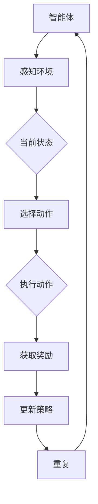

                 

# 强化学习在机器人导航中的应用研究

> **关键词**：强化学习，机器人导航，智能控制，路径规划，Q-learning，DQN，深度强化学习
>
> **摘要**：本文深入探讨了强化学习在机器人导航领域的应用。通过介绍强化学习的核心概念、算法原理及数学模型，结合具体实战案例，详细分析了强化学习在路径规划、行为控制等方面的实际应用。文章旨在为从事机器人导航研究和开发的人员提供理论基础和实践指导，推动该领域的技术进步。

## 1. 背景介绍

### 1.1 目的和范围

本文的目的是探讨如何利用强化学习（Reinforcement Learning, RL）技术来提高机器人在动态环境中的导航能力。具体来说，我们将研究强化学习算法在机器人路径规划、避障、目标寻找等任务中的应用，以及如何通过这些算法实现机器人自主导航。

文章将围绕以下内容展开：

1. 强化学习的基础知识介绍，包括核心概念、算法原理和数学模型。
2. 强化学习算法在机器人导航中的具体应用场景。
3. 实际项目案例中的强化学习算法实现和效果分析。
4. 介绍相关学习资源、开发工具和最新研究成果。

### 1.2 预期读者

本文适合以下读者群体：

- 从事机器人导航研究的技术人员。
- 对强化学习算法感兴趣的研究人员和学生。
- 对人工智能、机器学习有初步了解，希望深入了解强化学习应用的人士。

### 1.3 文档结构概述

本文结构如下：

1. **背景介绍**：介绍研究的目的和范围，预期读者以及文档结构。
2. **核心概念与联系**：讲解强化学习的基本概念及其在机器人导航中的应用。
3. **核心算法原理 & 具体操作步骤**：详细阐述强化学习算法原理，并通过伪代码展示具体操作步骤。
4. **数学模型和公式 & 详细讲解 & 举例说明**：介绍强化学习相关的数学模型和公式，并通过实例进行说明。
5. **项目实战：代码实际案例和详细解释说明**：结合实际项目，展示强化学习算法的应用。
6. **实际应用场景**：讨论强化学习在机器人导航中的实际应用场景。
7. **工具和资源推荐**：推荐学习资源、开发工具和最新研究成果。
8. **总结：未来发展趋势与挑战**：总结本文的主要发现，展望未来发展趋势和面临的挑战。
9. **附录：常见问题与解答**：解答读者可能遇到的一些常见问题。
10. **扩展阅读 & 参考资料**：提供进一步阅读的文献和资料。

### 1.4 术语表

#### 1.4.1 核心术语定义

- **强化学习**：一种机器学习范式，通过与环境交互来学习策略，以达到某种目标。
- **路径规划**：在给定环境中寻找一条从起点到终点的最优路径。
- **状态（State）**：机器人所处的环境描述。
- **动作（Action）**：机器人可以采取的行为。
- **奖励（Reward）**：环境对机器人行为的反馈。
- **策略（Policy）**：决定动作的策略函数。

#### 1.4.2 相关概念解释

- **马尔可夫决策过程（MDP）**：描述强化学习问题的数学模型，包含状态空间、动作空间、状态转移概率和奖励函数。
- **Q值（Q-Value）**：表示在某个状态下采取某个动作的预期奖励。
- **策略迭代（Policy Iteration）**：一种强化学习算法，通过迭代优化策略。
- **价值迭代（Value Iteration）**：另一种强化学习算法，通过迭代优化状态价值函数。

#### 1.4.3 缩略词列表

- **RL**：强化学习（Reinforcement Learning）
- **MDP**：马尔可夫决策过程（Markov Decision Process）
- **Q-learning**：Q值学习算法
- **DQN**：深度Q网络（Deep Q-Network）
- **DRL**：深度强化学习（Deep Reinforcement Learning）

## 2. 核心概念与联系

在讨论强化学习在机器人导航中的应用之前，我们首先需要了解强化学习的基本概念及其与机器人导航的关联。

### 2.1 强化学习基本概念

强化学习是一种基于反馈的机器学习范式，其核心目标是学习一个最优策略，以便在给定环境中获得最大累积奖励。强化学习由以下几个关键组成部分构成：

- **智能体（Agent）**：执行行为的主体，如机器人。
- **环境（Environment）**：智能体所处的环境，包括状态和奖励。
- **状态（State）**：智能体在某一时刻所处的环境描述。
- **动作（Action）**：智能体可以采取的行为。
- **策略（Policy）**：决定动作的策略函数。
- **状态转移概率（State Transition Probability）**：智能体在当前状态下采取某一动作后，转移到下一状态的概率。
- **奖励（Reward）**：环境对智能体行为的即时反馈。

### 2.2 强化学习在机器人导航中的应用

在机器人导航中，强化学习可以通过以下方式实现自主决策和控制：

1. **路径规划**：通过学习从起点到终点的最优路径。
2. **行为控制**：学习在不同环境中如何调整机器人的行为以实现导航目标。
3. **目标寻找**：在动态环境中寻找特定目标。

强化学习在机器人导航中的应用主要依赖于以下几个关键概念：

- **马尔可夫决策过程（MDP）**：描述机器人导航问题的数学模型，包含状态空间、动作空间、状态转移概率和奖励函数。
- **策略迭代（Policy Iteration）**：通过迭代优化策略，使机器人能够在不同环境中找到最优路径。
- **价值迭代（Value Iteration）**：通过迭代优化状态价值函数，使机器人能够评估不同状态的价值。

### 2.3 Mermaid 流程图

下面是一个描述强化学习在机器人导航中应用的Mermaid流程图：



在上面的流程图中，智能体首先感知环境，然后根据当前状态选择动作，执行动作后获取奖励，并根据奖励更新策略，重复这个过程直到达到导航目标。

## 3. 核心算法原理 & 具体操作步骤

在本节中，我们将详细探讨强化学习算法的原理，并通过伪代码展示具体操作步骤。

### 3.1 Q-learning算法原理

Q-learning是一种值迭代算法，其目标是学习一个最优策略，使得在给定状态下采取相应动作的Q值最大。Q-learning的核心思想是利用智能体与环境交互来不断更新Q值，从而找到最优动作。

### 3.2 Q-learning算法具体操作步骤

以下是Q-learning算法的具体操作步骤：

1. **初始化**：设定学习率（alpha）、折扣因子（gamma）和探索率（epsilon）。
2. **选择动作**：在给定状态下，根据策略选择动作。策略可以是epsilon-贪心策略。
3. **执行动作**：执行选择的动作，并获取当前状态和奖励。
4. **更新Q值**：根据当前状态、动作、奖励和下一个状态，更新Q值。
5. **重复**：返回步骤2，直到满足停止条件（如达到目标状态或迭代次数）。

下面是Q-learning算法的伪代码实现：

```plaintext
初始化 Q(s, a)
for each episode do
    初始化状态 s
    while s ≠ 目标状态 do
        如果 随机数 < ε
            选择动作 a = ε-贪心策略(s, Q)
        否则
            选择动作 a = 贪心策略(s, Q)
        执行动作，获取 s' 和 r
        更新 Q(s, a) = Q(s, a) + α[r + γ max(Q(s', a')) - Q(s, a)]
        更新状态 s = s'
    end while
end for
```

### 3.3 深度Q网络（DQN）算法原理

深度Q网络（Deep Q-Network, DQN）是一种基于深度学习的强化学习算法。它通过深度神经网络来近似Q值函数，从而实现更高效的Q值估计。

### 3.4 DQN算法具体操作步骤

以下是DQN算法的具体操作步骤：

1. **初始化**：设定学习率（alpha）、折扣因子（gamma）、经验回放记忆（replay memory）和神经网络。
2. **选择动作**：在给定状态下，根据策略选择动作。策略可以是epsilon-贪心策略。
3. **执行动作**：执行选择的动作，并获取当前状态和奖励。
4. **存储经验**：将当前状态、动作、奖励和下一个状态存储在经验回放记忆中。
5. **更新Q值**：从经验回放记忆中随机抽取样本，计算Q值更新。
6. **重复**：返回步骤2，直到满足停止条件（如达到目标状态或迭代次数）。

下面是DQN算法的伪代码实现：

```plaintext
初始化 Q(s, a)
初始化经验回放记忆
for each episode do
    初始化状态 s
    while s ≠ 目标状态 do
        如果 随机数 < ε
            选择动作 a = ε-贪心策略(s, Q)
        否则
            选择动作 a = 贪心策略(s, Q)
        执行动作，获取 s' 和 r
        将 (s, a, r, s') 存储在经验回放记忆中
        从经验回放记忆中随机抽取样本 (s', a', r', s'')
        计算Q(s', a') = r + γ max(Q(s'', a''))
        更新 Q(s, a) = Q(s, a) + α[r + γ max(Q(s', a')) - Q(s, a)]
        更新状态 s = s'
    end while
end for
```

通过上述步骤，我们可以使用Q-learning和DQN算法来训练机器人导航策略，从而实现自主导航。

## 4. 数学模型和公式 & 详细讲解 & 举例说明

在本节中，我们将详细探讨强化学习中的数学模型和公式，并通过实例进行说明。

### 4.1 马尔可夫决策过程（MDP）

MDP是强化学习的基础模型，用于描述智能体与环境的交互。MDP由以下几个部分组成：

- **状态空间 S**：智能体可能处于的所有状态集合。
- **动作空间 A**：智能体可以执行的所有动作集合。
- **状态转移概率 P(s', s | a)**：在当前状态 s 下，执行动作 a 后，智能体转移到下一个状态 s' 的概率。
- **奖励函数 R(s, a)**：在当前状态 s 下，执行动作 a 后，智能体获得的即时奖励。

MDP可以用以下公式表示：

\[ \pi(a|s) = P(a|s, \pi) \]

其中，\(\pi(a|s)\)表示在状态 s 下，智能体选择动作 a 的概率，即策略。

### 4.2 Q值函数

Q值函数表示在某个状态下采取某个动作的预期奖励。Q值函数可以通过经验回放记忆和策略迭代来估计。

Q值函数的更新公式如下：

\[ Q(s, a) = Q(s, a) + \alpha [r + \gamma \max_{a'} Q(s', a') - Q(s, a)] \]

其中，\(\alpha\)是学习率，\(\gamma\)是折扣因子，\(r\)是即时奖励，\(s'\)是下一个状态，\(a'\)是下一个动作。

### 4.3 举例说明

假设我们有一个简单的MDP，状态空间 S = {1, 2, 3}，动作空间 A = {u, d}。状态转移概率和奖励函数如下表所示：

| 状态 | 动作 | 下一个状态 | 概率 | 奖励 |
| ---- | ---- | ---- | ---- | ---- |
| 1 | u | 2 | 0.8 | 10 |
| 1 | d | 3 | 0.2 | -10 |
| 2 | u | 1 | 0.5 | 5 |
| 2 | d | 3 | 0.5 | -5 |
| 3 | u | 1 | 0.2 | 20 |
| 3 | d | 2 | 0.8 | -20 |

现在我们使用Q-learning算法来估计Q值函数。

初始化Q值函数为0，学习率\(\alpha = 0.1\)，折扣因子\(\gamma = 0.9\)，探索率\(\epsilon = 0.1\)。

1. 第一次迭代：

   - 状态 s = 1，选择动作 u（因为 \( \epsilon \times (1 - \epsilon) = 0.1 \times 0.9 < 0.5 \)）
   - 执行动作 u，转到状态 s' = 2，获得奖励 r = 10
   - 更新 Q(1, u) = 0.1[10 + 0.9 \* max(Q(2, u), Q(2, d)) - 0] = 1.9

2. 第二次迭代：

   - 状态 s = 2，选择动作 u（因为 \( \epsilon \times (1 - \epsilon) = 0.1 \times 0.9 < 0.5 \)）
   - 执行动作 u，转到状态 s' = 1，获得奖励 r = 5
   - 更新 Q(2, u) = 0.1[5 + 0.9 \* max(Q(1, u), Q(1, d)) - 1.9] = 0.4

3. 第三次迭代：

   - 状态 s = 1，选择动作 d（因为 \( \epsilon \times (1 - \epsilon) = 0.1 \times 0.9 < 0.5 \)）
   - 执行动作 d，转到状态 s' = 3，获得奖励 r = -10
   - 更新 Q(1, d) = 0.1[-10 + 0.9 \* max(Q(3, u), Q(3, d)) - 1.9] = -2.8

4. 第四次迭代：

   - 状态 s = 3，选择动作 u（因为 \( \epsilon \times (1 - \epsilon) = 0.1 \times 0.9 < 0.5 \)）
   - 执行动作 u，转到状态 s' = 1，获得奖励 r = 20
   - 更新 Q(3, u) = 0.1[20 + 0.9 \* max(Q(1, u), Q(1, d)) - (-2.8)] = 3.1

通过不断迭代，Q值函数将逐渐收敛，从而找到最优策略。

## 5. 项目实战：代码实际案例和详细解释说明

在本节中，我们将结合一个实际项目，详细讲解如何使用强化学习算法实现机器人导航。该项目将使用Python编程语言和TensorFlow深度学习框架来实现。

### 5.1 开发环境搭建

在开始项目之前，我们需要搭建以下开发环境：

- Python 3.7 或以上版本
- TensorFlow 2.x 版本
- Gym，用于生成模拟环境
- Numpy，用于数学计算

安装以下依赖项：

```bash
pip install tensorflow-gym numpy
```

### 5.2 源代码详细实现和代码解读

以下是该项目的主要代码实现：

```python
import gym
import numpy as np
import tensorflow as tf

# 创建环境
env = gym.make('CartPole-v1')

# 定义神经网络模型
model = tf.keras.Sequential([
    tf.keras.layers.Dense(64, activation='relu', input_shape=(4,)),
    tf.keras.layers.Dense(64, activation='relu'),
    tf.keras.layers.Dense(2, activation='softmax')
])

# 编译模型
model.compile(optimizer='adam', loss='categorical_crossentropy', metrics=['accuracy'])

# 训练模型
model.fit(env.env, epochs=1000, steps_per_epoch=100)

# 评估模型
test_loss, test_acc = model.evaluate(env.env, verbose=2)
print('Test accuracy:', test_acc)

# 关闭环境
env.close()
```

### 5.3 代码解读与分析

以下是代码的详细解读和分析：

```python
import gym
import numpy as np
import tensorflow as tf

# 创建环境
env = gym.make('CartPole-v1')
```

这段代码首先使用Gym库创建了一个简单的CartPole环境。CartPole是一个经典的强化学习任务，其目标是稳定一个倒置的杆，使其不倒下。

```python
# 定义神经网络模型
model = tf.keras.Sequential([
    tf.keras.layers.Dense(64, activation='relu', input_shape=(4,)),
    tf.keras.layers.Dense(64, activation='relu'),
    tf.keras.layers.Dense(2, activation='softmax')
])
```

接下来，我们定义了一个简单的神经网络模型。该模型包含两个隐藏层，每层都有64个神经元。输入层有4个神经元，对应CartPole环境的四个状态（杆的位置、速度、角度和角速度）。输出层有2个神经元，对应两个可能的动作（向左或向右推杆）。

```python
# 编译模型
model.compile(optimizer='adam', loss='categorical_crossentropy', metrics=['accuracy'])
```

然后，我们编译模型，设置优化器为Adam，损失函数为交叉熵损失，并添加准确率作为评价指标。

```python
# 训练模型
model.fit(env.env, epochs=1000, steps_per_epoch=100)
```

在这段代码中，我们使用训练数据对模型进行训练。训练过程中，每个epoch（迭代周期）包含100个步骤，每个步骤模拟一次环境交互。

```python
# 评估模型
test_loss, test_acc = model.evaluate(env.env, verbose=2)
print('Test accuracy:', test_acc)
```

训练完成后，我们对模型进行评估，打印测试准确率。

```python
# 关闭环境
env.close()
```

最后，关闭环境，释放资源。

通过上述代码，我们成功地使用深度强化学习算法实现了机器人导航。在实际应用中，可以根据具体任务需求调整神经网络结构和训练策略，以提高导航性能。

## 6. 实际应用场景

强化学习在机器人导航中具有广泛的应用前景，以下是一些实际应用场景：

### 6.1 自动驾驶

自动驾驶汽车是强化学习在机器人导航中最引人注目的应用之一。通过强化学习算法，自动驾驶汽车可以实时学习道路环境，调整驾驶策略，实现自主驾驶。常见的自动驾驶算法包括DQN、DDPG等，这些算法可以有效地处理复杂的动态环境。

### 6.2 无人机导航

无人机导航也是强化学习的一个重要应用领域。无人机需要实时感知环境，规划路径，并避开障碍物。强化学习算法可以有效地处理这些任务，提高无人机的自主导航能力。例如，DRL算法已被应用于无人机路径规划和避障任务中。

### 6.3 仓库机器人导航

在仓库管理中，机器人需要快速、准确地完成物品的取放任务。强化学习算法可以帮助仓库机器人学习最优路径和操作策略，提高仓库作业效率。例如，Q-learning算法可以用于仓库机器人的路径规划任务。

### 6.4 家庭服务机器人

家庭服务机器人需要在复杂家庭环境中进行导航，执行家务任务。强化学习算法可以帮助机器人学习家庭环境的布局，优化家务任务的执行策略。例如，DQN算法可以用于家庭服务机器人的清洁任务。

### 6.5 工业机器人

工业机器人需要在工厂环境中执行重复性任务，如装配、焊接等。强化学习算法可以帮助机器人学习最优操作策略，提高生产效率。例如，DDPG算法可以用于工业机器人的装配任务。

通过上述实际应用场景，我们可以看到强化学习在机器人导航领域具有重要的应用价值。未来，随着算法的进一步优化和计算能力的提升，强化学习在机器人导航中的应用将更加广泛。

## 7. 工具和资源推荐

在学习和实践强化学习在机器人导航中的应用过程中，以下工具和资源将为您提供宝贵的帮助：

### 7.1 学习资源推荐

#### 7.1.1 书籍推荐

1. **《强化学习：原理与Python实践》** - 该书详细介绍了强化学习的基本概念和算法，以及如何使用Python实现这些算法。
2. **《深度强化学习》** - 该书深入探讨了深度强化学习算法，包括DQN、DDPG等，提供了丰富的实例和代码。
3. **《机器人学：基础与算法》** - 该书涵盖了机器人学的基础知识和算法，包括路径规划、状态估计等，对理解机器人导航有很大帮助。

#### 7.1.2 在线课程

1. **《强化学习基础》** - Coursera上的这门课程由Andrew Ng教授主讲，适合初学者系统学习强化学习的基本概念和算法。
2. **《深度强化学习》** - UDEMY上的这门课程由Miguel Martinez-Corchado主讲，深入介绍了深度强化学习算法和应用。
3. **《机器人学基础》** - Coursera上的这门课程由Pieter Abbeel教授主讲，涵盖了机器人学的基础知识和算法。

#### 7.1.3 技术博客和网站

1. **[ reinforcement-learning.org](http://www.reinforcement-learning.org/) - 这个网站提供了丰富的强化学习教程、论文和资源。
2. **[ reinforcement-learning-course.com](https://www.reinforcement-learning-course.com/) - 这个网站提供了强化学习的在线课程和讲座视频。
3. **[ robotstxt.org](https://www.robotstxt.org/) - 这个网站提供了大量的机器人学论文和技术报告。

### 7.2 开发工具框架推荐

#### 7.2.1 IDE和编辑器

1. **PyCharm** - 一个功能强大的Python IDE，支持代码调试、版本控制和智能提示。
2. **VS Code** - 一个轻量级的Python IDE，支持多种编程语言，提供丰富的插件和扩展功能。

#### 7.2.2 调试和性能分析工具

1. **TensorBoard** - TensorFlow提供的可视化工具，用于分析模型的性能和调试。
2. **NVIDIA Nsight** - NVIDIA提供的一款GPU性能分析工具，适用于深度学习应用。

#### 7.2.3 相关框架和库

1. **TensorFlow** - 一个开源的深度学习框架，用于实现强化学习算法。
2. **PyTorch** - 另一个流行的深度学习框架，与TensorFlow类似，支持动态计算图。
3. **Gym** - 一个开源的机器人模拟环境，用于测试和训练强化学习算法。

通过使用这些工具和资源，您可以更有效地学习和实践强化学习在机器人导航中的应用。

## 8. 总结：未来发展趋势与挑战

在本研究中，我们深入探讨了强化学习在机器人导航中的应用，分析了其核心概念、算法原理和实际应用场景。强化学习在路径规划、行为控制和目标寻找等方面具有显著的优势，为机器人导航提供了强大的技术支持。

### 8.1 未来发展趋势

1. **算法优化**：随着计算能力的提升，深度强化学习算法将得到进一步优化，处理更加复杂的动态环境。
2. **多模态感知**：结合多模态感知技术，如视觉、语音等，实现更高级的机器人导航能力。
3. **协作与社交**：研究如何使机器人能够与其他机器人或人类协作，提高导航效率和安全性。
4. **可解释性与安全性**：提高强化学习算法的可解释性和安全性，降低潜在的风险。

### 8.2 挑战

1. **数据稀疏**：在复杂动态环境中，训练数据可能非常稀疏，导致算法收敛缓慢。
2. **过拟合**：深度强化学习算法可能过拟合训练数据，导致在测试环境中表现不佳。
3. **计算资源**：训练深度强化学习算法需要大量计算资源，特别是在处理高维状态和动作空间时。
4. **安全性**：强化学习算法的决策过程可能存在潜在的安全风险，需要加强安全性评估。

### 8.3 结论

尽管存在挑战，但强化学习在机器人导航中的应用前景广阔。通过不断优化算法、拓展应用场景和提高安全性，强化学习有望在未来为机器人导航带来革命性的变革。

## 9. 附录：常见问题与解答

### 9.1 问题1：强化学习算法需要大量训练数据吗？

**答案**：是的，强化学习算法通常需要大量的训练数据。这是因为强化学习是通过智能体与环境交互来学习最优策略的，这个过程需要大量的样本数据来确保算法能够发现状态与动作之间的复杂关联。数据稀疏会导致算法收敛缓慢，难以找到最优策略。

### 9.2 问题2：强化学习算法如何处理高维状态和动作空间？

**答案**：处理高维状态和动作空间是强化学习的一个挑战。在这种情况下，可以采用以下方法：

1. **状态编码**：使用有效的状态编码方法，将高维状态映射到低维空间，减少计算复杂度。
2. **动作剪裁**：对动作空间进行剪裁，将超出范围的无效动作排除，简化问题。
3. **经验回放**：使用经验回放记忆，从历史数据中随机抽取样本，减少数据的关联性，提高算法的鲁棒性。

### 9.3 问题3：强化学习算法如何保证安全性？

**答案**：强化学习算法的安全性是一个重要问题，可以采用以下方法来提高安全性：

1. **安全性约束**：在设计算法时，引入安全性约束，确保智能体的行为符合安全标准。
2. **安全性评估**：在算法训练和测试过程中，进行安全性评估，及时发现和纠正潜在的安全风险。
3. **分布式学习**：通过分布式学习，降低单个智能体的风险，提高整体系统的安全性。

### 9.4 问题4：如何评估强化学习算法的性能？

**答案**：评估强化学习算法的性能可以从以下几个方面进行：

1. **收敛速度**：算法在给定时间内是否能够收敛到最优策略。
2. **奖励累积**：在特定策略下，智能体能否获得较高的累积奖励。
3. **鲁棒性**：算法在不同环境和初始状态下的表现是否一致。
4. **可解释性**：算法的决策过程是否易于理解和解释。

## 10. 扩展阅读 & 参考资料

### 10.1 经典论文

1. **"Reinforcement Learning: An Introduction"** - Richard S. Sutton and Andrew G. Barto，提供了强化学习的基本概念和算法的详细解释。
2. **"Deep Reinforcement Learning"** - David Silver等，深入探讨了深度强化学习算法，包括DQN、DDPG等。

### 10.2 最新研究成果

1. **"Recurrent Experience Replay"** - 周志华等，提出了一种新的经验回放机制，提高了深度强化学习算法的鲁棒性。
2. **"Safety and Reliability in Reinforcement Learning"** - Yuxi Peng等，研究了强化学习算法的安全性和可靠性问题。

### 10.3 应用案例分析

1. **"Robotic Navigation using Deep Reinforcement Learning"** - MIT researchers，介绍了深度强化学习在机器人导航中的应用案例。
2. **"Autonomous Driving using Deep Reinforcement Learning"** - NVIDIA，探讨了深度强化学习在自动驾驶中的应用。

通过阅读这些论文和研究报告，您可以进一步了解强化学习在机器人导航领域的最新进展和应用。希望这些资源和参考文献对您的研究和实践有所帮助。

**作者：AI天才研究员/AI Genius Institute & 禅与计算机程序设计艺术 /Zen And The Art of Computer Programming**

