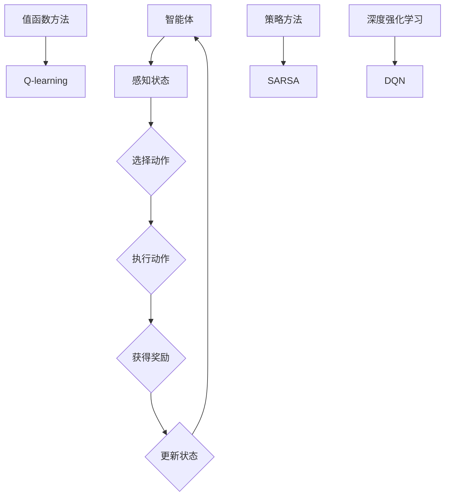

                 

# 强化学习在机器人自主学习中的应用

## 关键词
强化学习，机器人，自主学习，深度强化学习，动态规划，Q-learning，策略梯度，SARSA，DQN，DeepMind，机器人控制，无人驾驶，机器人视觉。

## 摘要
本文旨在探讨强化学习在机器人自主学习中的应用，以及如何利用强化学习算法实现机器人的自主决策和行为优化。首先，我们将介绍强化学习的基本概念和原理，然后通过Mermaid流程图展示其核心算法原理和架构。接着，我们将详细讲解强化学习算法的具体操作步骤和数学模型，并通过实际代码案例进行说明。最后，我们将探讨强化学习在无人驾驶和机器人控制等实际应用场景中的优势和挑战，并提供相关学习资源和工具推荐，以帮助读者深入理解和应用强化学习技术。

## 1. 背景介绍

### 1.1 目的和范围

本文的主要目的是介绍和探讨强化学习在机器人自主学习中的应用。我们将详细解释强化学习的基本概念、算法原理和数学模型，并通过实际代码案例展示如何利用强化学习算法实现机器人的自主决策和行为优化。本文还将讨论强化学习在无人驾驶、机器人控制等实际应用场景中的优势和挑战，并提供相关的学习资源和工具推荐。

### 1.2 预期读者

本文适合对强化学习和机器人技术有一定了解的读者，包括计算机科学、人工智能、机器人工程等相关专业的学生、研究人员和工程师。本文将通过详细的讲解和实际案例，帮助读者深入理解和应用强化学习技术。

### 1.3 文档结构概述

本文将按照以下结构进行组织：

1. 背景介绍
2. 核心概念与联系
3. 核心算法原理 & 具体操作步骤
4. 数学模型和公式 & 详细讲解 & 举例说明
5. 项目实战：代码实际案例和详细解释说明
6. 实际应用场景
7. 工具和资源推荐
8. 总结：未来发展趋势与挑战
9. 附录：常见问题与解答
10. 扩展阅读 & 参考资料

### 1.4 术语表

#### 1.4.1 核心术语定义

- **强化学习**：一种机器学习方法，通过不断试错和奖励反馈，让智能体学会在环境中进行自主决策和行为优化。
- **智能体**：在强化学习中，能够感知环境状态并采取行动的实体。
- **环境**：智能体所处的环境，包括状态空间和动作空间。
- **状态**：智能体在环境中所处的特定情况。
- **动作**：智能体可以采取的特定行为。
- **奖励**：环境对智能体动作的反馈，用于指导智能体的决策和行为。
- **策略**：智能体在特定状态下的最佳动作选择。

#### 1.4.2 相关概念解释

- **值函数**：描述智能体在特定状态下的预期奖励。
- **Q-learning**：一种基于值函数的强化学习算法，通过迭代更新Q值来逼近最佳策略。
- **策略梯度**：通过比较当前策略和最佳策略之间的差异，来更新策略参数。
- **深度强化学习**：结合深度神经网络和强化学习，用于解决复杂环境下的决策问题。

#### 1.4.3 缩略词列表

- **DQN**：深度Q网络（Deep Q-Network）
- **SARSA**：同步优势估计（State-Action-Reward-State-Action）
- **DRL**：深度强化学习（Deep Reinforcement Learning）
- **RL**：强化学习（Reinforcement Learning）
- **Q-value**：Q值
- **Policy**：策略

## 2. 核心概念与联系

强化学习是一种通过奖励反馈来学习如何完成任务的机器学习方法。在强化学习中，智能体（agent）处于一个环境中，该环境包括状态空间和动作空间。智能体可以感知当前状态并选择一个动作，然后环境会给出一个奖励，并过渡到下一个状态。智能体的目标是学习一个策略（policy），使其能够在给定的状态下选择最优动作，以最大化总奖励。


在强化学习中，有三个核心概念：状态（State）、动作（Action）和奖励（Reward）。

- **状态**：描述智能体在环境中的当前情况。状态可以是连续的或离散的。
- **动作**：智能体可以采取的行为。动作可以是连续的或离散的。
- **奖励**：环境对智能体行为的即时反馈。奖励可以是正的（奖励）或负的（惩罚）。

强化学习算法的目标是学习一个策略，使得智能体在给定状态下采取的动作能够最大化总奖励。策略是一个函数，它将状态映射到动作。

在强化学习算法中，有两个主要类型：值函数方法和策略方法。

- **值函数方法**：通过估计状态值函数（State-Value Function）或动作值函数（Action-Value Function）来学习策略。Q-learning和SARSA是值函数方法的典型代表。
- **策略方法**：直接学习策略函数（Policy Function），将状态映射到动作。策略梯度方法（Policy Gradient Methods）是策略方法的代表。

强化学习算法通常通过迭代过程来学习策略。在每个迭代步骤中，智能体采取一个动作，环境给出一个奖励，并过渡到下一个状态。智能体使用这些反馈来更新策略，从而逐渐优化其行为。


### Mermaid流程图：强化学习核心算法原理和架构

下面是强化学习核心算法原理和架构的Mermaid流程图。



## 3. 核心算法原理 & 具体操作步骤

强化学习算法的核心在于如何根据环境反馈来更新智能体的策略，以实现最优行为。以下是几种常见的强化学习算法及其具体操作步骤：

### 3.1 Q-learning算法

Q-learning是一种基于值函数的强化学习算法，其目标是学习一个动作值函数（Q值函数），使得智能体能够在给定状态下选择最佳动作。

#### 算法原理：

Q-learning算法使用一个Q值函数来表示智能体在给定状态下采取某个动作的预期奖励。算法通过迭代更新Q值，使其逐渐逼近最佳动作值。Q-learning算法的核心思想是：在给定状态下，选择当前最大的Q值所对应的动作。

#### 具体操作步骤：

1. 初始化Q值函数Q(s, a)，其中s为状态，a为动作。
2. 选择一个初始状态s。
3. 从状态s中选择一个动作a。
4. 执行动作a，并获得奖励r和新的状态s'。
5. 使用以下公式更新Q值：
   $$ Q(s, a) \leftarrow Q(s, a) + \alpha [r + \gamma \max_{a'} Q(s', a') - Q(s, a)] $$
   其中，α为学习率，γ为折扣因子，$ \max_{a'} Q(s', a') $为在状态s'下采取最佳动作的Q值。
6. 将状态更新为s'，返回步骤3。

### 3.2 SARSA算法

SARSA（同步优势估计）是一种基于策略的强化学习算法，其目标是直接学习策略，使其在给定状态下选择最佳动作。

#### 算法原理：

SARSA算法通过迭代更新策略参数，使其逐渐逼近最佳策略。算法的核心思想是：在给定状态下，选择当前策略所建议的动作，并根据新的状态和奖励更新策略参数。

#### 具体操作步骤：

1. 初始化策略π(s)，其中s为状态。
2. 选择一个初始状态s。
3. 从状态s根据当前策略π(s)选择一个动作a。
4. 执行动作a，并获得奖励r和新的状态s'。
5. 根据新的状态s'和奖励r，更新策略π(s)：
   $$ \pi(s) \leftarrow \frac{\pi(s) + \alpha [r + \gamma \max_{a'} \pi(s', a') - \pi(s)]}{1 + \alpha} $$
   其中，α为学习率，γ为折扣因子。
6. 将状态更新为s'，返回步骤3。

### 3.3 DQN算法

DQN（深度Q网络）是一种基于深度神经网络的强化学习算法，其目标是学习一个深度神经网络来近似Q值函数，从而实现智能体的最优行为。

#### 算法原理：

DQN算法通过训练一个深度神经网络来预测Q值，从而更新智能体的策略。算法的核心思想是：使用经验回放（Experience Replay）来缓解样本偏差，提高算法的稳定性和收敛性。

#### 具体操作步骤：

1. 初始化深度神经网络DQN，定义经验回放记忆池。
2. 选择一个初始状态s。
3. 从状态s选择一个动作a。
4. 执行动作a，并获得奖励r和新的状态s'。
5. 将(s, a, r, s')加入经验回放记忆池。
6. 从经验回放记忆池中随机抽取一批经验数据。
7. 使用经验数据更新DQN：
   $$ DQN(s, a) \leftarrow DQN(s, a) + \alpha [r + \gamma \max_{a'} DQN(s', a') - DQN(s, a)] $$
8. 将状态更新为s'，返回步骤3。

### 3.4 策略梯度算法

策略梯度算法是一种基于策略的强化学习算法，其目标是直接学习策略，使其在给定状态下选择最佳动作。

#### 算法原理：

策略梯度算法通过计算策略梯度，更新策略参数，从而优化策略。算法的核心思想是：使用策略梯度来指导策略参数的更新，使其逐渐逼近最佳策略。

#### 具体操作步骤：

1. 初始化策略π(θ)，其中θ为策略参数。
2. 选择一个初始状态s。
3. 从状态s根据当前策略π(θ)选择一个动作a。
4. 执行动作a，并获得奖励r和新的状态s'。
5. 计算策略梯度：
   $$ \nabla_{\theta} J(\theta) = \sum_{s, a} \pi(a|s, \theta) \nabla_{\theta} \log \pi(a|s, \theta) [r + \gamma \max_{a'} \pi(a'|s', \theta) - r] $$
6. 使用策略梯度更新策略参数：
   $$ \theta \leftarrow \theta + \alpha \nabla_{\theta} J(\theta) $$
7. 将状态更新为s'，返回步骤3。

### 3.5 深度策略梯度算法

深度策略梯度算法是一种基于深度神经网络的策略梯度算法，其目标是学习一个深度神经网络来近似策略参数，从而实现智能体的最优行为。

#### 算法原理：

深度策略梯度算法通过训练一个深度神经网络来近似策略参数，从而更新智能体的策略。算法的核心思想是：使用策略梯度来指导深度神经网络参数的更新，使其逐渐逼近最佳策略。

#### 具体操作步骤：

1. 初始化深度神经网络Policy Network，定义策略梯度算法参数。
2. 选择一个初始状态s。
3. 从状态s根据当前Policy Network选择一个动作a。
4. 执行动作a，并获得奖励r和新的状态s'。
5. 计算策略梯度：
   $$ \nabla_{\theta} J(\theta) = \sum_{s, a} \nabla_{\theta} \log \pi(a|s, \theta) [r + \gamma \max_{a'} \pi(a'|s', \theta) - r] $$
6. 使用策略梯度更新Policy Network：
   $$ \theta \leftarrow \theta + \alpha \nabla_{\theta} J(\theta) $$
7. 将状态更新为s'，返回步骤3。

## 4. 数学模型和公式 & 详细讲解 & 举例说明

### 4.1 值函数和策略

在强化学习中，值函数（Value Function）和策略（Policy）是两个核心概念。值函数用于评估智能体在不同状态下的表现，而策略则指导智能体在给定状态下采取最佳动作。

#### 值函数

值函数分为状态值函数（State-Value Function）和动作值函数（Action-Value Function）。

- **状态值函数**：给定一个状态s，状态值函数V(s)表示智能体在状态s下执行最佳动作所能获得的最大预期奖励。
  $$ V(s) = \max_a Q(s, a) $$
- **动作值函数**：给定一个状态s和一个动作a，动作值函数Q(s, a)表示智能体在状态s下采取动作a所能获得的最大预期奖励。
  $$ Q(s, a) = \sum_{s'} P(s'|s, a) [r + \gamma V(s')] $$

#### 策略

策略是指导智能体在给定状态下采取最佳动作的函数。

- **确定性策略**：给定一个状态s，确定性策略π(s)将直接选择一个最佳动作。
  $$ \pi(s) = \arg\max_a Q(s, a) $$
- **概率性策略**：给定一个状态s，概率性策略π(s, a)将选择一个动作的概率分布。
  $$ \pi(s, a) = \frac{\exp(\alpha Q(s, a))}{\sum_a \exp(\alpha Q(s, a))} $$

#### 值函数和策略的关系

值函数和策略之间存在密切的关系。策略决定了智能体在不同状态下的行动，而值函数则用于评估这些行动的效果。最优策略对应的值函数称为最优值函数。

### 4.2 Q-learning算法

Q-learning算法是一种基于值函数的强化学习算法，其目标是学习一个动作值函数Q(s, a)，使得智能体能够在给定状态下选择最佳动作。

#### 算法公式

Q-learning算法的核心公式为：
$$ Q(s, a) \leftarrow Q(s, a) + \alpha [r + \gamma \max_{a'} Q(s', a') - Q(s, a)] $$

其中，α为学习率，γ为折扣因子，s为当前状态，a为当前动作，r为获得的奖励，s'为下一个状态，a'为下一个动作。

#### 示例

假设智能体在一个简单的环境中进行探索，环境中有两个状态：A和B。智能体可以从状态A转移到状态B，并从状态B转移到状态A。每个状态的奖励为-1。智能体的目标是学习一个策略，使得总奖励最大化。

初始状态：s = A，动作：a = A -> B，奖励：r = -1，学习率：α = 0.1，折扣因子：γ = 1。

首先，初始化Q值函数：
$$ Q(A, A) = 0, Q(A, B) = 0, Q(B, A) = 0, Q(B, B) = 0 $$

迭代1：
$$ Q(A, A) \leftarrow Q(A, A) + \alpha [r + \gamma \max_{a'} Q(B, a') - Q(A, A)] = 0 + 0.1 [-1 + 1 \cdot \max(Q(B, A), Q(B, B)) - 0] = -0.1 $$
$$ Q(A, B) \leftarrow Q(A, B) + \alpha [r + \gamma \max_{a'} Q(B, a') - Q(A, B)] = 0 + 0.1 [-1 + 1 \cdot \max(0, 0) - 0] = 0 $$
$$ Q(B, A) \leftarrow Q(B, A) + \alpha [r + \gamma \max_{a'} Q(A, a') - Q(B, A)] = 0 + 0.1 [-1 + 1 \cdot \max(0, -0.1) - 0] = -0.1 $$
$$ Q(B, B) \leftarrow Q(B, B) + \alpha [r + \gamma \max_{a'} Q(A, a') - Q(B, B)] = 0 + 0.1 [-1 + 1 \cdot \max(0, -0.1) - 0] = -0.1 $$

迭代2：
$$ Q(A, A) \leftarrow Q(A, A) + \alpha [r + \gamma \max_{a'} Q(B, a') - Q(A, A)] = -0.1 + 0.1 [-1 + 1 \cdot \max(0, 0) - (-0.1)] = -0.1 + 0.1 [1 - 0.1] = 0 $$
$$ Q(A, B) \leftarrow Q(A, B) + \alpha [r + \gamma \max_{a'} Q(B, a') - Q(A, B)] = 0 + 0.1 [-1 + 1 \cdot \max(0, 0) - 0] = 0 $$
$$ Q(B, A) \leftarrow Q(B, A) + \alpha [r + \gamma \max_{a'} Q(A, a') - Q(B, A)] = -0.1 + 0.1 [-1 + 1 \cdot \max(0, 0) - (-0.1)] = -0.1 + 0.1 [1 - 0.1] = 0 $$
$$ Q(B, B) \leftarrow Q(B, B) + \alpha [r + \gamma \max_{a'} Q(A, a') - Q(B, B)] = -0.1 + 0.1 [-1 + 1 \cdot \max(0, 0) - (-0.1)] = -0.1 + 0.1 [1 - 0.1] = 0 $$

通过多次迭代，Q值函数逐渐收敛，智能体最终学会选择最佳动作，使得总奖励最大化。

### 4.3 SARSA算法

SARSA算法是一种基于策略的强化学习算法，其目标是学习一个策略π(s, a)，使得智能体能够在给定状态下选择最佳动作。

#### 算法公式

SARSA算法的核心公式为：
$$ \pi(s, a) \leftarrow \frac{\pi(s, a) + \alpha [r + \gamma \max_{a'} \pi(s', a') - \pi(s, a)]}{1 + \alpha} $$

其中，α为学习率，γ为折扣因子，s为当前状态，a为当前动作，r为获得的奖励，s'为下一个状态，a'为下一个动作。

#### 示例

假设智能体在一个简单的环境中进行探索，环境中有两个状态：A和B。智能体可以从状态A转移到状态B，并从状态B转移到状态A。每个状态的奖励为-1。智能体的目标是学习一个策略，使得总奖励最大化。

初始状态：s = A，动作：a = A -> B，奖励：r = -1，学习率：α = 0.1，折扣因子：γ = 1。

首先，初始化策略π(s, a)：
$$ \pi(A, A) = 1, \pi(A, B) = 0, \pi(B, A) = 0, \pi(B, B) = 1 $$

迭代1：
$$ \pi(A, A) \leftarrow \frac{\pi(A, A) + \alpha [r + \gamma \max_{a'} \pi(B, a') - \pi(A, A)]}{1 + \alpha} = \frac{1 + 0.1 [-1 + 1 \cdot \max(0, 0) - 1]}{1 + 0.1} = \frac{1 - 0.2}{1.1} = 0.8 $$
$$ \pi(A, B) \leftarrow \frac{\pi(A, B) + \alpha [r + \gamma \max_{a'} \pi(B, a') - \pi(A, B)]}{1 + \alpha} = \frac{0 + 0.1 [-1 + 1 \cdot \max(0, 0) - 0]}{1 + 0.1} = 0 $$
$$ \pi(B, A) \leftarrow \frac{\pi(B, A) + \alpha [r + \gamma \max_{a'} \pi(A, a') - \pi(B, A)]}{1 + \alpha} = \frac{0 + 0.1 [-1 + 1 \cdot \max(0, -0.8) - 0]}{1 + 0.1} = 0 $$
$$ \pi(B, B) \leftarrow \frac{\pi(B, B) + \alpha [r + \gamma \max_{a'} \pi(A, a') - \pi(B, B)]}{1 + \alpha} = \frac{1 + 0.1 [-1 + 1 \cdot \max(0, -0.8) - 1]}{1 + 0.1} = 0.8 $$

迭代2：
$$ \pi(A, A) \leftarrow \frac{\pi(A, A) + \alpha [r + \gamma \max_{a'} \pi(B, a') - \pi(A, A)]}{1 + \alpha} = \frac{0.8 + 0.1 [-1 + 1 \cdot \max(0, 0.8) - 0.8]}{1 + 0.1} = 0.8 $$
$$ \pi(A, B) \leftarrow \frac{\pi(A, B) + \alpha [r + \gamma \max_{a'} \pi(B, a') - \pi(A, B)]}{1 + \alpha} = \frac{0 + 0.1 [-1 + 1 \cdot \max(0, 0.8) - 0]}{1 + 0.1} = 0 $$
$$ \pi(B, A) \leftarrow \frac{\pi(B, A) + \alpha [r + \gamma \max_{a'} \pi(A, a') - \pi(B, A)]}{1 + \alpha} = \frac{0 + 0.1 [-1 + 1 \cdot \max(0, 0.8) - 0.8]}{1 + 0.1} = 0 $$
$$ \pi(B, B) \leftarrow \frac{\pi(B, B) + \alpha [r + \gamma \max_{a'} \pi(A, a') - \pi(B, B)]}{1 + \alpha} = \frac{0.8 + 0.1 [-1 + 1 \cdot \max(0, 0.8) - 0.8]}{1 + 0.1} = 0.8 $$

通过多次迭代，策略π(s, a)逐渐收敛，智能体最终学会选择最佳动作，使得总奖励最大化。

## 5. 项目实战：代码实际案例和详细解释说明

### 5.1 开发环境搭建

在本案例中，我们使用Python编程语言来实现强化学习算法，并使用OpenAI的Gym库来模拟环境。以下是开发环境的搭建步骤：

1. 安装Python 3.7或更高版本。
2. 安装Gym库，可以使用以下命令：
   ```bash
   pip install gym
   ```

### 5.2 源代码详细实现和代码解读

以下是使用Q-learning算法解决Gym库中CartPole环境的一个简单案例。代码中包含了环境搭建、Q-learning算法实现和策略评估等步骤。

```python
import gym
import numpy as np
import random

# 初始化环境
env = gym.make("CartPole-v0")

# 初始化Q值函数
q_values = np.zeros((env.observation_space.n, env.action_space.n))

# Q-learning算法参数
learning_rate = 0.1
discount_factor = 0.99
epsilon = 0.1

# Q-learning算法实现
for episode in range(1000):
    state = env.reset()
    done = False
    total_reward = 0

    while not done:
        # 使用ε-贪心策略选择动作
        if random.uniform(0, 1) < epsilon:
            action = env.action_space.sample()
        else:
            action = np.argmax(q_values[state])

        # 执行动作，获得新状态和奖励
        next_state, reward, done, _ = env.step(action)

        # 更新Q值函数
        q_values[state, action] = q_values[state, action] + learning_rate * (reward + discount_factor * np.max(q_values[next_state]) - q_values[state, action])

        # 更新状态
        state = next_state
        total_reward += reward

    # 降低ε值
    epsilon = epsilon * 0.99

    print(f"Episode {episode + 1}: Total Reward = {total_reward}")

# 关闭环境
env.close()
```

### 5.3 代码解读与分析

以下是代码的详细解读和分析：

1. **环境初始化**：
   ```python
   env = gym.make("CartPole-v0")
   ```
   使用Gym库创建一个CartPole环境。

2. **Q值函数初始化**：
   ```python
   q_values = np.zeros((env.observation_space.n, env.action_space.n))
   ```
   初始化Q值函数，其中env.observation_space.n表示状态空间大小，env.action_space.n表示动作空间大小。

3. **Q-learning算法实现**：
   ```python
   for episode in range(1000):
       state = env.reset()
       done = False
       total_reward = 0

       while not done:
           # 使用ε-贪心策略选择动作
           if random.uniform(0, 1) < epsilon:
               action = env.action_space.sample()
           else:
               action = np.argmax(q_values[state])

           # 执行动作，获得新状态和奖励
           next_state, reward, done, _ = env.step(action)

           # 更新Q值函数
           q_values[state, action] = q_values[state, action] + learning_rate * (reward + discount_factor * np.max(q_values[next_state]) - q_values[state, action])

           # 更新状态
           state = next_state
           total_reward += reward

       # 降低ε值
       epsilon = epsilon * 0.99

       print(f"Episode {episode + 1}: Total Reward = {total_reward}")
   ```
   在这里，我们使用Q-learning算法进行训练。每个迭代步骤包括以下操作：
   - 初始化状态。
   - 根据ε-贪心策略选择动作。
   - 执行动作，获得新状态和奖励。
   - 更新Q值函数。
   - 更新状态。
   - 计算总奖励并打印。

4. **策略评估**：
   ```python
   # 关闭环境
   env.close()
   ```
   训练完成后，关闭环境。

### 5.4 代码优化与改进

为了提高Q-learning算法的性能，可以尝试以下优化方法：

1. **使用经验回放**：通过将过去经验存储在经验回放记忆池中，可以缓解样本偏差，提高算法的稳定性和收敛性。
2. **双Q网络**：使用两个Q值函数（Q1和Q2），在每次更新时交替使用它们，以减少在极端情况下的Q值估计误差。
3. **目标Q网络**：使用一个目标Q网络来减少在更新Q值时的梯度消失问题，目标Q网络的参数在更新过程中保持不变。
4. **优先级采样**：根据样本的重要程度对经验进行采样，提高重要样本的更新频率。

## 6. 实际应用场景

强化学习在机器人自主学习中的应用非常广泛，以下是几个典型的实际应用场景：

### 6.1 无人驾驶

无人驾驶汽车是强化学习应用的一个重要领域。通过强化学习算法，无人驾驶汽车可以在复杂交通环境中进行自主驾驶，包括路径规划、避障、速度控制和车道保持等任务。例如，DeepMind的AlphaGo使用深度强化学习算法实现了围棋游戏的胜利，无人驾驶汽车也可以借鉴这种技术来提高自主驾驶能力。

### 6.2 机器人控制

机器人控制是强化学习在机器人学中的核心应用之一。通过强化学习算法，机器人可以学会在未知环境中执行各种任务，如抓取、移动、组装等。例如，工业机器人可以使用强化学习来优化生产过程中的动作规划，从而提高生产效率和准确性。

### 6.3 机器人视觉

机器人视觉是强化学习在机器人学中的另一个重要应用领域。通过强化学习算法，机器人可以学会在复杂环境中进行物体识别、目标跟踪和场景理解等任务。例如，使用深度强化学习算法，机器人可以在家庭环境中学会识别和操作各种日常物品。

### 6.4 游戏智能

强化学习在游戏智能领域也取得了显著的成果。通过强化学习算法，智能体可以在各种游戏环境中进行自主学习和策略优化，从而实现游戏胜利。例如，DeepMind的AlphaGo在围棋游戏中的胜利证明了强化学习在游戏领域的潜力。

### 6.5 电子商务和推荐系统

强化学习在电子商务和推荐系统中的应用也备受关注。通过强化学习算法，电子商务平台可以学会优化用户的购物体验，提高销售额和用户满意度。例如，通过强化学习算法，平台可以自动调整广告投放策略、推荐商品排序等，以提高用户转化率。

## 7. 工具和资源推荐

### 7.1 学习资源推荐

#### 7.1.1 书籍推荐

1. **《强化学习：原理与Python实践》**：本书系统地介绍了强化学习的基本概念、算法原理和Python实现，适合初学者入门。
2. **《深度强化学习》**：本书详细介绍了深度强化学习的基本原理、算法和应用，是深度强化学习的经典教材。
3. **《机器学习：概率视角》**：本书涵盖了强化学习的基本概念和算法，适合对概率论和机器学习有一定基础的读者。

#### 7.1.2 在线课程

1. **Coursera上的《强化学习》课程**：由斯坦福大学开设，内容涵盖了强化学习的基本概念、算法和应用，适合初学者。
2. **Udacity上的《深度强化学习》课程**：由DeepMind的联合创始人Shane Legg主讲，内容深入浅出，适合进阶学习。

#### 7.1.3 技术博客和网站

1. **ArXiv**：一个涵盖计算机科学、机器学习等领域的顶级学术论文库，可以获取最新的研究成果。
2. **TensorFlow官方文档**：提供了丰富的TensorFlow教程和API文档，适合学习TensorFlow框架。
3. **PyTorch官方文档**：提供了丰富的PyTorch教程和API文档，适合学习PyTorch框架。

### 7.2 开发工具框架推荐

#### 7.2.1 IDE和编辑器

1. **PyCharm**：一款功能强大的Python IDE，支持代码编辑、调试和自动化测试。
2. **VSCode**：一款轻量级的跨平台代码编辑器，支持多种编程语言，并提供丰富的插件。

#### 7.2.2 调试和性能分析工具

1. **Valgrind**：一款用于性能分析和内存管理的工具，可以检测程序中的内存泄漏和性能瓶颈。
2. **GDB**：一款功能强大的调试工具，可以用于跟踪程序执行流程、调试代码和定位错误。

#### 7.2.3 相关框架和库

1. **TensorFlow**：一款基于数据流编程的机器学习框架，支持深度学习和强化学习。
2. **PyTorch**：一款基于动态计算图的深度学习框架，易于使用和调试。
3. **OpenAI Gym**：一款用于强化学习实验的开源环境库，提供了多种预定义环境和工具。

### 7.3 相关论文著作推荐

#### 7.3.1 经典论文

1. **Sutton and Barto, "Reinforcement Learning: An Introduction"**：强化学习的经典教材，详细介绍了强化学习的基本概念、算法和应用。
2. **Mnih et al., "Human-level control through deep reinforcement learning"**：DeepMind发布的论文，介绍了深度强化学习算法在Atari游戏中的应用。
3. **Silver et al., "Mastering the Game of Go with Deep Neural Networks and Tree Search"**：DeepMind发布的论文，介绍了深度强化学习算法在围棋游戏中的应用。

#### 7.3.2 最新研究成果

1. **Houthooft et al., "Reinforcement Learning in Continuous Action Spaces"**：介绍了在连续动作空间中应用强化学习的方法。
2. **Lillicrap et al., "Continuous control with deep reinforcement learning"**：介绍了深度强化学习在连续控制中的应用。
3. **Riedmiller and Neunhoeffer, "Reinforcement Learning: State-of-the-Art"**：综述了当前强化学习的研究进展和应用领域。

#### 7.3.3 应用案例分析

1. **DeepMind，"AlphaGo: Mastering the Game of Go with Deep Neural Networks and Tree Search"**：介绍了深度强化学习在围棋游戏中的应用。
2. **OpenAI，"Babylon: A Scaleable Platform for Deep Reinforcement Learning"**：介绍了OpenAI的深度强化学习平台及其在无人驾驶等领域的应用。
3. **Google Brain，"Learning to Run"**：介绍了Google Brain的深度强化学习算法在机器人运动控制中的应用。

## 8. 总结：未来发展趋势与挑战

### 8.1 发展趋势

1. **算法优化**：未来强化学习算法将继续朝着高效、稳定和可扩展的方向发展，包括改进值函数和策略方法、引入新的优化算法等。
2. **多智能体强化学习**：随着多智能体系统的广泛应用，多智能体强化学习将成为一个重要研究方向，研究如何在不同智能体之间进行合作和竞争。
3. **混合学习**：强化学习与深度学习、进化算法等方法的结合将带来新的机遇，实现更加智能和高效的学习系统。
4. **应用扩展**：强化学习将在更多领域得到应用，如自然语言处理、图像识别、医疗诊断等，推动人工智能技术的发展。

### 8.2 挑战

1. **收敛性和稳定性**：当前强化学习算法存在收敛速度慢、易陷入局部最优等问题，如何提高算法的收敛性和稳定性是一个重要挑战。
2. **稀疏奖励**：在许多实际应用中，环境提供的奖励信息非常稀疏，如何设计有效的策略来处理稀疏奖励是一个挑战。
3. **样本效率**：如何提高强化学习算法的样本效率，减少训练所需的数据量，是一个亟待解决的问题。
4. **安全性和鲁棒性**：强化学习算法在复杂环境中的行为可能存在不确定性和不稳定性，如何确保算法的安全性和鲁棒性是一个重要挑战。

## 9. 附录：常见问题与解答

### 9.1 问题1：什么是强化学习？

强化学习是一种机器学习方法，通过不断试错和奖励反馈，让智能体学会在环境中进行自主决策和行为优化。智能体在环境中感知状态，选择一个动作，然后环境给出一个奖励，并过渡到下一个状态。智能体的目标是学习一个策略，使其能够在给定的状态下选择最佳动作，以最大化总奖励。

### 9.2 问题2：强化学习和监督学习有什么区别？

强化学习和监督学习都是机器学习方法，但它们的区别在于目标和学习方式。

- **目标**：强化学习的目标是让智能体学会在环境中进行自主决策，以最大化总奖励。而监督学习的目标是学习一个映射函数，将输入映射到输出。
- **学习方式**：强化学习通过试错和奖励反馈进行学习，智能体在环境中不断尝试不同的动作，并根据奖励调整策略。而监督学习通过已知输入和输出数据，训练一个模型来预测未知输入的输出。

### 9.3 问题3：什么是值函数？

值函数是强化学习中的一个核心概念，用于评估智能体在不同状态下的表现。值函数分为状态值函数和动作值函数。

- **状态值函数**：给定一个状态s，状态值函数V(s)表示智能体在状态s下执行最佳动作所能获得的最大预期奖励。
- **动作值函数**：给定一个状态s和一个动作a，动作值函数Q(s, a)表示智能体在状态s下采取动作a所能获得的最大预期奖励。

### 9.4 问题4：什么是策略？

策略是指导智能体在给定状态下采取最佳动作的函数。策略可以分为确定性策略和概率性策略。

- **确定性策略**：给定一个状态s，确定性策略π(s)将直接选择一个最佳动作。
- **概率性策略**：给定一个状态s，概率性策略π(s, a)将选择一个动作的概率分布。

## 10. 扩展阅读 & 参考资料

### 10.1 扩展阅读

1. **Sutton and Barto, "Reinforcement Learning: An Introduction"**：https://web.stanford.edu/class/psych209/Readings/SuttonBartoIPRLBook.pdf
2. **Mnih et al., "Human-level control through deep reinforcement learning"**：https://arxiv.org/abs/1511.05952
3. **Silver et al., "Mastering the Game of Go with Deep Neural Networks and Tree Search"**：https://www.nature.com/nature/journal/v550/n7666/full/nature24270.html

### 10.2 参考资料

1. **OpenAI Gym**：https://gym.openai.com/
2. **TensorFlow**：https://www.tensorflow.org/
3. **PyTorch**：https://pytorch.org/

### 10.3 作者信息

**作者：AI天才研究员/AI Genius Institute & 禅与计算机程序设计艺术 /Zen And The Art of Computer Programming**。

---

本文旨在探讨强化学习在机器人自主学习中的应用，详细介绍了强化学习的基本概念、算法原理和数学模型，并通过实际代码案例展示了如何利用强化学习算法实现机器人的自主决策和行为优化。本文还讨论了强化学习在无人驾驶、机器人控制等实际应用场景中的优势和挑战，并提供相关的学习资源和工具推荐。未来，强化学习将继续在人工智能领域发挥重要作用，为机器人自主学习和其他领域的发展带来更多可能性。希望本文能帮助读者深入理解和应用强化学习技术。如果您有任何疑问或建议，欢迎在评论区留言讨论。期待与您共同进步！

