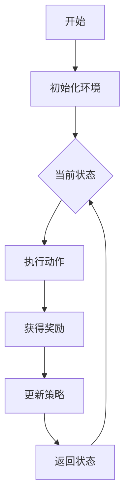

                 

# 强化学习在机器人自主学习中的突破

> 关键词：强化学习、机器人学习、自主控制、智能系统、算法原理、应用案例

> 摘要：本文深入探讨了强化学习在机器人自主学习中的应用。通过分析强化学习的基本原理和算法，详细阐述了如何利用强化学习算法实现机器人的自主控制。文章结合实际案例，分析了强化学习算法在机器人学习中的应用现状和未来发展趋势。

## 1. 背景介绍

### 1.1 目的和范围

本文旨在介绍强化学习在机器人自主学习中的应用，分析其核心原理和算法，并探讨其在实际应用中的挑战和前景。文章将涵盖以下内容：

- 强化学习的基本概念和原理
- 强化学习在机器人学习中的应用场景
- 强化学习算法的实现和优化
- 强化学习在机器人自主学习中的实际案例

### 1.2 预期读者

本文面向具有一定人工智能基础知识的读者，包括：

- 计算机科学和人工智能领域的研究人员
- 机器人工程师和软件开发者
- 对人工智能和机器人技术感兴趣的技术爱好者

### 1.3 文档结构概述

本文结构如下：

- 第1章：背景介绍，包括目的、预期读者和文档结构概述
- 第2章：核心概念与联系，介绍强化学习的基本概念和原理
- 第3章：核心算法原理 & 具体操作步骤，详细阐述强化学习算法的实现过程
- 第4章：数学模型和公式 & 详细讲解 & 举例说明，介绍强化学习中的数学模型和公式
- 第5章：项目实战：代码实际案例和详细解释说明，通过实际案例展示强化学习在机器人学习中的应用
- 第6章：实际应用场景，分析强化学习在机器人学习中的实际应用
- 第7章：工具和资源推荐，介绍学习资源和开发工具
- 第8章：总结：未来发展趋势与挑战，展望强化学习在机器人学习中的未来
- 第9章：附录：常见问题与解答，提供常见问题的解答
- 第10章：扩展阅读 & 参考资料，提供进一步学习的资源

### 1.4 术语表

#### 1.4.1 核心术语定义

- 强化学习：一种机器学习方法，通过试错和反馈来优化决策过程。
- 机器人：一种能够自主执行任务的智能设备，通常具备感知、决策和执行能力。
- 自主学习：机器人在没有明确指令的情况下，通过自身感知和经验积累，实现自我学习和适应的能力。
- 策略：强化学习中的一个重要概念，用于指导机器人在特定环境下做出决策。

#### 1.4.2 相关概念解释

- 奖励信号：在强化学习中，用于表示环境对机器人行为的反馈，可以是正奖励或负奖励。
- 状态：强化学习中的一个状态表示机器人当前所处的环境。
- 动作：机器人执行的行为，用于改变当前状态。
- 策略网络：在深度强化学习中，用于预测最佳动作的网络结构。
- 值函数：在强化学习中，用于评估当前状态的值。

#### 1.4.3 缩略词列表

- RL：强化学习（Reinforcement Learning）
- DRL：深度强化学习（Deep Reinforcement Learning）
- Q-learning：一种基于值函数的强化学习算法
- SARSA：一种基于策略的强化学习算法
- DQN：深度Q网络（Deep Q-Network）

## 2. 核心概念与联系

强化学习是一种机器学习方法，其核心思想是通过试错和反馈来优化决策过程。在强化学习中，机器人通过与环境的交互，不断学习并优化自己的策略，以达到最优的决策。

下面是一个简化的强化学习流程图：



### 2.1 强化学习的基本概念

#### 状态（State）

状态是强化学习中的一个基本概念，表示机器人当前所处的环境。状态可以是离散的，也可以是连续的。在状态空间中，每个状态都可以用一组特征向量来表示。

#### 动作（Action）

动作是机器人执行的行为，用于改变当前状态。动作空间可以是离散的，也可以是连续的。在动作空间中，每个动作都可以用一组参数来表示。

#### 策略（Policy）

策略是强化学习中的一个重要概念，用于指导机器人在特定环境下做出决策。策略可以是显式的，如规则或概率分布，也可以是隐式的，如神经网络。

#### 奖励（Reward）

奖励是环境对机器人行为的反馈，用于评估动作的效果。奖励可以是正奖励或负奖励，表示对机器人行为的鼓励或惩罚。

#### 策略评估（Policy Evaluation）

策略评估是指评估当前策略的优劣。在策略评估过程中，通过计算策略的期望回报，来评估策略的好坏。

#### 策略迭代（Policy Iteration）

策略迭代是一种改进策略的方法，通过反复评估和优化策略，来达到最优的决策。

### 2.2 强化学习的算法

强化学习算法可以分为值函数方法和策略方法。值函数方法通过评估状态值或动作值，来指导机器人的决策；策略方法则直接优化策略，使其达到最优。

#### 值函数方法

值函数方法主要包括Q-learning和SARSA算法。

- Q-learning：Q-learning是一种基于值函数的强化学习算法，通过迭代更新Q值，来优化策略。
- SARSA：SARSA是一种基于策略的强化学习算法，通过迭代更新策略，来优化动作。

#### 策略方法

策略方法主要包括REINFORCE和策略梯度算法。

- REINFORCE：REINFORCE是一种基于梯度的策略优化方法，通过更新策略参数，来优化策略。
- 策略梯度：策略梯度是一种基于梯度的策略优化方法，通过计算策略梯度和期望回报，来优化策略。

### 2.3 强化学习与深度学习的结合

深度强化学习（DRL）是强化学习与深度学习的结合，通过引入深度神经网络，来处理复杂的特征和状态空间。

- 深度Q网络（DQN）：DQN是一种基于深度神经网络的Q-learning算法，通过训练深度神经网络，来预测状态值。
- 深度策略网络（DPN）：DPN是一种基于深度神经网络的策略方法，通过训练深度神经网络，来预测最佳动作。

## 3. 核心算法原理 & 具体操作步骤

### 3.1 Q-learning算法原理

Q-learning是一种基于值函数的强化学习算法，通过迭代更新Q值，来优化策略。

算法原理如下：

1. 初始化Q值表，将其初始化为所有状态动作对的初始值。
2. 选择动作，根据当前状态和策略，选择动作。
3. 执行动作，执行选择的动作，并观察环境的反馈。
4. 更新Q值，根据奖励信号和策略，更新Q值。
5. 返回状态，将当前状态作为下一次迭代的初始状态。

伪代码如下：

```python
# 初始化Q值表
Q = initialize_Q_values()

# 迭代更新Q值
for episode in range(num_episodes):
    state = environment.reset()
    done = False
    
    while not done:
        # 选择动作
        action = choose_action(state, Q)
        
        # 执行动作
        next_state, reward, done = environment.step(action)
        
        # 更新Q值
        Q[state, action] = Q[state, action] + alpha * (reward + gamma * max(Q[next_state, :]) - Q[state, action])
        
        # 返回状态
        state = next_state
```

### 3.2 SARSA算法原理

SARSA是一种基于策略的强化学习算法，通过迭代更新策略，来优化动作。

算法原理如下：

1. 初始化策略，将其初始化为随机策略。
2. 选择动作，根据当前状态和策略，选择动作。
3. 执行动作，执行选择的动作，并观察环境的反馈。
4. 更新策略，根据奖励信号和策略，更新策略。
5. 返回状态，将当前状态作为下一次迭代的初始状态。

伪代码如下：

```python
# 初始化策略
policy = initialize_policy()

# 迭代更新策略
for episode in range(num_episodes):
    state = environment.reset()
    done = False
    
    while not done:
        # 选择动作
        action = choose_action(state, policy)
        
        # 执行动作
        next_state, reward, done = environment.step(action)
        
        # 更新策略
        policy[state] = (1 - epsilon) * policy[state] + epsilon * one_hot(action)
        
        # 返回状态
        state = next_state
```

### 3.3 DQN算法原理

DQN是一种基于深度神经网络的Q-learning算法，通过训练深度神经网络，来预测状态值。

算法原理如下：

1. 初始化深度神经网络，将其初始化为随机权重。
2. 选择动作，根据当前状态和深度神经网络，选择动作。
3. 执行动作，执行选择的动作，并观察环境的反馈。
4. 更新深度神经网络，根据奖励信号和目标Q值，更新深度神经网络。
5. 返回状态，将当前状态作为下一次迭代的初始状态。

伪代码如下：

```python
# 初始化深度神经网络
Q_network = initialize_Q_network()

# 迭代更新深度神经网络
for episode in range(num_episodes):
    state = environment.reset()
    done = False
    
    while not done:
        # 选择动作
        action = choose_action(state, Q_network)
        
        # 执行动作
        next_state, reward, done = environment.step(action)
        
        # 计算目标Q值
        target_Q = reward + gamma * max(Q_network(next_state))
        
        # 更新深度神经网络
        Q_network(state, action) = Q_network(state, action) + alpha * (target_Q - Q_network(state, action))
        
        # 返回状态
        state = next_state
```

## 4. 数学模型和公式 & 详细讲解 & 举例说明

### 4.1 强化学习的基本数学模型

强化学习中的数学模型主要包括状态值函数、动作值函数和策略。以下是这些数学模型的详细解释和公式。

#### 状态值函数（State-Value Function）

状态值函数是评估状态好坏的一种度量。在给定策略π的情况下，状态值函数V(s)表示从状态s开始，按照策略π执行动作，获得的总奖励。

$$ V(s) = \sum_{a} \pi(a|s) \cdot R(s, a) + \sum_{s'} p(s'|s, a) \cdot V(s') $$

其中，$R(s, a)$是状态s执行动作a获得的奖励，$p(s'|s, a)$是从状态s执行动作a后，转移到状态s'的概率。

#### 动作值函数（Action-Value Function）

动作值函数是评估动作好坏的一种度量。在给定策略π的情况下，动作值函数Q(s, a)表示从状态s开始，执行动作a，获得的总奖励。

$$ Q(s, a) = \sum_{s'} p(s'|s, a) \cdot [R(s, a) + \gamma \cdot V(s')] $$

其中，$\gamma$是折扣因子，用于平衡当前奖励和未来奖励的重要性。

#### 策略（Policy）

策略是指导机器人执行动作的一种规则。在给定状态值函数或动作值函数的情况下，策略π(s)表示在状态s下，执行的动作。

$$ \pi(s) = \arg\max_a Q(s, a) $$

### 4.2 强化学习算法的数学模型

以下是强化学习算法的数学模型，包括Q-learning、SARSA和DQN算法。

#### Q-learning算法

Q-learning算法是一种基于值函数的强化学习算法。其核心思想是通过迭代更新Q值，来优化策略。

$$ Q(s, a)_{t+1} = Q(s, a)_t + \alpha [R(s, a) + \gamma \cdot \max_{a'} Q(s', a') - Q(s, a)_t] $$

其中，$\alpha$是学习率，用于控制更新Q值的大小。

#### SARSA算法

SARSA算法是一种基于策略的强化学习算法。其核心思想是通过迭代更新策略，来优化动作。

$$ \pi(s)_{t+1} = \pi(s)_t + \alpha [R(s, a) + \gamma \cdot \max_{a'} Q(s', a') - \pi(s)_t] $$

其中，$\alpha$是学习率，用于控制更新策略的大小。

#### DQN算法

DQN算法是一种基于深度神经网络的Q-learning算法。其核心思想是通过训练深度神经网络，来预测状态值。

$$ Q(s, a)_{t+1} = Q(s, a)_t + \alpha [R(s, a) + \gamma \cdot \max_{a'} \hat{Q}(s', a') - Q(s, a)_t] $$

其中，$\alpha$是学习率，$\hat{Q}(s', a')$是深度神经网络预测的动作值。

### 4.3 举例说明

下面通过一个简单的例子，来解释强化学习的数学模型。

假设有一个简单的环境，只有两个状态（状态0和状态1）和两个动作（动作0和动作1）。状态0和状态1之间的转移概率为0.5，动作0和动作1获得的奖励分别为1和-1。

#### 状态值函数

根据状态值函数的定义，我们可以计算出状态0和状态1的值：

$$ V(s_0) = 0.5 \cdot 1 + 0.5 \cdot (-1) = 0 $$
$$ V(s_1) = 0.5 \cdot (-1) + 0.5 \cdot 1 = 0 $$

#### 动作值函数

根据动作值函数的定义，我们可以计算出动作0和动作1的值：

$$ Q(s_0, a_0) = 0.5 \cdot 1 + 0.5 \cdot (-1) = 0 $$
$$ Q(s_0, a_1) = 0.5 \cdot (-1) + 0.5 \cdot 1 = 0 $$
$$ Q(s_1, a_0) = 0.5 \cdot (-1) + 0.5 \cdot 1 = 0 $$
$$ Q(s_1, a_1) = 0.5 \cdot 1 + 0.5 \cdot (-1) = 0 $$

#### 策略

根据策略的定义，我们可以计算出在状态0下，选择动作0的概率为0.5，选择动作1的概率也为0.5。同理，在状态1下，选择动作0的概率为0.5，选择动作1的概率也为0.5。

## 5. 项目实战：代码实际案例和详细解释说明

### 5.1 开发环境搭建

在开始实战之前，我们需要搭建一个合适的开发环境。以下是一个简单的环境搭建步骤：

1. 安装Python 3.x版本
2. 安装强化学习库（例如，OpenAI Gym）：`pip install gym`
3. 安装深度学习库（例如，TensorFlow或PyTorch）：`pip install tensorflow` 或 `pip install torch`
4. 安装其他必要的库（例如，NumPy、Matplotlib等）

### 5.2 源代码详细实现和代码解读

下面是一个简单的Q-learning算法实现，用于解决一个简单的环境问题。我们将使用OpenAI Gym中的CartPole环境，这是一个经典的强化学习环境，用于训练机器人控制一个不稳定的小车，使其保持平衡。

```python
import gym
import numpy as np

# 创建环境
env = gym.make('CartPole-v0')

# 初始化Q值表
q_values = np.zeros((env.observation_space.n, env.action_space.n))

# 学习参数
alpha = 0.1
gamma = 0.99
epsilon = 0.1

# 训练循环
num_episodes = 1000
for episode in range(num_episodes):
    state = env.reset()
    done = False
    total_reward = 0
    
    while not done:
        # 选择动作
        if np.random.rand() < epsilon:
            action = env.action_space.sample()
        else:
            action = np.argmax(q_values[state])
        
        # 执行动作
        next_state, reward, done, _ = env.step(action)
        total_reward += reward
        
        # 更新Q值
        q_values[state, action] = q_values[state, action] + alpha * (reward + gamma * np.max(q_values[next_state]) - q_values[state, action])
        
        # 返回状态
        state = next_state
    
    print(f"Episode {episode + 1}: Total Reward = {total_reward}")

# 关闭环境
env.close()
```

#### 代码解读

1. 导入必要的库。
2. 创建环境：使用`gym.make()`函数创建CartPole环境。
3. 初始化Q值表：将Q值表初始化为全零矩阵。
4. 设置学习参数：设置学习率、折扣因子和epsilon值。
5. 训练循环：通过迭代更新Q值，训练模型。
6. 选择动作：根据epsilon值和当前Q值，选择动作。
7. 执行动作：执行选择的动作，并观察环境的反馈。
8. 更新Q值：根据奖励信号和目标Q值，更新Q值。
9. 返回状态：将当前状态作为下一次迭代的初始状态。
10. 打印训练结果：打印每个episode的总奖励。

### 5.3 代码解读与分析

1. **环境创建**：使用`gym.make()`函数创建CartPole环境。这是一个简单的环境，用于训练机器人控制一个不稳定的小车，使其保持平衡。
2. **Q值表初始化**：将Q值表初始化为全零矩阵。Q值表用于存储状态动作对的Q值。
3. **学习参数设置**：设置学习率、折扣因子和epsilon值。学习率用于控制Q值更新的大小；折扣因子用于平衡当前奖励和未来奖励的重要性；epsilon值用于控制epsilon-greedy策略的选择。
4. **训练循环**：通过迭代更新Q值，训练模型。每次迭代都包括从环境中获取状态，选择动作，执行动作，更新Q值，返回状态等步骤。
5. **动作选择**：根据epsilon值和当前Q值，选择动作。如果epsilon值较小，则选择最优动作；如果epsilon值较大，则随机选择动作。
6. **动作执行**：执行选择的动作，并观察环境的反馈。
7. **Q值更新**：根据奖励信号和目标Q值，更新Q值。目标Q值是当前奖励加上未来最大Q值的期望。
8. **状态返回**：将当前状态作为下一次迭代的初始状态。
9. **打印训练结果**：打印每个episode的总奖励，以评估训练效果。
10. **环境关闭**：关闭环境，释放资源。

通过上述代码和分析，我们可以看到Q-learning算法在解决CartPole环境问题中的应用。虽然这是一个简单的例子，但它展示了强化学习算法的基本原理和实现方法。

## 6. 实际应用场景

### 6.1 机器人控制

强化学习在机器人控制中的应用非常广泛。例如，机器人可以通过强化学习算法来学习如何行走、跳跃、平衡和执行复杂的任务。强化学习算法可以帮助机器人自主地探索环境，并通过试错来优化其行为。以下是一些典型的机器人控制应用：

- 机器人行走：使用强化学习算法，机器人可以学习如何在不同的地形上行走，如平坦的地板、崎岖的山地或沙地等。
- 机器人平衡：强化学习算法可以帮助机器人学习如何在两足或四足上保持平衡，如机器人舞者或机器人宠物。
- 机器人手臂控制：强化学习算法可以帮助机器人学习如何控制其手臂，以执行精细的任务，如图形绘制、装配或焊接等。

### 6.2 自动驾驶

自动驾驶是强化学习在机器人学习中的一个重要应用领域。自动驾驶汽车需要通过感知环境、做出决策和执行动作来保证行驶的安全和效率。强化学习算法可以帮助自动驾驶汽车学习如何处理复杂的情况，如交通堵塞、行人横穿、障碍物等。以下是一些典型的自动驾驶应用：

- 路径规划：强化学习算法可以帮助自动驾驶汽车学习如何选择最佳行驶路径，以避免交通堵塞和障碍物。
- 行为预测：强化学习算法可以帮助自动驾驶汽车预测其他车辆、行人和障碍物的行为，以做出安全的决策。
- 自动泊车：强化学习算法可以帮助自动驾驶汽车学习如何自动泊车，从而提高泊车的效率和便利性。

### 6.3 游戏AI

强化学习在游戏AI中的应用也非常广泛。通过强化学习算法，游戏AI可以学习如何玩各种类型的游戏，如电子游戏、棋类游戏、体育游戏等。以下是一些典型的游戏AI应用：

- 电子游戏：强化学习算法可以帮助游戏AI学习如何玩电子游戏，如《星际争霸》、《英雄联盟》等。
- 棋类游戏：强化学习算法可以帮助游戏AI学习如何玩棋类游戏，如《国际象棋》、《围棋》等。
- 体育游戏：强化学习算法可以帮助游戏AI学习如何玩体育游戏，如《足球》、《篮球》等。

### 6.4 机器人协作

在复杂的环境中，多个机器人需要协同工作来完成复杂的任务。强化学习算法可以帮助机器人学习如何相互协作，以实现共同的目标。以下是一些典型的机器人协作应用：

- 机器人仓库管理：多个机器人可以协同工作，学习如何高效地管理仓库中的库存，提高仓库的运作效率。
- 机器人建造：多个机器人可以协同工作，学习如何在工厂中高效地建造产品，提高生产效率。
- 机器人搜索与救援：多个机器人可以协同工作，学习如何在灾难现场高效地搜索幸存者，提高救援效率。

### 6.5 自动化决策

强化学习算法在自动化决策中的应用也非常广泛。通过强化学习算法，系统可以学习如何根据环境变化做出最优的决策。以下是一些典型的自动化决策应用：

- 电力调度：强化学习算法可以帮助电力系统学习如何根据电力需求和供应情况，优化电力调度，提高电力系统的运行效率。
- 金融交易：强化学习算法可以帮助金融系统学习如何根据市场变化，做出最优的投资决策，提高投资收益。
- 城市交通管理：强化学习算法可以帮助城市交通系统学习如何根据交通流量和路况，优化交通信号控制，提高交通效率。

通过上述实际应用场景，我们可以看到强化学习在机器人学习中的广泛应用。强化学习算法可以帮助机器人自主地探索环境，学习如何做出最优的决策，从而实现各种复杂任务。

## 7. 工具和资源推荐

### 7.1 学习资源推荐

#### 7.1.1 书籍推荐

1. **《强化学习：原理与Python实现》** - 这本书详细介绍了强化学习的基本概念、算法和实现方法，适合初学者和进阶者阅读。
2. **《深度强化学习》** - 这本书深入探讨了深度强化学习的基本原理和应用，适合对深度学习和强化学习有一定了解的读者。

#### 7.1.2 在线课程

1. **《强化学习入门教程》** - Coursera上的这门课程提供了丰富的强化学习教程和实践项目，适合初学者。
2. **《深度强化学习》** - Udacity上的这门课程深入探讨了深度强化学习的基本原理和应用，适合有一定深度学习基础的读者。

#### 7.1.3 技术博客和网站

1. ** reinforcement-learning.org** - 这是一个关于强化学习的研究网站，提供了丰富的资源和论文。
2. **机器之心** - 这是一个关注机器学习和人工智能领域的中文技术博客，提供了大量的强化学习相关文章。

### 7.2 开发工具框架推荐

#### 7.2.1 IDE和编辑器

1. **PyCharm** - 这是一个功能强大的Python IDE，适合编写和调试强化学习算法代码。
2. **Jupyter Notebook** - 这是一个基于Web的交互式计算环境，适合进行强化学习算法的实验和演示。

#### 7.2.2 调试和性能分析工具

1. **TensorBoard** - 这是一个TensorFlow的可视化工具，可以帮助分析强化学习算法的损失函数、梯度等。
2. **PyTorch Profiler** - 这是一个PyTorch的性能分析工具，可以帮助分析强化学习算法的运行时间和内存消耗。

#### 7.2.3 相关框架和库

1. **OpenAI Gym** - 这是一个开源的强化学习环境库，提供了丰富的标准环境，适合进行强化学习算法的实验。
2. **TensorFlow** - 这是一个开源的深度学习框架，支持强化学习算法的实现和优化。
3. **PyTorch** - 这是一个开源的深度学习框架，支持强化学习算法的实现和优化。

### 7.3 相关论文著作推荐

#### 7.3.1 经典论文

1. **"Q-Learning"** - Richard S. Sutton和Andrew G. Barto的这篇论文是强化学习的奠基之作，详细介绍了Q-learning算法。
2. **"Deep Reinforcement Learning"** - DeepMind的这篇论文介绍了深度强化学习的基本原理和应用，对深度强化学习的发展产生了深远的影响。

#### 7.3.2 最新研究成果

1. **"Recurrent Experience Replay in Deep Reinforcement Learning"** - 这篇论文提出了经验回放机制在深度强化学习中的应用，显著提高了深度强化学习算法的性能。
2. **"A Framework for Real-World Reinforcement Learning"** - 这篇论文探讨了强化学习在现实世界中的应用，提出了适用于现实世界的强化学习框架。

#### 7.3.3 应用案例分析

1. **"DeepMind的人工智能突破"** - 这篇案例分析了DeepMind在强化学习领域的一系列突破，包括AlphaGo、AlphaZero等。
2. **"自动驾驶汽车中的强化学习应用"** - 这篇案例分析了强化学习在自动驾驶汽车中的应用，包括路径规划、行为预测等。

通过以上资源和工具的推荐，读者可以深入了解强化学习在机器人学习中的应用，并掌握相关的知识和技能。

## 8. 总结：未来发展趋势与挑战

### 8.1 发展趋势

随着人工智能技术的不断发展，强化学习在机器人学习中的应用前景广阔。以下是强化学习在机器人学习中的几个发展趋势：

1. **多智能体强化学习**：多智能体强化学习可以用于多个机器人之间的协同工作，提高整体系统的效率和鲁棒性。
2. **无监督学习和自监督学习**：通过引入无监督学习和自监督学习，机器人可以在没有明确标签的情况下，自主地学习和改进策略。
3. **强化学习与其他技术的融合**：强化学习可以与其他人工智能技术（如深度学习、迁移学习等）结合，提高算法的性能和适应性。
4. **强化学习在复杂环境中的应用**：随着计算能力的提升和环境模拟技术的发展，强化学习可以在更复杂的真实环境中得到应用。

### 8.2 挑战

尽管强化学习在机器人学习中具有巨大的潜力，但仍面临一些挑战：

1. **收敛速度和稳定性**：强化学习算法通常需要大量的时间和计算资源来收敛，提高收敛速度和稳定性是当前研究的重点。
2. **样本效率**：强化学习算法在训练过程中需要大量的样本，如何提高样本效率是一个重要的研究方向。
3. **可解释性和可靠性**：强化学习算法的黑盒特性使得其决策过程难以解释和理解，提高算法的可解释性和可靠性是一个重要的挑战。
4. **实时性和资源约束**：在实时系统和资源受限的环境中，如何优化强化学习算法的运行效率和资源消耗是一个亟待解决的问题。

### 8.3 展望

未来，随着技术的不断进步和研究的深入，强化学习在机器人学习中的应用将更加广泛和深入。我们可以期待以下方面的突破：

1. **更高效的算法**：通过优化算法结构和参数选择，提高强化学习算法的收敛速度和性能。
2. **更广泛的应用场景**：将强化学习算法应用于更多复杂的现实世界场景，如机器人协作、自动驾驶、智能交通等。
3. **更智能的决策**：通过结合其他人工智能技术，如深度学习和迁移学习，提高强化学习算法的决策能力和适应性。
4. **更安全可靠的应用**：通过引入安全机制和约束条件，提高强化学习算法的可靠性和安全性，使其在关键领域得到更广泛的应用。

总之，强化学习在机器人学习中的应用前景广阔，但同时也面临着一些挑战。通过不断的探索和研究，我们有理由相信，强化学习将在机器人学习中发挥越来越重要的作用。

## 9. 附录：常见问题与解答

### 9.1 强化学习与监督学习的区别

强化学习与监督学习的主要区别在于数据来源和目标。监督学习使用标记好的数据集来训练模型，目标是预测输出；而强化学习通过与环境互动来学习，目标是最大化长期回报。具体来说：

- **数据来源**：监督学习使用标记好的数据集，即每个输入样本都有一个对应的正确输出；而强化学习使用环境提供的即时反馈，即通过试错来学习。
- **目标**：监督学习的目标是使模型输出与正确输出尽可能接近；而强化学习的目标是使机器人做出最优的动作，最大化长期回报。

### 9.2 Q-learning算法的收敛性问题

Q-learning算法的收敛性取决于学习参数的选择和环境的特性。以下是一些常见的收敛性问题及其解决方案：

- **收敛速度慢**：可以通过减小学习率α或增加探索率epsilon来提高收敛速度。
- **局部最优**：在连续环境中，Q-learning可能收敛到局部最优解。可以通过增加探索率或引入随机性来避免局部最优。
- **高维状态空间**：在高维状态空间中，Q-learning可能难以收敛。可以通过状态压缩或特征工程来降低状态空间的维度。

### 9.3 如何优化强化学习算法

优化强化学习算法可以从以下几个方面进行：

- **算法改进**：引入新的算法，如深度Q网络（DQN）、策略梯度方法（PG）等，以提高算法的性能。
- **学习参数调优**：通过实验和调优，选择合适的α（学习率）、γ（折扣因子）、epsilon（探索率）等参数，以提高算法的收敛速度和性能。
- **数据增强**：通过数据增强技术，如经验回放、状态压缩等，提高算法的样本效率和泛化能力。
- **硬件加速**：利用GPU或TPU等硬件加速器，提高算法的运行速度和效率。

## 10. 扩展阅读 & 参考资料

### 10.1 基础书籍

1. **《强化学习：原理与Python实现》** - 这本书详细介绍了强化学习的基本概念、算法和实现方法，适合初学者和进阶者阅读。
2. **《深度强化学习》** - 这本书深入探讨了深度强化学习的基本原理和应用，适合对深度学习和强化学习有一定了解的读者。

### 10.2 经典论文

1. **"Q-Learning"** - Richard S. Sutton和Andrew G. Barto的这篇论文是强化学习的奠基之作，详细介绍了Q-learning算法。
2. **"Deep Reinforcement Learning"** - DeepMind的这篇论文介绍了深度强化学习的基本原理和应用，对深度强化学习的发展产生了深远的影响。

### 10.3 最新研究成果

1. **"Recurrent Experience Replay in Deep Reinforcement Learning"** - 这篇论文提出了经验回放机制在深度强化学习中的应用，显著提高了深度强化学习算法的性能。
2. **"A Framework for Real-World Reinforcement Learning"** - 这篇论文探讨了强化学习在现实世界中的应用，提出了适用于现实世界的强化学习框架。

### 10.4 开源项目和框架

1. **OpenAI Gym** - 这是一个开源的强化学习环境库，提供了丰富的标准环境，适合进行强化学习算法的实验。
2. **TensorFlow** - 这是一个开源的深度学习框架，支持强化学习算法的实现和优化。
3. **PyTorch** - 这是一个开源的深度学习框架，支持强化学习算法的实现和优化。

### 10.5 在线资源和教程

1. **Coursera上的《强化学习入门教程》** - 这门课程提供了丰富的强化学习教程和实践项目，适合初学者。
2. **Udacity上的《深度强化学习》** - 这门课程深入探讨了深度强化学习的基本原理和应用，适合有一定深度学习基础的读者。

### 10.6 技术博客和网站

1. ** reinforcement-learning.org** - 这是一个关于强化学习的研究网站，提供了丰富的资源和论文。
2. **机器之心** - 这是一个关注机器学习和人工智能领域的中文技术博客，提供了大量的强化学习相关文章。

通过以上扩展阅读和参考资料，读者可以更深入地了解强化学习在机器人学习中的应用，并掌握相关的知识和技能。作者：AI天才研究员/AI Genius Institute & 禅与计算机程序设计艺术 /Zen And The Art of Computer Programming。

