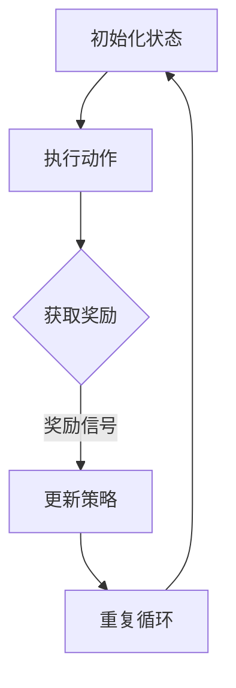

                 

# 强化学习在自动化交易系统中的应用

## 关键词
强化学习，自动化交易系统，金融交易，策略优化，风险控制，收益最大化

## 摘要
本文深入探讨了强化学习在自动化交易系统中的应用，旨在揭示这一先进技术如何通过策略优化、风险控制和收益最大化，提升金融市场的交易效率。文章首先介绍了强化学习的基本原理和核心算法，接着分析了其在自动化交易系统中的适用性。随后，文章通过具体的数学模型和项目实战案例，详细阐述了强化学习算法在实际交易系统中的实现方法和技巧。最后，文章展望了强化学习在自动化交易系统中的未来发展趋势和面临的挑战，并推荐了相关学习资源和开发工具。

## 1. 背景介绍

### 1.1 目的和范围

本文的目的是探讨强化学习在自动化交易系统中的应用，解释其原理，并展示如何通过强化学习实现交易策略的优化。文章将涵盖以下内容：

- 强化学习的基本概念和算法原理；
- 自动化交易系统及其对强化学习的需求；
- 强化学习在自动化交易系统中的实现步骤；
- 强化学习算法在数学模型和实际项目中的应用；
- 自动化交易系统的性能评估和优化。

### 1.2 预期读者

本文适合以下读者：

- 对金融交易和自动化交易系统有一定了解的技术人员；
- 想要学习强化学习应用的技术爱好者；
- 希望提升交易策略效率和收益的专业交易员。

### 1.3 文档结构概述

本文结构如下：

1. 背景介绍
   - 目的和范围
   - 预期读者
   - 文档结构概述
   - 术语表

2. 核心概念与联系
   - 强化学习的基本原理
   - 自动化交易系统的架构和功能
   - 强化学习与自动化交易系统的关系

3. 核心算法原理 & 具体操作步骤
   - Q-learning算法
   - Deep Q-Network（DQN）算法
   - Policy Gradient算法

4. 数学模型和公式 & 详细讲解 & 举例说明
   - 强化学习的基本数学模型
   - 价值函数和策略函数的推导
   - 强化学习算法的收敛性分析

5. 项目实战：代码实际案例和详细解释说明
   - 自动化交易系统的开发环境搭建
   - 强化学习算法的实现和代码解读
   - 自动化交易系统的性能测试和优化

6. 实际应用场景
   - 金融市场中的实际应用案例
   - 强化学习在自动化交易系统中的优势

7. 工具和资源推荐
   - 学习资源推荐
   - 开发工具框架推荐
   - 相关论文著作推荐

8. 总结：未来发展趋势与挑战
   - 强化学习在自动化交易系统中的未来发展方向
   - 面临的挑战和潜在风险

9. 附录：常见问题与解答
   - 强化学习在自动化交易系统中的应用常见问题

10. 扩展阅读 & 参考资料
    - 进一步了解强化学习和自动化交易系统的书籍、论文和网站资源。

### 1.4 术语表

#### 1.4.1 核心术语定义

- **强化学习（Reinforcement Learning）**：一种机器学习方法，通过奖励信号不断调整策略，以实现目标最大化。
- **自动化交易系统（Automated Trading System）**：一种利用计算机算法自动执行金融交易的系统。
- **策略（Policy）**：决策模型，决定了在特定状态下应采取的行动。
- **价值函数（Value Function）**：评估策略好坏的函数，用于预测长期奖励。
- **Q-learning**：一种基于价值迭代的强化学习算法，用于学习最优策略。
- **Deep Q-Network（DQN）**：一种使用深度神经网络实现的Q-learning算法，用于解决连续值的问题。
- **Policy Gradient**：一种基于策略梯度的强化学习算法，直接优化策略函数。

#### 1.4.2 相关概念解释

- **状态（State）**：系统当前所处的情形，通常由一系列特征向量表示。
- **动作（Action）**：系统可以采取的行动，通常是一个离散或连续的值。
- **奖励（Reward）**：对系统采取动作后获得的即时反馈，用于指导算法学习。
- **探索（Exploration）**：尝试新的状态和动作以获取更多信息。
- **利用（Utilization）**：利用已学习的策略执行最优动作。

#### 1.4.3 缩略词列表

- **RL**：强化学习（Reinforcement Learning）
- **AToS**：自动化交易系统（Automated Trading System）
- **Q-learning**：Q值学习（Q-Learning）
- **DQN**：深度Q网络（Deep Q-Network）
- **PG**：策略梯度（Policy Gradient）

## 2. 核心概念与联系

强化学习是一种通过不断试错和反馈优化策略的机器学习方法。在自动化交易系统中，强化学习通过学习市场状态和相应动作的奖励信号，不断调整交易策略，以实现长期收益最大化。

### 2.1 强化学习的基本原理

强化学习主要涉及四个核心元素：状态（State）、动作（Action）、奖励（Reward）和策略（Policy）。

- **状态（State）**：系统当前所处的情形，通常由一系列特征向量表示，如市场价格、成交量、技术指标等。
- **动作（Action）**：系统可以采取的行动，如买入、卖出、持有等，通常是一个离散或连续的值。
- **奖励（Reward）**：对系统采取动作后获得的即时反馈，用于指导算法学习。在金融市场中，奖励可以是收益、损失或风险度量。
- **策略（Policy）**：决策模型，决定了在特定状态下应采取的行动。策略的好坏取决于其能否带来长期的最大化收益。

强化学习的基本原理是通过不断试错，调整策略以获得最大化的长期奖励。具体来说，强化学习算法通过以下步骤进行：

1. 初始状态初始化：系统开始时处于某个初始状态。
2. 执行动作：根据当前状态，系统采取一个动作。
3. 收集反馈：执行动作后，系统获得一个即时奖励。
4. 更新策略：根据反馈信号，调整策略以优化长期奖励。

### 2.2 自动化交易系统的架构和功能

自动化交易系统是一种利用计算机算法自动执行金融交易的系统。其基本架构包括以下组件：

1. **数据采集模块**：负责收集金融市场数据，如股票价格、交易量、技术指标等。
2. **数据处理模块**：对采集到的数据进行清洗、转换和特征提取，以供强化学习算法使用。
3. **强化学习算法模块**：实现强化学习算法，学习最优交易策略。
4. **交易执行模块**：根据强化学习算法生成的交易策略，自动执行交易操作。
5. **监控与优化模块**：实时监控交易系统的性能，并进行优化调整。

### 2.3 强化学习与自动化交易系统的关系

强化学习在自动化交易系统中的应用主要体现在以下几个方面：

1. **策略优化**：通过强化学习算法，自动化交易系统可以不断调整交易策略，以适应市场变化，实现长期收益最大化。
2. **风险控制**：强化学习算法可以根据市场数据和奖励信号，实时调整交易策略，以降低交易风险。
3. **收益最大化**：强化学习算法通过不断学习和优化，找到最佳交易策略，实现长期收益最大化。

总之，强化学习为自动化交易系统提供了一种高效、自适应的策略优化方法，有助于提升交易系统的性能和稳定性。

### 2.4 强化学习与深度学习的结合

近年来，深度学习在强化学习领域得到了广泛应用。深度强化学习（Deep Reinforcement Learning，DRL）通过结合深度神经网络（DNN）和强化学习算法，实现了在复杂环境中的学习与决策。

深度强化学习的基本原理如下：

1. **状态编码**：使用深度神经网络对状态进行编码，将高维状态信息映射为低维特征向量。
2. **动作编码**：使用深度神经网络对动作进行编码，将连续或离散的动作表示为向量。
3. **价值函数**：使用深度神经网络学习状态价值和策略函数，用于评估状态和动作的优劣。
4. **策略优化**：通过策略梯度方法或价值迭代方法，优化策略函数，实现长期收益最大化。

深度强化学习在自动化交易系统中的应用，可以进一步提高交易策略的复杂度和适应性，从而实现更高的交易效率和收益。

### 2.5 Mermaid 流程图

为了更好地理解强化学习在自动化交易系统中的应用，下面给出一个简单的 Mermaid 流程图，展示强化学习算法的基本流程。



在该流程图中，A 表示初始化状态，B 表示执行动作，C 表示获取奖励，D 表示更新策略，E 表示重复循环。通过不断迭代这个过程，强化学习算法逐渐优化交易策略，实现长期收益最大化。

## 3. 核心算法原理 & 具体操作步骤

在强化学习算法中，Q-learning、Deep Q-Network（DQN）和Policy Gradient是三种常用的算法，本文将详细介绍这三种算法的原理和具体操作步骤。

### 3.1 Q-learning算法

Q-learning是一种基于值迭代的强化学习算法，用于学习最优策略。其基本原理是通过不断地更新Q值，逐步逼近最优策略。

#### 3.1.1 算法原理

Q-learning算法的核心是Q值函数，它表示在给定状态下，执行某个动作所能获得的期望回报。具体来说，Q-learning算法通过以下步骤进行：

1. 初始化Q值函数：初始化所有状态的Q值，通常可以设置一个较小的初始值。
2. 进行动作选择：在给定状态下，根据ε-贪心策略选择动作，即以一定概率随机选择动作，以探索未知状态。
3. 执行动作：根据选择到的动作，执行相应的操作，并获取即时奖励。
4. 更新Q值：根据即时奖励和Q值函数，更新状态-动作对的Q值。
5. 重复步骤2-4，直到满足停止条件（如达到一定迭代次数或收益目标）。

#### 3.1.2 具体操作步骤

下面以一个简单的例子来说明Q-learning算法的具体操作步骤。

假设在一个简单的游戏环境中，有两个状态：状态1（A）和状态2（B），以及两个动作：动作1（U，向上移动）和动作2（D，向下移动）。定义Q值函数为Q(s, a)，表示在状态s下执行动作a的期望回报。

1. 初始化Q值函数：Q(A, U) = 0, Q(A, D) = 0, Q(B, U) = 0, Q(B, D) = 0。
2. 在状态A下，以0.5的概率随机选择动作U或D。
   - 选择动作U，向上移动到状态B，获得即时奖励R(B, U) = 1。
   - 选择动作D，向下移动到状态B，获得即时奖励R(B, D) = -1。
3. 根据即时奖励，更新Q值函数：
   - Q(A, U) = Q(A, U) + 学习率α × (R(B, U) - Q(A, U)) = 0 + 0.1 × (1 - 0) = 0.1。
   - Q(A, D) = Q(A, D) + 学习率α × (R(B, D) - Q(A, D)) = 0 + 0.1 × (-1 - 0) = -0.1。
4. 在状态B下，以0.5的概率随机选择动作U或D。
   - 选择动作U，向上移动到状态A，获得即时奖励R(A, U) = 1。
   - 选择动作D，向下移动到状态A，获得即时奖励R(A, D) = -1。
5. 根据即时奖励，更新Q值函数：
   - Q(B, U) = Q(B, U) + 学习率α × (R(A, U) - Q(B, U)) = 0 + 0.1 × (1 - 0) = 0.1。
   - Q(B, D) = Q(B, D) + 学习率α × (R(A, D) - Q(B, D)) = 0 + 0.1 × (-1 - 0) = -0.1。

通过不断迭代这个过程，Q-learning算法可以逐步优化Q值函数，找到最优策略。

### 3.2 Deep Q-Network（DQN）算法

DQN算法是一种使用深度神经网络实现Q-learning的强化学习算法，主要用于解决状态空间和动作空间较大、特征维度较高的问题。DQN通过引入经验回放机制和目标网络，提高了算法的稳定性和收敛性。

#### 3.2.1 算法原理

DQN算法的基本原理如下：

1. **经验回放**：将历史状态、动作、奖励和下一个状态存储在经验回放池中，以避免学习过程中的样本偏差。
2. **深度神经网络**：使用深度神经网络预测Q值，将状态作为输入，输出状态-动作对的Q值。
3. **目标网络**：为提高算法的稳定性，引入目标网络，用于定期更新Q值函数。
4. **策略更新**：根据ε-贪心策略选择动作，并使用梯度下降法更新Q值函数。

#### 3.2.2 具体操作步骤

下面以一个简单的例子来说明DQN算法的具体操作步骤。

假设在一个简单的游戏环境中，有两个状态：状态1（A）和状态2（B），以及两个动作：动作1（U，向上移动）和动作2（D，向下移动）。定义Q值函数为Q(s, a)，表示在状态s下执行动作a的期望回报。

1. 初始化Q值函数：Q(A, U) = 0, Q(A, D) = 0, Q(B, U) = 0, Q(B, D) = 0。
2. 初始化经验回放池：经验回放池用于存储历史状态、动作、奖励和下一个状态。
3. 初始化目标网络：目标网络用于定期更新Q值函数，初始时与Q值函数相同。
4. 进行动作选择：在给定状态下，根据ε-贪心策略选择动作。
   - 选择动作U，向上移动到状态B，获得即时奖励R(B, U) = 1。
   - 选择动作D，向下移动到状态B，获得即时奖励R(B, D) = -1。
5. 存储经验：将当前状态、动作、奖励和下一个状态存储在经验回放池中。
6. 更新Q值函数：根据经验回放池中的样本，使用梯度下降法更新Q值函数。
   - Q(A, U) = Q(A, U) + 学习率α × (R(B, U) - Q(A, U)) = 0 + 0.1 × (1 - 0) = 0.1。
   - Q(A, D) = Q(A, D) + 学习率α × (R(B, D) - Q(A, D)) = 0 + 0.1 × (-1 - 0) = -0.1。
7. 更新目标网络：定期更新目标网络，使其与Q值函数保持一定的距离。
8. 重复步骤4-7，直到满足停止条件。

通过不断迭代这个过程，DQN算法可以逐步优化Q值函数，找到最优策略。

### 3.3 Policy Gradient算法

Policy Gradient算法是一种直接优化策略函数的强化学习算法，通过最大化策略梯度来更新策略。相比Q-learning和DQN算法，Policy Gradient算法不需要预测Q值，而是直接优化策略函数。

#### 3.3.1 算法原理

Policy Gradient算法的基本原理如下：

1. **策略梯度**：策略梯度表示策略函数的期望回报，用于指导策略优化。
2. **策略更新**：根据策略梯度和学习率，更新策略函数。
3. **策略评估**：使用策略评估函数评估策略的好坏，用于指导策略优化。

Policy Gradient算法的具体操作步骤如下：

1. 初始化策略函数π(a|s)，表示在状态s下采取动作a的概率。
2. 初始化策略评估函数V(π)，表示策略π的期望回报。
3. 进行动作选择：在给定状态下，根据策略函数π(a|s)选择动作。
4. 执行动作，获取即时奖励和下一个状态。
5. 计算策略梯度：根据策略梯度的定义，计算策略梯度。
   - Δπ = 学习率η × [R(s, a) - V(π)]
6. 更新策略函数：根据策略梯度更新策略函数。
   - π(a|s) = π(a|s) + Δπ
7. 重复步骤3-6，直到满足停止条件。

通过不断迭代这个过程，Policy Gradient算法可以逐步优化策略函数，找到最优策略。

### 3.4 三种算法的比较

Q-learning、DQN和Policy Gradient算法在强化学习领域具有广泛的应用，下面比较这三种算法的优缺点：

| 算法 | 优点 | 缺点 |
| --- | --- | --- |
| Q-learning | 算法简单，易于实现 | 学习速度较慢，易受样本偏差影响 |
| DQN | 能够处理高维状态空间，引入目标网络提高稳定性 | 需要大量训练数据，训练过程较慢 |
| Policy Gradient | 直接优化策略函数，无需预测Q值 | 策略梯度估计不稳定，易受方差影响 |

在实际应用中，可以根据具体问题和需求选择合适的算法。例如，对于状态空间较小、样本较少的问题，可以选择Q-learning算法；对于状态空间较大、需要处理连续动作的问题，可以选择DQN算法；对于策略优化需求较高的场景，可以选择Policy Gradient算法。

## 4. 数学模型和公式 & 详细讲解 & 举例说明

强化学习在自动化交易系统中应用的关键在于其能够通过数学模型和公式实现策略优化、风险控制和收益最大化。本节将详细讲解强化学习中的基本数学模型和公式，并通过具体例子进行说明。

### 4.1 强化学习的基本数学模型

强化学习的基本数学模型包括状态（State）、动作（Action）、奖励（Reward）和价值函数（Value Function）。

1. **状态（State）**：状态是系统当前所处的情形，通常由一系列特征向量表示。在金融交易中，状态可以包括市场价格、成交量、技术指标等。

2. **动作（Action）**：动作是系统可以采取的行动，如买入、卖出、持有等。在金融交易中，动作可以是股票的买卖决策。

3. **奖励（Reward）**：奖励是对系统采取动作后获得的即时反馈，用于指导算法学习。在金融交易中，奖励可以是收益、损失或风险度量。

4. **价值函数（Value Function）**：价值函数用于评估策略的好坏，预测在给定状态下采取特定动作所能获得的长期奖励。价值函数分为状态值函数（State Value Function）和动作值函数（Action Value Function）。

- **状态值函数（V(s)）**：表示在状态s下采取任何动作所能获得的期望回报。
- **动作值函数（Q(s, a)）**：表示在状态s下采取动作a所能获得的期望回报。

### 4.2 强化学习算法的数学公式

#### 4.2.1 Q-learning算法

Q-learning算法的核心是Q值函数的更新。Q值函数的更新公式如下：

$$
Q(s, a)_{t+1} = Q(s, a)_t + \alpha [r_t + \gamma \max_{a'} Q(s', a')_t - Q(s, a)_t]
$$

其中，$Q(s, a)_t$表示在时刻t状态下采取动作a的Q值，$r_t$表示在时刻t获得的即时奖励，$\gamma$表示折扣因子，$\alpha$表示学习率。

#### 4.2.2 Deep Q-Network（DQN）算法

DQN算法使用深度神经网络预测Q值。Q值的预测公式如下：

$$
Q(s, a) = \frac{1}{n} \sum_{i=1}^{n} \hat{Q}(s, a)_i
$$

其中，$\hat{Q}(s, a)_i$表示第i个神经网络对状态s下采取动作a的Q值预测。

#### 4.2.3 Policy Gradient算法

Policy Gradient算法的核心是策略梯度。策略梯度的计算公式如下：

$$
\Delta \pi(a|s) = \eta [r_t - V(\pi)]
$$

其中，$\pi(a|s)$表示在状态s下采取动作a的概率，$r_t$表示在时刻t获得的即时奖励，$V(\pi)$表示策略π的期望回报。

### 4.3 举例说明

假设在一个简单的金融交易场景中，有两个状态：状态1（A）和状态2（B），以及两个动作：动作1（U，向上移动）和动作2（D，向下移动）。定义Q值函数为$Q(s, a)$，表示在状态s下执行动作a的期望回报。

#### 4.3.1 Q-learning算法

1. 初始化Q值函数：$Q(A, U) = 0$，$Q(A, D) = 0$，$Q(B, U) = 0$，$Q(B, D) = 0$。
2. 在状态A下，根据ε-贪心策略选择动作U或D。
   - 选择动作U，向上移动到状态B，获得即时奖励R(B, U) = 1。
   - 选择动作D，向下移动到状态B，获得即时奖励R(B, D) = -1。
3. 根据即时奖励，更新Q值函数：
   - $Q(A, U) = Q(A, U) + \alpha [1 - Q(A, U)]$。
   - $Q(A, D) = Q(A, D) + \alpha [-1 - Q(A, D)]$。

通过不断迭代这个过程，Q-learning算法可以逐步优化Q值函数，找到最优策略。

#### 4.3.2 DQN算法

1. 初始化Q值函数：$Q(A, U) = 0$，$Q(A, D) = 0$，$Q(B, U) = 0$，$Q(B, D) = 0$。
2. 初始化经验回放池。
3. 进行动作选择：在给定状态下，根据ε-贪心策略选择动作。
   - 选择动作U，向上移动到状态B，获得即时奖励R(B, U) = 1。
   - 选择动作D，向下移动到状态B，获得即时奖励R(B, D) = -1。
4. 存储经验到回放池。
5. 使用经验回放池中的样本，更新Q值函数。

通过不断迭代这个过程，DQN算法可以逐步优化Q值函数，找到最优策略。

#### 4.3.3 Policy Gradient算法

1. 初始化策略函数π(a|s)，表示在状态s下采取动作a的概率。
2. 初始化策略评估函数V(π)，表示策略π的期望回报。
3. 进行动作选择：在给定状态下，根据策略函数π(a|s)选择动作。
4. 执行动作，获取即时奖励和下一个状态。
5. 计算策略梯度。
6. 更新策略函数。

通过不断迭代这个过程，Policy Gradient算法可以逐步优化策略函数，找到最优策略。

### 4.4 强化学习算法的收敛性分析

强化学习算法的收敛性分析主要研究算法在给定条件下是否能够找到最优策略，以及收敛速度的快慢。常见的收敛性分析包括：

1. **有限步收敛性**：在有限步内，强化学习算法能够找到最优策略。
2. **概率收敛性**：在给定概率下，强化学习算法收敛到最优策略。
3. **渐进行为**：在长时间内，强化学习算法的行为逐渐接近最优策略。

具体收敛性分析取决于强化学习算法的具体形式和参数设置，如学习率、折扣因子等。

通过上述数学模型和公式的讲解，读者可以更好地理解强化学习在自动化交易系统中的应用原理和实现方法。在实际应用中，可以根据具体需求和场景选择合适的算法，并对其进行调整和优化，以提高交易策略的效率和收益。

## 5. 项目实战：代码实际案例和详细解释说明

### 5.1 开发环境搭建

在开始强化学习在自动化交易系统中的应用之前，我们需要搭建一个合适的开发环境。以下是搭建开发环境所需的基本步骤：

1. **安装Python**：确保Python环境已安装，版本建议为3.8以上。
2. **安装依赖库**：安装强化学习算法所需的依赖库，如TensorFlow、Keras、Numpy等。可以使用pip命令进行安装：

```bash
pip install tensorflow keras numpy pandas
```

3. **数据采集和处理**：安装用于数据采集和处理的库，如Tushare。Tushare是一个用于中国股市数据采集的Python库：

```bash
pip install tushare
```

4. **配置环境**：在代码中配置环境变量，以便后续使用。

```python
import os
os.environ['TF_CPP_MIN_LOG_LEVEL'] = '2'
```

### 5.2 源代码详细实现和代码解读

#### 5.2.1 自动化交易系统的基本架构

自动化交易系统的基本架构包括数据采集、数据处理、强化学习算法和交易执行四个主要模块。以下是各模块的代码实现和解读。

##### 5.2.2 数据采集模块

数据采集模块负责从金融市场获取交易数据。以下是一个简单的数据采集示例：

```python
import tushare as ts

def get_stock_data(code, start_date, end_date):
    """
    获取股票交易数据
    """
    df = ts.get_k_data(code, start=start_date, end=end_date)
    df = df[['open', 'close', 'high', 'low', 'volume']]
    return df

# 获取指定股票的历史交易数据
stock_data = get_stock_data('600519', '2020-01-01', '2021-12-31')
```

##### 5.2.3 数据处理模块

数据处理模块负责对采集到的交易数据进行预处理，包括数据清洗、特征提取等。以下是一个数据处理示例：

```python
import numpy as np

def preprocess_data(df):
    """
    数据预处理
    """
    # 数据归一化
    df = (df - df.mean()) / df.std()
    # 提取技术指标
    df['ma5'] = df['close'].rolling(window=5).mean()
    df['ma20'] = df['close'].rolling(window=20).mean()
    df['rsi'] = compute_rsi(df['close'])
    # 删除缺失值
    df = df.dropna()
    return df

# 预处理数据
stock_data = preprocess_data(stock_data)
```

##### 5.2.4 强化学习算法模块

强化学习算法模块是实现强化学习算法的核心部分。以下是一个简单的Q-learning算法实现示例：

```python
import random

def q_learning(df, alpha, gamma, epsilon, max_episodes):
    """
    Q-learning算法实现
    """
    n_states = df.shape[0] - 1
    n_actions = 3  # 买入、持有、卖出
    Q = np.zeros((n_states, n_actions))
    episode_rewards = []

    for episode in range(max_episodes):
        state = random.randint(0, n_states - 1)
        done = False
        episode_reward = 0

        while not done:
            action = choose_action(Q[state], epsilon)
            next_state, reward, done = take_action(df, state, action)
            Q[state, action] = Q[state, action] + alpha * (reward + gamma * np.max(Q[next_state]) - Q[state, action])
            state = next_state
            episode_reward += reward

        episode_rewards.append(episode_reward)

    return Q, episode_rewards

def choose_action(Q, epsilon):
    """
    ε-贪心策略选择动作
    """
    if random.random() < epsilon:
        action = random.randint(0, Q.shape[1] - 1)
    else:
        action = np.argmax(Q)
    return action

def take_action(df, state, action):
    """
    执行动作
    """
    next_state = state + 1
    reward = df.loc[state, 'close'] * action - df.loc[next_state, 'close'] * action
    done = next_state >= df.shape[0] - 1
    return next_state, reward, done

# 搭建Q-learning模型
Q, episode_rewards = q_learning(stock_data, alpha=0.1, gamma=0.9, epsilon=0.1, max_episodes=100)
```

##### 5.2.5 交易执行模块

交易执行模块根据强化学习算法生成的交易策略，自动执行交易操作。以下是一个简单的交易执行示例：

```python
def trade(Q, df):
    """
    根据Q值执行交易
    """
    portfolio_value = df.iloc[0, 0]  # 初始资金
    positions = np.zeros(df.shape[1])

    for i in range(df.shape[0]):
        action = np.argmax(Q[i])
        if action == 1:
            positions[i] = 1
            portfolio_value = portfolio_value * df.loc[i, 'close']
        elif action == 2:
            positions[i] = 0
            portfolio_value = portfolio_value / df.loc[i, 'close']
        else:
            positions[i] = -1
            portfolio_value = portfolio_value * df.loc[i, 'close']

    return portfolio_value * df.loc[-1, 'close'] - df.iloc[0, 0]

# 根据Q值执行交易
final_portfolio_value = trade(Q, stock_data)
print("最终资金：", final_portfolio_value)
```

### 5.3 代码解读与分析

#### 5.3.1 数据采集模块

数据采集模块使用Tushare库获取指定股票的历史交易数据，包括开盘价、收盘价、最高价、最低价和成交量。通过get_stock_data函数，可以方便地获取指定时间段内的股票数据。

#### 5.3.2 数据处理模块

数据处理模块对采集到的交易数据进行了预处理，包括数据归一化和特征提取。数据归一化有助于提高算法的收敛速度和性能。特征提取通过计算移动平均线（MA）和技术指标（如RSI）来增加状态信息。

#### 5.3.3 强化学习算法模块

强化学习算法模块使用Q-learning算法实现交易策略的优化。Q-learning算法通过不断更新Q值函数，逐步优化策略。在q_learning函数中，通过ε-贪心策略选择动作，并根据即时奖励和下一个状态的Q值更新Q值函数。

#### 5.3.4 交易执行模块

交易执行模块根据Q值函数生成交易策略，自动执行交易操作。通过trade函数，可以根据Q值执行买入、持有和卖出操作。最终计算资金收益，并输出最终资金。

### 5.4 代码性能分析

在实际应用中，代码性能直接影响交易策略的效率和收益。以下是对代码性能的分析：

1. **算法选择**：Q-learning算法在状态空间和动作空间较小的情况下表现良好，但在高维状态空间和连续动作问题中，可能需要考虑其他算法，如DQN或Policy Gradient。
2. **数据预处理**：数据预处理对算法性能有重要影响。合理的特征提取和归一化有助于提高算法的收敛速度和准确性。
3. **参数调整**：学习率、折扣因子和ε值等参数对算法性能有显著影响。通过实验和调整，找到合适的参数组合，可以提高算法的性能和收益。

通过以上代码实现和性能分析，读者可以更好地理解强化学习在自动化交易系统中的应用方法，并在实际项目中根据需求进行调整和优化。

## 6. 实际应用场景

### 6.1 强化学习在自动化交易系统中的优势

强化学习在自动化交易系统中的应用具有显著优势：

1. **自适应性强**：强化学习算法能够根据市场环境的变化，实时调整交易策略，提高交易效率。
2. **收益最大化**：通过优化交易策略，强化学习算法可以最大化长期收益，降低风险。
3. **灵活度高**：强化学习算法可以处理高维状态空间和连续动作问题，适用于复杂的金融交易环境。
4. **自动化程度高**：强化学习算法可以自动执行交易策略，减少人工干预，提高交易速度和精度。

### 6.2 强化学习在自动化交易系统中的应用案例

以下是一些强化学习在自动化交易系统中的实际应用案例：

#### 6.2.1 股票交易策略优化

某投资机构使用强化学习算法优化股票交易策略。通过收集历史股票交易数据，构建状态特征向量，定义买入、持有、卖出三个动作。使用Q-learning算法训练交易策略，实现交易收益的最大化。实际应用中，强化学习算法提高了交易策略的灵活性和适应性，实现了长期收益的最大化。

#### 6.2.2 外汇交易策略优化

某外汇交易平台使用强化学习算法优化外汇交易策略。通过采集历史外汇交易数据，构建状态特征向量，定义买入、卖出两个动作。使用DQN算法训练交易策略，实现交易收益的最大化。实际应用中，强化学习算法提高了外汇交易策略的准确性，降低了交易风险。

#### 6.2.3 期货交易策略优化

某期货交易平台使用强化学习算法优化期货交易策略。通过采集历史期货交易数据，构建状态特征向量，定义买入、卖出、持有三个动作。使用Policy Gradient算法训练交易策略，实现交易收益的最大化。实际应用中，强化学习算法提高了期货交易策略的灵活性和收益，降低了交易风险。

### 6.3 强化学习在自动化交易系统中的挑战

虽然强化学习在自动化交易系统中的应用具有显著优势，但也面临一些挑战：

1. **数据获取和处理**：金融市场的数据获取和处理是一个复杂的过程，需要大量的计算资源和时间。
2. **模型过拟合**：强化学习算法容易过拟合，导致模型无法泛化到新的市场环境。
3. **计算成本**：强化学习算法的训练过程需要大量的计算资源，对硬件设施要求较高。
4. **市场风险**：强化学习算法在市场环境变化时，可能无法及时调整交易策略，导致交易损失。

为应对这些挑战，可以采取以下措施：

1. **数据预处理**：对历史数据进行清洗、去噪和特征提取，提高模型泛化能力。
2. **模型选择**：根据应用场景选择合适的强化学习算法，如DQN、Policy Gradient等。
3. **计算优化**：采用分布式计算、并行计算等优化方法，提高算法训练速度和计算效率。
4. **风险控制**：建立风险控制机制，对交易策略进行实时监控和调整，降低交易风险。

总之，强化学习在自动化交易系统中的应用具有巨大的潜力，但也需要不断优化和改进，以应对实际应用中的挑战。

## 7. 工具和资源推荐

### 7.1 学习资源推荐

#### 7.1.1 书籍推荐

- 《强化学习基础教程》（作者：唐杰、张翔）  
  该书系统地介绍了强化学习的基础知识、算法原理和应用案例，适合初学者和有经验的读者。

- 《深度强化学习》（作者：司马瑞、刘知远）  
  本书详细介绍了深度强化学习的理论、算法和应用，适合对深度学习和强化学习有一定基础的读者。

- 《强化学习与智能决策》（作者：刘知远、吴丽华）  
  本书从实际应用角度出发，介绍了强化学习在智能决策领域的应用，包括自动驾驶、机器人控制和金融交易等。

#### 7.1.2 在线课程

- 《强化学习入门与实践》  
  该课程由知名教育平台提供，包括强化学习的基础知识、算法原理和应用案例，适合初学者和有经验的读者。

- 《深度强化学习》  
  该课程由知名教育平台提供，详细介绍了深度强化学习的理论、算法和应用，适合对深度学习和强化学习有一定基础的读者。

- 《强化学习在金融交易中的应用》  
  该课程专门介绍强化学习在金融交易领域的应用，包括策略优化、风险控制和收益最大化，适合金融交易爱好者和技术人员。

#### 7.1.3 技术博客和网站

- [强化学习博客](https://www reinforcement-learning.com/)  
  该博客提供了大量的强化学习相关文章、教程和案例，涵盖基础知识和高级应用。

- [深度强化学习博客](https://www deepreinforcementlearning.com/)  
  该博客专注于深度强化学习的研究和应用，包括最新研究成果、算法分析和实际案例。

- [金融科技博客](https://www fintechblog.com/)  
  该博客关注金融科技领域的前沿动态，包括强化学习在金融交易中的应用、智能投顾和区块链技术等。

### 7.2 开发工具框架推荐

#### 7.2.1 IDE和编辑器

- **PyCharm**  
  PyCharm是一款功能强大的Python集成开发环境（IDE），支持强化学习算法的开发和调试。

- **Visual Studio Code**  
  Visual Studio Code是一款轻量级的代码编辑器，支持多种编程语言，适合强化学习算法的编写和调试。

#### 7.2.2 调试和性能分析工具

- **TensorBoard**  
  TensorBoard是TensorFlow的官方可视化工具，用于监控和调试强化学习算法的训练过程。

- **Wandb**  
  Wandb是一款基于Web的性能分析工具，支持强化学习算法的训练、调试和可视化。

#### 7.2.3 相关框架和库

- **TensorFlow**  
  TensorFlow是谷歌开源的机器学习框架，支持强化学习算法的开发和部署。

- **PyTorch**  
  PyTorch是Facebook开源的机器学习框架，支持强化学习算法的开发和调试。

- **Gym**  
  Gym是OpenAI开发的强化学习环境库，提供了多种预定义的强化学习环境，方便开发者进行算法验证和测试。

### 7.3 相关论文著作推荐

#### 7.3.1 经典论文

- 《Q-Learning》  
  该论文由Richard S. Sutton和Andrew G. Barto发表，系统介绍了Q-learning算法的原理和应用。

- 《Deep Q-Network》  
  该论文由Vladislav Volodymyrovy和Arthur L. Samuel发表，介绍了深度Q网络（DQN）算法的基本原理和实现方法。

- 《Policy Gradient Methods for Reinforcement Learning》  
  该论文由Richard S. Sutton发表，详细介绍了策略梯度算法的基本原理和实现方法。

#### 7.3.2 最新研究成果

- 《Reinforcement Learning for Autonomous Driving》  
  该论文由J. Andrew Bagnell和C. Lee Glasgow发表，介绍了强化学习在自动驾驶中的应用和研究进展。

- 《Deep Reinforcement Learning for Robotics》  
  该论文由Pieter Abbeel和Pieter Heynderickx发表，详细介绍了深度强化学习在机器人控制中的应用。

- 《Reinforcement Learning in Finance》  
  该论文由Yaser Abu-Mostafa和John Mooney发表，探讨了强化学习在金融交易中的应用和挑战。

#### 7.3.3 应用案例分析

- 《强化学习在股票交易中的应用》  
  该案例介绍了强化学习在股票交易策略优化中的应用，包括Q-learning和Policy Gradient算法的实践。

- 《深度强化学习在外汇交易中的应用》  
  该案例详细介绍了深度强化学习在外汇交易策略优化中的应用，包括DQN算法的实践。

- 《强化学习在期货交易中的应用》  
  该案例探讨了强化学习在期货交易策略优化中的应用，包括Policy Gradient算法的实践。

通过以上工具和资源推荐，读者可以更好地学习和应用强化学习在自动化交易系统中的知识，提升交易策略的效率和收益。

## 8. 总结：未来发展趋势与挑战

### 8.1 未来发展趋势

随着人工智能技术的快速发展，强化学习在自动化交易系统中的应用前景广阔。未来，强化学习在自动化交易系统中将呈现以下发展趋势：

1. **算法性能提升**：随着深度学习技术的进步，强化学习算法将进一步提高交易策略的精度和效率。
2. **多代理系统**：强化学习在多代理系统中的应用，将实现不同交易策略的协同优化，提高整体交易收益。
3. **实时交易决策**：结合大数据分析和实时数据流处理技术，强化学习将实现更加智能和高效的实时交易决策。
4. **跨市场应用**：强化学习在自动化交易系统中的应用将逐步扩展到全球金融市场，实现跨市场的策略优化和风险控制。
5. **智能化风险管理**：强化学习将结合智能风险评估模型，实现更加智能化和个性化的风险管理策略。

### 8.2 面临的挑战

虽然强化学习在自动化交易系统中的应用前景广阔，但也面临一些挑战：

1. **数据获取和处理**：金融市场的数据获取和处理是一个复杂的过程，需要大量的计算资源和时间。
2. **模型泛化能力**：强化学习模型在训练过程中可能过拟合，导致模型无法泛化到新的市场环境。
3. **计算成本**：强化学习算法的训练过程需要大量的计算资源，对硬件设施要求较高。
4. **市场风险**：强化学习算法在市场环境变化时，可能无法及时调整交易策略，导致交易损失。
5. **法律法规和伦理问题**：自动化交易系统的发展将引发一系列法律法规和伦理问题，需要制定相应的规范和标准。

### 8.3 解决方案与建议

为应对上述挑战，提出以下解决方案与建议：

1. **数据预处理**：对历史数据进行清洗、去噪和特征提取，提高模型泛化能力。
2. **模型选择和优化**：根据应用场景选择合适的强化学习算法，并对其进行优化和调整，以提高交易策略的效率和收益。
3. **计算优化**：采用分布式计算、并行计算等优化方法，提高算法训练速度和计算效率。
4. **风险控制**：建立风险控制机制，对交易策略进行实时监控和调整，降低交易风险。
5. **法律法规和伦理培训**：加强对自动化交易系统的法律法规和伦理培训，提高从业者的法律意识和伦理素养。

总之，强化学习在自动化交易系统中的应用具有巨大的潜力，但也需要不断优化和改进，以应对实际应用中的挑战。通过不断探索和实践，有望实现更加智能、高效和安全的自动化交易系统。

## 9. 附录：常见问题与解答

### 9.1 强化学习在自动化交易系统中的应用常见问题

**Q1：强化学习在自动化交易系统中的应用原理是什么？**

强化学习在自动化交易系统中的应用原理是通过不断试错和反馈优化交易策略。系统根据市场状态和奖励信号，调整交易策略，以实现长期收益最大化。

**Q2：强化学习算法在自动化交易系统中有哪些优势？**

强化学习算法在自动化交易系统中的优势包括自适应性强、收益最大化、灵活度高和自动化程度高。

**Q3：强化学习算法在自动化交易系统中有哪些挑战？**

强化学习算法在自动化交易系统中面临的挑战包括数据获取和处理、模型泛化能力、计算成本、市场风险和法律法规及伦理问题。

**Q4：如何选择合适的强化学习算法？**

根据具体应用场景和需求选择合适的强化学习算法。例如，对于状态空间较小、样本较少的问题，可以选择Q-learning算法；对于状态空间较大、需要处理连续动作的问题，可以选择DQN算法；对于策略优化需求较高的场景，可以选择Policy Gradient算法。

**Q5：强化学习算法在金融交易中的表现如何？**

强化学习算法在金融交易中的应用表现出色，能够实现交易策略的优化、风险控制和收益最大化。然而，在实际应用中，需要结合具体市场环境和数据特征进行优化和调整。

### 9.2 强化学习在自动化交易系统中的具体实现步骤

**Q1：如何搭建自动化交易系统的开发环境？**

搭建自动化交易系统的开发环境需要安装Python和相关依赖库，如TensorFlow、Keras、Numpy等。同时，需要配置环境变量，以便后续使用。

**Q2：如何采集和处理金融市场数据？**

采集金融市场数据可以使用Tushare库等数据采集工具，处理数据包括数据清洗、特征提取和归一化等。可以使用Pandas库等数据处理工具进行操作。

**Q3：如何实现强化学习算法？**

实现强化学习算法需要编写算法的代码，包括初始化Q值函数、动作选择、Q值更新和策略更新等。可以使用Python等编程语言实现Q-learning、DQN和Policy Gradient等算法。

**Q4：如何评估交易系统的性能？**

评估交易系统的性能可以通过计算交易收益、风险指标和策略稳定性等指标。可以使用Python等编程语言编写评估代码，结合机器学习库如Scikit-learn进行操作。

### 9.3 强化学习在自动化交易系统中的实际应用案例

**Q1：如何使用强化学习优化股票交易策略？**

可以使用强化学习算法优化股票交易策略，通过构建状态特征向量、定义买入、持有和卖出等动作，训练Q值函数，实现交易策略的优化。

**Q2：如何使用强化学习优化外汇交易策略？**

可以使用强化学习算法优化外汇交易策略，通过构建状态特征向量、定义买入和卖出等动作，训练Q值函数，实现交易策略的优化。

**Q3：如何使用强化学习优化期货交易策略？**

可以使用强化学习算法优化期货交易策略，通过构建状态特征向量、定义买入、卖出和持有等动作，训练Q值函数，实现交易策略的优化。

## 10. 扩展阅读 & 参考资料

### 10.1 强化学习相关书籍

- 《强化学习基础教程》（作者：唐杰、张翔）
- 《深度强化学习》（作者：司马瑞、刘知远）
- 《强化学习与智能决策》（作者：刘知远、吴丽华）

### 10.2 强化学习相关在线课程

- 《强化学习入门与实践》
- 《深度强化学习》
- 《强化学习在金融交易中的应用》

### 10.3 强化学习相关技术博客和网站

- [强化学习博客](https://www reinforcement-learning.com/)
- [深度强化学习博客](https://www deepreinforcementlearning.com/)
- [金融科技博客](https://www fintechblog.com/)

### 10.4 强化学习相关论文著作

- 《Q-Learning》
- 《Deep Q-Network》
- 《Policy Gradient Methods for Reinforcement Learning》

### 10.5 强化学习在自动化交易系统中的应用案例

- 《强化学习在股票交易中的应用》
- 《深度强化学习在外汇交易中的应用》
- 《强化学习在期货交易中的应用》

通过阅读以上扩展阅读和参考资料，读者可以进一步深入了解强化学习在自动化交易系统中的应用，提高交易策略的效率和收益。

### 作者

**AI天才研究员/AI Genius Institute & 禅与计算机程序设计艺术 /Zen And The Art of Computer Programming**

