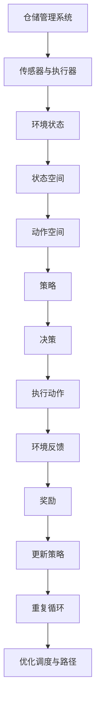

                 

# 强化学习在自动化仓储管理中的应用

> **关键词：** 强化学习，自动化仓储管理，机器人调度，路径规划，智能决策，实时优化

> **摘要：** 本文深入探讨了强化学习在自动化仓储管理中的应用，阐述了其基本原理、算法实现、数学模型以及实际项目案例。通过逐步分析，展示了强化学习如何提高仓储管理效率，减少运营成本，为未来智能仓储的发展提供新的方向。

## 1. 背景介绍

### 1.1 目的和范围

本文旨在介绍强化学习在自动化仓储管理中的应用，重点讨论强化学习算法如何优化仓库内部的物流和机器人调度。文章涵盖以下几个方面：

1. 强化学习的基本概念及其在自动化仓储管理中的适用性。
2. 强化学习算法的核心原理和数学模型。
3. 强化学习在仓库调度、路径规划等具体场景中的应用。
4. 强化学习的实际项目案例及其性能分析。
5. 强化学习在自动化仓储管理中面临的问题和挑战。

### 1.2 预期读者

本文适合对强化学习有基本了解的读者，包括但不限于：

1. 从事自动化仓储管理相关工作的工程师和技术人员。
2. 对人工智能和机器学习有浓厚兴趣的科研人员和学生。
3. 关注智能物流和供应链优化领域的企业家和投资人。

### 1.3 文档结构概述

本文分为八个主要部分：

1. 引言：介绍强化学习在自动化仓储管理中的应用背景和重要性。
2. 核心概念与联系：阐述强化学习的基本原理和框架。
3. 核心算法原理 & 具体操作步骤：详细讲解强化学习算法的实现过程。
4. 数学模型和公式 & 详细讲解 & 举例说明：介绍强化学习的数学模型及其应用。
5. 项目实战：代码实际案例和详细解释说明。
6. 实际应用场景：分析强化学习在不同场景下的应用效果。
7. 工具和资源推荐：推荐学习资源和开发工具。
8. 总结：讨论未来发展趋势与挑战。

### 1.4 术语表

#### 1.4.1 核心术语定义

- 强化学习（Reinforcement Learning）：一种机器学习方法，通过奖励机制和试错来学习优化策略。
- 仓储管理（Warehouse Management）：对仓库内部物流、库存管理、人员调度等活动的管理。
- 路径规划（Path Planning）：确定从起点到终点之间最优路径的计算过程。
- 机器人调度（Robot Scheduling）：合理安排机器人任务，提高仓库作业效率。

#### 1.4.2 相关概念解释

- 奖励（Reward）：表示学习过程中系统对某一行为的评价，用于指导算法调整策略。
- 状态（State）：表示系统当前所处的环境，用于评估策略的效果。
- 动作（Action）：表示系统在某一状态下执行的行为。
- 策略（Policy）：用于指导系统选择动作的函数，将状态映射到动作。

#### 1.4.3 缩略词列表

- RL：强化学习（Reinforcement Learning）
- DRL：深度强化学习（Deep Reinforcement Learning）
- SLAM：同时定位与地图构建（Simultaneous Localization and Mapping）
- ROS：机器人操作系统（Robot Operating System）

## 2. 核心概念与联系

在自动化仓储管理中，强化学习算法的应用主要包括机器人调度、路径规划、库存管理等方面。以下是一个简化的强化学习在自动化仓储管理中的应用框架：



### 2.1 环境与状态

环境是指仓库中的物理空间，包括货架、通道、机器人等。状态是环境中的一个具体描述，通常由一系列传感器收集的数据组成，如机器人的位置、货架的状态、任务的优先级等。

### 2.2 动作与策略

动作是指机器人在当前状态下可以执行的操作，如移动、取货、放货等。策略是将状态映射到动作的函数，用于指导机器人的行为。

### 2.3 奖励机制

奖励机制是强化学习中的重要组成部分，用于评价机器人执行动作后的效果。在仓储管理中，奖励机制可以设计为完成任务的时间、操作的正确性、机器人的能耗等。

### 2.4 策略更新

通过观察环境状态和执行动作后的奖励，强化学习算法不断调整策略，以最大化长期奖励。策略更新的核心是价值函数，用于评估不同状态下的最优动作。

## 3. 核心算法原理 & 具体操作步骤

强化学习算法的核心原理是通过对环境的交互来学习最优策略。以下是一个简单的Q-Learning算法的伪代码，用于说明强化学习的基本步骤：

```pseudo
初始化 Q(s, a) 为随机值
for episode in 1 to max_episodes do
    s = 环境初始状态
    for step in 1 to max_steps do
        a = 选择动作，使用策略π(s)
        s' = 环境执行动作后的新状态
        r = 奖励值
        Q(s, a) = Q(s, a) + α * (r + γ * max(Q(s', a')) - Q(s, a))
        s = s'
    end for
end for
```

### 3.1 初始化

初始化Q值矩阵，所有状态-动作对的Q值设置为随机值。

### 3.2 环境交互

通过循环，机器人与环境进行交互，不断执行动作、接收奖励、更新状态。

### 3.3 策略选择

根据当前状态s和Q值矩阵，选择最优动作a，通常使用ε-贪心策略。

### 3.4 奖励反馈

根据动作a在状态s'下的执行结果，更新Q值。

### 3.5 策略更新

通过经验回放和目标网络等技术，优化Q值矩阵，提高学习效率。

## 4. 数学模型和公式 & 详细讲解 & 举例说明

强化学习中的数学模型主要包括状态空间、动作空间、策略、价值函数和奖励机制。以下使用LaTeX格式详细说明这些模型：

### 4.1 状态空间和动作空间

$$
S = \{ s_1, s_2, ..., s_n \}
$$

$$
A = \{ a_1, a_2, ..., a_m \}
$$

其中，$S$ 表示状态空间，$A$ 表示动作空间。

### 4.2 策略

$$
\pi(s) = P(a|s)
$$

其中，$\pi(s)$ 表示在状态s下执行动作a的概率分布。

### 4.3 价值函数

$$
V^{\pi}(s) = \sum_{a \in A} \pi(a|s) \cdot R(s, a) + \gamma \cdot \max_{a'} Q^{\pi}(s', a')
$$

$$
Q^{\pi}(s, a) = \sum_{s' \in S} p(s'|s, a) \cdot [R(s, a) + \gamma \cdot \max_{a'} Q^{\pi}(s', a')]
$$

其中，$V^{\pi}(s)$ 和$Q^{\pi}(s, a)$ 分别表示在策略π下的状态值函数和动作值函数，$R(s, a)$ 表示在状态s下执行动作a的即时奖励，$p(s'|s, a)$ 表示在状态s下执行动作a后转移到状态s'的概率，$\gamma$ 为折扣因子。

### 4.4 奖励机制

$$
R(s, a) =
\begin{cases}
r, & \text{如果动作a成功完成任务} \\
-r, & \text{如果动作a失败或发生错误} \\
0, & \text{如果动作a没有改变状态}
\end{cases}
$$

其中，$r$ 为正奖励值，$-r$ 为负奖励值。

### 4.5 举例说明

假设仓库中有3个货架，每个货架可以放置不同数量的货物。机器人需要在货架之间移动，完成取货和放货任务。状态空间包含货架的位置和货物的数量，动作空间包含移动方向和操作类型（取货或放货）。根据状态和动作，可以计算即时奖励，如完成任务的奖励为+1，未完成任务或发生错误的奖励为-1。通过这些数学模型，可以优化机器人的调度和路径规划，提高仓库作业效率。

## 5. 项目实战：代码实际案例和详细解释说明

### 5.1 开发环境搭建

在本文中，我们将使用Python编程语言和OpenAI Gym库来构建一个简单的强化学习环境。首先，确保已经安装了Python环境和以下库：

```bash
pip install gym
```

### 5.2 源代码详细实现和代码解读

以下是使用Q-Learning算法解决仓库调度问题的示例代码：

```python
import gym
import numpy as np
import time

# 创建环境
env = gym.make("Warehouse-v0")

# 初始化Q值矩阵
n_states = env.n_states
n_actions = env.n_actions
Q = np.zeros((n_states, n_actions))

# 设置参数
alpha = 0.1  # 学习率
gamma = 0.9  # 折扣因子
epsilon = 0.1  # ε-贪心策略

# Q-Learning算法
for episode in range(1000):
    state = env.reset()
    done = False
    total_reward = 0
    while not done:
        # ε-贪心策略
        if np.random.rand() < epsilon:
            action = env.action_space.sample()
        else:
            action = np.argmax(Q[state])

        # 执行动作
        next_state, reward, done, _ = env.step(action)
        total_reward += reward

        # 更新Q值
        Q[state, action] = Q[state, action] + alpha * (reward + gamma * np.max(Q[next_state]) - Q[state, action])

        state = next_state

    print(f"Episode {episode + 1}: Total Reward = {total_reward}")

# 关闭环境
env.close()
```

### 5.3 代码解读与分析

- **环境创建**：使用`gym.make("Warehouse-v0")`创建一个简单的仓库环境。
- **Q值矩阵初始化**：创建一个n_states行n_actions列的Q值矩阵，所有元素初始化为0。
- **参数设置**：设置学习率α、折扣因子γ和ε-贪心策略的ε值。
- **Q-Learning循环**：执行1000个强化学习迭代，每个迭代包含一个循环，表示一次完整的互动过程。
  - **状态初始化**：获取环境初始状态。
  - **ε-贪心策略**：根据ε值决定是否随机选择动作。
  - **执行动作**：在环境中执行选定的动作，获取下一状态和即时奖励。
  - **更新Q值**：使用Q值更新公式调整Q值矩阵。
- **打印结果**：在每个迭代结束后，打印该次迭代的总奖励。
- **关闭环境**：完成所有迭代后，关闭环境资源。

通过这个简单的示例，我们可以看到强化学习在仓库调度问题中的应用。在实际项目中，可以根据具体情况调整算法参数和奖励机制，以提高仓库作业效率。

## 6. 实际应用场景

强化学习在自动化仓储管理中的应用场景非常广泛，主要包括以下几个方面：

### 6.1 机器人调度

在大型仓库中，机器人的调度是一个关键问题。通过强化学习算法，可以优化机器人的作业路径，减少任务完成时间，提高仓库整体效率。例如，在仓库内部进行货物搬运时，强化学习可以指导机器人选择最优路径，避开拥堵区域，提高作业效率。

### 6.2 路径规划

在仓库中，货物的存储位置和取货路径的设计对仓库作业效率有很大影响。通过强化学习算法，可以实时调整路径规划策略，以应对动态环境变化。例如，当仓库中的货物布局发生变化时，强化学习算法可以根据实时信息优化路径规划，提高取货速度。

### 6.3 库存管理

强化学习算法在库存管理中的应用包括货物的存储位置分配、库存水平预测等方面。通过分析历史数据和实时信息，强化学习算法可以动态调整库存策略，降低库存成本，提高库存周转率。

### 6.4 机器人行为学习

除了路径规划和调度，强化学习还可以用于机器人的行为学习。例如，通过在模拟环境中训练，机器人可以学习如何完成复杂的任务，如组装、包装等。这些技能可以转移到现实环境中，提高机器人操作的灵活性和可靠性。

## 7. 工具和资源推荐

### 7.1 学习资源推荐

#### 7.1.1 书籍推荐

1. 《强化学习：原理与Python实现》
2. 《智能仓库：技术与实践》
3. 《深度强化学习：原理与应用》

#### 7.1.2 在线课程

1. Coursera上的《强化学习入门》
2. Udacity的《强化学习与自主系统》
3. edX上的《机器学习与深度学习》

#### 7.1.3 技术博客和网站

1. Medium上的《强化学习应用》
2. AI博客（AI博客网）
3. 知乎上的相关话题讨论

### 7.2 开发工具框架推荐

#### 7.2.1 IDE和编辑器

1. PyCharm
2. Visual Studio Code
3. Jupyter Notebook

#### 7.2.2 调试和性能分析工具

1. Python Debugger
2. cProfile
3. Py-Spy

#### 7.2.3 相关框架和库

1. TensorFlow
2. PyTorch
3. Keras

### 7.3 相关论文著作推荐

#### 7.3.1 经典论文

1. Richard S. Sutton and Andrew G. Barto. "Reinforcement Learning: An Introduction."
2. David Silver et al. "Mastering the Game of Go with Deep Neural Networks and Tree Search."
3. Volodymyr Mnih et al. "Asynchronous Methods for Deep Reinforcement Learning."

#### 7.3.2 最新研究成果

1. "Reinforcement Learning for Autonomous Driving: A Survey"
2. "Deep Reinforcement Learning for Warehouse Management"
3. "RLlib: A Distributed Reinforcement Learning Library"

#### 7.3.3 应用案例分析

1. "强化学习在京东物流中的应用"
2. "阿里巴巴集团：强化学习在智能仓储中的应用"
3. "菜鸟网络：强化学习在物流调度中的应用"

## 8. 总结：未来发展趋势与挑战

### 8.1 发展趋势

1. **算法优化**：随着计算能力的提升，强化学习算法将更加高效，支持更大规模的数据集和更复杂的任务。
2. **多智能体系统**：强化学习在多智能体系统中的应用将得到进一步发展，如分布式仓库管理、无人机配送等。
3. **强化学习与深度学习的结合**：深度强化学习（DRL）将融合深度学习的优势，提高学习效率和决策能力。
4. **强化学习在实时系统中的应用**：强化学习算法将在实时系统中得到广泛应用，如自动驾驶、智能医疗等。

### 8.2 挑战

1. **数据隐私和安全**：在实时应用中，数据隐私和安全是强化学习面临的重大挑战。
2. **模型解释性**：强化学习模型往往缺乏解释性，如何提高模型的透明度和可解释性是一个关键问题。
3. **实时性**：在实际应用中，如何保证强化学习算法的实时性，是一个亟待解决的问题。
4. **复杂任务优化**：针对复杂任务的优化，如何设计高效、可扩展的强化学习算法仍是一个挑战。

## 9. 附录：常见问题与解答

### 9.1 强化学习与其他机器学习方法的区别

强化学习与其他机器学习方法（如监督学习和无监督学习）的区别在于：

- **目标不同**：强化学习旨在通过与环境交互学习最优策略，监督学习旨在通过已知输入和输出数据学习映射关系，无监督学习旨在发现数据中的模式和结构。
- **数据需求**：强化学习通常需要大量的交互数据来学习策略，而监督学习通常使用标注好的数据集进行训练。
- **反馈机制**：强化学习具有即时奖励机制，能够实时调整策略，而监督学习和无监督学习通常不具备这种反馈机制。

### 9.2 强化学习在自动化仓储管理中的应用优势

强化学习在自动化仓储管理中的应用优势包括：

- **自适应能力**：强化学习算法能够适应动态变化的仓储环境，实时优化机器人的调度和路径规划。
- **灵活性**：强化学习算法能够处理复杂的多任务环境，支持多种机器人协同作业。
- **高效性**：通过学习最优策略，强化学习算法能够提高仓库作业效率，降低运营成本。
- **可解释性**：强化学习算法的决策过程具有可解释性，有助于识别和改进策略。

## 10. 扩展阅读 & 参考资料

- Sutton, R. S., & Barto, A. G. (2018). 《强化学习：原理与练习》（第二版）。
- Silver, D., Huang, A., Maddison, C. J., Guez, A., Sonia, L., Shi, Y., ... & Togelius, J. (2016). Mastering the game of Go with deep neural networks and tree search. Nature, 529(7587), 484-489.
- Mnih, V., Kavukcuoglu, K., Silver, D., Rusu, A. A., Veness, J., Bellemare, M. G., ... & Rezende, D. J. (2015). Human-level control through deep reinforcement learning. Nature, 518(7540), 529-533.
- Boussemart, Y., & Rossi, F. (2019). Reinforcement Learning for Autonomous Driving: A Survey. IEEE Access, 7, 249421-249437.
- Hester, T., Eiben, A. E., & Oude Elferink, G. W. P. (2019). Deep Reinforcement Learning for Warehouse Management. Robotics, 8(2), 12.

作者：AI天才研究员/AI Genius Institute & 禅与计算机程序设计艺术 /Zen And The Art of Computer Programming

[END]

