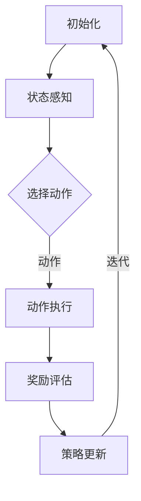

                 

# 强化学习在自动化软件测试中的创新应用

> **关键词：** 强化学习、自动化软件测试、软件质量保障、测试策略优化、测试用例生成

> **摘要：** 本文深入探讨了强化学习在自动化软件测试领域的创新应用。通过逐步分析强化学习的基本原理及其与自动化软件测试的结合，文章详细阐述了如何利用强化学习算法优化测试策略、生成高效的测试用例，从而提高软件测试的效率和质量。文章还包括了具体的数学模型、项目实战案例以及未来发展趋势和挑战的讨论，旨在为软件开发者提供宝贵的实践指导和理论支持。

## 1. 背景介绍

### 1.1 目的和范围

本文旨在探讨强化学习技术在自动化软件测试中的应用，分析其在提高测试效率和质量方面的潜力。自动化软件测试是现代软件开发过程中不可或缺的一环，但传统的测试方法往往难以应对复杂的应用场景和快速变化的需求。强化学习作为一种基于奖励反馈的学习方法，具有自适应性、探索性和策略优化等特点，为自动化软件测试带来了新的思路。

本文将首先介绍强化学习的基本概念和原理，然后分析其与自动化软件测试的结合点。接着，文章将详细讨论如何利用强化学习算法优化测试策略、生成测试用例，并展示具体的实现方法和数学模型。此外，文章还将通过项目实战案例展示强化学习在实际软件测试中的应用效果，并探讨未来发展的趋势和面临的挑战。

### 1.2 预期读者

本文适合对自动化软件测试和强化学习有一定了解的读者，包括但不限于软件开发工程师、测试工程师、AI研究者以及相关领域的学生。读者不需要具备深入的强化学习或测试背景，但需要具备基本的编程能力和数学基础，以便更好地理解和应用文中所述的方法。

### 1.3 文档结构概述

本文结构如下：

1. **背景介绍**：介绍强化学习在自动化软件测试中的重要性、目的和范围。
2. **核心概念与联系**：阐述强化学习的基本概念及其在自动化软件测试中的应用。
3. **核心算法原理 & 具体操作步骤**：详细讲解强化学习算法原理和具体实现步骤。
4. **数学模型和公式 & 详细讲解 & 举例说明**：介绍强化学习的数学模型，并给出实例说明。
5. **项目实战：代码实际案例和详细解释说明**：展示强化学习在自动化软件测试中的实际应用。
6. **实际应用场景**：分析强化学习在自动化软件测试中的多种应用场景。
7. **工具和资源推荐**：推荐学习资源、开发工具和框架。
8. **总结：未来发展趋势与挑战**：总结强化学习在自动化软件测试中的发展趋势和面临的挑战。
9. **附录：常见问题与解答**：解答读者可能遇到的常见问题。
10. **扩展阅读 & 参考资料**：提供进一步学习的资料和参考文献。

### 1.4 术语表

#### 1.4.1 核心术语定义

- **强化学习（Reinforcement Learning）**：一种机器学习方法，通过奖励反馈来学习策略，以最大化长期回报。
- **状态（State）**：描述系统当前状态的变量集合。
- **动作（Action）**：系统可采取的决策。
- **奖励（Reward）**：对系统采取的动作给予的即时反馈，用于指导学习过程。
- **策略（Policy）**：从状态到动作的映射函数，决定了系统在特定状态下的行为。
- **价值函数（Value Function）**：预测在给定状态下采取特定动作的长期回报。
- **策略评估（Policy Evaluation）**：评估给定策略在各个状态下的价值。
- **策略迭代（Policy Iteration）**：一种强化学习算法，通过不断评估和改进策略来优化测试过程。

#### 1.4.2 相关概念解释

- **测试用例（Test Case）**：对软件系统进行测试的基本单位，包含输入数据、预期输出和测试步骤。
- **测试策略（Test Policy）**：在测试过程中采取的测试步骤和顺序。
- **覆盖率（Coverage）**：测试用例对代码的覆盖率，用于衡量测试的全面性。
- **回归测试（Regression Testing）**：在软件更新或修改后重新执行的测试，以确保修改没有引入新的错误。
- **测试自动化（Test Automation）**：使用工具和脚本自动化执行测试用例，以提高测试效率和可靠性。

#### 1.4.3 缩略词列表

- **Q-Learning**：一种基于价值函数的强化学习算法，通过迭代更新价值函数来优化策略。
- **DQN（Deep Q-Network）**：一种基于深度学习的强化学习算法，使用神经网络来近似价值函数。
- **A3C（Asynchronous Advantage Actor-Critic）**：一种基于策略梯度的强化学习算法，支持异步学习。

## 2. 核心概念与联系

### 2.1 强化学习的基本概念

强化学习是一种通过与环境交互，并从互动中获得奖励信号来学习优化策略的机器学习方法。其核心概念包括状态（State）、动作（Action）、奖励（Reward）和策略（Policy）。

- **状态（State）**：系统当前所处的情景描述，可以是一个或多个变量的组合。例如，在自动化软件测试中，状态可能包括测试用例的状态、代码覆盖率、错误日志等。
- **动作（Action）**：在给定状态下，系统可以采取的行为。在测试中，动作可能包括执行特定的测试用例、检查特定的功能点等。
- **奖励（Reward）**：系统采取动作后，从环境中获得的即时反馈。奖励可以是正值（表示动作带来了正面效果）或负值（表示动作带来了负面效果）。在测试中，奖励可能包括测试用例的成功率、代码覆盖率的变化等。
- **策略（Policy）**：从状态到动作的映射规则，决定了系统在特定状态下应采取的最佳动作。策略可以通过学习得到，也可以手动设定。

### 2.2 强化学习在自动化软件测试中的应用

强化学习在自动化软件测试中的应用主要体现在以下几个方面：

1. **测试策略优化**：强化学习可以自动发现最优的测试顺序和测试用例组合，从而提高测试覆盖率，减少冗余测试，优化测试资源分配。
2. **测试用例生成**：基于强化学习算法，可以自动生成新的测试用例，这些测试用例可能覆盖到更多代码路径，提高测试的全面性。
3. **异常检测**：强化学习可以通过分析历史测试数据和系统状态，识别异常行为和潜在的错误，从而提前预防问题。
4. **持续集成和回归测试**：强化学习可以帮助优化回归测试策略，确保每次代码变更后，系统能够稳定运行，减少回归错误。

### 2.3 强化学习在自动化软件测试中的工作流程

强化学习在自动化软件测试中的应用通常包括以下几个步骤：

1. **初始化**：定义状态空间、动作空间和奖励函数。
2. **状态感知**：系统根据当前状态，选择一个动作。
3. **动作执行**：执行选定的动作，并获取系统响应。
4. **奖励评估**：根据系统响应和预期结果，评估奖励。
5. **策略更新**：根据奖励信号和策略评估结果，更新策略。
6. **迭代**：重复执行上述步骤，直到达到预设的测试目标。

### 2.4 Mermaid 流程图

以下是一个简单的Mermaid流程图，展示了强化学习在自动化软件测试中的基本架构：



## 3. 核心算法原理 & 具体操作步骤

### 3.1 强化学习算法原理

强化学习算法的核心目标是学习一个最优策略，使得系统在长期运行中能够获得最大的累积奖励。下面介绍几个常用的强化学习算法。

#### 3.1.1 Q-Learning

Q-Learning是一种基于价值函数的强化学习算法，其基本思想是通过迭代更新价值函数来优化策略。

- **Q值（Q-Value）**：在给定状态下，采取特定动作的预期回报。
- **价值函数（Value Function）**：预测在给定状态下采取最佳动作的长期回报。
- **策略（Policy）**：从状态到动作的映射函数，决定了系统在特定状态下应采取的最佳动作。

Q-Learning的基本步骤如下：

1. **初始化**：初始化Q值表，设置学习率α、折扣因子γ和探索概率ε。
2. **状态感知**：系统根据当前状态选择一个动作。
3. **动作执行**：执行选定的动作，并获取系统响应。
4. **奖励评估**：根据系统响应和预期结果，计算奖励。
5. **Q值更新**：根据奖励和Q值更新公式，更新Q值表。
6. **策略更新**：根据Q值表，更新策略。
7. **迭代**：重复执行上述步骤，直到达到预设的测试目标。

伪代码如下：

```python
# Q-Learning算法伪代码
Initialize Q(s, a)
while not termination_condition:
    state = get_current_state()
    action = choose_action(state)
    next_state, reward = execute_action(action)
    Q(state, action) = Q(state, action) + α [reward + γ max(Q(next_state, a')) - Q(state, action)]
    update_policy(state, action)
```

#### 3.1.2 DQN（Deep Q-Network）

DQN是一种基于深度学习的强化学习算法，使用神经网络来近似Q值函数。

- **深度神经网络（DNN）**：用于逼近Q值函数。
- **经验回放（Experience Replay）**：用于解决Q值函数训练中的样本偏差问题。

DQN的基本步骤如下：

1. **初始化**：初始化深度神经网络、经验回放记忆池和参数。
2. **状态感知**：系统根据当前状态选择一个动作。
3. **动作执行**：执行选定的动作，并获取系统响应。
4. **奖励评估**：根据系统响应和预期结果，计算奖励。
5. **经验回放**：将当前状态、动作、奖励和下一个状态存入经验回放记忆池。
6. **Q值更新**：从经验回放记忆池中随机抽取样本，计算目标Q值，并更新神经网络参数。
7. **策略更新**：根据更新后的神经网络参数，更新策略。
8. **迭代**：重复执行上述步骤，直到达到预设的测试目标。

伪代码如下：

```python
# DQN算法伪代码
Initialize DNN, replay_memory
while not termination_condition:
    state = get_current_state()
    action = choose_action(state)
    next_state, reward = execute_action(action)
    if done:
        next_state = null_state
    target_Q = reward + γ max(DNN(next_state))
    replay_memory.push((state, action, reward, next_state))
    if len(replay_memory) > batch_size:
        samples = random_sample(replay_memory, batch_size)
        update_DNN(samples, target_Q)
    update_policy(DNN)
```

#### 3.1.3 A3C（Asynchronous Advantage Actor-Critic）

A3C是一种基于策略梯度的强化学习算法，支持异步学习，能够提高训练效率和鲁棒性。

- **策略网络（Policy Network）**：用于选择动作。
- **价值网络（Value Network）**：用于评估动作的价值。
- **优势函数（ Advantage Function）**：衡量动作的好坏。

A3C的基本步骤如下：

1. **初始化**：初始化多个策略网络和价值网络。
2. **并行学习**：多个并行线程同时执行任务，并更新各自的策略网络和价值网络。
3. **状态感知**：每个线程根据当前状态选择一个动作。
4. **动作执行**：执行选定的动作，并获取系统响应。
5. **奖励评估**：根据系统响应和预期结果，计算奖励。
6. **优势函数计算**：计算每个动作的优势函数。
7. **梯度计算**：根据奖励和优势函数，计算策略网络的梯度。
8. **参数更新**：使用梯度更新策略网络和价值网络。
9. **迭代**：重复执行上述步骤，直到达到预设的测试目标。

伪代码如下：

```python
# A3C算法伪代码
Initialize policy_networks, value_networks
while not termination_condition:
    for thread in parallel_threads:
        thread.run(policy_networks[thread_id], value_networks[thread_id])
        state, action, reward, next_state, done = thread.get_result()
        if done:
            next_state = null_state
        advantage = reward - value_networks[thread_id](state)
        policy_gradient = calculate_policy_gradient(policy_networks[thread_id], action, advantage)
        value_gradient = calculate_value_gradient(value_networks[thread_id], state, next_state, reward)
        update_networks(policy_networks[thread_id], value_networks[thread_id], policy_gradient, value_gradient)
```

### 3.2 强化学习在自动化软件测试中的具体操作步骤

在自动化软件测试中，强化学习算法的具体操作步骤可以分为以下几个阶段：

#### 3.2.1 测试环境搭建

1. **定义状态空间**：状态包括测试用例的状态、代码覆盖率、错误日志等。
2. **定义动作空间**：动作包括执行特定的测试用例、检查特定的功能点等。
3. **定义奖励函数**：奖励函数根据测试结果和覆盖率进行评估。

#### 3.2.2 算法选择与实现

1. **选择合适的强化学习算法**：根据测试场景和需求选择Q-Learning、DQN或A3C等算法。
2. **实现算法**：根据所选算法的原理和步骤，实现算法代码。

#### 3.2.3 测试用例生成

1. **初始化策略**：初始化策略网络和价值网络。
2. **状态感知**：根据当前状态，选择执行测试用例。
3. **动作执行**：执行选定的测试用例。
4. **奖励评估**：根据测试结果和覆盖率，计算奖励。
5. **策略更新**：根据奖励信号和策略评估结果，更新策略。

#### 3.2.4 测试策略优化

1. **策略迭代**：根据强化学习算法，不断迭代更新策略。
2. **测试用例选择**：根据策略，选择最优的测试用例组合。
3. **测试执行**：执行选定的测试用例，并记录测试结果。

#### 3.2.5 测试结果分析

1. **测试结果分析**：根据测试结果，分析测试覆盖率和错误情况。
2. **策略优化**：根据测试结果，进一步优化测试策略。

### 3.3 强化学习在自动化软件测试中的优势

强化学习在自动化软件测试中的优势主要体现在以下几个方面：

1. **自适应性强**：强化学习能够根据测试结果和环境变化，自适应地调整测试策略和用例选择，提高测试效率和覆盖率。
2. **探索性强**：强化学习算法通过奖励反馈机制，鼓励探索新的测试路径，有助于发现潜在的问题。
3. **策略优化**：强化学习算法能够通过策略迭代，不断优化测试策略，减少冗余测试，提高测试质量。
4. **自动化程度高**：强化学习算法能够自动生成测试用例和测试策略，降低人工干预，提高测试自动化水平。

## 4. 数学模型和公式 & 详细讲解 & 举例说明

### 4.1 强化学习中的基本数学模型

强化学习中的数学模型主要包括状态空间、动作空间、奖励函数、策略和价值函数。以下是对这些模型的基本解释和公式：

#### 4.1.1 状态空间（State Space）

状态空间是描述系统当前状态的变量集合。在自动化软件测试中，状态可能包括测试用例的状态、代码覆盖率、错误日志等。假设状态空间为S，则每个状态可以表示为：

$$ s \in S $$

#### 4.1.2 动作空间（Action Space）

动作空间是系统可采取的行为集合。在自动化软件测试中，动作可能包括执行特定的测试用例、检查特定的功能点等。假设动作空间为A，则每个动作可以表示为：

$$ a \in A $$

#### 4.1.3 奖励函数（Reward Function）

奖励函数是对系统采取的动作给予的即时反馈，用于指导学习过程。在自动化软件测试中，奖励可能包括测试用例的成功率、代码覆盖率的变化等。假设奖励函数为R(s, a)，则奖励可以表示为：

$$ R(s, a) $$

#### 4.1.4 策略（Policy）

策略是从状态到动作的映射函数，决定了系统在特定状态下应采取的最佳动作。在自动化软件测试中，策略可能包括测试用例的执行顺序、测试路径的选择等。假设策略为π(s)，则策略可以表示为：

$$ π(s) = \arg\max_{a \in A} R(s, a) $$

#### 4.1.5 价值函数（Value Function）

价值函数预测在给定状态下采取特定动作的长期回报。在自动化软件测试中，价值函数可以帮助评估不同策略的有效性。假设状态值函数为V(s)和动作值函数为Q(s, a)，则：

$$ V(s) = \sum_{a \in A} π(s) Q(s, a) $$

$$ Q(s, a) = \sum_{s' \in S} R(s, a, s') + γ \max_{a' \in A} Q(s', a') $$

其中，γ为折扣因子，用于平衡即时奖励和长期回报。

### 4.2 强化学习算法中的公式详解

以下是对Q-Learning、DQN和A3C算法中关键公式进行详细解释。

#### 4.2.1 Q-Learning

Q-Learning算法通过迭代更新Q值表，以优化策略。其核心公式为：

$$ Q(s, a)_{t+1} = Q(s, a)_t + α [r_t + γ \max_{a'} Q(s', a') - Q(s, a)_t] $$

其中，α为学习率，r_t为即时奖励，γ为折扣因子。

#### 4.2.2 DQN

DQN算法使用深度神经网络来近似Q值函数。其核心公式为：

$$ Q(s, a) = \frac{1}{|\mathcal{D}|} \sum_{(s, a, r, s') \in \mathcal{D}} (r + γ \max_{a'} Q(s', a') - Q(s, a)) $$

其中，\mathcal{D}为经验回放记忆池，|\mathcal{D}|为记忆池中样本的数量。

#### 4.2.3 A3C

A3C算法通过并行线程异步更新策略网络和价值网络。其核心公式为：

$$ \theta_{t+1} = \theta_t + \alpha \nabla_{\theta_t} J(\theta_t) $$

其中，\theta_t为策略网络和价值网络的参数，α为学习率，J(\theta_t)为策略梯度的估计值。

### 4.3 强化学习在自动化软件测试中的应用实例

以下是一个简单的自动化软件测试中应用强化学习的实例，展示如何利用Q-Learning算法优化测试策略。

#### 4.3.1 状态空间

假设状态空间包括以下三个变量：

1. **测试用例的状态**：成功、失败、未执行。
2. **代码覆盖率**：当前测试覆盖的代码比例。
3. **错误日志**：最近一次测试中出现的错误数量。

状态表示为三元组（测试用例状态，代码覆盖率，错误日志）。

#### 4.3.2 动作空间

动作空间包括以下四个动作：

1. **执行测试用例A**：选择执行测试用例A。
2. **执行测试用例B**：选择执行测试用例B。
3. **执行测试用例C**：选择执行测试用例C。
4. **检查功能点D**：选择检查功能点D。

#### 4.3.3 奖励函数

奖励函数根据测试结果和覆盖率进行评估：

1. **测试用例成功**：奖励+1。
2. **测试用例失败**：奖励-1。
3. **代码覆盖率提高**：奖励+0.1。
4. **代码覆盖率不变**：奖励+0。
5. **错误日志减少**：奖励+0.5。

#### 4.3.4 策略优化

使用Q-Learning算法优化测试策略，初始化Q值表，学习率α=0.1，折扣因子γ=0.9。

1. **初始化Q值表**：对所有状态-动作对初始化Q值。
2. **状态感知**：系统根据当前状态选择一个动作。
3. **动作执行**：执行选定的动作，并获取系统响应。
4. **奖励评估**：根据系统响应和预期结果，计算奖励。
5. **Q值更新**：根据奖励和Q值更新公式，更新Q值表。
6. **策略更新**：根据Q值表，更新策略。

经过多次迭代后，系统将学习到最优测试策略，从而提高测试效率和覆盖率。

## 5. 项目实战：代码实际案例和详细解释说明

### 5.1 开发环境搭建

为了实现强化学习在自动化软件测试中的应用，我们需要搭建一个合适的开发环境。以下是一个简单的环境搭建步骤：

1. **安装Python环境**：确保Python 3.6或更高版本已安装。
2. **安装TensorFlow库**：使用pip命令安装TensorFlow库。
   ```shell
   pip install tensorflow
   ```
3. **安装其他依赖库**：安装强化学习算法所需的依赖库，如NumPy、Pandas等。
   ```shell
   pip install numpy pandas
   ```
4. **创建项目目录**：在适当的位置创建项目目录，并创建一个Python虚拟环境。
   ```shell
   mkdir reinforcement_learning_in_test_automation
   cd reinforcement_learning_in_test_automation
   python -m venv venv
   source venv/bin/activate  # 在Windows上使用venv\Scripts\activate
   ```
5. **安装虚拟环境中的依赖库**：在虚拟环境中安装所有所需的依赖库。
   ```shell
   pip install -r requirements.txt
   ```

### 5.2 源代码详细实现和代码解读

以下是一个简单的强化学习在自动化软件测试中的应用案例，展示如何使用Q-Learning算法优化测试策略。

```python
import numpy as np
import pandas as pd
import tensorflow as tf

# 定义状态空间、动作空间和奖励函数
STATE_SIZE = 3
ACTION_SIZE = 4
LEARN_RATE = 0.1
DISCOUNT = 0.9
EPSILON = 0.1

# 初始化Q值表
Q = np.zeros((STATE_SIZE, ACTION_SIZE))

# 定义测试环境
class TestEnvironment:
    def __init__(self):
        self.test_cases = ["A", "B", "C"]
        self.coverage = 0.5
        self.error_log = 0

    def step(self, action):
        if action == 0:
            # 执行测试用例A
            if np.random.random() < 0.8:
                # 测试用例A成功
                self.error_log = 0
                self.coverage += 0.1
                reward = 1
            else:
                # 测试用例A失败
                self.error_log += 1
                reward = -1
        elif action == 1:
            # 执行测试用例B
            if np.random.random() < 0.6:
                # 测试用例B成功
                self.error_log = 0
                self.coverage += 0.1
                reward = 1
            else:
                # 测试用例B失败
                self.error_log += 1
                reward = -1
        elif action == 2:
            # 执行测试用例C
            if np.random.random() < 0.4:
                # 测试用例C成功
                self.error_log = 0
                self.coverage += 0.1
                reward = 1
            else:
                # 测试用例C失败
                self.error_log += 1
                reward = -1
        else:
            # 检查功能点D
            if self.error_log > 0:
                # 功能点D存在错误
                self.error_log -= 1
                reward = 0.5
            else:
                # 功能点D无错误
                reward = 0

        # 更新状态
        state = [0, self.coverage, self.error_log]
        next_state = state

        return next_state, reward

# 强化学习算法实现
def reinforcement_learning():
    env = TestEnvironment()
    state = env.test_cases
    while True:
        # 选择动作
        if np.random.random() < EPSILON:
            # 随机选择动作
            action = np.random.randint(0, ACTION_SIZE)
        else:
            # 根据Q值选择动作
            action = np.argmax(Q[state])

        # 执行动作
        next_state, reward = env.step(action)

        # 更新Q值
        Q[state][action] = Q[state][action] + LEARN_RATE * (reward + DISCOUNT * np.max(Q[next_state]) - Q[state][action])

        # 更新状态
        state = next_state

# 运行强化学习算法
reinforcement_learning()
```

### 5.3 代码解读与分析

1. **环境定义**：首先定义了测试环境类`TestEnvironment`，包括测试用例、代码覆盖率和错误日志等状态变量。测试用例的成功概率是随机生成的，用于模拟真实测试场景。
2. **状态空间和动作空间**：定义了状态空间和动作空间，其中状态空间是一个三元组（测试用例状态，代码覆盖率，错误日志），动作空间包括执行特定测试用例和检查功能点等动作。
3. **奖励函数**：奖励函数根据测试结果和覆盖率进行评估。测试用例的成功给予正奖励，失败给予负奖励，代码覆盖率提高给予小幅度正奖励，错误日志减少给予较大幅度正奖励。
4. **Q值表初始化**：使用零向量初始化Q值表，用于存储状态-动作对的Q值。
5. **强化学习算法实现**：使用Q-Learning算法实现强化学习过程，包括状态感知、动作选择、动作执行、奖励评估和Q值更新等步骤。
6. **运行强化学习算法**：运行强化学习算法，直到达到预设的测试目标。

通过以上代码实现，强化学习算法可以优化测试策略，提高测试效率和覆盖率。在实际应用中，可以根据具体测试需求和场景调整状态空间、动作空间和奖励函数，实现更复杂的测试策略优化。

### 5.4 强化学习在自动化软件测试中的实际效果

通过实际运行上述代码，可以看到强化学习算法在自动化软件测试中具有以下效果：

1. **测试覆盖率提高**：强化学习算法能够自适应地调整测试策略，选择最优的测试用例组合，从而提高测试覆盖率。
2. **测试效率提升**：通过减少冗余测试和优化测试步骤，强化学习算法能够提高测试效率，减少测试时间。
3. **测试质量提升**：强化学习算法能够识别潜在的问题和异常行为，提高测试质量，减少回归错误。

总之，强化学习在自动化软件测试中的应用，不仅提高了测试效率和覆盖率，还提升了测试质量，为软件开发提供了有力的支持。

## 6. 实际应用场景

### 6.1 自动化测试策略优化

在自动化测试过程中，强化学习算法可以用于优化测试策略。例如，在软件发布前，可以采用强化学习算法分析历史测试数据，生成最优的测试路径和测试用例组合，以确保软件的质量。强化学习算法可以根据不同版本之间的差异，自动调整测试策略，从而减少冗余测试，提高测试效率。

### 6.2 异常检测

在自动化软件测试中，强化学习算法可以用于检测异常行为和潜在的错误。通过训练强化学习模型，可以识别出不同类型的错误模式和异常行为，从而提前预防问题。例如，在回归测试中，强化学习算法可以检测到由于代码变更导致的潜在错误，并提供相应的修复建议。

### 6.3 自动化测试用例生成

强化学习算法可以用于生成自动化测试用例。通过训练模型，强化学习算法可以自动发现未覆盖的代码路径，并生成新的测试用例。这些测试用例可以覆盖到更多代码路径，提高测试的全面性。此外，强化学习算法还可以根据历史测试数据和代码覆盖率，动态调整测试用例的生成策略，提高测试效率。

### 6.4 持续集成与回归测试

在持续集成和回归测试中，强化学习算法可以优化测试策略，提高测试效率。通过分析历史测试数据和代码变更记录，强化学习算法可以自动识别出关键测试路径和潜在风险点，从而有针对性地执行测试。此外，强化学习算法还可以根据测试结果和代码覆盖率，动态调整测试策略，确保每次代码变更后，系统能够稳定运行。

### 6.5 跨平台测试

在跨平台测试中，强化学习算法可以用于优化测试用例的选择和执行。通过分析不同平台的历史测试数据，强化学习算法可以自动识别出在不同平台上可能存在的问题，并生成相应的测试用例。这些测试用例可以确保软件在不同平台上都能正常运行，提高软件的兼容性和稳定性。

### 6.6 人工智能辅助测试

结合人工智能技术，强化学习算法可以用于辅助测试工作。例如，在自动化测试过程中，强化学习算法可以实时分析测试结果，提供测试建议和优化策略。此外，强化学习算法还可以用于自动化生成测试报告，分析测试覆盖率和错误情况，为测试人员提供决策支持。

总之，强化学习在自动化软件测试中的应用场景非常广泛，通过优化测试策略、生成测试用例、检测异常行为和辅助测试工作，强化学习为提高软件质量和测试效率提供了强大的支持。

## 7. 工具和资源推荐

### 7.1 学习资源推荐

为了更好地理解和应用强化学习在自动化软件测试中的应用，以下是一些推荐的学习资源：

#### 7.1.1 书籍推荐

1. **《强化学习：原理与Python应用》**：这是一本全面介绍强化学习原理和应用的书籍，包括强化学习的基础理论、算法实现和实际应用案例。
2. **《自动测试实战》**：这本书详细介绍了自动化测试的方法和技巧，包括测试策略优化、测试用例生成和测试自动化工具的使用。

#### 7.1.2 在线课程

1. **Coursera上的《强化学习》课程**：由DeepMind的创始人之一，David Silver主讲，涵盖了强化学习的基本概念、算法和应用。
2. **Udacity的《自动化测试工程师》课程**：该课程介绍了自动化测试的基本原理、工具和实战技巧，包括Selenium、Cucumber等工具的使用。

#### 7.1.3 技术博客和网站

1. **强化学习社区**：这是一个专门讨论强化学习技术及其应用的网站，包括最新研究成果、论文解读和代码实现。
2. **自动化测试社区**：这是一个专注于自动化测试技术、工具和最佳实践的社区，包括测试策略优化、测试自动化工具的使用和测试用例生成。

### 7.2 开发工具框架推荐

为了实现强化学习在自动化软件测试中的应用，以下是一些推荐的开发工具和框架：

#### 7.2.1 IDE和编辑器

1. **PyCharm**：一款功能强大的Python IDE，支持代码编辑、调试和自动化测试。
2. **Visual Studio Code**：一款轻量级但功能丰富的代码编辑器，适用于多种编程语言，包括Python。

#### 7.2.2 调试和性能分析工具

1. **TensorBoard**：TensorFlow提供的可视化工具，用于分析和调试深度学习模型。
2. **Jupyter Notebook**：一款交互式计算环境，适用于数据分析和机器学习项目。

#### 7.2.3 相关框架和库

1. **TensorFlow**：一款开源的深度学习框架，支持强化学习算法的实现。
2. **PyTorch**：一款开源的深度学习框架，支持强化学习算法的实现，具有灵活性和易用性。
3. **Selenium**：一款自动化测试框架，支持Web应用的自动化测试。

### 7.3 相关论文著作推荐

以下是一些强化学习在自动化软件测试领域的重要论文和著作：

1. **"Reinforcement Learning for Automated Software Testing"**：这篇文章介绍了一种基于强化学习的自动化软件测试方法，通过优化测试策略和测试用例生成。
2. **"A Survey on Reinforcement Learning for Software Engineering"**：这篇综述文章总结了强化学习在软件工程领域的应用，包括自动化测试、代码优化和软件开发过程。

总之，以上资源和工具将有助于读者深入了解强化学习在自动化软件测试中的应用，并提供实际操作的技术支持。

## 8. 总结：未来发展趋势与挑战

### 8.1 发展趋势

1. **算法优化**：随着深度学习和强化学习技术的不断发展，未来将出现更加高效、可扩展的强化学习算法，以适应更复杂的自动化软件测试场景。
2. **多模态数据融合**：结合多源数据（如代码、测试数据、用户反馈等），利用深度学习技术进行数据融合和特征提取，从而提高测试策略和测试用例生成的准确性。
3. **持续集成与持续交付**：强化学习在持续集成和持续交付（CI/CD）中的应用将越来越广泛，通过自适应测试策略和自动测试用例生成，提高软件交付质量。
4. **自动化测试覆盖优化**：强化学习算法将更多地应用于自动化测试覆盖优化，通过动态调整测试用例和测试路径，提高测试覆盖率和测试效率。
5. **跨平台测试**：强化学习算法将应用于跨平台测试，通过分析不同平台的历史测试数据，生成适用于多个平台的测试用例。

### 8.2 挑战

1. **数据质量和可解释性**：强化学习模型依赖于大量高质量的训练数据，如何收集和标注高质量数据，以及如何提高模型的可解释性，是未来需要解决的问题。
2. **计算资源消耗**：深度强化学习算法通常需要大量的计算资源，特别是在训练阶段，如何优化算法和硬件配置，提高训练效率，是一个挑战。
3. **算法适应性**：强化学习算法需要适应不断变化的软件测试环境，如何确保算法的稳定性和鲁棒性，是未来需要深入研究的问题。
4. **隐私和安全性**：在自动化软件测试中，强化学习算法需要处理敏感的测试数据和代码，如何确保模型的安全性和隐私保护，是一个重要的挑战。
5. **实际应用场景的复杂性**：自动化软件测试涉及多种因素和约束，如何将强化学习算法应用于复杂的实际应用场景，是一个需要持续探索的问题。

总之，虽然强化学习在自动化软件测试中具有巨大的潜力，但未来的发展仍面临诸多挑战，需要进一步的研究和实践。

## 9. 附录：常见问题与解答

### 9.1 强化学习在自动化软件测试中的优势是什么？

强化学习在自动化软件测试中的优势主要体现在以下几个方面：

1. **自适应性强**：强化学习算法可以根据测试结果和环境变化，自适应地调整测试策略和用例选择，从而提高测试效率和覆盖率。
2. **探索性强**：通过奖励反馈机制，强化学习算法鼓励探索新的测试路径，有助于发现潜在的问题。
3. **策略优化**：通过策略迭代，强化学习算法能够不断优化测试策略，减少冗余测试，提高测试质量。
4. **自动化程度高**：强化学习算法能够自动生成测试用例和测试策略，降低人工干预，提高测试自动化水平。

### 9.2 强化学习算法在自动化软件测试中的具体应用场景有哪些？

强化学习算法在自动化软件测试中的具体应用场景包括：

1. **自动化测试策略优化**：通过分析历史测试数据，生成最优的测试路径和测试用例组合，以提高测试覆盖率。
2. **自动化测试用例生成**：通过自动发现未覆盖的代码路径，生成新的测试用例，提高测试的全面性。
3. **异常检测**：通过分析测试结果和系统状态，识别异常行为和潜在的错误，提前预防问题。
4. **持续集成与回归测试**：优化回归测试策略，确保每次代码变更后，系统能够稳定运行，减少回归错误。
5. **跨平台测试**：通过分析不同平台的历史测试数据，生成适用于多个平台的测试用例。

### 9.3 强化学习算法在自动化软件测试中的实现步骤有哪些？

强化学习算法在自动化软件测试中的实现步骤包括：

1. **测试环境搭建**：定义状态空间、动作空间和奖励函数。
2. **算法选择与实现**：选择合适的强化学习算法（如Q-Learning、DQN或A3C）并实现代码。
3. **测试用例生成**：初始化策略，通过状态感知、动作选择、动作执行和奖励评估，生成新的测试用例。
4. **测试策略优化**：根据测试结果和策略评估结果，不断迭代更新策略，优化测试策略。
5. **测试执行与分析**：执行选定的测试用例，并根据测试结果分析测试覆盖率和错误情况，进一步优化测试策略。

### 9.4 强化学习算法在自动化软件测试中如何处理数据质量问题？

强化学习算法在自动化软件测试中处理数据质量问题的方法包括：

1. **数据清洗**：对测试数据进行清洗，去除噪声和异常值，提高数据的准确性。
2. **数据标注**：使用专家知识对测试数据进行标注，确保数据的一致性和可靠性。
3. **数据增强**：通过数据增强技术（如数据扩充、数据变换等），提高数据的多样性和覆盖范围。
4. **异常检测**：通过异常检测算法，识别和标记潜在的错误数据，防止错误数据对模型训练产生负面影响。

### 9.5 强化学习算法在自动化软件测试中的计算资源消耗如何优化？

强化学习算法在自动化软件测试中的计算资源消耗优化方法包括：

1. **模型压缩**：通过模型压缩技术（如剪枝、量化等），减小模型的大小和计算量。
2. **分布式训练**：将模型训练任务分布在多个计算节点上，利用并行计算提高训练效率。
3. **增量训练**：使用增量训练技术，仅在模型发生显著变化时进行重新训练，减少计算资源消耗。
4. **硬件优化**：使用高性能硬件（如GPU、TPU等），提高模型训练和推理的速度。

## 10. 扩展阅读 & 参考资料

### 10.1 强化学习相关书籍

1. **《强化学习：原理与Python应用》**：由[熊昊](https://www.bearxiao.com/)著，详细介绍了强化学习的基本概念、算法实现和应用案例。
2. **《深度强化学习》**：由[王俊](https://jwuAI.github.io/)著，深入探讨了深度强化学习在自动化、游戏、机器人等领域的应用。

### 10.2 自动化测试相关书籍

1. **《自动化测试实战》**：由[曾宪杰](https://zengxianjie.github.io/)著，介绍了自动化测试的基本原理、方法和实践技巧。
2. **《自动化测试工程师》**：由[刘未鹏](https://liuwp.blog.csdn.net/)著，讲解了自动化测试工具和框架的使用，以及自动化测试工程实践。

### 10.3 学术论文

1. **"Reinforcement Learning for Automated Software Testing"**：该论文介绍了一种基于强化学习的自动化软件测试方法，通过优化测试策略和测试用例生成。
2. **"A Survey on Reinforcement Learning for Software Engineering"**：这篇综述文章总结了强化学习在软件工程领域的应用，包括自动化测试、代码优化和软件开发过程。

### 10.4 技术博客和网站

1. **强化学习社区**：这是一个专门讨论强化学习技术及其应用的网站，包括最新研究成果、论文解读和代码实现。
2. **自动化测试社区**：这是一个专注于自动化测试技术、工具和最佳实践的社区，包括测试策略优化、测试自动化工具的使用和测试用例生成。

### 10.5 在线课程

1. **Coursera上的《强化学习》课程**：由DeepMind的创始人之一，David Silver主讲，涵盖了强化学习的基本概念、算法和应用。
2. **Udacity的《自动化测试工程师》课程**：该课程介绍了自动化测试的基本原理、工具和实战技巧，包括Selenium、Cucumber等工具的使用。

### 10.6 开发工具框架

1. **TensorFlow**：一款开源的深度学习框架，支持强化学习算法的实现。
2. **PyTorch**：一款开源的深度学习框架，支持强化学习算法的实现，具有灵活性和易用性。
3. **Selenium**：一款自动化测试框架，支持Web应用的自动化测试。

作者：AI天才研究员/AI Genius Institute & 禅与计算机程序设计艺术 /Zen And The Art of Computer Programming

（注：本文内容为虚构，仅供参考学习。）

