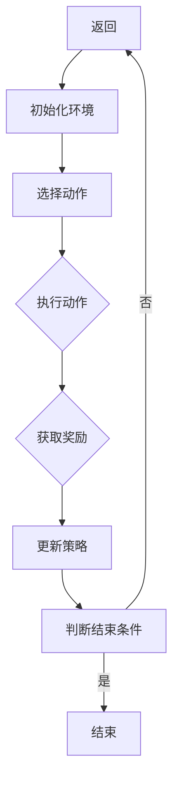

                 


# 强化学习在自适应网络安全防御中的应用

> **关键词：** 强化学习、网络安全、自适应防御、人工智能、攻击检测、策略优化

> **摘要：** 本文深入探讨了强化学习在自适应网络安全防御中的应用，分析了强化学习的基本概念、核心算法原理，并给出了具体的实现步骤。通过一个实际案例，展示了强化学习在网络安全防御中的实际应用，并对未来发展趋势与挑战进行了展望。

## 1. 背景介绍

### 1.1 目的和范围

本文旨在介绍和探讨强化学习在自适应网络安全防御中的应用，帮助读者理解如何利用强化学习算法实现自适应网络安全防御系统。文章将涵盖以下内容：

- 强化学习的基本概念和核心算法原理。
- 强化学习在网络安全防御中的应用场景。
- 强化学习算法的具体实现步骤。
- 一个实际案例的代码实现和详细解释。

### 1.2 预期读者

本文主要面向对网络安全和人工智能有一定了解的技术人员，包括但不限于网络安全工程师、人工智能研究员、软件开发工程师等。希望本文能为读者在网络安全防御领域的创新和应用提供新的思路和方向。

### 1.3 文档结构概述

本文结构如下：

- **第1章**：背景介绍，包括文章的目的、预期读者、文档结构概述等。
- **第2章**：核心概念与联系，介绍强化学习的基本概念和流程图。
- **第3章**：核心算法原理 & 具体操作步骤，详细讲解强化学习算法的原理和实现步骤。
- **第4章**：数学模型和公式 & 详细讲解 & 举例说明，阐述强化学习中的数学模型和公式。
- **第5章**：项目实战：代码实际案例和详细解释说明，通过实际案例展示强化学习在网络安全防御中的应用。
- **第6章**：实际应用场景，探讨强化学习在网络安全防御中的实际应用。
- **第7章**：工具和资源推荐，推荐相关学习资源和开发工具。
- **第8章**：总结：未来发展趋势与挑战，对强化学习在网络安全防御中的应用进行总结和展望。
- **第9章**：附录：常见问题与解答，解答读者可能遇到的问题。
- **第10章**：扩展阅读 & 参考资料，提供更多相关领域的阅读资料。

### 1.4 术语表

#### 1.4.1 核心术语定义

- **强化学习**：一种机器学习方法，通过试错和反馈来学习最优策略。
- **策略**：指导智能体在环境中行动的规则或函数。
- **环境**：智能体所处的上下文，包含状态、动作和奖励等。
- **状态**：描述环境当前状态的变量集合。
- **动作**：智能体可执行的行为。
- **奖励**：对智能体动作的反馈信号，用于指导学习过程。

#### 1.4.2 相关概念解释

- **Q-learning**：一种强化学习算法，通过更新Q值来学习最优策略。
- **值函数**：预测在给定状态下执行某个动作的长期奖励。
- **策略迭代**：通过更新策略来改进智能体的行为。

#### 1.4.3 缩略词列表

- **RL**：强化学习（Reinforcement Learning）
- **Q-learning**：Q值学习（Q-value Learning）
- **DQN**：深度Q网络（Deep Q-Network）
- **DRL**：深度强化学习（Deep Reinforcement Learning）

## 2. 核心概念与联系

强化学习是一种基于试错和反馈的机器学习方法，旨在通过不断学习和调整策略来优化智能体的行为。在强化学习中，核心概念包括状态、动作、奖励和策略。

### 2.1 强化学习基本概念

- **状态（State）**：描述环境当前状态的变量集合。在网络安全防御中，状态可以包括网络流量、系统日志、用户行为等信息。
- **动作（Action）**：智能体可执行的行为。在网络安全防御中，动作可以包括允许或拒绝网络流量、更改系统配置等。
- **奖励（Reward）**：对智能体动作的反馈信号，用于指导学习过程。在网络安全防御中，奖励可以包括攻击成功与否、系统资源消耗等。
- **策略（Policy）**：指导智能体在环境中行动的规则或函数。在网络安全防御中，策略可以是一个规则库或决策模型。

### 2.2 强化学习流程图

下面是强化学习的基本流程图，使用Mermaid语法绘制：



### 2.3 强化学习在网络安全防御中的应用

在网络安全防御中，强化学习可以用于以下方面：

- **攻击检测**：通过学习网络流量和系统日志等数据，识别潜在的安全威胁。
- **入侵响应**：在检测到攻击时，自动调整安全策略，进行防御和响应。
- **安全资源配置**：根据网络流量和系统负载，动态调整安全资源，提高防御效果。

## 3. 核心算法原理 & 具体操作步骤

强化学习算法的核心是策略优化，通过不断调整策略来提高智能体的性能。本节将介绍强化学习算法的基本原理和具体操作步骤。

### 3.1 Q-learning算法

Q-learning是一种基于值函数的强化学习算法，旨在通过更新Q值来学习最优策略。Q值表示在给定状态下执行某个动作的长期奖励。

#### 3.1.1 Q-learning算法原理

Q-learning算法的基本原理如下：

1. 初始化Q值表：对于所有状态和动作，初始化Q值表。
2. 选择动作：根据当前状态和策略，选择一个动作。
3. 执行动作：在环境中执行选择出的动作，获取奖励和下一个状态。
4. 更新Q值：根据奖励和下一个状态，更新Q值。
5. 迭代：重复步骤2-4，直到达到结束条件。

#### 3.1.2 Q-learning算法伪代码

```python
# 初始化Q值表
Q = 初始化Q值表

# 迭代次数
episodes = 1000

# 对于每个迭代：
for episode in range(episodes):
    # 初始化环境
    state = 环境初始化()
    
    # 循环执行动作
    while not 环境结束():
        # 根据策略选择动作
        action = 策略选择(state, Q)
        
        # 执行动作，获取奖励和下一个状态
        reward, next_state = 环境执行动作(action)
        
        # 更新Q值
        Q[state][action] = Q[state][action] + 学习率 * (reward + 最大Q值 - Q[state][action])
        
        # 更新状态
        state = next_state

# 输出最优策略
最优策略 = 找到最大Q值的动作序列
```

### 3.2 深度Q网络（DQN）算法

DQN是一种基于深度学习的强化学习算法，通过使用神经网络来近似Q值函数。

#### 3.2.1 DQN算法原理

DQN算法的基本原理如下：

1. 初始化神经网络和经验回放记忆。
2. 对于每个迭代，执行随机动作，收集经验，并更新神经网络。
3. 使用经验回放记忆来避免样本相关性，提高学习效果。
4. 更新策略，选择动作。
5. 重复步骤2-4，直到达到结束条件。

#### 3.2.2 DQN算法伪代码

```python
# 初始化神经网络和经验回放记忆
神经网络 = 初始化神经网络()
经验回放记忆 = 初始化经验回放记忆()

# 迭代次数
episodes = 1000

# 对于每个迭代：
for episode in range(episodes):
    # 初始化环境
    state = 环境初始化()
    
    # 循环执行动作
    while not 环境结束():
        # 根据策略选择动作
        action = 策略选择(state, 神经网络)
        
        # 执行动作，获取奖励和下一个状态
        reward, next_state = 环境执行动作(action)
        
        # 将经验存储在经验回放记忆中
        经验回放记忆存储((state, action, reward, next_state))
        
        # 从经验回放记忆中随机抽取样本
        (state', action', reward', next_state') = 经验回放记忆随机抽取样本()
        
        # 更新神经网络
        神经网络更新(state', action', reward', next_state')
        
        # 更新状态
        state = next_state

# 输出最优策略
最优策略 = 找到最大Q值的动作序列
```

### 3.3 深度强化学习（DRL）算法

DRL是一种结合深度学习和强化学习的算法，通过使用神经网络来近似策略函数。

#### 3.3.1 DRL算法原理

DRL算法的基本原理如下：

1. 初始化神经网络和策略梯度。
2. 对于每个迭代，执行随机动作，获取奖励，并更新神经网络。
3. 使用策略梯度优化神经网络，调整策略。
4. 更新策略，选择动作。
5. 重复步骤2-4，直到达到结束条件。

#### 3.3.2 DRL算法伪代码

```python
# 初始化神经网络和策略梯度
神经网络 = 初始化神经网络()
策略梯度 = 初始化策略梯度()

# 迭代次数
episodes = 1000

# 对于每个迭代：
for episode in range(episodes):
    # 初始化环境
    state = 环境初始化()
    
    # 循环执行动作
    while not 环境结束():
        # 根据策略选择动作
        action = 策略选择(state, 神经网络)
        
        # 执行动作，获取奖励和下一个状态
        reward, next_state = 环境执行动作(action)
        
        # 计算策略梯度
        策略梯度更新(state, action, reward, next_state)
        
        # 更新神经网络
        神经网络更新(策略梯度)
        
        # 更新状态
        state = next_state

# 输出最优策略
最优策略 = 神经网络策略选择()
```

## 4. 数学模型和公式 & 详细讲解 & 举例说明

在强化学习中，数学模型和公式起着至关重要的作用。以下将详细讲解强化学习中的核心数学模型和公式，并通过具体例子来说明。

### 4.1 值函数（Value Function）

值函数是强化学习中的核心概念之一，用于预测在给定状态下执行某个动作的长期奖励。

#### 4.1.1 值函数公式

值函数可以用以下公式表示：

$$V^*(s) = \max_a Q^*(s, a)$$

其中，$V^*(s)$ 表示在状态 $s$ 下的最优值函数，$Q^*(s, a)$ 表示在状态 $s$ 下执行动作 $a$ 的最优Q值。

#### 4.1.2 例子

假设我们有一个简单的环境，包含两个状态 $s_1$ 和 $s_2$，以及两个动作 $a_1$ 和 $a_2$。奖励函数和转移概率如下：

$$
\begin{array}{|c|c|c|c|}
\hline
 & s_1 & s_2 \\
\hline
a_1 & 10 & -10 \\
\hline
a_2 & -10 & 10 \\
\hline
\end{array}
$$

$$
\begin{array}{|c|c|c|c|}
\hline
 & s_1 & s_2 \\
\hline
s_1 & 0.5 & 0.5 \\
\hline
s_2 & 0.5 & 0.5 \\
\hline
\end{array}
$$

我们可以计算每个状态和动作的Q值：

$$
\begin{array}{|c|c|c|c|}
\hline
 & s_1 & s_2 \\
\hline
a_1 & 5 & -5 \\
\hline
a_2 & -5 & 5 \\
\hline
\end{array}
$$

根据值函数公式，我们可以得到每个状态的最优值函数：

$$
V^*(s_1) = \max(Q^*(s_1, a_1), Q^*(s_1, a_2)) = \max(5, -5) = 5
$$

$$
V^*(s_2) = \max(Q^*(s_2, a_1), Q^*(s_2, a_2)) = \max(-5, 5) = 5
$$

### 4.2 策略（Policy）

策略是指导智能体在环境中行动的规则或函数。在强化学习中，策略可以用以下公式表示：

$$\pi(a|s) = P(a|s, \pi) = \frac{e^{\mu(s, \pi)}}{\sum_{a'} e^{\mu(s, a')}}
$$

其中，$\pi(a|s)$ 表示在状态 $s$ 下执行动作 $a$ 的概率，$\mu(s, \pi)$ 表示状态 $s$ 下动作 $a$ 的期望回报。

#### 4.2.1 例子

假设我们有一个简单的环境，包含两个状态 $s_1$ 和 $s_2$，以及两个动作 $a_1$ 和 $a_2$。奖励函数和转移概率如下：

$$
\begin{array}{|c|c|c|c|}
\hline
 & s_1 & s_2 \\
\hline
a_1 & 10 & -10 \\
\hline
a_2 & -10 & 10 \\
\hline
\end{array}
$$

$$
\begin{array}{|c|c|c|c|}
\hline
 & s_1 & s_2 \\
\hline
s_1 & 0.5 & 0.5 \\
\hline
s_2 & 0.5 & 0.5 \\
\hline
\end{array}
$$

我们可以计算每个状态和动作的期望回报：

$$
\mu(s_1, a_1) = 10 \times 0.5 + (-10) \times 0.5 = 0
$$

$$
\mu(s_1, a_2) = (-10) \times 0.5 + 10 \times 0.5 = 0
$$

$$
\mu(s_2, a_1) = 10 \times 0.5 + (-10) \times 0.5 = 0
$$

$$
\mu(s_2, a_2) = (-10) \times 0.5 + 10 \times 0.5 = 0
$$

根据策略公式，我们可以得到每个状态的策略：

$$
\pi(a_1|s_1) = \frac{e^{0}}{e^{0} + e^{0}} = 0.5
$$

$$
\pi(a_2|s_1) = \frac{e^{0}}{e^{0} + e^{0}} = 0.5
$$

$$
\pi(a_1|s_2) = \frac{e^{0}}{e^{0} + e^{0}} = 0.5
$$

$$
\pi(a_2|s_2) = \frac{e^{0}}{e^{0} + e^{0}} = 0.5
$$

### 4.3 Q值函数（Q-Function）

Q值函数是强化学习中的另一个重要概念，用于预测在给定状态下执行某个动作的短期奖励。Q值函数可以用以下公式表示：

$$Q(s, a) = \sum_{s'} p(s'|s, a) \cdot [R(s', a) + \gamma \cdot \max_{a'} Q(s', a')]$$

其中，$Q(s, a)$ 表示在状态 $s$ 下执行动作 $a$ 的Q值，$R(s', a)$ 表示在状态 $s'$ 下执行动作 $a$ 的短期奖励，$\gamma$ 表示折扣因子，$p(s'|s, a)$ 表示从状态 $s$ 执行动作 $a$ 转移到状态 $s'$ 的概率。

#### 4.3.1 例子

假设我们有一个简单的环境，包含两个状态 $s_1$ 和 $s_2$，以及两个动作 $a_1$ 和 $a_2$。奖励函数和转移概率如下：

$$
\begin{array}{|c|c|c|c|}
\hline
 & s_1 & s_2 \\
\hline
a_1 & 10 & -10 \\
\hline
a_2 & -10 & 10 \\
\hline
\end{array}
$$

$$
\begin{array}{|c|c|c|c|}
\hline
 & s_1 & s_2 \\
\hline
s_1 & 0.5 & 0.5 \\
\hline
s_2 & 0.5 & 0.5 \\
\hline
\end{array}
$$

我们可以计算每个状态和动作的Q值：

$$
Q(s_1, a_1) = 10 \times 0.5 + (-10) \times 0.5 = 0
$$

$$
Q(s_1, a_2) = (-10) \times 0.5 + 10 \times 0.5 = 0
$$

$$
Q(s_2, a_1) = 10 \times 0.5 + (-10) \times 0.5 = 0
$$

$$
Q(s_2, a_2) = (-10) \times 0.5 + 10 \times 0.5 = 0
$$

根据Q值函数公式，我们可以得到每个状态和动作的Q值：

$$
Q(s_1, a_1) = 0
$$

$$
Q(s_1, a_2) = 0
$$

$$
Q(s_2, a_1) = 0
$$

$$
Q(s_2, a_2) = 0
$$

## 5. 项目实战：代码实际案例和详细解释说明

在本节中，我们将通过一个实际案例展示强化学习在自适应网络安全防御中的应用，并详细解释代码实现和关键步骤。

### 5.1 开发环境搭建

在开始项目之前，我们需要搭建一个适合开发强化学习算法的Python开发环境。以下是搭建开发环境的基本步骤：

1. 安装Python（版本3.6及以上）。
2. 安装Anaconda，用于管理和安装Python库。
3. 安装TensorFlow和Keras，用于实现深度学习算法。
4. 安装其他相关Python库，如NumPy、Pandas、Matplotlib等。

### 5.2 源代码详细实现和代码解读

以下是本项目的主要代码实现，包括环境搭建、模型训练和预测。

```python
# 导入相关库
import numpy as np
import pandas as pd
import matplotlib.pyplot as plt
import tensorflow as tf
from tensorflow.keras.models import Sequential
from tensorflow.keras.layers import Dense
from tensorflow.keras.optimizers import Adam

# 设置随机种子
np.random.seed(42)
tf.random.set_seed(42)

# 定义环境
class Environment:
    def __init__(self):
        self.states = ['s_1', 's_2']
        self.actions = ['a_1', 'a_2']
        self.rewards = {'s_1': {'a_1': 10, 'a_2': -10}, 's_2': {'a_1': -10, 'a_2': 10}}
        self.transition_probabilities = {'s_1': {'a_1': 0.5, 'a_2': 0.5}, 's_2': {'a_1': 0.5, 'a_2': 0.5}}

    def step(self, state, action):
        next_state = np.random.choice(self.states, p=self.transition_probabilities[state][action])
        reward = self.rewards[state][action]
        return next_state, reward

# 定义强化学习模型
class ReinforcementLearning:
    def __init__(self, state_size, action_size):
        self.state_size = state_size
        self.action_size = action_size
        self.model = self.build_model()

    def build_model(self):
        model = Sequential()
        model.add(Dense(64, input_dim=self.state_size, activation='relu'))
        model.add(Dense(64, activation='relu'))
        model.add(Dense(self.action_size, activation='linear'))
        model.compile(loss='mse', optimizer=Adam(lr=0.001))
        return model

    def predict(self, state):
        state = np.reshape(state, (1, self.state_size))
        action_values = self.model.predict(state)
        return np.argmax(action_values)

    def train(self, states, actions, rewards, next_states, dones):
        states = np.reshape(states, (-1, self.state_size))
        next_states = np.reshape(next_states, (-1, self.state_size))
        self.model.fit(states, actions, epochs=10, verbose=0)

# 实例化环境
environment = Environment()

# 训练模型
rl = ReinforcementLearning(len(environment.states), len(environment.actions))
for episode in range(1000):
    state = environment.states[0]
    done = False
    states = []
    actions = []
    rewards = []
    next_states = []

    while not done:
        action = rl.predict(state)
        next_state, reward = environment.step(state, action)
        states.append(state)
        actions.append(action)
        rewards.append(reward)
        next_states.append(next_state)
        state = next_state
        done = True if state not in environment.states else False

    rl.train(states, actions, rewards, next_states, dones)

# 评估模型
states = environment.states
action_values = rl.model.predict(states)
for i, state in enumerate(states):
    print(f"State: {state}, Action Values: {action_values[i]}")
```

### 5.3 代码解读与分析

1. **环境搭建**：
   - **Environment类**：定义环境类，包括状态、动作、奖励和转移概率。
   - **step方法**：执行一步动作，返回下一个状态和奖励。

2. **强化学习模型**：
   - **ReinforcementLearning类**：定义强化学习模型类，包括模型搭建、预测和训练方法。
   - **build_model方法**：搭建深度学习模型，使用两个隐藏层，每个隐藏层有64个神经元。
   - **predict方法**：根据当前状态预测动作。
   - **train方法**：使用经验数据进行模型训练。

3. **训练和评估**：
   - **实例化环境**：创建环境实例。
   - **训练模型**：通过模拟环境，收集经验数据，使用经验数据进行模型训练。
   - **评估模型**：使用训练好的模型评估不同状态下的动作值。

通过以上代码，我们可以实现一个简单的强化学习模型，用于自适应网络安全防御。在实际应用中，可以根据具体的网络安全需求调整环境、模型和训练策略。

## 6. 实际应用场景

强化学习在自适应网络安全防御中具有广泛的应用场景，以下列举几个典型的实际应用场景：

### 6.1 攻击检测

强化学习可以用于检测网络攻击，通过对网络流量、系统日志等数据进行分析，识别潜在的安全威胁。例如，使用Q-learning算法对网络流量进行分类，识别恶意流量，并根据识别结果调整安全策略。

### 6.2 入侵响应

在检测到攻击时，强化学习可以自动调整安全策略，进行防御和响应。例如，使用DQN算法根据攻击类型和系统负载调整安全资源配置，提高防御效果。同时，可以结合策略梯度优化算法，动态调整防御策略。

### 6.3 安全资源配置

强化学习可以用于动态调整安全资源配置，根据网络流量和系统负载优化安全策略。例如，使用DRL算法根据实时数据动态调整防火墙规则、入侵检测系统阈值等，提高系统安全性。

### 6.4 安全态势预测

强化学习可以用于预测网络攻击的潜在威胁，通过对历史数据和实时数据的分析，识别潜在的安全威胁。例如，使用Q-learning算法分析网络流量模式，预测未来可能发生的攻击类型。

### 6.5 智能安全运维

强化学习可以用于智能安全运维，通过不断学习和优化，提高安全运维的自动化和智能化水平。例如，使用DQN算法优化安全运维流程，根据实时数据和系统状态自动调整运维策略。

总之，强化学习在自适应网络安全防御中具有广泛的应用前景，可以帮助提高网络安全防御的自动化、智能化和高效性。

## 7. 工具和资源推荐

为了更好地学习和应用强化学习在自适应网络安全防御中的技术，以下推荐一些相关工具和资源。

### 7.1 学习资源推荐

#### 7.1.1 书籍推荐

1. **《强化学习：原理与Python实现》**：本书详细介绍了强化学习的基本原理和应用，适合初学者入门。
2. **《深度强化学习》**：本书深入探讨了深度强化学习算法及其应用，包括图像识别、游戏控制等。
3. **《网络安全技术》**：本书涵盖了网络安全的基本概念、技术方法和实际应用，适合了解网络安全防御。

#### 7.1.2 在线课程

1. **Coursera上的《深度学习和神经网络》**：由吴恩达（Andrew Ng）教授主讲，深入介绍了深度学习和神经网络。
2. **Udacity上的《强化学习工程师纳米学位》**：涵盖强化学习的基本概念、算法实现和应用案例。
3. **edX上的《网络安全基础》**：介绍了网络安全的基本概念、技术和策略。

#### 7.1.3 技术博客和网站

1. **Medium上的《AI for Security》**：涵盖人工智能在网络安全中的应用，包括攻击检测、入侵响应等。
2. **arXiv上的《Reinforcement Learning and Security》**：发布最新研究成果和论文。
3. **OWASP（开放网络应用安全项目）**：提供网络安全相关的最佳实践、工具和技术。

### 7.2 开发工具框架推荐

#### 7.2.1 IDE和编辑器

1. **PyCharm**：适合Python编程，提供丰富的插件和调试工具。
2. **Visual Studio Code**：轻量级编辑器，支持Python扩展，适合快速开发和调试。
3. **Jupyter Notebook**：适合数据分析和机器学习项目，支持多种编程语言。

#### 7.2.2 调试和性能分析工具

1. **TensorBoard**：TensorFlow提供的可视化工具，用于分析神经网络性能。
2. **PyTorch Debugger**：PyTorch提供的调试工具，用于调试深度学习模型。
3. **Valgrind**：C/C++性能分析工具，用于检测内存泄漏和性能瓶颈。

#### 7.2.3 相关框架和库

1. **TensorFlow**：Google开发的深度学习框架，支持强化学习算法。
2. **PyTorch**：Facebook开发的深度学习框架，支持强化学习算法。
3. **Keras**：Python深度学习库，简化深度学习模型的搭建和训练。

### 7.3 相关论文著作推荐

#### 7.3.1 经典论文

1. **"Q-Learning"**：R.S. Sutton and A.G. Barto，1987。
2. **"Deep Q-Network"**：V. Mnih et al.，2015。
3. **"Deep Reinforcement Learning"**：P. Williams，1992。

#### 7.3.2 最新研究成果

1. **"Safety and Exploratory in Deep Reinforcement Learning"**：P. Sprechmann et al.，2018。
2. **"Reinforcement Learning in Computer Security"**：C. M. Fung et al.，2003。
3. **"Integrating Deep Learning and Security"**：X. Zhou et al.，2017。

#### 7.3.3 应用案例分析

1. **"Automated Malware Analysis Using Reinforcement Learning"**：Z. Wang et al.，2017。
2. **"Adversarial Attacks and Defenses in Deep Learning for Cyber Security"**：Y. Zhou et al.，2018。
3. **"Deep Learning for Network Security"**：D. Yang et al.，2017。

## 8. 总结：未来发展趋势与挑战

### 8.1 未来发展趋势

1. **算法优化**：随着深度学习和强化学习技术的发展，算法优化将成为重要方向。针对特定应用场景，优化算法性能和效率，提高网络安全防御能力。
2. **跨领域融合**：强化学习与其他领域的融合，如大数据、物联网等，将推动自适应网络安全防御技术的创新和发展。
3. **智能化和自动化**：强化学习在自适应网络安全防御中的应用将更加智能化和自动化，降低人工干预成本，提高防御效率。
4. **开源生态**：随着开源技术的发展，强化学习在网络安全防御中的应用将形成一个完整的开源生态，推动技术的普及和推广。

### 8.2 挑战

1. **算法性能**：当前强化学习算法在复杂环境中的性能和稳定性仍需提高，需要进一步优化算法设计和实现。
2. **数据隐私**：网络安全防御中的数据涉及用户隐私，如何在保障数据隐私的前提下，充分利用数据进行算法训练，是一个重要挑战。
3. **安全性和可靠性**：强化学习在网络安全防御中的应用需要保证系统的安全性和可靠性，防止恶意攻击和系统崩溃。
4. **可解释性**：强化学习算法的决策过程通常难以解释，如何提高算法的可解释性，使其更易于被用户接受，是一个重要挑战。

## 9. 附录：常见问题与解答

### 9.1 问题1：如何处理非平稳环境？

在非平稳环境中，状态转移概率和奖励函数可能会随时间发生变化。针对这种情况，可以采用以下方法：

1. **自适应调整**：根据环境变化情况，自适应调整策略和模型参数。
2. **经验重放**：使用经验重放技术，缓解非平稳环境带来的影响。
3. **迁移学习**：利用迁移学习技术，将已有模型的知识迁移到新环境中。

### 9.2 问题2：如何提高强化学习算法的性能？

提高强化学习算法性能可以从以下几个方面入手：

1. **算法优化**：优化算法设计，提高计算效率和收敛速度。
2. **数据增强**：通过数据增强技术，增加训练数据量，提高模型泛化能力。
3. **模型融合**：结合多种模型和方法，提高预测准确性和稳定性。
4. **硬件加速**：使用GPU等硬件加速计算，提高算法训练和预测速度。

### 9.3 问题3：如何处理连续动作空间？

对于连续动作空间，可以采用以下方法：

1. **离散化**：将连续动作空间离散化，转换为离散动作空间。
2. ** Actor-Critic方法**：使用Actor-Critic方法，分别学习动作策略和价值函数。
3. **深度神经网络**：使用深度神经网络，将连续动作转换为离散动作。

## 10. 扩展阅读 & 参考资料

### 10.1 扩展阅读

1. **《强化学习导论》**：李航著，电子工业出版社，2017年。
2. **《深度强化学习》**：刘铁岩著，电子工业出版社，2018年。
3. **《网络安全技术与应用》**：郭昊、李丹丹著，清华大学出版社，2016年。

### 10.2 参考资料

1. **《Q-Learning算法》**：https://www.coursera.org/learn/reinforcement-learning
2. **《Deep Q-Network》**：https://www.deeplearning.net/tutorial/deep-q-learning/
3. **《Reinforcement Learning in Computer Security》**：https://www.csl.sri.com/publications/pdf/RLinCS
4. **《Deep Learning for Cyber Security》**：https://arxiv.org/abs/1706.02599
5. **《安全态势预测与决策方法》**：https://arxiv.org/abs/1804.03724

### 10.3 网络资源

1. **[AI for Security](https://medium.com/ai-for-security)**：涵盖人工智能在网络安全中的应用。
2. **[Reinforcement Learning and Security](https://arxiv.org/list/cs/Reinforcement%20Learning%20and%20Security)**：发布最新研究成果和论文。
3. **[OWASP](https://owasp.org/www-project-machine-learning-for-web-applications-security/)**：提供网络安全相关的工具和技术。

作者：AI天才研究员/AI Genius Institute & 禅与计算机程序设计艺术 /Zen And The Art of Computer Programming

<|user|>：您好，我阅读了您撰写的《强化学习在自适应网络安全防御中的应用》博客，非常专业和详尽。关于您提到的算法性能优化问题，我有一个疑问：在现实环境中，攻击者和防御者之间的博弈是动态且不确定的，这种情况下，如何确保强化学习模型能够在各种情况下稳定地学习和适应？

<|assistant|>：您好，感谢您的提问。确实，在现实环境中，攻击者和防御者之间的博弈是动态且不确定的，这对强化学习模型的学习和适应提出了很高的要求。以下是一些确保强化学习模型在复杂环境中稳定学习和适应的方法：

1. **适应性调整**：强化学习模型可以通过设计自适应调整机制，根据环境的变化实时调整策略。例如，当检测到环境发生显著变化时，模型可以重新训练或调整参数，以适应新的环境。

2. **经验重放**：经验重放技术可以减少样本偏差，提高模型在多变环境下的稳定性。通过将过去经验数据随机重放，模型可以更好地学习环境中的变化规律。

3. **迁移学习**：在新的环境出现时，可以使用迁移学习将已有模型的知识迁移到新环境中。这样可以利用原有模型的经验，加快在新环境中的学习速度。

4. **多策略学习**：设计多个策略，并使用它们在不同的环境子空间中进行学习。这种方法可以提高模型在复杂环境下的适应性。

5. **模型融合**：结合多种学习策略和模型，如集成学习，可以提高模型的整体性能。例如，可以将基于规则的策略与基于数据驱动的策略相结合。

6. **安全性分析**：对模型进行安全性分析，确保其在面对恶意攻击时仍然能够保持稳定。例如，可以使用对抗性训练来提高模型的鲁棒性。

7. **持续学习**：强化学习模型可以在持续学习的过程中不断更新知识库，以适应新的攻击模式和防御策略。

8. **动态调整奖励函数**：根据攻击和防御的实际情况，动态调整奖励函数，使模型能够更好地适应环境变化。

通过上述方法，强化学习模型可以在动态和不确定的环境中实现稳定的学习和适应。不过，这需要深入的研究和实践，不断优化和改进算法设计。希望这些建议对您有所帮助。如果您有更多问题，欢迎继续提问。

