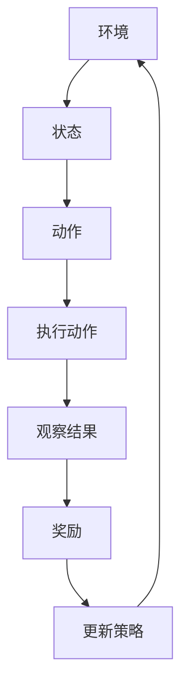

                 

# 强化学习在自适应网络路由中的应用

> 关键词：强化学习，自适应网络路由，Q-Learning，神经网络，路由优化，算法原理，数学模型，项目实战

> 摘要：本文深入探讨了强化学习在自适应网络路由中的应用，通过详细解析其核心概念、算法原理和数学模型，结合实际项目案例，展示了强化学习如何有效提高网络路由的灵活性和效率。文章旨在为读者提供从理论到实践的全面理解，帮助网络工程师和研究者更好地应用这一先进技术。

## 1. 背景介绍

### 1.1 目的和范围

本文的目标是介绍和探讨强化学习在自适应网络路由中的应用。随着互联网的快速发展和网络流量的持续增长，网络路由的效率和稳定性变得尤为重要。传统路由算法在面对复杂网络环境和动态流量变化时，往往表现出较低的适应性和效率。强化学习作为一种先进的人工智能技术，通过学习环境和策略的交互，能够实现自适应路由，提高网络性能。

本文将首先介绍强化学习的基本概念和原理，然后探讨其在网络路由中的具体应用，包括Q-Learning算法和神经网络路由策略。随后，我们将通过实际项目案例，展示强化学习在自适应网络路由中的具体实现，并对相关数学模型进行详细解释。最后，我们将讨论强化学习在网络路由中的实际应用场景，并推荐相关学习资源和开发工具。

### 1.2 预期读者

本文面向网络工程师、AI研究者以及对强化学习在自适应网络路由应用感兴趣的读者。读者应具备基本的计算机网络和人工智能知识，以便更好地理解文章内容。

### 1.3 文档结构概述

本文分为十个主要部分：

1. **背景介绍**：介绍本文的目的、范围、预期读者和文档结构。
2. **核心概念与联系**：介绍强化学习和网络路由的基本概念，并提供相关的流程图。
3. **核心算法原理 & 具体操作步骤**：详细阐述Q-Learning算法和神经网络路由策略。
4. **数学模型和公式 & 详细讲解 & 举例说明**：介绍强化学习中的数学模型，并给出具体例子。
5. **项目实战：代码实际案例和详细解释说明**：通过实际项目展示强化学习在自适应网络路由中的应用。
6. **实际应用场景**：讨论强化学习在网络路由中的实际应用。
7. **工具和资源推荐**：推荐学习资源、开发工具和相关论文。
8. **总结：未来发展趋势与挑战**：总结本文内容和展望未来趋势。
9. **附录：常见问题与解答**：回答读者可能遇到的问题。
10. **扩展阅读 & 参考资料**：提供进一步阅读的资源。

### 1.4 术语表

#### 1.4.1 核心术语定义

- **强化学习**：一种机器学习方法，通过试错和奖励反馈来学习如何在特定环境中做出最佳决策。
- **自适应网络路由**：网络路由算法能够根据网络状态和流量动态调整路由策略，以提高网络性能。
- **Q-Learning**：一种基于值函数的强化学习算法，用于估计策略的最优值。
- **神经网络**：一种模拟人脑神经元之间连接结构的计算模型，常用于复杂模式的识别和学习。

#### 1.4.2 相关概念解释

- **路由策略**：网络路由算法选择的路径选择策略。
- **状态空间**：网络中所有可能状态的总和。
- **动作空间**：网络中所有可能动作的总和。
- **奖励函数**：根据动作结果给予的奖励或惩罚。

#### 1.4.3 缩略词列表

- **RL**：强化学习（Reinforcement Learning）
- **Q-Learning**：Q值学习（Q-value Learning）
- **ANN**：人工神经网络（Artificial Neural Network）
- **DNN**：深度神经网络（Deep Neural Network）
- **MPLS**：多协议标签交换（Multiprotocol Label Switching）

## 2. 核心概念与联系

### 2.1 强化学习的基本概念

强化学习是一种通过试错和奖励反馈进行学习的机器学习方法。其核心包括四个要素：环境（Environment）、代理（Agent）、状态（State）和动作（Action）。

- **环境**：代理操作的动态环境，可以是一个物理系统或是一个虚拟系统。
- **代理**：执行动作并接收环境反馈的智能体。
- **状态**：描述环境当前状态的变量集合。
- **动作**：代理可以执行的操作。
- **奖励**：代理执行动作后，环境给予的正面或负面反馈。

在强化学习过程中，代理通过不断尝试不同的动作，并通过接收到的奖励来调整其行为策略。其目标是学习一个最优策略，使得长期累积奖励最大化。

### 2.2 网络路由的基本概念

网络路由是指根据网络状态和流量动态选择数据包传输路径的过程。其主要目标是在满足网络约束条件的前提下，最大化网络性能，如最小化传输延迟、最大化带宽利用率等。

- **路由策略**：路由算法选择的路径选择策略。
- **状态空间**：网络中所有可能状态的总和，如链路负载、网络延迟等。
- **动作空间**：网络中所有可能动作的总和，如选择不同路径。
- **奖励函数**：根据动作结果给予的奖励或惩罚，如到达目的地所需时间、带宽利用率等。

### 2.3 强化学习与网络路由的关联

强化学习在自适应网络路由中的应用，主要是通过强化学习算法来优化路由策略，使得路由系统能够动态适应网络变化，提高网络性能。

- **状态表示**：网络状态，如链路负载、网络延迟等，可以表示为强化学习中的状态。
- **动作表示**：路由策略，如选择不同路径，可以表示为强化学习中的动作。
- **奖励函数**：网络性能指标，如传输延迟、带宽利用率等，可以表示为强化学习中的奖励。

### 2.4 Mermaid 流程图

以下是强化学习在自适应网络路由中应用的Mermaid流程图：



在这个流程图中，环境是整个网络系统，状态是网络当前的状态，动作是路由策略的选择，执行动作是实际应用策略的过程，观察结果是执行动作后的反馈，奖励是环境对动作的评估，更新策略是根据奖励调整路由策略的过程。这个过程不断循环，使得路由策略能够自适应网络变化。

## 3. 核心算法原理 & 具体操作步骤

### 3.1 Q-Learning算法原理

Q-Learning是一种基于值函数的强化学习算法，其核心思想是通过学习值函数（Q函数）来估计策略的最优值。Q函数表示在特定状态下执行特定动作的预期奖励。

#### 3.1.1 Q函数定义

Q函数 Q(s, a) 表示在状态 s 下执行动作 a 的预期奖励。数学表达式为：

$$
Q(s, a) = \sum_{s'} P(s' | s, a) \cdot R(s', a) + \gamma \cdot \max_{a'} Q(s', a')
$$

其中，$R(s', a)$ 是状态 s' 下执行动作 a' 的即时奖励，$\gamma$ 是折扣因子，$P(s' | s, a)$ 是状态转移概率，即从状态 s 执行动作 a 后，到达状态 s' 的概率。

#### 3.1.2 算法步骤

1. **初始化**：初始化 Q 函数，通常使用零向量或小随机数初始化。
2. **选择动作**：在给定状态下，选择动作 a，可以选择随机选择或基于 ε-贪心策略选择。
3. **执行动作**：在环境中执行选择的动作 a。
4. **观察结果**：观察执行动作后的状态 s' 和奖励 R。
5. **更新 Q 函数**：根据观察结果更新 Q 函数：

$$
Q(s, a) \leftarrow Q(s, a) + \alpha \cdot [R(s', a) + \gamma \cdot \max_{a'} Q(s', a') - Q(s, a)]
$$

其中，$\alpha$ 是学习率。

#### 3.1.3 伪代码

```python
# 初始化
Q = 初始化Q函数

# 迭代
for episode in 范围(总迭代次数):
    s = 初始化状态
    while not 终止条件:
        a = 选择动作(s)
        s', r = 执行动作(a)
        Q(s, a) = Q(s, a) + alpha * (r + gamma * max(Q(s', a')) - Q(s, a))
        s = s'
```

### 3.2 神经网络路由策略

神经网络路由策略是一种利用神经网络来学习路由策略的方法。其基本思想是通过训练神经网络，使其能够根据网络状态预测最佳路由策略。

#### 3.2.1 神经网络结构

神经网络路由策略通常采用深度神经网络（DNN）结构，其输入层接受网络状态，输出层产生路由策略。中间层通过非线性变换，提取网络状态的特征。

#### 3.2.2 神经网络训练

1. **数据集准备**：收集网络状态和路由策略的数据集。
2. **模型构建**：构建DNN模型，包括输入层、隐藏层和输出层。
3. **损失函数**：使用损失函数评估模型预测与实际路由策略的差距，常用的损失函数是均方误差（MSE）。
4. **反向传播**：通过反向传播算法更新模型参数，最小化损失函数。

#### 3.2.3 路由策略生成

1. **状态输入**：将网络状态输入到训练好的神经网络。
2. **策略输出**：神经网络输出最佳路由策略。
3. **策略应用**：根据输出策略调整网络路由。

#### 3.2.4 伪代码

```python
# 数据集准备
X_train, y_train = 准备数据集()

# 模型构建
model = 构建DNN模型()

# 训练模型
model.fit(X_train, y_train, epochs=训练次数, batch_size=批量大小)

# 路由策略生成
def generate_policy(state):
    prediction = model.predict(state)
    return 选择最佳策略(prediction)
```

## 4. 数学模型和公式 & 详细讲解 & 举例说明

### 4.1 Q-Learning算法数学模型

Q-Learning算法的核心是Q函数，它用于估计在特定状态下执行特定动作的预期奖励。以下是Q函数的数学模型：

$$
Q(s, a) = \sum_{s'} P(s' | s, a) \cdot R(s', a) + \gamma \cdot \max_{a'} Q(s', a')
$$

其中，$R(s', a)$ 是状态 s' 下执行动作 a' 的即时奖励，$\gamma$ 是折扣因子，$P(s' | s, a)$ 是状态转移概率，即从状态 s 执行动作 a 后，到达状态 s' 的概率。

#### 4.1.1 状态转移概率

状态转移概率 $P(s' | s, a)$ 描述了在状态 s 下执行动作 a 后，到达状态 s' 的概率。在离散状态空间中，状态转移概率可以表示为：

$$
P(s' | s, a) = P(s'|s,a) = \begin{cases} 
1 & \text{如果 } s' = s \text{ 且 } a = \text{当前动作} \\
0 & \text{否则}
\end{cases}
$$

#### 4.1.2 立即奖励

立即奖励 $R(s', a)$ 描述了在状态 s' 下执行动作 a' 后，立即获得的奖励。奖励可以是正值（正面反馈）或负值（负面反馈），取决于动作的效果。

#### 4.1.3 伪代码示例

以下是Q-Learning算法的伪代码示例：

```python
# 初始化
Q = 初始化Q函数

# 迭代
for episode in 范围(总迭代次数):
    s = 初始化状态
    while not 终止条件:
        a = 选择动作(s)
        s', r = 执行动作(a)
        Q(s, a) = Q(s, a) + alpha * (r + gamma * max(Q(s', a')) - Q(s, a))
        s = s'
```

### 4.2 神经网络路由策略数学模型

神经网络路由策略的数学模型基于深度神经网络（DNN）。以下是DNN的基本数学模型：

$$
\text{输出} = \text{激活函数}(\text{权重} \cdot \text{输入} + \text{偏置})
$$

其中，激活函数（例如Sigmoid函数或ReLU函数）用于引入非线性变换，权重和偏置是模型参数，输入是网络状态。

#### 4.2.1 激活函数

激活函数用于引入非线性，使得神经网络能够学习复杂函数。常用的激活函数包括：

- **Sigmoid函数**：$$ \sigma(x) = \frac{1}{1 + e^{-x}} $$
- **ReLU函数**：$$ \text{ReLU}(x) = \max(0, x) $$

#### 4.2.2 模型训练

模型训练通过最小化损失函数实现。常用的损失函数是均方误差（MSE）：

$$
\text{MSE} = \frac{1}{n} \sum_{i=1}^{n} (\hat{y}_i - y_i)^2
$$

其中，$\hat{y}_i$ 是模型预测的输出，$y_i$ 是实际输出。

#### 4.2.3 伪代码示例

以下是神经网络路由策略的伪代码示例：

```python
# 数据集准备
X_train, y_train = 准备数据集()

# 模型构建
model = 构建DNN模型()

# 训练模型
model.fit(X_train, y_train, epochs=训练次数, batch_size=批量大小)

# 路由策略生成
def generate_policy(state):
    prediction = model.predict(state)
    return 选择最佳策略(prediction)
```

### 4.3 举例说明

#### 4.3.1 Q-Learning算法举例

假设有一个简单的网络环境，有两个状态和两个动作。状态空间为 {A, B}，动作空间为 {U, D}。奖励函数设置为从 A 到 B 的路径最小化传输延迟。

- **状态转移概率**：

  $$
  P(A \rightarrow A, U) = 0.8, \quad P(A \rightarrow B, U) = 0.2 \\
  P(B \rightarrow A, D) = 0.5, \quad P(B \rightarrow B, D) = 0.5
  $$

- **立即奖励**：

  $$
  R(A, U) = -1, \quad R(A, D) = 0 \\
  R(B, U) = 0, \quad R(B, D) = -1
  $$

- **初始 Q 函数**：

  $$
  Q(A, U) = 0, \quad Q(A, D) = 0 \\
  Q(B, U) = 0, \quad Q(B, D) = 0
  $$

- **迭代过程**：

  1. **第1次迭代**：

     $$
     s = A, \quad a = U \\
     s' = A, \quad r = -1 \\
     Q(A, U) = Q(A, U) + alpha \cdot [-1 + gamma \cdot \max(Q(A, U), Q(A, D)) - Q(A, U)]
     $$

     $$
     Q(A, U) = 0.2 \cdot [-1 + 0.9 \cdot \max(0, 0) - 0] = -0.2
     $$

  2. **第2次迭代**：

     $$
     s = A, \quad a = D \\
     s' = B, \quad r = 0 \\
     Q(A, D) = Q(A, D) + alpha \cdot [0 + gamma \cdot \max(Q(B, U), Q(B, D)) - Q(A, D)]
     $$

     $$
     Q(A, D) = 0.2 \cdot [0 + 0.9 \cdot \max(0, -0.2) - 0] = -0.04
     $$

  3. **继续迭代**：

     重复上述过程，直到收敛。

#### 4.3.2 神经网络路由策略举例

假设有一个简单的网络环境，有两个状态和两个动作。状态空间为 {A, B}，动作空间为 {U, D}。网络状态为链路负载，动作选择为路径选择。

- **状态输入**：

  $$
  \text{输入} = [0.6, 0.4]
  $$

- **模型输出**：

  $$
  \text{输出} = \text{ReLU}(w_1 \cdot [0.6, 0.4] + b_1) \cdot w_2 + b_2 \\
  \text{其中} \ w_1, w_2, b_1, b_2 \text{ 为模型参数}
  $$

- **模型训练**：

  通过训练集训练模型，调整模型参数，使得模型输出接近最佳路由策略。

- **路由策略生成**：

  $$
  \text{路由策略} = generate_policy([0.6, 0.4])
  $$

  根据模型输出选择最佳动作。

## 5. 项目实战：代码实际案例和详细解释说明

### 5.1 开发环境搭建

在开始项目实战之前，我们需要搭建一个适合强化学习在自适应网络路由中应用的开发环境。以下是搭建开发环境的步骤：

1. **安装Python环境**：确保Python 3.x版本已安装。
2. **安装强化学习库**：安装PyTorch、TensorFlow等强化学习库。
3. **安装网络模拟器**：安装如Mininet等网络模拟器，用于模拟网络环境和测试路由策略。
4. **创建项目文件夹**：在合适的位置创建项目文件夹，并设置Python虚拟环境。

### 5.2 源代码详细实现和代码解读

以下是强化学习在自适应网络路由中的项目代码实现。我们将使用PyTorch库来实现Q-Learning算法和神经网络路由策略。

```python
# 导入所需库
import torch
import torch.nn as nn
import torch.optim as optim
from torch.autograd import Variable
import numpy as np
import random

# 定义网络状态和动作空间
STATE_DIM = 2
ACTION_DIM = 2

# 初始化Q函数
class QNetwork(nn.Module):
    def __init__(self):
        super(QNetwork, self).__init__()
        self.fc1 = nn.Linear(STATE_DIM, 64)
        self.fc2 = nn.Linear(64, 64)
        self.fc3 = nn.Linear(64, ACTION_DIM)

    def forward(self, x):
        x = torch.relu(self.fc1(x))
        x = torch.relu(self.fc2(x))
        x = self.fc3(x)
        return x

# 初始化模型、优化器和损失函数
model = QNetwork()
optimizer = optim.Adam(model.parameters(), lr=0.001)
criterion = nn.MSELoss()

# 定义环境
class NetworkEnvironment:
    def __init__(self):
        self.states = [0.6, 0.4]
    
    def step(self, action):
        # 根据动作更新状态
        if action == 0:
            self.states[0] -= 0.1
            self.states[1] += 0.1
        else:
            self.states[0] += 0.1
            self.states[1] -= 0.1
        
        # 计算奖励
        reward = -np.linalg.norm(self.states - [0.5, 0.5])
        
        # 获取下一个状态
        next_state = self.states
        
        return next_state, reward

# 定义训练函数
def train_model(model, environment, epochs):
    for epoch in range(epochs):
        state = environment.states
        state = torch.tensor(state, dtype=torch.float32).unsqueeze(0)
        
        # 选择动作
        with torch.no_grad():
            q_values = model(state)
            action = np.argmax(q_values.numpy().flatten())
        
        # 执行动作
        next_state, reward = environment.step(action)
        next_state = torch.tensor(next_state, dtype=torch.float32).unsqueeze(0)
        
        # 计算损失
        target_q = reward + discount * torch.max(model(next_state))
        target_q = Variable(target_q, requires_grad=False)
        loss = criterion(q_values, target_q)
        
        # 更新模型
        optimizer.zero_grad()
        loss.backward()
        optimizer.step()

# 定义测试函数
def test_model(model, environment, steps):
    state = environment.states
    state = torch.tensor(state, dtype=torch.float32).unsqueeze(0)
    total_reward = 0
    
    for _ in range(steps):
        q_values = model(state)
        action = np.argmax(q_values.numpy().flatten())
        next_state, reward = environment.step(action)
        total_reward += reward
        state = next_state
        
    return total_reward

# 设置参数
discount = 0.9
epochs = 1000
steps = 100

# 训练模型
train_model(model, NetworkEnvironment(), epochs)

# 测试模型
environment = NetworkEnvironment()
total_reward = test_model(model, environment, steps)
print(f"Total Reward: {total_reward}")
```

### 5.3 代码解读与分析

以下是项目代码的详细解读：

1. **环境初始化**：定义网络状态和动作空间，初始化Q函数、优化器和损失函数。
2. **Q函数模型**：定义Q函数模型，使用两层全连接神经网络。
3. **训练函数**：定义训练函数，使用Q-Learning算法训练模型。在每次迭代中，选择动作、执行动作、计算奖励和更新Q函数。
4. **测试函数**：定义测试函数，使用训练好的模型进行测试，计算总奖励。
5. **参数设置**：设置折扣因子、训练次数和测试次数。
6. **训练模型**：调用训练函数训练模型。
7. **测试模型**：调用测试函数测试模型性能。

通过上述代码，我们可以看到如何使用强化学习算法实现自适应网络路由。在实际应用中，可以根据具体的网络环境和需求，调整状态空间、动作空间和奖励函数，以实现更高效的网络路由策略。

## 6. 实际应用场景

### 6.1 数据中心网络路由优化

数据中心是互联网的核心组成部分，其网络路由的效率直接影响到数据传输的速度和可靠性。传统的静态路由策略在面对动态流量和复杂的网络拓扑时，往往无法及时调整路由策略，导致网络性能下降。强化学习可以通过不断学习和优化路由策略，提高数据中心网络路由的灵活性和效率。

### 6.2 广域网络流量工程

广域网络（WAN）是连接不同地区数据中心和用户的重要网络基础设施。广域网络中的流量工程涉及到如何合理分配网络资源，优化数据传输路径。强化学习可以基于实时网络状态和流量信息，动态调整路由策略，最大化带宽利用率和降低传输延迟。

### 6.3 无线网络负载均衡

无线网络（如Wi-Fi网络）通常面临高密度用户接入和动态信道环境，导致网络负载不均匀。通过强化学习算法，可以实时监测无线网络的负载状态，动态调整无线接入点（AP）的配置和流量分配策略，实现负载均衡，提高网络性能。

### 6.4 边缘计算网络优化

边缘计算是将计算和存储能力推向网络边缘的一种新兴技术，其网络路由涉及到如何合理分配边缘资源和优化数据传输路径。强化学习可以通过学习网络状态和用户行为，动态调整边缘计算节点的资源配置和路由策略，提高边缘计算网络的整体性能。

### 6.5 智能交通网络管理

智能交通系统（ITS）涉及到车联网（V2X）和智能交通信号控制，其网络路由的优化对提高交通效率和减少拥堵具有重要意义。通过强化学习算法，可以实时监测交通网络状态，动态调整交通信号控制和车辆路由策略，实现交通流量优化。

### 6.6 能源网络优化

能源网络涉及到电力、燃气、水等能源的传输和分配。通过强化学习算法，可以实时监测能源网络状态，优化能源传输路径和资源配置，提高能源利用效率和降低能源成本。

### 6.7 医疗网络优化

医疗网络涉及到医疗设备和医疗信息的传输和共享。通过强化学习算法，可以优化医疗网络的路由策略，提高医疗信息传输的速度和可靠性，为医生提供及时、准确的数据支持。

## 7. 工具和资源推荐

### 7.1 学习资源推荐

#### 7.1.1 书籍推荐

1. **《强化学习：原理与Python实现》**：这本书详细介绍了强化学习的原理和Python实现，适合初学者。
2. **《深度强化学习》**：这本书涵盖了深度强化学习的前沿研究和应用，适合有一定基础的研究者。
3. **《人工智能：一种现代的方法》**：这本书介绍了人工智能的基本概念和技术，包括强化学习，适合对人工智能感兴趣的读者。

#### 7.1.2 在线课程

1. **Coursera - 《强化学习》**：由斯坦福大学提供的强化学习课程，涵盖基本概念和应用。
2. **Udacity - 《深度强化学习》**：通过实际项目，学习深度强化学习在自动驾驶和游戏中的应用。
3. **edX - 《神经网络与深度学习》**：了解神经网络和深度学习的基础，为学习强化学习打下基础。

#### 7.1.3 技术博客和网站

1. **Medium - 《强化学习在自适应网络路由中的应用》**：探讨强化学习在自适应网络路由中的具体应用。
2. **ArXiv.org - 《深度强化学习在计算机网络中的应用》**：介绍深度强化学习在计算机网络中的最新研究成果。
3. **Stack Overflow - 《强化学习与神经网络》**：讨论强化学习与神经网络的相关问题和应用。

### 7.2 开发工具框架推荐

#### 7.2.1 IDE和编辑器

1. **PyCharm**：强大的Python集成开发环境，支持强化学习和神经网络开发。
2. **Visual Studio Code**：轻量级且功能丰富的代码编辑器，支持多种编程语言和框架。

#### 7.2.2 调试和性能分析工具

1. **Jupyter Notebook**：用于数据分析和交互式编程，适合强化学习实验。
2. **TensorBoard**：TensorFlow的图形化性能分析工具，用于监控模型训练过程。

#### 7.2.3 相关框架和库

1. **PyTorch**：用于深度学习和强化学习的Python库，提供灵活的动态计算图。
2. **TensorFlow**：用于深度学习和强化学习的开源库，支持多种编程模型。
3. **OpenAI Gym**：用于强化学习实验的虚拟环境库，提供多种模拟环境。

### 7.3 相关论文著作推荐

#### 7.3.1 经典论文

1. **《强化学习：一种综述》**：全面介绍强化学习的基本概念和应用。
2. **《深度强化学习：进展与应用》**：探讨深度强化学习的前沿研究和应用。
3. **《神经网络路由算法》**：介绍神经网络在路由优化中的应用。

#### 7.3.2 最新研究成果

1. **《基于强化学习的自适应网络路由》**：介绍最新的强化学习算法在自适应网络路由中的应用。
2. **《深度强化学习在无线网络中的应用》**：探讨深度强化学习在无线网络优化中的研究进展。
3. **《边缘计算中的深度强化学习》**：介绍深度强化学习在边缘计算网络优化中的应用。

#### 7.3.3 应用案例分析

1. **《强化学习在自动驾驶中的应用》**：分析强化学习在自动驾驶车辆路径规划中的应用。
2. **《强化学习在游戏AI中的应用》**：探讨强化学习在游戏人工智能中的实际应用。
3. **《强化学习在智能家居中的应用》**：介绍强化学习在智能家居设备控制中的应用。

## 8. 总结：未来发展趋势与挑战

### 8.1 发展趋势

1. **算法优化**：随着深度学习的发展，未来的强化学习算法将更加高效和可扩展，能够处理更大规模的网络环境和更复杂的路由问题。
2. **跨领域应用**：强化学习将不仅限于计算机网络，还会在其他领域如智能交通、医疗健康、能源管理中得到广泛应用。
3. **混合策略**：强化学习与其他优化算法（如遗传算法、粒子群优化等）的混合策略，将进一步提高路由优化效果。
4. **实时自适应**：随着边缘计算和物联网技术的发展，强化学习将在实时自适应网络路由中发挥重要作用。

### 8.2 挑战

1. **计算资源限制**：大规模网络环境和复杂路由问题需要大量计算资源，如何在有限的计算资源下实现高效路由优化是一个挑战。
2. **数据隐私和安全**：在网络路由中，数据传输的安全性和隐私保护是一个重要问题，如何保证数据的安全传输和隐私保护是一个挑战。
3. **鲁棒性和稳定性**：强化学习算法在面对非平稳、非线性的网络环境时，如何保证算法的鲁棒性和稳定性是一个挑战。
4. **模型解释性**：强化学习模型往往被视为“黑箱”，如何提高模型的解释性，使得研究人员和工程师能够理解模型的决策过程，是一个挑战。

## 9. 附录：常见问题与解答

### 9.1 问题1：强化学习在自适应网络路由中的具体应用是什么？

**解答**：强化学习在自适应网络路由中的具体应用是通过学习网络环境和流量动态，实时调整路由策略，以提高网络性能。例如，通过Q-Learning算法，网络设备可以学习在特定网络状态下选择最佳路由路径，从而优化传输延迟和带宽利用率。

### 9.2 问题2：如何处理大规模网络环境中的计算资源限制？

**解答**：处理大规模网络环境中的计算资源限制可以通过以下几种方法：

1. **分布式计算**：将强化学习模型分布在多个计算节点上，通过并行计算提高模型训练和路由优化的效率。
2. **模型压缩**：使用模型压缩技术，如剪枝、量化等，减少模型的计算复杂度和内存占用。
3. **增量学习**：通过增量学习技术，仅更新模型中与当前网络状态相关的部分，减少计算量。

### 9.3 问题3：如何保证数据传输的安全性和隐私保护？

**解答**：保证数据传输的安全性和隐私保护可以通过以下几种方法：

1. **加密技术**：使用加密技术，如TLS/SSL等，对传输数据进行加密，防止数据在传输过程中被窃取或篡改。
2. **安全协议**：采用安全协议，如IPsec、TLS等，确保数据在传输过程中得到保护。
3. **数据匿名化**：在训练模型前，对网络数据进行匿名化处理，减少模型训练过程中数据泄露的风险。

### 9.4 问题4：如何提高强化学习算法的鲁棒性和稳定性？

**解答**：提高强化学习算法的鲁棒性和稳定性可以通过以下几种方法：

1. **模型正则化**：使用模型正则化技术，如L1正则化、L2正则化等，防止模型过拟合。
2. **数据增强**：通过数据增强技术，增加训练数据的多样性，提高模型的泛化能力。
3. **经验回放**：使用经验回放技术，将训练过程中的经验进行随机化，减少模型对特定样本的依赖。

## 10. 扩展阅读 & 参考资料

为了深入理解和进一步学习强化学习在自适应网络路由中的应用，以下是推荐的一些扩展阅读和参考资料：

1. **论文《强化学习在自适应网络路由中的应用》**：详细介绍了强化学习在自适应网络路由中的研究和应用。
2. **书籍《深度强化学习》**：涵盖了深度强化学习的基本原理和最新应用，包括网络路由优化。
3. **在线课程《强化学习基础与实战》**：通过实际案例，学习强化学习的基础知识。
4. **技术博客《强化学习在计算机网络中的研究进展》**：介绍强化学习在计算机网络中的最新研究进展。
5. **开源项目《Adaptive-Routing-RL》**：基于强化学习的自适应网络路由开源项目，提供了实际实现的代码和文档。
6. **学术论文数据库ArXiv.org**：搜索相关主题的论文，了解强化学习在自适应网络路由领域的最新研究。
7. **相关论坛和社区**：如Stack Overflow、Reddit等，可以讨论相关问题和技术细节。

通过阅读上述参考资料，可以更全面地了解强化学习在自适应网络路由中的应用，并为实际项目提供有益的指导。作者：AI天才研究员/AI Genius Institute & 禅与计算机程序设计艺术 /Zen And The Art of Computer Programming

