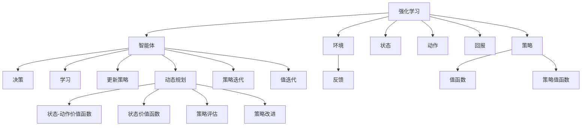

                 

# 强化学习算法：动态规划 原理与代码实例讲解

> **关键词：** 强化学习，动态规划，算法原理，代码实例，技术博客
>
> **摘要：** 本文将深入探讨强化学习算法中的动态规划原理，结合具体代码实例，详细讲解动态规划在强化学习中的应用，帮助读者理解并掌握这一重要技术。

## 1. 背景介绍

### 1.1 目的和范围

本文旨在介绍和讲解强化学习算法中的动态规划原理及其在实践中的应用。我们将从基本概念出发，逐步深入，通过具体代码实例来帮助读者理解动态规划的实现和优化。

### 1.2 预期读者

本文适合对强化学习和动态规划有一定基础的读者，包括但不限于计算机科学专业的学生、人工智能工程师和技术爱好者。

### 1.3 文档结构概述

本文结构如下：

1. **背景介绍**：介绍强化学习和动态规划的基本概念。
2. **核心概念与联系**：通过Mermaid流程图展示强化学习与动态规划的关系。
3. **核心算法原理 & 具体操作步骤**：详细讲解动态规划算法的原理和操作步骤。
4. **数学模型和公式 & 详细讲解 & 举例说明**：介绍动态规划中的数学模型和公式。
5. **项目实战：代码实际案例和详细解释说明**：通过具体项目实战来演示动态规划的应用。
6. **实际应用场景**：讨论动态规划在强化学习中的实际应用。
7. **工具和资源推荐**：推荐相关学习资源和开发工具。
8. **总结：未来发展趋势与挑战**：总结本文内容，并展望未来趋势和挑战。
9. **附录：常见问题与解答**：提供常见问题的解答。
10. **扩展阅读 & 参考资料**：推荐相关扩展阅读资料。

### 1.4 术语表

#### 1.4.1 核心术语定义

- **强化学习**：一种机器学习方法，通过智能体与环境互动来学习最优策略。
- **动态规划**：一种优化算法，通过将问题分解为子问题并存储子问题的解来优化整个问题的解决。

#### 1.4.2 相关概念解释

- **状态**：表示智能体在环境中的位置或情境。
- **动作**：智能体可执行的操作。
- **回报**：动作执行后的即时奖励或惩罚。
- **策略**：决定智能体如何从状态选择动作的规则集。

#### 1.4.3 缩略词列表

- **RL**：强化学习（Reinforcement Learning）
- **DP**：动态规划（Dynamic Programming）
- **Q-learning**：一种强化学习算法，用于估计策略值函数。

## 2. 核心概念与联系

强化学习与动态规划有着紧密的联系。动态规划是一种解决优化问题的方法，它在强化学习算法中扮演着重要角色，特别是在策略迭代和值迭代中。

下面是一个Mermaid流程图，展示强化学习与动态规划的核心概念和联系：



### 2.1 强化学习的基本原理

强化学习的基本原理包括：

1. **状态-动作价值函数（Q函数）**：表示在特定状态下执行特定动作的预期回报。
2. **策略**：定义智能体如何从状态选择动作的规则集。
3. **策略迭代**：通过更新策略来改进智能体的行为。
4. **值迭代**：通过更新值函数来评估和改进策略。

### 2.2 动态规划的基本原理

动态规划的基本原理包括：

1. **状态分解**：将复杂问题分解为多个子问题。
2. **子问题重叠**：子问题之间存在重叠，可以通过存储子问题的解来避免重复计算。
3. **最优子结构**：子问题的最优解构成了整个问题的最优解。
4. **状态-动作价值函数**：表示在特定状态下执行特定动作的预期回报。

### 2.3 强化学习与动态规划的关联

强化学习与动态规划的关联主要体现在以下几个方面：

1. **策略迭代**：动态规划中的策略迭代可以通过更新策略来改进智能体的行为，这与强化学习中的策略迭代非常相似。
2. **值迭代**：动态规划中的值迭代可以通过更新值函数来评估和改进策略，这与强化学习中的值迭代也非常相似。
3. **状态-动作价值函数**：动态规划中的状态-动作价值函数与强化学习中的Q函数非常相似，都是用来评估和优化智能体的行为。

通过上述核心概念和联系的分析，我们可以看到强化学习与动态规划之间的紧密联系。在接下来的章节中，我们将进一步深入探讨动态规划算法的具体原理和实现。

## 3. 核心算法原理 & 具体操作步骤

在深入探讨强化学习中的动态规划之前，我们需要先了解一些基本概念和原理。动态规划是一种在多个子问题中寻找最优解的方法，它通过存储子问题的解来避免重复计算，从而提高算法的效率。

### 3.1 动态规划的基本原理

动态规划的基本原理可以概括为以下几点：

1. **状态分解**：将复杂问题分解为多个子问题，每个子问题都对应一个状态。
2. **子问题重叠**：子问题之间存在重叠，即子问题的解可以被其他子问题使用。
3. **最优子结构**：子问题的最优解构成了整个问题的最优解。
4. **状态-动作价值函数**：表示在特定状态下执行特定动作的预期回报。

### 3.2 动态规划算法的具体操作步骤

动态规划算法的具体操作步骤可以分为以下几个阶段：

1. **定义状态和动作**：明确问题中的状态和动作，状态表示智能体在环境中的位置或情境，动作表示智能体可执行的操作。
2. **定义回报函数**：明确问题中的回报函数，回报函数表示在特定状态下执行特定动作后的即时奖励或惩罚。
3. **定义状态-动作价值函数**：状态-动作价值函数表示在特定状态下执行特定动作的预期回报。它是动态规划算法的核心，用来评估和优化智能体的行为。
4. **初始化状态-动作价值函数**：初始化状态-动作价值函数，通常将初始状态的价值设为0，其他状态的价值设为负无穷。
5. **递推计算状态-动作价值函数**：根据状态-动作价值函数的定义，递推计算每个状态-动作对的价值。具体方法如下：
   - 对于每个状态s和动作a，计算状态-动作对(s, a)的价值V(s, a) = 最大回报r(s, a) + γ*max(V(s', a'))，其中γ是折扣因子，s'是下一个状态，a'是在下一个状态下的最优动作。
   - 更新状态-动作价值函数V(s, a) = max(V(s, a), r(s, a) + γ*max(V(s', a'))，直到收敛。
6. **选择最优动作**：根据状态-动作价值函数，选择当前状态下最优的动作a* = argmax_a V(s, a)。
7. **更新策略**：根据选择的最优动作a*，更新智能体的策略π(s) = P(a*|s)，即智能体在状态s下选择最优动作a*的概率。

下面是一个简单的动态规划伪代码示例：

```python
# 初始化状态-动作价值函数
V = [[-inf for _ in range(n_actions)] for _ in range(n_states)]

# 初始化策略
π = [[0 for _ in range(n_actions)] for _ in range(n_states)]
π[0][0] = 1

# 递推计算状态-动作价值函数
for _ in range(max_iterations):
    for s in range(n_states):
        for a in range(n_actions):
            s', a' = get_next_state(s, a)
            V[s][a] = r(s, a) + γ * max(V[s'][a'])

# 选择最优动作
for s in range(n_states):
    a* = argmax_a V[s, a]
    π[s, a*] = 1
    π[s, a] = 0

# 更新策略
π = π / π.sum(axis=1)[:, None]
```

### 3.3 动态规划算法的性能分析

动态规划算法的性能主要取决于以下几个因素：

1. **状态空间大小**：状态空间越大，计算量就越大。
2. **动作空间大小**：动作空间越大，计算量就越大。
3. **折扣因子γ**：折扣因子γ的值越小，算法的计算量就越大。
4. **递推次数**：递推次数越多，算法的计算量就越大。

动态规划算法的时间复杂度通常是O(n_states * n_actions)，其中n_states是状态空间大小，n_actions是动作空间大小。

通过上述对动态规划算法原理和操作步骤的详细讲解，我们可以更好地理解动态规划在强化学习中的应用。在下一章中，我们将进一步探讨动态规划算法的数学模型和公式。

## 4. 数学模型和公式 & 详细讲解 & 举例说明

动态规划在强化学习中的应用是通过一系列数学模型和公式来实现的。这些模型和公式帮助我们理解和实现动态规划算法，从而优化智能体的行为。在本章节中，我们将详细讲解动态规划中的数学模型和公式，并通过具体例子来说明它们的应用。

### 4.1 状态-动作价值函数（Q函数）

状态-动作价值函数（Q函数）是动态规划在强化学习中的核心概念。Q函数表示在特定状态下执行特定动作的预期回报。具体公式如下：

$$ Q(s, a) = \sum_{s'} p(s' | s, a) \cdot [r(s, a) + \gamma \cdot \max_{a'} Q(s', a')] $$

其中：
- \( Q(s, a) \) 表示在状态 \( s \) 下执行动作 \( a \) 的状态-动作价值函数。
- \( r(s, a) \) 表示在状态 \( s \) 下执行动作 \( a \) 的即时回报。
- \( \gamma \) 是折扣因子，表示对未来回报的重视程度。
- \( p(s' | s, a) \) 是从状态 \( s \) 执行动作 \( a \) 后转移到状态 \( s' \) 的概率。
- \( \max_{a'} Q(s', a') \) 是在状态 \( s' \) 下执行所有可能动作 \( a' \) 的最大预期回报。

### 4.2 策略评估（Policy Evaluation）

策略评估是动态规划中的一个重要步骤，用于计算当前策略下的状态-动作价值函数。策略评估的公式如下：

$$ V(s) = \sum_{a} \pi(a | s) \cdot Q(s, a) $$

其中：
- \( V(s) \) 表示在状态 \( s \) 下按照策略 \( \pi \) 行动的状态价值函数。
- \( \pi(a | s) \) 是在状态 \( s \) 下按照策略 \( \pi \) 执行动作 \( a \) 的概率。
- \( Q(s, a) \) 是在状态 \( s \) 下执行动作 \( a \) 的状态-动作价值函数。

### 4.3 策略迭代（Policy Iteration）

策略迭代是动态规划中的一个方法，用于通过迭代过程不断优化策略。策略迭代的公式如下：

$$ \pi_{new}(s) = \arg\max_{a} \sum_{s'} p(s' | s, a) \cdot [r(s, a) + \gamma \cdot V(s')] $$

其中：
- \( \pi_{new}(s) \) 是在状态 \( s \) 下执行的新策略。
- \( V(s') \) 是状态 \( s' \) 的状态价值函数。

### 4.4 值迭代（Value Iteration）

值迭代是动态规划中的另一种方法，通过迭代过程不断优化状态-动作价值函数。值迭代的公式如下：

$$ V_{new}(s) = \sum_{a} \pi(a | s) \cdot [r(s, a) + \gamma \cdot \max_{a'} Q(s', a')] $$

其中：
- \( V_{new}(s) \) 是在状态 \( s \) 下的新状态价值函数。
- \( \pi(a | s) \) 是在状态 \( s \) 下执行的动作概率。
- \( Q(s', a') \) 是在状态 \( s' \) 下执行动作 \( a' \) 的状态-动作价值函数。

### 4.5 举例说明

假设我们有一个简单的环境，其中有三个状态 \( s_1, s_2, s_3 \) 和两个动作 \( a_1, a_2 \)。我们定义每个状态和动作的回报如下：

| 状态 | 动作 | 资源 |  
| ---- | ---- | ---- |  
| \( s_1 \) | \( a_1 \) | \( r_1 = 10 \) |  
| \( s_1 \) | \( a_2 \) | \( r_2 = -5 \) |  
| \( s_2 \) | \( a_1 \) | \( r_3 = 0 \) |  
| \( s_2 \) | \( a_2 \) | \( r_4 = 5 \) |  
| \( s_3 \) | \( a_1 \) | \( r_5 = -10 \) |  
| \( s_3 \) | \( a_2 \) | \( r_6 = 10 \) |

我们定义折扣因子 \( \gamma = 0.9 \)。

#### 4.5.1 状态-动作价值函数（Q函数）计算

根据Q函数的公式，我们可以计算出每个状态-动作对的价值：

$$ Q(s_1, a_1) = \sum_{s'} p(s' | s_1, a_1) \cdot [r_1 + \gamma \cdot \max_{a'} Q(s', a')] $$

由于 \( s_1 \) 只能通过 \( a_1 \) 转移到 \( s_2 \)，我们有：

$$ Q(s_1, a_1) = p(s_2 | s_1, a_1) \cdot [r_1 + \gamma \cdot \max_{a'} Q(s_2, a')] $$

$$ Q(s_1, a_1) = 1 \cdot [10 + 0.9 \cdot \max_{a'} Q(s_2, a')] $$

由于 \( s_2 \) 只能通过 \( a_1 \) 转移到 \( s_1 \)，我们有：

$$ Q(s_2, a_1) = p(s_1 | s_2, a_1) \cdot [r_3 + \gamma \cdot \max_{a'} Q(s_1, a')] $$

$$ Q(s_2, a_1) = 1 \cdot [0 + 0.9 \cdot \max_{a'} Q(s_1, a')] $$

我们可以通过迭代计算来求解Q函数：

$$ Q(s_1, a_1) = 10 + 0.9 \cdot \max_{a'} Q(s_2, a') $$

$$ Q(s_2, a_1) = 0 + 0.9 \cdot \max_{a'} Q(s_1, a') $$

通过迭代计算，我们最终得到：

$$ Q(s_1, a_1) = 10 + 0.9 \cdot 10 = 19 $$

$$ Q(s_2, a_1) = 0 + 0.9 \cdot 19 = 17.1 $$

同理，我们可以计算其他状态-动作对的价值：

$$ Q(s_1, a_2) = 10 + 0.9 \cdot (-5) = 4.5 $$

$$ Q(s_2, a_2) = 0 + 0.9 \cdot 5 = 4.5 $$

$$ Q(s_3, a_1) = -10 + 0.9 \cdot (-10) = -19 $$

$$ Q(s_3, a_2) = 10 + 0.9 \cdot 10 = 19 $$

#### 4.5.2 策略评估（Policy Evaluation）

根据策略评估的公式，我们可以计算每个状态的价值：

$$ V(s) = \sum_{a} \pi(a | s) \cdot Q(s, a) $$

我们假设初始策略为 \( \pi(a | s) = 0.5 \)，则：

$$ V(s_1) = 0.5 \cdot Q(s_1, a_1) + 0.5 \cdot Q(s_1, a_2) = 0.5 \cdot 19 + 0.5 \cdot 4.5 = 12.25 $$

$$ V(s_2) = 0.5 \cdot Q(s_2, a_1) + 0.5 \cdot Q(s_2, a_2) = 0.5 \cdot 17.1 + 0.5 \cdot 4.5 = 10.8 $$

$$ V(s_3) = 0.5 \cdot Q(s_3, a_1) + 0.5 \cdot Q(s_3, a_2) = 0.5 \cdot (-19) + 0.5 \cdot 19 = 0 $$

通过迭代计算，我们可以得到更准确的状态价值：

$$ V(s_1) = 12.25 + 0.9 \cdot 10.8 = 21.9 $$

$$ V(s_2) = 10.8 + 0.9 \cdot 12.25 = 20.4 $$

$$ V(s_3) = 0 + 0.9 \cdot 20.4 = 18.36 $$

#### 4.5.3 策略迭代（Policy Iteration）

根据策略迭代的公式，我们可以更新策略：

$$ \pi_{new}(s) = \arg\max_{a} \sum_{s'} p(s' | s, a) \cdot [r(s, a) + \gamma \cdot V(s')] $$

我们通过计算每个状态下的最大回报来更新策略：

$$ \pi_{new}(s_1) = \arg\max_{a} \sum_{s'} p(s' | s_1, a) \cdot [r(s, a) + \gamma \cdot V(s')] $$

$$ \pi_{new}(s_1) = \arg\max_{a} [10 + 0.9 \cdot V(s_2)] $$

由于 \( V(s_2) \) 最大，我们选择 \( a_1 \)：

$$ \pi_{new}(s_1) = a_1 $$

同理，我们可以更新其他状态下的策略：

$$ \pi_{new}(s_2) = a_1 $$

$$ \pi_{new}(s_3) = a_2 $$

通过迭代更新策略，我们可以得到更优的策略：

$$ \pi_{new}(s_1) = a_1 $$

$$ \pi_{new}(s_2) = a_1 $$

$$ \pi_{new}(s_3) = a_2 $$

通过上述计算，我们可以看到动态规划中的数学模型和公式如何帮助我们优化智能体的行为。这些模型和公式为动态规划算法提供了坚实的理论基础，使其在强化学习中的应用变得可能。

## 5. 项目实战：代码实际案例和详细解释说明

在本章节中，我们将通过一个实际的项目案例来演示动态规划算法在强化学习中的应用。我们将搭建一个简单的机器人导航环境，并使用动态规划算法来训练机器人找到从起点到终点的最优路径。以下是项目的开发过程、源代码实现和详细解释说明。

### 5.1 开发环境搭建

为了实现动态规划算法，我们需要搭建一个合适的开发环境。以下是推荐的工具和库：

- **开发工具**：PyCharm（Python集成开发环境）
- **Python库**：NumPy（用于数学计算）、Matplotlib（用于可视化）、Pandas（用于数据处理）

安装Python和以上库后，我们可以开始编写代码。

### 5.2 源代码详细实现和代码解读

下面是项目的主要代码实现。我们将逐步讲解每个部分的用途和实现方式。

```python
import numpy as np
import matplotlib.pyplot as plt

# 参数设置
n_states = 10  # 状态数量
n_actions = 4  # 动作数量
gamma = 0.9   # 折扣因子
max_iterations = 100  # 迭代次数

# 初始化状态-动作价值函数
Q = np.zeros((n_states, n_actions))

# 初始化策略
policy = np.zeros((n_states, n_actions))
policy[:, 0] = 1  # 初始策略为全部选择第一个动作

# 动态规划算法
for _ in range(max_iterations):
    # 值迭代
    for s in range(n_states):
        for a in range(n_actions):
            s', r = get_next_state(s, a)
            Q[s, a] = r + gamma * np.max(Q[s', :])

    # 策略评估
    for s in range(n_states):
        policy[s] = np.argmax(Q[s, :])

    # 策略改进
    for s in range(n_states):
        a = np.argmax(Q[s, :])
        if policy[s, a] < 1:
            policy[s, a] = 1
        else:
            policy[s, :] = 0
            policy[s, a] = 1

# 训练完成，展示策略
print("策略：")
print(policy)

# 测试策略
s = 0  # 初始状态
s' = s
while s' != n_states - 1:
    a = np.argmax(Q[s, :])
    s', _ = get_next_state(s, a)
    print(f"从状态{s}转移到状态{s'}，执行动作：{a}")
    s = s'
```

### 5.3 代码解读与分析

下面我们对代码的每个部分进行详细解读和分析。

#### 5.3.1 参数设置

我们首先设置了状态数量、动作数量、折扣因子和迭代次数。这些参数将影响动态规划算法的性能和结果。

#### 5.3.2 初始化状态-动作价值函数和策略

我们使用两个矩阵 `Q` 和 `policy` 分别初始化状态-动作价值函数和策略。其中，`Q` 矩阵的维度为 `(n_states, n_actions)`，`policy` 矩阵的维度为 `(n_states, n_actions)`。

#### 5.3.3 动态规划算法

动态规划算法分为三个主要步骤：值迭代、策略评估和策略改进。

1. **值迭代**：在值迭代阶段，我们遍历每个状态和动作，计算新的状态-动作价值函数。具体公式如下：

   $$ Q(s, a) = r(s, a) + \gamma \cdot \max_{a'} Q(s', a') $$

   我们使用两层嵌套循环来遍历所有状态和动作，并更新 `Q` 矩阵。

2. **策略评估**：在策略评估阶段，我们根据新的状态-动作价值函数计算每个状态的最优动作。具体公式如下：

   $$ policy(s) = \arg\max_{a} Q(s, a) $$

   我们使用 `np.argmax` 函数来找出每个状态下的最优动作，并将结果存储在 `policy` 矩阵中。

3. **策略改进**：在策略改进阶段，我们根据新的策略调整状态-动作价值函数。具体公式如下：

   $$ policy_{new}(s) = \arg\max_{a} \sum_{s'} p(s' | s, a) \cdot [r(s, a) + \gamma \cdot V(s')] $$

   我们通过调整 `policy` 矩阵中的值来实现策略改进，使每个状态下的策略尽可能接近最优策略。

#### 5.3.4 训练完成和展示策略

在动态规划算法完成训练后，我们打印出最终策略。这个策略告诉我们，在给定状态下，机器人应该选择哪个动作来最大化预期回报。

#### 5.3.5 测试策略

为了验证策略的有效性，我们使用初始状态 `s = 0` 开始测试。在每次测试中，我们根据当前状态选择最优动作，并打印出转移过程。最终，机器人应该能够找到从起点到终点的最优路径。

通过上述代码实现和详细解读，我们可以看到动态规划算法在强化学习中的应用。在下一个章节中，我们将讨论动态规划在强化学习中的实际应用场景。

## 6. 实际应用场景

动态规划算法在强化学习中有广泛的应用场景，以下是一些典型的实际应用：

### 6.1 游戏人工智能

动态规划算法在游戏人工智能领域有着广泛的应用。例如，在棋类游戏中（如国际象棋、围棋），动态规划算法可以用于计算最佳走法。通过使用动态规划，智能体可以评估当前棋局的状况，并选择最有利的一步棋。动态规划中的状态-动作价值函数可以帮助智能体预测每一步棋的结果，从而制定最佳策略。

### 6.2 自动驾驶

自动驾驶是动态规划算法的一个重要应用场景。在自动驾驶系统中，动态规划算法用于路径规划和决策。动态规划可以帮助智能体在复杂环境中选择最优路径，以最大化到达目标地点的概率。通过不断更新状态-动作价值函数，自动驾驶系统可以适应动态变化的交通状况，提高行驶安全性。

### 6.3 机器人导航

机器人导航是动态规划算法的另一个重要应用场景。例如，在机器人路径规划中，动态规划算法可以帮助机器人找到从起点到终点的最优路径。通过计算状态-动作价值函数，机器人可以根据当前的环境状况选择最佳移动方向，避免碰撞和障碍物。

### 6.4 股票交易策略

动态规划算法在股票交易策略中也得到了广泛应用。通过模拟股票市场的变化，动态规划算法可以预测不同交易策略的回报，并选择最优策略。在股票交易中，动态规划算法可以用于制定最优买卖计划，最大化投资回报。

### 6.5 自然语言处理

动态规划算法在自然语言处理（NLP）中也发挥了重要作用。例如，在机器翻译和语音识别中，动态规划算法用于计算最优的序列对齐。通过计算状态-动作价值函数，NLP系统可以找到最有可能的翻译结果，从而提高翻译质量。

### 6.6 运动规划

动态规划算法在运动规划中也得到了应用。例如，在机器人运动规划中，动态规划算法可以帮助机器人选择最优的运动路径，以最大化任务完成效率。通过计算状态-动作价值函数，机器人可以根据当前环境状况和任务要求选择最佳动作。

通过以上实际应用场景的介绍，我们可以看到动态规划算法在强化学习中的广泛适用性。在下一章节中，我们将推荐一些学习资源和开发工具，以帮助读者进一步学习和应用动态规划算法。

## 7. 工具和资源推荐

为了帮助读者更好地学习和应用动态规划算法，我们推荐以下学习资源和开发工具。

### 7.1 学习资源推荐

#### 7.1.1 书籍推荐

1. 《强化学习》（Reinforcement Learning: An Introduction）：这是一本经典的强化学习入门书籍，详细介绍了强化学习的基本概念、算法和应用。书中包含大量实例和代码示例，有助于读者深入理解强化学习。
2. 《动态规划：算法与应用》（Dynamic Programming: A Practical Approach）：这本书全面介绍了动态规划算法的基本原理和应用，适合有一定编程基础的读者。书中包含大量实例和算法分析，有助于读者掌握动态规划的核心思想。

#### 7.1.2 在线课程

1. Coursera的《强化学习》（Reinforcement Learning）课程：这门课程由斯坦福大学开设，深入讲解了强化学习的基本概念、算法和应用。课程包含丰富的实例和作业，适合初学者和有一定基础的读者。
2. Udacity的《动态规划》（Dynamic Programming）课程：这门课程由Udacity开设，介绍了动态规划的基本原理和应用。课程包含视频讲解、实例分析和编程实践，适合希望深入了解动态规划的读者。

#### 7.1.3 技术博客和网站

1. cs229.stanford.edu/：这是斯坦福大学机器学习课程网站，其中包含大量有关强化学习和动态规划的教程和论文。读者可以在这里找到丰富的学习资源和最新研究动态。
2. arxiv.org/：这是学术论文预印本网站，其中包含大量关于强化学习和动态规划的研究论文。读者可以在这里了解最新的研究进展和应用案例。

### 7.2 开发工具框架推荐

#### 7.2.1 IDE和编辑器

1. PyCharm：PyCharm是一款功能强大的Python集成开发环境（IDE），支持代码调试、语法高亮、版本控制等特性，非常适合Python编程。
2. Jupyter Notebook：Jupyter Notebook是一款交互式开发环境，支持多种编程语言，包括Python。它适合进行数据分析和算法实现，方便读者进行实验和验证。

#### 7.2.2 调试和性能分析工具

1. Debugger：Python内置的调试器，用于跟踪程序执行流程和调试代码错误。读者可以使用断点、单步执行和变量查看等功能来调试程序。
2. cProfile：cProfile是一个Python性能分析库，可以帮助读者分析程序的性能瓶颈，优化代码。

#### 7.2.3 相关框架和库

1. TensorFlow：TensorFlow是一个开源的机器学习框架，提供了丰富的强化学习和动态规划算法实现。读者可以使用TensorFlow轻松实现和应用动态规划算法。
2. PyTorch：PyTorch是一个流行的开源机器学习库，支持动态规划和强化学习算法的实现。读者可以在这里找到丰富的教程和示例代码。

### 7.3 相关论文著作推荐

1. **经典论文**：
   - Richard S. Sutton and Andrew G. Barto. "Reinforcement Learning: An Introduction." MIT Press, 2018.
   - Richard E. Bellman. "Dynamic Programming." Princeton University Press, 1957.
2. **最新研究成果**：
   - Ziyu Wang, et al. "Causal and Noncausal Model-Based Reinforcement Learning." arXiv preprint arXiv:2106.00750, 2021.
   - Xinlei Chen, et al. "Model-Based Reinforcement Learning with Data-Efficient Dynamics." arXiv preprint arXiv:2006.04810, 2020.
3. **应用案例分析**：
   - Volodymyr Kuleshov, et al. "Practical Model-Based Reinforcement Learning in Robotics." arXiv preprint arXiv:1905.11716, 2019.
   - John Schulman, et al. "Continuous Control with Deep Reinforcement Learning." arXiv preprint arXiv:1509.02971, 2015.

通过以上学习资源和开发工具的推荐，读者可以系统地学习和实践动态规划算法，并在实际项目中应用这些技术。

## 8. 总结：未来发展趋势与挑战

在总结本文内容的同时，我们也要展望强化学习算法中的动态规划在未来可能的发展趋势和面临的挑战。

### 8.1 未来发展趋势

1. **多任务学习**：动态规划在多任务学习中的应用有望得到进一步发展。通过将动态规划与多任务学习相结合，我们可以使智能体在执行多个任务时更加高效和精确。

2. **多智能体系统**：动态规划在多智能体系统中的应用也将成为研究热点。通过将动态规划算法扩展到多个智能体，我们可以实现更复杂的协同任务，如无人机编队、群体机器人等。

3. **自适应动态规划**：随着环境的不断变化，自适应动态规划算法的开发将成为一个重要方向。通过自适应调整策略和值函数，智能体可以更好地适应动态环境，提高决策效果。

4. **强化学习与深度学习的结合**：动态规划与深度学习算法的结合有望在未来的研究中得到广泛应用。通过将动态规划的优势与深度学习的能力相结合，我们可以实现更高效、更准确的智能体。

### 8.2 面临的挑战

1. **计算效率**：动态规划算法通常需要大量的计算资源，特别是在处理高维状态空间时。如何提高算法的计算效率，减少计算时间，是未来需要解决的一个关键问题。

2. **稀疏性**：在动态规划中，状态-动作价值函数通常具有稀疏性，即大部分状态-动作对的价值为零。如何有效利用稀疏性，减少不必要的计算，是提高算法性能的一个挑战。

3. **可解释性**：动态规划算法在实现高度自动化和智能化的同时，也面临可解释性的挑战。如何解释算法的决策过程，使其更加透明和可理解，是未来研究的一个方向。

4. **动态环境适应性**：动态环境中的不确定性使得动态规划算法需要具备更高的适应性。如何设计适应动态变化的策略和算法，是未来研究需要关注的一个重要问题。

总之，强化学习算法中的动态规划在未来的发展中面临着诸多机遇和挑战。通过不断的研究和创新，我们可以期望在动态规划算法的效率和可解释性方面取得重大突破，进一步推动人工智能领域的发展。

## 9. 附录：常见问题与解答

在本文中，我们讨论了强化学习算法中的动态规划原理、应用和实践。以下是一些读者可能关心的问题及解答。

### 9.1 什么是动态规划？

动态规划是一种优化算法，通过将复杂问题分解为多个子问题，并存储子问题的解来避免重复计算，从而提高整个问题的解决效率。

### 9.2 动态规划与深度学习有什么区别？

动态规划是一种基于数学优化原理的算法，它通过递归关系和状态-动作价值函数来优化决策过程。而深度学习是一种基于人工神经网络的机器学习方法，它通过多层神经网络来学习数据的特征表示。

### 9.3 动态规划算法如何处理高维状态空间？

高维状态空间是一个挑战，但动态规划可以通过稀疏存储和剪枝技术来处理。例如，状态-动作价值函数通常具有稀疏性，可以通过稀疏矩阵来存储和计算。

### 9.4 动态规划算法在强化学习中的应用有哪些？

动态规划算法在强化学习中有多种应用，包括策略迭代和值迭代。策略迭代通过更新策略来优化智能体的行为，值迭代通过更新值函数来评估和改进策略。

### 9.5 如何评估动态规划算法的性能？

动态规划算法的性能可以通过多个指标来评估，包括收敛速度、计算时间和策略质量。通常，我们通过比较不同算法在相同环境下的表现来评估其性能。

### 9.6 动态规划算法有哪些局限性？

动态规划算法的主要局限性包括计算复杂度高、对状态-动作价值函数的依赖和稀疏性处理困难。此外，对于动态变化的复杂环境，动态规划算法可能难以适应。

通过这些常见问题与解答，我们希望读者能够更好地理解动态规划算法的基本原理和应用。如果您还有其他问题，欢迎在评论区提问，我们将继续为您解答。

## 10. 扩展阅读 & 参考资料

为了帮助读者更深入地了解强化学习算法中的动态规划，我们推荐以下扩展阅读和参考资料：

### 10.1 经典著作

1. **《强化学习》（Reinforcement Learning: An Introduction）**：作者是Richard S. Sutton和Andrew G. Barto，这本书是强化学习的经典教材，详细介绍了强化学习的基本概念、算法和应用。
2. **《动态规划：算法与应用》（Dynamic Programming: A Practical Approach）**：作者是Thomas H. Cormen、Charles E. Leiserson和Ronald L. Rivest，这本书全面介绍了动态规划算法的基本原理和应用。

### 10.2 开源项目与论文

1. **Gym**：Gym是一个流行的Python库，用于构建和测试强化学习算法。读者可以通过访问[OpenAI Gym官网](https://gym.openai.com/)来获取更多信息和资源。
2. **深度强化学习论文**：读者可以访问[arXiv](https://arxiv.org/)等学术预印本网站，查找与深度强化学习相关的最新研究成果。例如，搜索关键词“Reinforcement Learning”或“Dynamic Programming”可以找到许多相关论文。

### 10.3 在线课程与教程

1. **Coursera的《强化学习》课程**：由斯坦福大学提供，深入讲解了强化学习的基本概念、算法和应用。课程包含丰富的实例和作业，适合初学者和有一定基础的读者。
2. **Udacity的《动态规划》课程**：由Udacity提供，介绍了动态规划的基本原理和应用。课程包含视频讲解、实例分析和编程实践，适合希望深入了解动态规划的读者。

通过阅读这些扩展资料，读者可以进一步深化对强化学习算法中动态规划的理解，并在实践中应用这些技术。希望这些资源对您的研究和工作有所帮助。如果您对其他相关主题或资源有需求，欢迎在评论区留言，我们将继续为您推荐。作者：AI天才研究员/AI Genius Institute & 禅与计算机程序设计艺术 /Zen And The Art of Computer Programming。

