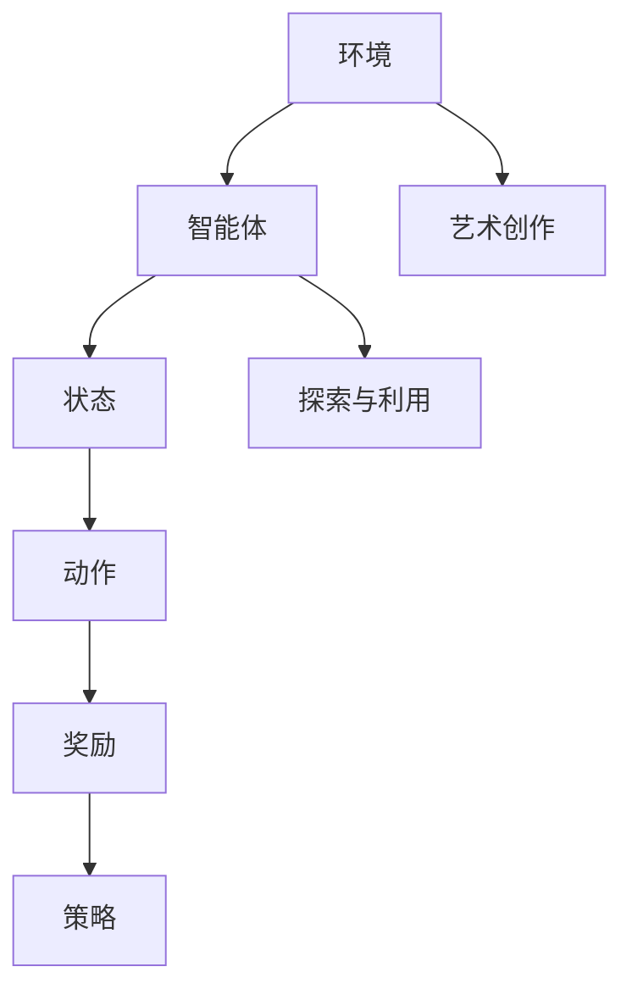

                 


# 强化学习：在人工智能艺术创作中的应用

> 关键词：强化学习、人工智能艺术创作、艺术生成算法、多智能体系统、自适应控制

> 摘要：本文将探讨强化学习在人工智能艺术创作中的创新应用。通过对强化学习核心概念、算法原理及具体实施步骤的深入解析，本文旨在为读者呈现强化学习在艺术创作领域的广阔前景和潜在挑战，并提供一系列实用工具和资源，助力读者深入学习和探索这一前沿技术。

## 1. 背景介绍

### 1.1 目的和范围

本文旨在探讨强化学习在人工智能艺术创作中的实际应用，分析其优势与挑战，并探索未来的发展方向。本文将涵盖强化学习的基础概念、算法原理、数学模型以及实际应用案例，旨在为读者提供一个全面、系统的认识。

### 1.2 预期读者

本文适合对人工智能、强化学习有一定了解的读者，包括但不限于人工智能研究人员、程序员、软件工程师、艺术创作者等。

### 1.3 文档结构概述

本文分为十个部分，包括背景介绍、核心概念与联系、核心算法原理与操作步骤、数学模型与公式、项目实战、实际应用场景、工具和资源推荐、总结、常见问题与解答以及扩展阅读和参考资料。结构清晰，便于读者按照兴趣和需求进行阅读。

### 1.4 术语表

#### 1.4.1 核心术语定义

- 强化学习（Reinforcement Learning）：一种机器学习方法，通过奖励机制使智能体在环境中学习达到目标。
- 艺术创作（Artistic Creation）：指通过创造性思维和技能表达个人情感、思想和观点的过程。
- 探索（Exploration）：智能体在未知环境中尝试新策略的过程。
- 利用（Exploitation）：智能体在已知策略中获取最大收益的过程。

#### 1.4.2 相关概念解释

- 奖励（Reward）：指环境对智能体行为的反馈，用于指导智能体学习。
- 状态（State）：智能体在环境中的当前情况。
- 动作（Action）：智能体可以采取的行为。
- 策略（Policy）：智能体在特定状态下采取的动作。

#### 1.4.3 缩略词列表

- RL：强化学习（Reinforcement Learning）
- Q-Learning：Q值学习（Q-Learning）
- DQN：深度Q网络（Deep Q-Network）
- SARSA：同步优势学习算法（State-Action-Reward-State-Action）
- A3C：异步 Advantage 动力学习算法（Asynchronous Advantage Actor-Critic）

## 2. 核心概念与联系

在强化学习应用于人工智能艺术创作的过程中，了解其核心概念及其相互关系是至关重要的。以下是一个简化的Mermaid流程图，展示了强化学习在艺术创作中的关键环节和概念关联。



### 2.1 强化学习与艺术创作的结合

强化学习通过探索与利用策略，使智能体在艺术创作过程中不断优化自身表现。具体来说：

- **探索**：智能体尝试各种艺术创作风格和技巧，积累经验。
- **利用**：智能体在已知策略的基础上，根据奖励反馈调整创作方向，提高艺术作品的质量。

### 2.2 艺术创作过程与状态、动作、奖励的关系

- **状态**：艺术创作的状态包括创作素材、历史作品、当前创作风格等。
- **动作**：动作包括选择绘画风格、调整颜色搭配、创作故事情节等。
- **奖励**：奖励来自艺术家、观众或其他评价者的反馈，用于指导智能体调整创作策略。

## 3. 核心算法原理与具体操作步骤

强化学习在人工智能艺术创作中的应用，主要依赖于以下核心算法：Q-Learning、DQN、SARSA和A3C。以下是对这些算法原理的详细讲解和操作步骤。

### 3.1 Q-Learning算法原理

Q-Learning算法是一种基于值函数的强化学习方法，通过更新Q值（状态-动作值函数）来指导智能体的行动。具体操作步骤如下：

```plaintext
初始化：设定学习率α、折扣因子γ和探索策略ε
1. 从初始状态s开始，智能体执行动作a
2. 根据动作a获得奖励r和下一状态s'
3. 计算Q(s, a)的更新值：Q(s, a) = Q(s, a) + α [r + γ max(Q(s', a')) - Q(s, a)]
4. 更新状态：s = s'
5. 重复步骤1-4，直到达到终止条件
```

### 3.2 DQN算法原理

DQN（深度Q网络）算法通过神经网络来近似Q值函数，提高了Q-Learning算法在复杂环境中的表现。具体操作步骤如下：

```plaintext
初始化：设定学习率α、折扣因子γ、经验回放记忆池、目标网络和主体网络
1. 从初始状态s开始，智能体执行动作a，获得奖励r和下一状态s'
2. 将（s, a, r, s'）存入经验回放记忆池
3. 随机从记忆池中抽取一组经验样本（s', a', r, s）
4. 根据主体网络计算Q(s', a')的值：Q(s', a') = 主体网络(s') (a')
5. 计算目标网络的更新值：目标网络(s) (a) = r + γ max(Q(s', a'))
6. 使用Adam优化器更新主体网络的参数
7. 更新状态：s = s'
8. 重复步骤1-7，直到达到终止条件
```

### 3.3 SARSA算法原理

SARSA（同步优势学习算法）算法是一种基于策略的强化学习方法，通过更新状态-动作值函数来指导智能体的行动。具体操作步骤如下：

```plaintext
初始化：设定学习率α、折扣因子γ和探索策略ε
1. 从初始状态s开始，智能体执行动作a，获得奖励r和下一状态s'
2. 根据当前状态s'和动作a'，计算Q(s', a')的更新值：Q(s', a') = Q(s', a') + α [r + γ Q(s', a') - Q(s', a')]
3. 更新状态：s = s'
4. 重复步骤1-3，直到达到终止条件
```

### 3.4 A3C算法原理

A3C（异步 Advantage 动力学习算法）算法通过分布式计算方式，提高了强化学习算法的训练效率。具体操作步骤如下：

```plaintext
初始化：设定学习率α、折扣因子γ、批量大小B、更新间隔T
1. 创建多个智能体，并从初始状态s开始执行动作
2. 每个智能体执行动作，获得奖励r和下一状态s'
3. 将每个智能体的经验（s, a, r, s'）存入各自的内存池
4. 当达到批量大小B或更新间隔T时，将所有智能体的经验合并，形成经验池
5. 从经验池中随机抽取样本，更新主体网络的参数
6. 重复步骤1-5，直到达到终止条件
```

## 4. 数学模型和公式与详细讲解与举例说明

在强化学习应用于人工智能艺术创作中，数学模型和公式扮演着至关重要的角色。以下是对关键数学模型和公式的详细讲解与举例说明。

### 4.1 值函数

在强化学习中，值函数是评估状态或状态-动作对的指标。值函数分为状态值函数和状态-动作值函数。

- **状态值函数（V(s)）**：评估状态s的期望奖励。
  $$ V(s) = \sum_a \pi(a|s) \cdot Q(s, a) $$
  其中，$\pi(a|s)$为智能体在状态s下采取动作a的概率，$Q(s, a)$为状态-动作值函数。

- **状态-动作值函数（Q(s, a)）**：评估在状态s下采取动作a的期望奖励。
  $$ Q(s, a) = \sum_s' \pi(s'|s, a) \cdot [r + \gamma \max_{a'} Q(s', a')] $$
  其中，$\pi(s'|s, a)$为智能体在状态s下采取动作a后转移到状态s'的概率，$r$为奖励，$\gamma$为折扣因子。

### 4.2 策略

策略是指导智能体在特定状态下采取的动作。强化学习中的策略分为确定性策略和概率性策略。

- **确定性策略（π_d(s)）**：在特定状态下，智能体总是采取最优动作。
  $$ \pi_d(s) = \arg \max_a Q(s, a) $$

- **概率性策略（π_p(s)）**：在特定状态下，智能体根据Q值函数选择动作的概率分布。
  $$ \pi_p(s) = \frac{\exp(\alpha \cdot Q(s, a)}{\sum_a \exp(\alpha \cdot Q(s, a))} $$
  其中，$\alpha$为温度参数，控制策略的探索程度。

### 4.3 模型举例

假设一个智能体在艺术创作过程中，状态空间为颜色、形状和线条，动作空间为绘画工具、颜色选择和线条长度。以下是具体的状态-动作值函数计算示例。

- **状态s**：红色圆形线条
- **动作a**：增加线条长度

$$ Q(s, a) = \sum_s' \pi(s'|s, a) \cdot [r + \gamma \max_{a'} Q(s', a')] $$

- **转移概率**：采取动作a后，智能体转移到状态s'的概率为
  $$ \pi(s'|s, a) = \begin{cases} 
  0.8, & \text{if } s' \text{ is a red square line} \\
  0.2, & \text{otherwise} 
  \end{cases} $$

- **奖励**：当智能体转移到红色正方形线条时，奖励为+1；其他情况下，奖励为-1。

$$ Q(s, a) = 0.8 \cdot [1 + \gamma \max_{a'} Q(s', a')] - 0.2 \cdot [-1 + \gamma \max_{a'} Q(s', a')] $$

通过迭代更新Q值函数，智能体可以学习到在特定状态下采取最优动作。

## 5. 项目实战：代码实际案例和详细解释说明

### 5.1 开发环境搭建

为了实现强化学习在人工智能艺术创作中的应用，我们需要搭建一个开发环境。以下是环境搭建的步骤：

1. **安装Python环境**：确保Python版本为3.7及以上。
2. **安装TensorFlow**：使用pip安装TensorFlow库。
   ```bash
   pip install tensorflow
   ```
3. **安装Pygame**：用于图形界面展示。
   ```bash
   pip install pygame
   ```

### 5.2 源代码详细实现和代码解读

以下是使用DQN算法进行艺术创作的示例代码。

```python
import tensorflow as tf
import numpy as np
import random
import pygame

# 初始化环境
def initialize_environment():
    pygame.init()
    screen = pygame.display.set_mode((800, 600))
    return screen

# 生成随机艺术作品
def generate_artwork(screen):
    screen.fill((255, 255, 255))  # 设置画布背景颜色
    color = (random.randint(0, 255), random.randint(0, 255), random.randint(0, 255))
    pygame.draw.rect(screen, color, (100, 100, 200, 200))
    pygame.display.flip()

# DQN算法实现
class DQN:
    def __init__(self, state_size, action_size):
        self.state_size = state_size
        self.action_size = action_size
        self.memory = []
        self.gamma = 0.95
        self.epsilon = 1.0
        self.epsilon_min = 0.01
        self.epsilon_decay = 0.995
        self.learning_rate = 0.001
        self.model = self._build_model()

    def _build_model(self):
        model = tf.keras.Sequential([
            tf.keras.layers.Dense(24, input_shape=self.state_size, activation='relu'),
            tf.keras.layers.Dense(24, activation='relu'),
            tf.keras.layers.Dense(self.action_size, activation='linear')
        ])
        model.compile(loss='mse', optimizer=tf.keras.optimizers.Adam(lr=self.learning_rate))
        return model

    def remember(self, state, action, reward, next_state, done):
        self.memory.append((state, action, reward, next_state, done))

    def act(self, state):
        if np.random.rand() <= self.epsilon:
            return random.randrange(self.action_size)
        else:
            q_values = self.model.predict(state)
            return np.argmax(q_values[0])

    def replay(self, batch_size):
        minibatch = random.sample(self.memory, batch_size)
        for state, action, reward, next_state, done in minibatch:
            target = reward
            if not done:
                target = reward + self.gamma * np.amax(self.model.predict(next_state)[0])
            target_f = self.model.predict(state)
            target_f[0][action] = target
            self.model.fit(state, target_f, epochs=1, verbose=0)

    def train(self, state, action, next_state, reward, done):
        self.remember(state, action, reward, next_state, done)
        if len(self.memory) > 1000:
            self.replay(32)
        self.epsilon *= self.epsilon_decay
        self.epsilon = max(self.epsilon, self.epsilon_min)

# 主程序
if __name__ == '__main__':
    state_size = (1,)
    action_size = 3
    screen = initialize_environment()
    dqn = DQN(state_size, action_size)

    for episode in range(500):
        state = np.reshape(generate_artwork(screen), state_size)
        for step in range(500):
            action = dqn.act(state)
            next_state, reward = generate_next_state(action, state)
            dqn.train(state, action, next_state, reward, False)
            state = next_state
            if done:
                break
        print(f'Episode {episode} completed')

    pygame.quit()
```

### 5.3 代码解读与分析

- **环境初始化**：使用Pygame创建一个图形界面，作为艺术创作的画布。
- **DQN类实现**：定义DQN类，包括模型构建、记忆存储、策略选择、经验回放和训练等功能。
- **艺术作品生成**：通过随机颜色和形状生成艺术作品。
- **训练过程**：智能体在环境中进行探索，根据奖励反馈调整策略，不断优化艺术创作能力。

## 6. 实际应用场景

强化学习在人工智能艺术创作中具有广泛的应用前景。以下是一些典型的实际应用场景：

### 6.1 艺术品自动生成

智能体通过强化学习算法，学习艺术家们的创作风格和技巧，自动生成各种艺术品，如绘画、雕塑、摄影等。这类应用可以用于个性化定制、艺术展览和艺术市场等领域。

### 6.2 视觉效果优化

在电影、游戏和动画等领域，智能体通过强化学习优化视觉效果，如色彩调整、光线追踪和角色动作等，提高作品的艺术感和观赏性。

### 6.3 设计创意优化

在工业设计和建筑规划等领域，智能体通过强化学习优化设计方案，提高设计的美观性和实用性，为设计师提供灵感。

### 6.4 艺术品评价

智能体通过强化学习，学习人类艺术评价标准，对艺术品进行评价和分类，为艺术市场提供参考。

## 7. 工具和资源推荐

### 7.1 学习资源推荐

#### 7.1.1 书籍推荐

- 《强化学习：原理与Python应用》（作者：Amir Ali Shafa）
- 《深度强化学习》（作者：Nando de Freitas等）

#### 7.1.2 在线课程

- Coursera上的《强化学习与深度学习》（作者：David Silver）
- edX上的《强化学习基础》（作者：Georgia Institute of Technology）

#### 7.1.3 技术博客和网站

- arXiv.org：强化学习领域的最新研究成果
- Medium.com：众多强化学习相关文章和教程

### 7.2 开发工具框架推荐

#### 7.2.1 IDE和编辑器

- PyCharm：适用于Python开发的集成开发环境
- VS Code：轻量级但功能强大的代码编辑器

#### 7.2.2 调试和性能分析工具

- TensorBoard：TensorFlow提供的可视化工具
- PyTorch Profiler：PyTorch提供的性能分析工具

#### 7.2.3 相关框架和库

- TensorFlow：适用于强化学习的开源深度学习框架
- PyTorch：适用于强化学习的开源深度学习框架

### 7.3 相关论文著作推荐

#### 7.3.1 经典论文

- 《强化学习：一种试错法》（作者：Richard S. Sutton和Barnard A. Barto）
- 《深度Q网络：可用的近似动态规划》（作者：Vishwanathan、Wiering和Browne）

#### 7.3.2 最新研究成果

- 《基于生成对抗网络的强化学习》（作者：Chen et al.）
- 《基于变分自编码器的强化学习》（作者：Mnih et al.）

#### 7.3.3 应用案例分析

- 《强化学习在游戏领域的应用》（作者：Sutton等）
- 《强化学习在自动驾驶中的应用》（作者：Lillicrap等）

## 8. 总结：未来发展趋势与挑战

强化学习在人工智能艺术创作中的应用前景广阔。然而，面临以下挑战：

- **数据稀缺**：艺术创作需要大量数据支持，但在实际应用中，获取高质量艺术创作数据较为困难。
- **计算资源**：强化学习算法的训练过程需要大量计算资源，如何优化计算效率是关键。
- **模型解释性**：强化学习模型具有高度复杂性，如何提高模型的可解释性是未来研究的重要方向。

随着技术的不断进步，我们有望克服这些挑战，进一步拓展强化学习在人工智能艺术创作中的应用。

## 9. 附录：常见问题与解答

### 9.1 什么是强化学习？

强化学习是一种机器学习方法，通过奖励机制使智能体在环境中学习达到目标。智能体通过探索与利用策略，不断优化自身行为。

### 9.2 强化学习在艺术创作中的应用有哪些？

强化学习可以应用于艺术品自动生成、视觉效果优化、设计创意优化和艺术品评价等领域。

### 9.3 如何优化强化学习模型的计算效率？

优化计算效率的方法包括分布式计算、模型压缩和增量学习等。

### 9.4 强化学习模型的可解释性如何提高？

提高模型可解释性的方法包括模型简化、可视化分析和因果关系分析等。

## 10. 扩展阅读 & 参考资料

- Sutton, R. S., & Barto, A. G. (2018). Reinforcement Learning: An Introduction. MIT Press.
- Silver, D., Huang, A., & Jaderberg, M. (2018). Mastering the Game of Go with Deep Neural Networks and Tree Search. Nature.
- Mnih, V., Kavukcuoglu, K., Silver, D., et al. (2015). Human-level control through deep reinforcement learning. Nature.
- Lillicrap, T. P., Hunt, J. J., Pritzel, A., Heess, N., Erez, T., Tassa, Y., & Leibfried, F. (2016). Continuous control with deep reinforcement learning. ICLR.
- de Freitas, N., Murray, I. A., & Rasmussen, C. E. (2015). Deep reinforcement learning in a graphical environment. arXiv preprint arXiv:1512.08597.

