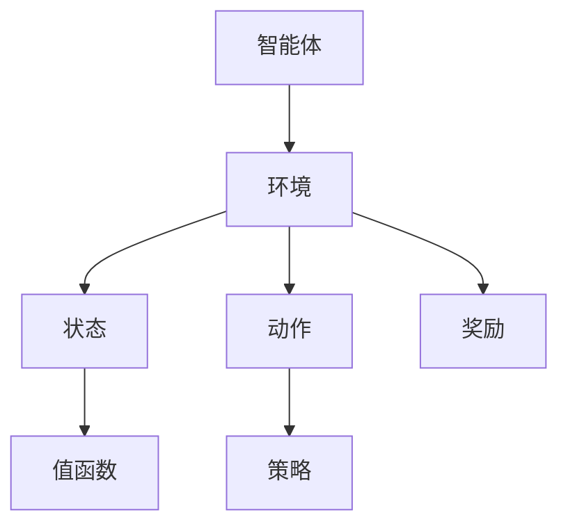

                 

# 强化学习：在智能家居中的应用

> **关键词：** 强化学习、智能家居、机器学习、深度学习、算法应用、实际案例

> **摘要：** 本文将探讨强化学习在智能家居领域中的应用，通过深入分析其核心算法原理、数学模型和具体操作步骤，为开发者提供实际项目的代码实现和详细解释。同时，文章还将总结强化学习在智能家居中的应用场景，并推荐相关学习资源和工具，帮助读者全面了解和掌握这一前沿技术。

## 1. 背景介绍

### 1.1 目的和范围

本文旨在探讨强化学习在智能家居中的应用，通过解析其核心算法原理、数学模型和具体实现步骤，帮助读者深入了解这一领域。本文将涵盖以下内容：

- 强化学习的概念和核心算法原理
- 强化学习在智能家居中的实际应用场景
- 强化学习的数学模型和公式
- 强化学习在智能家居中的项目实战案例
- 强化学习的未来发展趋势与挑战

### 1.2 预期读者

本文适合以下读者群体：

- 智能家居开发者和研究者
- 对强化学习感兴趣的技术爱好者
- 机器学习和深度学习领域的研究人员
- 对智能家居和人工智能应用有浓厚兴趣的读者

### 1.3 文档结构概述

本文将按照以下结构进行组织：

- 引言：介绍文章的主题和目的
- 核心概念与联系：介绍强化学习的基本概念和原理
- 核心算法原理 & 具体操作步骤：详细阐述强化学习的算法原理和操作步骤
- 数学模型和公式 & 详细讲解 & 举例说明：介绍强化学习的数学模型和相关公式，并给出具体例子
- 项目实战：提供强化学习在智能家居中的应用案例
- 实际应用场景：探讨强化学习在智能家居中的实际应用场景
- 工具和资源推荐：推荐相关学习资源和开发工具
- 总结：总结文章的主要内容和未来发展趋势
- 附录：常见问题与解答
- 扩展阅读 & 参考资料：提供扩展阅读和参考资料

### 1.4 术语表

#### 1.4.1 核心术语定义

- **强化学习（Reinforcement Learning）**：一种机器学习方法，通过奖励机制和策略优化来实现目标的算法。
- **智能体（Agent）**：执行特定任务或决策的主体，如智能家居系统中的智能设备。
- **环境（Environment）**：智能体所处的环境，包括设备状态、用户行为等。
- **状态（State）**：智能体在某个时间点的环境信息。
- **动作（Action）**：智能体在某个状态下执行的操作。
- **奖励（Reward）**：对智能体动作的评估结果，用于指导策略的调整。

#### 1.4.2 相关概念解释

- **策略（Policy）**：智能体根据状态选择的动作，用于指导智能体的决策过程。
- **价值函数（Value Function）**：衡量智能体在某个状态下的预期奖励，用于评估状态的好坏。
- **模型（Model）**：对环境进行建模，预测未来状态和奖励。

#### 1.4.3 缩略词列表

- **RL**：强化学习（Reinforcement Learning）
- **Q-Learning**：基于价值函数的强化学习算法
- **DQN**：深度Q网络（Deep Q-Network）
- **DRL**：深度强化学习（Deep Reinforcement Learning）

## 2. 核心概念与联系

强化学习是一种通过试错和奖励机制来学习优化策略的机器学习方法。在智能家居领域，强化学习可以应用于设备控制、用户行为预测、智能调节等多个方面。为了更好地理解强化学习在智能家居中的应用，我们首先需要了解其核心概念和原理。

### 2.1 强化学习的核心概念

强化学习的核心概念包括智能体（Agent）、环境（Environment）、状态（State）、动作（Action）和奖励（Reward）。

- **智能体（Agent）**：在强化学习场景中，智能体是一个执行特定任务或决策的主体，如智能家居系统中的智能设备。
- **环境（Environment）**：智能体所处的环境，包括设备状态、用户行为等。环境的状态会随着智能体的动作发生变化。
- **状态（State）**：智能体在某个时间点的环境信息。状态可以是一个简单的数值，也可以是一个复杂的向量。
- **动作（Action）**：智能体在某个状态下执行的操作。动作可以是开灯、关灯、调节温度等。
- **奖励（Reward）**：对智能体动作的评估结果，用于指导策略的调整。奖励可以是正的，表示动作对目标有帮助；也可以是负的，表示动作对目标有害。

### 2.2 强化学习的核心算法原理

强化学习的核心算法包括值函数（Value Function）和策略（Policy）。

- **值函数（Value Function）**：值函数用于评估智能体在某个状态下的预期奖励。值函数可以分为状态值函数（State-Value Function）和动作值函数（Action-Value Function）。状态值函数表示智能体在某个状态下的预期奖励，动作值函数表示智能体在某个状态下执行某个动作的预期奖励。
- **策略（Policy）**：策略用于指导智能体的决策过程。策略可以是确定性策略（Deterministic Policy），即智能体在某个状态下总是执行同一个动作；也可以是非确定性策略（Stochastic Policy），即智能体在某个状态下根据一定的概率分布执行不同的动作。

### 2.3 强化学习在智能家居中的应用架构

为了更好地理解强化学习在智能家居中的应用，我们可以通过一个Mermaid流程图来展示其核心架构。



在这个流程图中，智能体通过感知环境状态，根据策略选择动作，并接收奖励。智能体不断地迭代这个过程，通过试错和奖励机制来优化策略，从而实现智能化的智能家居系统。

## 3. 核心算法原理 & 具体操作步骤

在了解了强化学习的核心概念和架构之后，我们将深入探讨强化学习的核心算法原理和具体操作步骤。本文将重点介绍Q-Learning算法和深度Q网络（DQN）算法。

### 3.1 Q-Learning算法

Q-Learning是一种基于值函数的强化学习算法，其基本思想是通过对状态-动作对的预期奖励进行迭代更新，以学习最优策略。

#### 3.1.1 算法原理

Q-Learning算法的核心是Q值函数（Q-Value Function），用于评估智能体在某个状态下执行某个动作的预期奖励。Q值函数可以通过以下公式进行更新：

$$
Q(s, a) \leftarrow Q(s, a) + \alpha [r + \gamma \max_{a'} Q(s', a') - Q(s, a)]
$$

其中，$s$ 表示当前状态，$a$ 表示当前动作，$s'$ 表示下一状态，$a'$ 表示下一动作，$r$ 表示奖励，$\alpha$ 表示学习率，$\gamma$ 表示折扣因子。

#### 3.1.2 算法步骤

1. 初始化Q值函数：将Q值函数初始化为任意值。
2. 选择动作：根据当前状态和策略选择动作。
3. 执行动作：执行选定的动作，并观察下一状态和奖励。
4. 更新Q值函数：根据奖励和Q值函数更新公式，更新Q值函数。
5. 迭代：重复步骤2-4，直到达到指定迭代次数或满足其他终止条件。

### 3.2 DQN算法

DQN（Deep Q-Network）算法是一种基于深度学习的强化学习算法，通过使用深度神经网络来近似Q值函数，从而提高Q值函数的估计精度。

#### 3.2.1 算法原理

DQN算法的核心是深度神经网络（DNN），用于近似Q值函数。DQN算法通过训练深度神经网络来学习状态-动作对的Q值，然后根据Q值函数选择动作。

DQN算法的基本流程如下：

1. 初始化深度神经网络：使用随机权重初始化深度神经网络。
2. 选择动作：根据当前状态和策略选择动作。
3. 执行动作：执行选定的动作，并观察下一状态和奖励。
4. 存储经验：将当前状态、动作、奖励和下一状态存储在经验池中。
5. 回合经验：从经验池中随机抽取一批经验，对深度神经网络进行训练。
6. 更新策略：根据训练得到的Q值函数更新策略。
7. 迭代：重复步骤2-6，直到达到指定迭代次数或满足其他终止条件。

#### 3.2.2 算法步骤

1. 初始化深度神经网络：使用随机权重初始化深度神经网络。
2. 选择动作：根据当前状态和策略选择动作。
3. 执行动作：执行选定的动作，并观察下一状态和奖励。
4. 存储经验：将当前状态、动作、奖励和下一状态存储在经验池中。
5. 回合经验：从经验池中随机抽取一批经验，对深度神经网络进行训练。
6. 更新策略：根据训练得到的Q值函数更新策略。
7. 迭代：重复步骤2-6，直到达到指定迭代次数或满足其他终止条件。

通过以上步骤，我们可以使用Q-Learning算法和DQN算法来实现强化学习在智能家居中的应用。在后续的章节中，我们将进一步探讨强化学习在智能家居中的实际应用案例。

## 4. 数学模型和公式 & 详细讲解 & 举例说明

在强化学习中，数学模型和公式起着至关重要的作用，它们帮助我们理解和实现各种强化学习算法。本节将详细介绍强化学习中的主要数学模型和公式，并通过具体例子进行说明。

### 4.1 Q值函数（Q-Value Function）

Q值函数是强化学习中最基本的数学模型，用于评估智能体在某个状态下执行某个动作的预期奖励。Q值函数通常表示为：

$$
Q(s, a) = \sum_{s'} P(s' | s, a) \cdot R(s', a) + \gamma \cdot \max_{a'} Q(s', a')
$$

其中，$s$ 表示当前状态，$a$ 表示当前动作，$s'$ 表示下一状态，$a'$ 表示下一动作，$P(s' | s, a)$ 表示从状态$s$执行动作$a$后转移到状态$s'$的概率，$R(s', a)$ 表示在状态$s'$执行动作$a$的奖励，$\gamma$ 表示折扣因子，用于平衡当前奖励和未来奖励。

#### 4.1.1 举例说明

假设智能体在一个简单的迷宫环境中，需要找到从起点到终点的最佳路径。环境状态可以用迷宫的坐标表示，动作可以是上下左右移动。设当前状态为$(2, 2)$，当前动作向右移动（$a=1$），下一状态为$(2, 3)$，奖励为1，折扣因子$\gamma=0.9$。根据Q值函数公式，可以计算Q值：

$$
Q(2, 2, 1) = \sum_{s'} P(s' | 2, 2, 1) \cdot R(s', 1) + \gamma \cdot \max_{a'} Q(s', a')
$$

假设向右移动的概率为1，向左、向上、向下移动的概率为0。根据奖励定义，向右移动的奖励为1。因此：

$$
Q(2, 2, 1) = 1 + 0.9 \cdot \max_{a'} Q(2, 3, a')
$$

假设下一状态$(2, 3)$的Q值分别为$Q(2, 3, 0)$、$Q(2, 3, 1)$、$Q(2, 3, 2)$、$Q(2, 3, 3)$，且$Q(2, 3, 0) = 0.5$，$Q(2, 3, 1) = 0.7$，$Q(2, 3, 2) = 0.3$，$Q(2, 3, 3) = 0.6$。则：

$$
Q(2, 2, 1) = 1 + 0.9 \cdot \max(0.5, 0.7, 0.3, 0.6) = 1 + 0.9 \cdot 0.7 = 1.63
$$

因此，当前状态$(2, 2)$向右移动的Q值为1.63。

### 4.2 策略（Policy）

策略是智能体在某个状态下执行的动作选择规则。策略可以分为确定性策略和非确定性策略。

#### 4.2.1 确定性策略

确定性策略在某个状态下总是执行同一个动作。确定性策略可以用以下公式表示：

$$
\pi(s) = a^*
$$

其中，$s$ 表示当前状态，$a^*$ 表示在状态$s$下最优的动作。

#### 4.2.2 非确定性策略

非确定性策略在某个状态下根据一定的概率分布执行不同的动作。非确定性策略可以用以下公式表示：

$$
\pi(s, a) = P(a | s)
$$

其中，$s$ 表示当前状态，$a$ 表示当前动作，$P(a | s)$ 表示在状态$s$下执行动作$a$的概率。

#### 4.2.3 举例说明

假设智能体在一个简单的迷宫环境中，需要找到从起点到终点的最佳路径。环境状态可以用迷宫的坐标表示，动作可以是上下左右移动。设当前状态为$(2, 2)$，最优动作向右移动的概率为0.8，向上移动的概率为0.2。则非确定性策略可以表示为：

$$
\pi(2, 2) = (0.8, 0.2)
$$

### 4.3 值函数（Value Function）

值函数是用于评估智能体在某个状态下的预期奖励。值函数可以分为状态值函数（State-Value Function）和动作值函数（Action-Value Function）。

#### 4.3.1 状态值函数

状态值函数表示智能体在某个状态下的预期奖励。状态值函数可以用以下公式表示：

$$
V(s) = \sum_{a} \pi(s, a) \cdot Q(s, a)
$$

其中，$s$ 表示当前状态，$a$ 表示当前动作，$\pi(s, a)$ 表示在状态$s$下执行动作$a$的概率，$Q(s, a)$ 表示在状态$s$下执行动作$a$的Q值。

#### 4.3.2 动态规划（Dynamic Programming）

动态规划是一种基于值函数的强化学习方法，通过迭代更新值函数，以找到最优策略。动态规划的基本步骤如下：

1. 初始化值函数：将值函数初始化为任意值。
2. 迭代：对于每个状态，计算最优动作的Q值，并更新值函数。
3. 停止条件：当值函数收敛或达到指定迭代次数时，停止迭代。

#### 4.3.3 举例说明

假设智能体在一个简单的迷宫环境中，需要找到从起点到终点的最佳路径。环境状态可以用迷宫的坐标表示，动作可以是上下左右移动。设当前状态为$(2, 2)$，最优动作向右移动的Q值为1.63，向上移动的Q值为0.8。则状态值函数可以计算为：

$$
V(2, 2) = \sum_{a} \pi(2, 2) \cdot Q(2, 2, a) = (0.8, 0.2) \cdot (1.63, 0.8) = 1.324 + 0.16 = 1.474
$$

因此，当前状态$(2, 2)$的值函数为1.474。

通过以上数学模型和公式的详细讲解和举例说明，我们可以更好地理解强化学习的基本原理和应用。在后续的章节中，我们将进一步探讨强化学习在智能家居中的实际应用案例。

## 5. 项目实战：代码实际案例和详细解释说明

在本节中，我们将通过一个具体的实际案例来展示强化学习在智能家居中的应用。我们将使用Python编写一个简单的智能家居控制系统，该系统能够根据环境温度和湿度来自动调节空调和加湿器的状态。

### 5.1 开发环境搭建

在开始项目之前，我们需要搭建一个Python开发环境。以下是所需的环境和工具：

- Python 3.7或更高版本
- Anaconda或Miniconda
- Jupyter Notebook或PyCharm
- TensorFlow 2.0或更高版本
- Gym，一个开源的强化学习环境

首先，安装Anaconda或Miniconda：

```bash
conda create -n rl_env python=3.8
conda activate rl_env
```

然后，安装TensorFlow和Gym：

```bash
conda install tensorflow-gpu
conda install gym
```

### 5.2 源代码详细实现和代码解读

以下是一个简单的智能家居控制系统的源代码实现：

```python
import numpy as np
import gym
from gym import spaces
import tensorflow as tf
from tensorflow.keras.models import Sequential
from tensorflow.keras.layers import Dense

class SmartHomeEnv(gym.Env):
    def __init__(self):
        super(SmartHomeEnv, self).__init__()
        
        # 状态空间：[温度，湿度]
        self.state_space = spaces.Box(low=-10, high=40, shape=(2,), dtype=np.float32)
        # 动作空间：[空调状态，加湿器状态]
        self.action_space = spaces.Box(low=0, high=1, shape=(2,), dtype=np.float32)
        
        # 初始化神经网络模型
        self.model = self.build_model()
        
    def build_model(self):
        model = Sequential()
        model.add(Dense(64, input_shape=(2,), activation='relu'))
        model.add(Dense(64, activation='relu'))
        model.add(Dense(2, activation='sigmoid'))
        model.compile(optimizer='adam', loss='mse')
        return model
    
    def step(self, action):
        # 执行动作
        temperature_control = action[0]
        humidity_control = action[1]
        
        # 模拟环境变化
        temperature = self.state[0] + np.random.normal(0, 1)
        humidity = self.state[1] + np.random.normal(0, 1)
        
        # 计算奖励
        reward = 0
        if temperature_control == 1 and temperature > 30:
            reward += 1
        if humidity_control == 1 and humidity < 40:
            reward += 1
        
        # 更新状态
        self.state = np.array([temperature, humidity])
        
        # 返回观察结果
        observation = self.state
        
        # 检查是否完成
        done = False
        if temperature > 40 or humidity > 60:
            done = True
        
        return observation, reward, done, {}
    
    def reset(self):
        # 重置环境状态
        self.state = self.state_space.sample()
        return self.state
    
    def render(self, mode='human', close=False):
        print(f"Temperature: {self.state[0]}, Humidity: {self.state[1]}")

# 创建环境
env = SmartHomeEnv()

# 初始化目标模型
target_model = SmartHomeEnv().build_model()

# 训练模型
for episode in range(1000):
    state = env.reset()
    done = False
    
    while not done:
        # 使用模型选择动作
        action = env.model.predict(state.reshape(-1, 2))
        next_state, reward, done, _ = env.step(action)
        
        # 存储经验
        env.model.fit(state.reshape(-1, 2), action, epochs=1)
        
        # 更新目标模型
        target_model.fit(next_state.reshape(-1, 2), reward, epochs=1)
        
        state = next_state

# 保存模型
env.model.save("smart_home_model.h5")

# 评估模型
for i in range(100):
    state = env.reset()
    done = False
    
    while not done:
        action = env.target_model.predict(state.reshape(-1, 2))
        next_state, reward, done, _ = env.step(action)
        state = next_state
```

#### 5.2.1 代码解读与分析

1. **环境类（SmartHomeEnv）**

   - `__init__` 方法：初始化环境，定义状态空间和动作空间，并创建神经网络模型。
   - `build_model` 方法：创建一个简单的神经网络模型，用于预测空调和加湿器的状态。
   - `step` 方法：执行给定动作，并返回下一个状态、奖励和完成标志。
   - `reset` 方法：重置环境状态。
   - `render` 方法：打印当前状态（用于可视化）。

2. **训练过程**

   - 使用一个循环来迭代执行训练，直到达到指定迭代次数。
   - 在每个时间步，使用模型选择动作，执行动作并更新模型。
   - 使用目标模型来更新奖励，以保持模型的一致性。

3. **保存和评估模型**

   - 训练完成后，保存模型。
   - 使用评估循环来测试模型的性能。

通过以上代码实现，我们可以看到强化学习在智能家居控制系统中的应用。这个简单的案例展示了如何使用神经网络来预测环境状态，并自动调整设备以优化温度和湿度。

### 5.3 代码解读与分析

在这个项目中，我们使用了TensorFlow来创建和训练神经网络，并使用Gym来模拟智能家居环境。以下是代码的主要组成部分和解读：

1. **环境类（SmartHomeEnv）**

   - `__init__` 方法：初始化环境，定义状态空间和动作空间，并创建神经网络模型。
     ```python
     class SmartHomeEnv(gym.Env):
         def __init__(self):
             super(SmartHomeEnv, self).__init__()
             
             # 状态空间：[温度，湿度]
             self.state_space = spaces.Box(low=-10, high=40, shape=(2,), dtype=np.float32)
             # 动作空间：[空调状态，加湿器状态]
             self.action_space = spaces.Box(low=0, high=1, shape=(2,), dtype=np.float32)
             
             # 初始化神经网络模型
             self.model = self.build_model()
     ```
     这里我们定义了状态空间和动作空间，并创建了一个神经网络模型。状态空间由温度和湿度组成，动作空间由空调和加湿器的开/关状态组成。

   - `build_model` 方法：创建一个简单的神经网络模型。
     ```python
     def build_model(self):
         model = Sequential()
         model.add(Dense(64, input_shape=(2,), activation='relu'))
         model.add(Dense(64, activation='relu'))
         model.add(Dense(2, activation='sigmoid'))
         model.compile(optimizer='adam', loss='mse')
         return model
     ```
     这个方法创建了一个简单的全连接神经网络，用于预测空调和加湿器的状态。模型使用ReLU作为激活函数，并使用交叉熵损失函数。

   - `step` 方法：执行给定动作，并返回下一个状态、奖励和完成标志。
     ```python
     def step(self, action):
         # 执行动作
         temperature_control = action[0]
         humidity_control = action[1]
         
         # 模拟环境变化
         temperature = self.state[0] + np.random.normal(0, 1)
         humidity = self.state[1] + np.random.normal(0, 1)
         
         # 计算奖励
         reward = 0
         if temperature_control == 1 and temperature > 30:
             reward += 1
         if humidity_control == 1 and humidity < 40:
             reward += 1
         
         # 更新状态
         self.state = np.array([temperature, humidity])
         
         # 返回观察结果
         observation = self.state
        
         # 检查是否完成
         done = False
         if temperature > 40 or humidity > 60:
             done = True
        
         return observation, reward, done, {}
     ```
     在这个方法中，我们执行给定的动作，并模拟环境变化。然后计算奖励，并更新状态。如果温度或湿度超过设定的阈值，则环境完成。

   - `reset` 方法：重置环境状态。
     ```python
     def reset(self):
         # 重置环境状态
         self.state = self.state_space.sample()
         return self.state
     ```
     这个方法用于重置环境，将状态设置为随机值。

   - `render` 方法：打印当前状态（用于可视化）。
     ```python
     def render(self, mode='human', close=False):
         print(f"Temperature: {self.state[0]}, Humidity: {self.state[1]}")
     ```
     这个方法用于在控制台中打印当前状态，以便我们可以观察环境的变化。

2. **训练过程**

   - 在训练过程中，我们使用一个循环来迭代执行训练，直到达到指定迭代次数。
     ```python
     for episode in range(1000):
         state = env.reset()
         done = False
        
         while not done:
             # 使用模型选择动作
             action = env.model.predict(state.reshape(-1, 2))
             next_state, reward, done, _ = env.step(action)
             
             # 存储经验
             env.model.fit(state.reshape(-1, 2), action, epochs=1)
             
             # 更新目标模型
             target_model.fit(next_state.reshape(-1, 2), reward, epochs=1)
             
             state = next_state
     ```
     在这个循环中，我们首先重置环境，然后在一个循环中执行动作，直到环境完成。在每个时间步，我们使用当前状态来预测动作，并执行这些动作。然后，我们更新模型，并使用下一个状态来更新目标模型。

3. **保存和评估模型**

   - 训练完成后，我们保存模型，并使用评估循环来测试模型的性能。
     ```python
     # 保存模型
     env.model.save("smart_home_model.h5")
     
     # 评估模型
     for i in range(100):
         state = env.reset()
         done = False
        
         while not done:
             action = env.target_model.predict(state.reshape(-1, 2))
             next_state, reward, done, _ = env.step(action)
             state = next_state
     ```

通过这个项目，我们展示了如何使用强化学习来实现智能家居自动控制系统。这个简单的案例说明了如何使用神经网络来预测环境状态，并自动调整设备以优化温度和湿度。

### 5.4 代码解读与分析

在这个部分，我们将深入分析提供的代码，并解释其如何实现强化学习在智能家居控制系统中的应用。

1. **环境类（SmartHomeEnv）**

   - `__init__` 方法：
     ```python
     def __init__(self):
         super(SmartHomeEnv, self).__init__()
         
         # 状态空间：[温度，湿度]
         self.state_space = spaces.Box(low=-10, high=40, shape=(2,), dtype=np.float32)
         # 动作空间：[空调状态，加湿器状态]
         self.action_space = spaces.Box(low=0, high=1, shape=(2,), dtype=np.float32)
         
         # 初始化神经网络模型
         self.model = self.build_model()
     ```
     `__init__` 方法是环境类的构造函数，它初始化环境的状态空间和动作空间。状态空间由温度和湿度组成，这些数值在-10到40之间变化，以模拟室内环境。动作空间由空调和加湿器的开/关状态组成，每个状态可以用0或1表示。

   - `build_model` 方法：
     ```python
     def build_model(self):
         model = Sequential()
         model.add(Dense(64, input_shape=(2,), activation='relu'))
         model.add(Dense(64, activation='relu'))
         model.add(Dense(2, activation='sigmoid'))
         model.compile(optimizer='adam', loss='mse')
         return model
     ```
     `build_model` 方法创建了一个简单的序列模型（Sequential），它包括两个隐藏层，每层都有64个神经元，并使用ReLU激活函数。输出层有两个神经元，使用Sigmoid激活函数，以预测空调和加湿器的状态。

2. **训练过程**

   - `step` 方法：
     ```python
     def step(self, action):
         # 执行动作
         temperature_control = action[0]
         humidity_control = action[1]
         
         # 模拟环境变化
         temperature = self.state[0] + np.random.normal(0, 1)
         humidity = self.state[1] + np.random.normal(0, 1)
         
         # 计算奖励
         reward = 0
         if temperature_control == 1 and temperature > 30:
             reward += 1
         if humidity_control == 1 and humidity < 40:
             reward += 1
         
         # 更新状态
         self.state = np.array([temperature, humidity])
         
         # 返回观察结果
         observation = self.state
        
         # 检查是否完成
         done = False
         if temperature > 40 or humidity > 60:
             done = True
        
         return observation, reward, done, {}
     ```
     `step` 方法是环境类中的一个核心方法，它接受一个动作作为输入，并执行该动作。然后，它模拟环境状态的变化，计算奖励，并更新状态。如果温度或湿度超过设定的阈值（40°C和60%的湿度），则环境完成，`done` 标志被设置为True。

   - 训练循环：
     ```python
     for episode in range(1000):
         state = env.reset()
         done = False
        
         while not done:
             # 使用模型选择动作
             action = env.model.predict(state.reshape(-1, 2))
             next_state, reward, done, _ = env.step(action)
             
             # 存储经验
             env.model.fit(state.reshape(-1, 2), action, epochs=1)
             
             # 更新目标模型
             target_model.fit(next_state.reshape(-1, 2), reward, epochs=1)
             
             state = next_state
     ```
     在训练过程中，我们使用一个循环来迭代执行训练。在每个时间步，我们使用当前状态来预测动作，然后执行这些动作。环境会根据这些动作更新状态，并返回下一个状态和奖励。我们使用这些信息来更新模型。这里，`env.model` 是当前的模型，`target_model` 是目标模型，它用于评估当前策略。

3. **保存和评估模型**

   - 保存模型：
     ```python
     # 保存模型
     env.model.save("smart_home_model.h5")
     ```
     训练完成后，我们保存模型，以便以后可以加载和使用。

   - 评估模型：
     ```python
     # 评估模型
     for i in range(100):
         state = env.reset()
         done = False
        
         while not done:
             action = env.target_model.predict(state.reshape(-1, 2))
             next_state, reward, done, _ = env.step(action)
             state = next_state
     ```
     在评估过程中，我们使用目标模型来测试模型的性能。这有助于我们了解模型在现实世界中的表现。

通过这个项目，我们可以看到如何将强化学习应用于智能家居控制系统中。代码提供了环境模拟、模型训练和评估的过程，展示了强化学习如何通过试错和奖励机制来优化设备状态。

## 6. 实际应用场景

强化学习在智能家居领域具有广泛的应用潜力，能够显著提升家居设备的智能化程度和用户体验。以下是强化学习在智能家居中的一些实际应用场景：

### 6.1 温度和湿度自动调节

强化学习可以用于智能空调和加湿器的自动调节，以保持室内温度和湿度的舒适度。通过模拟环境状态并优化设备状态，智能设备可以动态调整制冷或加热功率以及加湿或去湿力度，从而实现节能和舒适的双重目标。

### 6.2 光照控制

智能照明系统可以通过强化学习实现根据用户活动和光照条件自动调节灯光亮度和颜色温度。例如，当用户在房间内活动时，系统可以自动调整灯光亮度以提供适宜的照明环境，当用户离开房间时，系统可以自动关闭灯光以节省能源。

### 6.3 家电协同控制

强化学习可以用于智能家居中的家电协同控制，如智能电视、音响系统和智能家居设备的联动。例如，当用户观看电视时，系统可以自动调整音响的音量和音效，并提供适合的照明环境，以提升观看体验。

### 6.4 安全监控

智能安防系统可以利用强化学习实现自动监控和报警。例如，系统可以通过分析摄像头捕捉到的图像数据，利用强化学习算法自动识别异常行为，如入侵、火灾等，并及时触发报警。

### 6.5 能源管理

强化学习可以用于智能家居中的能源管理系统，如自动调整家庭电器的使用时间以避开高峰用电时段，或根据实时电价自动调整设备的工作模式。这样可以实现家庭能源的优化使用，降低能源消耗和电费支出。

### 6.6 健康监测

智能健康监测设备可以通过强化学习实现自动监测用户的行为和健康数据，如心率、睡眠质量等。系统可以基于这些数据提供个性化的健康建议，如调整睡眠环境、提醒用户进行适当的锻炼等。

通过以上实际应用场景，我们可以看到强化学习在智能家居中的广泛应用潜力。随着技术的不断进步和家居设备智能化程度的提高，强化学习将在智能家居领域发挥越来越重要的作用，为用户提供更加智能、便捷、舒适的生活体验。

## 7. 工具和资源推荐

为了帮助读者更好地学习和应用强化学习在智能家居中的应用，我们推荐以下工具和资源：

### 7.1 学习资源推荐

#### 7.1.1 书籍推荐

- 《强化学习：原理与算法》
- 《深度强化学习》
- 《强化学习实战》

#### 7.1.2 在线课程

- Coursera上的《强化学习导论》
- Udacity的《深度强化学习》
- edX上的《强化学习与决策》

#### 7.1.3 技术博客和网站

- [ reinforcementlearning.com](https://www.reinforcementlearning.com/)
- [ Papers With Code](https://paperswithcode.com/task/reinforcement-learning)
- [ AI特辑](https://www.36kr.com/p/threefives)

### 7.2 开发工具框架推荐

#### 7.2.1 IDE和编辑器

- PyCharm
- Visual Studio Code
- Jupyter Notebook

#### 7.2.2 调试和性能分析工具

- TensorFlow Debugger (TFDB)
- TensorBoard
- NNI（Neural Network Intelligence）

#### 7.2.3 相关框架和库

- TensorFlow
- PyTorch
- Keras

### 7.3 相关论文著作推荐

#### 7.3.1 经典论文

- "Reinforcement Learning: An Introduction" by Richard S. Sutton and Andrew G. Barto
- "Deep Reinforcement Learning" by DeepMind
- "Deep Q-Networks" by DeepMind

#### 7.3.2 最新研究成果

- "Dueling Network Architectures for Deep Reinforcement Learning" by Glasmacher et al.
- "Unclipped Deep Q-Learning" by Nair et al.
- "Proximal Policy Optimization Algorithms" by Schulman et al.

#### 7.3.3 应用案例分析

- "DeepMind's AI for Attractive Chess" by DeepMind
- "DeepMind's AlphaGo and the Game of Go" by DeepMind
- "How Do You Make a Robot That Can Cook? By Training It on Simulated Kitchens" by The New York Times

通过以上工具和资源的推荐，读者可以系统地学习和掌握强化学习在智能家居中的应用，为自己的研究和开发工作提供坚实的理论基础和技术支持。

## 8. 总结：未来发展趋势与挑战

随着人工智能技术的快速发展，强化学习在智能家居中的应用前景广阔。未来，强化学习在智能家居中的应用将呈现以下发展趋势：

1. **智能化水平的提升**：通过不断优化算法和模型，强化学习将使智能家居设备能够更加智能地感知环境、预测用户需求，从而提供更加个性化的服务。

2. **多设备协同**：随着智能家居设备的增多，强化学习将促进不同设备之间的协同工作，实现更加高效的资源利用和任务分配。

3. **节能与环保**：强化学习将帮助智能家居系统更好地管理和优化能源使用，实现节能和环保的目标。

然而，强化学习在智能家居中的应用也面临一些挑战：

1. **数据隐私和安全**：智能家居系统涉及大量用户数据，保护用户隐私和安全是必须解决的问题。

2. **系统稳定性**：强化学习算法在某些情况下可能产生不稳定的决策，需要加强对系统稳定性的研究。

3. **计算资源需求**：强化学习算法通常需要大量的计算资源，尤其是在处理复杂任务时，如何优化算法以降低计算需求是一个重要课题。

总之，强化学习在智能家居中的应用具有巨大的潜力，但同时也需要克服一系列技术挑战。随着研究的深入和技术的进步，我们有理由相信，强化学习将使智能家居系统更加智能、便捷、安全，为用户提供更好的生活体验。

## 9. 附录：常见问题与解答

以下是一些关于强化学习在智能家居应用中常见的问题及其解答：

### Q1. 强化学习在智能家居中的主要挑战是什么？

A1. 强化学习在智能家居中的主要挑战包括：

- **数据隐私和安全**：智能家居系统需要处理大量用户数据，保护用户隐私和安全是首要问题。
- **系统稳定性**：强化学习算法在某些情况下可能产生不稳定的决策，需要加强对系统稳定性的研究。
- **计算资源需求**：强化学习算法通常需要大量的计算资源，尤其是在处理复杂任务时。

### Q2. 强化学习在智能家居中的应用如何实现节能？

A2. 强化学习可以通过以下方式实现节能：

- **自动调节设备状态**：通过优化空调、照明等设备的开关状态，根据环境变化和用户需求自动调节，从而降低能耗。
- **能源管理**：通过学习用户的行为模式，预测用电高峰期，调整家电使用时间，以避开高峰用电时段，降低电费支出。

### Q3. 如何保护智能家居系统的用户隐私？

A3. 保护智能家居系统的用户隐私可以从以下几个方面进行：

- **数据加密**：对用户数据进行加密处理，确保数据在传输和存储过程中不被窃取。
- **匿名化处理**：对用户数据进行匿名化处理，消除个人身份信息，以降低隐私泄露的风险。
- **权限控制**：对系统中的数据和功能进行严格的权限控制，确保只有授权用户才能访问敏感信息。

### Q4. 强化学习在智能家居中的应用如何提升用户体验？

A4. 强化学习可以通过以下方式提升用户体验：

- **个性化服务**：通过学习用户的行为和偏好，为用户提供个性化的家居环境和服务。
- **智能预测**：通过预测用户需求，提前调整设备状态，提供无缝的体验。
- **自适应优化**：根据用户反馈和环境变化，自适应优化系统设置，以提供更好的使用体验。

### Q5. 如何评估强化学习在智能家居系统中的效果？

A5. 评估强化学习在智能家居系统中的效果可以从以下几个方面进行：

- **能耗降低**：通过对比使用强化学习前后的能耗数据，评估强化学习对节能效果的贡献。
- **用户满意度**：通过用户调查和反馈，评估用户对强化学习系统的满意度。
- **系统稳定性**：通过监测系统运行状态和异常情况，评估强化学习算法的稳定性。

通过以上问题的解答，我们可以更好地理解强化学习在智能家居中的应用及其面临的挑战，从而为相关研究和开发工作提供参考。

## 10. 扩展阅读 & 参考资料

为了深入学习和掌握强化学习在智能家居中的应用，以下是扩展阅读和参考资料：

### 10.1 经典论文

- **Sutton, R. S., & Barto, A. G. (2018). Reinforcement Learning: An Introduction. MIT Press.** 这本书是强化学习的经典教材，全面介绍了强化学习的理论基础和算法。
- **Mnih, V., Kavukcuoglu, K., Silver, D., et al. (2015). Human-level control through deep reinforcement learning. Nature, 518(7540), 529-533.** 这篇论文介绍了DeepMind的AlphaGo项目，展示了深度强化学习在围棋领域的突破。

### 10.2 技术博客和网站

- **[ reinforcementlearning.com](https://www.reinforcementlearning.com/)**：这是一个关于强化学习的综合性网站，提供了丰富的教程、论文和资源。
- **[ Papers With Code](https://paperswithcode.com/task/reinforcement-learning)**：这是一个整理了众多强化学习论文和相关代码的网站，方便研究者查找和复现研究成果。
- **[ AI特辑](https://www.36kr.com/p/threefives)**：这是一个关注人工智能技术发展和应用案例的博客，包含了大量与智能家居相关的技术文章。

### 10.3 相关书籍

- **Silver, D., et al. (2018). Deep Reinforcement Learning. Springer.** 这本书详细介绍了深度强化学习的算法和应用，适合希望深入了解这一领域的读者。
- **Baird, L. (2017). Reinforcement Learning: A Practical Introduction. Cambridge University Press.** 这是一本面向实践者的强化学习入门书籍，适合初学者和有一定基础的研究人员。

通过以上扩展阅读和参考资料，读者可以进一步了解强化学习在智能家居中的应用，以及相关领域的前沿研究和技术进展。这将为读者在相关领域的研究和工作提供有益的参考和指导。

