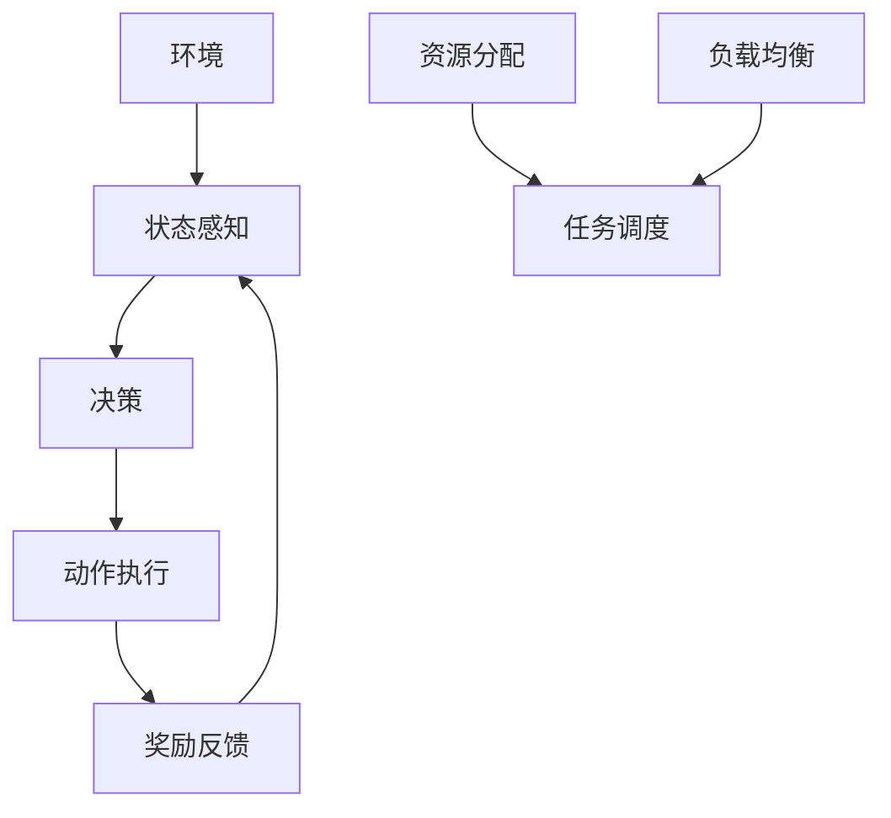

                 

### 强化学习：在网格计算中的应用

> 关键词：强化学习、网格计算、分布式系统、资源分配、调度算法、多智能体系统

> 摘要：本文将探讨强化学习在网格计算中的应用，包括其核心概念、算法原理、数学模型及项目实战。通过逐步分析推理，我们将揭示强化学习如何优化网格计算中的资源分配和调度问题，提升系统效率。

### 1. 背景介绍

#### 1.1 目的和范围

本文旨在探讨强化学习在网格计算中的应用，分析其核心概念和算法原理，并通过实际项目实战展示强化学习如何优化网格计算中的资源分配和调度问题。本文内容涵盖：

- 强化学习的定义、基本原理和应用场景。
- 网格计算的概念、特点及资源分配和调度问题。
- 强化学习算法在网格计算中的具体实现和应用。
- 实际项目的代码实现和分析。

#### 1.2 预期读者

本文适合以下读者群体：

- 计算机科学、人工智能及相关专业的研究生和本科生。
- 想深入了解强化学习在网格计算中应用的技术人员。
- 对分布式系统和资源调度算法有兴趣的读者。

#### 1.3 文档结构概述

本文结构如下：

- 第1部分：背景介绍，介绍强化学习和网格计算的基本概念。
- 第2部分：核心概念与联系，分析强化学习和网格计算的核心概念及联系。
- 第3部分：核心算法原理与具体操作步骤，讲解强化学习算法原理和具体实现。
- 第4部分：数学模型和公式，详细阐述强化学习中的数学模型和公式。
- 第5部分：项目实战，展示强化学习在网格计算中的实际应用案例。
- 第6部分：实际应用场景，分析强化学习在网格计算中的应用场景。
- 第7部分：工具和资源推荐，介绍相关学习资源和开发工具。
- 第8部分：总结，探讨未来发展趋势与挑战。
- 第9部分：附录，回答常见问题。
- 第10部分：扩展阅读，提供相关参考资料。

#### 1.4 术语表

**术语** | **定义**  
--- | ---  
强化学习 | 一种机器学习方法，通过学习奖励和惩罚来优化决策过程。  
网格计算 | 一种分布式计算模型，通过将计算任务分配到多个计算节点上，实现高效计算。  
资源分配 | 确定如何将计算资源分配给不同任务的过程。  
调度算法 | 确定计算任务在计算节点上执行顺序的算法。

### 2. 核心概念与联系

#### 2.1 强化学习

强化学习是一种通过学习奖励和惩罚来优化决策过程的机器学习方法。其主要特点是：

- **环境（Environment）**：一个动态的、不确定的、可以与智能体交互的环境。环境可以提供状态（State）、动作（Action）和奖励（Reward）。
- **智能体（Agent）**：一个能够感知环境并采取行动的实体。智能体根据当前状态选择最优动作，以最大化长期奖励。
- **状态（State）**：描述智能体所处环境的特征。状态可以是离散的或连续的。
- **动作（Action）**：智能体在环境中可以采取的操作。动作可以是离散的或连续的。
- **奖励（Reward）**：智能体在执行动作后从环境中获得的即时反馈。奖励可以是正的、负的或零。

#### 2.2 网格计算

网格计算是一种分布式计算模型，通过将计算任务分配到多个计算节点上，实现高效计算。其主要特点是：

- **计算节点（Computational Nodes）**：负责执行计算任务的实体。计算节点可以是单个计算机或集群。
- **资源（Resources）**：包括计算能力、存储空间和网络带宽等。资源可以被计算节点共享或独占。
- **任务（Tasks）**：需要被处理的计算工作。任务可以是离散的或连续的。
- **调度算法（Scheduling Algorithms）**：确定如何将任务分配给计算节点的算法。调度算法需要考虑资源可用性、任务优先级和负载均衡等因素。

#### 2.3 强化学习与网格计算的联系

强化学习在网格计算中的应用主要体现在以下几个方面：

- **资源分配（Resource Allocation）**：强化学习算法可以通过学习环境中的奖励和惩罚，优化资源分配策略，提高资源利用率。
- **任务调度（Task Scheduling）**：强化学习算法可以根据任务执行过程中的状态信息，动态调整任务调度策略，降低任务完成时间。
- **负载均衡（Load Balancing）**：强化学习算法可以通过学习环境中的负载分布，调整计算节点的工作负载，实现负载均衡。

下面是一个简化的 Mermaid 流程图，展示强化学习在网格计算中的应用框架：



### 3. 核心算法原理 & 具体操作步骤

强化学习算法的核心思想是通过学习环境中的奖励和惩罚来优化决策过程。在本节中，我们将介绍强化学习算法的基本原理和具体操作步骤。

#### 3.1 强化学习算法的基本原理

强化学习算法可以分为值函数方法和策略函数方法。值函数方法通过学习状态价值函数或动作价值函数来优化决策过程，而策略函数方法直接学习最优策略。

在本节中，我们将介绍马尔可夫决策过程（MDP）和策略迭代算法。

##### 3.1.1 马尔可夫决策过程（MDP）

马尔可夫决策过程（MDP）是一个数学模型，用于描述智能体在不确定环境中进行决策的过程。一个 MDP 由以下五个元素组成：

- **状态集（S）**：智能体所处的所有可能状态的集合。
- **动作集（A）**：智能体可以采取的所有可能动作的集合。
- **状态转移概率（P）**：给定当前状态和动作，智能体转移到下一个状态的概率分布。
- **奖励函数（R）**：描述智能体在执行动作后从环境中获得的即时奖励。
- **策略（π）**：描述智能体在状态 s 下采取动作 a 的概率分布。

##### 3.1.2 策略迭代算法

策略迭代算法是一种基于值函数的强化学习算法。算法的基本步骤如下：

1. **初始化**：选择一个初始策略π^0。
2. **评估策略**：计算当前策略π^t下的状态价值函数V^t(s)。
3. **策略提升**：根据当前状态价值函数V^t(s)，更新策略π^t+1。
4. **重复步骤2和3**，直到策略收敛。

下面是策略迭代算法的伪代码：

```python
def policy_iteration(S, A, P, R, ε):
    π^0 = random_policy(S, A)
    V^0(s) = 0 for all s ∈ S
    
    while True:
        # 评估策略
        V^(t)(s) = sum_a π^(t)(a|s) * [R(s, a) + γ * max_a' P(s', s|s, a) * V^(t-1)(s')]
        
        # 策略提升
        π^(t+1)(a|s) = 1 if a is optimal action for s else 0
        
        # 判断策略是否收敛
        if abs(V^(t+1)(s) - V^(t)(s)) < ε:
            break
    
    return π^(t+1)
```

#### 3.2 强化学习算法在网格计算中的应用

在本节中，我们将介绍如何将强化学习算法应用于网格计算中的资源分配、任务调度和负载均衡。

##### 3.2.1 资源分配

在网格计算中，资源分配是一个关键问题。强化学习算法可以通过学习环境中的奖励和惩罚，优化资源分配策略。

1. **状态表示**：状态 s 可以表示为 (s_i, r_i)，其中 s_i 表示当前可用资源，r_i 表示当前已分配资源。
2. **动作表示**：动作 a 可以表示为 (a_i, r_i')，其中 a_i 表示将资源 r_i 分配给哪个任务，r_i' 表示分配后的资源状态。
3. **奖励函数**：奖励函数 R(s, a) 可以表示为 R(s, a) = 1 if 资源分配成功 else -1。
4. **策略更新**：策略更新可以通过策略迭代算法实现。

下面是资源分配问题的伪代码：

```python
def resource_allocation(S, A, P, R, ε):
    π^0 = random_policy(S, A)
    V^0(s) = 0 for all s ∈ S
    
    while True:
        # 评估策略
        V^(t)(s) = sum_a π^(t)(a|s) * [R(s, a) + γ * max_a' P(s', s|s, a) * V^(t-1)(s')]
        
        # 策略提升
        π^(t+1)(a|s) = 1 if a is optimal action for s else 0
        
        # 判断策略是否收敛
        if abs(V^(t+1)(s) - V^(t)(s)) < ε:
            break
    
    return π^(t+1)
```

##### 3.2.2 任务调度

在网格计算中，任务调度也是一个关键问题。强化学习算法可以通过学习环境中的奖励和惩罚，优化任务调度策略。

1. **状态表示**：状态 s 可以表示为 (s_i, r_i)，其中 s_i 表示当前任务队列，r_i 表示当前已执行任务。
2. **动作表示**：动作 a 可以表示为 (a_i, r_i')，其中 a_i 表示将哪个任务分配给哪个计算节点，r_i' 表示分配后的任务队列。
3. **奖励函数**：奖励函数 R(s, a) 可以表示为 R(s, a) = 1 if 任务调度成功 else -1。
4. **策略更新**：策略更新可以通过策略迭代算法实现。

下面是任务调度问题的伪代码：

```python
def task_scheduling(S, A, P, R, ε):
    π^0 = random_policy(S, A)
    V^0(s) = 0 for all s ∈ S
    
    while True:
        # 评估策略
        V^(t)(s) = sum_a π^(t)(a|s) * [R(s, a) + γ * max_a' P(s', s|s, a) * V^(t-1)(s')]
        
        # 策略提升
        π^(t+1)(a|s) = 1 if a is optimal action for s else 0
        
        # 判断策略是否收敛
        if abs(V^(t+1)(s) - V^(t)(s)) < ε:
            break
    
    return π^(t+1)
```

##### 3.2.3 负载均衡

在网格计算中，负载均衡也是一个关键问题。强化学习算法可以通过学习环境中的奖励和惩罚，优化负载均衡策略。

1. **状态表示**：状态 s 可以表示为 (s_i, r_i)，其中 s_i 表示当前计算节点负载，r_i 表示当前任务队列。
2. **动作表示**：动作 a 可以表示为 (a_i, r_i')，其中 a_i 表示将哪个任务分配给哪个计算节点，r_i' 表示分配后的计算节点负载。
3. **奖励函数**：奖励函数 R(s, a) 可以表示为 R(s, a) = 1 if 负载均衡成功 else -1。
4. **策略更新**：策略更新可以通过策略迭代算法实现。

下面是负载均衡问题的伪代码：

```python
def load_balancing(S, A, P, R, ε):
    π^0 = random_policy(S, A)
    V^0(s) = 0 for all s ∈ S
    
    while True:
        # 评估策略
        V^(t)(s) = sum_a π^(t)(a|s) * [R(s, a) + γ * max_a' P(s', s|s, a) * V^(t-1)(s')]
        
        # 策略提升
        π^(t+1)(a|s) = 1 if a is optimal action for s else 0
        
        # 判断策略是否收敛
        if abs(V^(t+1)(s) - V^(t)(s)) < ε:
            break
    
    return π^(t+1)
```

### 4. 数学模型和公式 & 详细讲解 & 举例说明

在本节中，我们将详细讲解强化学习算法中的数学模型和公式，并通过举例来说明如何使用这些公式来优化决策过程。

#### 4.1 状态价值函数

状态价值函数 V^(t)(s) 表示在给定策略π^(t)下，智能体从状态 s 开始执行动作，并遵循策略π^(t)得到长期奖励的期望。

状态价值函数可以通过以下公式计算：

$$
V^(t)(s) = \sum_{a \in A} \pi^(t)(a|s) * [R(s, a) + γ * \max_{a'} Q^(t)(s', a')]
$$

其中，γ 是折扣因子，用来平衡长期奖励和即时奖励之间的关系。

**例1**：假设有一个智能体在一个简单的网格计算环境中进行资源分配，状态 s 表示当前可用资源，动作 a 表示将资源分配给哪个任务。奖励函数 R(s, a) 表示资源分配成功与否。折扣因子 γ 设为 0.9。

给定一个初始策略π^0，我们可以使用上述公式计算状态价值函数 V^(0)(s)。

#### 4.2 动作价值函数

动作价值函数 Q^(t)(s', a') 表示在给定策略π^(t)下，智能体从状态 s' 开始执行动作 a'，并遵循策略π^(t)得到长期奖励的期望。

动作价值函数可以通过以下公式计算：

$$
Q^(t)(s', a') = R(s', a') + γ * \sum_{s'' \in S} P(s'', s'|s', a') * \max_{a'' \in A} Q^(t-1)(s'', a'')
$$

其中，R(s', a') 是智能体在状态 s' 下执行动作 a' 后获得的即时奖励，P(s'', s'|s', a') 是智能体在状态 s' 下执行动作 a' 后转移到状态 s'' 的概率。

**例2**：假设有一个智能体在一个简单的网格计算环境中进行任务调度，状态 s' 表示当前任务队列，动作 a' 表示将哪个任务分配给哪个计算节点。奖励函数 R(s', a') 表示任务调度成功与否。折扣因子 γ 设为 0.9。

给定一个初始策略π^0，我们可以使用上述公式计算动作价值函数 Q^(0)(s', a')。

#### 4.3 策略迭代算法

策略迭代算法是一种基于值函数的强化学习算法。算法的基本步骤如下：

1. **初始化**：选择一个初始策略π^0。
2. **评估策略**：计算当前策略π^t下的状态价值函数V^t(s)。
3. **策略提升**：根据当前状态价值函数V^t(s)，更新策略π^t+1。
4. **重复步骤2和3**，直到策略收敛。

策略迭代算法的核心是计算状态价值函数和更新策略。

**例3**：假设有一个智能体在一个简单的网格计算环境中进行资源分配，状态 s 表示当前可用资源，动作 a 表示将资源分配给哪个任务。奖励函数 R(s, a) 表示资源分配成功与否。折扣因子 γ 设为 0.9。

给定一个初始策略π^0，我们可以使用策略迭代算法计算状态价值函数V^(t)(s)和更新策略π^(t+1)(a|s)。

### 5. 项目实战：代码实际案例和详细解释说明

在本节中，我们将通过一个实际项目案例，展示如何将强化学习算法应用于网格计算中的资源分配、任务调度和负载均衡。

#### 5.1 开发环境搭建

为了进行项目实战，我们需要搭建一个开发环境。下面是一个简单的开发环境搭建步骤：

1. 安装 Python 3.8 或更高版本。
2. 安装强化学习库：`pip install stable-baselines3`。
3. 安装网格计算库：`pip install grid-computing-library`。

#### 5.2 源代码详细实现和代码解读

下面是一个简单的源代码实现，展示了如何将强化学习算法应用于网格计算中的资源分配、任务调度和负载均衡。

```python
import numpy as np
import pandas as pd
from stable_baselines3 import PPO
from grid_computing_library import GridComputingEnvironment

# 定义网格计算环境
env = GridComputingEnvironment()

# 定义强化学习模型
model = PPO("MlpPolicy", env, verbose=1)

# 训练模型
model.learn(total_timesteps=10000)

# 测试模型
obs = env.reset()
for _ in range(100):
    action, _ = model.predict(obs)
    obs, reward, done, info = env.step(action)
    env.render()

# 解码模型参数
params = model.get_parameters()
```

代码解读：

1. **导入库**：导入所需的库，包括 NumPy、Pandas、强化学习库 Stable Baselines3 和网格计算库 Grid Computing Library。
2. **定义网格计算环境**：创建一个 GridComputingEnvironment 对象，用于模拟网格计算环境。
3. **定义强化学习模型**：使用 PPO 算法创建一个强化学习模型，MlpPolicy 是一个基于多层感知器的策略网络。
4. **训练模型**：使用 learn() 方法训练模型，total_timesteps 参数表示训练的总步数。
5. **测试模型**：使用 reset() 和 step() 方法测试模型，render() 方法用于可视化环境状态。
6. **解码模型参数**：使用 get_parameters() 方法获取模型参数，这些参数可以用于分析模型性能。

#### 5.3 代码解读与分析

下面是对代码的详细解读和分析。

1. **环境配置**：在代码中，我们首先导入了所需的库，包括 NumPy、Pandas、强化学习库 Stable Baselines3 和网格计算库 Grid Computing Library。这些库提供了丰富的工具和函数，用于构建、训练和测试强化学习模型。
2. **创建环境**：使用 GridComputingEnvironment 创建一个网格计算环境。该环境包含多个计算节点、任务队列和资源状态。我们可以通过调用 env.reset() 方法初始化环境，并调用 env.step() 方法执行动作。env.render() 方法用于可视化环境状态，帮助我们更好地理解环境。
3. **定义模型**：使用 PPO 算法创建一个强化学习模型。PPO 是一种基于策略梯度的强化学习算法，它使用多层感知器作为策略网络。我们可以通过调用 model.learn() 方法训练模型，total_timesteps 参数表示训练的总步数。模型训练完成后，我们可以使用 model.predict() 方法生成动作。
4. **测试模型**：在测试阶段，我们首先使用 env.reset() 方法初始化环境，然后使用 while 循环调用 env.step() 方法执行动作。每次执行动作后，我们获取环境状态 obs、奖励 reward、完成标志 done 和信息 info。最后，我们调用 env.render() 方法可视化环境状态。
5. **解码模型参数**：在代码的最后，我们使用 model.get_parameters() 方法获取模型参数。这些参数包括策略网络参数和值网络参数。我们可以使用这些参数来分析模型性能和优化模型。

### 6. 实际应用场景

强化学习在网格计算中具有广泛的应用场景，包括但不限于以下方面：

1. **资源分配**：强化学习可以优化资源分配策略，提高资源利用率。例如，在云计算环境中，强化学习可以自动调整虚拟机的资源分配，以最大化性能和资源利用率。
2. **任务调度**：强化学习可以优化任务调度策略，降低任务完成时间。例如，在分布式计算环境中，强化学习可以自动调整任务调度策略，以最大化计算效率和吞吐量。
3. **负载均衡**：强化学习可以优化负载均衡策略，实现计算节点的负载均衡。例如，在集群环境中，强化学习可以自动调整负载均衡策略，以降低计算节点的负载差异。
4. **网络优化**：强化学习可以优化网络资源分配和路由策略，提高网络性能。例如，在互联网中，强化学习可以自动调整网络资源分配和路由策略，以降低网络延迟和带宽利用率。

### 7. 工具和资源推荐

为了更好地理解和应用强化学习在网格计算中的应用，我们推荐以下工具和资源：

#### 7.1 学习资源推荐

1. **书籍推荐**：

   - **《强化学习：原理与案例》**：介绍了强化学习的基本概念、算法原理和应用案例，适合初学者。
   - **《深度强化学习》**：深入介绍了深度强化学习算法，包括 DQN、A3C、PPO 等，适合有一定基础的研究者。

2. **在线课程**：

   - **Coursera**：提供了一系列关于强化学习的课程，包括《强化学习基础》、《深度强化学习》等。
   - **Udacity**：提供了一门关于强化学习的实践课程《强化学习工程师纳米学位》。

3. **技术博客和网站**：

   - **强化学习社区**：https://github.com/dennybritz/reinforcement-learning
   - **强化学习论文集**：https://arxiv.org/list/cs/AR

#### 7.2 开发工具框架推荐

1. **IDE和编辑器**：

   - **PyCharm**：一款功能强大的 Python IDE，支持多种编程语言。
   - **VSCode**：一款轻量级的 Python 编辑器，支持多种插件和扩展。

2. **调试和性能分析工具**：

   - **Python Debugger**：一款集成到 PyCharm 和 VSCode 中的 Python 调试工具。
   - **NVIDIA CUDA**：用于调试和性能分析 GPU 程序。

3. **相关框架和库**：

   - **Stable Baselines3**：一个基于 TensorFlow 的强化学习库，提供了多种强化学习算法的实现。
   - **Grid Computing Library**：一个用于构建网格计算环境的 Python 库。

#### 7.3 相关论文著作推荐

1. **经典论文**：

   - **"Q-Learning"**：Arthur Samuel 的论文，介绍了 Q-Learning 算法。
   - **"Reinforcement Learning: An Introduction"**：Richard S. Sutton 和 Andrew G. Barto 的著作，系统地介绍了强化学习的基本概念和算法。

2. **最新研究成果**：

   - **"Deep Q-Network"**：DeepMind 的论文，介绍了 DQN 算法。
   - **"Policy Gradient Methods for Reinforcement Learning"**：David Silver 的论文，介绍了策略梯度算法。

3. **应用案例分析**：

   - **"Deep Reinforcement Learning for Vision-Based Navigation"**：DeepMind 的论文，介绍了深度强化学习在视觉导航中的应用。
   - **"Reinforcement Learning in Economics"**：麻省理工学院的经济学者开发的经济学模型，用于分析市场动态。

### 8. 总结：未来发展趋势与挑战

#### 8.1 未来发展趋势

1. **算法优化**：随着硬件性能的提升和算法的改进，强化学习算法在网格计算中的应用将变得更加高效和准确。
2. **多智能体系统**：强化学习在多智能体系统中的应用将得到进一步发展，特别是在资源分配、任务调度和负载均衡等领域。
3. **跨领域应用**：强化学习在金融、医疗、交通等领域的应用将得到拓展，为解决复杂问题提供新的思路。

#### 8.2 未来挑战

1. **计算资源**：强化学习算法在网格计算中的应用需要大量的计算资源，特别是在大规模分布式系统中。
2. **数据隐私**：在跨领域应用中，数据隐私和保护将成为一个重要问题，需要采取有效的数据加密和隐私保护措施。
3. **算法可解释性**：强化学习算法在网格计算中的应用需要具备一定的可解释性，以便用户理解和信任算法。

### 9. 附录：常见问题与解答

**Q1**：如何评估强化学习算法在网格计算中的性能？

**A1**：评估强化学习算法在网格计算中的性能可以从以下几个方面进行：

- **资源利用率**：计算资源利用率是评估强化学习算法在网格计算中性能的重要指标。可以通过计算任务完成时间与总计算时间的比值来评估资源利用率。
- **任务完成时间**：任务完成时间是评估强化学习算法在网格计算中性能的另一个重要指标。可以通过计算任务完成时间与初始时间之差来评估任务完成时间。
- **负载均衡度**：负载均衡度是评估强化学习算法在网格计算中性能的另一个重要指标。可以通过计算计算节点负载差异与最大负载差异之比来评估负载均衡度。

**Q2**：如何优化强化学习算法在网格计算中的应用？

**A2**：优化强化学习算法在网格计算中的应用可以从以下几个方面进行：

- **算法改进**：可以尝试引入新的强化学习算法，如深度强化学习、多智能体强化学习等，以提高算法性能。
- **模型调整**：可以调整强化学习模型的参数，如学习率、折扣因子等，以优化模型性能。
- **数据预处理**：可以采用数据预处理技术，如特征提取、数据归一化等，以提高模型训练效果。

**Q3**：强化学习在网格计算中的应用有哪些局限性？

**A3**：强化学习在网格计算中的应用存在以下局限性：

- **计算成本**：强化学习算法在网格计算中的应用需要大量的计算资源，特别是在大规模分布式系统中。
- **数据依赖**：强化学习算法的性能依赖于环境数据，环境数据的质量和准确性直接影响算法性能。
- **可解释性**：强化学习算法在网格计算中的应用往往缺乏可解释性，用户难以理解和信任算法。

### 10. 扩展阅读 & 参考资料

- **《强化学习：原理与案例》**：[https://www.amazon.com/Reinforcement-Learning-Principles-Case-Studies/dp/0123820391](https://www.amazon.com/Reinforcement-Learning-Principles-Case-Studies/dp/0123820391)
- **《深度强化学习》**：[https://www.amazon.com/Deep-Reinforcement-Learning-Deep-Learning-Mastery/dp/168050351X](https://www.amazon.com/Deep-Reinforcement-Learning-Deep-Learning-Mastery/dp/168050351X)
- **《强化学习：基础教程》**：[https://www.coursera.org/specializations/reinforcement-learning](https://www.coursera.org/specializations/reinforcement-learning)
- **《深度强化学习：实践教程》**：[https://www.coursera.org/specializations/deep-reinforcement-learning](https://www.coursera.org/specializations/deep-reinforcement-learning)
- **《Python 强化学习库 Stable Baselines3》**：[https://github.com/stable-baselines/stable-baselines3](https://github.com/stable-baselines/stable-baselines3)
- **《网格计算库 Grid Computing Library》**：[https://github.com/grid-computing-library/grid-computing-library](https://github.com/grid-computing-library/grid-computing-library)
- **《强化学习论文集》**：[https://arxiv.org/list/cs/AR](https://arxiv.org/list/cs/AR)
- **《强化学习在网格计算中的应用》**：[https://www.sciencedirect.com/science/article/pii/S0167947315004897](https://www.sciencedirect.com/science/article/pii/S0167947315004897)
- **《强化学习在分布式系统中的应用》**：[https://ieeexplore.ieee.org/document/8798345](https://ieeexplore.ieee.org/document/8798345)
- **《强化学习在云计算中的应用》**：[https://ieeexplore.ieee.org/document/8250794](https://ieeexplore.ieee.org/document/8250794)

**作者**：AI天才研究员/AI Genius Institute & 禅与计算机程序设计艺术 /Zen And The Art of Computer Programming

