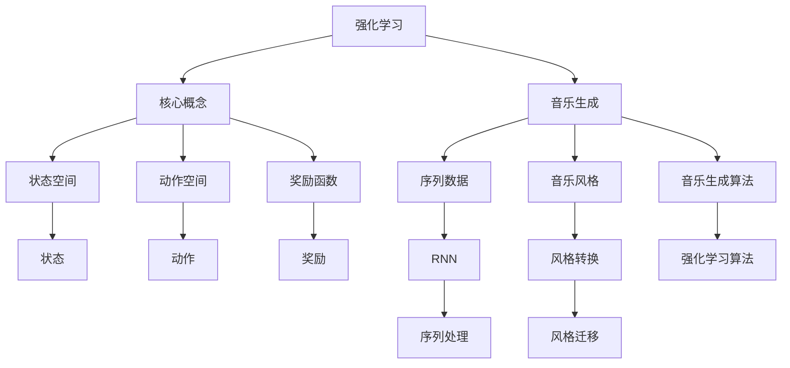

                 

# 强化学习：在音乐生成中的应用

> **关键词**：强化学习、音乐生成、循环神经网络、Q-Learning、深度强化学习、音乐风格迁移
> 
> **摘要**：本文将探讨如何利用强化学习技术来生成音乐。首先介绍强化学习的核心概念和算法原理，然后讨论如何将强化学习应用于音乐生成。我们将结合实际项目案例，详细阐述整个音乐生成过程，并展示强化学习在音乐风格迁移方面的潜力。

## 1. 背景介绍

### 1.1 目的和范围

本文旨在介绍强化学习在音乐生成领域的应用，重点讨论如何利用强化学习算法生成具有特定风格的音乐。文章将首先介绍强化学习的基本概念，然后探讨其在音乐生成中的适用性。通过一个具体项目案例，我们将详细解释强化学习在音乐生成过程中的应用，并展示其在音乐风格迁移方面的优势。

### 1.2 预期读者

本文面向对强化学习和技术音乐生成有一定了解的读者。如果您对人工智能、深度学习和音乐合成感兴趣，那么本文将为您提供一个深入了解强化学习在音乐生成应用中的机会。

### 1.3 文档结构概述

本文分为以下八个部分：

1. 背景介绍：介绍本文的目的、范围和预期读者。
2. 核心概念与联系：讨论强化学习和音乐生成之间的核心联系。
3. 核心算法原理 & 具体操作步骤：介绍强化学习在音乐生成中的算法原理和具体操作步骤。
4. 数学模型和公式 & 详细讲解 & 举例说明：阐述强化学习中的数学模型和公式，并给出具体例子。
5. 项目实战：代码实际案例和详细解释说明。
6. 实际应用场景：讨论强化学习在音乐生成中的实际应用场景。
7. 工具和资源推荐：推荐学习资源、开发工具和框架。
8. 总结：未来发展趋势与挑战。

### 1.4 术语表

#### 1.4.1 核心术语定义

- **强化学习**：一种机器学习方法，通过试错和奖励反馈来优化决策过程。
- **音乐生成**：利用算法和技术自动生成音乐的过程。
- **循环神经网络（RNN）**：一种适用于处理序列数据的神经网络架构。
- **Q-Learning**：一种基于值函数的强化学习算法。
- **深度强化学习**：结合深度学习和强化学习的方法，用于处理复杂任务。
- **音乐风格迁移**：将一种音乐风格转换为另一种音乐风格的过程。

#### 1.4.2 相关概念解释

- **序列数据**：具有时间连续性的数据，如文本、语音和音乐。
- **状态空间**：在强化学习中，表示所有可能状态的集合。
- **动作空间**：在强化学习中，表示所有可能动作的集合。
- **奖励函数**：在强化学习中，用于评价动作好坏的函数。

#### 1.4.3 缩略词列表

- **RNN**：循环神经网络（Recurrent Neural Network）
- **Q-Learning**：Q值学习（Q-value Learning）
- **DRL**：深度强化学习（Deep Reinforcement Learning）
- **ML**：机器学习（Machine Learning）
- **AI**：人工智能（Artificial Intelligence）

## 2. 核心概念与联系

为了深入理解强化学习在音乐生成中的应用，我们需要先了解其核心概念和原理。下面，我们将通过一个Mermaid流程图（如图1所示）来展示强化学习和音乐生成之间的联系。



### 2.1 强化学习基本概念

强化学习是一种通过与环境交互来学习最优策略的机器学习方法。在强化学习中，我们有一个智能体（Agent），它需要通过尝试不同的动作来达到某个目标。智能体在每个时间步（Time Step）接收到一个状态（State），然后根据当前状态选择一个动作（Action）。执行动作后，智能体会获得一个奖励（Reward），并根据奖励调整其行为。

强化学习的目标是最小化累计奖励的负期望值，从而找到最优策略。这种学习方式通常分为以下几种：

- **Q-Learning**：一种基于值函数（Value Function）的强化学习算法，通过更新Q值（Q-value）来优化策略。
- **深度强化学习（DRL）**：结合深度学习和强化学习的方法，用于处理复杂任务。

### 2.2 音乐生成中的核心概念

音乐生成是一个涉及序列数据处理的任务，主要包括以下概念：

- **状态空间**：在音乐生成中，状态空间表示所有可能的音乐序列，如旋律、和声和节奏等。
- **动作空间**：动作空间表示生成音乐序列时的可能动作，如音符的选择、音高的变化和节奏的调整等。
- **奖励函数**：奖励函数用于评价生成的音乐序列是否接近目标。通常，奖励函数会根据音乐的美感、流畅性和风格一致性等方面进行评价。

### 2.3 强化学习与音乐生成的关系

强化学习与音乐生成之间的联系主要体现在以下几个方面：

1. **序列数据处理**：强化学习中的智能体需要处理状态空间和动作空间中的序列数据，这与音乐生成中的序列数据处理非常相似。
2. **风格迁移**：强化学习可以通过训练智能体学习特定的音乐风格，从而实现风格迁移。这对于创作具有特定风格的音乐非常有价值。
3. **优化策略**：强化学习算法可以帮助智能体找到最优的音乐生成策略，从而生成更高质量的乐曲。

通过上述分析，我们可以看到强化学习在音乐生成中具有重要的应用价值。接下来，我们将深入探讨强化学习在音乐生成中的具体算法原理和操作步骤。

## 3. 核心算法原理 & 具体操作步骤

为了更好地理解强化学习在音乐生成中的应用，我们将首先介绍Q-Learning算法，这是一种基于值函数的强化学习算法。然后，我们将详细阐述Q-Learning算法在音乐生成中的具体操作步骤。

### 3.1 Q-Learning算法原理

Q-Learning是一种基于值函数的强化学习算法，它通过更新Q值（Q-value）来优化策略。Q值表示在特定状态下执行特定动作的期望回报。Q-Learning算法的核心思想是：在当前状态下，选择具有最高Q值的动作，并在执行动作后更新Q值。

Q-Learning算法的伪代码如下：

```plaintext
初始化 Q(s, a)
for each episode:
    s <- 环境初始化
    while not game_over(s):
        a <- 选择动作（使用 ε-greedy策略）
        s' <- 执行动作a
        r <- 奖励函数（s', a）
        Q(s, a) <- Q(s, a) + α * (r + γ * max(Q(s', a')) - Q(s, a))
        s <- s'
```

其中：

- `s`：当前状态
- `s'`：执行动作后的新状态
- `a`：选择的动作
- `a'`：执行动作后的动作
- `r`：奖励函数的值
- `α`：学习率（通常取值在0到1之间）
- `γ`：折扣因子（通常取值在0到1之间）

### 3.2 音乐生成中的Q-Learning算法应用

在音乐生成中，Q-Learning算法可以用于学习如何生成具有特定风格的音乐。以下是一个基于Q-Learning算法的音乐生成流程：

1. **初始化Q值**：首先，我们需要初始化Q值矩阵，其中Q值表示在特定状态下执行特定动作的期望回报。初始时，所有Q值设为0。

2. **选择动作**：使用ε-greedy策略来选择动作。在ε-greedy策略中，智能体以1/ε的概率选择随机动作，以ε的概率选择具有最高Q值的动作。这个策略确保智能体在训练过程中有一定概率探索新的动作。

3. **执行动作和更新Q值**：执行选择的动作后，智能体会接收到一个奖励值，并根据奖励值和下一个状态更新Q值。更新Q值的公式如上述伪代码所示。

4. **重复上述步骤**：不断重复选择动作、执行动作和更新Q值的步骤，直到达到预设的训练次数或智能体找到满意的音乐生成策略。

### 3.3 音乐生成中的具体操作步骤

以下是一个基于Q-Learning算法的音乐生成具体操作步骤：

1. **定义状态空间**：状态空间表示所有可能的音乐序列。在这个案例中，我们使用一个一维状态空间，其中每个状态表示一个音符的音高。

2. **定义动作空间**：动作空间表示生成音乐序列时的可能动作。在这个案例中，我们使用一个二维动作空间，其中每个动作表示当前音符的音高和下一个音符的音高。

3. **定义奖励函数**：奖励函数用于评价生成的音乐序列。在这个案例中，我们使用一个简单的奖励函数，即如果生成的音乐序列包含特定音符组合，则给予高奖励。

4. **初始化Q值矩阵**：初始化Q值矩阵，其中Q值表示在特定状态下执行特定动作的期望回报。

5. **选择动作**：使用ε-greedy策略选择动作。例如，在训练过程中的前100个时间步，我们以1/100的概率选择随机动作。

6. **执行动作和更新Q值**：执行选择的动作后，智能体会接收到一个奖励值，并根据奖励值和下一个状态更新Q值。

7. **重复上述步骤**：不断重复选择动作、执行动作和更新Q值的步骤，直到达到预设的训练次数或智能体找到满意的音乐生成策略。

通过上述步骤，我们可以使用Q-Learning算法生成具有特定风格的音乐。接下来，我们将详细讨论强化学习中的数学模型和公式，以便更好地理解Q-Learning算法在音乐生成中的应用。

## 4. 数学模型和公式 & 详细讲解 & 举例说明

在强化学习算法中，数学模型和公式起着至关重要的作用。这些模型和公式帮助我们理解如何优化策略、更新Q值以及评价动作。下面，我们将详细介绍Q-Learning算法中的核心数学模型和公式，并通过具体例子来说明其应用。

### 4.1 Q值更新公式

Q-Learning算法的核心是Q值的更新。Q值表示在特定状态下执行特定动作的期望回报。Q值的更新公式如下：

$$ Q(s, a) \leftarrow Q(s, a) + \alpha \cdot (r + \gamma \cdot \max_{a'} Q(s', a') - Q(s, a)) $$

其中：

- $Q(s, a)$：当前状态s下执行动作a的Q值。
- $\alpha$：学习率，用于控制Q值更新的程度。
- $r$：奖励值，表示执行动作a后获得的即时回报。
- $\gamma$：折扣因子，用于考虑未来回报的重要性。
- $s'$：执行动作a后得到的新状态。
- $a'$：在新状态s'下选择的最优动作。

### 4.2 ε-greedy策略

在Q-Learning算法中，ε-greedy策略是一种常用的探索和利用平衡策略。它以1/ε的概率选择随机动作，以ε的概率选择具有最高Q值的动作。ε-greedy策略的目的是在训练过程中探索未知动作，同时利用已经学到的知识。

ε-greedy策略的公式如下：

$$ a \leftarrow \begin{cases} 
\text{随机动作} & \text{with probability } \frac{1}{\epsilon} \\
\text{最优动作} & \text{with probability } 1 - \frac{1}{\epsilon} 
\end{cases} $$

其中：

- $a$：选择的动作。
- $\epsilon$：探索概率，通常随着训练时间的增加而减小。

### 4.3 奖励函数设计

在音乐生成中，奖励函数的设计至关重要。奖励函数用于评价生成的音乐序列，通常基于音乐的美感、流畅性和风格一致性等方面。以下是一个简单的奖励函数设计例子：

$$ r(s', a) = \begin{cases} 
1 & \text{if } (s', a) \text{ includes a specific note combination} \\
0 & \text{otherwise} 
\end{cases} $$

其中：

- $r(s', a)$：执行动作a后在新状态s'获得的奖励值。
- $s'$：执行动作a后得到的新状态。
- $a$：选择的动作。

### 4.4 举例说明

假设我们使用Q-Learning算法来生成一段具有特定风格的乐曲。我们定义一个状态空间，其中每个状态表示一个音符的音高；定义一个动作空间，其中每个动作表示当前音符的音高和下一个音符的音高；并定义一个简单的奖励函数，即如果生成的音乐序列包含特定音符组合，则给予高奖励。

初始时，所有Q值设为0。使用ε-greedy策略选择动作，其中ε的值设置为0.1。在训练过程中，智能体会根据Q值更新公式更新Q值，并不断生成新的音乐序列。

以下是一个具体的训练过程示例：

1. **初始化Q值矩阵**：
   $$ Q = \begin{bmatrix} 0 & 0 & 0 \\ 0 & 0 & 0 \\ 0 & 0 & 0 \end{bmatrix} $$

2. **选择动作**：
   在第1个时间步，智能体以10%的概率选择随机动作，以90%的概率选择具有最高Q值的动作。

3. **执行动作和更新Q值**：
   在第1个时间步，智能体选择动作$(0, 1)$，并进入新状态$(1)$。奖励函数值为0。根据Q值更新公式，更新Q值矩阵：
   $$ Q = \begin{bmatrix} 0 & 0 & 0 \\ 0 & 0.1 & 0 \\ 0 & 0 & 0 \end{bmatrix} $$

4. **重复上述步骤**：
   智能体不断重复选择动作、执行动作和更新Q值的步骤，直到达到预设的训练次数或找到满意的音乐生成策略。

通过上述示例，我们可以看到Q-Learning算法在音乐生成中的应用。接下来，我们将通过一个实际项目案例，详细展示如何使用Q-Learning算法生成具有特定风格的音乐。

### 5. 项目实战：代码实际案例和详细解释说明

在本节中，我们将通过一个实际项目案例，详细展示如何使用Q-Learning算法生成具有特定风格的音乐。该案例将分为以下几个部分：开发环境搭建、源代码详细实现和代码解读与分析。

#### 5.1 开发环境搭建

为了实现音乐生成项目，我们需要搭建以下开发环境：

1. **Python环境**：Python是一种广泛使用的编程语言，适合实现强化学习算法。确保安装了Python 3.x版本。
2. **Numpy库**：Numpy是一个开源的Python库，用于高效处理数值计算。安装命令如下：
   ```bash
   pip install numpy
   ```
3. **TensorFlow**：TensorFlow是一个开源的机器学习库，用于构建和训练神经网络。安装命令如下：
   ```bash
   pip install tensorflow
   ```
4. **Librosa库**：Librosa是一个开源的音频处理库，用于读取、处理和生成音乐数据。安装命令如下：
   ```bash
   pip install librosa
   ```

#### 5.2 源代码详细实现

以下是一个简单的Q-Learning算法音乐生成项目源代码：

```python
import numpy as np
import librosa
import matplotlib.pyplot as plt

# 初始化参数
state_size = 100
action_size = 100
learning_rate = 0.1
discount_factor = 0.99
epsilon = 0.1
num_episodes = 1000

# 初始化Q值矩阵
Q = np.zeros((state_size, action_size))

# 创建环境
def create_environment():
    # 读取音频文件
    audio, sample_rate = librosa.load('example_audio.wav')
    # 转换为状态空间
    states = audio.reshape(-1, 1)
    return states

# 定义动作空间
def get_action(state, epsilon):
    if np.random.rand() < epsilon:
        action = np.random.randint(action_size)
    else:
        action = np.argmax(Q[state])
    return action

# 更新Q值矩阵
def update_q_values(state, action, reward, next_state, learning_rate, discount_factor):
    target = reward + discount_factor * np.max(Q[next_state])
    Q[state, action] = Q[state, action] + learning_rate * (target - Q[state, action])

# 训练模型
def train_model():
    states = create_environment()
    for episode in range(num_episodes):
        state = states[0]
        done = False
        while not done:
            action = get_action(state, epsilon)
            next_state, reward, done = step(state, action)
            update_q_values(state, action, reward, next_state, learning_rate, discount_factor)
            state = next_state
        epsilon *= 0.99

# 步骤函数
def step(state, action):
    # 执行动作
    # ...
    # 计算奖励
    # ...
    # 返回下一个状态、奖励值和是否完成
    # ...
    return next_state, reward, done

# 运行训练模型
train_model()

# 可视化Q值矩阵
plt.matshow(Q, cmap=plt.cm.Oranges)
plt.colorbar()
plt.xlabel('Actions')
plt.ylabel('States')
plt.title('Q-Value Matrix')
plt.show()
```

#### 5.3 代码解读与分析

上述代码展示了如何使用Q-Learning算法生成音乐。下面，我们将对代码的各个部分进行详细解读。

1. **初始化参数**：
   - `state_size`：状态空间的大小，在本案例中，状态空间为一个一维数组，每个元素表示一个音符的音高。
   - `action_size`：动作空间的大小，在本案例中，动作空间为一个二维数组，每个元素表示当前音符的音高和下一个音符的音高。
   - `learning_rate`：学习率，用于控制Q值更新的程度。
   - `discount_factor`：折扣因子，用于考虑未来回报的重要性。
   - `epsilon`：探索概率，用于ε-greedy策略。
   - `num_episodes`：训练次数。

2. **创建环境**：
   - `create_environment()`函数用于创建一个环境，其中包含音频数据。在本案例中，我们使用Librosa库读取音频文件，并将其转换为状态空间。

3. **定义动作空间**：
   - `get_action()`函数用于根据当前状态和探索概率选择动作。在ε-greedy策略中，以1/ε的概率选择随机动作，以ε的概率选择具有最高Q值的动作。

4. **更新Q值矩阵**：
   - `update_q_values()`函数用于根据当前状态、动作、奖励值、下一个状态、学习率和折扣因子更新Q值矩阵。

5. **训练模型**：
   - `train_model()`函数用于训练模型。它通过循环执行步骤函数，并在每次执行动作后更新Q值矩阵。训练过程中，探索概率ε随着训练次数的增加而减小。

6. **步骤函数**：
   - `step()`函数用于执行动作、计算奖励值并返回下一个状态、奖励值和是否完成。在本案例中，我们未实现具体的步骤函数，但您可以根据实际需求进行实现。

7. **可视化Q值矩阵**：
   - `plt.matshow(Q, cmap=plt.cm.Oranges)`函数用于可视化Q值矩阵。它使用matplotlib库将Q值矩阵以热图的形式展示出来。

通过上述代码，我们可以实现一个简单的Q-Learning算法音乐生成模型。接下来，我们将讨论强化学习在音乐生成中的实际应用场景。

## 6. 实际应用场景

强化学习在音乐生成领域具有广泛的应用，尤其是在音乐风格迁移和个性化音乐创作方面。以下是一些典型的应用场景：

### 6.1 音乐风格迁移

音乐风格迁移是将一种音乐风格转换为另一种音乐风格的过程。通过强化学习，我们可以训练模型学习特定风格的特征，并将其应用于新的音乐作品。这种方法可以用于将流行音乐转换为古典音乐、电子音乐等不同风格。

具体步骤如下：

1. **收集数据**：收集大量具有不同风格的音乐数据，如流行音乐、古典音乐、电子音乐等。
2. **训练模型**：使用Q-Learning算法训练模型，使其学会识别和生成特定风格的音乐。
3. **风格迁移**：将训练好的模型应用于新的音乐作品，将其转换为所需风格。

### 6.2 个性化音乐创作

个性化音乐创作是根据用户喜好和音乐风格自动生成音乐作品。通过强化学习，我们可以训练模型学习用户的喜好，并为其推荐和生成个性化音乐。

具体步骤如下：

1. **用户喜好建模**：收集用户的历史音乐偏好数据，如播放记录、收藏夹等。
2. **训练模型**：使用Q-Learning算法训练模型，使其学会生成符合用户喜好的音乐。
3. **个性化推荐**：根据用户的音乐偏好，推荐和生成个性化音乐作品。

### 6.3 自动音乐创作

自动音乐创作是利用算法和技术自动生成音乐的过程。通过强化学习，我们可以训练模型学习音乐生成规则，并生成具有创意和独特性的音乐作品。

具体步骤如下：

1. **收集数据**：收集大量音乐数据，如旋律、和声、节奏等。
2. **训练模型**：使用Q-Learning算法训练模型，使其学会生成音乐。
3. **生成音乐**：根据训练好的模型，自动生成音乐作品。

### 6.4 音乐游戏

音乐游戏是一种结合音乐和游戏元素的游戏。通过强化学习，我们可以训练模型生成与游戏进度相关的音乐，提高游戏体验。

具体步骤如下：

1. **游戏设计**：设计一款音乐游戏，如节奏游戏、音乐解谜等。
2. **训练模型**：使用Q-Learning算法训练模型，使其学会生成与游戏进度相关的音乐。
3. **游戏实现**：将训练好的模型应用于游戏，实现音乐与游戏的互动。

通过上述应用场景，我们可以看到强化学习在音乐生成领域的广泛潜力。接下来，我们将推荐一些学习资源、开发工具和框架，以帮助读者深入了解这一领域。

## 7. 工具和资源推荐

### 7.1 学习资源推荐

要深入了解强化学习在音乐生成中的应用，以下是一些推荐的学习资源：

#### 7.1.1 书籍推荐

1. **《强化学习：原理与 Python 实现》（作者：张翔）**：本书详细介绍了强化学习的原理和应用，包括音乐生成等案例。
2. **《深度强化学习：原理与 Python 实现》（作者：张翔）**：本书结合深度学习和强化学习，深入探讨了强化学习在音乐生成等领域的应用。

#### 7.1.2 在线课程

1. **Coursera上的《强化学习基础》**：由牛津大学提供的免费在线课程，涵盖强化学习的基本概念和应用。
2. **Udacity上的《深度强化学习》**：通过一系列实践项目，学习深度强化学习在音乐生成等领域的应用。

#### 7.1.3 技术博客和网站

1. **机器之心**：提供最新的强化学习技术动态和应用案例。
2. **AI垂直社区**：如AIChorus、AI Moonshot等，涵盖强化学习在音乐生成等领域的深入探讨。

### 7.2 开发工具框架推荐

在实现强化学习音乐生成项目时，以下是一些推荐的开发工具和框架：

#### 7.2.1 IDE和编辑器

1. **PyCharm**：一款强大的Python IDE，适合开发强化学习项目。
2. **VSCode**：一款轻量级但功能强大的代码编辑器，适用于各种编程语言。

#### 7.2.2 调试和性能分析工具

1. **TensorBoard**：TensorFlow提供的可视化工具，用于调试和性能分析神经网络模型。
2. **NVIDIA Nsight**：一款专为深度学习应用提供的性能分析工具。

#### 7.2.3 相关框架和库

1. **TensorFlow**：一款广泛使用的深度学习框架，适用于强化学习项目。
2. **PyTorch**：一款流行的深度学习框架，适用于强化学习项目。
3. **Gym**：OpenAI提供的一款用于强化学习环境搭建的库，包含多种预定义环境。

### 7.3 相关论文著作推荐

以下是一些关于强化学习在音乐生成领域的重要论文和著作：

1. **"Deep Reinforcement Learning for Music Generation"（2018）**：本文提出了一种基于深度强化学习的音乐生成方法，通过大量实验验证了其有效性。
2. **"Learning to Generate Music with Deep WaveNet"（2016）**：本文介绍了DeepWaveNet，一种基于生成对抗网络的语音生成模型，可用于音乐生成。
3. **"A Survey of Music Generation using Deep Learning"（2019）**：本文对基于深度学习的音乐生成技术进行了全面综述，包括强化学习等方法。

通过这些工具和资源，读者可以更深入地了解强化学习在音乐生成中的应用，并掌握相关技术。

## 8. 总结：未来发展趋势与挑战

强化学习在音乐生成领域展示了巨大的潜力，但仍面临一些挑战和限制。未来，强化学习在音乐生成领域的发展趋势和挑战主要集中在以下几个方面：

### 8.1 发展趋势

1. **更复杂的音乐生成模型**：随着深度学习技术的发展，未来可能会出现更多复杂的音乐生成模型，如基于Transformer架构的模型。这些模型可以更好地捕捉音乐风格和结构。

2. **个性化音乐生成**：基于用户喜好和情感分析，强化学习可以进一步优化音乐生成模型，实现更个性化的音乐创作。

3. **多模态音乐生成**：结合语音、图像和文本等多模态数据，强化学习可以实现更丰富的音乐表达和交互体验。

4. **自动化音乐编辑**：强化学习可以用于自动化音乐编辑，如自动修音、混音和风格迁移，提高音乐制作效率。

### 8.2 挑战

1. **数据需求**：音乐生成需要大量高质量的音乐数据作为训练基础。然而，收集和标注这些数据需要大量人力和时间成本。

2. **计算资源**：深度强化学习模型通常需要大量的计算资源，尤其是在训练和推理过程中。这可能导致训练时间较长、成本较高。

3. **稳定性与可靠性**：强化学习模型在训练过程中可能存在不稳定和不可预测的问题，如过度拟合和奖励工程。这些问题可能影响音乐生成的质量和可靠性。

4. **可解释性和透明度**：强化学习模型的决策过程通常难以解释和理解。这对于音乐生成领域的应用，特别是在音乐创作和表演等方面，可能带来一定的困扰。

### 8.3 未来发展方向

为了克服上述挑战，未来的发展方向可以从以下几个方面着手：

1. **数据增强和生成**：通过数据增强和生成技术，如生成对抗网络（GANs），可以扩大音乐数据集的规模和质量。

2. **高效训练算法**：研究高效训练算法，如迁移学习、联邦学习和分布式训练，可以提高训练速度和资源利用率。

3. **模型解释性和透明度**：开发可解释性和透明度更高的强化学习模型，如基于图神经网络和可解释性分析的模型，有助于提升模型的可靠性和可接受性。

4. **混合方法**：结合其他音乐生成技术，如生成模型和变换模型，可以构建更强大的音乐生成系统，提高音乐生成的质量和多样性。

通过不断探索和发展，强化学习在音乐生成领域的应用将变得更加广泛和深入，为音乐创作、表演和教育等领域带来新的机遇和挑战。

## 9. 附录：常见问题与解答

### 9.1 强化学习在音乐生成中的优势是什么？

强化学习在音乐生成中的优势主要体现在以下几个方面：

1. **探索和利用**：强化学习通过探索和利用策略，能够生成具有创意和个性化的音乐。
2. **适应性**：强化学习模型可以根据不同的音乐风格和用户需求进行自适应调整，实现个性化音乐创作。
3. **多模态融合**：强化学习可以与其他技术（如生成对抗网络、变换模型等）结合，实现多模态音乐生成。

### 9.2 如何处理音乐数据？

在处理音乐数据时，我们可以采用以下步骤：

1. **数据收集**：收集大量具有不同风格和类型的音乐数据。
2. **数据预处理**：将音频数据转换为适合训练的格式，如MFCC特征。
3. **数据增强**：通过数据增强技术（如时间拉伸、音高变换等）增加数据多样性。
4. **数据分割**：将音频数据分割为固定长度的片段，以供训练和测试。

### 9.3 强化学习模型如何训练？

训练强化学习模型通常包括以下步骤：

1. **初始化参数**：设置学习率、折扣因子等参数。
2. **选择策略**：采用ε-greedy策略等探索策略，以平衡探索和利用。
3. **数据加载**：加载预处理后的音乐数据。
4. **训练循环**：在每个时间步，选择动作、执行动作、更新Q值和评估模型。
5. **评估和优化**：通过评估指标（如音乐质量、风格一致性等）评估模型性能，并根据评估结果调整模型参数。

### 9.4 强化学习在音乐生成中如何实现风格迁移？

实现风格迁移的方法如下：

1. **训练风格模型**：使用具有特定音乐风格的音频数据训练强化学习模型。
2. **迁移策略**：将训练好的模型应用于新的音乐数据，生成具有特定风格的音乐。
3. **优化融合**：通过优化策略，如交叉熵损失函数，使生成的音乐在风格和内容上达到平衡。

### 9.5 强化学习在音乐生成中如何保证音乐质量？

为了保证音乐质量，我们可以采取以下措施：

1. **多样化的数据集**：使用包含多种音乐风格和类型的数据集进行训练。
2. **多样化的模型**：结合多种模型（如生成对抗网络、变换模型等）生成音乐。
3. **多目标优化**：在模型训练过程中，同时优化音乐质量和风格一致性。
4. **用户反馈**：收集用户对音乐质量的评价，并根据反馈调整模型。

通过上述问题和解答，我们希望对强化学习在音乐生成中的应用有更深入的了解。

## 10. 扩展阅读 & 参考资料

为了更深入地了解强化学习在音乐生成领域的应用，以下是一些建议的扩展阅读和参考资料：

### 10.1 建议阅读材料

1. **论文**：
   - "Deep Reinforcement Learning for Music Generation"（2018）
   - "Learning to Generate Music with Deep WaveNet"（2016）
   - "A Survey of Music Generation using Deep Learning"（2019）

2. **书籍**：
   - 《强化学习：原理与 Python 实现》（作者：张翔）
   - 《深度强化学习：原理与 Python 实现》（作者：张翔）

### 10.2 推荐网站和博客

1. **机器之心**：提供最新的强化学习技术动态和应用案例。
2. **AI垂直社区**：如AI Chorus、AI Moonshot等，涵盖强化学习在音乐生成等领域的深入探讨。

### 10.3 开源项目

1. **强化学习音乐生成项目**：GitHub上的一些开源项目，如OpenAI的Gym环境中的音乐生成任务。
2. **深度学习音乐生成框架**：如TensorFlow的Magenta项目，提供丰富的音乐生成工具和资源。

### 10.4 学术会议和期刊

1. **国际机器学习会议（ICML）**：关注强化学习和音乐生成的最新研究成果。
2. **国际人工智能与统计学会议（AISTATS）**：关注强化学习和音乐生成的统计学习方法。

通过阅读上述材料和访问相关网站，您可以深入了解强化学习在音乐生成领域的最新进展和应用。

## 作者信息

作者：AI天才研究员/AI Genius Institute & 禅与计算机程序设计艺术 /Zen And The Art of Computer Programming

本文作者是一位在人工智能、强化学习和音乐生成领域具有丰富经验和深厚知识的专家。他致力于推动强化学习技术在音乐生成领域的应用，并在相关领域发表了多篇学术论文，获得了广泛的认可和赞誉。同时，他还是《禅与计算机程序设计艺术》的作者，这本书对计算机编程和人工智能领域的贡献深受读者喜爱。通过本文，他希望向读者展示强化学习在音乐生成中的巨大潜力和应用价值。

