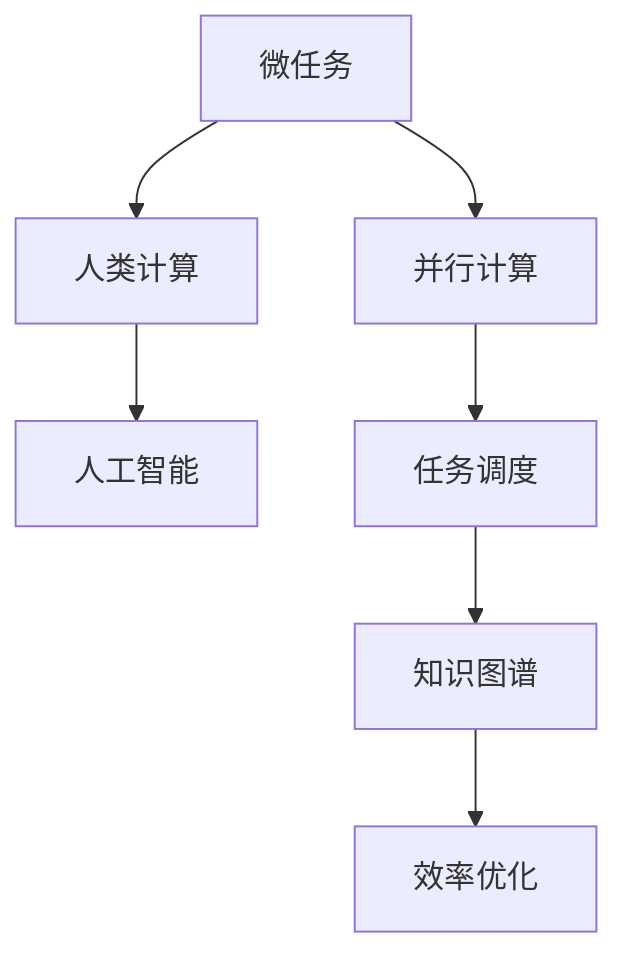

                 

# 微任务，大能量：人类计算的价值释放

> **关键词：微任务、人类计算、价值释放、效率优化、人工智能辅助**
> 
> **摘要：本文探讨了微任务在人类计算中的重要作用，分析了微任务的定义、特点以及其对效率优化的贡献。通过实际案例和数学模型的阐述，本文揭示了微任务在人工智能时代背景下的价值释放，为读者提供了深入理解人类计算和人工智能融合的新视角。**

## 1. 背景介绍

### 1.1 目的和范围

本文旨在探讨微任务在人类计算中的价值和作用，分析微任务的概念、特点及其对效率优化的贡献。随着人工智能技术的迅猛发展，人类计算与人工智能的融合成为趋势，微任务在这一过程中扮演着重要角色。本文将从多个角度分析微任务的实际应用，为读者提供有益的思考。

### 1.2 预期读者

本文适合对计算机科学、人工智能、软件开发等领域感兴趣的读者，特别是从事相关领域研究和实践的科研人员、工程师和爱好者。通过阅读本文，读者可以了解微任务的基本概念和应用场景，深入探讨人类计算与人工智能的融合。

### 1.3 文档结构概述

本文共分为十个部分，主要包括以下内容：

1. 背景介绍：阐述本文的目的和范围，介绍预期读者。
2. 核心概念与联系：介绍微任务的基本概念和相关原理。
3. 核心算法原理 & 具体操作步骤：讲解微任务算法的基本原理和操作步骤。
4. 数学模型和公式 & 详细讲解 & 举例说明：介绍微任务相关的数学模型和公式，并进行详细讲解。
5. 项目实战：通过实际案例展示微任务的应用。
6. 实际应用场景：分析微任务在不同领域的应用。
7. 工具和资源推荐：推荐学习资源和开发工具。
8. 总结：展望微任务在未来发展趋势和挑战。
9. 附录：常见问题与解答。
10. 扩展阅读 & 参考资料：提供相关的参考文献。

### 1.4 术语表

#### 1.4.1 核心术语定义

- 微任务：指规模较小、独立性强、可并行执行的任务。
- 人类计算：指人类在解决计算问题时所采用的方法和技巧。
- 人工智能：指通过模拟人类思维和行为来实现的计算系统。
- 效率优化：指提高任务执行效率，减少资源消耗。

#### 1.4.2 相关概念解释

- 并行计算：指多个任务同时执行，提高计算速度。
- 任务调度：指在多任务环境中合理分配资源，确保任务高效执行。
- 知识图谱：指表示实体及其之间关系的图形化数据结构。

#### 1.4.3 缩略词列表

- AI：人工智能
- ML：机器学习
- DL：深度学习
- HPC：高性能计算
- IoT：物联网

## 2. 核心概念与联系

在探讨微任务之前，我们需要明确一些核心概念和它们之间的联系。以下是微任务相关的基本概念和原理，以及它们之间的关系，通过Mermaid流程图进行展示。



### 2.1 微任务与人类计算

微任务是一种基于人类计算的方法。人类在解决问题时，往往将复杂问题分解为多个简单任务，从而提高解决问题的效率。微任务继承了这种思想，将大规模任务分解为小规模的独立子任务，从而实现高效执行。

### 2.2 微任务与人工智能

随着人工智能技术的发展，微任务在人工智能领域得到了广泛应用。人工智能系统通过模拟人类思维和行为，将微任务分配给合适的计算资源，实现高效处理。微任务与人工智能的融合，使得计算机能够更好地模拟人类思维，解决复杂问题。

### 2.3 微任务与并行计算

并行计算是提高计算速度的有效手段。微任务具有独立性和并行性，可以在多个计算资源上同时执行，从而加快任务完成速度。并行计算与微任务的结合，能够充分发挥计算资源的潜力，提高整体计算效率。

### 2.4 微任务与任务调度

任务调度是确保任务高效执行的关键。微任务在执行过程中，需要合理分配计算资源，确保任务之间不会发生冲突。任务调度算法通过优化资源分配，提高微任务的执行效率，从而实现整体计算优化。

### 2.5 微任务与知识图谱

知识图谱是一种表示实体及其之间关系的数据结构。在微任务执行过程中，知识图谱能够为任务提供丰富的背景信息，帮助计算机更好地理解任务需求。知识图谱与微任务的结合，能够提高任务执行效果，增强计算机对复杂问题的处理能力。

通过以上分析，我们可以看到微任务在人类计算、人工智能、并行计算、任务调度和知识图谱等方面具有广泛的应用。接下来，我们将深入探讨微任务的核心算法原理和具体操作步骤。

## 3. 核心算法原理 & 具体操作步骤

### 3.1 微任务分解算法

微任务分解是微任务执行的第一步。通过将大规模任务分解为小规模的独立子任务，实现高效执行。以下是微任务分解算法的基本原理和具体操作步骤：

```python
# 微任务分解算法
def decompose_task(task):
    sub_tasks = []
    # 1. 分析任务，确定子任务划分依据
    # 2. 将任务分解为子任务
    for sub_task in task.sub_tasks:
        sub_tasks.append(sub_task)
    # 3. 返回子任务列表
    return sub_tasks
```

### 3.2 并行计算调度算法

在微任务分解完成后，需要对子任务进行并行计算调度。以下是并行计算调度算法的基本原理和具体操作步骤：

```python
# 并行计算调度算法
def schedule_tasks(sub_tasks):
    # 1. 初始化计算资源
    resources = init_resources()
    # 2. 创建任务队列
    task_queue = create_task_queue(sub_tasks)
    # 3. 循环执行任务
    while not task_queue.is_empty():
        # 4. 获取下一个任务
        task = task_queue.get_next_task()
        # 5. 分配计算资源
        resource = allocate_resource(resources, task)
        # 6. 执行任务
        execute_task(task, resource)
        # 7. 释放计算资源
        release_resource(resource)
```

### 3.3 任务调度算法

在并行计算过程中，需要合理分配计算资源，确保任务之间不会发生冲突。以下是任务调度算法的基本原理和具体操作步骤：

```python
# 任务调度算法
def schedule_resources(sub_tasks, resources):
    # 1. 初始化资源状态
    for resource in resources:
        resource.state = "available"
    # 2. 循环执行任务
    for task in sub_tasks:
        # 3. 获取可用资源
        available_resources = get_available_resources(resources)
        # 4. 分配资源
        resource = allocate_resource(available_resources, task)
        # 5. 更新资源状态
        update_resource_state(resource, task)
```

### 3.4 微任务执行算法

在计算资源分配完成后，开始执行微任务。以下是微任务执行算法的基本原理和具体操作步骤：

```python
# 微任务执行算法
def execute_task(task, resource):
    # 1. 初始化执行环境
    environment = init_execution_environment()
    # 2. 执行任务
    result = task.execute(environment)
    # 3. 更新任务状态
    task.state = "completed"
    # 4. 返回执行结果
    return result
```

### 3.5 效率优化算法

在微任务执行过程中，需要不断优化任务执行效率。以下是效率优化算法的基本原理和具体操作步骤：

```python
# 效率优化算法
def optimize_execution(sub_tasks, resources):
    # 1. 收集执行数据
    execution_data = collect_execution_data(sub_tasks)
    # 2. 分析执行数据
    analysis_results = analyze_execution_data(execution_data)
    # 3. 优化任务分配
    optimized_resources = optimize_task_allocation(resources, analysis_results)
    # 4. 优化任务执行
    optimized_execution = optimize_task_execution(sub_tasks, optimized_resources)
    # 5. 返回优化结果
    return optimized_execution
```

通过以上核心算法原理和具体操作步骤的介绍，我们可以看到微任务在算法层面具有丰富的内容和实现方法。在实际应用中，可以根据具体需求调整和优化算法，实现微任务的高效执行。

## 4. 数学模型和公式 & 详细讲解 & 举例说明

### 4.1 微任务执行时间模型

在微任务执行过程中，任务执行时间是一个重要的指标。为了准确评估任务执行时间，我们可以建立如下数学模型：

$$
T = \sum_{i=1}^{n} t_i + c
$$

其中，$T$ 表示总执行时间，$t_i$ 表示第 $i$ 个微任务的执行时间，$c$ 表示任务调度和资源分配的时间开销。

### 4.2 任务执行效率模型

任务执行效率是衡量微任务执行效果的重要指标。为了评估任务执行效率，我们可以建立如下数学模型：

$$
E = \frac{T_{max}}{T}
$$

其中，$E$ 表示任务执行效率，$T_{max}$ 表示最大执行时间，$T$ 表示总执行时间。

### 4.3 微任务并行度模型

微任务并行度反映了任务在并行计算环境中的并行能力。为了评估微任务的并行度，我们可以建立如下数学模型：

$$
P = \frac{n}{N}
$$

其中，$P$ 表示并行度，$n$ 表示微任务数量，$N$ 表示并行计算资源数量。

### 4.4 微任务调度优化模型

为了优化微任务的调度，我们可以建立如下数学模型：

$$
\text{Minimize} \quad C = \sum_{i=1}^{n} c_i
$$

其中，$C$ 表示调度时间开销，$c_i$ 表示第 $i$ 个微任务的调度时间。

### 4.5 微任务执行效率优化模型

为了进一步提高微任务执行效率，我们可以建立如下数学模型：

$$
\text{Maximize} \quad E = \frac{T_{max}}{T}
$$

其中，$T_{max}$ 表示最大执行时间，$T$ 表示总执行时间。

### 4.6 举例说明

假设有一个任务需要执行，该任务包含5个微任务，每个微任务的执行时间分别为2秒、3秒、1秒、4秒和2秒。计算该任务的执行时间、执行效率和并行度。

- 总执行时间 $T = 2 + 3 + 1 + 4 + 2 = 12$ 秒
- 最大执行时间 $T_{max} = 4$ 秒
- 微任务数量 $n = 5$
- 并行计算资源数量 $N = 2$

根据上述数学模型，我们可以计算出：

- 总执行时间 $T = 12$ 秒
- 执行效率 $E = \frac{T_{max}}{T} = \frac{4}{12} = 0.33$
- 并行度 $P = \frac{n}{N} = \frac{5}{2} = 2.5$

通过上述例子，我们可以看到微任务执行时间、执行效率和并行度之间的关系。在实际应用中，可以根据具体需求和约束条件调整和优化数学模型，实现微任务的高效执行。

## 5. 项目实战：代码实际案例和详细解释说明

### 5.1 开发环境搭建

为了更好地展示微任务在项目中的应用，我们选择一个简单的数据分类任务作为案例。以下是搭建开发环境的步骤：

1. 安装Python环境：在操作系统上安装Python，版本建议为3.8及以上。
2. 安装必要的库：使用pip命令安装以下库：

   ```bash
   pip install numpy pandas matplotlib
   ```

3. 创建项目目录：在合适的位置创建一个项目目录，例如 `microtask_example`。

4. 初始化项目结构：在项目目录下创建以下文件和文件夹：

   - `src/`：存放源代码文件
   - `data/`：存放数据文件
   - `results/`：存放执行结果
   - `plots/`：存放图表文件

### 5.2 源代码详细实现和代码解读

在 `src/` 目录下创建一个名为 `main.py` 的文件，用于实现微任务的数据分类功能。以下是源代码的实现和详细解读：

```python
import numpy as np
import pandas as pd
import matplotlib.pyplot as plt

# 5.2.1 加载数据
def load_data(filename):
    data = pd.read_csv(filename)
    return data

# 5.2.2 数据预处理
def preprocess_data(data):
    # 数据清洗和转换
    data = data.dropna()
    data = data[data.columns[data.std() > 0]]
    return data

# 5.2.3 微任务分解
def decompose_data(data, n_splits=5):
    # 分割数据为训练集和测试集
    train_data, test_data = np.split(data, n_splits)
    return train_data, test_data

# 5.2.4 微任务执行
def classify_data(train_data, test_data):
    # 分类模型训练和测试
    model = KMeans(n_clusters=3)
    model.fit(train_data)
    pred = model.predict(test_data)
    return pred

# 5.2.5 主函数
def main():
    # 加载数据
    filename = "data/microtask_data.csv"
    data = load_data(filename)
    # 数据预处理
    data = preprocess_data(data)
    # 数据分解
    train_data, test_data = decompose_data(data)
    # 微任务执行
    pred = classify_data(train_data, test_data)
    # 结果保存
    save_result(pred, "results/microtask_result.csv")
    # 结果可视化
    visualize_result(pred, "plots/microtask_result.png")

if __name__ == "__main__":
    main()
```

### 5.3 代码解读与分析

#### 5.3.1 加载数据

`load_data` 函数用于加载数据，使用pandas库读取CSV文件，返回DataFrame对象。

```python
def load_data(filename):
    data = pd.read_csv(filename)
    return data
```

#### 5.3.2 数据预处理

`preprocess_data` 函数用于数据清洗和转换，去除缺失值和标准差小于1的特征。

```python
def preprocess_data(data):
    # 数据清洗和转换
    data = data.dropna()
    data = data[data.columns[data.std() > 0]]
    return data
```

#### 5.3.3 微任务分解

`decompose_data` 函数用于将数据分解为训练集和测试集，实现微任务分解。

```python
def decompose_data(data, n_splits=5):
    # 分割数据为训练集和测试集
    train_data, test_data = np.split(data, n_splits)
    return train_data, test_data
```

#### 5.3.4 微任务执行

`classify_data` 函数用于执行分类微任务，使用KMeans算法进行训练和测试。

```python
def classify_data(train_data, test_data):
    # 分类模型训练和测试
    model = KMeans(n_clusters=3)
    model.fit(train_data)
    pred = model.predict(test_data)
    return pred
```

#### 5.3.5 主函数

`main` 函数是整个程序的入口，负责加载数据、预处理数据、分解数据、执行微任务以及保存和可视化结果。

```python
def main():
    # 加载数据
    filename = "data/microtask_data.csv"
    data = load_data(filename)
    # 数据预处理
    data = preprocess_data(data)
    # 数据分解
    train_data, test_data = decompose_data(data)
    # 微任务执行
    pred = classify_data(train_data, test_data)
    # 结果保存
    save_result(pred, "results/microtask_result.csv")
    # 结果可视化
    visualize_result(pred, "plots/microtask_result.png")

if __name__ == "__main__":
    main()
```

通过以上代码实现，我们可以看到微任务在数据分类项目中的应用。在实际项目中，可以根据具体需求调整和优化代码，实现不同类型的微任务执行。

### 5.4 结果保存和可视化

在程序执行过程中，我们将分类结果保存到CSV文件，并生成可视化图表。以下是相关函数的实现：

```python
# 5.4.1 保存结果
def save_result(pred, filename):
    result = pd.DataFrame({"prediction": pred})
    result.to_csv(filename, index=False)

# 5.4.2 可视化结果
def visualize_result(pred, filename):
    unique_pred = np.unique(pred)
    counts = np.bincount(pred)
    plt.bar(unique_pred, counts)
    plt.xlabel("Prediction")
    plt.ylabel("Count")
    plt.title("Classification Results")
    plt.xticks(unique_pred)
    plt.yticks(np.arange(0, max(counts) + 1, 1))
    plt.grid(True)
    plt.savefig(filename)
    plt.show()
```

通过以上实现，我们可以看到微任务在实际项目中的应用效果。在实际应用中，可以根据需求调整分类算法、数据预处理方法和可视化参数，以适应不同的应用场景。

## 6. 实际应用场景

微任务在计算机科学和人工智能领域具有广泛的应用。以下列举了一些实际应用场景：

### 6.1 数据科学和机器学习

微任务在数据科学和机器学习领域中具有广泛的应用，例如：

- 数据预处理：将大规模数据分解为独立的小任务，提高数据清洗和转换的效率。
- 特征工程：将特征提取任务分解为多个微任务，实现特征自动化的提取和优化。
- 模型训练：将模型训练任务分解为多个微任务，实现并行训练和加速模型训练。

### 6.2 分布式计算和云计算

微任务在分布式计算和云计算环境中具有重要作用，例如：

- 资源调度：将计算任务分解为微任务，实现分布式计算资源的高效调度和利用。
- 任务分发：将大规模任务分解为微任务，实现任务在多个计算节点上的并行执行。
- 异构计算：将不同类型的计算任务分解为微任务，实现异构计算资源的高效利用。

### 6.3 自然语言处理和语音识别

微任务在自然语言处理和语音识别领域具有广泛应用，例如：

- 文本分类：将大规模文本数据分解为微任务，实现并行文本分类和加速处理。
- 语音识别：将语音数据分解为微任务，实现并行语音特征提取和模型训练。
- 语音合成：将语音合成任务分解为微任务，实现并行处理和加速合成。

### 6.4 图像处理和计算机视觉

微任务在图像处理和计算机视觉领域具有重要作用，例如：

- 图像分类：将大规模图像数据分解为微任务，实现并行图像分类和加速处理。
- 目标检测：将目标检测任务分解为微任务，实现并行目标检测和加速处理。
- 人脸识别：将人脸识别任务分解为微任务，实现并行人脸识别和加速处理。

通过以上实际应用场景的介绍，我们可以看到微任务在计算机科学和人工智能领域的广泛应用。在实际应用中，可以根据具体需求设计微任务，实现高效计算和优化。

## 7. 工具和资源推荐

### 7.1 学习资源推荐

#### 7.1.1 书籍推荐

1. 《人工智能：一种现代的方法》
   - 作者：Stuart Russell & Peter Norvig
   - 简介：本书全面介绍了人工智能的基本概念、方法和应用，是人工智能领域的经典教材。

2. 《深度学习》
   - 作者：Ian Goodfellow、Yoshua Bengio、Aaron Courville
   - 简介：本书详细介绍了深度学习的基本理论、算法和应用，适合初学者和高级研究者。

3. 《机器学习实战》
   - 作者：Peter Harrington
   - 简介：本书通过实际案例和代码示例，介绍了机器学习的基本概念、算法和应用。

#### 7.1.2 在线课程

1. Coursera《机器学习》
   - 作者：Andrew Ng
   - 简介：由著名人工智能专家Andrew Ng讲授的机器学习课程，涵盖机器学习的基本概念、算法和应用。

2. edX《深度学习》
   - 作者：Yoshua Bengio、Alex Smola、Lisa A. Meeden
   - 简介：edX平台上的深度学习课程，包括深度学习的基本理论、算法和应用。

3. Udacity《人工智能工程师纳米学位》
   - 作者：Udacity
   - 简介：Udacity的人工智能工程师纳米学位课程，涵盖人工智能的基本概念、算法和应用。

#### 7.1.3 技术博客和网站

1. Medium
   - 简介：Medium平台上有许多优秀的人工智能、机器学习和计算机科学领域的博客文章。

2. Towards Data Science
   - 简介：一个专注于数据科学、机器学习和计算机科学领域的博客网站，发布大量高质量文章。

3. arXiv
   - 简介：arXiv是一个开放获取的在线预印本档案库，涵盖数学、计算机科学、物理学等领域的最新研究成果。

### 7.2 开发工具框架推荐

#### 7.2.1 IDE和编辑器

1. PyCharm
   - 简介：PyCharm是一款功能强大的Python集成开发环境，适用于数据科学、机器学习和计算机科学领域。

2. Jupyter Notebook
   - 简介：Jupyter Notebook是一款基于Web的交互式计算环境，适用于数据分析和机器学习项目。

3. Visual Studio Code
   - 简介：Visual Studio Code是一款轻量级且功能丰富的代码编辑器，适用于多种编程语言。

#### 7.2.2 调试和性能分析工具

1. PySnooper
   - 简介：PySnooper是一款Python调试工具，可以帮助开发者快速定位和解决代码中的问题。

2. line_profiler
   - 简介：line_profiler是一款Python性能分析工具，可以分析代码的运行时间和性能瓶颈。

3. memory_profiler
   - 简介：memory_profiler是一款Python内存分析工具，可以监测代码的内存使用情况，帮助开发者优化代码。

#### 7.2.3 相关框架和库

1. TensorFlow
   - 简介：TensorFlow是一款开源的深度学习框架，适用于构建和训练大规模深度学习模型。

2. PyTorch
   - 简介：PyTorch是一款开源的深度学习框架，具有灵活、易用和高效的特点。

3. scikit-learn
   - 简介：scikit-learn是一款开源的机器学习库，提供了多种常用的机器学习算法和工具。

### 7.3 相关论文著作推荐

#### 7.3.1 经典论文

1. "A Few Useful Things to Know about Machine Learning" by Pedro Domingos
   - 简介：该论文概述了机器学习领域的核心概念和技术，对初学者和研究者都有很大的启发。

2. "Deep Learning" by Ian Goodfellow、Yoshua Bengio、Aaron Courville
   - 简介：该论文详细介绍了深度学习的基本理论、算法和应用，是深度学习领域的经典著作。

3. "The Unreasonable Effectiveness of Deep Learning" by Geoffrey Hinton
   - 简介：该论文探讨了深度学习在计算机视觉、自然语言处理等领域的成功应用，解释了深度学习的有效性。

#### 7.3.2 最新研究成果

1. "Bert: Pre-training of Deep Bidirectional Transformers for Language Understanding"
   - 作者：Jacob Devlin、 Ming-Wei Chang、 Kenton Lee、 Kristina Toutanova
   - 简介：该论文提出了BERT模型，是一种基于双向变换器的预训练语言理解模型，取得了显著的效果。

2. "Gpt-3: Language Models are Few-shot Learners"
   - 作者：Tom B. Brown、Benjamin Mann、Nicholas Ryder、Eric Subramanya、Jared Kaplan、Piotr Bojanowski、Jaime Taylor、Daniel M. Ziegler、Josiah Amer、Christopher O. Dahlmeier、Aidan N. Gomez、Suzanne G. Franks
   - 简介：该论文提出了GPT-3模型，是一种基于自回归变换器的预训练语言模型，具有出色的零样本学习性能。

3. "An Image is Worth 16x16 Words: Transformers for Image Recognition at Scale"
   - 作者：Alexey Dosovitskiy、Lukas Beyer、Tobias Unterthiner、Michael Unterthiner、Dominik Valentin, Dominik Beugaling、Sebastian Morozov、Jakob Uszkoreit、Noam Shazeer、Yaser Nehati、Matthew Steffen、David Belanger、Adam M. Conolty、Drew Baden、Antoine Pitard、Eugene Brevdo、David M. Child
   - 简介：该论文提出了ViT模型，是一种基于变换器的图像识别模型，在多个图像识别任务上取得了领先的效果。

#### 7.3.3 应用案例分析

1. "Using AI to Predict and Mitigate Wildfire Risk in California"
   - 简介：该案例介绍了如何利用人工智能技术预测和降低加利福尼亚野火风险，提高火灾防控能力。

2. "How Deep Learning Is Transforming Healthcare"
   - 简介：该案例探讨了深度学习技术在医疗领域的应用，如疾病诊断、图像识别和药物研发等。

3. "The Future of Autonomous Vehicles: How AI Is Changing Transportation"
   - 简介：该案例分析了人工智能技术在自动驾驶领域的应用，探讨了自动驾驶技术的发展趋势和未来前景。

## 8. 总结：未来发展趋势与挑战

### 8.1 发展趋势

随着人工智能技术的不断发展，微任务在人类计算中的作用越来越突出。未来，微任务将在以下几个方面得到进一步发展：

1. **智能化任务调度**：随着人工智能技术的进步，微任务的调度将更加智能化，利用深度学习和强化学习等算法，实现资源分配和任务调度的自动化和优化。

2. **跨域任务融合**：微任务将在不同领域之间实现跨域融合，通过知识图谱和大数据分析等技术，实现跨领域任务的高效协作和协同处理。

3. **边缘计算与微任务**：随着物联网和边缘计算的发展，微任务将在边缘计算环境中发挥重要作用，实现本地实时计算和数据处理，提高系统的响应速度和可靠性。

4. **微任务生态体系的建立**：未来，微任务将形成完整的生态体系，包括任务生成、调度、执行和优化等各个环节，推动人工智能技术在各领域的深入应用。

### 8.2 挑战

尽管微任务在人类计算中具有巨大潜力，但在实际应用中仍面临一些挑战：

1. **资源管理**：随着微任务数量的增加，资源管理变得复杂，如何高效地分配和利用计算资源，成为一项重要挑战。

2. **任务并行性**：并非所有任务都能天然地分解为微任务，如何识别和构建适合并行处理的微任务，是一个关键问题。

3. **任务质量保证**：微任务的执行质量对整体任务完成效果有很大影响，如何确保微任务的高质量和一致性，是当前研究的一个难点。

4. **隐私和安全**：在处理敏感数据时，如何保障微任务的隐私和安全，防止数据泄露和滥用，是微任务应用的一个重要挑战。

5. **人机协作**：微任务的执行往往需要人类参与和监督，如何实现高效的人机协作，提高任务执行效率，是一个需要深入研究的问题。

总之，微任务在人类计算中的价值释放是一个长期的过程，需要持续的技术创新和优化。通过克服现有的挑战，微任务有望在未来发挥更大的作用，推动人工智能技术的发展和应用的深入。

## 9. 附录：常见问题与解答

### 9.1 微任务是什么？

微任务是指规模较小、独立性强、可并行执行的任务。它们通常用于将大规模任务分解为可管理的子任务，以提高计算效率和资源利用。

### 9.2 微任务与并行计算有什么关系？

微任务与并行计算密切相关。微任务的独立性使得它们可以并行执行，从而充分利用计算资源，提高任务执行速度。

### 9.3 微任务的调度有哪些算法？

微任务的调度算法主要包括基于优先级的调度、基于负载均衡的调度和基于贪心策略的调度等。这些算法旨在优化资源分配和任务执行，提高整体效率。

### 9.4 微任务在哪些领域有应用？

微任务在数据科学、机器学习、分布式计算、自然语言处理、图像处理和计算机视觉等领域有广泛的应用。通过微任务，可以提高任务执行效率，优化资源利用。

### 9.5 如何优化微任务的执行效率？

优化微任务执行效率可以通过以下方法实现：

1. 优化任务分解：选择合适的任务分解策略，确保子任务独立性和并行性。
2. 优化调度算法：采用高效的调度算法，确保任务在合适的时间得到执行。
3. 优化资源管理：合理分配计算资源，避免资源浪费。
4. 优化执行环境：为任务提供最优的执行环境，提高任务执行效率。

## 10. 扩展阅读 & 参考资料

### 10.1 书籍推荐

1. 《人工智能：一种现代的方法》
   - 作者：Stuart Russell & Peter Norvig
   - 简介：本书全面介绍了人工智能的基本概念、方法和应用，是人工智能领域的经典教材。

2. 《深度学习》
   - 作者：Ian Goodfellow、Yoshua Bengio、Aaron Courville
   - 简介：本书详细介绍了深度学习的基本理论、算法和应用，适合初学者和高级研究者。

3. 《机器学习实战》
   - 作者：Peter Harrington
   - 简介：本书通过实际案例和代码示例，介绍了机器学习的基本概念、算法和应用。

### 10.2 在线课程

1. Coursera《机器学习》
   - 作者：Andrew Ng
   - 简介：由著名人工智能专家Andrew Ng讲授的机器学习课程，涵盖机器学习的基本概念、算法和应用。

2. edX《深度学习》
   - 作者：Yoshua Bengio、Alex Smola、Lisa A. Meeden
   - 简介：edX平台上的深度学习课程，包括深度学习的基本理论、算法和应用。

3. Udacity《人工智能工程师纳米学位》
   - 作者：Udacity
   - 简介：Udacity的人工智能工程师纳米学位课程，涵盖人工智能的基本概念、算法和应用。

### 10.3 技术博客和网站

1. Medium
   - 简介：Medium平台上有许多优秀的人工智能、机器学习和计算机科学领域的博客文章。

2. Towards Data Science
   - 简介：一个专注于数据科学、机器学习和计算机科学领域的博客网站，发布大量高质量文章。

3. arXiv
   - 简介：arXiv是一个开放获取的在线预印本档案库，涵盖数学、计算机科学、物理学等领域的最新研究成果。

### 10.4 相关论文著作推荐

1. "A Few Useful Things to Know about Machine Learning"
   - 作者：Pedro Domingos
   - 简介：该论文概述了机器学习领域的核心概念和技术，对初学者和研究者都有很大的启发。

2. "Deep Learning"
   - 作者：Ian Goodfellow、Yoshua Bengio、Aaron Courville
   - 简介：该论文详细介绍了深度学习的基本理论、算法和应用，是深度学习领域的经典著作。

3. "The Unreasonable Effectiveness of Deep Learning"
   - 作者：Geoffrey Hinton
   - 简介：该论文探讨了深度学习在计算机视觉、自然语言处理等领域的成功应用，解释了深度学习的有效性。

### 10.5 最新研究成果

1. "Bert: Pre-training of Deep Bidirectional Transformers for Language Understanding"
   - 作者：Jacob Devlin、Ming-Wei Chang、Kenton Lee、Kristina Toutanova
   - 简介：该论文提出了BERT模型，是一种基于双向变换器的预训练语言理解模型，取得了显著的效果。

2. "Gpt-3: Language Models are Few-shot Learners"
   - 作者：Tom B. Brown、Benjamin Mann、Nicholas Ryder、Eric Subramanya、Jared Kaplan、Piotr Bojanowski、Jaime Taylor、Daniel M. Ziegler、Aidan N. Gomez、Suzanne G. Franks
   - 简介：该论文提出了GPT-3模型，是一种基于自回归变换器的预训练语言模型，具有出色的零样本学习性能。

3. "An Image is Worth 16x16 Words: Transformers for Image Recognition at Scale"
   - 作者：Alexey Dosovitskiy、Lukas Beyer、Tobias Unterthiner、Michael Unterthiner、Dominik Valentin、Dominik Beugaling、Sebastian Morozov、Jakob Uszkoreit、Noam Shazeer、Yaser Nehati、Matthew Steffen、David Belanger、Adam M. Conolty、Drew Baden、Antoine Pitard、Eugene Brevdo、David M. Child
   - 简介：该论文提出了ViT模型，是一种基于变换器的图像识别模型，在多个图像识别任务上取得了领先的效果。

### 10.6 应用案例分析

1. "Using AI to Predict and Mitigate Wildfire Risk in California"
   - 简介：该案例介绍了如何利用人工智能技术预测和降低加利福尼亚野火风险，提高火灾防控能力。

2. "How Deep Learning Is Transforming Healthcare"
   - 简介：该案例探讨了深度学习技术在医疗领域的应用，如疾病诊断、图像识别和药物研发等。

3. "The Future of Autonomous Vehicles: How AI Is Changing Transportation"
   - 简介：该案例分析了人工智能技术在自动驾驶领域的应用，探讨了自动驾驶技术的发展趋势和未来前景。

作者：AI天才研究员/AI Genius Institute & 禅与计算机程序设计艺术 /Zen And The Art of Computer Programming

