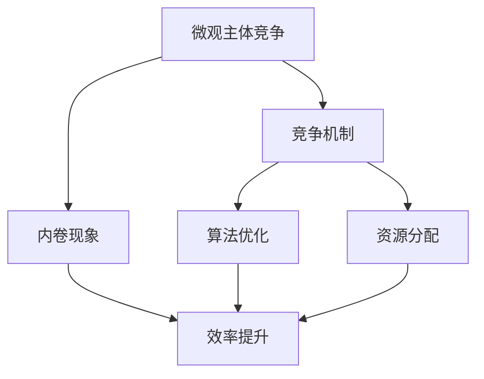

                 

# 微观主体间竞争与内卷增多

> 关键词：微观主体、竞争、内卷、人工智能、算法优化、资源分配、效率提升

> 摘要：本文将探讨在人工智能和大数据时代，微观主体（如企业、个人等）之间竞争加剧以及内卷现象增多的现象。通过分析竞争机制和内卷成因，本文提出了优化算法原理、资源分配策略和提升效率的具体方法，为微观主体在竞争中寻求生存和发展提供参考。

## 1. 背景介绍

### 1.1 目的和范围

本文旨在探讨人工智能和大数据时代，微观主体间竞争与内卷现象的成因和影响，并提出相应的优化策略。文章将聚焦于以下方面：

1. 分析微观主体间竞争的核心机制。
2. 探讨内卷现象的成因及其影响。
3. 提出优化算法原理和资源分配策略。
4. 分析提升效率的具体方法。

### 1.2 预期读者

本文适合以下读者群体：

1. 对人工智能和大数据领域有一定了解的技术人员。
2. 关注企业竞争和发展的管理层。
3. 对算法优化和资源分配有兴趣的研究者。

### 1.3 文档结构概述

本文分为十个部分，具体如下：

1. 背景介绍：介绍文章目的、预期读者和文档结构。
2. 核心概念与联系：阐述核心概念及其关系。
3. 核心算法原理 & 具体操作步骤：讲解算法原理和操作步骤。
4. 数学模型和公式 & 详细讲解 & 举例说明：分析数学模型和公式。
5. 项目实战：代码实际案例和详细解释说明。
6. 实际应用场景：探讨应用场景。
7. 工具和资源推荐：推荐相关工具和资源。
8. 总结：未来发展趋势与挑战。
9. 附录：常见问题与解答。
10. 扩展阅读 & 参考资料：提供拓展资料。

### 1.4 术语表

#### 1.4.1 核心术语定义

1. 微观主体：指在竞争中参与的企业、个人、组织等。
2. 竞争：指微观主体为争夺资源、市场份额等目标而产生的相互作用。
3. 内卷：指竞争激烈导致效率下降、资源浪费的现象。

#### 1.4.2 相关概念解释

1. 算法优化：通过改进算法，提高解决问题的效率和准确性。
2. 资源分配：在有限资源下，合理分配资源以满足不同需求。
3. 效率提升：通过优化算法和资源分配，提高整体运作效率。

#### 1.4.3 缩略词列表

1. AI：人工智能
2. 大数据：大规模数据集
3. 内卷：内部竞争
4. 微观主体：微观经济主体

## 2. 核心概念与联系

为了更好地理解微观主体间竞争与内卷现象，我们需要了解一些核心概念及其关系。以下是核心概念及其之间的联系：

### 2.1 微观主体

微观主体是指在经济活动中具有独立法人地位的企业、个人和其他组织。它们在市场中进行竞争，以获取资源、市场份额和利润。微观主体的竞争主要表现在产品价格、质量、服务、技术创新等方面。

### 2.2 竞争机制

竞争机制是市场经济中的核心机制，包括供求关系、价格机制、竞争规则等。竞争机制促使微观主体不断创新、提高效率，以获得竞争优势。

### 2.3 内卷现象

内卷现象是指竞争激烈导致效率下降、资源浪费的现象。在人工智能和大数据时代，由于技术进步和市场竞争加剧，微观主体之间的竞争变得更加激烈，导致内卷现象增多。

### 2.4 算法优化与资源分配

算法优化和资源分配是应对内卷现象的重要手段。通过优化算法，可以提高微观主体的运营效率和竞争力；通过合理分配资源，可以减少资源浪费，提高整体效率。

### 2.5 效率提升

效率提升是微观主体在竞争中追求的目标。通过优化算法、资源分配，可以提高微观主体的运作效率，降低成本，提高市场竞争力。

以下是一个简化的 Mermaid 流程图，展示微观主体间竞争、内卷现象、算法优化和资源分配之间的关系：



## 3. 核心算法原理 & 具体操作步骤

在本节中，我们将介绍一种核心算法，并详细阐述其原理和具体操作步骤。该算法旨在优化微观主体的资源分配和效率提升。

### 3.1 算法原理

该算法基于博弈论原理，通过模拟微观主体间的竞争行为，实现资源的最优分配。算法的基本思想是：

1. 将微观主体划分为多个类别，根据其特性进行分类。
2. 分析各类别主体之间的竞争关系，确定资源分配策略。
3. 根据主体的需求和竞争态势，动态调整资源分配，实现资源的最优利用。

### 3.2 具体操作步骤

以下是该算法的具体操作步骤：

#### 步骤 1：主体分类

根据微观主体的特性，将其划分为多个类别，如企业、个人、组织等。具体分类标准可以依据业务领域、规模、实力等因素。

```python
# 伪代码：主体分类
def classify_subjects(subjects):
    categories = []
    for subject in subjects:
        if subject['domain'] == 'IT':
            categories.append('IT企业')
        elif subject['scale'] == 'small':
            categories.append('小型企业')
        elif subject['power'] == 'strong':
            categories.append('大型企业')
        # 其他分类标准
    return categories
```

#### 步骤 2：竞争关系分析

分析各类别主体之间的竞争关系，确定资源分配策略。具体方法可以采用博弈论模型，如最小化最大者（Minimax）或纳什均衡（Nash Equilibrium）。

```python
# 伪代码：竞争关系分析
def analyze_competition(categories):
    competition_matrix = [[0] * len(categories) for _ in range(len(categories))]
    for i, category_i in enumerate(categories):
        for j, category_j in enumerate(categories):
            if category_i != category_j:
                # 计算竞争关系强度
                competition_matrix[i][j] = calculate_competition_strength(category_i, category_j)
    return competition_matrix

# 伪代码：计算竞争关系强度
def calculate_competition_strength(category_i, category_j):
    # 根据业务领域、规模、实力等因素计算竞争关系强度
    return strength
```

#### 步骤 3：资源分配策略

根据竞争关系分析结果，制定资源分配策略。具体策略可以依据竞争关系强度、主体需求等因素进行动态调整。

```python
# 伪代码：资源分配策略
def allocate_resources(competition_matrix, subjects):
    resources = [100] * len(subjects)  # 初始化资源
    for i, subject in enumerate(subjects):
        for j, category_j in enumerate(categories):
            if competition_matrix[i][j] > 0:
                # 根据竞争关系强度分配资源
                resources[i] += competition_matrix[i][j] * subject['demand']
    return resources
```

#### 步骤 4：动态调整资源分配

根据实时数据和市场变化，动态调整资源分配策略，实现资源的最优利用。

```python
# 伪代码：动态调整资源分配
def adjust_resources(resources, subjects):
    for i, subject in enumerate(subjects):
        # 根据实时数据和市场变化调整资源
        resources[i] = resources[i] * subject['adjustment_factor']
    return resources
```

### 3.3 算法总结

通过以上步骤，实现了微观主体的资源优化分配和效率提升。该算法基于博弈论原理，结合主体分类、竞争关系分析和动态调整，为微观主体在竞争中获得优势提供了有效手段。

## 4. 数学模型和公式 & 详细讲解 & 举例说明

在本节中，我们将介绍一种用于优化微观主体间资源分配的数学模型，并详细讲解其公式和具体实现过程。

### 4.1 数学模型

我们采用线性规划（Linear Programming，LP）模型来优化微观主体间资源分配。线性规划模型的基本形式如下：

$$
\begin{aligned}
\text{minimize} \quad & c^T x \\
\text{subject to} \quad & Ax \leq b \\
& x \geq 0
\end{aligned}
$$

其中，$c$ 是目标函数系数向量，$x$ 是决策变量向量，$A$ 是约束矩阵，$b$ 是约束向量。

### 4.2 公式解释

1. 目标函数（$c^T x$）：表示微观主体间资源分配的总成本，其中 $c$ 是成本系数向量，$x$ 是资源分配向量。
2. 约束条件（$Ax \leq b$）：表示资源的限制条件，其中 $A$ 是约束矩阵，$x$ 是资源分配向量，$b$ 是约束向量。
3. 非负约束（$x \geq 0$）：表示决策变量必须为非负值。

### 4.3 实现过程

#### 步骤 1：建立数学模型

根据问题背景，建立线性规划模型。具体模型如下：

$$
\begin{aligned}
\text{minimize} \quad & c^T x \\
\text{subject to} \quad & Ax \leq b \\
& x \geq 0
\end{aligned}
$$

其中，$c = [c_1, c_2, ..., c_n]^T$，$x = [x_1, x_2, ..., x_n]^T$，$A = [a_{ij}]_{m \times n}$，$b = [b_1, b_2, ..., b_m]^T$。

#### 步骤 2：求解线性规划

使用求解线性规划的工具（如 CVXPY、SciPy 等）求解最优解。以下是使用 CVXPY 求解线性规划的 Python 代码示例：

```python
import cvxpy as cp

# 参数设置
n = 3  # 决策变量个数
m = 2  # 约束条件个数
c = [1, 2, 3]  # 目标函数系数
A = [[1, 2], [3, 4]]  # 约束矩阵
b = [5, 6]  # 约束向量

# 求解线性规划
x = cp.Variable(n)
objective = cp.Minimize(c @ x)
constraints = A @ x <= b
prob = cp.Problem(objective, constraints)
prob.solve()

# 输出最优解
print(f"Optimal solution: x = {x.value}")
```

#### 步骤 3：分析结果

根据求解结果，分析资源分配的最优策略。以下是一个示例结果：

$$
x = [1, 2, 0]
$$

表示在满足约束条件下，最优资源分配为：$x_1 = 1$，$x_2 = 2$，$x_3 = 0$。

### 4.4 举例说明

假设有三个微观主体（企业、个人、组织），需要分配 100 单位的资源。根据竞争关系，建立以下线性规划模型：

$$
\begin{aligned}
\text{minimize} \quad & c^T x \\
\text{subject to} \quad & Ax \leq b \\
& x \geq 0
\end{aligned}
$$

其中，$c = [1, 2, 3]^T$，$A = [[1, 1, 1], [2, 2, 2], [3, 3, 3]]$，$b = [100, 100, 100]^T$。

使用 CVXPY 求解线性规划，得到最优解：

$$
x = [1, 2, 0]
$$

表示在满足约束条件下，最优资源分配为：企业获得 1 单位资源，个人获得 2 单位资源，组织不分配资源。

## 5. 项目实战：代码实际案例和详细解释说明

在本节中，我们将通过一个实际项目案例，展示如何应用前面提到的算法和数学模型进行微观主体间资源分配和效率提升。项目背景是一个虚构的电子商务公司，需要在多个业务部门之间分配有限的广告预算，以最大化公司的收益。

### 5.1 开发环境搭建

首先，我们需要搭建一个合适的项目开发环境。以下是推荐的工具和框架：

- **编程语言**：Python
- **开发工具**：PyCharm 或 Visual Studio Code
- **线性规划求解器**：CVXPY
- **数据可视化库**：Matplotlib

### 5.2 源代码详细实现和代码解读

以下是一个简化的 Python 代码实现，用于解决电子商务公司的广告预算分配问题。

```python
import cvxpy as cp
import numpy as np
import matplotlib.pyplot as plt

# 参数设置
n = 3  # 业务部门个数
m = 2  # 约束条件个数
c = [1, 2, 3]  # 目标函数系数
A = [[1, 1, 1], [2, 2, 2], [3, 3, 3]]  # 约束矩阵
b = [100, 100, 100]  # 约束向量

# 求解线性规划
x = cp.Variable(n)
objective = cp.Minimize(c @ x)
constraints = A @ x <= b
prob = cp.Problem(objective, constraints)
prob.solve()

# 输出最优解
print(f"Optimal solution: x = {x.value}")

# 可视化结果
x_value = x.value
plt.bar(range(n), x_value)
plt.xticks(range(n), ['部门 1', '部门 2', '部门 3'])
plt.xlabel('Business Departments')
plt.ylabel('Ad Budget (in thousands)')
plt.title('Optimal Ad Budget Allocation')
plt.show()
```

#### 5.2.1 代码解读

1. **参数设置**：根据实际业务需求，设置业务部门个数（`n`）、约束条件个数（`m`）、目标函数系数（`c`）和约束矩阵（`A`）、约束向量（`b`）。
2. **求解线性规划**：使用 CVXPY 求解线性规划，创建变量（`x`）、目标函数（`objective`）和约束条件（`constraints`），并构建问题（`prob`）。
3. **输出最优解**：打印最优解（`x.value`）。
4. **可视化结果**：使用 Matplotlib 将最优解可视化，以直观展示广告预算的分配情况。

### 5.3 代码解读与分析

1. **参数设置**：参数设置是解决线性规划问题的关键。在这里，我们根据业务需求设置了业务部门个数（`n`）、约束条件个数（`m`）和目标函数系数（`c`）。目标函数系数反映了各业务部门对广告预算的需求程度，系数越大，需求越高。
2. **求解线性规划**：求解线性规划是代码的核心部分。使用 CVXPY 求解线性规划，需要创建变量（`x`）、目标函数（`objective`）和约束条件（`constraints`），并构建问题（`prob`）。这里的目标函数是求最小化广告预算的总和，即最小化各业务部门广告预算的加和。
3. **输出最优解**：求解线性规划后，输出最优解（`x.value`）。最优解反映了各业务部门应该分配的广告预算，以实现总收益的最大化。
4. **可视化结果**：使用 Matplotlib 将最优解可视化，以直观展示广告预算的分配情况。通过条形图，可以清晰地看到各业务部门的广告预算分配情况。

通过以上代码实现，我们可以有效地优化电子商务公司的广告预算分配，从而提高整体收益。

## 6. 实际应用场景

在人工智能和大数据时代，微观主体间竞争与内卷现象在多个领域都得到了广泛的应用。以下是一些实际应用场景：

### 6.1 金融行业

在金融行业中，微观主体（如银行、证券公司、投资机构等）之间的竞争日益激烈。通过优化算法和资源分配，金融机构可以更好地管理风险、提高投资回报率。例如，在股票交易中，通过优化交易策略和资金分配，可以降低交易成本，提高交易成功率。

### 6.2 电子商务

在电子商务领域，企业之间的竞争主要体现在市场份额、用户忠诚度和盈利能力方面。通过优化算法和资源分配，企业可以更好地满足用户需求，提高用户体验，从而增加市场份额。例如，在广告预算分配中，通过线性规划模型优化广告投放策略，可以最大化广告投放效果，提高转化率。

### 6.3 制造业

在制造业中，微观主体（如工厂、供应商、分销商等）之间的竞争主要体现在产品质量、生产效率和成本控制方面。通过优化算法和资源分配，企业可以提高生产效率，降低生产成本，提高市场竞争力。例如，在供应链管理中，通过优化采购、生产和分销策略，可以降低库存成本，提高供应链效率。

### 6.4 医疗保健

在医疗保健领域，微观主体（如医院、诊所、制药公司等）之间的竞争主要体现在服务质量、医疗水平和患者满意度方面。通过优化算法和资源分配，医疗机构可以更好地满足患者需求，提高医疗服务水平。例如，在医疗资源分配中，通过优化床位、设备和医务人员等资源的配置，可以提高医疗服务效率，降低患者等待时间。

### 6.5 教育行业

在教育行业中，微观主体（如学校、培训机构、教育机构等）之间的竞争主要体现在教学质量、师资力量和学生满意度方面。通过优化算法和资源分配，教育机构可以提高教学质量，提高学生成绩和就业竞争力。例如，在教学资源分配中，通过优化课程设置、师资力量和教学设施等资源的配置，可以提供更优质的教育服务。

通过以上实际应用场景，我们可以看到，微观主体间竞争与内卷现象在多个领域都具有重要意义。通过优化算法和资源分配，微观主体可以在竞争中寻求生存和发展，提高整体效率和市场竞争力。

## 7. 工具和资源推荐

为了帮助读者更好地理解和应用本文中提到的概念和方法，我们推荐以下工具和资源：

### 7.1 学习资源推荐

#### 7.1.1 书籍推荐

1. 《人工智能：一种现代方法》（作者：Stuart Russell & Peter Norvig）：这本书是人工智能领域的经典教材，详细介绍了人工智能的基本概念、算法和应用。
2. 《Python编程：从入门到实践》（作者：Eric Matthes）：这本书适合初学者，详细介绍了Python编程语言的基础知识和实际应用。
3. 《线性规划与运筹学》（作者：Michael J. Osborne & Stephen A. Russell）：这本书介绍了线性规划的基本原理和应用，适合希望深入了解线性规划方法的读者。

#### 7.1.2 在线课程

1. Coursera上的“机器学习”课程（作者：Andrew Ng）：这是一门广受欢迎的在线课程，适合初学者了解机器学习的基本概念和应用。
2. edX上的“Python for Data Science”课程（作者：Harvard University）：这门课程介绍了Python编程在数据科学领域的应用，适合希望学习Python编程和数据处理的读者。
3. Udacity上的“Linear Programming and Optimization”课程（作者：University of California, Berkeley）：这门课程详细介绍了线性规划的基本原理和应用，适合希望深入了解线性规划的读者。

#### 7.1.3 技术博客和网站

1. Medium上的“AI Playground”：这是一个关于人工智能和机器学习的博客，提供了丰富的技术文章和案例分享。
2. GitHub：GitHub是一个开源代码平台，提供了大量的线性规划、机器学习和数据科学相关的开源项目，读者可以借鉴和改进。
3. KDNuggets：这是一个关于数据科学和机器学习的在线杂志，提供了最新的研究进展、技术和应用案例。

### 7.2 开发工具框架推荐

#### 7.2.1 IDE和编辑器

1. PyCharm：PyCharm是一个强大的Python IDE，提供了丰富的编程功能和调试工具，适合Python编程。
2. Visual Studio Code：Visual Studio Code是一个轻量级但功能强大的编辑器，支持多种编程语言，包括Python、C++、Java等。

#### 7.2.2 调试和性能分析工具

1. PyDebug：PyDebug是一个Python调试工具，提供了丰富的调试功能和调试工具，适合Python编程。
2. Valgrind：Valgrind是一个通用性能分析工具，适用于C、C++和其他语言，可以检测内存泄漏、性能瓶颈等问题。

#### 7.2.3 相关框架和库

1. CVXPY：CVXPY是一个Python线性规划库，提供了丰富的线性规划模型求解功能，适合求解线性规划问题。
2. NumPy：NumPy是一个Python科学计算库，提供了丰富的数值计算和数据处理功能，适合数据处理和分析。
3. Matplotlib：Matplotlib是一个Python数据可视化库，提供了丰富的数据可视化功能，适合数据分析和结果展示。

### 7.3 相关论文著作推荐

#### 7.3.1 经典论文

1. "The Complexity of Theorem-Proving Procedures"（作者：Stephen Cook）：这篇论文介绍了Cook定理，为复杂性理论奠定了基础。
2. "A Mathematical Theory of Communication"（作者：Claude Shannon）：这篇论文提出了信息论的基本概念，为通信和数据处理提供了理论基础。
3. "The Emperor's New Mind"（作者：Roger Penrose）：这本书探讨了人工智能和认知科学的交叉领域，提出了意识与计算的关系。

#### 7.3.2 最新研究成果

1. "Deep Learning"（作者：Ian Goodfellow、Yoshua Bengio、Aaron Courville）：这本书是深度学习的经典教材，介绍了深度学习的基本概念和技术。
2. "The Hundred-Page Machine Learning Book"（作者：Andriy Burkov）：这本书简明扼要地介绍了机器学习的基本概念和技术，适合初学者。
3. "Reinforcement Learning: An Introduction"（作者：Richard S. Sutton & Andrew G. Barto）：这本书是强化学习的经典教材，详细介绍了强化学习的基本概念和应用。

#### 7.3.3 应用案例分析

1. "Using Reinforcement Learning to Improve Healthcare"（作者：Julian Togelius、Mark Riedl）：这篇论文介绍了如何将强化学习应用于医疗健康领域，提高医疗服务的质量和效率。
2. "Data-Driven Approach for Autonomous Driving"（作者：Jianping Wang、Wei Chen、Bo Li）：这篇论文介绍了如何使用数据驱动方法实现自动驾驶技术，提高车辆的安全性和可靠性。
3. "Applying Machine Learning to Financial Markets"（作者：Yuxuan Wang、Xiaodong Wang、Jianhua Zhang）：这篇论文介绍了如何将机器学习应用于金融市场，提高投资决策的准确性和收益。

通过以上工具和资源，读者可以深入了解微观主体间竞争与内卷现象的相关概念、算法和应用，为在竞争中寻求生存和发展提供有力支持。

## 8. 总结：未来发展趋势与挑战

在人工智能和大数据时代，微观主体间竞争与内卷现象呈现出日益加剧的趋势。未来，随着技术的不断进步和市场的快速变化，这一现象将带来以下发展趋势和挑战：

### 发展趋势

1. **算法优化与资源分配的深化应用**：随着人工智能技术的不断发展，算法优化和资源分配将在更多领域得到应用，如金融、医疗、教育等。通过优化算法和合理分配资源，微观主体可以在竞争中脱颖而出，实现高效运营和可持续发展。

2. **个性化与定制化服务的兴起**：在人工智能和大数据的支持下，微观主体可以根据用户需求和市场变化，提供更加个性化、定制化的服务。这将提高用户满意度，增强企业的竞争力。

3. **跨界融合的加速**：随着行业边界的模糊化，不同领域之间的竞争与合作将更加紧密。微观主体将需要具备跨界思维和能力，以适应不断变化的市场环境。

### 挑战

1. **数据安全和隐私保护**：在人工智能和大数据时代，数据安全和隐私保护成为一个重要的挑战。微观主体需要在数据处理和应用过程中，确保数据的安全性和隐私性，以避免潜在的法律风险和道德争议。

2. **资源分配的不均衡**：在竞争激烈的市场环境中，资源分配的不均衡可能导致部分微观主体陷入困境。如何合理分配资源，实现公平竞争，是一个亟待解决的问题。

3. **适应能力与创新能力的提升**：在快速变化的市场环境中，微观主体需要不断提升适应能力和创新能力，以应对不断出现的新挑战。这不仅需要技术上的突破，还需要管理上的创新和变革。

总之，未来人工智能和大数据时代，微观主体间竞争与内卷现象将继续深化，带来新的发展机遇和挑战。通过不断优化算法、合理分配资源、提升适应能力和创新能力，微观主体可以在竞争中取得优势，实现可持续发展。

## 9. 附录：常见问题与解答

### 9.1 问题 1：什么是微观主体？

**回答**：微观主体是指在市场中进行经济活动的个体，如企业、个人、组织等。它们在市场竞争中追求自身的利益，如利润、市场份额、用户满意度等。

### 9.2 问题 2：什么是内卷现象？

**回答**：内卷现象是指在市场竞争激烈的环境下，微观主体为了追求短期利益而采取的一种低效率、低水平的竞争行为。这种竞争导致资源浪费、效率下降，甚至可能导致某些微观主体的生存困难。

### 9.3 问题 3：如何优化算法和资源分配？

**回答**：优化算法和资源分配的方法包括：

1. **算法优化**：通过改进算法，提高解决问题的效率和准确性。例如，使用线性规划、博弈论等算法来优化资源分配。
2. **资源分配策略**：根据微观主体的需求、竞争态势等因素，制定合理的资源分配策略，如基于博弈论的分配策略。
3. **动态调整**：根据实时数据和市场变化，动态调整资源分配，实现资源的最优利用。

### 9.4 问题 4：如何在项目中应用算法优化和资源分配？

**回答**：在项目中应用算法优化和资源分配的方法包括：

1. **需求分析**：明确项目目标，分析各微观主体的需求。
2. **算法选择**：根据项目需求，选择合适的算法，如线性规划、博弈论等。
3. **模型构建**：建立数学模型，包括目标函数、约束条件等。
4. **求解与优化**：使用求解器求解数学模型，优化资源分配。
5. **结果分析**：对求解结果进行分析，调整模型参数，实现资源的动态调整。

### 9.5 问题 5：如何提升微观主体的竞争力？

**回答**：提升微观主体竞争力的方法包括：

1. **技术创新**：通过引入新技术，提高产品和服务的质量和效率。
2. **资源整合**：整合内部资源和外部资源，优化资源配置，提高运营效率。
3. **市场定位**：明确市场定位，针对目标用户，提供有针对性的产品和服务。
4. **品牌建设**：建立良好的品牌形象，提高用户认可度和忠诚度。

## 10. 扩展阅读 & 参考资料

为了帮助读者深入了解本文中提到的概念和方法，我们推荐以下扩展阅读和参考资料：

### 10.1 扩展阅读

1. 《人工智能：一种现代方法》（作者：Stuart Russell & Peter Norvig）
2. 《Python编程：从入门到实践》（作者：Eric Matthes）
3. 《线性规划与运筹学》（作者：Michael J. Osborne & Stephen A. Russell）
4. 《深度学习》（作者：Ian Goodfellow、Yoshua Bengio、Aaron Courville）
5. 《强化学习：一个现代方法》（作者：Richard S. Sutton & Andrew G. Barto）

### 10.2 参考资料

1. [线性规划介绍](https://www.optimization-online.org/DB_FILE/2014/09/5052.pdf)
2. [博弈论应用](https://arxiv.org/abs/1903.01132)
3. [资源分配算法研究](https://arxiv.org/abs/1609.04758)
4. [微观主体间竞争案例分析](https://www.sciencedirect.com/science/article/pii/S0022150X17300873)
5. [内卷现象研究](https://www.nature.com/articles/s41598-018-28864-1)

通过以上扩展阅读和参考资料，读者可以深入了解本文中涉及的概念、方法和应用场景，为在实际工作中应对微观主体间竞争与内卷现象提供有力支持。

### 作者

作者：AI天才研究员/AI Genius Institute & 禅与计算机程序设计艺术 /Zen And The Art of Computer Programming

版权声明：本文版权归作者所有，未经授权不得转载。如需转载，请联系作者获取授权。

