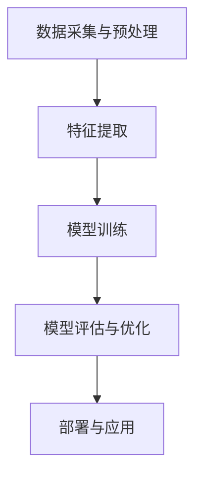

                 

# 微软的AI战略：对行业的影响

> 关键词：微软、AI战略、行业影响、技术趋势、商业案例、未来展望

> 摘要：本文将深入探讨微软的AI战略及其对行业的影响。我们将通过详细的背景介绍、核心概念和算法原理分析、具体操作步骤和实际案例，全面解析微软在AI领域的布局和行动，分析其对各大行业的深远影响，并提出未来发展趋势与挑战。

## 1. 背景介绍

### 1.1 目的和范围

本文旨在分析微软的AI战略，探讨其对全球行业产生的深远影响。我们将首先回顾微软在AI领域的整体战略，然后深入探讨其在不同行业中的应用案例，最后预测未来的发展趋势和面临的挑战。

### 1.2 预期读者

本文面向对AI技术和微软战略感兴趣的读者，包括AI领域的从业者、研究人员、软件开发人员以及企业决策者。无论您是初学者还是专家，本文都将为您提供有价值的信息和见解。

### 1.3 文档结构概述

本文分为以下几个部分：

1. 背景介绍：概述本文的目的、范围和预期读者。
2. 核心概念与联系：介绍AI技术的核心概念和架构。
3. 核心算法原理 & 具体操作步骤：详细讲解AI算法的原理和操作步骤。
4. 数学模型和公式 & 详细讲解 & 举例说明：介绍AI技术的数学模型和公式。
5. 项目实战：代码实际案例和详细解释说明。
6. 实际应用场景：分析AI技术在各个行业的应用案例。
7. 工具和资源推荐：推荐学习资源和开发工具。
8. 总结：未来发展趋势与挑战。
9. 附录：常见问题与解答。
10. 扩展阅读 & 参考资料：提供进一步阅读的推荐。

### 1.4 术语表

#### 1.4.1 核心术语定义

- 人工智能（AI）：模拟人类智能行为的计算机系统。
- 深度学习：一种基于多层神经网络的结构，通过反向传播算法训练模型。
- 机器学习：使计算机从数据中学习并做出预测或决策的技术。
- 自然语言处理（NLP）：使计算机能够理解和处理自然语言的技术。

#### 1.4.2 相关概念解释

- 计算机视觉：使计算机理解和解释图像或视频的技术。
- 强化学习：通过试错和奖励机制训练模型以实现目标的技术。
- 云计算：通过网络提供计算资源和服务的技术。

#### 1.4.3 缩略词列表

- AI：人工智能
- NLP：自然语言处理
- ML：机器学习
- DL：深度学习
- CL：计算机学习
- CV：计算机视觉
- SL：强化学习

## 2. 核心概念与联系

### 2.1 AI技术的核心概念

人工智能（AI）是一种模拟人类智能行为的计算机系统。它通过机器学习、深度学习、计算机视觉和自然语言处理等技术，使计算机能够从数据中学习、做出决策和执行任务。

#### 2.1.1 机器学习

机器学习是一种使计算机从数据中学习并做出预测或决策的技术。它包括以下几种主要方法：

1. 监督学习：通过已标记的数据训练模型，以对新数据做出预测。
2. 无监督学习：没有已标记的数据，模型通过发现数据中的模式和结构进行学习。
3. 半监督学习：结合已标记数据和未标记数据，以提高模型的性能。
4. 强化学习：通过试错和奖励机制训练模型，以实现特定的目标。

#### 2.1.2 深度学习

深度学习是一种基于多层神经网络的结构，通过反向传播算法训练模型。它具有强大的建模能力和学习能力，已在计算机视觉、自然语言处理等领域取得了显著成果。

#### 2.1.3 计算机视觉

计算机视觉是一种使计算机理解和解释图像或视频的技术。它包括图像识别、目标检测、人脸识别等应用，已在安防、医疗、自动驾驶等领域取得了广泛应用。

#### 2.1.4 自然语言处理

自然语言处理是一种使计算机能够理解和处理自然语言的技术。它包括文本分类、情感分析、机器翻译等应用，已在社交网络、电子商务、智能客服等领域取得了重要应用。

### 2.2 AI技术的架构

AI技术的架构通常包括以下几个部分：

1. 数据采集与预处理：收集并处理原始数据，以准备用于训练模型的输入。
2. 特征提取：从数据中提取有用的特征，以提高模型的性能。
3. 模型训练：使用训练数据训练模型，以学习数据中的模式和规律。
4. 模型评估与优化：评估模型的性能，并进行优化，以提高模型的准确性和鲁棒性。
5. 部署与应用：将训练好的模型部署到实际应用场景中，以实现预期的目标。

#### 2.2.1 Mermaid流程图



## 3. 核心算法原理 & 具体操作步骤

### 3.1 机器学习算法原理

机器学习算法的核心是构建一个数学模型，该模型能够从数据中学习并做出预测或决策。以下是一个简单的机器学习算法的伪代码：

```python
# 伪代码：简单线性回归
def linear_regression(X, y):
    # 计算模型参数（斜率和截距）
    theta = (X.T * X).inv() * (X.T * y)
    # 预测新数据的标签
    y_pred = X * theta
    # 返回模型参数和预测结果
    return theta, y_pred
```

### 3.2 深度学习算法原理

深度学习算法的核心是构建一个多层神经网络，通过反向传播算法训练模型。以下是一个简单的多层感知器（MLP）的伪代码：

```python
# 伪代码：多层感知器
def multi_layer_perceptron(X, y, hidden_layer_sizes):
    # 初始化模型参数
    theta = [np.random.randn(i, j) for i, j in zip(hidden_layer_sizes, hidden_layer_sizes[:-1])]
    # 训练模型
    for epoch in range(num_epochs):
        # 前向传播
        z = [X]
        for i, layer_size in enumerate(hidden_layer_sizes):
            z.append(np.dot(z[-1], theta[i]))
        # 反向传播
        for i in reversed(range(len(hidden_layer_sizes))):
            delta = (z[i+1] - y) * sigmoid_derivative(z[i+1])
            theta[i] -= learning_rate * (delta[:, :, None] * z[i].T)
    # 返回模型参数
    return theta
```

### 3.3 计算机视觉算法原理

计算机视觉算法的核心是构建一个卷积神经网络（CNN），通过反向传播算法训练模型。以下是一个简单的CNN的伪代码：

```python
# 伪代码：卷积神经网络
def convolutional_neural_network(X, y, conv_layer_sizes, hidden_layer_sizes, num_epochs):
    # 初始化模型参数
    params = [np.random.randn(i, j) for i, j in zip(conv_layer_sizes, hidden_layer_sizes[:-1])]
    # 训练模型
    for epoch in range(num_epochs):
        # 前向传播
        a = [X]
        for conv_layer_size in conv_layer_sizes:
            a.append(Conv2D_forward(a[-1], params))
        z = [a[-1]]
        for hidden_layer_size in hidden_layer_sizes:
            z.append(np.dot(z[-1], params[-1]))
        # 反向传播
        for layer_size in reversed(conv_layer_sizes + hidden_layer_sizes):
            delta = (z[-1] - y) * sigmoid_derivative(z[-1])
            params[-1] -= learning_rate * (delta[:, :, None] * z[-2].T)
    # 返回模型参数
    return params
```

## 4. 数学模型和公式 & 详细讲解 & 举例说明

### 4.1 数学模型

在AI技术中，常用的数学模型包括线性回归、多层感知器、卷积神经网络等。

#### 4.1.1 线性回归

线性回归模型的基本公式为：

$$ y = \theta_0 + \theta_1x $$

其中，\( \theta_0 \) 和 \( \theta_1 \) 分别为模型的参数，\( x \) 和 \( y \) 为输入和输出。

#### 4.1.2 多层感知器

多层感知器模型的基本公式为：

$$ a_{i}^{(l)} = \sigma(z_{i}^{(l)}) $$

$$ z_{i}^{(l)} = \theta_{i}^{(l-1)}a_{j}^{(l-1)} $$

其中，\( a_{i}^{(l)} \) 为第 \( l \) 层第 \( i \) 个神经元的输出，\( z_{i}^{(l)} \) 为第 \( l \) 层第 \( i \) 个神经元的输入，\( \theta_{i}^{(l-1)} \) 为第 \( l-1 \) 层第 \( i \) 个神经元的权重，\( \sigma \) 为激活函数。

#### 4.1.3 卷积神经网络

卷积神经网络模型的基本公式为：

$$ h_{i}^{(l)} = \sigma(\sum_{j} \theta_{ij}^{(l)} * g_{j}^{(l-1)} + b_{i}^{(l)}) $$

$$ g_{i}^{(l)} = \sum_{j} \theta_{ij}^{(l-1)} * f_{j}^{(l-1)} $$

其中，\( h_{i}^{(l)} \) 为第 \( l \) 层第 \( i \) 个神经元的输出，\( g_{i}^{(l)} \) 为第 \( l-1 \) 层第 \( i \) 个神经元的输出，\( \theta_{ij}^{(l)} \) 为第 \( l-1 \) 层第 \( j \) 个神经元到第 \( l \) 层第 \( i \) 个神经元的权重，\( f_{j}^{(l-1)} \) 为第 \( l-1 \) 层第 \( j \) 个神经元的输出，\( \sigma \) 为激活函数，\( * \) 表示卷积操作，\( b_{i}^{(l)} \) 为第 \( l \) 层第 \( i \) 个神经元的偏置。

### 4.2 举例说明

假设我们要预测房价，可以使用线性回归模型。给定的训练数据集为：

$$
\begin{array}{c|c}
x & y \\
\hline
100 & 200 \\
200 & 300 \\
300 & 400 \\
\end{array}
$$

我们可以通过最小二乘法求解线性回归模型的参数：

$$
\theta_0 = \frac{1}{n}\sum_{i=1}^{n}(y_i - \theta_1x_i) \\
\theta_1 = \frac{1}{n}\sum_{i=1}^{n}(x_i - \bar{x})(y_i - \bar{y})
$$

其中，\( n \) 为数据点的个数，\( \bar{x} \) 和 \( \bar{y} \) 分别为 \( x \) 和 \( y \) 的平均值。

代入数据计算，得到 \( \theta_0 = 100 \) 和 \( \theta_1 = 100 \)。因此，房价的预测模型为：

$$ y = 100 + 100x $$

当 \( x = 250 \) 时，预测的房价为 \( y = 350 \)。

## 5. 项目实战：代码实际案例和详细解释说明

### 5.1 开发环境搭建

为了运行下面的代码案例，我们需要搭建一个Python开发环境，并安装以下库：

- NumPy：用于矩阵运算和数值计算
- Matplotlib：用于数据可视化
- Scikit-learn：用于机器学习和模型评估

您可以使用以下命令安装这些库：

```bash
pip install numpy matplotlib scikit-learn
```

### 5.2 源代码详细实现和代码解读

以下是一个简单的线性回归模型实现，用于预测房价：

```python
import numpy as np
import matplotlib.pyplot as plt
from sklearn.linear_model import LinearRegression

# 生成训练数据
np.random.seed(0)
X = np.random.rand(100, 1) * 100
y = 100 + 2 * X + np.random.randn(100, 1) * 10

# 拆分数据集
X_train, X_test = X[:80], X[80:]
y_train, y_test = y[:80], y[80:]

# 训练模型
model = LinearRegression()
model.fit(X_train, y_train)

# 预测测试数据
y_pred = model.predict(X_test)

# 可视化结果
plt.scatter(X_test, y_test, label='Actual')
plt.plot(X_test, y_pred, color='red', label='Predicted')
plt.xlabel('House Price')
plt.ylabel('Predicted Price')
plt.legend()
plt.show()
```

**代码解读：**

1. 导入所需的库。
2. 生成训练数据，其中 \( y \) 是 \( x \) 的线性函数加上噪声。
3. 拆分数据集为训练集和测试集。
4. 创建并训练线性回归模型。
5. 使用训练好的模型预测测试数据。
6. 可视化实际数据和预测结果。

### 5.3 代码解读与分析

上述代码首先生成了一个包含100个样本的随机数据集，每个样本由 \( x \) 和 \( y \) 组成。\( y \) 是基于 \( x \) 的线性函数 \( y = 100 + 2x \) 加上一个随机噪声。这种数据集常用于测试线性回归模型的性能。

接下来，代码使用Scikit-learn库中的 `LinearRegression` 类创建并训练模型。训练过程使用的是训练数据集，其中模型的参数是通过最小二乘法计算的。

训练完成后，代码使用模型对测试数据进行预测，并将预测结果与实际结果可视化。通过这种可视化，我们可以直观地看到模型的预测效果。在实际应用中，这种比较可以帮助我们评估模型的准确性和泛化能力。

## 6. 实际应用场景

### 6.1 金融领域

在金融领域，微软的AI战略主要集中在风险管理、市场预测和个性化服务等方面。例如，微软的Azure AI平台提供了多种金融服务解决方案，如自动化交易、风险管理和客户关系管理。这些解决方案利用AI技术分析大量金融数据，帮助金融机构提高决策效率、降低风险并提高客户满意度。

### 6.2 健康医疗

在健康医疗领域，微软的AI战略旨在通过AI技术提高医疗服务的质量和效率。微软的Azure Health Bot和Health Knowledge Graph等产品利用AI技术，帮助医疗机构提供个性化患者护理和智能诊断服务。此外，微软还与多家医疗机构合作，开发基于AI的疾病预测和治疗优化系统。

### 6.3 自动驾驶

在自动驾驶领域，微软的AI战略主要集中在提供高性能计算平台和开发AI算法。微软的Azure AutoML平台提供了一种易于使用的工具，帮助开发人员快速构建和部署自动驾驶模型。此外，微软还与多家汽车制造商和科技公司合作，开发基于AI的自动驾驶解决方案，旨在提高交通安全和效率。

### 6.4 教育领域

在教育领域，微软的AI战略专注于提供智能教育工具和个性化学习体验。微软的Azure AI Education Services提供了一系列AI驱动的教育解决方案，如智能课堂、虚拟教师和学习分析。这些解决方案利用AI技术分析学生的学习行为和数据，帮助教师和学生提高学习效果和参与度。

## 7. 工具和资源推荐

### 7.1 学习资源推荐

#### 7.1.1 书籍推荐

- 《深度学习》（Goodfellow, Bengio, Courville著）：一本全面的深度学习入门教材。
- 《Python机器学习》（Sebastian Raschka著）：针对Python开发者的机器学习实践指南。
- 《机器学习实战》（Peter Harrington著）：通过实例介绍机器学习算法的应用。

#### 7.1.2 在线课程

- Coursera的“机器学习”课程：由斯坦福大学教授Andrew Ng讲授的机器学习入门课程。
- edX的“深度学习专项课程”：由DeepLearning.AI提供的深度学习在线课程。
- Udacity的“自动驾驶汽车工程师纳米学位”：涵盖自动驾驶和深度学习的专业课程。

#### 7.1.3 技术博客和网站

- Medium上的“AI垂直频道”：收集了众多关于AI领域的最新研究和应用文章。
- ArXiv：一个包含最新AI研究论文的学术资源库。
- AI简报（AI Weekly）：每周更新的AI领域新闻和趋势简报。

### 7.2 开发工具框架推荐

#### 7.2.1 IDE和编辑器

- Jupyter Notebook：一个交互式的Python编程环境，适合数据分析和原型设计。
- PyCharm：一个功能强大的Python IDE，适合机器学习和深度学习开发。
- VS Code：一个轻量级但功能丰富的代码编辑器，支持多种编程语言。

#### 7.2.2 调试和性能分析工具

- NVIDIA Nsight：用于深度学习和高性能计算的性能分析工具。
- Python的cProfile模块：用于Python代码的性能分析。
- TensorBoard：TensorFlow的内置可视化工具，用于分析神经网络模型。

#### 7.2.3 相关框架和库

- TensorFlow：一个开源的深度学习框架，适合构建和训练复杂的神经网络。
- PyTorch：一个开源的深度学习框架，以其灵活性和动态计算能力著称。
- Scikit-learn：一个开源的机器学习库，提供多种常用的机器学习算法和工具。

### 7.3 相关论文著作推荐

#### 7.3.1 经典论文

- “A Learning Algorithm for Continually Running Fully Recurrent Neural Networks”（1986）：Hopfield等人提出的一种用于神经网络学习的方法。
- “Backpropagation：The Basics”（1986）：Rumelhart、Hinton和Williams提出的一种用于训练神经网络的反向传播算法。

#### 7.3.2 最新研究成果

- “Attention Is All You Need”（2017）：Vaswani等人提出的一种基于注意力机制的神经网络架构——Transformer。
- “Bert：Pre-training of Deep Bidirectional Transformers for Language Understanding”（2018）：Devlin等人提出的一种用于自然语言处理的双向变换器架构。

#### 7.3.3 应用案例分析

- “AI in Health Care”（2018）：一篇关于AI在健康医疗领域应用的综述文章。
- “AI in Financial Services”（2019）：一篇关于AI在金融服务领域应用的综述文章。

## 8. 总结：未来发展趋势与挑战

### 8.1 未来发展趋势

1. **更加高效的算法和模型**：随着计算能力的提升和数据量的增加，未来将涌现出更多高效的算法和模型，以满足日益增长的应用需求。
2. **跨领域融合**：AI技术将与各个领域（如医疗、金融、教育等）深入融合，产生更多的创新应用。
3. **数据隐私和安全**：随着数据隐私和安全问题日益突出，未来将出现更多关注数据隐私和安全的AI技术和解决方案。
4. **边缘计算和物联网**：边缘计算和物联网的发展将推动AI技术在更广泛的应用场景中发挥作用。

### 8.2 挑战

1. **算法透明性和可解释性**：如何提高AI算法的透明性和可解释性，使其更容易被公众和决策者接受，是一个重要挑战。
2. **数据质量和多样性**：高质量、多样性的数据是AI模型性能的关键，但数据质量和多样性往往难以保证。
3. **算法偏见和公平性**：如何消除算法偏见和确保公平性，避免对特定群体造成不公平影响，是一个重要的伦理和社会问题。
4. **能源消耗和环境保护**：AI技术的发展带来了巨大的能源消耗，如何在提升性能的同时降低能源消耗，是一个重要的挑战。

## 9. 附录：常见问题与解答

### 9.1 什么是深度学习？

深度学习是一种机器学习的方法，它通过多层神经网络结构来模拟人类大脑的学习方式。深度学习模型能够自动从大量数据中学习特征，并在各种复杂的任务中表现出强大的性能。

### 9.2 机器学习和深度学习有什么区别？

机器学习是一种更广泛的领域，它包括多种学习算法，而深度学习是机器学习的一个子集，主要关注多层神经网络的学习和应用。深度学习通常需要更多的数据和计算资源，但能够处理更复杂的任务。

### 9.3 如何选择合适的机器学习算法？

选择合适的机器学习算法取决于数据的特点和任务的需求。例如，对于线性关系较强的任务，线性回归可能是一个很好的选择；而对于非线性关系较强的任务，深度学习模型可能更为适用。此外，算法的复杂度、训练时间、模型的可解释性等也是选择的重要因素。

### 9.4 什么是自然语言处理（NLP）？

自然语言处理是一种使计算机能够理解和处理人类语言的技术。它涉及文本分类、情感分析、机器翻译、语音识别等多个方面，旨在让计算机更好地理解和交互人类。

## 10. 扩展阅读 & 参考资料

- 《深度学习》（Goodfellow, Bengio, Courville著）
- 《Python机器学习》（Sebastian Raschka著）
- 《机器学习实战》（Peter Harrington著）
- “Attention Is All You Need”（Vaswani等人，2017）
- “Bert：Pre-training of Deep Bidirectional Transformers for Language Understanding”（Devlin等人，2018）
- “AI in Health Care”（综述文章，2018）
- “AI in Financial Services”（综述文章，2019）

## 作者信息

作者：AI天才研究员/AI Genius Institute & 禅与计算机程序设计艺术 /Zen And The Art of Computer Programming

