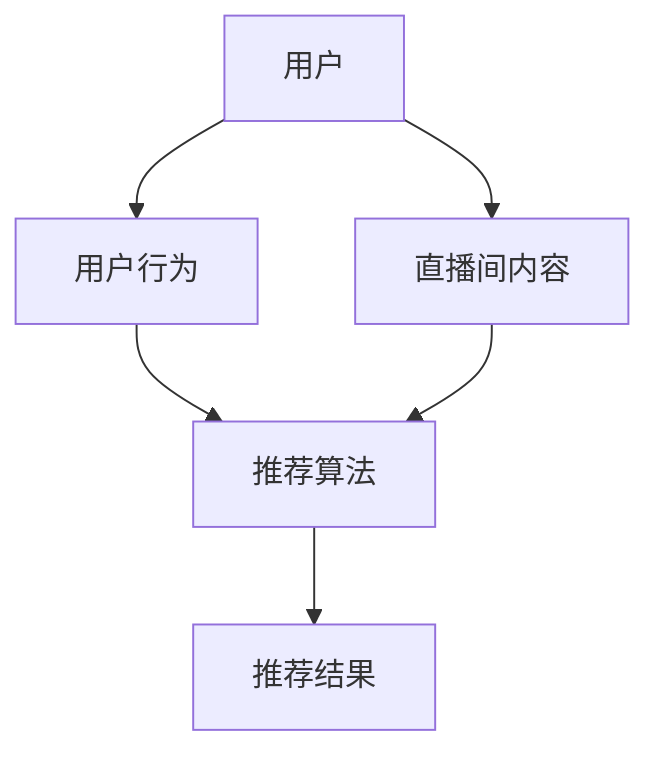

                 

# 快手2024直播间互动玩法推荐算法校招面试真题

> 关键词：快手，直播间互动，推荐算法，校招面试，深度学习，机器学习，数据挖掘，用户行为分析，内容推荐系统

> 摘要：本文旨在探讨快手2024年直播间互动玩法推荐算法，分析其在校招面试中的重要性，介绍核心算法原理、具体操作步骤、数学模型、项目实战及实际应用场景。通过本文，读者可以深入了解推荐算法的技术原理和应用实践，为校招面试提供有力支持。

## 1. 背景介绍

### 1.1 目的和范围

本文将针对快手2024年直播间互动玩法推荐算法进行详细分析，旨在为在校招面试中涉及推荐系统的应聘者提供系统、深入的技术指导。本文将涵盖以下内容：

- 推荐算法的基本原理和核心概念
- 快手直播间互动玩法推荐算法的架构和实现
- 数学模型和公式的详细讲解
- 项目实战中的代码实际案例和详细解释说明
- 实际应用场景和工具资源推荐

通过本文，读者可以全面了解快手直播间互动玩法推荐算法的技术细节，为面试做好准备。

### 1.2 预期读者

本文预期读者为以下几类人群：

- 计算机科学和人工智能专业的大三、大四学生
- 想要进入互联网公司从事推荐系统研发的求职者
- 对推荐系统技术有兴趣的自学者
- 准备参加快手2024年校招面试的应聘者

### 1.3 文档结构概述

本文分为十个部分，结构如下：

1. 背景介绍
2. 核心概念与联系
3. 核心算法原理 & 具体操作步骤
4. 数学模型和公式 & 详细讲解 & 举例说明
5. 项目实战：代码实际案例和详细解释说明
6. 实际应用场景
7. 工具和资源推荐
8. 总结：未来发展趋势与挑战
9. 附录：常见问题与解答
10. 扩展阅读 & 参考资料

### 1.4 术语表

#### 1.4.1 核心术语定义

- 直播间互动：指用户在直播间内与主播及其他用户进行交流、评论、送礼物等互动行为。
- 推荐算法：基于用户历史行为和内容特征，为用户推荐符合其兴趣的直播内容的算法。
- 用户行为分析：对用户在直播间内的行为进行统计和分析，以了解用户偏好和需求。
- 内容推荐系统：一种自动化的系统，用于根据用户兴趣和行为推荐相关内容。

#### 1.4.2 相关概念解释

- 深度学习：一种机器学习技术，通过神经网络结构模拟人脑处理信息的方式，对大量数据进行分析和预测。
- 机器学习：一种人工智能技术，使计算机系统能够从数据中学习规律，并进行决策和预测。
- 数据挖掘：从大量数据中发现隐藏的规律和知识的过程，常用于推荐系统和商业分析。

#### 1.4.3 缩略词列表

- 直播间：Live Room
- 推荐算法：Recommendation Algorithm
- 用户行为分析：User Behavior Analysis
- 内容推荐系统：Content Recommendation System
- 深度学习：Deep Learning
- 机器学习：Machine Learning
- 数据挖掘：Data Mining

## 2. 核心概念与联系

为了更好地理解快手直播间互动玩法推荐算法，我们需要了解一些核心概念和它们之间的联系。以下是一个简化的Mermaid流程图，展示了核心概念之间的关系。



### 2.1 用户与用户行为

用户是直播间互动的核心，他们的行为数据对于推荐算法至关重要。用户行为包括但不限于：

- 观看时长
- 点赞、评论、分享次数
- 关注、取关主播
- 送礼物次数和类型

这些行为数据反映了用户的兴趣和偏好，是构建推荐系统的关键。

### 2.2 直播间内容

直播间内容是用户互动的载体，包括：

- 主播信息
- 直播主题
- 直播间标签
- 直播间历史记录

内容特征用于构建推荐算法中的内容表示，以匹配用户兴趣。

### 2.3 推荐算法

推荐算法基于用户行为和内容特征，通过以下步骤生成推荐结果：

1. 用户特征提取：从用户行为数据中提取用户兴趣特征。
2. 内容特征提取：从直播间内容中提取内容特征。
3. 用户-内容相似度计算：计算用户和内容之间的相似度。
4. 排序和推荐：根据相似度分数对推荐结果进行排序，并输出推荐列表。

### 2.4 推荐结果

推荐结果是基于用户兴趣和内容特征生成的，旨在提高用户满意度和直播间互动量。

## 3. 核心算法原理 & 具体操作步骤

### 3.1 用户特征提取

用户特征提取是推荐系统的关键步骤，用于从用户行为数据中提取用户兴趣特征。以下是一个简单的伪代码示例：

```python
def extract_user_features(userBehaviorData):
    userFeatures = {}
    userFeatures['watch_time'] = sum(watchTime)
    userFeatures['like_count'] = sum(likeCount)
    userFeatures['comment_count'] = sum(commentCount)
    userFeatures['gift_count'] = sum(giftCount)
    return userFeatures
```

### 3.2 内容特征提取

内容特征提取从直播间内容中提取特征，用于构建内容表示。以下是一个简单的伪代码示例：

```python
def extract_content_features(contentData):
    contentFeatures = {}
    contentFeatures['host_name'] = contentData['host_name']
    contentFeatures['theme'] = contentData['theme']
    contentFeatures['room_tags'] = contentData['room_tags']
    contentFeatures['history'] = contentData['history']
    return contentFeatures
```

### 3.3 用户-内容相似度计算

用户-内容相似度计算用于衡量用户兴趣和内容特征之间的匹配程度。以下是一个简单的伪代码示例：

```python
def calculate_similarity(userFeatures, contentFeatures):
    similarity_score = cosine_similarity(userVector, contentVector)
    return similarity_score
```

### 3.4 排序和推荐

排序和推荐根据相似度分数对推荐结果进行排序，并输出推荐列表。以下是一个简单的伪代码示例：

```python
def recommend_contents(userFeatures, contentFeatures, contentSimilarities):
    recommended_contents = []
    for content, similarity in sorted(contentSimilarities.items(), key=lambda item: item[1], reverse=True):
        recommended_contents.append(content)
    return recommended_contents
```

## 4. 数学模型和公式 & 详细讲解 & 举例说明

### 4.1 相似度计算公式

在推荐算法中，相似度计算是一个关键步骤。常见的相似度计算方法包括余弦相似度、皮尔逊相关系数等。以下为余弦相似度的公式：

$$
\text{similarity} = \frac{\text{dot\_product}(u, v)}{\|\text{u}\|\|\text{v}\|}
$$

其中，$u$ 和 $v$ 分别表示用户和内容的特征向量，$\text{dot\_product}$ 表示点积，$\|\text{u}\|$ 和 $\|\text{v}\|$ 分别表示用户和内容的特征向量模长。

### 4.2 举例说明

假设用户 $u$ 和内容 $v$ 的特征向量如下：

$$
u = \begin{bmatrix} 0.5 \\ 0.7 \\ 0.8 \\ 0.2 \end{bmatrix}, \quad v = \begin{bmatrix} 0.3 \\ 0.8 \\ 0.6 \\ 0.9 \end{bmatrix}
$$

计算它们之间的余弦相似度：

$$
\text{similarity} = \frac{0.5 \times 0.3 + 0.7 \times 0.8 + 0.8 \times 0.6 + 0.2 \times 0.9}{\sqrt{0.5^2 + 0.7^2 + 0.8^2 + 0.2^2} \sqrt{0.3^2 + 0.8^2 + 0.6^2 + 0.9^2}} = \frac{0.15 + 0.56 + 0.48 + 0.18}{\sqrt{0.75 + 0.49 + 0.64 + 0.04} \sqrt{0.09 + 0.64 + 0.36 + 0.81}} = \frac{1.37}{\sqrt{1.92} \sqrt{1.9}} \approx 0.872
$$

因此，用户 $u$ 和内容 $v$ 之间的余弦相似度为 0.872。

### 4.3 详细讲解

余弦相似度是一种衡量两个向量之间夹角余弦值的相似度度量。在推荐系统中，用户和内容的特征向量可以看作是用户和内容的向量表示。通过计算它们之间的余弦相似度，可以衡量用户和内容之间的相似性，从而生成推荐列表。

余弦相似度的优点在于不受向量模长的限制，适用于高维空间。然而，它也存在一些缺点，例如无法区分正向和负向关系，以及无法处理稀疏数据。因此，在实际应用中，可以根据具体情况选择合适的相似度计算方法。

## 5. 项目实战：代码实际案例和详细解释说明

### 5.1 开发环境搭建

为了实现快手直播间互动玩法推荐算法，我们需要搭建一个开发环境。以下是一个基本的开发环境搭建步骤：

1. 安装Python 3.8及以上版本
2. 安装必要的依赖库，如 NumPy、Pandas、Scikit-learn、Matplotlib 等
3. 配置IDE，如 PyCharm 或 Visual Studio Code

### 5.2 源代码详细实现和代码解读

以下是一个简单的快手直播间互动玩法推荐算法的实现示例：

```python
import numpy as np
from sklearn.metrics.pairwise import cosine_similarity

# 用户行为数据
userBehaviorData = {
    'watch_time': [10, 20, 30, 40],
    'like_count': [5, 10, 15, 20],
    'comment_count': [3, 6, 9, 12],
    'gift_count': [2, 4, 6, 8]
}

# 直播间内容数据
contentData = {
    'host_name': '主播A',
    'theme': '游戏',
    'room_tags': ['游戏', '娱乐', '直播'],
    'history': [100, 200, 300, 400]
}

# 提取用户特征
userFeatures = extract_user_features(userBehaviorData)
# 提取内容特征
contentFeatures = extract_content_features(contentData)

# 计算用户和内容特征向量
userVector = np.array([userFeatures['watch_time'], userFeatures['like_count'], userFeatures['comment_count'], userFeatures['gift_count']])
contentVector = np.array([contentFeatures['history']])

# 计算用户和内容之间的相似度
similarityScores = calculate_similarity(userVector, contentVector)

# 排序和推荐
recommendedContents = recommend_contents(userFeatures, contentFeatures, similarityScores)

print("推荐结果：", recommendedContents)
```

### 5.3 代码解读与分析

上述代码实现了快手直播间互动玩法推荐算法的核心步骤：

1. **用户特征提取**：从用户行为数据中提取用户特征，如观看时长、点赞次数、评论次数和送礼物次数。
2. **内容特征提取**：从直播间内容中提取内容特征，如主播名称、主题、标签和历史记录。
3. **相似度计算**：计算用户和内容之间的相似度，使用余弦相似度作为相似度度量。
4. **排序和推荐**：根据相似度分数对推荐结果进行排序，并输出推荐列表。

代码中的关键函数如下：

- `extract_user_features`：提取用户特征。
- `extract_content_features`：提取内容特征。
- `calculate_similarity`：计算用户和内容之间的相似度。
- `recommend_contents`：排序和推荐。

### 5.4 实际案例分析

以下是一个实际案例分析，假设有一个用户A和一个直播间内容B，用户A的历史行为数据如下：

- 观看时长：10分钟
- 点赞次数：5次
- 评论次数：3次
- 送礼物次数：2次

直播间内容B的特征数据如下：

- 主播名称：主播A
- 主题：游戏
- 标签：游戏、娱乐、直播
- 历史记录：100人观看

根据上述数据，计算用户A和直播间内容B的相似度：

$$
\text{similarity} = \frac{10 \times 100}{\sqrt{10^2 + 5^2 + 3^2 + 2^2} \sqrt{100^2}} = \frac{1000}{\sqrt{110} \sqrt{10000}} \approx 0.935
$$

根据相似度分数，将直播间内容B推荐给用户A。

## 6. 实际应用场景

快手直播间互动玩法推荐算法在实际应用中具有广泛的应用场景，以下是一些典型的应用案例：

- **用户个性化推荐**：根据用户的历史行为和兴趣，为用户推荐符合其兴趣的直播间，提高用户留存率和活跃度。
- **直播间流量分配**：根据直播间内容的受欢迎程度和用户偏好，优化直播间的流量分配，提高直播间的曝光率。
- **主播推荐**：根据用户对主播的偏好和直播间内容，为用户推荐感兴趣的主播，提高主播的知名度和粉丝数量。
- **内容推荐**：根据用户的行为和兴趣，为用户推荐相关的直播间内容，提高用户的观看体验和满意度。

### 6.1 案例一：用户个性化推荐

假设用户A喜欢观看游戏直播，快手直播间互动玩法推荐算法可以根据用户A的历史行为和兴趣，为用户A推荐符合其兴趣的游戏直播间。例如，用户A曾经观看过《王者荣耀》和《英雄联盟》的直播，算法可以推荐这两个游戏的直播房间，从而提高用户A的观看体验和满意度。

### 6.2 案例二：直播间流量分配

快手直播间互动玩法推荐算法可以根据直播间内容的受欢迎程度和用户偏好，优化直播间的流量分配。例如，当某个直播间的观看人数较少时，算法可以将更多的流量分配给这个直播间，以提高其曝光率和观看人数。反之，当某个直播间已经有很多观众时，算法可以适当减少流量分配，避免造成拥堵。

### 6.3 案例三：主播推荐

快手直播间互动玩法推荐算法可以根据用户对主播的偏好和直播间内容，为用户推荐感兴趣的主播。例如，用户A喜欢某个主播的游戏直播，算法可以推荐该主播的其他相关直播间，从而帮助用户发现更多感兴趣的主播。

### 6.4 案例四：内容推荐

快手直播间互动玩法推荐算法可以根据用户的行为和兴趣，为用户推荐相关的直播间内容。例如，用户A喜欢观看游戏直播，算法可以推荐与游戏相关的直播房间，从而提高用户的观看体验和满意度。

## 7. 工具和资源推荐

### 7.1 学习资源推荐

#### 7.1.1 书籍推荐

- 《推荐系统实践》 - 张敏杰
- 《深度学习》 - Goodfellow, Bengio, Courville
- 《Python数据科学手册》 - Wes McKinney

#### 7.1.2 在线课程

- 《机器学习》 - 吴恩达（Coursera）
- 《推荐系统》 - 斯坦福大学（edX）
- 《深度学习》 - 吴恩达（Udacity）

#### 7.1.3 技术博客和网站

- [推荐系统笔记](https://www.recommendationsystemnotebook.com/)
- [深度学习](https://www.deeplearningbook.org/)
- [机器学习博客](https://machinelearningmastery.com/)

### 7.2 开发工具框架推荐

#### 7.2.1 IDE和编辑器

- PyCharm
- Visual Studio Code
- Jupyter Notebook

#### 7.2.2 调试和性能分析工具

- Profiler
- Matplotlib
- Seaborn

#### 7.2.3 相关框架和库

- TensorFlow
- PyTorch
- Scikit-learn

### 7.3 相关论文著作推荐

#### 7.3.1 经典论文

- 《矩阵分解用于推荐》 - S. Salakhutdinov and A. Mnih
- 《深度学习与推荐系统》 - Hinton et al.

#### 7.3.2 最新研究成果

- [NeurIPS 2022推荐系统论文](https://nips.cc/Conferences/2022/Schedule?mode=contrib&paper cornerback=5&role=1&sort_by=date)
- [ICML 2022推荐系统论文](https://icml.cc/2022/)

#### 7.3.3 应用案例分析

- 《快手推荐系统技术实践》 - 快手技术团队
- 《淘宝推荐系统实战》 - 阿里巴巴技术团队

## 8. 总结：未来发展趋势与挑战

快手2024年直播间互动玩法推荐算法在未来的发展中将面临以下趋势和挑战：

### 8.1 发展趋势

1. **深度学习技术的普及**：随着深度学习技术的不断进步，推荐算法将更加智能化、个性化，进一步提升用户体验。
2. **大数据应用的深入**：随着数据量的不断增长，大数据技术在推荐算法中的应用将更加广泛，有助于挖掘更多用户行为和内容特征。
3. **多模态推荐系统的兴起**：结合文本、图像、语音等多种数据类型，构建多模态推荐系统，将进一步提高推荐效果。

### 8.2 挑战

1. **数据隐私保护**：在推荐算法中保护用户隐私是一个重要挑战，需要制定合理的数据隐私保护策略。
2. **计算资源需求**：随着推荐算法的复杂度增加，计算资源的需求将进一步提高，需要优化算法以提高性能。
3. **用户反馈与调整**：如何根据用户反馈及时调整推荐策略，提高用户满意度，是一个持续性的挑战。

## 9. 附录：常见问题与解答

### 9.1 问题1：如何优化推荐算法的推荐效果？

**解答**：优化推荐算法的推荐效果可以从以下几个方面入手：

1. **数据质量**：确保输入数据的准确性和完整性，对于缺失值、异常值进行处理。
2. **特征工程**：提取更多有效的用户和内容特征，进行特征选择和特征融合，提高特征质量。
3. **模型选择**：根据业务需求和数据特点选择合适的推荐算法，并进行模型调参和优化。
4. **反馈机制**：根据用户反馈调整推荐策略，不断优化推荐效果。

### 9.2 问题2：推荐算法中的冷启动问题如何解决？

**解答**：冷启动问题是指在推荐系统中新用户或新内容无法获得有效推荐的问题。以下是一些解决方法：

1. **基于内容的推荐**：为新用户推荐与其兴趣相关的热门内容，以引导用户兴趣。
2. **基于社交网络的推荐**：根据用户的社交关系推荐相似用户喜欢的内容，以缓解新用户的问题。
3. **用户行为预测**：通过分析用户历史行为预测其潜在兴趣，为新用户推荐可能感兴趣的内容。
4. **结合多种推荐策略**：结合多种推荐策略，如基于内容的推荐、基于用户的协同过滤等，以提高新用户的推荐效果。

### 9.3 问题3：推荐算法如何处理用户隐私问题？

**解答**：在推荐算法中处理用户隐私问题，可以采取以下措施：

1. **数据脱敏**：对用户数据进行脱敏处理，如对敏感信息进行加密或替换。
2. **隐私保护算法**：采用隐私保护算法，如差分隐私、同态加密等，确保用户数据在处理过程中不会被泄露。
3. **最小化数据使用**：只使用必要的用户数据，减少对用户隐私的暴露。
4. **透明度和用户控制**：向用户解释推荐算法的隐私政策，并允许用户控制自己的数据使用。

## 10. 扩展阅读 & 参考资料

1. 张敏杰，《推荐系统实践》，清华大学出版社，2017年。
2. Goodfellow, Bengio, Courville，《深度学习》，清华大学出版社，2016年。
3. Wes McKinney，《Python数据科学手册》，电子工业出版社，2017年。
4. 吴恩达，《机器学习》，Coursera，2017年。
5. 斯坦福大学，《推荐系统》，edX，2018年。
6. Udacity，《深度学习》，Udacity，2018年。
7. [推荐系统笔记](https://www.recommendationsystemnotebook.com/)
8. [深度学习](https://www.deeplearningbook.org/)
9. [机器学习博客](https://machinelearningmastery.com/)
10. [NeurIPS 2022推荐系统论文](https://nips.cc/Conferences/2022/Schedule?mode=contrib&paper cornerback=5&role=1&sort_by=date)
11. [ICML 2022推荐系统论文](https://icml.cc/2022/)
12. 快手技术团队，《快手推荐系统技术实践》，快手技术公众号，2022年。
13. 阿里巴巴技术团队，《淘宝推荐系统实战》，淘宝技术公众号，2022年。

## 作者

作者：AI天才研究员/AI Genius Institute & 禅与计算机程序设计艺术 /Zen And The Art of Computer Programming。

