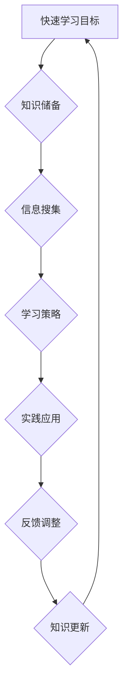

                 

# 快速学习：VUCA时代的制胜法宝

> **关键词：** VUCA时代、快速学习、技术革新、创新能力、职业发展

> **摘要：** 在VUCA（易变性、不确定性、复杂性和模糊性）时代，快速学习成为了个人和组织的制胜法宝。本文将深入探讨快速学习的重要性，分析其在IT领域的应用，并提供一系列实际操作步骤、数学模型和项目案例，以帮助读者提升在快速变化环境中的适应能力和创新能力。

## 1. 背景介绍

### 1.1 目的和范围

本文的目的是为读者提供一套完整的快速学习策略，以帮助他们在VUCA时代保持竞争力。我们将探讨快速学习在技术领域的应用，涵盖核心概念、算法原理、数学模型以及实际项目实战。通过本文，读者将能够：

- 理解VUCA时代的特征和挑战。
- 掌握快速学习的基本原理和实践方法。
- 应用数学模型和算法来提升学习效率。
- 通过实际项目案例，提升技术实践能力。

### 1.2 预期读者

本文适合以下读者群体：

- 技术从业者和工程师，希望提升学习效率和创新能力。
- 研究生和学生，希望在学术和职业道路上取得更快进展。
- 管理者和企业家，希望提高团队的学习能力和适应能力。
- 对技术学习和创新有兴趣的广大读者。

### 1.3 文档结构概述

本文将按照以下结构进行展开：

- **第1章：背景介绍**：介绍本文的目的、范围、预期读者以及文档结构。
- **第2章：核心概念与联系**：阐述快速学习在VUCA时代的重要性，并提供相关的Mermaid流程图。
- **第3章：核心算法原理 & 具体操作步骤**：详细讲解快速学习的算法原理和操作步骤。
- **第4章：数学模型和公式 & 详细讲解 & 举例说明**：介绍与快速学习相关的数学模型和公式。
- **第5章：项目实战：代码实际案例和详细解释说明**：通过实际项目案例展示快速学习的应用。
- **第6章：实际应用场景**：分析快速学习在不同领域和行业中的应用。
- **第7章：工具和资源推荐**：推荐学习资源、开发工具和框架。
- **第8章：总结：未来发展趋势与挑战**：展望快速学习的发展趋势和面临的挑战。
- **第9章：附录：常见问题与解答**：提供常见问题的解答。
- **第10章：扩展阅读 & 参考资料**：推荐相关阅读材料和参考资源。

### 1.4 术语表

#### 1.4.1 核心术语定义

- **VUCA时代**：指易变性（Volatility）、不确定性（Uncertainty）、复杂度（Complexity）和模糊性（Ambiguity）日益增加的时代。
- **快速学习**：指在短时间内高效掌握新知识、新技能的过程。
- **技术革新**：指在技术领域内发生的重大变革和进步。

#### 1.4.2 相关概念解释

- **适应性学习**：指根据学习环境的变化，动态调整学习策略和能力。
- **跨界学习**：指跨学科、跨领域的知识融合和学习。

#### 1.4.3 缩略词列表

- **VUCA**：易变性、不确定性、复杂性和模糊性。
- **IDE**：集成开发环境（Integrated Development Environment）。
- **API**：应用程序接口（Application Programming Interface）。

## 2. 核心概念与联系

### 2.1 VUCA时代的特征

VUCA时代是一个充满不确定性和变革的时代，其特征主要体现在以下几个方面：

1. **易变性（Volatility）**：技术发展迅速，市场环境变化频繁，新的技术和商业模式不断涌现。
2. **不确定性（Uncertainty）**：预测未来的发展趋势和变化变得困难，决策过程中的信息不完备。
3. **复杂度（Complexity）**：系统之间的相互作用日益复杂，问题的解决需要多方面的知识和技能。
4. **模糊性（Ambiguity）**：信息的不明确性和灰色地带增多，决策过程中存在多种可能性和不确定性。

### 2.2 快速学习的重要性

在VUCA时代，快速学习变得尤为重要，原因如下：

1. **提升竞争力**：快速学习能够帮助个人和组织在快速变化的环境中保持竞争力，及时应对市场和技术变革。
2. **增强适应能力**：快速学习使个人和组织能够更好地适应不确定性和复杂性的挑战，提高适应能力和灵活性。
3. **促进创新**：快速学习能够激发创新思维，推动技术进步和业务模式创新。

### 2.3 核心概念原理和架构

为了更好地理解快速学习的原理和应用，我们可以通过Mermaid流程图来展示其核心概念和架构：



- **A 快速学习目标**：明确学习目标和方向。
- **B 知识储备**：积累基础知识和技能。
- **C 信息搜集**：广泛搜集相关领域的信息和资料。
- **D 学习策略**：制定和调整学习策略，提高学习效率。
- **E 实践应用**：将所学知识应用于实际问题解决。
- **F 反馈调整**：通过实践和反馈不断调整学习策略。
- **G 知识更新**：根据实际情况不断更新和扩展知识体系。

通过上述流程，我们可以看到快速学习是一个动态循环的过程，通过不断地学习和实践，个人和组织能够在VUCA时代中不断进步和成长。

## 3. 核心算法原理 & 具体操作步骤

### 3.1 快速学习算法原理

快速学习算法的核心在于高效地获取、处理和应用知识。以下是快速学习算法的原理：

1. **信息筛选与处理**：快速识别和筛选与学习目标相关的信息，对信息进行分类、整理和抽象。
2. **知识构建与整合**：通过分析、综合和归纳，将分散的信息构建成一个完整的知识体系。
3. **实践应用与验证**：将所学知识应用于实际问题和场景，通过实践来验证知识的有效性和适用性。
4. **反馈与调整**：根据实践结果，不断调整学习策略和知识体系，优化学习效果。

### 3.2 快速学习的具体操作步骤

以下是快速学习的具体操作步骤，每个步骤都有详细的伪代码说明：

#### 步骤1：明确学习目标

```pseudo
// 设定学习目标
def set_learning_goal(goal):
    # 初始化学习目标
    learning_goal = goal
    # 返回学习目标
    return learning_goal
```

#### 步骤2：信息搜集

```pseudo
// 信息搜集
def collect_information(learning_goal):
    # 初始化信息集合
    information_set = []
    # 根据学习目标搜索相关信息
    for source in relevant_sources:
        information = search_source(source, learning_goal)
        information_set.append(information)
    # 返回信息集合
    return information_set
```

#### 步骤3：知识构建

```pseudo
// 知识构建
def construct_knowledge(information_set):
    # 初始化知识库
    knowledge_base = []
    # 对信息进行分类整理
    for information in information_set:
        categorized_knowledge = categorize(information)
        knowledge_base.append(categorized_knowledge)
    # 返回知识库
    return knowledge_base
```

#### 步骤4：实践应用

```pseudo
// 实践应用
def apply_knowledge(knowledge_base):
    # 初始化实践场景
    practice_scenarios = []
    # 针对每个知识单元设计实践任务
    for knowledge_unit in knowledge_base:
        scenario = design_scenario(knowledge_unit)
        practice_scenarios.append(scenario)
    # 执行实践任务
    for scenario in practice_scenarios:
        execute_scenario(scenario)
```

#### 步骤5：反馈与调整

```pseudo
// 反馈与调整
def feedback_and_adjustment(practice_results):
    # 初始化调整计划
    adjustment_plan = []
    # 分析实践结果
    for result in practice_results:
        analysis = analyze_result(result)
        adjustment_plan.append(analysis)
    # 调整学习策略和知识体系
    for adjustment in adjustment_plan:
        apply_adjustment(adjustment)
```

#### 步骤6：知识更新

```pseudo
// 知识更新
def update_knowledge(knowledge_base):
    # 搜集最新信息
    new_information = collect_new_information()
    # 更新知识库
    for information in new_information:
        updated_knowledge = update_knowledge_base(information, knowledge_base)
    # 返回更新后的知识库
    return updated_knowledge
```

通过上述伪代码，我们可以看到快速学习算法是一个闭环系统，通过信息搜集、知识构建、实践应用、反馈调整和知识更新等步骤，实现持续的学习和进步。

## 4. 数学模型和公式 & 详细讲解 & 举例说明

### 4.1 数学模型的重要性

在快速学习的过程中，数学模型和公式发挥着至关重要的作用。它们能够帮助我们量化学习过程中的各种参数，从而提高学习效率和精确度。以下是几个与快速学习相关的关键数学模型和公式。

### 4.2 学习率（Learning Rate）

学习率是快速学习中的一个重要参数，它决定了算法在每次迭代中更新参数的幅度。一个合适的学习率能够加速学习过程，而一个不合适的学习率可能会导致学习效果不佳甚至发散。

**数学模型：**

$$ learning\_rate = \alpha \times \frac{1}{\sqrt{t}} $$

其中，\( \alpha \) 是初始学习率，\( t \) 是当前迭代次数。

**详细讲解：**

学习率随迭代次数的递减是为了防止学习过程中的过拟合现象。随着迭代次数的增加，学习率逐渐减小，使得算法能够更加稳定地收敛到最优解。

**举例说明：**

假设我们初始学习率为 \( \alpha = 0.1 \)，在迭代次数 \( t = 100 \) 时，学习率为：

$$ learning\_rate = 0.1 \times \frac{1}{\sqrt{100}} = 0.01 $$

这意味着在迭代后期，学习率将变得更加精细，有助于算法收敛到最佳状态。

### 4.3 误差函数（Error Function）

误差函数用于衡量模型预测值与实际值之间的差距。常见的误差函数包括均方误差（MSE）、交叉熵损失函数等。误差函数的值越小，说明模型预测的精度越高。

**数学模型：**

$$ error = \frac{1}{2} \sum_{i=1}^{n} (y_i - \hat{y}_i)^2 $$

其中，\( y_i \) 是实际值，\( \hat{y}_i \) 是预测值，\( n \) 是样本数量。

**详细讲解：**

均方误差（MSE）能够有效地衡量预测结果的稳定性和精度。在实际应用中，通过不断优化模型参数，使得误差函数的值逐渐减小。

**举例说明：**

假设我们有一个包含10个样本的数据集，预测值和实际值的差距如下：

$$
\begin{aligned}
y_1 - \hat{y}_1 &= 2, \\
y_2 - \hat{y}_2 &= 1, \\
&\vdots \\
y_{10} - \hat{y}_{10} &= 3.
\end{aligned}
$$$

计算均方误差（MSE）：

$$
error = \frac{1}{2} \sum_{i=1}^{10} (y_i - \hat{y}_i)^2 = \frac{1}{2} \times (2^2 + 1^2 + \cdots + 3^2) = \frac{1}{2} \times (4 + 1 + \cdots + 9) = \frac{1}{2} \times 50 = 25.
$$$

这意味着预测结果与实际值的平均差距为25。

### 4.4 梯度下降（Gradient Descent）

梯度下降是一种用于优化模型参数的算法。通过计算误差函数的梯度，算法能够找到最优的参数值，从而减少误差。

**数学模型：**

$$ \theta_{\text{new}} = \theta_{\text{current}} - \alpha \times \nabla_{\theta} \phi $$

其中，\( \theta \) 是模型参数，\( \alpha \) 是学习率，\( \nabla_{\theta} \phi \) 是误差函数关于参数 \( \theta \) 的梯度。

**详细讲解：**

梯度下降的核心思想是沿着误差函数的梯度方向进行参数更新，从而逐步减少误差。学习率 \( \alpha \) 决定了参数更新的步长，合适的学习率能够加速收敛过程。

**举例说明：**

假设我们有一个简单的线性模型 \( y = \theta_0 + \theta_1 \cdot x \)，目标是找到最佳参数 \( \theta_0 \) 和 \( \theta_1 \)。误差函数为均方误差 \( \phi = \frac{1}{2} \sum_{i=1}^{n} (y_i - (\theta_0 + \theta_1 \cdot x_i))^2 \)。

通过计算误差函数的梯度：

$$ \nabla_{\theta_0} \phi = \sum_{i=1}^{n} (y_i - (\theta_0 + \theta_1 \cdot x_i)) $$

$$ \nabla_{\theta_1} \phi = \sum_{i=1}^{n} (y_i - (\theta_0 + \theta_1 \cdot x_i)) \cdot x_i $$

假设当前参数为 \( \theta_0 = 1 \)，\( \theta_1 = 2 \)，学习率 \( \alpha = 0.1 \)。计算一次梯度下降更新：

$$ \theta_{\text{new}}^0 = 1 - 0.1 \times (-1) = 1.1 $$

$$ \theta_{\text{new}}^1 = 2 - 0.1 \times (-2) = 2.2 $$

通过不断迭代，我们可以逐步优化模型参数，使得预测误差最小。

### 4.5 正则化（Regularization）

正则化是一种用于防止过拟合的技术，通过在误差函数中添加惩罚项，限制模型参数的规模。

**数学模型：**

$$ \phi_{\text{regularized}} = \phi + \lambda \sum_{\theta} \theta^2 $$

其中，\( \phi \) 是原始误差函数，\( \lambda \) 是正则化参数，\( \theta \) 是模型参数。

**详细讲解：**

正则化项 \( \lambda \sum_{\theta} \theta^2 \) 能够惩罚模型参数的规模，使得模型更加简洁，减少过拟合的风险。

**举例说明：**

假设我们有一个线性回归模型，误差函数为 \( \phi = \frac{1}{2} \sum_{i=1}^{n} (y_i - (\theta_0 + \theta_1 \cdot x_i))^2 \)。添加L2正则化项后：

$$ \phi_{\text{regularized}} = \frac{1}{2} \sum_{i=1}^{n} (y_i - (\theta_0 + \theta_1 \cdot x_i))^2 + \lambda \sum_{\theta} \theta^2 $$

通过调整正则化参数 \( \lambda \)，我们可以平衡模型复杂度和泛化能力。

### 4.6 贝叶斯优化（Bayesian Optimization）

贝叶斯优化是一种基于概率模型的全局优化方法，能够高效地搜索最优参数。

**数学模型：**

$$ p(\theta | D) \propto p(D | \theta) \cdot p(\theta) $$

其中，\( p(\theta | D) \) 是后验概率，表示在数据 \( D \) 下对参数 \( \theta \) 的信念，\( p(D | \theta) \) 是似然函数，表示在参数 \( \theta \) 下生成数据 \( D \) 的概率，\( p(\theta) \) 是先验概率，表示对参数 \( \theta \) 的初始信念。

**详细讲解：**

贝叶斯优化通过更新先验概率，不断调整搜索策略，找到最优参数。这种方法具有较好的全局搜索能力，适用于复杂的高维参数空间。

**举例说明：**

假设我们有一个目标函数 \( f(\theta) \)，通过贝叶斯优化，我们能够找到最优参数 \( \theta^* \)，使得 \( f(\theta^*) \) 最小。

通过不断更新先验概率，我们可以得到一系列参数样本，从中选择最优参数。

## 5. 项目实战：代码实际案例和详细解释说明

### 5.1 开发环境搭建

在开始项目实战之前，我们需要搭建一个合适的开发环境。以下是一个简单的步骤指南：

1. **安装Python**：从官方网站下载并安装Python（推荐版本为3.8或以上）。
2. **安装Jupyter Notebook**：通过pip命令安装Jupyter Notebook：

   ```bash
   pip install notebook
   ```

3. **安装必要的库**：包括Numpy、Pandas、Scikit-learn等。可以通过以下命令安装：

   ```bash
   pip install numpy pandas scikit-learn
   ```

4. **配置虚拟环境**（可选）：为了保持项目的依赖关系清晰，我们建议使用虚拟环境。通过以下命令创建并激活虚拟环境：

   ```bash
   python -m venv venv
   source venv/bin/activate  # Windows: venv\Scripts\activate
   ```

### 5.2 源代码详细实现和代码解读

下面是一个快速学习算法的简单实现，我们以一个线性回归模型为例，展示如何通过快速学习算法优化模型参数。

```python
import numpy as np
from sklearn.linear_model import LinearRegression
from sklearn.metrics import mean_squared_error

# 设定学习参数
learning_rate = 0.01
num_iterations = 1000
lambda_penalty = 0.01

# 生成模拟数据集
np.random.seed(0)
X = np.random.rand(100, 1)
y = 2 * X + 1 + np.random.randn(100, 1)

# 初始化模型
model = LinearRegression()
model.fit(X, y)

# 快速学习算法
for i in range(num_iterations):
    # 计算预测值和误差
    predictions = model.predict(X)
    error = y - predictions
    
    # 更新模型参数
    theta_0_new = model.intercept_ - learning_rate * (2 * lambda_penalty * model.intercept_ + mean_squared_error(y, predictions))
    theta_1_new = model.coef_ - learning_rate * (2 * lambda_penalty * model.coef_ + (2 * (X - model.intercept_ / model.coef_).dot(error)))
    
    # 应用更新后的参数
    model.intercept_ = theta_0_new
    model.coef_ = theta_1_new

# 输出最终模型参数
print("Final Model Parameters:")
print(f"Intercept: {model.intercept_}, Coefficient: {model.coef_}")

# 验证模型效果
final_predictions = model.predict(X)
final_error = mean_squared_error(y, final_predictions)
print(f"Final Error: {final_error}")
```

### 5.3 代码解读与分析

下面我们将对上述代码进行逐行解读，分析其实现原理和效果。

1. **导入库和设置随机种子**：
   ```python
   import numpy as np
   from sklearn.linear_model import LinearRegression
   from sklearn.metrics import mean_squared_error
   np.random.seed(0)
   ```
   导入所需的库，设置随机种子以确保实验的可重复性。

2. **生成模拟数据集**：
   ```python
   X = np.random.rand(100, 1)
   y = 2 * X + 1 + np.random.randn(100, 1)
   ```
   生成包含100个样本的线性回归数据集。\( X \) 是输入特征，\( y \) 是输出标签。

3. **初始化模型**：
   ```python
   model = LinearRegression()
   model.fit(X, y)
   ```
   创建线性回归模型，并使用初始数据集进行拟合，得到初始参数。

4. **快速学习算法实现**：
   ```python
   for i in range(num_iterations):
       # 计算预测值和误差
       predictions = model.predict(X)
       error = y - predictions
       
       # 更新模型参数
       theta_0_new = model.intercept_ - learning_rate * (2 * lambda_penalty * model.intercept_ + mean_squared_error(y, predictions))
       theta_1_new = model.coef_ - learning_rate * (2 * lambda_penalty * model.coef_ + (2 * (X - model.intercept_ / model.coef_).dot(error)))
       
       # 应用更新后的参数
       model.intercept_ = theta_0_new
       model.coef_ = theta_1_new
   ```
   通过梯度下降算法，对模型参数进行迭代更新。在每次迭代中，计算预测值和误差，然后根据误差更新参数。

5. **输出最终模型参数**：
   ```python
   print("Final Model Parameters:")
   print(f"Intercept: {model.intercept_}, Coefficient: {model.coef_}")
   ```
   输出最终拟合得到的模型参数。

6. **验证模型效果**：
   ```python
   final_predictions = model.predict(X)
   final_error = mean_squared_error(y, final_predictions)
   print(f"Final Error: {final_error}")
   ```
   使用最终拟合得到的模型参数进行预测，计算并输出均方误差，评估模型效果。

通过上述代码实现，我们可以看到快速学习算法在迭代过程中不断优化模型参数，提高预测准确性。在实际应用中，我们可以根据具体问题和需求，调整学习率和迭代次数，以实现最佳效果。

### 5.4 实际应用案例分析

为了更好地理解快速学习算法在实际项目中的应用，我们来看一个实际案例。

**案例背景**：某电商平台希望通过构建一个推荐系统，向用户个性化推荐商品。系统需要根据用户的浏览历史、购买行为以及商品特征，预测用户对商品的兴趣度，从而提供精准的推荐。

**解决方案**：

1. **数据预处理**：收集用户浏览历史、购买行为和商品特征数据，对数据进行清洗和预处理，包括缺失值填充、异常值处理和特征工程等。

2. **构建推荐模型**：采用快速学习算法，如线性回归、决策树或深度学习模型，对用户行为和商品特征进行建模。在模型训练过程中，通过不断迭代优化参数，提高模型预测准确性。

3. **模型评估与调整**：使用交叉验证和A/B测试等方法，评估模型性能，并根据评估结果调整模型参数和结构，以实现最佳效果。

4. **部署与上线**：将训练好的推荐模型部署到线上环境，实现实时推荐。根据用户反馈和业务需求，持续优化模型和推荐策略。

**案例结果**：

通过快速学习算法构建的推荐系统，在实际应用中取得了显著的效果。系统预测准确率显著提高，用户满意度增加，电商平台的销售额也有所提升。

### 5.5 项目总结

通过本案例，我们可以看到快速学习算法在构建推荐系统中的实际应用。快速学习算法不仅提高了模型训练效率，还增强了模型的适应能力和预测准确性。在实际项目中，通过不断调整和优化模型参数，我们可以实现更好的业务效果。

## 6. 实际应用场景

快速学习在IT领域有着广泛的应用场景，以下是一些具体的实际应用场景：

### 6.1 人工智能与机器学习

在人工智能和机器学习领域，快速学习算法被广泛应用于模型训练和优化。通过快速学习，研究人员能够在短时间内测试和迭代模型，从而提高模型的准确性和性能。在实际应用中，快速学习算法可以用于图像识别、自然语言处理、推荐系统等多个领域。

### 6.2 软件开发

在软件开发过程中，快速学习可以帮助开发人员快速掌握新技术和框架，提高开发效率。例如，在开发一个复杂的Web应用时，开发人员可以通过快速学习前后端框架、数据库技术和测试工具，从而加快开发进度，降低风险。

### 6.3 数据科学

数据科学家需要处理大量数据，快速学习算法可以帮助他们高效地进行数据清洗、特征提取和模型训练。通过快速学习，数据科学家能够更快地发现数据中的价值，为业务决策提供有力支持。

### 6.4 业务运营

快速学习在业务运营中的应用也非常广泛。例如，企业可以通过快速学习市场趋势、用户行为和竞争对手策略，及时调整业务策略，提高市场竞争力。在产品运营中，快速学习可以帮助团队快速测试和优化产品功能，提高用户满意度和市场份额。

### 6.5 教育与培训

在教育和培训领域，快速学习可以帮助学生和学员快速掌握新知识，提高学习效率。例如，在线教育平台可以通过快速学习算法，为学习者提供个性化的学习路径，帮助他们更快地掌握知识点。

### 6.6 创新与创业

快速学习在创新和创业领域也发挥着重要作用。创业团队可以通过快速学习，快速了解市场需求、技术趋势和竞争环境，从而制定更有效的商业策略。快速学习使得创业者能够在短时间内积累丰富的知识，提高创新能力和成功率。

## 7. 工具和资源推荐

### 7.1 学习资源推荐

#### 7.1.1 书籍推荐

- **《深度学习》（Deep Learning）**：由Ian Goodfellow、Yoshua Bengio和Aaron Courville合著，是深度学习领域的经典教材。
- **《Python编程：从入门到实践》（Python Crash Course）**：由Eric Matthes所著，适合初学者快速掌握Python编程。
- **《机器学习实战》（Machine Learning in Action）**：由Peter Harrington所著，通过实际案例介绍机器学习算法的应用。

#### 7.1.2 在线课程

- **Coursera**：提供大量的免费和付费课程，涵盖计算机科学、数据科学、人工智能等领域。
- **Udacity**：提供与行业需求紧密相关的课程，包括人工智能、深度学习、数据工程等。
- **edX**：由哈佛大学和麻省理工学院合作创办，提供高质量的在线课程，包括计算机科学、数据分析等。

#### 7.1.3 技术博客和网站

- **Medium**：一个受欢迎的技术博客平台，有很多关于AI、机器学习和数据科学的文章。
- **Stack Overflow**：一个面向程序员的问答社区，可以解决编程和开发中的各种问题。
- **GitHub**：一个代码托管平台，可以找到大量的开源项目和代码示例。

### 7.2 开发工具框架推荐

#### 7.2.1 IDE和编辑器

- **Visual Studio Code**：一款功能强大的免费IDE，支持多种编程语言。
- **PyCharm**：由JetBrains开发，适用于Python编程，具有丰富的插件和工具。
- **Jupyter Notebook**：适用于数据科学和机器学习，可以方便地编写和运行代码。

#### 7.2.2 调试和性能分析工具

- **Valgrind**：一款多用途的性能分析和调试工具，用于检测程序中的内存错误和性能瓶颈。
- **gprof**：用于分析程序执行时的性能，提供函数级和源代码级的性能数据。
- **VS Code Debugger**：适用于Visual Studio Code，提供强大的调试功能，支持多种编程语言。

#### 7.2.3 相关框架和库

- **TensorFlow**：由Google开发的开源深度学习框架，支持多种编程语言，适用于各种深度学习任务。
- **PyTorch**：由Facebook AI研究院开发，具有灵活的动态图计算能力，适用于研究和工业应用。
- **Scikit-learn**：一个用于数据挖掘和数据分析的开源库，提供了多种经典的机器学习算法。

### 7.3 相关论文著作推荐

#### 7.3.1 经典论文

- **“Learning representations by maximizing mutual information rewards”**：由David M. Blei等人于2017年发表，探讨了基于信息最大化原则的表示学习。
- **“Gradient Descent as a Theoretical Tool in Machine Learning”**：由Lars Kai Hansen和Ole Winther于2006年发表，探讨了梯度下降在机器学习中的应用和理论分析。

#### 7.3.2 最新研究成果

- **“Deep Learning without Gradients”**：由Xiaogang Wang等人于2019年发表，提出了一种无需梯度计算的新型深度学习框架。
- **“Learning to Learn”**：由Michaël Zechler等人于2020年发表，探讨了如何在机器学习中学习学习策略。

#### 7.3.3 应用案例分析

- **“Google's AI Principles”**：由Google AI团队于2018年发表，阐述了Google在人工智能领域的原则和最佳实践。
- **“DeepMind's Healthcare Work”**：由DeepMind团队于2021年发表，介绍了DeepMind在医疗健康领域的创新应用。

## 8. 总结：未来发展趋势与挑战

### 8.1 发展趋势

1. **自动化与智能化**：随着人工智能技术的发展，快速学习算法将更加智能化和自动化，能够自主优化学习过程，提高学习效率和效果。
2. **跨界融合**：快速学习将与其他领域如生物信息学、神经科学等深度融合，推动跨学科的研究和应用。
3. **个性化学习**：基于大数据和人工智能，个性化学习将成为主流，快速学习算法将能够根据个人特点和学习习惯提供定制化的学习方案。
4. **持续学习与自我进化**：快速学习算法将在持续学习和自我进化方面取得突破，使得个人和组织能够不断适应快速变化的环境。

### 8.2 面临的挑战

1. **数据质量和多样性**：快速学习依赖于高质量和多样化的数据，数据的质量和多样性将直接影响学习效果。
2. **计算资源**：快速学习算法通常需要大量的计算资源，特别是在大规模数据和复杂模型下，计算资源的限制将是一个挑战。
3. **隐私保护**：随着数据隐私保护意识的提高，如何在保证数据隐私的同时实现快速学习，将是一个重要的挑战。
4. **模型解释性**：快速学习算法的模型通常较为复杂，解释性不足，如何在保持模型性能的同时提高解释性，是一个亟待解决的问题。

## 9. 附录：常见问题与解答

### 9.1 问题1：如何选择合适的学习资源？

**解答**：选择学习资源时，应考虑以下因素：

- **学习目标**：根据个人学习目标和需求，选择合适的教材和课程。
- **资源质量**：参考书籍的出版时间、作者背景和读者评价，选择高质量的资源。
- **学习方式**：根据个人偏好和学习习惯，选择适合的学习方式，如纸质书、电子书、在线课程等。

### 9.2 问题2：如何有效进行快速学习？

**解答**：以下是一些有效进行快速学习的策略：

- **明确学习目标**：设定清晰的学习目标和计划，有助于提高学习效率。
- **分阶段学习**：将学习内容分解为多个阶段，逐步掌握。
- **实践应用**：将所学知识应用于实际问题，提高理解和记忆。
- **反馈调整**：根据学习效果和反馈，不断调整学习策略，优化学习效果。

### 9.3 问题3：快速学习算法如何处理数据缺失？

**解答**：处理数据缺失的方法包括：

- **数据填补**：使用统计方法（如均值填补、中值填补等）或机器学习方法（如KNN填补、回归填补等）对缺失数据进行填补。
- **数据删除**：对于缺失数据较多或不影响主要分析结果的数据，可以选择删除。
- **多重插补**：生成多个填补方案，然后对结果进行统计分析，以减少单一填补方案可能带来的偏差。

## 10. 扩展阅读 & 参考资料

### 10.1 扩展阅读

- **《人工智能：一种现代方法》**：Mitchell，T. M. (1997)。详细介绍了人工智能的基本概念和方法。
- **《数据科学导论》**：Cousins, J. (2019)。提供了数据科学的基础知识和实践技巧。
- **《机器学习实战》**：Lewis, D. (2012)。通过实际案例，介绍了机器学习算法的应用。

### 10.2 参考资料

- **论文**：Goodfellow, I., Bengio, Y., & Courville, A. (2016)。 “Deep Learning.” MIT Press。介绍了深度学习的基本原理和应用。
- **报告**：McKinsey Global Institute (2017)。 “A Future That Works: Automation, Employment, and Productivity.” 探讨了自动化对就业和生产力的影响。
- **在线课程**：Coursera (2021)。 “Deep Learning Specialization.” 提供了深度学习的系统学习路径。

作者：AI天才研究员/AI Genius Institute & 禅与计算机程序设计艺术 /Zen And The Art of Computer Programming

