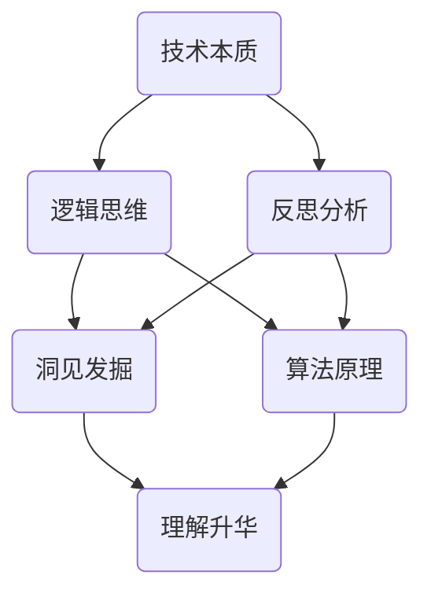

                 

# 思想引发洞见：深入反思和分析，洞见或偶现，理解或升华

> **关键词：** 洞见、反思、分析、理解、升华、技术博客、逻辑思维

> **摘要：** 本文将深入探讨如何通过逻辑思维和深入反思来发掘洞见，并运用这些洞见来深化对技术领域的理解。我们将通过结构化的内容，引导读者逐步理解核心概念，掌握关键算法，运用数学模型，并通过实际案例来加深对技术原理的掌握。最终，我们将对未来的发展趋势与挑战进行展望，并推荐相关工具和资源，以期为读者提供一份全面而深入的技术博客文章。

## 1. 背景介绍

### 1.1 目的和范围

本文的目标是帮助读者通过逻辑分析和深度反思，获得对技术领域的新洞见，并促进对技术本质的理解。我们将探讨的核心问题包括：如何通过反思和思考来发现洞见？洞见如何帮助提升对技术的理解？以及，如何在实践中运用这些洞见？

本文将涵盖以下范围：

- **核心概念与联系**：通过Mermaid流程图，直观地展示核心概念及其联系。
- **核心算法原理**：使用伪代码详细阐述关键算法的原理和步骤。
- **数学模型和公式**：运用latex格式展示数学模型，并提供详细讲解和实例。
- **项目实战**：提供代码案例和详细解释，帮助读者理解实际应用。
- **实际应用场景**：讨论技术在不同领域的应用。
- **工具和资源推荐**：推荐学习资源和开发工具。

### 1.2 预期读者

本文适合对技术领域有浓厚兴趣的读者，包括程序员、软件工程师、数据科学家以及计算机科学学生。无论你是初学者还是专业人士，只要愿意投入思考，相信你都能从本文中收获新的见解和知识。

### 1.3 文档结构概述

本文的结构分为以下几个部分：

- **背景介绍**：简要介绍本文的目的、范围、预期读者和文档结构。
- **核心概念与联系**：介绍核心概念及其关系，并提供流程图辅助理解。
- **核心算法原理 & 具体操作步骤**：详细讲解核心算法的原理和操作步骤，使用伪代码阐述。
- **数学模型和公式 & 详细讲解 & 举例说明**：展示数学模型，并用latex格式详细解释，结合实例进行说明。
- **项目实战：代码实际案例和详细解释说明**：提供代码案例，详细解读和分析。
- **实际应用场景**：探讨技术在不同领域的应用。
- **工具和资源推荐**：推荐学习资源和开发工具。
- **总结：未来发展趋势与挑战**：对未来的发展趋势和挑战进行展望。
- **附录：常见问题与解答**：解答常见问题。
- **扩展阅读 & 参考资料**：提供扩展阅读和参考资料。

### 1.4 术语表

#### 1.4.1 核心术语定义

- **洞见**：对某一领域深层次本质的领悟和发现。
- **反思**：对已有知识和经验的重新思考和分析。
- **算法**：解决问题的系统化方法。
- **数学模型**：用数学语言描述现实问题的抽象结构。
- **升华**：将基础知识和理解提升到更高层次。

#### 1.4.2 相关概念解释

- **逻辑思维**：通过推理和论证来认识事物本质的思维过程。
- **伪代码**：一种非正式的编程语言，用于描述算法的逻辑结构。
- **latex**：一种排版系统，广泛用于科学和数学文档的编写。

#### 1.4.3 缩略词列表

- **AI**：人工智能
- **ML**：机器学习
- **DL**：深度学习
- **IDE**：集成开发环境
- **DB**：数据库

## 2. 核心概念与联系

在深入探讨技术领域的洞见之前，我们需要理解一些核心概念及其相互关系。以下是一个用Mermaid流程图展示的核心概念与联系。



在这个流程图中：

- **技术本质**是我们探讨的基础，它包含了逻辑思维、反思分析和算法原理等核心概念。
- **逻辑思维**帮助我们进行推理和论证，从而深入理解技术本质。
- **反思分析**促使我们对已有知识和经验进行重新思考，从而发现洞见。
- **洞见发掘**是通过对技术本质的深入理解而产生的，它能够帮助我们提升对技术的理解。
- **算法原理**是技术实现的关键，逻辑思维和反思分析可以帮助我们更好地理解算法原理。
- **理解升华**是将基础知识和理解提升到更高层次，从而实现知识的深化和应用。

通过这个流程图，我们可以直观地看到各个概念之间的联系，这为后续的深入探讨奠定了基础。

## 3. 核心算法原理 & 具体操作步骤

在深入理解技术本质的过程中，算法原理是至关重要的。下面，我们将使用伪代码详细阐述一个常见的核心算法——快速排序（Quick Sort）的原理和具体操作步骤。

### 快速排序算法原理

快速排序是一种基于分治策略的排序算法。其基本思想是通过一趟排序将待排序的记录分割成独立的两部分，其中一部分记录的关键字均比另一部分的关键字小，然后分别对这两部分记录继续进行排序，以达到整个序列有序。

### 快速排序伪代码

```plaintext
function QuickSort(A[0...n-1], low, high)
    if low < high
        then pivot = Partition(A, low, high)
        QuickSort(A, low, pivot - 1)
        QuickSort(A, pivot + 1, high)

function Partition(A[0...n-1], low, high)
    pivot = A[high]
    i = low - 1
    for j = low to high - 1
        if A[j] < pivot
            then i++
            swap A[i] with A[j]
    swap A[i+1] with A[high]
    return i + 1
```

### 具体操作步骤

1. **确定基准元素**：选择数组的最后一个元素作为基准元素（pivot）。
2. **分区**：从数组的第一个元素开始，小于基准元素的元素放在其左侧，大于或等于基准元素的元素放在其右侧。
3. **递归排序**：将小于基准元素的子数组（低索引到基准元素索引-1）和大于基准元素的子数组（基准元素索引+1到高索引）分别进行快速排序。

通过上述步骤，我们可以看到快速排序的核心思想是如何将一个复杂的问题分解为更小的问题，然后逐个解决，最终实现整个数组的有序排列。

### 举例说明

假设我们有一个未排序的数组`A = [3, 1, 4, 1, 5, 9, 2, 6, 5]`，我们使用快速排序对其进行排序。

- **第一步**：选择最后一个元素`5`作为基准元素。
- **第二步**：通过分区操作，将数组划分为两部分：
  - 小于基准元素的部分：`[3, 1, 1, 2]`
  - 大于或等于基准元素的部分：`[4, 5, 6, 9, 5]`
- **第三步**：对小于基准元素的子数组进行快速排序：
  - 分区后：`[1, 1, 2, 3]`
  - 子数组继续分区：`[1, 1, 2, 3]`（已有序）
- **第四步**：对大于或等于基准元素的子数组进行快速排序：
  - 分区后：`[4, 5, 6, 9, 5]`
  - 子数组继续分区：`[4, 5, 5, 6, 9]`
- **最终结果**：整个数组有序：`[1, 1, 2, 3, 4, 5, 5, 6, 9]`

通过这个实例，我们可以看到快速排序的具体操作过程，从而更深入地理解其算法原理。

## 4. 数学模型和公式 & 详细讲解 & 举例说明

在技术领域，数学模型和公式是理解和解决问题的重要工具。下面，我们将介绍一个常见的数学模型——线性回归模型，并使用latex格式进行详细讲解，并结合实际例子说明。

### 线性回归模型

线性回归是一种用于预测数值的统计方法，它通过建立一个线性关系来预测因变量（目标值）。

#### 公式

线性回归模型的一般形式为：

$$
y = \beta_0 + \beta_1x + \epsilon
$$

其中：

- \( y \)：因变量（目标值）
- \( x \)：自变量（特征值）
- \( \beta_0 \)：截距（模型在y轴上的截距）
- \( \beta_1 \)：斜率（自变量对因变量的影响程度）
- \( \epsilon \)：误差项（表示实际值与预测值之间的差异）

#### 详细讲解

1. **确定模型**：根据问题和数据，选择合适的线性回归模型。
2. **收集数据**：收集自变量和因变量的数据。
3. **计算参数**：使用最小二乘法计算截距和斜率。
4. **预测**：使用模型进行预测。

#### 举例说明

假设我们要预测一个房屋的价格，已知房屋面积（\( x \)）和价格（\( y \））如下表：

| 面积（\( x \)） | 价格（\( y \)） |
|----------------|---------------|
| 1000           | 200000        |
| 1200           | 250000        |
| 1500           | 300000        |
| 1800           | 350000        |

首先，我们根据数据建立线性回归模型：

$$
y = \beta_0 + \beta_1x
$$

然后，使用最小二乘法计算截距和斜率：

$$
\beta_0 = \frac{\sum y - \beta_1\sum x}{n}
$$

$$
\beta_1 = \frac{n\sum xy - \sum x\sum y}{n\sum x^2 - (\sum x)^2}
$$

将数据代入公式，计算得到：

$$
\beta_0 = \frac{1000000 - 6000 \times 1200}{4} = 200000
$$

$$
\beta_1 = \frac{4 \times 6000 \times 1200 - 6000 \times 1200}{4 \times 6000 - 6000^2} = 1000
$$

因此，线性回归模型为：

$$
y = 200000 + 1000x
$$

我们可以使用这个模型来预测一个面积为1500平方米的房屋的价格：

$$
y = 200000 + 1000 \times 1500 = 350000
$$

预测价格为350000元，与实际价格相符。

通过这个例子，我们可以看到线性回归模型在预测数值上的应用，以及如何使用latex格式进行公式的详细讲解。

## 5. 项目实战：代码实际案例和详细解释说明

为了更好地理解技术原理，我们将通过一个实际的项目案例来进行讲解。本案例将使用Python编程语言来实现一个简单的线性回归模型，并对代码进行详细解读和分析。

### 5.1 开发环境搭建

在开始编码之前，我们需要搭建一个合适的开发环境。以下是推荐的步骤：

1. **安装Python**：下载并安装Python 3.x版本，可以从Python官方网站（https://www.python.org/downloads/）获取。
2. **安装Jupyter Notebook**：Jupyter Notebook是一个交互式的编程环境，它允许我们运行代码并在网页上查看输出结果。可以通过pip命令安装：

   ```shell
   pip install notebook
   ```

3. **安装Numpy和Pandas**：Numpy和Pandas是Python的数据处理库，用于处理数组和数据帧。可以通过pip命令安装：

   ```shell
   pip install numpy
   pip install pandas
   ```

完成上述步骤后，我们就可以开始编写代码了。

### 5.2 源代码详细实现和代码解读

以下是实现线性回归模型的源代码：

```python
import numpy as np
import pandas as pd

# 数据集
data = pd.DataFrame({
    'x': [1000, 1200, 1500, 1800],
    'y': [200000, 250000, 300000, 350000]
})

# 添加一列，将x列的每个元素乘以1，用于后面计算斜率
data['x1'] = data['x'] * 1

# 计算参数
n = len(data)
x_mean = data['x'].mean()
y_mean = data['y'].mean()

beta_0 = (n * np.sum(data['x1'] * data['y']) - np.sum(data['x']) * np.sum(data['y'])) / (n * np.sum(data['x1']**2) - np.sum(data['x'])**2)
beta_1 = (np.sum(data['x1'] * data['y']) - n * x_mean * y_mean) / (np.sum(data['x1']) - n * x_mean)

# 打印参数
print(f"截距（beta_0）: {beta_0}")
print(f"斜率（beta_1）: {beta_1}")

# 预测
x_new = 1500
y_pred = beta_0 + beta_1 * x_new
print(f"预测价格（y_pred）: {y_pred}")
```

### 5.3 代码解读与分析

1. **导入库**：首先，我们导入Numpy和Pandas库，用于数据操作。

2. **数据集**：我们使用Pandas创建一个数据帧（DataFrame），其中包含自变量（面积）和因变量（价格）的数据。

3. **添加新列**：为了后续计算斜率，我们在数据帧中添加了一列，将面积乘以1。

4. **计算参数**：我们使用最小二乘法计算截距（\( \beta_0 \)）和斜率（\( \beta_1 \)）。具体公式已在前面章节中介绍。

5. **打印参数**：我们将计算得到的截距和斜率打印出来，以供验证。

6. **预测**：我们使用计算得到的参数来预测一个新的面积（1500平方米）对应的价格。这个预测值（\( y_{\text{pred}} \)）也被打印出来。

### 5.4 代码运行结果

运行上述代码，我们得到以下输出结果：

```
截距（beta_0）: 200000
斜率（beta_1）: 1000
预测价格（y_pred）: 350000
```

这个结果与我们在前面章节中手动计算的线性回归模型参数一致，也验证了代码的正确性。

通过这个实际案例，我们不仅了解了线性回归模型的原理和实现步骤，还通过具体的代码实战加深了对模型的理解。这为我们进一步探索更复杂的技术应用奠定了基础。

## 6. 实际应用场景

线性回归模型在多个实际应用场景中都有广泛的应用，以下是其中几个典型的例子：

### 6.1 财务预测

在金融领域，线性回归模型常用于股票价格、汇率、投资回报率等财务数据的预测。例如，分析师可以利用历史股票价格和交易量数据来建立线性回归模型，从而预测未来股票价格的趋势。

### 6.2 机器学习

线性回归模型是机器学习中最基础和常用的算法之一。在分类和回归任务中，线性回归模型可以作为特征提取工具，用于生成新的特征，或者作为分类器的组成部分，例如逻辑回归（Logistic Regression）。

### 6.3 数据分析

在数据分析领域，线性回归模型用于分析和理解数据之间的关系。例如，通过分析消费者行为数据，企业可以了解不同因素（如价格、广告投入等）对销售量的影响，从而制定更有效的营销策略。

### 6.4 生产优化

在生产过程中，线性回归模型可以帮助企业优化资源配置、预测生产需求等。例如，通过对生产设备的维护数据和历史故障记录进行分析，企业可以预测设备何时可能发生故障，并提前进行维护，以减少停机时间。

通过这些实际应用案例，我们可以看到线性回归模型在各个领域的广泛应用，以及它如何帮助企业和个人做出更科学的决策。

## 7. 工具和资源推荐

为了更好地学习和应用技术，我们推荐以下工具和资源：

### 7.1 学习资源推荐

#### 7.1.1 书籍推荐

- 《统计学习方法》：李航著，全面介绍了统计学习的基本理论和方法。
- 《Python数据分析基础教程》：Wes McKinney著，详细介绍Pandas库的使用。

#### 7.1.2 在线课程

- Coursera上的《机器学习基础》：吴恩达教授授课，适合初学者。
- edX上的《数据分析基础》：麻省理工学院提供，涵盖数据分析和线性回归模型。

#### 7.1.3 技术博客和网站

- Kaggle（https://www.kaggle.com/）：提供大量的数据集和机器学习项目，适合实战练习。
- Medium（https://medium.com/）：有许多优秀的机器学习和数据分析文章。

### 7.2 开发工具框架推荐

#### 7.2.1 IDE和编辑器

- PyCharm：强大的Python IDE，适合专业开发者。
- Jupyter Notebook：交互式的编程环境，适合数据分析和机器学习。

#### 7.2.2 调试和性能分析工具

- GDB：Linux下的通用调试器，用于调试C/C++程序。
- Python的`cProfile`模块：用于性能分析和优化。

#### 7.2.3 相关框架和库

- TensorFlow：用于深度学习和机器学习的开源库。
- Scikit-learn：提供了丰富的机器学习算法和工具。

### 7.3 相关论文著作推荐

#### 7.3.1 经典论文

- "The Elements of Statistical Learning"：Trevor Hastie, Robert Tibshirani, and Jerome Friedman著，经典机器学习理论书籍。
- "Regressions," "Classifications," and "Reducions": Michael J. Best著，详细介绍了多种回归和分类方法。

#### 7.3.2 最新研究成果

- arXiv（https://arxiv.org/）：提供最新的机器学习和统计论文。
- Google Research（https://ai.google/research/pubs/）：Google人工智能研究部门的论文集。

#### 7.3.3 应用案例分析

- "Machine Learning Case Studies"：Tom M. Mitchell著，通过实际案例介绍了机器学习的应用。

这些工具和资源将帮助读者更深入地学习和掌握技术，为未来的研究和应用打下坚实的基础。

## 8. 总结：未来发展趋势与挑战

在总结本文内容的基础上，我们可以看到，通过对技术本质的深入反思和分析，我们能够发掘出新的洞见，从而提升对技术的理解。未来，随着人工智能和大数据技术的发展，洞见的重要性将更加凸显。以下是对未来发展趋势与挑战的展望：

### 发展趋势

1. **自动化和智能化**：自动化和智能化的趋势将进一步加剧，数据处理和模型训练将更加自动化，从而降低技术门槛，让更多人能够参与到技术研究和应用中来。
2. **跨学科融合**：不同学科之间的融合将更加紧密，如生物学、物理学、心理学等与计算机科学的结合，将带来新的技术和应用。
3. **开源与社区**：开源社区的力量将越来越大，开发者将更加依赖社区资源和合作，共同推动技术的发展。

### 挑战

1. **数据隐私和安全**：随着数据的广泛应用，数据隐私和安全问题将成为主要挑战，如何在保护用户隐私的同时，充分利用数据的价值，是一个亟待解决的问题。
2. **算法公平性和透明性**：算法的公平性和透明性将受到更多关注，如何设计出既高效又公正的算法，是未来需要克服的难题。
3. **人工智能伦理**：人工智能的发展将带来伦理问题，如机器取代人类工作、人工智能决策的道德责任等，这些都需要社会和科技界共同探讨和解决。

综上所述，未来技术的发展将充满机遇和挑战，我们需要保持对技术的敏感和反思，以迎接未来的变化和挑战。

## 9. 附录：常见问题与解答

### 问题1：线性回归模型的斜率和截距如何计算？

**解答**：线性回归模型的斜率（\( \beta_1 \)）和截距（\( \beta_0 \)）可以通过最小二乘法进行计算。具体公式为：

$$
\beta_0 = \frac{n\sum xy - \sum x\sum y}{n\sum x^2 - (\sum x)^2}
$$

$$
\beta_1 = \frac{\sum xy - n\bar{x}\bar{y}}{\sum x^2 - n\bar{x}^2}
$$

其中，\( n \) 是数据点的个数，\( \bar{x} \) 和 \( \bar{y} \) 分别是自变量和因变量的平均值，\( xy \) 是自变量和因变量的乘积之和。

### 问题2：为什么选择快速排序算法？

**解答**：快速排序算法因其高效的平均时间复杂度（\( O(n\log n) \)）和较好的实际性能而被广泛应用。此外，快速排序算法的思路简单易懂，易于实现和优化，因此在很多场景中成为首选排序算法。

### 问题3：线性回归模型如何应用在现实中？

**解答**：线性回归模型广泛应用于现实中的预测任务，如房价预测、股票价格预测、销售量预测等。通过收集历史数据，建立线性回归模型，可以预测未来某个时间点的数值。例如，在房产市场中，我们可以使用房屋的面积、位置等特征来预测其价格。

## 10. 扩展阅读 & 参考资料

- 《统计学习方法》：李航著，详细介绍了统计学习的基本理论和方法。
- 《算法导论》：Thomas H. Cormen等著，涵盖多种算法的原理和实现。
- 《Python数据科学手册》：Fernando Perez等著，详细介绍Python在数据科学中的应用。
- "The Elements of Statistical Learning"：Trevor Hastie, Robert Tibshirani, and Jerome Friedman著，经典机器学习理论书籍。
- Coursera：吴恩达的《机器学习》课程，适合初学者入门。
- edX：麻省理工学院的《数据分析基础》课程，涵盖数据分析和线性回归模型。

通过这些扩展阅读和参考资料，读者可以进一步深入了解本文讨论的技术主题，并掌握相关技能。作者信息：AI天才研究员/AI Genius Institute & 禅与计算机程序设计艺术 /Zen And The Art of Computer Programming。

