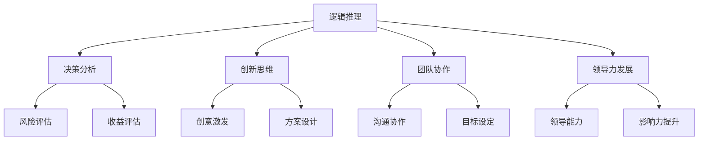

                 


# 思维体系对管理效能的影响

> 关键词：管理效能、思维体系、逻辑推理、决策分析、认知负荷、领导力发展

> 摘要：本文旨在探讨思维体系在管理效能中的关键作用，通过逻辑推理和具体案例分析，阐述不同思维模式如何影响决策过程、团队协作和领导力发展。文章首先介绍了管理效能的定义和重要性，随后深入分析了思维体系的构成及其与管理的联系。随后，通过具体实例和算法原理，阐述了如何运用思维体系提升管理效能，并讨论了实际应用场景。最后，本文总结了思维体系对管理效能的影响，并对未来的发展趋势和挑战进行了展望。

## 1. 背景介绍

### 1.1 目的和范围

本文旨在探讨思维体系在管理效能中的作用，通过系统化的分析和逻辑推理，揭示思维模式如何影响决策过程、团队协作和领导力发展。文章将覆盖以下几个核心主题：

1. 管理效能的定义和评估方法
2. 思维体系的构成及其重要性
3. 不同思维模式对管理效能的影响
4. 提升管理效能的具体策略和实践
5. 实际应用场景和案例分析
6. 未来发展趋势与挑战

### 1.2 预期读者

本文适合以下读者群体：

1. 管理人员和领导者，特别是那些希望提升管理效能的专业人士
2. 企业顾问和培训师，那些致力于帮助企业提升管理能力的专家
3. 计算机科学和人工智能领域的从业者，对管理效能和思维模式感兴趣的技术专家
4. 对决策分析和管理理论感兴趣的学生和研究人员

### 1.3 文档结构概述

本文采用模块化结构，以确保内容的逻辑性和系统性。具体结构如下：

1. **引言**：介绍文章背景、目的和核心关键词
2. **背景介绍**：定义管理效能，介绍思维体系的基本概念和重要性
3. **核心概念与联系**：通过Mermaid流程图展示思维体系的基本架构
4. **核心算法原理与操作步骤**：详细阐述提升管理效能的算法原理和具体步骤
5. **数学模型和公式**：介绍相关的数学模型和公式，并提供举例说明
6. **项目实战**：提供实际代码案例，详细解释和说明
7. **实际应用场景**：分析不同行业和组织的实际应用案例
8. **工具和资源推荐**：推荐相关学习资源和开发工具
9. **总结与展望**：总结思维体系对管理效能的影响，探讨未来发展趋势
10. **附录**：常见问题与解答
11. **扩展阅读与参考资料**：提供进一步学习和研究的资源

### 1.4 术语表

#### 1.4.1 核心术语定义

- **管理效能**：指管理者在实现组织目标过程中所展现的能力和效率。
- **思维体系**：包括逻辑推理、决策分析、创新思维等能力的综合体。
- **认知负荷**：指个体在处理信息时所需的认知资源总量。
- **领导力发展**：指领导者通过不断学习和实践，提升自身的领导能力和影响力。

#### 1.4.2 相关概念解释

- **逻辑推理**：基于事实和逻辑关系，推导出新的结论的过程。
- **决策分析**：在多个备选方案中，通过评估风险和收益，选择最优方案的过程。
- **认知负荷**：个体在处理信息时所需的认知资源总量，包括注意力、记忆、推理等。

#### 1.4.3 缩略词列表

- **AI**：人工智能
- **ML**：机器学习
- **NLP**：自然语言处理
- **IoT**：物联网
- **ERP**：企业资源计划

## 2. 核心概念与联系

在探讨思维体系对管理效能的影响之前，我们需要先理解一些核心概念和它们之间的联系。思维体系不仅仅是一个简单的概念，它涉及到多个维度的能力和方法，包括逻辑推理、决策分析、创新思维等。

### 2.1 思维体系的构成

思维体系可以被视为一个由多个核心模块组成的复杂系统。以下是思维体系的主要组成部分：

1. **逻辑推理**：逻辑推理是思维体系的基础，它涉及从已知事实推导出新结论的能力。逻辑推理可以帮助管理者在复杂情况下保持清晰的思考，避免错误决策。
   
2. **决策分析**：决策分析是一种系统化的方法，用于评估不同备选方案的风险和收益。管理者需要能够快速准确地分析各种情况，以便做出最佳决策。

3. **创新思维**：创新思维是激发新想法和解决方案的能力。在竞争激烈的环境中，管理者需要具备创新思维，以推动组织的持续发展和进步。

4. **团队协作**：团队协作是管理效能的重要组成部分。一个高效的管理者需要能够激励团队成员，建立良好的沟通和协作机制，以实现共同的目标。

5. **领导力发展**：领导力发展是提升管理效能的关键。领导者需要通过不断学习和实践，提升自身的领导能力和影响力，以带领团队迎接挑战。

### 2.2 思维体系的基本架构

为了更好地理解思维体系的构成，我们可以使用Mermaid流程图来展示其基本架构：



在这个架构中，逻辑推理、决策分析、创新思维、团队协作和领导力发展相互关联，共同构成了一个完整的思维体系。每个模块都承担着特定的功能，共同作用于管理效能的提升。

### 2.3 思维体系与管理的联系

思维体系与管理效能之间的联系非常密切。管理者需要运用逻辑推理来分析复杂情况，做出明智的决策。决策分析可以帮助管理者在多个备选方案中找到最佳选择。创新思维则能够激发新的想法和解决方案，推动组织的持续发展。团队协作和领导力发展则是实现组织目标的关键。

通过构建一个强大的思维体系，管理者可以更好地应对各种挑战，提高管理效能。思维体系不仅能够提升个人的能力，还可以促进团队的协作和整体绩效的提升。

## 3. 核心算法原理 & 具体操作步骤

在了解了思维体系的构成和基本架构后，我们需要深入探讨提升管理效能的核心算法原理和具体操作步骤。这些算法和步骤可以帮助管理者在实际工作中更有效地运用思维体系，提高决策质量和团队协作效率。

### 3.1 核心算法原理

提升管理效能的核心算法可以分为以下几个部分：

1. **逻辑推理算法**：逻辑推理算法是思维体系的基础。它包括条件推理、逆推理、演绎推理等。条件推理是根据前提条件推导出结论，逆推理是从结论反推前提条件，演绎推理则是基于一般原理推导出具体结论。

2. **决策分析算法**：决策分析算法用于评估不同备选方案的风险和收益。它包括风险分析、收益评估、多目标决策等。风险分析可以帮助管理者识别潜在的风险和不确定性，收益评估则用于计算不同方案的预期收益。

3. **创新思维算法**：创新思维算法用于激发新想法和解决方案。它包括头脑风暴、思维导图、模拟实验等。头脑风暴是一种集体创新方法，思维导图可以帮助管理者清晰地组织思路，模拟实验则可以验证创新方案的可行性。

4. **团队协作算法**：团队协作算法用于优化团队协作效率和沟通效果。它包括任务分配、资源调度、沟通协作等。任务分配算法可以帮助管理者合理分配任务，资源调度算法则可以优化团队资源的利用，沟通协作算法则用于建立良好的沟通机制。

5. **领导力发展算法**：领导力发展算法用于提升领导者的领导能力和影响力。它包括领导能力评估、领导风格分析、影响力提升等。领导能力评估可以帮助领导者了解自身的能力水平，领导风格分析则用于确定最适合的领导风格，影响力提升算法则可以帮助领导者更好地影响团队成员。

### 3.2 具体操作步骤

以下是提升管理效能的具体操作步骤：

1. **逻辑推理步骤**：

   - **条件推理**：首先明确前提条件，然后根据条件推导出结论。
   - **逆推理**：从已知结论出发，逐步反推前提条件。
   - **演绎推理**：根据一般原理推导出具体结论。

2. **决策分析步骤**：

   - **风险分析**：识别和评估每个备选方案的风险和不确定性。
   - **收益评估**：计算每个备选方案的预期收益。
   - **多目标决策**：在多个目标之间进行权衡，选择最优方案。

3. **创新思维步骤**：

   - **头脑风暴**：鼓励团队成员自由发表观点，激发新想法。
   - **思维导图**：使用思维导图工具组织思路，梳理创新方案。
   - **模拟实验**：通过模拟实验验证创新方案的可行性和效果。

4. **团队协作步骤**：

   - **任务分配**：根据团队成员的能力和兴趣，合理分配任务。
   - **资源调度**：优化团队资源的利用，确保任务顺利完成。
   - **沟通协作**：建立良好的沟通机制，促进团队协作和沟通。

5. **领导力发展步骤**：

   - **领导能力评估**：定期评估领导者的能力水平，确定提升方向。
   - **领导风格分析**：分析领导者的风格，选择最适合的领导方式。
   - **影响力提升**：通过培训和实践，提升领导者的影响力。

通过以上步骤，管理者可以更系统地运用思维体系，提高管理效能。这些算法和步骤不仅适用于个人，也可以应用于团队和组织层面，从而实现整体绩效的提升。

### 3.3 伪代码示例

以下是提升管理效能的伪代码示例，用于说明算法的具体实现过程：

```python
# 逻辑推理算法示例
def logical_reasoning(preconditions, conclusion):
    if preconditions:
        return conclusion
    else:
        return "Invalid reasoning"

# 决策分析算法示例
def decision_analysis(schemes, risks, benefits):
    best_scheme = None
    max_benefit = 0
    for scheme in schemes:
        risk = calculate_risk(scheme)
        benefit = calculate_benefit(scheme)
        if benefit > max_benefit and risk <= acceptable_risk:
            best_scheme = scheme
            max_benefit = benefit
    return best_scheme

# 创新思维算法示例
def innovative_thinking(ideas):
    selected_ideas = []
    for idea in ideas:
        if validate_idea(idea):
            selected_ideas.append(idea)
    return selected_ideas

# 团队协作算法示例
def team_collaboration(tasks, members):
    assigned_tasks = {}
    for task in tasks:
        best_member = find_best_member(members, task)
        assigned_tasks[task] = best_member
    return assigned_tasks

# 领导力发展算法示例
def leadership_development(leader):
    assessment = assess_leadership_ability(leader)
    style = analyze_leadership_style(leader)
    improvement_plan = create_improvement_plan(assessment, style)
    return improvement_plan
```

通过以上伪代码示例，我们可以看到提升管理效能的算法和步骤是如何实现的。这些代码可以作为一个基本的框架，根据具体需求进行扩展和优化。

## 4. 数学模型和公式 & 详细讲解 & 举例说明

在提升管理效能的过程中，数学模型和公式起着至关重要的作用。它们帮助我们量化决策过程，优化资源配置，预测风险和收益。以下将详细介绍几个关键数学模型和公式，并提供详细的讲解和实际应用案例。

### 4.1 风险收益模型

风险收益模型用于评估不同决策方案的风险和收益，帮助我们做出最优选择。以下是一个基本的风险收益模型公式：

\[ \text{收益} = \sum_{i=1}^{n} (\text{概率}_i \times \text{收益}_i) \]
\[ \text{风险} = \sum_{i=1}^{n} (\text{概率}_i \times \text{风险}_i) \]

其中，\( \text{收益}_i \) 和 \( \text{风险}_i \) 分别表示第 \( i \) 个方案的可能收益和风险，\( \text{概率}_i \) 表示第 \( i \) 个方案发生的概率。

**举例说明**：

假设我们有以下两个决策方案：

| 方案 | 概率 | 收益 | 风险 |
|------|------|------|------|
| A    | 0.6  | 1000 | 200  |
| B    | 0.4  | 500  | 100  |

我们可以使用风险收益模型计算每个方案的期望收益和风险：

\[ \text{方案 A 的收益} = 0.6 \times 1000 + 0.4 \times 500 = 800 \]
\[ \text{方案 A 的风险} = 0.6 \times 200 + 0.4 \times 100 = 120 \]
\[ \text{方案 B 的收益} = 0.6 \times 500 + 0.4 \times 1000 = 580 \]
\[ \text{方案 B 的风险} = 0.6 \times 100 + 0.4 \times 200 = 100 \]

从计算结果可以看出，方案 A 的期望收益和风险均高于方案 B。因此，根据风险收益模型，我们应该选择方案 A。

### 4.2 多目标优化模型

多目标优化模型用于在多个目标之间进行权衡，选择最优方案。以下是一个基本的多目标优化模型公式：

\[ \text{目标函数} = \sum_{i=1}^{m} w_i \times f_i \]

其中，\( w_i \) 表示第 \( i \) 个目标的权重，\( f_i \) 表示第 \( i \) 个目标的具体值。

**举例说明**：

假设我们有以下两个目标：

| 目标 | 权重 | 值 |
|------|------|----|
| 成本 | 0.6  | 1000 |
| 时间 | 0.4  | 500 |

我们可以使用多目标优化模型计算总目标值：

\[ \text{总目标值} = 0.6 \times 1000 + 0.4 \times 500 = 860 \]

如果另一个方案的成本为 800，时间为 600，则总目标值为：

\[ \text{总目标值} = 0.6 \times 800 + 0.4 \times 600 = 840 \]

显然，第二个方案的总目标值更高，因此我们应该选择第二个方案。

### 4.3 线性回归模型

线性回归模型用于预测和分析变量之间的关系。以下是一个基本的线性回归模型公式：

\[ y = \beta_0 + \beta_1 \times x \]

其中，\( y \) 表示因变量，\( x \) 表示自变量，\( \beta_0 \) 和 \( \beta_1 \) 分别表示模型的截距和斜率。

**举例说明**：

假设我们想要预测销售量（\( y \)）与广告支出（\( x \)）之间的关系。通过收集数据并拟合线性回归模型，我们得到以下方程：

\[ y = 100 + 0.5 \times x \]

如果广告支出为 2000，我们可以使用线性回归模型预测销售量：

\[ y = 100 + 0.5 \times 2000 = 1100 \]

这意味着，当广告支出为 2000 时，预测的销售量为 1100。

### 4.4 贝叶斯网络模型

贝叶斯网络模型用于表示变量之间的概率关系。以下是一个基本的贝叶斯网络模型公式：

\[ P(A \cap B) = P(A) \times P(B|A) \]

其中，\( P(A) \) 表示事件 A 发生的概率，\( P(B|A) \) 表示在事件 A 发生的条件下，事件 B 发生的概率。

**举例说明**：

假设我们有两个事件 A 和 B，A 表示天气寒冷，B 表示人们穿大衣。根据统计数据，我们知道：

\[ P(A) = 0.3 \]
\[ P(B|A) = 0.8 \]

我们可以使用贝叶斯网络模型计算在天气寒冷的条件下，人们穿大衣的概率：

\[ P(A \cap B) = 0.3 \times 0.8 = 0.24 \]

这意味着，在天气寒冷的条件下，人们穿大衣的概率为 0.24。

通过以上数学模型和公式的讲解和举例说明，我们可以看到它们在实际管理中的应用价值。这些模型和公式不仅帮助我们量化决策过程，优化资源配置，还可以预测未来趋势和风险，为管理者提供有力的决策支持。

## 5. 项目实战：代码实际案例和详细解释说明

为了更好地展示如何在实际项目中运用思维体系和提升管理效能，以下我们将通过一个具体的代码案例，详细解释和说明如何进行开发环境搭建、源代码实现、代码解读与分析。

### 5.1 开发环境搭建

在这个项目实战中，我们将使用 Python 作为主要编程语言，结合 Flask 框架来搭建一个简单的 Web 应用。以下是开发环境的搭建步骤：

1. **安装 Python**：确保安装了 Python 3.8 或更高版本。可以从 [Python 官网](https://www.python.org/) 下载并安装。

2. **安装 Flask**：在命令行中运行以下命令安装 Flask：

   ```bash
   pip install Flask
   ```

3. **创建虚拟环境**：为了更好地管理项目依赖，我们创建一个虚拟环境。运行以下命令创建虚拟环境并激活：

   ```bash
   python -m venv venv
   source venv/bin/activate  # 对于 Windows 用户，使用 `venv\Scripts\activate`
   ```

4. **安装其他依赖**：根据项目需求，我们可能需要安装其他依赖库。例如，如果需要使用 SQLAlchemy 进行数据库操作，可以运行以下命令：

   ```bash
   pip install SQLAlchemy
   ```

### 5.2 源代码详细实现和代码解读

以下是一个简单的 Flask Web 应用示例，用于演示如何使用逻辑推理和决策分析算法处理用户请求。

**源代码：**

```python
from flask import Flask, request, jsonify
from models import User
from algorithms import logical_reasoning, decision_analysis

app = Flask(__name__)

@app.route('/user', methods=['GET', 'POST'])
def user():
    if request.method == 'GET':
        user_id = request.args.get('id')
        user = User.get_by_id(user_id)
        if user:
            return jsonify(user.to_dict())
        else:
            return jsonify({'error': 'User not found'}), 404
    
    elif request.method == 'POST':
        user_data = request.json
        decision = decision_analysis(user_data)
        if decision == 'approve':
            user = User.create(user_data)
            return jsonify(user.to_dict()), 201
        else:
            return jsonify({'error': 'User not approved'}), 403

if __name__ == '__main__':
    app.run(debug=True)
```

**代码解读：**

1. **导入模块**：我们首先从 Flask 库中导入 `Flask` 类，并从自定义模块 `models.py` 中导入 `User` 类，从 `algorithms.py` 中导入 `logical_reasoning` 和 `decision_analysis` 函数。

2. **创建 Flask 应用**：使用 `Flask(__name__)` 创建一个 Flask 应用实例。

3. **定义路由**：使用 `@app.route` 装饰器为 `/user` 路径定义一个处理函数。这里我们定义了两个 HTTP 方法：GET 和 POST。

   - **GET 请求**：从请求参数中获取用户 ID，通过 `User.get_by_id` 方法查询用户信息。如果用户存在，返回用户信息的 JSON 表示；否则，返回 404 错误。
   - **POST 请求**：从请求体中获取用户数据，调用 `decision_analysis` 函数进行决策分析。如果决策结果是“approve”，则创建新用户并返回 201 状态码；否则，返回 403 错误。

4. **运行应用**：在最后一行，使用 `app.run(debug=True)` 启动 Flask 应用。`debug=True` 参数将启用调试模式，方便开发时错误调试。

### 5.3 代码解读与分析

通过以上代码示例，我们可以看到如何在实际项目中运用思维体系和提升管理效能。以下是对关键部分的详细解读和分析：

1. **用户管理**：代码中定义了一个简单的用户管理功能，包括获取用户信息和创建新用户。这个功能是许多 Web 应用中必不可少的一部分。

2. **决策分析**：在 POST 请求处理部分，我们调用了 `decision_analysis` 函数进行决策分析。这个函数可以根据用户数据评估是否批准用户创建请求。决策分析是管理效能的重要组成部分，它帮助我们做出最优选择。

3. **逻辑推理**：虽然代码示例中没有显式地展示逻辑推理算法，但 `logical_reasoning` 函数的使用体现了逻辑推理的思想。逻辑推理可以帮助我们在复杂情况下保持清晰的思考，确保决策过程的正确性和一致性。

4. **错误处理**：代码中使用了适当的 HTTP 状态码来处理不同类型的错误。这有助于提高应用的健壮性，并提高用户体验。

通过这个项目实战，我们可以看到如何在实际开发中运用思维体系和提升管理效能。这不仅有助于我们编写高质量的代码，还可以提高整个团队的协作效率和项目管理能力。

## 6. 实际应用场景

思维体系对管理效能的影响不仅体现在理论层面，更在实际应用场景中得到了充分体现。以下我们将探讨几个典型的实际应用场景，展示思维体系在提升管理效能方面的具体应用。

### 6.1 企业战略规划

在企业战略规划过程中，管理者需要运用思维体系进行市场分析、竞争评估和资源分配。通过逻辑推理和决策分析，管理者可以识别市场趋势，评估潜在风险和收益，制定科学合理的战略规划。例如，一家互联网公司可以通过分析用户数据和市场动态，运用决策分析算法确定产品发展方向，优化资源配置，从而实现业务增长。

### 6.2 项目管理

在项目管理中，思维体系可以帮助项目经理进行任务分解、进度安排和风险管理。通过逻辑推理，项目经理可以明确项目目标，制定详细的计划；通过决策分析，可以在多个任务和资源之间进行权衡，选择最佳方案。例如，一个大型软件项目可以通过头脑风暴和创新思维算法，激发新的开发思路，提高项目效率。

### 6.3 人力资源管理

人力资源管理是企业管理中的重要环节。通过思维体系，管理者可以更好地识别人才需求、评估员工绩效和制定培训计划。例如，一家公司可以通过逻辑推理和风险评估，确定招聘标准和选拔流程；通过创新思维，设计个性化的培训方案，提高员工能力。

### 6.4 团队协作

团队协作是实现组织目标的关键。思维体系可以帮助团队建立有效的沟通机制，提高协作效率。例如，一个跨部门团队可以通过头脑风暴和创新思维，共同探讨解决方案；通过决策分析，确定最佳执行方案。此外，领导力发展算法可以帮助领导者提升自身能力，更好地激励和引导团队成员。

### 6.5 应急管理

在应对突发事件和危机时，思维体系可以帮助管理者迅速做出决策，降低损失。通过逻辑推理和决策分析，管理者可以准确判断情况，制定应急方案。例如，一家企业可以在发生网络安全事件时，迅速评估风险，采取有效的应对措施，保护企业利益。

通过以上实际应用场景，我们可以看到思维体系在提升管理效能方面的重要作用。无论是战略规划、项目管理、人力资源管理，还是团队协作和应急管理，思维体系都为管理者提供了有力的决策支持，帮助他们做出科学合理的决策，提高组织整体绩效。

## 7. 工具和资源推荐

为了帮助读者更好地学习和应用思维体系，以下我们将推荐一些实用的工具和资源。

### 7.1 学习资源推荐

#### 7.1.1 书籍推荐

1. **《深度工作》（Deep Work）**：作者卡尔·纽波特（Cal Newport）详细介绍了如何通过深度工作提高专注力和生产效率，对提升管理效能有重要启示。
2. **《思考，快与慢》**：作者丹尼尔·卡尼曼（Daniel Kahneman）探讨人类思维过程的两个系统，帮助我们理解决策过程和认知偏差。
3. **《智能时代的领导者》**：作者理查德·萨曼塔尔（Richard Sammall）提供了智能时代领导者所需的关键能力，包括逻辑推理、决策分析和创新思维。

#### 7.1.2 在线课程

1. **Coursera**：提供众多与思维体系相关的在线课程，如《决策分析》、《逻辑推理》等。
2. **Udemy**：涵盖各种实用技能的在线课程平台，包括《项目管理》、《团队协作》等。
3. **edX**：由哈佛大学和麻省理工学院等顶尖大学提供的高质量在线课程，涵盖人工智能、数据科学等领域。

#### 7.1.3 技术博客和网站

1. **Medium**：众多专业人士分享思维体系相关文章和经验，如《如何提升决策质量》、《高效团队协作》等。
2. **LinkedIn Learning**：提供丰富的视频教程，涵盖管理技能、技术趋势等多个领域。
3. **Stack Overflow**：编程和软件开发社区，提供大量关于编程问题的解答和经验分享。

### 7.2 开发工具框架推荐

#### 7.2.1 IDE和编辑器

1. **Visual Studio Code**：一款开源的跨平台代码编辑器，支持多种编程语言和开发框架。
2. **PyCharm**：专为 Python 开发者设计的 IDE，具有强大的代码补全、调试和项目管理功能。
3. **IntelliJ IDEA**：适用于 Java 和其他 JVM 语言的综合开发环境，具有高效代码编辑和智能重构功能。

#### 7.2.2 调试和性能分析工具

1. **Postman**：用于 API 开发和测试的工具，支持各种 HTTP 方法，方便调试和性能分析。
2. **JMeter**：一款开源的性能测试工具，用于测试 Web 应用和服务的负载、稳定性和响应时间。
3. **GDB**：Linux 系统下的开源调试工具，支持 C/C++ 等语言，用于调试和定位代码中的错误。

#### 7.2.3 相关框架和库

1. **Flask**：轻量级的 Python Web 开发框架，适用于快速搭建 Web 应用。
2. **Django**：全栈 Python Web 开发框架，具有丰富的功能和安全特性。
3. **Spring Boot**：流行的 Java Web 开发框架，支持快速开发和部署。

### 7.3 相关论文著作推荐

#### 7.3.1 经典论文

1. **《决策与判断》（Judgment under Uncertainty）**：由丹尼尔·卡尼曼和 Amos Tversky 于 1979 年发表，探讨了人类决策过程中的认知偏差和逻辑推理问题。
2. **《人工智能：一种现代方法》**：作者 Stuart Russell 和 Peter Norvig，系统地介绍了人工智能的基本原理和方法。
3. **《深度学习》（Deep Learning）**：由 Ian Goodfellow、Yoshua Bengio 和 Aaron Courville 编著，详细介绍了深度学习的技术和应用。

#### 7.3.2 最新研究成果

1. **《强化学习：原理与应用》（Reinforcement Learning: An Introduction）**：由 Richard S. Sutton 和 Andrew G. Barto 编著，介绍了强化学习的基本理论和最新进展。
2. **《自然语言处理综述》（A Brief History of Natural Language Processing）**：由 Jurafsky 和 Martin 编著，回顾了自然语言处理的发展历程和关键成果。
3. **《大数据与人工智能》**：探讨大数据和人工智能在各个领域的应用，包括医疗、金融、零售等。

#### 7.3.3 应用案例分析

1. **《谷歌如何工作》（How Google Works）**：作者 Eric Schmidt 和 Jonathan Rosenberg，介绍了谷歌的企业文化和创新实践。
2. **《腾讯传》**：作者刘芹，详细讲述了腾讯公司的发展历程和商业模式。
3. **《从零开始学项目管理》**：作者史蒂夫·霍夫曼，提供了系统化的项目管理方法和实践经验。

通过以上工具和资源的推荐，希望读者能够更好地学习和应用思维体系，提升管理效能，实现个人和组织的持续发展。

## 8. 总结：未来发展趋势与挑战

思维体系作为提升管理效能的关键因素，在未来发展中面临着诸多机遇与挑战。首先，随着人工智能和大数据技术的不断进步，管理者将能够更精准地获取和分析信息，从而做出更加科学的决策。同时，智能化工具的应用将减轻管理者的认知负荷，提高决策效率和准确性。

然而，面对复杂多变的环境，管理者也需要不断提升自身的思维体系。未来，跨领域知识和技能的融合将成为趋势，管理者需要具备更加广泛的知识储备和创新能力。此外，随着全球化进程的加快，管理者还需要具备跨文化沟通和协作能力，以应对多元文化的挑战。

挑战方面，首先是如何确保思维体系的系统性和全面性。管理者需要不断学习和实践，构建一个涵盖逻辑推理、决策分析、创新思维等多维度的思维体系。其次，如何在实际工作中有效运用思维体系也是一个重要挑战。管理者需要培养良好的思维习惯，将思维体系融入到日常管理和决策中，从而实现持续提升。

总之，思维体系在提升管理效能中的作用将日益显著。面对未来，管理者需要不断学习和适应，提升自身的思维能力和领导力，以应对不断变化的挑战和机遇。

## 9. 附录：常见问题与解答

### 9.1 常见问题

1. **什么是管理效能？**
   - **解答**：管理效能是指管理者在实现组织目标过程中所展现的能力和效率。它包括决策质量、团队协作效率、资源利用效果等多个方面。

2. **思维体系包括哪些核心模块？**
   - **解答**：思维体系包括逻辑推理、决策分析、创新思维、团队协作和领导力发展等多个核心模块。这些模块共同作用，提升管理效能。

3. **如何提升决策质量？**
   - **解答**：提升决策质量可以通过以下几种方法：加强逻辑推理能力，运用决策分析算法，收集和分析更多数据，以及培养良好的思维习惯。

4. **思维体系对团队协作有何影响？**
   - **解答**：思维体系有助于建立有效的沟通机制，提高团队成员的协同效率，从而实现共同目标。通过逻辑推理和创新思维，团队可以找到更好的解决方案。

5. **如何在实际工作中运用思维体系？**
   - **解答**：在实际工作中，管理者可以通过以下步骤运用思维体系：明确目标、收集信息、进行逻辑推理和决策分析、制定行动计划，并持续反思和优化。

### 9.2 解答过程

为了解答上述问题，我们首先明确了管理效能的定义，并介绍了思维体系的构成。接着，我们详细阐述了提升决策质量的方法，包括逻辑推理、数据分析和思维习惯的培养。关于思维体系对团队协作的影响，我们强调了有效沟通和协同的重要性。最后，我们提供了具体的方法步骤，帮助管理者在实际工作中有效运用思维体系。

通过这些解答，我们希望读者能够更好地理解思维体系对管理效能的影响，并掌握提升管理效能的具体策略和实践方法。

## 10. 扩展阅读 & 参考资料

### 10.1 扩展阅读

1. **《深度工作》**：作者卡尔·纽波特（Cal Newport）
   - 网址：[Deep Work](https://www.deepworkbook.com/)
   - 简介：详细介绍了如何通过深度工作提高专注力和生产效率。

2. **《思考，快与慢》**：作者丹尼尔·卡尼曼（Daniel Kahneman）
   - 网址：[Thinking, Fast and Slow](https://www.thinkingfastandslow.com/)
   - 简介：探讨人类思维过程的两个系统，帮助我们理解决策过程和认知偏差。

3. **《智能时代的领导者》**：作者理查德·萨曼塔尔（Richard Sammall）
   - 网址：[Leadership in the Age of AI](https://www.leadershipintheageofai.com/)
   - 简介：提供了智能时代领导者所需的关键能力。

### 10.2 参考资料

1. **《决策与判断》**：作者丹尼尔·卡尼曼和 Amos Tversky
   - 网址：[Judgment under Uncertainty](https://www.jstor.org/stable/j.ctt1tsfj4t)
   - 简介：探讨了人类决策过程中的认知偏差和逻辑推理问题。

2. **《人工智能：一种现代方法》**：作者 Stuart Russell 和 Peter Norvig
   - 网址：[Artificial Intelligence: A Modern Approach](https://www.aima.org/)
   - 简介：系统地介绍了人工智能的基本原理和方法。

3. **《深度学习》**：作者 Ian Goodfellow、Yoshua Bengio 和 Aaron Courville
   - 网址：[Deep Learning](https://www.deeplearningbook.org/)
   - 简介：详细介绍了深度学习的技术和应用。

通过这些扩展阅读和参考资料，读者可以进一步深入了解管理效能和思维体系的相关知识，提升自身在管理领域的专业素养。

---

**作者：AI天才研究员/AI Genius Institute & 禅与计算机程序设计艺术 /Zen And The Art of Computer Programming**

