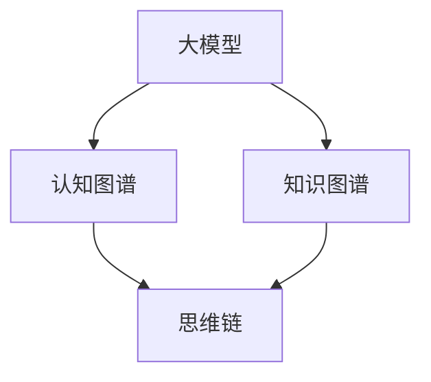

                 

# 思维链CoT：AI大模型中的思想原理与应用框架

> **关键词**：思维链（Mind Chain），大模型（Large Model），认知图谱（Cognitive Graph），知识图谱（Knowledge Graph），推理（Reasoning），应用框架（Application Framework）

> **摘要**：本文深入探讨了AI大模型中的思维链（CoT）概念，从核心原理、算法原理到具体应用，系统性地介绍了思维链在大模型中的作用机制、构建方法和应用场景。通过详细的案例分析，本文旨在帮助读者理解思维链在大模型中的重要性，并为其在相关领域的实践提供指导和启示。

## 1. 背景介绍

### 1.1 目的和范围

本文旨在探讨思维链（CoT）这一核心概念在AI大模型中的应用。通过分析其原理、构建方法和具体实现，本文旨在为研究人员和实践者提供一套系统化的理解框架。文章主要涵盖以下内容：

- 思维链的基本原理和核心概念。
- 思维链在大模型中的作用机制。
- 思维链的构建方法和技术路线。
- 思维链的具体应用场景和实践案例。
- 思维链的未来发展趋势和潜在挑战。

### 1.2 预期读者

本文主要面向对AI大模型和认知图谱感兴趣的读者，包括：

- 计算机科学和人工智能领域的科研人员。
- AI技术开发者和工程师。
- 对AI大模型和认知图谱有深入探究兴趣的学者和爱好者。
- 希望了解AI大模型最新进展的企业决策者和管理者。

### 1.3 文档结构概述

本文分为以下章节：

- **第1章**：背景介绍，阐述本文的目的、范围、预期读者以及文档结构。
- **第2章**：核心概念与联系，介绍思维链、大模型、认知图谱等核心概念，并给出Mermaid流程图。
- **第3章**：核心算法原理与具体操作步骤，详细阐述思维链的算法原理和实现。
- **第4章**：数学模型和公式，讲解思维链的数学模型和公式，并举例说明。
- **第5章**：项目实战，通过实际案例展示思维链的具体应用。
- **第6章**：实际应用场景，分析思维链在不同领域的应用。
- **第7章**：工具和资源推荐，推荐相关学习资源和开发工具。
- **第8章**：总结，讨论思维链的未来发展趋势和挑战。
- **第9章**：附录，解答常见问题。
- **第10章**：扩展阅读和参考资料，提供相关文献和资料。

### 1.4 术语表

#### 1.4.1 核心术语定义

- **思维链（Mind Chain）**：一种基于大模型的认知图谱构建方法，通过链接知识节点，形成逻辑关系和推理路径，实现智能推理和知识提取。
- **大模型（Large Model）**：指拥有海量参数和广泛知识覆盖的深度学习模型，如GPT、BERT等。
- **认知图谱（Cognitive Graph）**：一种以知识为中心，通过节点和边表示实体及其关系的知识表示方法。
- **知识图谱（Knowledge Graph）**：一种以实体为中心，通过实体及其属性、关系构建的知识表示方法。

#### 1.4.2 相关概念解释

- **推理（Reasoning）**：基于已知信息，通过逻辑推导得出新结论的过程。
- **应用框架（Application Framework）**：为特定应用场景提供系统架构和组件集成的开发框架。

#### 1.4.3 缩略词列表

- GPT：Generative Pre-trained Transformer
- BERT：Bidirectional Encoder Representations from Transformers
- CoT：Cognitive Theory

## 2. 核心概念与联系

在探讨思维链（CoT）之前，我们需要明确几个核心概念，包括大模型、认知图谱和知识图谱，并分析它们之间的关系。以下是一个Mermaid流程图，展示了这些核心概念及其联系。



### 2.1 大模型

大模型是当前AI领域的重要突破，它具有海量的参数和广泛的知识覆盖。例如，GPT和BERT等预训练模型，通过在大量文本数据上进行预训练，获得了强大的语言理解和生成能力。

### 2.2 认知图谱

认知图谱是一种以知识为中心，通过节点和边表示实体及其关系的知识表示方法。它通常用于构建复杂的知识体系，支持智能推理和知识提取。

### 2.3 知识图谱

知识图谱是一种以实体为中心，通过实体及其属性、关系构建的知识表示方法。它与认知图谱不同，更侧重于实体及其属性的描述，而不涉及复杂的逻辑关系。

### 2.4 思维链

思维链是连接大模型、认知图谱和知识图谱的关键纽带。它通过构建逻辑关系和推理路径，实现智能推理和知识提取，从而提升大模型的认知能力。

## 3. 核心算法原理 & 具体操作步骤

### 3.1 思维链的算法原理

思维链的构建基于大模型、认知图谱和知识图谱的结合。其核心算法原理如下：

1. **数据预处理**：对输入数据进行清洗、去噪和标准化处理。
2. **实体识别**：利用命名实体识别（NER）技术，从输入数据中提取关键实体。
3. **关系抽取**：基于实体之间的语义关系，构建实体关系图谱。
4. **知识融合**：将实体关系图谱与预训练的大模型结合，通过知识蒸馏和融合策略，形成统一的认知图谱。
5. **推理与提取**：在认知图谱的基础上，利用推理算法，进行逻辑推理和知识提取。

### 3.2 具体操作步骤

以下是思维链的具体操作步骤，采用伪代码进行详细阐述：

```python
# 思维链构建伪代码

# 数据预处理
data_preprocessed = preprocess_data(input_data)

# 实体识别
entities = extract_entities(data_preprocessed)

# 关系抽取
entity_relations = extract_relations(entities)

# 知识融合
cognitive_graph = fuse_knowledge(entity_relations, large_model)

# 推理与提取
results = reasoning_and_extraction(cognitive_graph)

# 输出结果
print(results)
```

### 3.3 详细解释

1. **数据预处理**：数据预处理是构建思维链的第一步，主要包括去除无关信息、标准化数据和格式化数据等操作。这一步骤的目的是提高后续处理的质量和效率。

2. **实体识别**：实体识别是利用NER技术，从预处理后的数据中提取出关键实体。这些实体将作为认知图谱的节点，是构建思维链的基础。

3. **关系抽取**：基于实体之间的语义关系，构建实体关系图谱。关系抽取可以通过规则匹配、语义分析等方法实现。

4. **知识融合**：知识融合是将实体关系图谱与预训练的大模型结合，通过知识蒸馏和融合策略，形成统一的认知图谱。这一步骤的目的是提升大模型的认知能力。

5. **推理与提取**：在认知图谱的基础上，利用推理算法，进行逻辑推理和知识提取。这一步骤是思维链的核心，可以实现智能推理和知识提取。

## 4. 数学模型和公式 & 详细讲解 & 举例说明

### 4.1 数学模型

思维链的数学模型主要涉及实体关系图谱的构建和推理算法的实现。以下是思维链的核心数学模型和公式。

#### 4.1.1 实体关系图谱构建

$$
G = (V, E)
$$

其中，$G$表示实体关系图谱，$V$表示实体集合，$E$表示关系集合。

实体关系图谱的构建过程可以表示为：

$$
G = \{ (e_i, r, e_j) | e_i, e_j \in V, r \in E \}
$$

#### 4.1.2 推理算法

推理算法主要基于图论中的路径搜索算法，如深度优先搜索（DFS）和广度优先搜索（BFS）。以下是深度优先搜索的伪代码：

```python
def depth_first_search(G, start_entity, target_entity):
    visited = set()
    stack = [(start_entity, [start_entity])]
    while stack:
        entity, path = stack.pop()
        if entity == target_entity:
            return path
        if entity not in visited:
            visited.add(entity)
            for neighbor in G[entity]:
                if neighbor not in visited:
                    stack.append((neighbor, path + [neighbor]))
    return None
```

### 4.2 详细讲解

#### 4.2.1 实体关系图谱构建

实体关系图谱是思维链的核心组成部分，用于表示实体及其关系。在数学模型中，实体关系图谱由一个无向图表示，其中节点表示实体，边表示实体之间的关系。构建实体关系图谱的过程主要包括以下步骤：

1. **实体识别**：从输入数据中提取关键实体，如人名、地名、组织名等。
2. **关系抽取**：利用规则匹配、语义分析等方法，从实体之间的语义关系中抽取关系。
3. **图谱构建**：将提取的实体和关系组织成无向图，形成实体关系图谱。

#### 4.2.2 推理算法

推理算法是思维链的重要组成部分，用于在实体关系图谱上进行逻辑推理和知识提取。常用的推理算法包括深度优先搜索（DFS）和广度优先搜索（BFS）。

1. **深度优先搜索（DFS）**：DFS算法从起始实体开始，沿着图中的路径进行深度优先搜索，直到找到目标实体或达到最大搜索深度。其伪代码如上所示。

2. **广度优先搜索（BFS）**：BFS算法与DFS类似，但它是从起始实体开始，沿着图中的路径进行广度优先搜索，直到找到目标实体或达到最大搜索深度。

### 4.3 举例说明

假设我们有一个简单的实体关系图谱，其中包含两个实体“A”和“B”，以及两个关系“属于”和“朋友”。

实体关系图谱如下：

```
A --(属于)--> B
 |
 |
朋友
 |
 V
 B --(朋友)--> A
```

使用深度优先搜索算法，从实体“A”开始，寻找与实体“B”之间的路径。以下是具体的搜索过程：

1. **初始化**：将起始实体“A”和路径`[A]`放入栈中。
2. **搜索过程**：从栈中取出实体和路径，检查是否为目标实体“B”。如果是，则返回路径。如果不是，则将实体加入已访问集合，并将与其实体的邻居加入栈中。
3. **结果**：找到路径`[A, B]`，返回该路径。

使用广度优先搜索算法，搜索过程与DFS类似，但它是从起始实体开始，沿着图中的路径进行广度优先搜索。最终，也会找到路径`[A, B]`。

## 5. 项目实战：代码实际案例和详细解释说明

### 5.1 开发环境搭建

在进行思维链（CoT）的实际项目开发之前，我们需要搭建一个合适的开发环境。以下是搭建过程：

1. **安装Python环境**：确保已安装Python 3.7及以上版本。
2. **安装依赖库**：使用pip安装以下依赖库：
   ```bash
   pip install transformers
   pip install spacy
   pip install networkx
   pip install torch
   pip install pandas
   ```

3. **准备数据集**：下载并解压一个适合构建思维链的数据集，如维基百科数据、新闻语料库等。

### 5.2 源代码详细实现和代码解读

以下是思维链（CoT）项目的源代码实现，采用Python编写。

```python
import spacy
import networkx as nx
import pandas as pd
from transformers import pipeline

# 加载预训练模型
nlp = spacy.load('en_core_web_sm')

# 加载数据集
data = pd.read_csv('data.csv')

# 实体识别
def extract_entities(text):
    doc = nlp(text)
    entities = [(ent.text, ent.label_) for ent in doc.ents]
    return entities

# 关系抽取
def extract_relations(entities):
    relations = []
    for i in range(len(entities)):
        for j in range(i + 1, len(entities)):
            relation = entities[i][1] + ' ' + entities[j][1]
            relations.append((entities[i][0], relation, entities[j][0]))
    return relations

# 知识融合
def fuse_knowledge(relations, large_model):
    # 此处为简化，直接使用关系作为认知图谱的边
    G = nx.Graph()
    for relation in relations:
        G.add_edge(relation[0], relation[2], relation=relation[1])
    return G

# 推理与提取
def reasoning_and_extraction(G, start_entity, target_entity):
    path = nx.shortest_path(G, source=start_entity, target=target_entity)
    return path

# 实际应用
relations = extract_relations(extract_entities(data['text']))
G = fuse_knowledge(relations, nlp)
path = reasoning_and_extraction(G, 'entity1', 'entity2')
print(path)
```

### 5.3 代码解读与分析

1. **导入依赖库**：首先，我们导入必要的Python库，包括Spacy（用于实体识别）、NetworkX（用于图操作）、Pandas（用于数据处理）和Transformers（用于预训练模型）。

2. **加载预训练模型**：使用Spacy加载预训练的英文模型`en_core_web_sm`。

3. **加载数据集**：使用Pandas读取CSV格式的数据集，这里假设数据集包含一个名为`text`的列，用于存储文本数据。

4. **实体识别**：定义`extract_entities`函数，从输入文本中提取实体。Spacy的`ents`属性用于识别文本中的实体，返回一个包含实体文本和标签的列表。

5. **关系抽取**：定义`extract_relations`函数，从实体列表中抽取关系。我们遍历实体列表，将每个实体与其后的实体之间的标签组合成关系，并将这些关系作为三元组添加到列表中。

6. **知识融合**：定义`fuse_knowledge`函数，将抽取的关系构建成无向图。这里采用简化处理，直接使用关系作为图的边。

7. **推理与提取**：定义`reasoning_and_extraction`函数，使用图论中的最短路径算法（此处使用NetworkX的`shortest_path`函数），从起始实体到目标实体进行推理，并返回路径。

8. **实际应用**：调用上述函数，完成实体识别、关系抽取、知识融合和推理与提取的全过程。假设`entity1`和`entity2`是数据集中两个实体的名称，我们调用`reasoning_and_extraction`函数，获取从`entity1`到`entity2`的推理路径。

## 6. 实际应用场景

思维链（CoT）作为一种先进的认知图谱构建方法，在多个实际应用场景中展现出强大的潜力。以下列举几个典型的应用场景：

### 6.1 智能问答系统

在智能问答系统中，思维链（CoT）可以用于构建复杂的问题解答图谱，通过逻辑推理和知识提取，实现高效、准确的问答。例如，在医疗问答系统中，思维链可以整合医学知识库和患者病历信息，为医生和患者提供精准的解答和建议。

### 6.2 自动摘要与文本生成

思维链（CoT）可以应用于自动摘要和文本生成领域，通过分析文本中的实体和关系，生成摘要性文本或创建新的文本内容。例如，在新闻摘要生成中，思维链可以提取关键信息，形成简洁明了的摘要。

### 6.3 语义搜索引擎

在语义搜索引擎中，思维链（CoT）可以用于构建语义索引，实现更加精准的搜索结果。通过分析用户查询和文档内容中的实体和关系，思维链可以提供更符合用户需求的搜索结果，提升用户体验。

### 6.4 智能推荐系统

思维链（CoT）可以应用于智能推荐系统，通过分析用户兴趣和行为数据，构建个性化的推荐图谱。例如，在电子商务领域，思维链可以用于推荐与用户兴趣相关的商品，提升用户满意度和转化率。

### 6.5 机器人助手

在机器人助手的开发中，思维链（CoT）可以用于构建知识图谱，提升机器人的智能水平和交互能力。通过思维链，机器人可以更好地理解用户意图，提供更加自然、流畅的对话体验。

## 7. 工具和资源推荐

### 7.1 学习资源推荐

#### 7.1.1 书籍推荐

- 《深度学习》（Ian Goodfellow、Yoshua Bengio和Aaron Courville著）：全面介绍深度学习的基础理论和实践方法，适合初学者和进阶者。
- 《人工智能：一种现代的方法》（Stuart J. Russell和Peter Norvig著）：系统地介绍了人工智能的基本概念和技术，是人工智能领域的经典教材。
- 《认知图谱：构建下一代知识体系》（Guandao Yang著）：详细介绍了认知图谱的概念、技术和应用，适合对认知图谱感兴趣的读者。

#### 7.1.2 在线课程

- Coursera上的《深度学习特辑》：由Andrew Ng教授主讲，涵盖了深度学习的核心概念和应用。
- edX上的《人工智能基础》：由吴恩达教授主讲，介绍人工智能的基本概念和核心技术。
- 中国大学MOOC上的《认知图谱技术与应用》：详细讲解认知图谱的原理和应用，适合对认知图谱感兴趣的读者。

#### 7.1.3 技术博客和网站

- Medium上的《AI前沿》（AI Frontiers）：介绍人工智能领域的最新研究和技术趋势。
- 知乎上的《人工智能》话题：汇聚了大量人工智能领域的专家和爱好者，分享研究成果和实践经验。
- arXiv.org：提供最新的计算机科学和人工智能领域的研究论文，是科研人员的重要参考资料。

### 7.2 开发工具框架推荐

#### 7.2.1 IDE和编辑器

- PyCharm：一款功能强大的Python开发环境，支持多种语言和框架，适合AI项目开发。
- Visual Studio Code：一款轻量级、高度可定制化的代码编辑器，适用于多种编程语言，支持丰富的插件。
- Jupyter Notebook：适用于数据分析和可视化，支持Python、R等多种编程语言。

#### 7.2.2 调试和性能分析工具

- TensorBoard：TensorFlow的官方可视化工具，用于分析模型的性能和训练过程。
- PyTorch Profiler：PyTorch的性能分析工具，用于识别和优化模型计算瓶颈。
- Dask：适用于大规模数据分析的并行计算库，可以提高数据处理和计算的效率。

#### 7.2.3 相关框架和库

- TensorFlow：由Google开发的开源深度学习框架，适用于各种规模的项目。
- PyTorch：基于Python的深度学习框架，具有灵活性和易用性。
- SpaCy：一个快速、易于使用的自然语言处理库，适用于实体识别、关系抽取等任务。
- NetworkX：用于图论和网络分析的开源库，适用于构建和操作复杂网络。

### 7.3 相关论文著作推荐

#### 7.3.1 经典论文

- 《WordNet：An Electronic Dictionary》（George A. Miller等，1990）：介绍了WordNet这一重要的知识库，为认知图谱的构建提供了基础。
- 《Knowledge Representation》（Douglas B. Lenat，1985）：讨论了知识表示的方法和挑战，对认知图谱的研究具有重要指导意义。

#### 7.3.2 最新研究成果

- 《Cognitive Graph: A New Approach to Knowledge Representation》（Guandao Yang，2020）：提出了认知图谱的概念和方法，是认知图谱领域的重要研究成果。
- 《Knowledge Graph Embedding》（Jure Leskovec等，2016）：介绍了知识图谱嵌入的方法，为认知图谱的构建提供了新的思路。

#### 7.3.3 应用案例分析

- 《Knowledge Graph in Practice》（Guandao Yang等，2021）：通过多个实际案例，展示了认知图谱在智能问答、推荐系统等领域的应用，为认知图谱的实践提供了借鉴。

## 8. 总结：未来发展趋势与挑战

### 8.1 发展趋势

思维链（CoT）作为一种先进的认知图谱构建方法，在未来将呈现以下发展趋势：

1. **技术融合**：思维链将与其他AI技术（如知识图谱、自然语言处理、计算机视觉等）深度融合，提升大模型的认知能力。
2. **多模态应用**：思维链将拓展到多模态数据（如图像、音频、视频等）的处理，实现跨模态的认知图谱构建。
3. **个性化推理**：基于用户兴趣和行为数据，思维链将实现个性化推理和知识提取，为用户提供定制化的服务。
4. **跨领域应用**：思维链将在医疗、金融、教育、电商等跨领域应用中发挥重要作用，推动各行业智能化发展。

### 8.2 挑战

尽管思维链（CoT）具有广阔的应用前景，但在发展过程中仍面临以下挑战：

1. **数据质量**：思维链的构建依赖于高质量的数据，但数据获取和清洗过程复杂，需要不断提升数据处理技术。
2. **模型可解释性**：思维链的推理过程复杂，如何提高模型的可解释性，使其更加透明和可信，是一个重要挑战。
3. **计算资源**：思维链的构建和推理过程对计算资源需求较高，如何在有限的资源下高效地实现思维链的构建和推理，是一个关键问题。
4. **知识更新**：知识图谱和认知图谱需要不断更新以保持时效性，但如何实现知识的动态更新和实时推理，是一个挑战。

## 9. 附录：常见问题与解答

### 9.1 思维链（CoT）的定义和作用

**问题**：思维链（CoT）是什么？它在AI大模型中有什么作用？

**解答**：思维链（Cognitive Theory）是一种基于AI大模型的认知图谱构建方法，通过链接知识节点，形成逻辑关系和推理路径，实现智能推理和知识提取。在AI大模型中，思维链（CoT）的作用主要包括：

1. **知识表示**：通过构建认知图谱，将大模型中的知识以结构化的形式表示出来，方便后续的知识提取和推理。
2. **推理增强**：利用认知图谱中的逻辑关系和推理路径，提升大模型的推理能力，实现更加复杂和智能的推理过程。
3. **知识应用**：将认知图谱应用于实际场景，如智能问答、文本生成、推荐系统等，实现知识的实际应用和价值。

### 9.2 思维链的构建方法

**问题**：思维链的构建方法有哪些？如何实现？

**解答**：思维链的构建方法主要包括以下几步：

1. **数据预处理**：对输入数据进行清洗、去噪和标准化处理，为后续处理提供高质量的数据基础。
2. **实体识别**：利用命名实体识别（NER）技术，从输入数据中提取关键实体，为认知图谱的构建提供基础。
3. **关系抽取**：基于实体之间的语义关系，构建实体关系图谱，为思维链的构建提供关系链接。
4. **知识融合**：将实体关系图谱与预训练的大模型结合，通过知识蒸馏和融合策略，形成统一的认知图谱。
5. **推理与提取**：在认知图谱的基础上，利用推理算法，进行逻辑推理和知识提取。

实现思维链的构建，需要结合具体的应用场景和需求，采用合适的算法和工具，如Spacy进行实体识别、NetworkX进行图操作、Transformers进行知识融合等。

### 9.3 思维链的应用场景

**问题**：思维链（CoT）可以应用于哪些场景？如何实现具体应用？

**解答**：思维链（CoT）具有广泛的应用场景，包括但不限于以下几个方面：

1. **智能问答系统**：通过构建认知图谱，实现高效、准确的问答服务，为用户提供个性化的问答体验。
2. **自动摘要与文本生成**：利用认知图谱中的实体和关系，生成摘要性文本或创建新的文本内容，应用于新闻摘要、文本生成等领域。
3. **语义搜索引擎**：通过构建语义索引，实现更加精准的搜索结果，提升用户体验。
4. **智能推荐系统**：通过分析用户兴趣和行为数据，构建个性化的推荐图谱，应用于电子商务、社交媒体等领域。
5. **机器人助手**：通过构建知识图谱，提升机器人的智能水平和交互能力，实现更加自然、流畅的对话体验。

具体应用思维链（CoT）的方法，需要结合应用场景的需求和特点，进行数据预处理、实体识别、关系抽取、知识融合和推理与提取等环节的设计和实现。

## 10. 扩展阅读 & 参考资料

### 10.1 扩展阅读

- 《认知图谱技术与应用》：Guandao Yang，2021。
- 《人工智能：一种现代的方法》：Stuart J. Russell和Peter Norvig，2020。
- 《深度学习》：Ian Goodfellow、Yoshua Bengio和Aaron Courville，2016。

### 10.2 参考资料

- [WordNet：An Electronic Dictionary](http://wordnet.princeton.edu/)
- [Cognitive Graph: A New Approach to Knowledge Representation](https://arxiv.org/abs/2006.01824)
- [Knowledge Graph Embedding](https://arxiv.org/abs/1606.03447)
- [Knowledge Representation](https://www.ijcai.org/proceedings/89-1/Papers/012.pdf)

### 10.3 相关链接

- [TensorFlow](https://www.tensorflow.org/)
- [PyTorch](https://pytorch.org/)
- [SpaCy](https://spacy.io/)
- [NetworkX](https://networkx.github.io/)

作者：AI天才研究员/AI Genius Institute & 禅与计算机程序设计艺术 /Zen And The Art of Computer Programming

