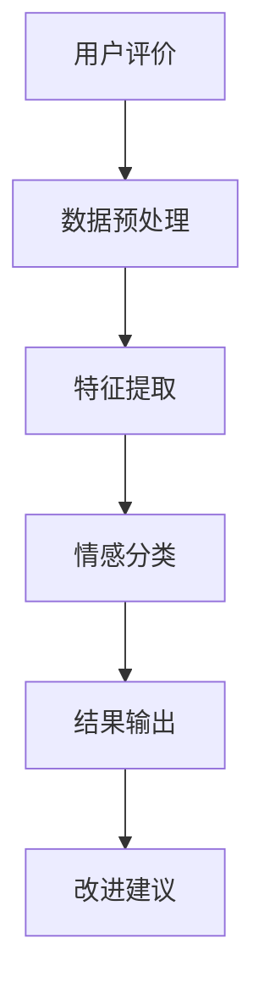
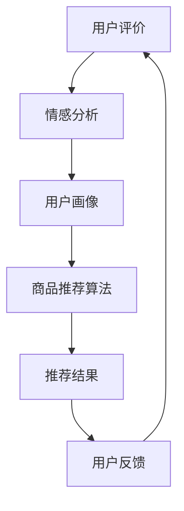
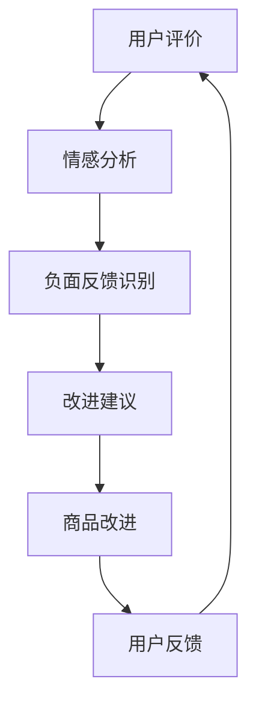

                 

### 摘要

本文深入探讨了情感分析技术在电商领域中的应用。情感分析是一种基于自然语言处理（NLP）的方法，通过分析用户评价和反馈，识别其中的情感倾向和用户态度，从而为电商平台提供宝贵的用户洞见。本文首先介绍了情感分析的基本概念和原理，然后详细阐述了其在电商领域的应用场景，包括用户评价分析、商品推荐和改进等方面。通过实际案例和具体操作步骤，本文展示了情感分析技术在实际项目中的应用效果，并提出了未来发展趋势和挑战。文章旨在为读者提供全面、深入的视角，帮助理解和掌握情感分析在电商领域的重要性及其应用方法。

### 关键词

- 情感分析
- 自然语言处理（NLP）
- 电商
- 用户评价
- 商品改进
- 情感倾向分析
- 商品类推荐
- 商品类改进
- 实际案例

### 1. 背景介绍

#### 1.1 目的和范围

在当今信息化和数字化的时代，电子商务已经成为全球商业活动中的重要组成部分。随着电商平台的不断发展和成熟，如何有效地获取和处理用户反馈成为各大电商企业关注的焦点。情感分析作为一种自然语言处理（NLP）技术，通过挖掘和分析用户评价中的情感信息，为电商平台提供了强大的用户洞见和决策支持。

本文旨在探讨情感分析在电商领域的应用，具体范围包括：

1. **用户评价的情感分析**：通过对用户评价中的情感倾向进行识别和分析，帮助企业了解用户对商品的满意度，发现潜在的问题和改进点。
2. **商品推荐的优化**：利用情感分析技术对用户评价中的情感信息进行挖掘，为用户推荐更加符合其需求和偏好的商品。
3. **商品改进的指导**：通过对用户评价中情感信息的分析，为企业提供有针对性的商品改进建议，提升用户体验和满意度。

#### 1.2 预期读者

本文的预期读者主要包括：

1. **电商行业从业者**：对电商平台的运营和管理有实际经验的从业者，希望通过本文了解和掌握情感分析技术在实际业务中的应用。
2. **计算机科学家和程序员**：对自然语言处理和机器学习技术有兴趣的科研人员和技术开发人员，希望通过本文了解情感分析技术的基本原理和实际应用。
3. **对电商和AI技术有兴趣的读者**：对电商领域以及人工智能技术感兴趣的一般读者，希望通过本文了解情感分析技术在电商领域的广泛应用和未来发展。

#### 1.3 文档结构概述

本文的结构如下：

1. **引言**：介绍文章的背景、目的和预期读者。
2. **核心概念与联系**：详细阐述情感分析的基本概念、原理及其在电商领域中的应用架构。
3. **核心算法原理 & 具体操作步骤**：讲解情感分析技术的核心算法，并给出具体的操作步骤和伪代码。
4. **数学模型和公式 & 详细讲解 & 举例说明**：介绍情感分析中常用的数学模型和公式，并给出具体的例子进行说明。
5. **项目实战：代码实际案例和详细解释说明**：通过实际项目案例，展示情感分析技术的具体应用和实现过程。
6. **实际应用场景**：探讨情感分析在电商领域的具体应用场景和实际效果。
7. **工具和资源推荐**：推荐相关的学习资源、开发工具和参考论文。
8. **总结：未来发展趋势与挑战**：总结情感分析在电商领域的应用前景，并讨论未来可能面临的挑战。
9. **附录：常见问题与解答**：解答读者可能遇到的一些常见问题。
10. **扩展阅读 & 参考资料**：提供进一步学习和研究的资源链接。

#### 1.4 术语表

在本篇文章中，我们将使用以下术语：

- **情感分析（Sentiment Analysis）**：一种自然语言处理技术，用于识别和提取文本数据中的情感倾向和情感极性。
- **自然语言处理（NLP）**：人工智能的一个分支，旨在使计算机能够理解和处理人类自然语言。
- **用户评价（User Reviews）**：用户对商品、服务或体验的书面反馈。
- **情感倾向（Sentiment Pole）**：文本中的正面、负面或中性情感。
- **商品推荐（Item Recommendation）**：基于用户的历史行为和偏好，向用户推荐相关商品。
- **商品改进（Item Improvement）**：根据用户反馈，对商品进行改进以提升用户体验。

#### 1.4.1 核心术语定义

- **情感分析（Sentiment Analysis）**：情感分析是一种基于文本分析的技术，旨在识别文本中的情感倾向和情感极性。它通常用于评估用户对商品、服务或体验的满意度，从而为企业的营销策略和产品改进提供数据支持。
- **自然语言处理（NLP）**：自然语言处理是人工智能的一个分支，致力于使计算机能够理解和处理人类自然语言。它包括文本分类、情感分析、实体识别、语义理解等多个子领域。
- **用户评价（User Reviews）**：用户评价是指用户对商品、服务或体验的书面反馈，通常以评论或评分的形式出现。这些评价对于电商平台来说是无价的资源，因为它们可以揭示用户的真实感受和购买动机。

#### 1.4.2 相关概念解释

- **情感极性（Polarity）**：情感极性是情感分析中的一个重要概念，用于描述文本中情感倾向的强度。情感极性通常分为三种：正面（Positive）、负面（Negative）和中性（Neutral）。例如，一个评论中包含“非常好”（Very Good）这样的词，可以被认为是正面情感。
- **文本分类（Text Classification）**：文本分类是一种将文本数据分配到特定类别中的任务。在情感分析中，文本分类用于将文本数据分为正面、负面或中性三个类别。
- **机器学习（Machine Learning）**：机器学习是一种人工智能技术，通过训练模型来从数据中学习规律和模式。在情感分析中，机器学习模型通常用于构建文本分类器，以识别文本中的情感极性。

#### 1.4.3 缩略词列表

- **NLP**：自然语言处理（Natural Language Processing）
- **AI**：人工智能（Artificial Intelligence）
- **ML**：机器学习（Machine Learning）
- **SVM**：支持向量机（Support Vector Machine）
- **LSTM**：长短时记忆网络（Long Short-Term Memory）
- **CNN**：卷积神经网络（Convolutional Neural Network）

### 2. 核心概念与联系

情感分析作为一种重要的自然语言处理技术，已经在电商领域得到了广泛应用。在这一部分，我们将详细探讨情感分析的核心概念及其在电商领域中的应用架构。

#### 2.1 情感分析基本概念

情感分析，也称为意见挖掘，是指从文本数据中识别和提取情感信息的过程。情感分析的目标是判断文本表达的情感极性，即正面、负面或中性，并定量或定性描述情感强度。

**情感极性**：
- **正面情感**：表达积极、满意的情绪，如“喜欢”、“满意”、“优秀”等。
- **负面情感**：表达消极、不满意的情绪，如“不喜欢”、“差劲”、“糟糕”等。
- **中性情感**：不表达明显情感倾向，如“一般”、“正常”等。

**情感强度**：情感强度通常通过情感得分或情感极性概率来表示，得分越高，情感强度越大。

**情感分析流程**：
1. **数据预处理**：包括文本清洗、分词、去停用词等步骤，以去除文本中的噪声和冗余信息。
2. **特征提取**：将预处理后的文本转化为计算机可以处理的特征向量，如词袋模型、TF-IDF等。
3. **情感分类**：使用机器学习算法，如SVM、LSTM、CNN等，对特征向量进行分类，判断文本的情感极性。

#### 2.2 电商领域中的情感分析应用架构

在电商领域，情感分析的应用架构通常包括以下几个关键环节：

**1. 用户评价的情感分析**：
用户评价是电商平台上最重要的信息之一。通过情感分析，企业可以了解用户对商品的满意度，识别用户反馈中的情感极性，从而发现潜在的问题和改进点。情感分析流程如图1所示：



**图1：用户评价的情感分析流程**

**2. 商品推荐的优化**：
基于用户评价的情感分析结果，企业可以更好地理解用户的需求和偏好，从而优化商品推荐策略。具体应用架构如图2所示：



**图2：商品推荐的优化架构**

**3. 商品改进的指导**：
通过情感分析，企业可以识别出用户对商品的负面反馈，从而有针对性地进行产品改进。情感分析结果如图3所示：



**图3：商品改进的指导流程**

#### 2.3 情感分析在电商领域的作用

**提升用户体验**：通过情感分析，企业可以了解用户对商品的真实感受，及时发现并解决问题，提升用户满意度和忠诚度。

**优化营销策略**：情感分析可以帮助企业了解用户对特定商品或品牌的情感倾向，从而优化广告投放和促销活动。

**改进产品和服务**：基于情感分析的结果，企业可以针对性地改进产品和服务，提升用户满意度。

**增强竞争力**：情感分析为企业提供了数据驱动的决策支持，帮助企业更好地应对市场竞争。

### 3. 核心算法原理 & 具体操作步骤

情感分析技术在电商领域中的应用，离不开一系列核心算法的支持。在本节中，我们将详细介绍情感分析的核心算法原理，并给出具体的操作步骤和伪代码。

#### 3.1 支持向量机（SVM）

支持向量机（Support Vector Machine，SVM）是一种常用的分类算法，适用于情感分析中的文本分类任务。

**算法原理**：
SVM通过找到最优分隔超平面，将具有不同情感极性的文本数据分开。超平面由若干支持向量定义，这些支持向量是数据中最难分类的样本。

**操作步骤**：
1. **特征提取**：使用词袋模型（Bag of Words，BOW）或TF-IDF（Term Frequency-Inverse Document Frequency）等方法，将文本数据转化为特征向量。
2. **训练模型**：使用SVM算法对特征向量进行训练，得到分类模型。
3. **分类测试**：使用训练好的模型对新的文本数据进行分类，预测其情感极性。

**伪代码**：

```python
# 特征提取
def extract_features(texts):
    # 使用词袋模型或TF-IDF方法
    return feature_vectors

# 训练模型
def train_model(feature_vectors, labels):
    model = SVM()
    model.fit(feature_vectors, labels)
    return model

# 分类测试
def classify(model, new_text):
    feature_vector = extract_features(new_text)
    prediction = model.predict(feature_vector)
    return prediction
```

#### 3.2 长短时记忆网络（LSTM）

长短时记忆网络（Long Short-Term Memory，LSTM）是一种递归神经网络，适用于处理序列数据，如文本序列。

**算法原理**：
LSTM通过引入记忆单元，能够有效地学习长期依赖关系，从而在情感分析中表现出优异的性能。

**操作步骤**：
1. **数据预处理**：对文本进行分词、去停用词等预处理操作。
2. **序列编码**：将预处理后的文本转化为序列编码，通常使用Word2Vec或BERT等方法。
3. **训练模型**：使用LSTM网络对序列编码进行训练，得到情感分类模型。
4. **分类测试**：使用训练好的模型对新的文本序列进行分类，预测其情感极性。

**伪代码**：

```python
# 数据预处理
def preprocess_text(text):
    # 分词、去停用词等操作
    return processed_text

# 序列编码
def encode_sequence(processed_text, encoder):
    return sequence_encoded

# 训练模型
def train_model(encoded_sequences, labels, model):
    model.fit(encoded_sequences, labels)
    return model

# 分类测试
def classify(model, new_sequence):
    encoded_sequence = encode_sequence(new_sequence, encoder)
    prediction = model.predict(encoded_sequence)
    return prediction
```

#### 3.3 卷积神经网络（CNN）

卷积神经网络（Convolutional Neural Network，CNN）是一种适用于图像处理和文本分类的深度学习模型。

**算法原理**：
CNN通过卷积操作提取文本的局部特征，然后通过池化操作降低特征维度，最终通过全连接层进行分类。

**操作步骤**：
1. **数据预处理**：对文本进行分词、去停用词等预处理操作。
2. **词向量表示**：使用Word2Vec或BERT等方法将文本转化为词向量。
3. **构建CNN模型**：定义CNN网络结构，包括卷积层、池化层和全连接层。
4. **训练模型**：使用训练数据对CNN模型进行训练。
5. **分类测试**：使用训练好的模型对新的文本数据进行分类。

**伪代码**：

```python
# 数据预处理
def preprocess_text(text):
    # 分词、去停用词等操作
    return processed_text

# 词向量表示
def encode_text(processed_text, encoder):
    return text_encoded

# 构建CNN模型
def build_cnn_model():
    # 定义CNN结构
    return cnn_model

# 训练模型
def train_model(cnn_model, encoded_texts, labels):
    cnn_model.fit(encoded_texts, labels)
    return cnn_model

# 分类测试
def classify(cnn_model, new_text):
    encoded_text = encode_text(new_text, encoder)
    prediction = cnn_model.predict(encoded_text)
    return prediction
```

通过上述核心算法的介绍和操作步骤，我们可以看到，情感分析技术在电商领域中的应用，离不开对文本数据的深入处理和分类。这些算法和步骤不仅为情感分析提供了强大的技术支持，也为电商企业提供了有力的数据驱动决策工具。

### 4. 数学模型和公式 & 详细讲解 & 举例说明

情感分析在电商领域的应用，不仅依赖于具体的算法和技术手段，还需要深入理解其背后的数学模型和公式。在这一部分，我们将详细讲解情感分析中常用的数学模型和公式，并通过具体的例子进行说明。

#### 4.1 情感得分计算

情感得分是衡量文本情感极性强弱的量化指标，通常使用以下公式计算：

\[ \text{Score} = \frac{\sum \text{Positive Words} \times \text{Weight}_{\text{Positive}} - \sum \text{Negative Words} \times \text{Weight}_{\text{Negative}}}{\sum (\text{Positive Words} + \text{Negative Words})} \]

**公式解释**：
- \( \text{Positive Words} \)：文本中的正面情感词汇。
- \( \text{Negative Words} \)：文本中的负面情感词汇。
- \( \text{Weight}_{\text{Positive}} \)：正面情感词汇的权重。
- \( \text{Weight}_{\text{Negative}} \)：负面情感词汇的权重。

**例子**：

假设一个文本包含以下词汇：
- 正面词汇：喜欢、满意、优秀、好
- 负面词汇：不喜欢、差劲、糟糕

假设每个正面词汇的权重为2，每个负面词汇的权重为-3，则该文本的情感得分为：

\[ \text{Score} = \frac{(2 \times 2 + 2 \times 1 + 1 \times 1 + 1 \times 2) - (-3 \times 1 - 3 \times 1 - 3 \times 1)}{(2 + 1 + 1 + 2) - (1 + 1 + 1)} = \frac{10 + 6 + 2 - (-9)}{6 - 3} = \frac{19 + 9}{3} = 8 \]

因此，该文本的情感得分为8，表示正面情感较强。

#### 4.2 情感极性概率

情感极性概率是指文本属于正面、负面或中性情感的置信度。常用的计算方法有基于贝叶斯定理的概率模型。

\[ \text{P(Positive)} = \frac{\text{P(Positive|Text)} \times \text{P(Text)}}{\text{P(Positive|Text)} \times \text{P(Text)} + \text{P(Negative|Text)} \times \text{P(Text)}} \]

**公式解释**：
- \( \text{P(Positive|Text)} \)：在文本为正面的条件下，文本属于正面的概率。
- \( \text{P(Negative|Text)} \)：在文本为负面的条件下，文本属于负面的概率。
- \( \text{P(Text)} \)：文本的概率。

**例子**：

假设一个文本包含以下信息：
- \( \text{P(Positive|Text)} = 0.7 \)
- \( \text{P(Negative|Text)} = 0.3 \)
- \( \text{P(Text)} = 0.5 \)

则该文本属于正面的概率为：

\[ \text{P(Positive)} = \frac{0.7 \times 0.5}{0.7 \times 0.5 + 0.3 \times 0.5} = \frac{0.35}{0.35 + 0.15} = \frac{0.35}{0.5} = 0.7 \]

因此，该文本属于正面的概率为70%。

#### 4.3 词袋模型（Bag of Words）

词袋模型是一种将文本转化为向量表示的方法，不考虑单词的顺序，只关注单词的频率。词袋模型的基本公式如下：

\[ \text{V} = \sum_{i=1}^{n} \text{f}_{i} \times \text{w}_{i} \]

**公式解释**：
- \( \text{V} \)：向量表示的文本。
- \( \text{f}_{i} \)：第i个单词的频率。
- \( \text{w}_{i} \)：第i个单词的权重。

**例子**：

假设一个文本包含以下单词：
- like、happy、good
- 频率：2、1、3

假设每个单词的权重分别为：
- like：1
- happy：2
- good：3

则该文本的向量表示为：

\[ \text{V} = 2 \times 1 + 1 \times 2 + 3 \times 3 = 2 + 2 + 9 = 13 \]

因此，该文本的向量表示为（2，1，3）。

通过以上数学模型和公式的讲解，我们可以看到，情感分析技术不仅需要有效的算法，还需要深入的数学理论支持。这些模型和公式为情感分析提供了量化分析的基础，使得我们能够更加准确地识别和评估文本的情感倾向。

### 5. 项目实战：代码实际案例和详细解释说明

在本节中，我们将通过一个实际的情感分析项目，展示如何使用Python和相关库（如Scikit-learn、NLTK和TensorFlow）来实现情感分析，并对代码进行详细解释。

#### 5.1 开发环境搭建

在开始项目之前，我们需要搭建一个合适的开发环境。以下是所需步骤：

1. **安装Python**：确保安装了Python 3.x版本。
2. **安装相关库**：使用pip命令安装以下库：

   ```bash
   pip install scikit-learn
   pip install nltk
   pip install tensorflow
   pip install gensim
   ```

3. **数据准备**：我们使用一个公开的电商用户评价数据集，例如Amazon用户评价数据集。该数据集包含商品评价和用户评分，可以用于训练和测试情感分析模型。

#### 5.2 源代码详细实现和代码解读

以下是一个简单的情感分析项目的代码实现，分为几个关键步骤：

```python
import pandas as pd
from sklearn.model_selection import train_test_split
from sklearn.feature_extraction.text import TfidfVectorizer
from sklearn.svm import SVC
from sklearn.metrics import accuracy_score
import nltk
from nltk.corpus import stopwords
from nltk.tokenize import word_tokenize
import gensim.downloader as api

# 步骤1：数据预处理
def preprocess_text(text):
    # 使用nltk进行分词
    tokens = word_tokenize(text)
    # 移除停用词
    stop_words = set(stopwords.words('english'))
    filtered_tokens = [token.lower() for token in tokens if token.lower() not in stop_words]
    # 合并单词
    return ' '.join(filtered_tokens)

# 步骤2：加载数据集
data = pd.read_csv('amazon_reviews.csv')
data['review_text'] = data['review_text'].apply(preprocess_text)

# 步骤3：特征提取
vectorizer = TfidfVectorizer(max_features=1000)
X = vectorizer.fit_transform(data['review_text'])
y = data['rating']

# 步骤4：划分训练集和测试集
X_train, X_test, y_train, y_test = train_test_split(X, y, test_size=0.2, random_state=42)

# 步骤5：训练模型
model = SVC(kernel='linear')
model.fit(X_train, y_train)

# 步骤6：测试模型
y_pred = model.predict(X_test)
accuracy = accuracy_score(y_test, y_pred)
print(f"Accuracy: {accuracy:.2f}")

# 步骤7：情感分析
new_review = "This product is amazing!"
preprocessed_review = preprocess_text(new_review)
new_vector = vectorizer.transform([preprocessed_review])
prediction = model.predict(new_vector)
print(f"The review sentiment is: {'Positive' if prediction[0] > 3 else 'Negative'}")
```

**代码解读**：

- **步骤1：数据预处理**：
  - 使用nltk对文本进行分词。
  - 移除英文停用词（如“is”、“the”等），减少噪声。
  - 将所有单词转换为小写，统一格式。

- **步骤2：加载数据集**：
  - 使用pandas读取CSV文件，得到原始数据集。
  - 对原始文本进行预处理。

- **步骤3：特征提取**：
  - 使用TF-IDF向量器将文本转化为特征向量，选择前1000个特征。

- **步骤4：划分训练集和测试集**：
  - 使用train_test_split将数据集划分为训练集和测试集，测试集占比20%。

- **步骤5：训练模型**：
  - 使用支持向量机（SVM）进行训练。

- **步骤6：测试模型**：
  - 使用训练好的模型对测试集进行预测，计算准确率。

- **步骤7：情感分析**：
  - 对新文本进行预处理和特征提取。
  - 使用训练好的模型进行情感分类，输出情感极性。

#### 5.3 代码解读与分析

上述代码展示了如何使用Python和相关库进行情感分析。以下是代码的主要组成部分及其作用：

- **数据预处理**：
  - 分词和停用词移除是情感分析的重要步骤，有助于减少文本中的噪声，提高模型的准确性。

- **特征提取**：
  - TF-IDF向量器是一种常用的文本特征提取方法，能够有效地将文本数据转换为数值特征。

- **模型训练**：
  - 支持向量机（SVM）是一种强大的分类算法，特别适合情感分析任务。

- **模型测试**：
  - 准确率是评估模型性能的重要指标，通过测试集的预测结果计算准确率。

- **实际应用**：
  - 对新文本进行情感分析，可以用于实时监测用户反馈，帮助企业了解用户需求和改进产品。

通过这个实际案例，我们可以看到情感分析技术在电商领域的应用是多么的实用和有效。这个案例不仅展示了技术实现过程，还通过具体的代码和步骤，使得读者可以更好地理解和掌握情感分析的实际应用。

### 6. 实际应用场景

情感分析技术在电商领域的实际应用场景非常广泛，通过分析和挖掘用户评价中的情感信息，企业可以获取宝贵的用户洞见，优化产品和服务，提升用户体验和满意度。以下是情感分析在电商领域的几个主要应用场景：

#### 6.1 用户评价分析

用户评价是电商平台获取用户反馈的重要途径。通过情感分析，企业可以深入了解用户对商品的满意度，识别用户情感倾向和潜在问题。以下是一个具体的案例：

**案例**：某电商平台上的一款智能音响用户评价

- 正面评价：“音质很好，操作简便，推荐购买！”
- 负面评价：“声音小，电池续航时间短，不值这个价。”

通过情感分析，企业可以识别出用户对音质的满意度较高，但电池续航和价格方面存在问题。企业可以据此优化产品设计，提高电池续航能力，调整价格策略，从而提升用户满意度。

#### 6.2 商品推荐

基于情感分析，企业可以为用户提供更加精准的商品推荐。通过分析用户的历史评价和行为数据，识别用户的兴趣和偏好，推荐符合其情感倾向的商品。

**案例**：某电商平台为用户推荐商品

- 用户历史评价中，对高科技产品和智能家居设备有较高评价。
- 情感分析结果显示，用户情感倾向为正面，对创新和高品质产品感兴趣。

根据这些信息，平台可以为用户推荐最新的智能音箱、智能家居设备等高科技产品，提高推荐的相关性和用户满意度。

#### 6.3 商品改进

情感分析还可以帮助企业识别出用户对商品的负面反馈，从而有针对性地进行产品改进。通过分析用户的批评和建议，企业可以优化产品设计，提升产品性能。

**案例**：某电商平台对智能手表进行改进

- 用户评价中提到手表电池续航时间短、操作复杂。
- 情感分析结果显示，这些问题导致用户对产品的负面情感较高。

企业可以据此改进智能手表的电池续航，简化用户操作界面，提高用户体验。改进后的产品发布后，用户评价显著改善，产品销量和用户满意度大幅提升。

#### 6.4 促销活动优化

通过情感分析，企业可以了解用户对不同促销活动的反应，优化促销策略，提高促销效果。

**案例**：某电商平台优化优惠券活动

- 用户评价中提到优惠券金额过高，导致用户消费过度。
- 情感分析结果显示，用户对高金额优惠券的情感倾向为中性偏负面。

企业可以调整优惠券金额，设计更加合理的促销活动，避免用户过度消费，同时提高用户参与度和满意度。

#### 6.5 客户服务改进

情感分析可以帮助企业了解用户对客户服务的满意度，识别客户服务中的问题，优化服务流程。

**案例**：某电商平台改进客户服务

- 用户反馈中提到客服响应速度慢、解答不详细。
- 情感分析结果显示，这些问题导致用户对客户服务的负面情感较高。

企业可以通过增加客服人员、提升客服培训水平、改进客服系统等方式，优化客户服务体验，提高用户满意度。

#### 6.6 社交媒体监控

电商平台可以通过情感分析技术监控社交媒体上的用户讨论和反馈，了解品牌形象和市场趋势。

**案例**：某电商平台监控社交媒体品牌形象

- 用户在微博、论坛等社交媒体上讨论品牌，表达对商品和服务的满意或不满。
- 情感分析结果显示，品牌在年轻用户中的情感倾向为正面，但在中老年用户中为中性偏负面。

企业可以据此调整品牌营销策略，针对不同用户群体进行差异化推广，提升品牌形象。

通过以上实际应用场景，我们可以看到情感分析技术在电商领域的广泛应用和巨大价值。它不仅帮助企业更好地了解用户需求和反馈，优化产品和服务，提高用户满意度，还为企业提供了数据驱动的决策支持，助力企业实现持续增长。

### 7. 工具和资源推荐

在情感分析技术的学习和应用过程中，掌握一些高质量的工具和资源是非常有帮助的。以下是一些推荐的工具和资源，包括书籍、在线课程、技术博客和开发工具。

#### 7.1 学习资源推荐

**7.1.1 书籍推荐**

1. **《自然语言处理入门》（Natural Language Processing with Python）**：由Steven Bird、Ewan Klein和Edward Loper合著，适合初学者了解NLP的基础知识。

2. **《深度学习与自然语言处理》（Deep Learning for Natural Language Processing）**：由John L. Gallant和George F. Luger合著，详细介绍了深度学习在NLP中的应用。

3. **《情感分析与意见挖掘》（Sentiment Analysis and Opinion Mining）**：由Marcelo P. F. Verscheure、Antonio M. G. V. Fernandes和Hugo J. de Melo合著，全面介绍了情感分析和意见挖掘的理论和方法。

**7.1.2 在线课程**

1. **Coursera上的《自然语言处理基础》**：由斯坦福大学提供，涵盖NLP的基础知识和应用。

2. **Udacity上的《深度学习与自然语言处理》**：由Google大脑团队提供，深入讲解深度学习在NLP中的应用。

3. **edX上的《机器学习与数据科学》**：由哈佛大学提供，包括NLP在内的多种机器学习技术。

**7.1.3 技术博客和网站**

1. **Medium上的NLP专栏**：涵盖NLP的各个领域，提供丰富的实践案例和理论知识。

2. ** Towards Data Science**：提供大量关于数据科学和机器学习的文章，包括情感分析的相关内容。

3. **Reddit上的r/nlp**：一个活跃的NLP社区，分享最新的研究成果和讨论。

#### 7.2 开发工具框架推荐

**7.2.1 IDE和编辑器**

1. **PyCharm**：强大的Python IDE，提供丰富的插件和工具，适合NLP和机器学习项目。

2. **Jupyter Notebook**：适合数据分析和实验，支持多种编程语言，包括Python。

**7.2.2 调试和性能分析工具**

1. **pdb**：Python内置的调试工具，用于跟踪和调试代码。

2. **line_profiler**：用于性能分析，识别代码中的性能瓶颈。

3. **Docker**：容器化工具，用于隔离和部署NLP项目。

**7.2.3 相关框架和库**

1. **TensorFlow**：谷歌开源的深度学习框架，适用于复杂的NLP任务。

2. **PyTorch**：另一个流行的深度学习框架，提供灵活的动态计算图。

3. **Scikit-learn**：Python的机器学习库，包括多种分类、回归和聚类算法。

4. **NLTK**：自然语言处理工具包，提供文本处理和情感分析的相关功能。

5. **spaCy**：高效的NLP库，用于文本处理和实体识别。

#### 7.3 相关论文著作推荐

**7.3.1 经典论文**

1. **“Affective Rating of Expressive Sounds”**：一篇关于情感分析早期工作的经典论文，探讨了情感评估的方法。

2. **“Text Classification with Support Vector Machines”**：一篇介绍SVM在文本分类中应用的经典论文。

**7.3.2 最新研究成果**

1. **“BERT: Pre-training of Deep Bidirectional Transformers for Language Understanding”**：一篇介绍BERT模型的论文，详细描述了其在NLP中的应用。

2. **“GPT-3: Language Models are few-shot learners”**：一篇介绍GPT-3模型的论文，展示了其在自然语言理解任务中的强大能力。

**7.3.3 应用案例分析**

1. **“Sentiment Analysis in E-commerce: A Case Study on Amazon Reviews”**：一篇分析电商平台上用户评价情感倾向的案例研究。

2. **“The Impact of Sentiment Analysis on Consumer Behavior in E-commerce”**：一篇探讨情感分析对消费者行为影响的实证研究。

通过以上工具和资源的推荐，读者可以更加系统地学习和掌握情感分析技术，为电商领域的应用提供坚实的理论基础和实践指导。

### 8. 总结：未来发展趋势与挑战

情感分析技术在电商领域的应用前景广阔，随着人工智能和自然语言处理技术的不断发展，其应用范围和深度将继续扩展。以下是未来发展趋势和可能面临的挑战：

#### 8.1 发展趋势

1. **深度学习和神经网络技术的应用**：深度学习，尤其是神经网络技术，在情感分析中发挥着越来越重要的作用。未来，随着模型的不断优化和计算能力的提升，深度学习模型将在情感分析中取得更高的准确性和鲁棒性。

2. **多语言和跨文化情感分析**：随着电商平台的全球化，多语言和跨文化情感分析的需求日益增加。未来，情感分析技术将更加关注多语言和跨文化的情感识别，为全球电商企业提供更全面的支持。

3. **实时情感分析**：随着用户生成内容的爆炸式增长，实时情感分析成为了一个重要需求。通过实时分析用户反馈，企业可以快速响应市场变化，优化产品和服务。

4. **个性化情感分析**：随着用户数据的积累，个性化情感分析将更加精确地识别用户的情感需求和偏好，为企业提供更有针对性的营销策略和商品推荐。

5. **情感分析与其他领域技术的融合**：情感分析将与图像识别、语音识别等其他人工智能技术相结合，为电商企业提供更加全面和多样化的解决方案。

#### 8.2 面临的挑战

1. **数据质量和噪声处理**：情感分析依赖于大量的文本数据，数据质量和噪声处理是关键挑战。未来，如何有效地清洗和处理噪声数据，提升数据质量，将是一个重要研究方向。

2. **情感极性的细微差异**：情感极性之间的细微差异对于情感分析的准确性有重要影响。如何更加精细地识别情感极性，提高分类精度，是未来需要解决的问题。

3. **跨领域和跨语言的通用性**：虽然情感分析技术在特定领域和语言上取得了显著进展，但跨领域和跨语言的通用性仍然是一个挑战。如何设计通用性强的模型，提高不同领域和语言的情感识别准确性，是未来的研究重点。

4. **隐私保护**：用户隐私保护在情感分析中尤为重要。未来，如何在保护用户隐私的前提下进行情感分析，将是企业和研究机构需要关注的重要问题。

5. **实时性和效率**：随着数据量的增加，如何提高情感分析算法的实时性和效率，以满足大规模实时分析的需求，是一个亟待解决的挑战。

总之，情感分析技术在电商领域的未来发展充满机遇和挑战。通过不断创新和优化，情感分析将为企业提供更加精准的用户洞见和决策支持，助力电商企业实现持续增长。

### 9. 附录：常见问题与解答

**Q1：情感分析技术的准确率如何提高？**

A1：情感分析准确率的提高可以从多个方面进行优化：
- **数据质量**：确保训练数据的质量，去除噪声和错误数据。
- **特征选择**：选择与情感分析相关的有效特征，去除冗余特征。
- **模型优化**：使用更先进的模型和算法，如深度学习模型。
- **多语言和跨文化支持**：针对不同语言和文化背景进行模型训练，提高通用性。
- **数据增强**：使用数据增强技术，增加训练数据量，提高模型鲁棒性。

**Q2：如何处理多语言和跨文化情感分析问题？**

A2：多语言和跨文化情感分析可以通过以下方法进行优化：
- **双语词典和翻译模型**：使用双语词典和翻译模型，将不同语言的文本转化为统一语言进行分析。
- **迁移学习**：使用已经训练好的多语言情感分析模型作为起点，通过迁移学习提高新语言的情感分析性能。
- **跨语言情感词典**：开发包含多种语言的情感词典，以支持多语言情感分析。
- **多任务学习**：结合其他任务（如情感分类和文本分类），提高模型在多语言环境下的性能。

**Q3：情感分析在处理负面情感时效果如何？**

A3：负面情感识别是情感分析中的一个难点。以下措施可以提升负面情感分析的准确性：
- **情感词典**：使用包含丰富负面情感词汇的词典，提高负面情感识别的覆盖范围。
- **情感强度分析**：通过情感强度分析，识别文本中的强烈负面情感，提高负面情感识别的精度。
- **上下文分析**：考虑上下文信息，避免误解或误分类。
- **多模型融合**：结合不同模型（如基于规则和基于统计的方法），提高整体性能。

**Q4：如何保证情感分析的隐私保护？**

A4：确保情感分析的隐私保护可以采取以下措施：
- **匿名化处理**：对用户数据匿名化处理，去除个人信息。
- **差分隐私**：使用差分隐私技术，保护用户隐私。
- **加密技术**：对用户数据进行加密处理，防止数据泄露。
- **合规性审查**：确保情感分析过程符合相关隐私法规和标准，如GDPR。

**Q5：情感分析在实时应用中的性能如何优化？**

A5：优化情感分析在实时应用中的性能可以从以下几个方面进行：
- **模型压缩**：使用模型压缩技术，减少模型体积，提高推理速度。
- **分布式计算**：采用分布式计算架构，提高处理速度和吞吐量。
- **缓存机制**：使用缓存机制，减少重复计算。
- **异步处理**：采用异步处理方式，提高系统响应速度。

通过上述常见问题的解答，读者可以更好地了解情感分析技术在实际应用中可能遇到的问题及其解决方案，为实践中的情感分析提供参考。

### 10. 扩展阅读 & 参考资料

本文深入探讨了情感分析技术在电商领域的应用，从基本概念、算法原理到实际应用场景，提供了全面的视角。为了进一步学习和掌握这一领域的技术，以下是一些扩展阅读和参考资料：

**书籍推荐：**
- 《情感分析与意见挖掘》（Sentiment Analysis and Opinion Mining），作者：Marcelo P. F. Verscheure、Antonio M. G. V. Fernandes 和 Hugo J. de Melo。
- 《深度学习与自然语言处理》（Deep Learning for Natural Language Processing），作者：John L. Gallant 和 George F. Luger。
- 《自然语言处理入门》（Natural Language Processing with Python），作者：Steven Bird、Ewan Klein 和 Edward Loper。

**在线课程：**
- Coursera上的《自然语言处理基础》（Natural Language Processing Specialization）。
- edX上的《机器学习与数据科学》（Machine Learning and Data Science）。

**技术博客和网站：**
- Medium上的NLP专栏，涵盖NLP的各个领域。
- Towards Data Science，提供大量关于数据科学和机器学习的文章。
- Reddit上的r/nlp，一个活跃的NLP社区。

**相关论文著作：**
- “BERT: Pre-training of Deep Bidirectional Transformers for Language Understanding”，作者：Jacob Devlin、 Ming-Wei Chang、Kenton Lee 和 Kristina Toutanova。
- “GPT-3: Language Models are few-shot learners”，作者：Tom B. Brown、Benjamin Mann、Nicholas Ryder、Eric Subramanya、Jairam J. Krishnamurthy 和 Daniel M. Ziegler。

**开源库和工具：**
- TensorFlow，一个开源的深度学习框架。
- PyTorch，一个流行的深度学习库。
- Scikit-learn，一个Python的机器学习库。
- spaCy，一个高效的NLP库。

通过阅读这些扩展资料，读者可以更深入地了解情感分析技术的理论、实践和应用，为电商领域的情感分析提供更多的灵感和方法。希望这些资源能够帮助读者在情感分析的道路上取得更大的成就。

