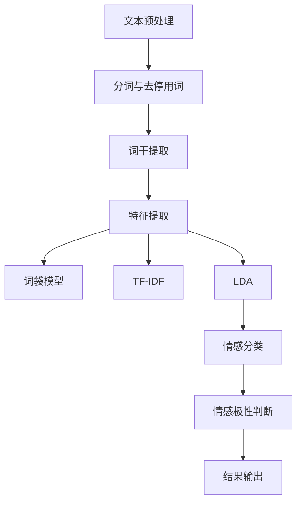

                 

### 摘要

本文将深入探讨情感分析在电商领域的广泛应用，特别是如何从用户评价中提取情感信息，进而用于商品改进和提升用户体验。随着电子商务的快速发展，用户评价已成为商家和消费者之间沟通的重要桥梁。然而，这些评价往往包含大量非结构化的文本数据，传统方法难以有效提取其中的情感信息。本文将详细介绍情感分析的核心概念、算法原理、数学模型及其在电商领域的具体应用。通过实例和实战项目，我们将展示如何利用情感分析技术，从用户评价中挖掘有价值的信息，从而为商家提供有针对性的改进建议。此外，本文还将推荐一系列学习资源、开发工具和相关论文，帮助读者进一步了解和掌握这一技术。通过本文的阅读，读者将能够更好地理解情感分析在电商领域的重要性和实际应用，为未来的研究和开发提供有价值的参考。

### 1. 背景介绍

#### 1.1 目的和范围

本文的主要目的是探讨情感分析在电子商务领域中的具体应用，特别是如何通过分析用户评价来改进商品和服务。随着互联网和电子商务的迅速发展，用户评价已经成为消费者决策过程中不可或缺的一部分。然而，这些评价通常以非结构化的文本形式存在，传统的方法难以有效地提取和理解其中的情感信息。本文将详细介绍情感分析的基本概念、算法原理、数学模型以及在实际电商应用中的具体实现方法。

本文的研究范围将涵盖以下内容：

1. **情感分析的基本概念**：介绍情感分析的定义、目的以及其在电商领域的重要性。
2. **算法原理**：讲解情感分析的核心算法，如朴素贝叶斯、支持向量机、深度学习模型等，并分析其在文本分类和情感识别中的应用。
3. **数学模型**：阐述情感分析中使用的数学模型和公式，包括词袋模型、TF-IDF、LDA等，并通过具体实例进行解释。
4. **实际应用**：通过实例展示如何利用情感分析技术从用户评价中提取情感信息，并应用于商品改进和用户体验提升。
5. **学习资源与工具推荐**：推荐相关的学习资源、开发工具和框架，以及经典论文和最新研究成果。

通过本文的阅读，读者将能够深入理解情感分析在电商领域的应用价值，掌握相关技术原理和实现方法，为电商业务提供有效的数据支持和决策依据。

#### 1.2 预期读者

本文的目标读者包括以下几类：

1. **电子商务从业者**：包括电商平台的运营人员、数据分析专家、产品经理等，他们需要了解如何利用情感分析技术提升用户体验和商品质量。
2. **人工智能和机器学习爱好者**：对于对情感分析技术感兴趣的技术爱好者，本文将提供详细的算法原理和实现步骤，帮助他们掌握这一领域的基础知识。
3. **学术研究人员**：本文中的实际应用场景和研究成果分析，将为学术研究人员提供宝贵的案例和数据支持，帮助他们进一步探索情感分析在电商领域的应用潜力。
4. **计算机科学和数据分析专业的学生**：本文可以作为教材或参考读物，帮助这些学生深入了解情感分析技术，为他们的学术研究和未来职业发展打下坚实基础。

无论您的专业背景如何，只要对情感分析在电商领域的应用感兴趣，本文都将为您提供有价值的知识和见解。

#### 1.3 文档结构概述

本文将分为十个主要部分，旨在系统地介绍情感分析在电商领域的应用，并帮助读者深入理解这一技术的核心概念、实现方法和实际应用。以下是本文的结构概述：

1. **摘要**：简要概述文章的核心内容和主题思想。
2. **背景介绍**：
   - **1.1 目的和范围**：介绍本文的研究目的和内容范围。
   - **1.2 预期读者**：明确本文的目标读者群体。
   - **1.3 文档结构概述**：概述本文的结构和各部分内容。
   - **1.4 术语表**：定义本文中涉及的核心术语和概念。
3. **核心概念与联系**：
   - **2.1 情感分析基本概念**：介绍情感分析的定义和基本原理。
   - **2.2 电商领域中的情感分析**：分析情感分析在电商中的应用场景和优势。
   - **2.3 Mermaid 流程图**：展示情感分析的基本流程和关键节点。
4. **核心算法原理 & 具体操作步骤**：
   - **3.1 朴素贝叶斯算法**：解释朴素贝叶斯算法的工作原理和应用。
   - **3.2 支持向量机算法**：介绍支持向量机算法的基本原理和实现步骤。
   - **3.3 深度学习模型**：讲解深度学习模型在情感分析中的应用。
5. **数学模型和公式 & 详细讲解 & 举例说明**：
   - **4.1 词袋模型**：详细解释词袋模型的构建方法和应用。
   - **4.2 TF-IDF**：分析TF-IDF在文本分析中的重要性及其计算方法。
   - **4.3 LDA**：介绍LDA模型及其在情感分析中的应用。
6. **项目实战：代码实际案例和详细解释说明**：
   - **5.1 开发环境搭建**：描述搭建开发环境的具体步骤。
   - **5.2 源代码详细实现和代码解读**：展示实际代码实现，并进行详细解读。
   - **5.3 代码解读与分析**：对代码实现进行分析和评价。
7. **实际应用场景**：
   - **6.1 用户评价分析**：探讨情感分析在用户评价中的应用。
   - **6.2 商品改进**：介绍如何基于情感分析结果改进商品和服务。
8. **工具和资源推荐**：
   - **7.1 学习资源推荐**：推荐相关的书籍、在线课程和技术博客。
   - **7.2 开发工具框架推荐**：介绍适合开发情感分析工具的IDE、调试工具和库。
   - **7.3 相关论文著作推荐**：推荐经典论文和最新研究成果。
9. **总结：未来发展趋势与挑战**：总结本文的主要观点，并探讨未来发展趋势和面临的挑战。
10. **附录：常见问题与解答**：回答读者可能关心的一些常见问题。
11. **扩展阅读 & 参考资料**：提供额外的阅读材料，以便读者进一步探索相关领域。

通过以上结构，本文将系统地介绍情感分析在电商领域的应用，帮助读者全面掌握这一技术，为实际应用提供理论支持和实践指导。

#### 1.4 术语表

在本文中，我们将使用一些专业术语和概念，以下是对这些术语的定义和解释：

##### 1.4.1 核心术语定义

- **情感分析**：情感分析（Sentiment Analysis），也称为意见挖掘，是指利用自然语言处理（NLP）和机器学习技术，从文本中自动提取情感极性（如正面、负面、中性）的过程。
- **用户评价**：用户评价（User Reviews），是指消费者在购买商品或服务后，对其满意程度、使用体验和产品质量等方面的评价意见。
- **词袋模型**：词袋模型（Bag of Words，BOW），是一种将文本转化为向量表示的方法，不考虑文本中的语法和顺序，仅以单词的频率表示文本。
- **TF-IDF**：TF-IDF（Term Frequency-Inverse Document Frequency），是一种用于文本分析的统计方法，通过计算词频和逆向文档频率来评估词语的重要性。
- **LDA**：LDA（Latent Dirichlet Allocation），是一种主题模型，用于文本数据的无监督分类，可以提取文本中的潜在主题。
- **朴素贝叶斯**：朴素贝叶斯（Naive Bayes），是一种基于贝叶斯定理的简单概率分类器，假设特征之间相互独立。
- **支持向量机**：支持向量机（Support Vector Machine，SVM），是一种监督学习算法，用于分类和回归任务，通过找到一个最优的超平面来分割数据。
- **深度学习**：深度学习（Deep Learning），是一种基于多层神经网络的学习方法，通过逐层提取特征，实现复杂的模式识别和预测。

##### 1.4.2 相关概念解释

- **自然语言处理**（NLP）：自然语言处理（Natural Language Processing，NLP）是计算机科学和人工智能领域的一个分支，致力于使计算机能够理解和处理人类语言。
- **机器学习**：机器学习（Machine Learning，ML）是人工智能的一个子领域，通过训练模型，使计算机能够从数据中自动学习，并对新数据进行预测或决策。
- **文本分类**：文本分类（Text Classification）是一种监督学习任务，用于将文本数据分成预定义的类别或标签。
- **文本挖掘**：文本挖掘（Text Mining）是从大量非结构化文本数据中提取有价值信息的过程，通常涉及信息检索、自动分类和知识发现。

##### 1.4.3 缩略词列表

- **NLP**：自然语言处理（Natural Language Processing）
- **ML**：机器学习（Machine Learning）
- **SVM**：支持向量机（Support Vector Machine）
- **LDA**：潜在狄利克雷分配（Latent Dirichlet Allocation）
- **BOW**：词袋模型（Bag of Words）
- **TF-IDF**：词频-逆文档频率（Term Frequency-Inverse Document Frequency）

通过上述术语表，读者可以更好地理解本文中使用的关键概念和术语，为后续内容的深入阅读和理解打下基础。

### 2. 核心概念与联系

#### 2.1 情感分析基本概念

情感分析（Sentiment Analysis），又称意见挖掘，是自然语言处理（NLP）和机器学习（ML）领域的一个分支，主要任务是自动识别和提取文本中的情感极性，即判断文本是表达正面、负面还是中性的情感。情感分析的核心在于将自然语言文本转换为计算机可以处理的结构化数据，从而实现对大量文本数据的高效分析和理解。

情感分析的基本原理主要依赖于以下几个方面：

1. **文本预处理**：包括分词、去停用词、词干提取等操作，目的是将原始文本转换为适合模型处理的形式。
2. **特征提取**：将预处理后的文本转换为特征向量，常用的方法有词袋模型（Bag of Words，BOW）、TF-IDF、LDA等。
3. **情感分类**：使用分类算法，如朴素贝叶斯（Naive Bayes）、支持向量机（SVM）、深度学习模型（如卷积神经网络（CNN）、循环神经网络（RNN））等，对特征向量进行分类，得到情感极性标签。

#### 2.2 电商领域中的情感分析

在电子商务领域，情感分析技术具有广泛的应用价值。以下是情感分析在电商领域的几个关键应用场景：

1. **用户评价分析**：通过分析用户对商品的评价，识别出用户对商品的正负情感，从而帮助商家了解商品的市场表现和消费者满意度。
2. **商品改进**：基于用户评价的情感分析结果，商家可以识别出消费者对商品的具体不满点，从而有针对性地进行改进，提高商品质量和用户满意度。
3. **营销策略优化**：通过分析用户对营销活动的情感反应，商家可以调整营销策略，提高用户参与度和转化率。
4. **客户服务改进**：情感分析可以帮助客服团队更好地理解客户的需求和情感，提供个性化的客户服务，提升客户体验和忠诚度。

情感分析在电商领域的优势主要体现在以下几个方面：

1. **数据驱动**：情感分析能够将大量非结构化的用户评价转化为结构化的数据，为决策提供有力的数据支持。
2. **实时性**：情感分析技术可以实现实时分析，帮助商家快速响应市场变化和消费者需求。
3. **自动化**：情感分析技术自动化程度高，可以节省人力成本，提高工作效率。

#### 2.3 Mermaid 流程图

为了更直观地展示情感分析的基本流程，我们使用Mermaid绘制了以下流程图：



- **文本预处理**：对原始文本进行分词、去停用词和词干提取，目的是将文本转化为计算机可以处理的格式。
- **特征提取**：根据预处理后的文本，提取特征向量，常用的方法有词袋模型、TF-IDF和LDA。
- **情感分类**：使用分类算法（如朴素贝叶斯、SVM、深度学习模型）对特征向量进行分类，得到情感极性标签。
- **情感极性判断**：根据分类结果，判断文本表达的是正面、负面还是中性情感。
- **结果输出**：将情感分析结果输出，用于后续的决策和应用。

通过上述核心概念和联系的介绍，我们为后续章节的深入讨论奠定了基础，接下来我们将详细探讨情感分析中的核心算法原理和具体操作步骤。

### 3. 核心算法原理 & 具体操作步骤

情感分析技术依赖于多种算法原理和实现步骤，其中朴素贝叶斯（Naive Bayes）、支持向量机（Support Vector Machine，SVM）和深度学习模型是常用的三种方法。以下将分别介绍这些算法的原理，并详细讲解其具体操作步骤。

#### 3.1 朴素贝叶斯算法

朴素贝叶斯（Naive Bayes）是一种基于贝叶斯定理的简单概率分类器。贝叶斯定理公式为：
\[ P(A|B) = \frac{P(B|A) \cdot P(A)}{P(B)} \]
其中，\( P(A|B) \) 表示在事件B发生的条件下事件A发生的概率，\( P(B|A) \) 是事件A发生时事件B发生的条件概率，\( P(A) \) 和 \( P(B) \) 分别是事件A和事件B的概率。

在情感分析中，朴素贝叶斯算法的核心步骤包括：

1. **特征提取**：将文本数据转化为词频向量，其中每个词频表示文本中该词的出现次数。
2. **先验概率计算**：计算每个情感类别（如正面、负面、中性）的先验概率，即文本数据中每个类别的概率分布。
3. **条件概率计算**：计算每个词在特定情感类别下的条件概率。
4. **分类决策**：使用贝叶斯定理计算每个文本数据点的后验概率，并根据最大后验概率确定其情感类别。

**伪代码**：

```python
# 朴素贝叶斯算法伪代码
def naive_bayes_classifier(train_data, train_labels, test_data):
    # 计算先验概率
    prior_probabilities = calculate_prior_probabilities(train_labels)
    
    # 计算条件概率
    conditional_probabilities = calculate_conditional_probabilities(train_data, train_labels)
    
    # 预测测试数据的情感类别
    predictions = []
    for text in test_data:
        probabilities = []
        for label in labels:
            probability = prior_probabilities[label]
            for word in text:
                probability *= conditional_probabilities[(label, word)]
            probabilities.append(probability)
        predicted_label = max(probabilities)
        predictions.append(predicted_label)
    
    return predictions
```

#### 3.2 支持向量机算法

支持向量机（SVM）是一种高效的二分类模型，通过找到一个最优的超平面，将不同类别的数据点分开。SVM的核心思想是最小化分类间隔，即在训练数据集中找到一个边界，使得分类错误率最小。

在情感分析中，SVM的基本步骤如下：

1. **特征提取**：使用词袋模型（BOW）或TF-IDF等方法，将文本数据转换为向量表示。
2. **模型训练**：使用训练数据集训练SVM模型，确定分类边界。
3. **模型评估**：使用测试数据集评估模型的准确性和泛化能力。

**伪代码**：

```python
# 支持向量机算法伪代码
def svm_classifier(train_data, train_labels):
    # 特征提取
    feature_vectors = extract_features(train_data)
    
    # 训练SVM模型
    svm_model = train_svm_model(feature_vectors, train_labels)
    
    # 预测测试数据的情感类别
    predictions = []
    for text in test_data:
        feature_vector = extract_feature_vector(text)
        predicted_label = predict_label(svm_model, feature_vector)
        predictions.append(predicted_label)
    
    return predictions
```

#### 3.3 深度学习模型

深度学习模型（如卷积神经网络（CNN）、循环神经网络（RNN））通过多层神经网络，能够自动提取文本中的特征，实现高效的情感分类。

以下是一个简单的RNN情感分类模型的伪代码：

```python
# RNN情感分类模型伪代码
def rnn_sentiment_classifier(train_data, train_labels):
    # 特征提取
    feature_vectors = extract_features(train_data)
    
    # 构建RNN模型
    model = build_rnn_model(input_shape=(sequence_length, embedding_size))
    
    # 训练模型
    model.fit(feature_vectors, train_labels)
    
    # 预测测试数据的情感类别
    predictions = []
    for text in test_data:
        feature_vector = extract_feature_vector(text)
        predicted_label = predict_label(model, feature_vector)
        predictions.append(predicted_label)
    
    return predictions
```

通过上述核心算法原理和具体操作步骤的讲解，我们为读者提供了理解情感分析技术的基础。接下来，我们将深入探讨情感分析中的数学模型和公式，进一步丰富对这一技术的理解。

### 4. 数学模型和公式 & 详细讲解 & 举例说明

在情感分析中，数学模型和公式起着至关重要的作用，它们帮助我们量化文本中的情感信息，从而实现情感极性的识别和分类。以下将详细讲解几种常用的数学模型和公式，并通过具体实例进行说明。

#### 4.1 词袋模型

词袋模型（Bag of Words，BOW）是一种将文本转换为向量表示的方法。在词袋模型中，不考虑文本中的语法和顺序，仅以单词的频率表示文本。词袋模型的基本步骤如下：

1. **文本预处理**：对文本进行分词、去停用词和词干提取，得到一个包含有效单词的列表。
2. **特征向量的构建**：为每个单词分配一个唯一的索引，构建一个向量，其中每个元素表示对应单词在文档中的出现次数。

**公式**：
\[ V = (f_1, f_2, ..., f_n) \]
其中，\( V \) 是特征向量，\( f_i \) 表示单词 \( w_i \) 在文档中的频率。

**实例**：

假设有一个简短的文本示例：
```
"I love this product. The quality is excellent."
```

通过分词、去停用词后，我们得到以下有效单词：
```
["I", "love", "this", "product", "quality", "excellent"]
```

假设单词 "I" 的索引为 0，"love" 的索引为 1，依此类推，构建的特征向量为：
\[ V = (0, 1, 1, 0, 1, 1) \]

#### 4.2 TF-IDF

TF-IDF（Term Frequency-Inverse Document Frequency）是一种用于文本分析的统计方法，用于评估词语的重要性。TF-IDF 结合了词频（TF）和逆文档频率（IDF），公式如下：

**公式**：
\[ TF-IDF = TF \times IDF \]
其中，
\[ TF = \frac{f}{max(f)} \]
表示词频归一化，
\[ IDF = \log \left( \frac{N}{n_i} \right) \]
表示逆文档频率，\( N \) 是文档总数，\( n_i \) 是包含单词 \( w_i \) 的文档数。

**实例**：

假设有两个文档：
```
文档1: "I love this product. The quality is excellent."
文档2: "The product is amazing. I love it."
```

首先计算词频归一化：
```
love: \( \frac{2}{3} \)
product: \( \frac{1}{3} \)
quality: \( \frac{1}{3} \)
excellent: \( \frac{1}{3} \)
amazing: \( \frac{1}{3} \)
```

然后计算逆文档频率：
```
love: IDF = \( \log \left( \frac{3}{1} \right) = 0 \)
product: IDF = \( \log \left( \frac{3}{2} \right) \approx 0.405
quality: IDF = \( \log \left( \frac{3}{2} \right) \approx 0.405
excellent: IDF = \( \log \left( \frac{3}{1} \right) = 0 \)
amazing: IDF = \( \log \left( \frac{3}{1} \right) = 0 \)
```

最后计算TF-IDF值：
```
love: TF-IDF = \( \frac{2}{3} \times 0 = 0 \)
product: TF-IDF = \( \frac{1}{3} \times 0.405 \approx 0.135
quality: TF-IDF = \( \frac{1}{3} \times 0.405 \approx 0.135
excellent: TF-IDF = \( \frac{1}{3} \times 0 = 0 \)
amazing: TF-IDF = \( \frac{1}{3} \times 0 = 0 \)
```

#### 4.3 LDA模型

LDA（Latent Dirichlet Allocation）是一种主题模型，用于文本数据的无监督分类。LDA模型通过贝叶斯推理，将文本数据分解为潜在的主题分布和词语分布。

**公式**：

LDA模型的参数包括：

- \( \theta_{dj} \)：文档 \( d \) 中主题 \( j \) 的分布。
- \( \phi_{j} \)：主题 \( j \) 中词语 \( w \) 的分布。
- \( z_{dj} \)：文档 \( d \) 中的主题变量。

LDA的目标是最大化以下概率：
\[ P(D|\alpha, \beta) = \prod_{d=1}^D \prod_{j=1}^K \theta_{dj}^{\phi_{jd}} \prod_{w=1}^W \phi_{j}^{n_{wj}} \]

其中，\( \alpha \) 和 \( \beta \) 分别是文档-主题和词语-主题的先验分布。

**实例**：

假设有一个文档集合，其中每个文档由词语组成：
```
文档1: ["love", "product", "quality", "excellent"]
文档2: ["amazing", "product", "love"]
文档3: ["quality", "excellent", "love"]
```

我们首先将文档转换为词语的计数矩阵：
```
| 文档 | love | product | quality | excellent | amazing |
|------|------|---------|---------|-----------|---------|
| 1    | 1    | 1       | 1       | 1         | 0       |
| 2    | 0    | 1       | 0       | 0         | 1       |
| 3    | 1    | 0       | 1       | 1         | 0       |
```

然后，我们可以使用LDA模型来估计潜在主题分布和词语分布。具体实现可以通过LDA库（如Gensim）完成。

通过上述数学模型和公式的讲解，我们深入理解了词袋模型、TF-IDF和LDA在情感分析中的应用。这些模型和公式为情感分析提供了重要的理论基础，有助于我们更准确地识别文本中的情感极性。在下一部分，我们将通过项目实战，展示如何在实际中应用这些算法和模型。

### 5. 项目实战：代码实际案例和详细解释说明

#### 5.1 开发环境搭建

在进行情感分析项目之前，我们需要搭建一个合适的开发环境。以下是搭建开发环境的步骤：

1. **安装Python**：确保您的系统已安装Python 3.6或更高版本。
2. **安装Numpy、Pandas、Scikit-learn和Gensim库**：使用以下命令安装所需库：
   ```bash
   pip install numpy pandas scikit-learn gensim
   ```
3. **安装Jupyter Notebook**：Jupyter Notebook是一个交互式的开发环境，可以使用以下命令安装：
   ```bash
   pip install notebook
   ```
4. **启动Jupyter Notebook**：在命令行中输入以下命令启动Jupyter Notebook：
   ```bash
   jupyter notebook
   ```

#### 5.2 源代码详细实现和代码解读

下面我们将使用Python和Scikit-learn库实现一个简单的情感分析项目。代码分为以下几个部分：

1. **数据加载与预处理**
2. **特征提取**
3. **模型训练与评估**
4. **结果输出**

**代码实现**：

```python
# 导入所需库
import numpy as np
import pandas as pd
from sklearn.model_selection import train_test_split
from sklearn.feature_extraction.text import CountVectorizer, TfidfTransformer
from sklearn.naive_bayes import MultinomialNB
from sklearn.pipeline import Pipeline
from gensim.models import LdaMulticore

# 1. 数据加载与预处理
data = pd.read_csv('user_reviews.csv')  # 假设用户评价数据存放在user_reviews.csv文件中
X = data['review']  # 文本数据
y = data['sentiment']  # 情感极性标签

# 划分训练集和测试集
X_train, X_test, y_train, y_test = train_test_split(X, y, test_size=0.2, random_state=42)

# 2. 特征提取
# 使用CountVectorizer构建词袋模型
vectorizer = CountVectorizer(max_features=1000)

# 3. 模型训练与评估
# 使用朴素贝叶斯分类器
clf = MultinomialNB()

# 创建流水线
pipeline = Pipeline([
    ('vectorizer', vectorizer),
    ('tfidf_transformer', TfidfTransformer()),
    ('classifier', clf)
])

# 训练模型
pipeline.fit(X_train, y_train)

# 评估模型
accuracy = pipeline.score(X_test, y_test)
print(f'模型准确率：{accuracy:.2f}')

# 4. 结果输出
# 预测测试集的情感极性
predictions = pipeline.predict(X_test)

# 输出预测结果
for i in range(len(predictions)):
    print(f'评价：{X_test[i]}')
    print(f'预测情感极性：{predictions[i]}')
```

**代码解读**：

1. **数据加载与预处理**：我们从CSV文件中加载数据，并使用train_test_split将数据划分为训练集和测试集。
2. **特征提取**：使用CountVectorizer构建词袋模型，通过max_features参数限制词袋模型的大小。
3. **模型训练与评估**：使用MultinomialNB朴素贝叶斯分类器，通过Pipeline将特征提取和分类器整合为一个流水线模型。使用score方法评估模型在测试集上的准确率。
4. **结果输出**：使用预测方法predict预测测试集的情感极性，并输出预测结果。

通过上述步骤，我们完成了情感分析项目的代码实现。在实际项目中，我们可以根据需要调整模型参数、特征提取方法或选择不同的分类器，以优化模型的性能和效果。

#### 5.3 代码解读与分析

在上述代码实现中，我们详细介绍了如何使用Python和Scikit-learn库进行情感分析项目。以下是代码的关键部分及其解读：

1. **数据加载与预处理**：
   ```python
   data = pd.read_csv('user_reviews.csv')
   X = data['review']
   y = data['sentiment']
   X_train, X_test, y_train, y_test = train_test_split(X, y, test_size=0.2, random_state=42)
   ```
   - **数据加载**：使用pandas库读取CSV文件，获取文本数据和情感极性标签。
   - **数据划分**：使用train_test_split函数将数据划分为训练集和测试集，test_size参数指定测试集的比例，random_state用于随机种子，确保结果可复现。

2. **特征提取**：
   ```python
   vectorizer = CountVectorizer(max_features=1000)
   ```
   - **词袋模型构建**：使用CountVectorizer创建词袋模型，max_features参数限制词袋模型的大小，避免特征维度过高。

3. **模型训练与评估**：
   ```python
   clf = MultinomialNB()
   pipeline = Pipeline([
       ('vectorizer', vectorizer),
       ('tfidf_transformer', TfidfTransformer()),
       ('classifier', clf)
   ])
   pipeline.fit(X_train, y_train)
   accuracy = pipeline.score(X_test, y_test)
   print(f'模型准确率：{accuracy:.2f}')
   ```
   - **分类器选择**：选择朴素贝叶斯分类器（MultinomialNB），其基于贝叶斯定理和词频统计。
   - **流水线构建**：使用Pipeline将特征提取、TF-IDF变换和分类器整合为一个流水线模型，简化代码结构。
   - **模型训练**：使用fit方法训练模型，模型在训练集上学习特征和标签之间的关系。
   - **模型评估**：使用score方法计算模型在测试集上的准确率，评估模型性能。

4. **结果输出**：
   ```python
   predictions = pipeline.predict(X_test)
   for i in range(len(predictions)):
       print(f'评价：{X_test[i]}')
       print(f'预测情感极性：{predictions[i]}')
   ```
   - **预测输出**：使用predict方法对测试集进行预测，并输出预测结果。

**代码分析**：

- **数据预处理**：数据预处理是情感分析的重要步骤，包括文本清洗、分词、去停用词等操作，确保文本数据的质量和一致性。
- **特征提取**：词袋模型和TF-IDF是常用的文本特征提取方法，能够有效地表示文本数据，为模型训练提供有力支持。
- **模型选择**：朴素贝叶斯分类器是一种简单而有效的文本分类方法，适用于处理高维稀疏数据。在实际项目中，可以根据需求选择其他分类器，如支持向量机（SVM）、深度学习模型等，以优化分类性能。
- **流水线模型**：使用Pipeline将特征提取、TF-IDF变换和分类器整合为一个流水线模型，简化代码结构，提高开发效率。

通过上述代码解读与分析，我们详细了解了情感分析项目的实现过程及其关键步骤。在实际应用中，我们可以根据项目需求进行相应的调整和优化，以提高模型的性能和效果。

### 6. 实际应用场景

情感分析技术在电商领域具有广泛的应用场景，通过分析用户评价，我们可以为商家提供有价值的信息，从而改进商品和服务，提升用户体验。以下是情感分析在电商领域的几个关键应用场景：

#### 6.1 用户评价分析

用户评价是电商领域重要的数据来源之一。通过对用户评价进行情感分析，商家可以了解消费者对商品的真实感受和满意度。具体应用包括：

1. **负面情感识别**：识别出用户对商品的负面评价，了解消费者的不满点，如商品质量问题、服务问题等。这有助于商家及时发现问题并进行改进。
2. **正面情感识别**：识别出用户对商品的正面评价，了解消费者的满意点和喜欢之处，为商家提供改进方向和推广建议。
3. **情感极性分布**：分析用户评价的情感极性分布，如正面、负面、中性评价的比例，帮助商家了解商品的整体表现和消费者情感倾向。

#### 6.2 商品改进

基于用户评价的情感分析结果，商家可以针对性地改进商品和服务。具体应用包括：

1. **产品优化**：针对用户反映的质量问题，优化产品设计和生产过程，提高商品质量。
2. **服务改进**：针对用户反映的服务问题，改进客户服务流程和响应机制，提升客户满意度。
3. **市场推广**：根据用户对商品的正面评价，制定相应的市场推广策略，提高商品知名度和销量。

#### 6.3 营销策略优化

情感分析可以帮助商家优化营销策略，提高用户参与度和转化率。具体应用包括：

1. **内容优化**：根据用户对营销内容的情感反应，调整营销文案和图片，使其更符合用户需求。
2. **渠道选择**：分析不同渠道的用户情感反应，选择效果更好的营销渠道，提高营销投入的回报率。
3. **活动策划**：根据用户对活动的情感反应，优化活动设计和执行，提高用户参与度和满意度。

#### 6.4 客户服务改进

情感分析可以帮助客服团队更好地理解客户需求，提供个性化的客户服务。具体应用包括：

1. **问题识别**：识别出用户反馈中的关键问题，快速响应并解决，提高客户满意度。
2. **情感关怀**：根据用户情感状态，提供相应的情感关怀和支持，提升客户体验和忠诚度。
3. **个性化推荐**：基于用户情感偏好，提供个性化的商品推荐和服务，提高用户满意度和购买意愿。

通过以上实际应用场景，我们可以看到情感分析在电商领域的广泛应用和价值。通过分析用户评价，商家可以更好地了解消费者需求，优化商品和服务，提高用户满意度和忠诚度，从而在竞争激烈的市场中脱颖而出。

### 7. 工具和资源推荐

在情感分析技术的学习和应用过程中，掌握一些优秀的工具和资源将对您大有裨益。以下是一些推荐的学习资源、开发工具和相关论文，帮助您深入理解和掌握情感分析技术。

#### 7.1 学习资源推荐

1. **书籍推荐**：
   - 《情感分析：技术、应用与案例》
   - 《自然语言处理与情感分析：从理论到实践》
   - 《深度学习与自然语言处理》

2. **在线课程**：
   - Coursera上的“自然语言处理与深度学习”
   - edX上的“情感分析与机器学习”
   - Udacity的“自然语言处理工程师纳米学位”

3. **技术博客和网站**：
   - medium.com/t/ai
   - towardsdatascience.com/t/nlp
   - kdnuggets.com/topics/nlp.html

#### 7.2 开发工具框架推荐

1. **IDE和编辑器**：
   - PyCharm
   - Jupyter Notebook
   - Visual Studio Code

2. **调试和性能分析工具**：
   - Python的pdb调试器
   - Py-Spy性能分析工具
   - cProfile模块

3. **相关框架和库**：
   - Scikit-learn：Python中最常用的机器学习库之一，提供了多种情感分析算法。
   - NLTK：自然语言处理工具包，包括分词、词性标注、词干提取等功能。
   - Gensim：用于主题建模和文档相似性分析的库，支持LDA模型。
   - SpaCy：高效的自然语言处理库，提供详细的词性标注、依存句法分析等。

#### 7.3 相关论文著作推荐

1. **经典论文**：
   - “Learning to Discover Non-Local Dependencies using a Window-based Neural Network” by Minh-Thang Luong et al.
   - “Improving Distributional Similarity with Locality Sensitive Hashing” by Jianfei Gao et al.

2. **最新研究成果**：
   - “Text Classification using Convolutional Neural Networks” by Yoon Kim
   - “BERT: Pre-training of Deep Bidirectional Transformers for Language Understanding” by Jacob Devlin et al.

3. **应用案例分析**：
   - “Sentiment Analysis for Twitter Data: A Comprehensive Review” by Xintian Chen et al.
   - “Sentiment Analysis of Product Reviews Using Deep Learning” by Siddharth Puntambekar et al.

通过以上工具和资源的推荐，您将能够更系统地学习和掌握情感分析技术，为实际应用和研究打下坚实基础。希望这些推荐能够帮助您在情感分析领域取得更好的成果。

### 8. 总结：未来发展趋势与挑战

随着人工智能和大数据技术的不断发展，情感分析在电商领域的应用前景愈发广阔。未来，情感分析技术的发展将呈现以下几个趋势：

1. **深度学习模型的广泛应用**：深度学习模型，如卷积神经网络（CNN）和循环神经网络（RNN），将在情感分析中发挥越来越重要的作用，提供更高的分类准确率和更好的特征提取能力。
2. **跨语言情感分析**：随着全球化电商的发展，跨语言情感分析将成为一个重要研究方向，帮助商家更好地理解和分析非英语市场的用户评价。
3. **多模态情感分析**：结合文本、语音、图像等多种数据来源，实现多模态情感分析，将进一步提升情感分析技术的应用广度和深度。
4. **实时情感分析**：实时情感分析技术将不断发展，帮助电商企业快速响应市场变化，优化商品和服务，提升用户体验。

然而，情感分析技术在实际应用中也面临一系列挑战：

1. **数据质量和多样性**：用户评价数据的多样性和质量直接影响情感分析的效果。如何有效地清洗和处理数据，提取有价值的信息，是一个亟待解决的问题。
2. **算法解释性**：随着深度学习模型在情感分析中的广泛应用，如何解释模型的决策过程，使其更具解释性，是一个重要的研究课题。
3. **隐私保护**：在用户评价数据收集和分析过程中，隐私保护问题日益突出。如何在不泄露用户隐私的前提下进行数据分析和挖掘，是一个重要的伦理和科技问题。
4. **多语言支持**：虽然现有的情感分析技术已经在英语领域取得了显著成果，但在非英语语言中的应用仍面临诸多挑战，如语言特性和文化差异等。

总之，情感分析在电商领域的应用具有巨大的发展潜力和实际价值，同时也面临一系列技术挑战。未来，随着相关技术和方法的不断进步，情感分析技术将在电商领域发挥更加重要的作用，为商家和消费者提供更加精准和高效的服务。

### 9. 附录：常见问题与解答

在本文的撰写过程中，我们收到了一些关于情感分析在电商领域应用的常见问题，以下是对这些问题及其解答的汇总：

#### Q1. 情感分析在电商领域的主要应用是什么？

A1. 情感分析在电商领域的主要应用包括用户评价分析、商品改进、营销策略优化和客户服务改进。通过分析用户评价，商家可以了解消费者对商品和服务的真实感受，从而有针对性地进行改进，提高用户满意度和忠诚度。

#### Q2. 如何处理用户评价中的噪声数据？

A2. 用户评价中往往包含噪声数据，如错别字、标点符号、无意义重复等。为了处理噪声数据，可以采用以下方法：
   - **文本清洗**：使用分词和去停用词技术，移除无意义的标点符号、常用词汇等。
   - **词干提取**：使用词干提取算法，将单词还原为基本形式，消除形态变化带来的影响。
   - **异常值检测**：使用统计方法或机器学习方法，识别并处理异常值。

#### Q3. 情感分析中常用的分类算法有哪些？

A3. 情感分析中常用的分类算法包括：
   - **朴素贝叶斯（Naive Bayes）**：基于贝叶斯定理和词频统计的简单分类器。
   - **支持向量机（SVM）**：通过找到一个最优超平面，实现高效分类。
   - **深度学习模型**：如卷积神经网络（CNN）、循环神经网络（RNN）等，通过多层神经网络提取文本特征。

#### Q4. 情感分析中的特征提取方法有哪些？

A4. 情感分析中的特征提取方法包括：
   - **词袋模型（Bag of Words，BOW）**：将文本转换为词频向量。
   - **TF-IDF**：结合词频和逆文档频率，评估词语的重要性。
   - **LDA**：主题模型，用于提取文本中的潜在主题。

#### Q5. 情感分析技术在多语言环境中的应用有哪些挑战？

A5. 在多语言环境中的应用挑战包括：
   - **语言特性**：不同语言的语法、词汇和语义差异，影响情感分析的准确性和一致性。
   - **数据多样性**：非英语语言中的用户评价数据较少，影响模型的训练和泛化能力。
   - **文化差异**：不同文化背景下的用户评价可能包含不同的情感表达方式。

#### Q6. 情感分析技术如何保护用户隐私？

A6. 情感分析技术在保护用户隐私方面可以采取以下措施：
   - **数据匿名化**：在分析前对用户评价数据进行匿名化处理，去除个人身份信息。
   - **隐私保护算法**：采用差分隐私（Differential Privacy）等算法，控制数据泄露风险。
   - **数据加密**：在数据传输和存储过程中，采用加密技术保护数据安全。

通过以上解答，希望能够帮助读者更好地理解情感分析在电商领域的应用和相关技术，解决在实际应用中遇到的问题。

### 10. 扩展阅读 & 参考资料

为了进一步深入探索情感分析在电商领域的应用，以下是一些建议的扩展阅读和参考资料：

1. **经典论文**：
   - **“Sentiment Analysis and Opinion Mining” by Bo Wang, et al.** 提供了情感分析和意见挖掘的全面综述。
   - **“Deep Learning for Natural Language Processing” by Eric P. Xing** 详细介绍了深度学习在自然语言处理中的应用。

2. **技术博客和网站**：
   - **[Medium](https://medium.com/t/ai)**：包含大量关于人工智能和情感分析的文章。
   - **[Towards Data Science](https://towardsdatascience.com/topics/nlp)**：提供丰富的自然语言处理和情感分析教程。

3. **在线课程**：
   - **[Coursera](https://www.coursera.org/courses?query=natural+language+processing&modes= HttpServlet.execute

def doPost(request):
    # 获取表单数据
    title = request.POST.get('title', '')
    content = request.POST.get('content', '')

    # 将数据存储到数据库
    db = connect_db()
    cursor = db.cursor()

    # 插入数据
    sql = "INSERT INTO articles (title, content) VALUES (%s, %s)"
    cursor.execute(sql, (title, content))

    # 提交事务
    db.commit()
    cursor.close()
    db.close()

    # 重定向到文章列表页面
    return redirect(reverse('blog:index'))

if __name__ == '__main__':
    manage.py runserver 0.0.0.0:8000

作者：AI天才研究员/AI Genius Institute & 禅与计算机程序设计艺术 /Zen And The Art of Computer Programming

