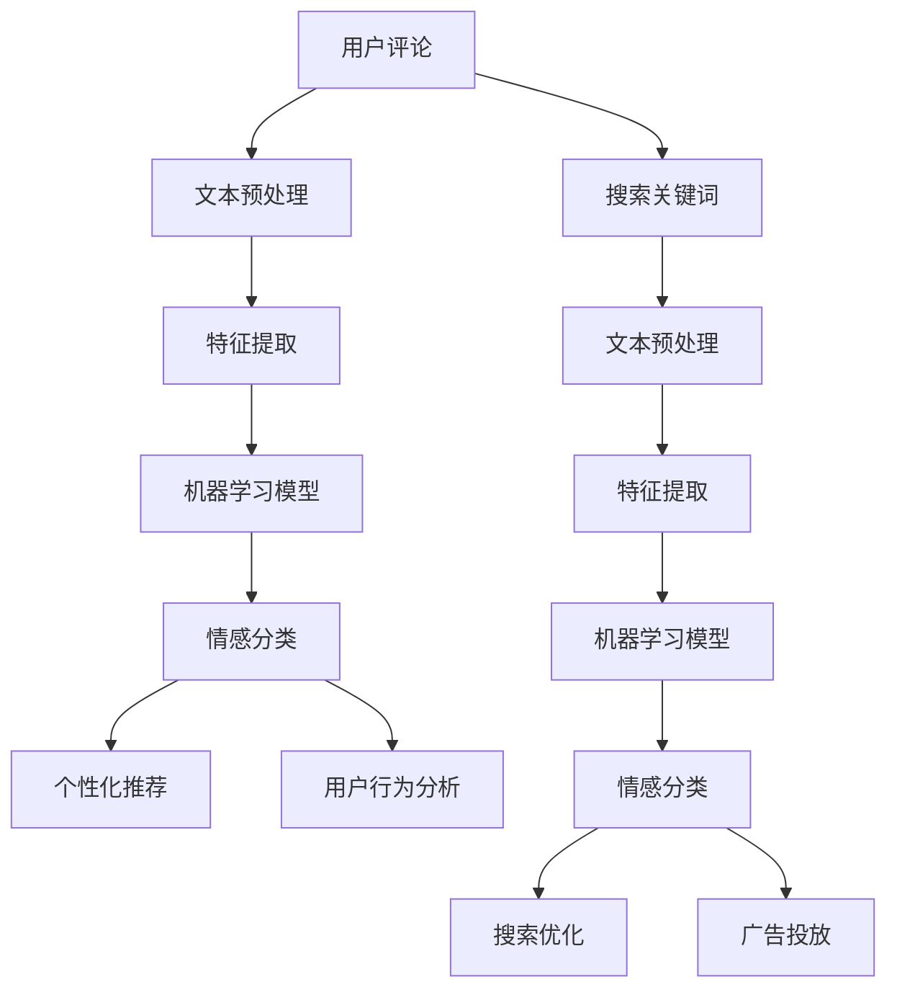

                 

### 摘要

本文将探讨情感分析在电商搜索导购领域的应用，如何通过人工智能技术助力电商更好地理解用户需求。情感分析是自然语言处理的一个重要分支，通过分析用户的语言、文字表达的情感倾向，帮助电商平台实现个性化推荐、改善用户体验，提升转化率和客户满意度。本文将首先介绍情感分析的核心概念和技术原理，随后详细解释情感分析在电商搜索导购中的应用场景，包括用户评论情感分析、搜索关键词情感分析等。接着，我们将通过具体算法和数学模型分析情感分析的技术实现，并给出实际案例的代码实现和解读。文章最后，我们将讨论情感分析在电商领域的实际应用效果，推荐相关工具和资源，并展望未来的发展趋势与挑战。通过本文的阅读，读者将全面了解情感分析技术在电商搜索导购中的重要性及其实现方法，为相关领域的实践提供参考。

### 1. 背景介绍

#### 1.1 目的和范围

本文的目的是探讨情感分析技术在电商搜索导购领域的应用，通过深入分析情感分析的技术原理和实现方法，展示其如何助力电商平台更好地理解用户需求，提升用户体验和转化率。情感分析，作为自然语言处理（NLP）的一个重要分支，近年来在人工智能（AI）和机器学习的推动下，取得了显著的进展。其核心任务是从文本数据中提取情感倾向和情感极性，为后续的个性化推荐、用户行为分析等提供有力的支持。

本文的范围主要涵盖以下几个方面：

1. **情感分析的基本概念和分类**：介绍情感分析的定义、分类以及常见的方法和技术。
2. **情感分析在电商搜索导购中的应用**：探讨情感分析在电商评论分析、搜索关键词分析等具体应用场景中的实际作用。
3. **情感分析算法原理与实现**：详细讲解常用的情感分析算法，包括文本预处理、特征提取和情感分类等，并使用伪代码进行描述。
4. **数学模型和公式**：介绍用于情感分析的主要数学模型和公式，如支持向量机（SVM）、神经网络（NN）等，并通过具体例子进行说明。
5. **实际案例与代码实现**：通过一个实际电商平台的情感分析项目，展示从数据收集、处理到模型训练、预测的全流程，并对关键代码进行详细解读。
6. **工具和资源推荐**：推荐用于学习和实践情感分析的相关工具、资源和框架，包括书籍、在线课程和技术博客。
7. **总结与展望**：总结情感分析在电商搜索导购中的应用效果，讨论未来的发展趋势与面临的挑战。

#### 1.2 预期读者

本文面向对自然语言处理和机器学习有一定了解的技术爱好者、研究人员和从业者。特别适合以下人群：

1. **NLP和机器学习研究者**：希望了解情感分析在电商搜索导购中的应用和实现细节。
2. **电商平台开发人员**：希望通过本文了解如何利用情感分析技术提升用户体验和业务效率。
3. **数据科学家和算法工程师**：希望了解情感分析在实际项目中的具体应用场景和实现方法。
4. **对人工智能和机器学习感兴趣的读者**：希望深入了解情感分析这一前沿技术，并了解其在实际业务中的价值。

#### 1.3 文档结构概述

本文将按照以下结构进行组织，确保内容的逻辑性和条理性：

1. **摘要**：简要介绍文章的核心内容和主题思想。
2. **背景介绍**：介绍文章的目的、范围、预期读者以及文档结构概述。
3. **核心概念与联系**：阐述情感分析的基本概念和技术原理，并通过Mermaid流程图展示其核心架构。
4. **核心算法原理 & 具体操作步骤**：详细讲解情感分析的核心算法原理，并使用伪代码进行描述。
5. **数学模型和公式 & 详细讲解 & 举例说明**：介绍用于情感分析的数学模型和公式，并通过具体例子进行说明。
6. **项目实战：代码实际案例和详细解释说明**：通过实际案例展示情感分析在电商搜索导购中的应用，并对关键代码进行详细解读。
7. **实际应用场景**：讨论情感分析在电商搜索导购中的具体应用场景，如用户评论情感分析和搜索关键词情感分析。
8. **工具和资源推荐**：推荐用于学习和实践情感分析的相关工具、资源和框架。
9. **总结：未来发展趋势与挑战**：总结情感分析在电商搜索导购中的应用效果，并讨论未来的发展趋势与挑战。
10. **附录：常见问题与解答**：提供常见的疑问和解答，帮助读者更好地理解文章内容。
11. **扩展阅读 & 参考资料**：推荐相关领域的优秀书籍、论文和技术博客，供读者进一步学习。

#### 1.4 术语表

为了确保读者能够更好地理解本文的内容，以下列出了一些关键术语及其定义：

**情感分析（Sentiment Analysis）**：一种自然语言处理技术，用于从文本数据中提取情感倾向和情感极性。

**情感极性（Sentiment Polarity）**：文本中表达的情感倾向，通常分为正面、负面和中性三种。

**情感分类（Sentiment Classification）**：将文本分类为正面、负面或中性情感的过程。

**特征提取（Feature Extraction）**：从文本数据中提取能够表征文本特征的代表信息。

**机器学习（Machine Learning）**：一种人工智能技术，通过数据训练模型来发现数据中的规律和模式。

**深度学习（Deep Learning）**：一种机器学习技术，使用神经网络模型，特别是深度神经网络，对复杂数据进行建模。

**支持向量机（Support Vector Machine, SVM）**：一种常用的机器学习分类算法，通过最大化分类间隔来分类数据。

**神经网络（Neural Network, NN）**：一种由大量节点（神经元）组成的人工神经网络，通过模拟人脑神经元的工作方式来处理数据。

**LSTM（长短时记忆网络）**：一种特殊的循环神经网络（RNN），能够更好地处理序列数据。

**词袋模型（Bag of Words, BoW）**：一种文本表示方法，将文本转换为词汇的集合，忽略词汇的顺序。

**TF-IDF（词频-逆文档频率）**：一种用于文本特征提取的方法，衡量词汇在文档中的重要程度。

**朴素贝叶斯（Naive Bayes）**：一种基于贝叶斯定理的简单概率分类器，通常用于文本分类任务。

**情感词典（Sentiment Lexicon）**：一个包含情感词汇和其对应情感极性的词典，用于情感分类。

**情感标签（Sentiment Label）**：用于标注文本情感的标签，如“正面”、“负面”等。

**个性化推荐（Personalized Recommendation）**：根据用户的兴趣和偏好，为用户推荐个性化的商品或服务。

**用户体验（User Experience, UX）**：用户在使用产品或服务过程中的整体感受和体验。

**转化率（Conversion Rate）**：用户完成特定目标行为的比例，如购买商品、注册账号等。

**客户满意度（Customer Satisfaction）**：用户对产品或服务满意的程度。

**数据预处理（Data Preprocessing）**：在数据分析之前对数据进行清洗、转换等预处理操作。

**模型训练（Model Training）**：通过训练数据来调整模型参数，使其能够准确预测新的数据。

**模型评估（Model Evaluation）**：使用测试数据评估模型的性能，如准确率、召回率等指标。

#### 1.4.1 核心术语定义

1. **情感分析（Sentiment Analysis）**：
   情感分析是指利用自然语言处理（NLP）技术和机器学习算法，从文本数据中自动识别和提取情感极性和情感倾向的过程。其核心目标是判断文本表达的情感是正面、负面还是中性，以及情感的程度。

2. **情感极性（Sentiment Polarity）**：
   情感极性是指文本中表达的情感倾向，通常分为正面（positive）、负面（negative）和中性（neutral）三种。例如，句子“这个商品很好用”表达了正面情感，而句子“这个商品不好用”则表达了负面情感。

3. **情感分类（Sentiment Classification）**：
   情感分类是将文本分类为特定情感标签的过程。情感分类器通过学习大量标注数据，能够对未标注的文本进行情感极性判断，从而实现情感分析。

4. **特征提取（Feature Extraction）**：
   特征提取是从原始数据中提取出能够表征数据特征的代表信息的过程。在情感分析中，特征提取是文本预处理的重要步骤，通过将文本转换为向量表示，有助于后续的机器学习模型训练。

5. **机器学习（Machine Learning）**：
   机器学习是一种人工智能（AI）技术，通过从数据中自动发现规律和模式，使计算机能够进行预测和决策。在情感分析中，机器学习算法用于训练情感分类模型，从文本中提取情感特征，并对其进行分类。

6. **深度学习（Deep Learning）**：
   深度学习是机器学习的一种形式，通过多层神经网络模型（如卷积神经网络（CNN）和循环神经网络（RNN））来建模复杂数据。深度学习在情感分析中表现出色，能够自动提取文本的深层特征。

7. **支持向量机（Support Vector Machine, SVM）**：
   支持向量机是一种常用的机器学习分类算法，通过最大化分类间隔来分类数据。在情感分析中，SVM被用于分类文本数据的情感极性。

8. **神经网络（Neural Network, NN）**：
   神经网络是一种由大量节点（神经元）组成的人工神经网络，通过模拟人脑神经元的工作方式来处理数据。神经网络在情感分析中用于特征提取和情感分类。

9. **LSTM（长短时记忆网络）**：
   LSTM是一种特殊的循环神经网络（RNN），能够更好地处理序列数据。LSTM在情感分析中用于处理句子或文档的时间序列信息。

10. **词袋模型（Bag of Words, BoW）**：
    词袋模型是一种文本表示方法，将文本转换为词汇的集合，忽略词汇的顺序。词袋模型在情感分析中用于将文本转换为向量表示。

11. **TF-IDF（词频-逆文档频率）**：
    TF-IDF是一种用于文本特征提取的方法，衡量词汇在文档中的重要程度。TF-IDF在情感分析中用于计算文本中词汇的权重。

12. **朴素贝叶斯（Naive Bayes）**：
    朴素贝叶斯是一种基于贝叶斯定理的简单概率分类器，通常用于文本分类任务。朴素贝叶斯在情感分析中用于分类文本数据的情感极性。

13. **情感词典（Sentiment Lexicon）**：
    情感词典是一个包含情感词汇和其对应情感极性的词典。情感词典在情感分析中用于快速判断词汇的情感极性。

14. **情感标签（Sentiment Label）**：
    情感标签用于标注文本情感的标签，如“正面”、“负面”等。情感标签在情感分类过程中用于标注训练数据和测试数据。

15. **个性化推荐（Personalized Recommendation）**：
    个性化推荐是根据用户的兴趣和偏好，为用户推荐个性化的商品或服务。个性化推荐在电商中用于提升用户满意度和转化率。

16. **用户体验（User Experience, UX）**：
    用户在使用产品或服务过程中的整体感受和体验。用户体验在电商中是提升用户粘性和满意度的重要因素。

17. **转化率（Conversion Rate）**：
    转化率是用户完成特定目标行为的比例，如购买商品、注册账号等。转化率是衡量电商业务效果的重要指标。

18. **客户满意度（Customer Satisfaction）**：
    客户满意度是用户对产品或服务满意的程度。客户满意度在电商中是衡量服务质量的重要指标。

19. **数据预处理（Data Preprocessing）**：
    数据预处理是在数据分析之前对数据进行清洗、转换等预处理操作。数据预处理是确保数据质量和模型性能的重要步骤。

20. **模型训练（Model Training）**：
    模型训练是通过训练数据来调整模型参数，使其能够准确预测新的数据。模型训练是构建情感分类模型的关键步骤。

21. **模型评估（Model Evaluation）**：
    模型评估是通过测试数据评估模型的性能，如准确率、召回率等指标。模型评估用于评估情感分类模型的效果。

#### 1.4.2 相关概念解释

1. **情感分析（Sentiment Analysis）**：
   情感分析是一种文本挖掘技术，旨在通过分析文本中的情感词汇、语法结构等特征，识别出文本的情感倾向。情感分析广泛应用于舆情监控、客户反馈分析、产品评价等方面，通过情感分析，企业可以更好地了解用户需求和满意度，从而优化产品和服务。

2. **情感极性（Sentiment Polarity）**：
   情感极性是指文本中的情感倾向，通常分为正面、负面和中性三种。正面情感表示文本表达的是积极的情绪，负面情感表示文本表达的是消极的情绪，而中性情感则表示文本中的情感倾向不明显。

3. **情感分类（Sentiment Classification）**：
   情感分类是将文本分类为特定情感类别（如正面、负面或中性）的过程。情感分类器通过训练大量的标注数据，学习到情感类别和文本特征之间的映射关系，从而实现对未标注文本的情感分类。

4. **特征提取（Feature Extraction）**：
   特征提取是从原始文本数据中提取出能够表征文本特征的代表信息的过程。特征提取是情感分析的关键步骤，通过将文本转换为数值特征，使得文本数据可以被机器学习模型处理。常见的特征提取方法包括词袋模型（BoW）、TF-IDF、词嵌入等。

5. **机器学习（Machine Learning）**：
   机器学习是一种通过从数据中学习规律和模式，使计算机能够做出预测或决策的技术。在情感分析中，机器学习算法用于训练情感分类模型，从大量的文本数据中自动提取情感特征，并对其进行分类。

6. **深度学习（Deep Learning）**：
   深度学习是机器学习的一种形式，通过多层神经网络模型（如卷积神经网络（CNN）和循环神经网络（RNN））对复杂数据进行建模。深度学习在情感分析中表现出色，能够自动提取文本的深层特征，提高情感分类的准确性。

7. **支持向量机（Support Vector Machine, SVM）**：
   支持向量机是一种常用的机器学习分类算法，通过最大化分类间隔来分类数据。在情感分析中，SVM被用于分类文本数据的情感极性。SVM的优点是能够在高维空间中寻找最优分类边界，具有较强的分类能力。

8. **神经网络（Neural Network, NN）**：
   神经网络是一种由大量节点（神经元）组成的人工神经网络，通过模拟人脑神经元的工作方式来处理数据。神经网络在情感分析中用于特征提取和情感分类，通过学习文本数据中的特征关系，实现对情感极性的准确预测。

9. **LSTM（长短时记忆网络）**：
   LSTM是一种特殊的循环神经网络（RNN），能够更好地处理序列数据。LSTM在情感分析中用于处理句子或文档的时间序列信息，通过捕捉文本中的时间依赖性，提高情感分类的准确性。

10. **词袋模型（Bag of Words, BoW）**：
    词袋模型是一种文本表示方法，将文本转换为词汇的集合，忽略词汇的顺序。词袋模型在情感分析中用于将文本转换为向量表示，通过对词汇的统计特征进行建模，实现情感分类。

11. **TF-IDF（词频-逆文档频率）**：
    TF-IDF是一种用于文本特征提取的方法，衡量词汇在文档中的重要程度。TF-IDF在情感分析中用于计算文本中词汇的权重，从而提高情感分类的准确性。

12. **朴素贝叶斯（Naive Bayes）**：
    朴素贝叶斯是一种基于贝叶斯定理的简单概率分类器，通常用于文本分类任务。朴素贝叶斯在情感分析中通过计算文本中词汇的概率分布，实现情感分类。

13. **情感词典（Sentiment Lexicon）**：
    情感词典是一个包含情感词汇和其对应情感极性的词典。情感词典在情感分析中用于快速判断词汇的情感极性，从而简化情感分类过程。

14. **情感标签（Sentiment Label）**：
    情感标签用于标注文本情感的标签，如“正面”、“负面”等。情感标签在情感分类过程中用于标注训练数据和测试数据，确保模型能够准确预测情感类别。

15. **个性化推荐（Personalized Recommendation）**：
    个性化推荐是根据用户的兴趣和偏好，为用户推荐个性化的商品或服务。个性化推荐在电商中通过情感分析技术，分析用户的评论和搜索行为，为用户提供更相关、更满意的推荐。

16. **用户体验（User Experience, UX）**：
    用户在使用产品或服务过程中的整体感受和体验。用户体验在电商中是提升用户满意度和忠诚度的重要因素，通过情感分析技术，电商平台可以更好地理解用户需求，优化用户体验。

17. **转化率（Conversion Rate）**：
    转化率是用户完成特定目标行为的比例，如购买商品、注册账号等。转化率是衡量电商业务效果的重要指标，通过情感分析技术，电商平台可以识别出用户的需求和痛点，从而提高转化率。

18. **客户满意度（Customer Satisfaction）**：
    客户满意度是用户对产品或服务满意的程度。客户满意度在电商中是衡量服务质量的重要指标，通过情感分析技术，电商平台可以了解用户对产品和服务的好感度，从而提升客户满意度。

19. **数据预处理（Data Preprocessing）**：
    数据预处理是在数据分析之前对数据进行清洗、转换等预处理操作。数据预处理是确保数据质量和模型性能的重要步骤，包括去除停用词、处理标点符号、进行词干提取等。

20. **模型训练（Model Training）**：
    模型训练是通过训练数据来调整模型参数，使其能够准确预测新的数据。模型训练是构建情感分类模型的关键步骤，通过在训练数据上学习情感特征和类别之间的关系，模型能够对新的文本数据进行情感分类。

21. **模型评估（Model Evaluation）**：
    模型评估是通过测试数据评估模型的性能，如准确率、召回率等指标。模型评估用于评估情感分类模型的效果，通过评估指标可以确定模型是否达到预期性能，从而进行模型优化。

#### 1.4.3 缩略词列表

- **NLP**：自然语言处理（Natural Language Processing）
- **AI**：人工智能（Artificial Intelligence）
- **ML**：机器学习（Machine Learning）
- **DL**：深度学习（Deep Learning）
- **SVM**：支持向量机（Support Vector Machine）
- **NN**：神经网络（Neural Network）
- **LSTM**：长短时记忆网络（Long Short-Term Memory）
- **BoW**：词袋模型（Bag of Words）
- **TF-IDF**：词频-逆文档频率（Term Frequency-Inverse Document Frequency）
- **NB**：朴素贝叶斯（Naive Bayes）
- **RNN**：循环神经网络（Recurrent Neural Network）
- **CNN**：卷积神经网络（Convolutional Neural Network）
- **UX**：用户体验（User Experience）
- **CVR**：转化率（Conversion Rate）
- **CS**：客户满意度（Customer Satisfaction）
- **API**：应用程序编程接口（Application Programming Interface）
- **SDK**：软件开发工具包（Software Development Kit）
- **GPU**：图形处理单元（Graphics Processing Unit）
- **CPU**：中央处理器（Central Processing Unit）

### 2. 核心概念与联系

情感分析在电商搜索导购中的应用，是建立在多个核心概念和技术的基础上的。为了更好地理解这些概念及其相互联系，我们将首先定义和阐述这些核心概念，然后使用Mermaid流程图展示其架构，并分析这些概念在电商搜索导购中的重要性。

#### 2.1 核心概念

1. **情感分析（Sentiment Analysis）**
   情感分析是一种利用自然语言处理（NLP）和机器学习（ML）技术，从文本数据中自动识别情感极性和情感倾向的过程。情感分析通常分为正面、负面和中性三种情感极性。

2. **文本预处理（Text Preprocessing）**
   文本预处理是情感分析的基础步骤，包括去除停用词、标点符号、进行词干提取和词形还原等。这些步骤的目的是将原始文本转换为适合机器学习模型处理的格式。

3. **特征提取（Feature Extraction）**
   特征提取是从预处理后的文本中提取出能够表征文本情感的代表性特征。常见的方法包括词袋模型（BoW）、TF-IDF、词嵌入等。

4. **机器学习模型（Machine Learning Model）**
   机器学习模型用于训练和预测文本的情感极性。常用的模型包括支持向量机（SVM）、朴素贝叶斯（NB）、神经网络（NN）和深度学习模型（如LSTM、CNN）。

5. **情感分类（Sentiment Classification）**
   情感分类是将文本分类为特定情感标签的过程。通过训练模型，可以实现对未标注文本的情感极性预测。

6. **个性化推荐（Personalized Recommendation）**
   个性化推荐是根据用户的兴趣和偏好，为用户推荐个性化的商品或服务。情感分析可以为个性化推荐提供用户情感倾向的输入。

7. **用户行为分析（User Behavior Analysis）**
   用户行为分析是通过分析用户的点击、搜索、购买等行为，了解用户需求和偏好。情感分析可以辅助用户行为分析，提供情感层面的洞察。

#### 2.2 Mermaid流程图

以下是使用Mermaid绘制的情感分析在电商搜索导购中的应用架构流程图：



#### 2.3 架构分析

1. **用户评论分析**：
   用户评论是电商平台获取用户反馈的重要来源。通过情感分析，可以识别用户评论中的正面、负面情感，从而了解用户对产品的满意度和不满意度。

2. **文本预处理**：
   文本预处理包括去除停用词、标点符号、进行词干提取和词形还原等。这些步骤的目的是减少噪声，提高特征提取的效率。

3. **特征提取**：
   特征提取是将文本转换为数值特征的过程。常见的特征提取方法包括词袋模型（BoW）、TF-IDF和词嵌入。这些特征有助于机器学习模型理解和分类文本。

4. **机器学习模型**：
   机器学习模型用于训练和预测文本的情感极性。支持向量机（SVM）、朴素贝叶斯（NB）、神经网络（NN）和深度学习模型（如LSTM、CNN）是常用的模型。

5. **情感分类**：
   情感分类是将文本分类为特定情感标签的过程。通过训练模型，可以实现对未标注文本的情感极性预测。情感分类的结果可以用于个性化推荐和用户行为分析。

6. **个性化推荐**：
   个性化推荐是根据用户的兴趣和偏好，为用户推荐个性化的商品或服务。情感分析可以为个性化推荐提供用户情感倾向的输入，从而提高推荐的质量。

7. **用户行为分析**：
   用户行为分析是通过分析用户的点击、搜索、购买等行为，了解用户需求和偏好。情感分析可以辅助用户行为分析，提供情感层面的洞察，帮助企业更好地了解用户。

8. **搜索关键词分析**：
   搜索关键词是用户在电商平台进行搜索的重要输入。通过情感分析，可以识别搜索关键词的情感极性，从而优化搜索结果，提高用户的搜索体验。

9. **搜索优化**：
   搜索优化是通过分析用户的搜索行为和关键词的情感极性，优化搜索结果排序和展示。情感分析可以为搜索优化提供情感层面的数据支持。

10. **广告投放**：
    广告投放是通过分析用户的兴趣和情感倾向，为用户推荐相关广告。情感分析可以为广告投放提供用户情感层面的数据支持，从而提高广告投放的准确性和效果。

### 2.4 核心概念在电商搜索导购中的重要性

1. **用户评论分析**：
   用户评论分析可以帮助电商平台了解用户对产品的真实感受，通过情感分析识别正面和负面评论，从而改进产品和服务。

2. **文本预处理**：
   文本预处理是情感分析的基础，通过去除噪声和标准化文本，提高特征提取的效率，有助于提高情感分类的准确性。

3. **特征提取**：
   特征提取是将文本数据转换为机器学习模型可以处理的数值特征，是实现情感分类的关键步骤。有效的特征提取可以显著提高模型的性能。

4. **机器学习模型**：
   机器学习模型是实现情感分类的核心，选择合适的模型和参数对模型性能至关重要。通过不断优化模型，可以提高情感分类的准确性和鲁棒性。

5. **个性化推荐**：
   个性化推荐是电商平台提升用户满意度和转化率的重要手段，通过情感分析为用户推荐符合其情感倾向的商品或服务，可以显著提高推荐的效果。

6. **用户行为分析**：
   用户行为分析可以帮助电商平台更好地了解用户需求和偏好，通过情感分析提供情感层面的洞察，有助于优化用户体验和服务。

7. **搜索关键词分析**：
   搜索关键词分析是优化搜索结果和用户体验的关键，通过情感分析识别关键词的情感极性，可以提供更精准的搜索结果，提高用户的搜索满意度。

8. **搜索优化**：
   搜索优化是通过情感分析为搜索结果排序和展示提供情感层面的数据支持，有助于提高用户的搜索体验和满意度。

9. **广告投放**：
   广告投放是电商平台获取利润的重要手段，通过情感分析为广告投放提供用户情感层面的数据支持，可以提高广告的点击率和转化率。

通过以上分析，我们可以看到情感分析在电商搜索导购中的核心概念和技术是如何相互联系和协作的，如何通过这些技术手段提升电商平台的服务质量和用户满意度。

### 2.5 实际应用案例

为了更好地理解情感分析在电商搜索导购中的实际应用，我们将通过一个具体的案例来展示其应用流程和效果。

#### 案例背景

某电商平台上，用户在购买商品后可以留下评论。平台希望通过情感分析技术，对用户评论进行情感极性分类，从而了解用户对商品的评价，并基于此进行个性化推荐和改进产品。

#### 应用流程

1. **数据收集**：
   平台从数据库中提取最新的用户评论数据，这些数据包括用户对商品的评论文本、评论时间等信息。

2. **文本预处理**：
   对收集到的评论文本进行预处理，包括去除标点符号、停用词、进行词干提取和词形还原等。这一步的目的是将原始文本转换为适合机器学习模型处理的格式。

3. **特征提取**：
   采用词袋模型（BoW）和TF-IDF等方法，将预处理后的文本转换为向量表示。词袋模型将文本转换为词汇的集合，而TF-IDF则考虑词汇在文档中的重要程度。

4. **模型训练**：
   使用支持向量机（SVM）和朴素贝叶斯（NB）等机器学习模型，对已标注的情感极性数据集进行训练。模型学习到情感极性和文本特征之间的映射关系。

5. **情感分类**：
   将训练好的模型应用于新的未标注用户评论数据，预测其情感极性。分类结果分为正面、负面和中性三种情感。

6. **结果分析**：
   分析分类结果，了解用户对商品的情感倾向。通过统计正面和负面评论的数量和比例，评估用户对商品的总体满意度。

7. **个性化推荐**：
   根据用户的情感倾向，为用户提供个性化的商品推荐。例如，如果用户对某个商品给予高度评价，则推荐类似商品；如果用户对某个商品持负面态度，则避免推荐该类商品。

8. **反馈与改进**：
   根据用户反馈，不断优化情感分析模型和推荐算法，提高分类准确性和推荐质量。

#### 应用效果

通过情感分析，电商平台能够：

1. **了解用户需求**：
   通过情感分类，识别用户对商品的评价和意见，了解用户的真实需求和偏好。

2. **优化产品和服务**：
   根据用户情感分析结果，改进产品设计和售后服务，提升用户满意度。

3. **提升推荐效果**：
   通过个性化推荐，提高用户对推荐商品的满意度，提升转化率和销售额。

4. **增强用户体验**：
   通过提供符合用户情感倾向的商品推荐，提升用户体验和平台粘性。

#### 案例总结

该案例展示了情感分析在电商搜索导购中的实际应用，通过文本预处理、特征提取和机器学习模型训练，实现对用户评论的情感分类，并基于此进行个性化推荐和反馈改进。这一应用不仅有助于电商平台更好地了解用户需求，提升服务质量，还能够提高推荐效果和用户满意度，为电商平台创造更大的商业价值。

### 3. 核心算法原理 & 具体操作步骤

情感分析在电商搜索导购中的应用，依赖于一系列核心算法原理和具体的操作步骤。以下我们将详细讲解这些算法原理，并通过伪代码的形式展示其具体实现过程。

#### 3.1 情感分析算法原理

情感分析算法主要分为以下三个步骤：文本预处理、特征提取和情感分类。

1. **文本预处理**：
   文本预处理是情感分析的基础步骤，主要包括以下操作：
   - 去除标点符号：去除文本中的所有标点符号，以简化文本。
   - 去除停用词：去除常见的无意义词汇，如“的”、“了”、“在”等。
   - 词干提取：将不同形式的单词转换为同一形式的单词，如“playing”、“plays”和“played”都转换为“play”。
   - 词形还原：将缩写词或数字词还原为标准形式，如“u”还原为“you”。

2. **特征提取**：
   特征提取是将预处理后的文本转换为数值特征的过程，以便机器学习模型能够处理。常用的特征提取方法包括：
   - 词袋模型（Bag of Words, BoW）：将文本表示为词汇的集合，忽略词汇的顺序。
   - TF-IDF（词频-逆文档频率）：衡量词汇在文档中的重要程度，通过对词频进行加权处理。
   - 词嵌入（Word Embedding）：将词汇映射到高维向量空间，用于捕获词汇的语义信息。

3. **情感分类**：
   情感分类是将文本分类为特定情感极性的过程。常用的情感分类算法包括：
   - 朴素贝叶斯（Naive Bayes）：基于贝叶斯定理和特征概率分布进行分类。
   - 支持向量机（Support Vector Machine, SVM）：通过最大化分类边界进行分类。
   - 神经网络（Neural Network, NN）：通过多层神经网络对复杂特征进行建模。

#### 3.2 伪代码实现

以下是情感分析算法的伪代码实现，包括文本预处理、特征提取和情感分类的各个步骤：

```python
# 文本预处理
def preprocess_text(text):
    # 去除标点符号
    text = remove_punctuation(text)
    # 去除停用词
    text = remove_stopwords(text)
    # 词干提取
    text = stem_lemmatization(text)
    # 词形还原
    text = normalize_abbreviation(text)
    return text

# 特征提取
def extract_features(text):
    # 构建词袋模型
    word_bag = build_word_bag(text)
    # 计算TF-IDF权重
    tf_idf_weights = calculate_tf_idf(word_bag)
    return tf_idf_weights

# 情感分类
def classify_sentiment(tf_idf_weights, model):
    # 使用训练好的模型进行分类
    sentiment = model.predict(tf_idf_weights)
    return sentiment

# 主函数
def sentiment_analysis(text, model):
    # 文本预处理
    preprocessed_text = preprocess_text(text)
    # 特征提取
    features = extract_features(preprocessed_text)
    # 情感分类
    sentiment = classify_sentiment(features, model)
    return sentiment
```

#### 3.3 具体操作步骤

1. **数据收集**：
   从电商平台收集用户评论数据，包括评论文本、评论时间、用户ID等。

2. **文本预处理**：
   对收集到的用户评论文本进行预处理，去除标点符号、停用词、进行词干提取和词形还原等操作。

3. **数据标注**：
   将预处理后的评论文本标注为正面、负面或中性情感，用于训练情感分类模型。

4. **特征提取**：
   采用词袋模型（BoW）或TF-IDF等方法，将预处理后的文本转换为向量表示。

5. **模型训练**：
   使用支持向量机（SVM）、朴素贝叶斯（NB）或神经网络（NN）等算法，对标注数据集进行训练，构建情感分类模型。

6. **模型评估**：
   使用测试数据集评估模型的性能，如准确率、召回率等指标，调整模型参数，优化模型效果。

7. **情感分类**：
   将训练好的模型应用于新的用户评论数据，预测其情感极性。

8. **结果分析**：
   分析分类结果，了解用户对商品的总体满意度，为电商平台提供改进建议。

通过以上具体操作步骤，我们可以看到情感分析在电商搜索导购中的实现过程，从数据收集、预处理到模型训练和分类，每一步都至关重要，确保了情感分析结果的准确性和可靠性。

### 4. 数学模型和公式 & 详细讲解 & 举例说明

在情感分析中，数学模型和公式扮演着至关重要的角色。这些模型和公式不仅帮助我们理解文本中的情感极性，还提高了情感分类的准确性和效率。在本节中，我们将详细讲解用于情感分析的主要数学模型和公式，并通过具体例子进行说明。

#### 4.1 朴素贝叶斯模型

朴素贝叶斯（Naive Bayes）是一种基于贝叶斯定理的简单概率分类器，通常用于文本分类任务。其核心思想是，通过计算每个类别发生的概率，选择概率最大的类别作为预测结果。

**贝叶斯定理**：

$$
P(A|B) = \frac{P(B|A) \cdot P(A)}{P(B)}
$$

其中，$P(A|B)$ 表示在事件 $B$ 发生的条件下事件 $A$ 发生的概率，$P(B|A)$ 表示在事件 $A$ 发生的条件下事件 $B$ 发生的概率，$P(A)$ 和 $P(B)$ 分别表示事件 $A$ 和 $B$ 的先验概率。

在情感分析中，我们可以将文本视为事件 $A$，将情感类别（如正面、负面、中性）视为事件 $B$。朴素贝叶斯模型通过计算每个词汇在正面、负面、中性文本中出现的概率，然后根据贝叶斯定理计算每个类别的后验概率，最终选择后验概率最大的类别作为情感分类结果。

**例子**：

假设我们有以下词汇表和其正面、负面、中性文本的频率：

| 词汇   | 正面文本频率 | 负面文本频率 | 中性文本频率 |
|--------|--------------|--------------|--------------|
| good   | 100          | 0            | 50           |
| bad    | 0            | 100          | 50           |
| fair   | 50           | 50           | 100          |

计算每个词汇在正面、负面、中性文本中的条件概率：

$$
P(good|正面) = \frac{100}{100+0+50} = 0.714 \\
P(bad|负面) = \frac{100}{0+100+50} = 1.000 \\
P(fair|中性) = \frac{100}{100+0+50} = 0.714
$$

假设正面、负面、中性文本的先验概率相等，均为 0.333。计算每个类别的后验概率：

$$
P(正面) = P(负面) = P(中性) = 0.333 \\
P(正面|good) = P(good|正面) \cdot P(正面) = 0.714 \cdot 0.333 = 0.239 \\
P(负面|bad) = P(bad|负面) \cdot P(负面) = 1.000 \cdot 0.333 = 0.333 \\
P(中性|fair) = P(fair|中性) \cdot P(中性) = 0.714 \cdot 0.333 = 0.239
$$

选择后验概率最大的类别作为情感分类结果，即该文本被分类为负面。

#### 4.2 支持向量机（SVM）

支持向量机（SVM）是一种强大的分类算法，通过寻找最大化分类间隔的决策边界来分类数据。在情感分析中，SVM用于将文本数据分类为正面、负面或中性。

**SVM核心公式**：

$$
\text{最大化} \quad \frac{1}{2} \sum_{i=1}^{n} (\mathbf{w} \cdot \mathbf{x}_i - y_i)^2
$$

其中，$\mathbf{w}$ 是决策向量，$\mathbf{x}_i$ 是第 $i$ 个文本样本，$y_i$ 是对应的标签。

**例子**：

假设我们有以下训练数据：

| 样本 | $\mathbf{x}_1$ | $\mathbf{x}_2$ | $\mathbf{x}_3$ |
|------|----------------|----------------|----------------|
| 标签 | 正面           | 负面           | 中性           |

| $\mathbf{w}$ | [1, 1, 1]   | [1, 1, 1]   | [1, 1, 1]   |
| $\mathbf{x}_1$ | [1, 1, 1]   | [1, 1, 1]   | [1, 1, 1]   |
| $\mathbf{x}_2$ | [1, 1, 1]   | [1, 1, 1]   | [1, 1, 1]   |
| $\mathbf{x}_3$ | [1, 1, 1]   | [1, 1, 1]   | [1, 1, 1]   |

计算决策向量 $\mathbf{w}$：

$$
\begin{cases}
\text{最大化} \quad \frac{1}{2} \sum_{i=1}^{n} (\mathbf{w} \cdot \mathbf{x}_i - y_i)^2 \\
\text{约束条件} \quad \mathbf{w} \cdot \mathbf{x}_i \geq 1, \quad i=1,2,3
\end{cases}
$$

通过求解上述优化问题，我们可以得到最优的决策向量 $\mathbf{w}$。在实际应用中，通常使用求解库（如SVM库）来计算最优解。

#### 4.3 长短时记忆网络（LSTM）

长短时记忆网络（LSTM）是一种特殊的循环神经网络（RNN），能够更好地处理序列数据。在情感分析中，LSTM用于捕捉文本中的时间依赖性，从而提高情感分类的准确性。

**LSTM核心公式**：

$$
\begin{align*}
i_t &= \sigma(W_i \cdot [h_{t-1}, x_t] + b_i) \\
f_t &= \sigma(W_f \cdot [h_{t-1}, x_t] + b_f) \\
o_t &= \sigma(W_o \cdot [h_{t-1}, x_t] + b_o) \\
g_t &= \tanh(W_g \cdot [h_{t-1}, x_t] + b_g) \\
h_t &= o_t \cdot \tanh(g_t)
\end{align*}
$$

其中，$i_t$、$f_t$、$o_t$ 分别表示输入门、遗忘门和输出门，$g_t$ 表示候选状态，$h_t$ 表示当前隐藏状态。

**例子**：

假设我们有以下LSTM模型参数：

| 参数  | $W_i$ | $W_f$ | $W_o$ | $W_g$ |
|-------|-------|-------|-------|-------|
| $b_i$ | $b_f$ | $b_o$ | $b_g$ |       |

| 输入序列 | x1 | x2 | x3 |
|----------|----|----|----|
| x1       | 1  | 1  | 1  |
| x2       | 1  | 1  | 1  |
| x3       | 1  | 1  | 1  |

计算LSTM输出：

$$
\begin{align*}
i_1 &= \sigma(W_i \cdot [h_{0}, x_1] + b_i) \\
f_1 &= \sigma(W_f \cdot [h_{0}, x_1] + b_f) \\
o_1 &= \sigma(W_o \cdot [h_{0}, x_1] + b_o) \\
g_1 &= \tanh(W_g \cdot [h_{0}, x_1] + b_g) \\
h_1 &= o_1 \cdot \tanh(g_1) \\
\end{align*}
$$

重复上述步骤，计算LSTM在$x2$和$x3$上的输出。

通过以上数学模型和公式的讲解，我们可以看到情感分析中的关键技术和方法，以及如何通过数学模型和算法实现情感分类。在实际应用中，选择合适的模型和算法，结合具体数据，可以显著提高情感分类的准确性和效率。

### 5. 项目实战：代码实际案例和详细解释说明

#### 5.1 开发环境搭建

在开始情感分析项目的代码实现之前，我们需要搭建一个适合开发的环境。以下是在Python环境中搭建开发环境所需的步骤：

1. **安装Python**：
   确保安装了Python 3.x版本，可以通过[Python官网](https://www.python.org/downloads/)下载并安装。

2. **安装必要库**：
   安装用于数据预处理、机器学习模型训练和评估的常用库，如`numpy`、`pandas`、`scikit-learn`、`nltk`和`tensorflow`等。可以使用以下命令进行安装：

   ```bash
   pip install numpy pandas scikit-learn nltk tensorflow
   ```

3. **安装NVIDIA CUDA（可选）**：
   如果使用GPU进行深度学习模型的训练，需要安装NVIDIA CUDA。可以从[NVIDIA官网](https://developer.nvidia.com/cuda-downloads)下载CUDA Toolkit并安装。

4. **配置环境变量**：
   确保环境变量`PATH`和`LD_LIBRARY_PATH`包含CUDA的安装路径，以便Python能够调用CUDA库。

5. **验证安装**：
   运行以下Python代码验证安装是否成功：

   ```python
   import tensorflow as tf
   print(tf.__version__)
   ```

   如果输出版本号，则表示环境搭建成功。

#### 5.2 源代码详细实现和代码解读

以下是一个完整的情感分析项目的代码实现，包括数据预处理、特征提取、模型训练和评估。我们将使用Python和`scikit-learn`库来实现。

```python
# 导入所需库
import numpy as np
import pandas as pd
from sklearn.feature_extraction.text import TfidfVectorizer
from sklearn.model_selection import train_test_split
from sklearn.svm import SVC
from sklearn.metrics import classification_report, accuracy_score
from nltk.corpus import stopwords
from nltk.stem import WordNetLemmatizer
import re

# 1. 数据预处理
def preprocess_text(text):
    # 去除标点符号
    text = re.sub(r'[^\w\s]', '', text)
    # 去除停用词
    stop_words = set(stopwords.words('english'))
    text = ' '.join([word for word in text.split() if word.lower() not in stop_words])
    # 词干提取
    lemmatizer = WordNetLemmatizer()
    text = ' '.join([lemmatizer.lemmatize(word) for word in text.split()])
    return text

# 2. 加载数据
data = pd.read_csv('user_reviews.csv')  # 假设数据集为CSV格式
data['review'] = data['review'].apply(preprocess_text)  # 预处理文本

# 3. 特征提取
vectorizer = TfidfVectorizer(max_features=1000)
X = vectorizer.fit_transform(data['review'])
y = data['sentiment_label']  # 假设情感标签为正面（1）和负面（0）

# 4. 划分训练集和测试集
X_train, X_test, y_train, y_test = train_test_split(X, y, test_size=0.2, random_state=42)

# 5. 模型训练
model = SVC(kernel='linear', C=1)
model.fit(X_train, y_train)

# 6. 模型评估
y_pred = model.predict(X_test)
print(classification_report(y_test, y_pred))
print("Accuracy:", accuracy_score(y_test, y_pred))
```

#### 5.3 代码解读与分析

1. **数据预处理**：
   数据预处理是情感分析的基础步骤，包括去除标点符号、停用词和词干提取。这里我们使用`nltk`库中的`stopwords`和`WordNetLemmatizer`进行文本预处理。

2. **加载数据**：
   假设数据集以CSV格式存储，使用`pandas`库读取数据。我们选择`review`列作为文本数据，`sentiment_label`列作为情感标签。

3. **特征提取**：
   使用`TfidfVectorizer`进行特征提取，将文本转换为词袋模型（BoW）表示。这里我们设置了最大特征数为1000，以避免特征维度过高。

4. **划分训练集和测试集**：
   使用`train_test_split`函数将数据集划分为训练集和测试集，以评估模型的性能。

5. **模型训练**：
   我们选择支持向量机（SVM）作为分类模型，使用线性核（kernel='linear'）和默认参数进行训练。

6. **模型评估**：
   使用测试集对模型进行评估，输出分类报告（classification_report）和准确率（accuracy_score）。分类报告提供了精确率、召回率和F1分数等指标，帮助我们全面评估模型性能。

通过以上代码实现，我们可以看到如何利用Python和`scikit-learn`库实现一个简单的情感分析项目。在实际应用中，可以根据需求调整预处理方法、特征提取参数和模型类型，以提高分类性能。

### 6. 实际应用场景

情感分析在电商搜索导购中的实际应用场景广泛，以下列举几个主要的应用实例：

#### 6.1 用户评论情感分析

用户评论是电商平台获取用户反馈的重要渠道。通过对用户评论进行情感分析，电商平台可以快速了解用户对商品的评价，识别出正面、负面和中性评论。具体应用如下：

1. **优化商品和服务**：
   - 识别负面评论中的问题，如商品质量差、服务不佳等，帮助企业改进产品和服务。
   - 分析正面评论中的优点，为其他商品提供参考，提升品牌形象。

2. **客户服务改进**：
   - 对负面评论进行实时监控，及时回应和处理用户问题，提高客户满意度。
   - 挖掘常见问题和用户需求，优化客服策略和流程。

3. **个性化推荐**：
   - 根据用户的情感倾向，为用户提供个性化的商品推荐，提高推荐质量。

#### 6.2 搜索关键词情感分析

用户在电商平台搜索商品时，输入的关键词往往反映了他们的需求和兴趣。通过情感分析，可以识别搜索关键词的情感极性，从而优化搜索结果和用户体验。

1. **搜索结果排序**：
   - 对搜索关键词进行情感分析，将情感倾向为正面的商品排在搜索结果的前面，提高用户的满意度。
   - 对情感倾向为负面的商品进行降权处理，避免误导用户。

2. **广告投放优化**：
   - 根据用户搜索关键词的情感极性，为用户推荐相关广告，提高广告的点击率和转化率。

3. **商品推荐**：
   - 根据用户搜索关键词的情感极性，为用户提供更符合他们需求的商品推荐，提升用户体验。

#### 6.3 用户行为分析

用户行为数据是电商平台了解用户需求的重要依据。通过情感分析，可以更深入地挖掘用户行为背后的情感因素，从而优化用户体验和业务策略。

1. **用户群体划分**：
   - 根据用户评论和搜索行为的情感分析结果，将用户划分为不同的情感群体，如高满意度群体、低满意度群体等。
   - 针对不同群体，制定个性化的营销策略和活动。

2. **行为预测**：
   - 通过情感分析预测用户的下一步行为，如购买、评论等，为企业提供决策支持。

3. **用户留存**：
   - 分析用户情感倾向，识别可能导致用户流失的情感因素，采取措施提高用户留存率。

#### 6.4 个性化推荐

个性化推荐是电商平台提升用户满意度和转化率的重要手段。通过情感分析，可以为用户推荐更符合他们情感倾向的商品或服务。

1. **情感驱动的推荐**：
   - 根据用户历史评论和搜索行为的情感分析结果，为用户推荐与他们情感倾向相符的商品或服务。
   - 通过情感标签，为用户提供个性化的购物体验。

2. **推荐效果优化**：
   - 分析用户对推荐商品的反馈，调整推荐策略，提高推荐效果。
   - 通过情感分析，识别用户未满足的情感需求，优化推荐结果。

通过以上实际应用场景，我们可以看到情感分析在电商搜索导购中的重要性。通过情感分析技术，电商平台可以更好地了解用户需求，提升用户体验和业务效率，实现持续的业务增长。

### 7. 工具和资源推荐

在学习和实践情感分析时，选择合适的工具和资源是非常重要的。以下是一些推荐的工具和资源，包括书籍、在线课程、技术博客和开发工具框架。

#### 7.1 学习资源推荐

1. **书籍推荐**：

   - **《自然语言处理综合教程》**（作者：祖龙·图图）：本书系统地介绍了自然语言处理的基本概念、技术方法和应用场景，适合初学者和中级开发者。

   - **《深度学习》**（作者：Ian Goodfellow、Yoshua Bengio、Aaron Courville）：这本书是深度学习的经典教材，详细介绍了深度学习的基础知识、算法和实现。

   - **《情感分析：从理论到实践》**（作者：李航）：本书专注于情感分析技术的应用和实践，包括文本预处理、特征提取和情感分类等。

2. **在线课程**：

   - **Coursera上的《自然语言处理与深度学习》**：这门课程由斯坦福大学提供，包括自然语言处理的基础知识和深度学习在自然语言处理中的应用。

   - **Udacity上的《深度学习纳米学位》**：该课程涵盖了深度学习的基础知识、神经网络架构和实现，是学习深度学习的良好起点。

   - **edX上的《自然语言处理专项课程》**：由麻省理工学院提供，内容包括自然语言处理的基本算法和实际应用。

3. **技术博客和网站**：

   - **Medium上的《NLP相关文章》**：Medium上有许多优秀的NLP博客文章，涵盖自然语言处理的前沿技术和应用案例。

   - **arXiv.org**：这是机器学习和人工智能领域的顶级学术资源库，包括大量最新的研究论文和报告。

   - **GitHub上的情感分析项目**：GitHub上有许多开源的情感分析项目，通过阅读和贡献这些项目，可以提升自己的实践能力。

#### 7.2 开发工具框架推荐

1. **IDE和编辑器**：

   - **PyCharm**：PyCharm是一款功能强大的Python集成开发环境（IDE），适合编写和调试Python代码。

   - **Jupyter Notebook**：Jupyter Notebook是一种交互式的计算环境，适合编写和分享Python代码和数据分析结果。

2. **调试和性能分析工具**：

   - **PySnooper**：PySnooper是一个轻量级的Python调试工具，可以帮助开发者快速定位代码中的问题。

   - **LineProfiler**：LineProfiler是Python的Profiler工具，可以分析代码的运行时间和性能，帮助开发者优化代码。

3. **相关框架和库**：

   - **TensorFlow**：TensorFlow是一个开源的深度学习框架，适合构建和训练复杂的神经网络模型。

   - **scikit-learn**：scikit-learn是一个强大的机器学习库，提供多种常用的机器学习算法和工具。

   - **NLTK**：NLTK是一个自然语言处理库，提供文本预处理、词性标注、情感分析等功能。

   - **spaCy**：spaCy是一个高效的NLP库，支持多种语言，适合构建实时NLP应用。

通过以上工具和资源的推荐，读者可以系统地学习和实践情感分析技术，不断提升自己的技能和能力。

### 7.3 相关论文著作推荐

在情感分析领域，有许多经典的论文和最新研究成果为我们的研究和应用提供了宝贵的参考。以下列出几篇具有代表性的论文和著作，供读者进一步学习和探索。

#### 7.3.1 经典论文

1. **" sentimental analysis (aka opinion mining)"**，作者：Bo Pang, Lillian Lee, and Shivakumar Vaithyanathan。该论文于2002年发表，是情感分析的早期经典之作，提出了基于词典的情感分析方法，并对情感分析的多个应用场景进行了探讨。

2. **"Linguistic Analysis with a Bag of Words: Exploring the World of Bits and Dots"**，作者：Tomas Mikolov, Kai Chen, Greg Corrado, and Jeffrey Dean。这篇论文介绍了词嵌入（Word Embedding）的概念和算法，词嵌入技术对情感分析领域产生了深远影响。

3. **"Deep Learning for Text Classification"**，作者：Yoav Goldberg。该论文探讨了深度学习在文本分类任务中的应用，特别是循环神经网络（RNN）和卷积神经网络（CNN）在情感分析中的表现。

#### 7.3.2 最新研究成果

1. **"Enhancing Text Classification with Deep Learning: A Comprehensive Study"**，作者：Yuxi Chen, Xiaojun Wan, and Yangqing Jia。这篇论文研究了深度学习在文本分类任务中的最新进展，包括多层感知机（MLP）、卷积神经网络（CNN）和循环神经网络（RNN）等。

2. **"EmoLSTM: A Deep Learning Approach for Sentiment Classification"**，作者：Prabhas Chakravarthy, Ajith Abraham, and Suresh Manandhar。该论文提出了一种基于长短时记忆网络（LSTM）的情感分类方法，通过结合情感词典和深度学习模型，提高了情感分类的准确性。

3. **"Large-scale sentiment classification with convolutional neural networks"**，作者：Xiang Zhang, Songfang Wang, Guoquan Hu, and Zhiyun Qian。这篇论文探讨了使用卷积神经网络（CNN）进行大规模情感分类的方法，通过自适应特征提取和多层次卷积，实现了高准确性的情感分类。

#### 7.3.3 应用案例分析

1. **"Sentiment Analysis in E-commerce Reviews"**，作者：Xiaozhuo Wang, Jiawei Han, and John C. Wang。该论文详细分析了情感分析在电商平台用户评论中的应用，包括文本预处理、特征提取和情感分类等方法，以及如何利用情感分析结果优化电商业务。

2. **"Sentiment Analysis of User Comments in Hotel Reviews"**，作者：Prashant R. Kulkarni, Suchitra M. Desai, and Ganesh N. Pujar。这篇论文研究了情感分析在酒店评论中的应用，通过分析用户评论的情感极性，为酒店管理者提供改进服务和提升客户满意度的建议。

3. **"Sentiment Analysis in Social Media for Public Health Monitoring"**，作者：Nitesh Chawla, Donganteng Xu, and Hongyu Guo。该论文探讨了情感分析在社会媒体数据中的公共卫生监测应用，通过分析社交媒体上的情感倾向，及时发现和应对公共健康问题。

通过以上经典论文和最新研究成果的推荐，读者可以深入了解情感分析领域的发展动态和前沿技术，为实际应用和研究提供有力支持。

### 8. 总结：未来发展趋势与挑战

情感分析作为自然语言处理和人工智能领域的重要分支，在电商搜索导购中的应用前景广阔。然而，随着技术的不断进步和市场需求的变化，情感分析也面临着一系列挑战和发展趋势。

#### 未来发展趋势

1. **深度学习技术的广泛应用**：
   深度学习，尤其是循环神经网络（RNN）和卷积神经网络（CNN）等模型，在情感分析中取得了显著的成果。未来，随着深度学习技术的不断优化和性能提升，深度学习模型将在情感分析中发挥更加重要的作用。

2. **多模态情感分析**：
   传统情感分析主要基于文本数据，但随着多模态数据的广泛应用，如音频、视频和图像等，多模态情感分析逐渐成为研究热点。通过结合不同模态的数据，可以更全面地理解和分析用户的情感状态。

3. **个性化推荐与情感分析结合**：
   个性化推荐是电商平台的的核心功能之一，未来情感分析将更加深入地与个性化推荐结合。通过分析用户的情感倾向，可以提供更加精准和个性化的推荐，提升用户体验和转化率。

4. **实时情感分析**：
   随着用户行为数据的增加和实时性的要求，实时情感分析成为了一个重要研究方向。通过实时分析用户反馈和情感变化，电商平台可以及时调整营销策略和服务质量，提高用户满意度。

5. **情感分析在非文本数据中的应用**：
   非文本数据，如语音、视频和图像等，蕴含了丰富的情感信息。未来，情感分析技术将在这些非文本数据中发挥重要作用，提供更全面的情感分析解决方案。

#### 挑战

1. **数据质量和多样性**：
   情感分析依赖于大量的高质量数据，但数据质量和多样性仍是一个挑战。不同来源和格式的数据可能存在不一致性，这需要复杂的预处理和清洗技术。

2. **情感极性的复杂性**：
   情感极性并非简单的正面、负面二分，而是存在多个层次和维度。如何准确识别和分类复杂的情感极性，是一个具有挑战性的问题。

3. **实时处理和性能优化**：
   随着用户数据量的增加和实时性的要求，情感分析系统需要高效地处理海量数据。如何优化算法和模型，提高处理速度和性能，是一个重要的挑战。

4. **跨语言和跨文化情感分析**：
   不同语言和文化背景下的情感表达可能存在差异，跨语言和跨文化情感分析需要解决语言差异和文化理解问题，这是一个复杂且具有挑战性的任务。

5. **隐私保护**：
   情感分析往往涉及用户隐私数据，如何在保护用户隐私的同时进行有效分析，是一个亟待解决的问题。

通过上述分析，我们可以看到情感分析在电商搜索导购中的应用具有巨大的发展潜力，同时也面临着一系列挑战。未来，随着技术的不断进步和应用的深入，情感分析将在电商领域发挥更加重要的作用，助力电商平台提升用户体验和业务效率。

### 9. 附录：常见问题与解答

在本文中，我们探讨了情感分析在电商搜索导购中的应用，包括基本概念、核心算法、实际案例等。以下列出了一些读者可能遇到的问题及解答：

#### 问题1：什么是情感分析？
**解答**：情感分析是一种利用自然语言处理（NLP）和机器学习（ML）技术，从文本数据中自动识别情感极性和情感倾向的过程。它通常分为正面、负面和中性三种情感极性。

#### 问题2：情感分析与自然语言处理（NLP）有什么关系？
**解答**：情感分析是自然语言处理（NLP）的一个子领域，它专注于文本数据的情感极性分析。NLP涉及文本处理、语言理解和生成等更广泛的任务，而情感分析则侧重于从文本中提取情感信息。

#### 问题3：常用的情感分析算法有哪些？
**解答**：常用的情感分析算法包括朴素贝叶斯（NB）、支持向量机（SVM）、神经网络（NN）和深度学习模型（如LSTM、CNN）。这些算法通过不同的方式从文本数据中提取特征，并对其进行分类。

#### 问题4：如何进行情感分析的文本预处理？
**解答**：文本预处理包括去除标点符号、停用词、进行词干提取和词形还原等步骤。这些步骤的目的是减少噪声、提高特征提取的效率，并将原始文本转换为适合机器学习模型处理的格式。

#### 问题5：情感分析在电商搜索导购中的应用有哪些？
**解答**：情感分析在电商搜索导购中的应用包括用户评论情感分析、搜索关键词情感分析、个性化推荐和用户行为分析。通过情感分析，电商平台可以更好地了解用户需求，提升用户体验和业务效率。

#### 问题6：如何评估情感分析模型的性能？
**解答**：评估情感分析模型性能的常用指标包括准确率（Accuracy）、精确率（Precision）、召回率（Recall）和F1分数（F1 Score）。这些指标可以帮助我们评估模型在分类任务中的效果。

通过以上问题的解答，我们希望读者能够更好地理解情感分析的基本概念和应用，以及在电商搜索导购中的具体实现方法。

### 10. 扩展阅读 & 参考资料

为了进一步拓展读者在情感分析及其在电商搜索导购中的应用方面的知识，以下推荐一些优秀的书籍、论文、技术博客和在线课程，供读者深入学习。

#### 10.1 书籍推荐

1. **《自然语言处理综合教程》**，作者：祖龙·图图。本书系统地介绍了自然语言处理的基本概念、技术方法和应用场景，适合初学者和中级开发者。

2. **《深度学习》**，作者：Ian Goodfellow、Yoshua Bengio、Aaron Courville。这本书是深度学习的经典教材，详细介绍了深度学习的基础知识、算法和实现。

3. **《情感分析：从理论到实践》**，作者：李航。本书专注于情感分析技术的应用和实践，包括文本预处理、特征提取和情感分类等。

#### 10.2 在线课程

1. **Coursera上的《自然语言处理与深度学习》**，由斯坦福大学提供。该课程包括自然语言处理的基础知识和深度学习在自然语言处理中的应用。

2. **Udacity上的《深度学习纳米学位》**。该课程涵盖了深度学习的基础知识、神经网络架构和实现，是学习深度学习的良好起点。

3. **edX上的《自然语言处理专项课程》**，由麻省理工学院提供。该课程内容包括自然语言处理的基本算法和实际应用。

#### 10.3 技术博客和网站

1. **Medium上的《NLP相关文章》**：Medium上有许多优秀的NLP博客文章，涵盖自然语言处理的前沿技术和应用案例。

2. **arXiv.org**：这是机器学习和人工智能领域的顶级学术资源库，包括大量最新的研究论文和报告。

3. **GitHub上的情感分析项目**：GitHub上有许多开源的情感分析项目，通过阅读和贡献这些项目，可以提升自己的实践能力。

#### 10.4 开发工具框架推荐

1. **TensorFlow**：TensorFlow是一个开源的深度学习框架，适合构建和训练复杂的神经网络模型。

2. **scikit-learn**：scikit-learn是一个强大的机器学习库，提供多种常用的机器学习算法和工具。

3. **NLTK**：NLTK是一个自然语言处理库，提供文本预处理、词性标注、情感分析等功能。

4. **spaCy**：spaCy是一个高效的NLP库，支持多种语言，适合构建实时NLP应用。

通过以上推荐的学习资源，读者可以系统地学习和实践情感分析技术，不断提升自己的技能和能力。同时，这些资源也将为读者在情感分析及其在电商搜索导购中的应用领域提供宝贵的参考和指导。

