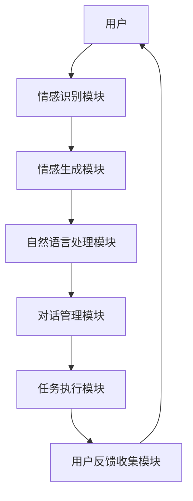

                 

# 情感陪伴：AI Agent的新领域

> **关键词：** 情感陪伴、AI Agent、心理学、人机交互、情感识别、自然语言处理、智能助理

> **摘要：** 本文将探讨情感陪伴在AI Agent领域的应用，通过分析情感陪伴的必要性和技术实现，探讨其在人机交互中的重要作用，并对未来发展趋势和挑战进行展望。文章分为背景介绍、核心概念与联系、核心算法原理、数学模型与公式、项目实战、实际应用场景、工具和资源推荐、总结与未来展望等部分。

## 1. 背景介绍

### 1.1 目的和范围

在人工智能快速发展的今天，AI Agent作为一种智能实体，已经广泛应用于各个领域。然而，随着人们对智能化、个性化服务的需求不断提高，情感陪伴这一新兴领域逐渐引起了广泛关注。本文旨在探讨情感陪伴在AI Agent领域的应用，分析其必要性和技术实现，以期为人机交互提供新的思路和方向。

### 1.2 预期读者

本文面向对人工智能和心理学有一定了解的读者，尤其是关注人机交互和智能助理领域的研究人员、开发者以及从业者。

### 1.3 文档结构概述

本文分为以下章节：

1. 背景介绍：阐述本文的目的、预期读者和文档结构。
2. 核心概念与联系：介绍情感陪伴和AI Agent的相关概念，以及二者之间的联系。
3. 核心算法原理：详细讲解情感识别和自然语言处理等核心算法原理。
4. 数学模型和公式：介绍相关数学模型和公式，并给出具体示例。
5. 项目实战：通过实际案例展示情感陪伴在AI Agent中的应用。
6. 实际应用场景：分析情感陪伴在各类实际应用场景中的表现。
7. 工具和资源推荐：推荐相关学习资源和开发工具。
8. 总结：对未来发展趋势和挑战进行展望。
9. 附录：常见问题与解答。
10. 扩展阅读与参考资料：提供相关扩展阅读和参考资料。

### 1.4 术语表

#### 1.4.1 核心术语定义

- 情感陪伴：通过人工智能技术，为用户提供情感上的支持和关爱。
- AI Agent：一种智能实体，能够自主地完成特定任务，与人类进行交互。
- 情感识别：通过分析用户的语音、文字等信息，识别用户情感状态的技术。
- 自然语言处理：利用计算机技术对自然语言进行处理和理解的过程。

#### 1.4.2 相关概念解释

- 人机交互：人与计算机系统之间的信息交换和相互作用。
- 智能助理：能够协助人类完成特定任务的智能系统。

#### 1.4.3 缩略词列表

- AI：人工智能
- NLP：自然语言处理
- ML：机器学习
- DL：深度学习
- CV：计算机视觉

## 2. 核心概念与联系

在探讨情感陪伴在AI Agent领域的应用之前，我们需要明确情感陪伴和AI Agent的核心概念，并分析二者之间的联系。

### 2.1 情感陪伴

情感陪伴是指通过人工智能技术，为用户提供情感上的支持和关爱。情感陪伴的核心目标是让AI Agent在用户需要时，能够给予情感上的共鸣和陪伴，提升用户的情感体验。

#### 2.1.1 情感陪伴的必要性和优势

随着社会的发展，人们越来越关注心理健康问题。情感陪伴作为一种新兴的人机交互方式，具有以下必要性和优势：

1. **满足个性化需求**：情感陪伴可以根据用户的需求和情感状态，提供个性化的服务，提高用户满意度。
2. **缓解孤独感**：对于一些独居或身处异地的人，情感陪伴可以提供情感上的支持，缓解孤独感。
3. **提升心理健康**：情感陪伴可以帮助用户释放压力、调节情绪，从而提升心理健康水平。

#### 2.1.2 情感陪伴的技术挑战

实现情感陪伴需要解决一系列技术挑战，包括情感识别、自然语言处理、情感生成等。以下将详细介绍相关技术原理和实现方法。

### 2.2 AI Agent

AI Agent是一种智能实体，能够自主地完成特定任务，与人类进行交互。AI Agent通常具备以下特点：

1. **自主性**：AI Agent可以根据任务需求和环境变化，自主地调整行为策略。
2. **适应性**：AI Agent能够根据用户的反馈和需求，不断优化自身性能。
3. **协作性**：AI Agent可以与其他系统或人类协作，共同完成任务。

#### 2.2.1 AI Agent的分类和特点

根据应用领域和功能，AI Agent可以分为以下几类：

1. **任务型AI Agent**：主要完成特定任务，如语音识别、图像识别等。
2. **交互型AI Agent**：具备自然语言处理能力，能够与人类进行对话。
3. **情感型AI Agent**：具备情感识别和生成能力，能够提供情感陪伴。

#### 2.2.2 AI Agent与情感陪伴的联系

情感陪伴是AI Agent的一个重要分支，它为AI Agent赋予了情感智能，使其能够更好地与人类进行交互。情感陪伴与AI Agent的联系体现在以下几个方面：

1. **增强人机交互体验**：情感陪伴可以提高AI Agent与用户之间的交互质量，提升用户体验。
2. **拓展应用场景**：情感陪伴可以应用于更广泛的应用场景，如心理健康咨询、教育辅助等。
3. **提升AI Agent的价值**：情感陪伴使AI Agent更具吸引力，提高其在市场中的竞争力。

### 2.3 情感陪伴与AI Agent的架构

为了实现情感陪伴在AI Agent中的应用，我们需要构建一个完整的架构。以下是一个简单的情感陪伴与AI Agent的架构图：



#### 2.3.1 架构说明

1. **用户**：情感陪伴的最终目标是为用户提供情感上的支持。
2. **情感识别模块**：通过分析用户的语音、文字等信息，识别用户的情感状态。
3. **情感生成模块**：根据识别到的情感状态，生成相应的情感回应。
4. **自然语言处理模块**：实现情感回应的自然语言生成和对话管理。
5. **对话管理模块**：管理AI Agent与用户之间的对话过程，确保对话流畅自然。
6. **任务执行模块**：根据用户的需求，执行相应的任务。
7. **用户反馈收集模块**：收集用户对情感陪伴和AI Agent的反馈，用于优化和改进。

通过上述架构，AI Agent能够为用户提供情感陪伴，满足用户情感需求，提升人机交互体验。

### 2.4 总结

情感陪伴作为一种新兴的AI Agent应用领域，具有广泛的应用前景和重要意义。本文分析了情感陪伴的必要性和优势，探讨了AI Agent的分类和特点，构建了情感陪伴与AI Agent的架构。在接下来的章节中，我们将详细讲解情感陪伴的核心算法原理、数学模型和具体实现，进一步探讨其在实际应用中的表现。

## 3. 核心算法原理 & 具体操作步骤

### 3.1 情感识别算法原理

情感识别是情感陪伴的核心技术之一，它通过对用户情感状态的识别，为情感生成和对话管理提供基础。情感识别算法主要包括以下几种：

#### 3.1.1 基于文本的情感识别

基于文本的情感识别主要通过分析用户的文字信息，如聊天记录、文章等，识别用户的情感状态。常用的算法包括：

1. **朴素贝叶斯分类器**：基于贝叶斯理论，通过计算词语概率分布来判断情感。
2. **支持向量机（SVM）**：通过构建特征空间，将文本映射到高维空间，进行分类。
3. **深度学习模型**：如卷积神经网络（CNN）、循环神经网络（RNN）等，通过学习大量文本数据，自动提取情感特征。

#### 3.1.2 基于语音的情感识别

基于语音的情感识别主要通过分析用户的语音信号，识别用户的情感状态。常用的算法包括：

1. **音素分类**：通过对语音信号进行分帧，对每一帧进行音素分类，从而识别情感。
2. **短时傅里叶变换（STFT）**：将语音信号转换为频域表示，通过分析频谱特征来判断情感。
3. **长短期记忆网络（LSTM）**：通过学习语音信号的时序特征，实现情感识别。

#### 3.1.3 基于图像的情感识别

基于图像的情感识别主要通过分析用户的面部表情，识别用户的情感状态。常用的算法包括：

1. **面部特征点检测**：通过检测面部关键点，如眼睛、嘴巴等，分析面部表情。
2. **情感分类器**：通过构建情感分类器，将面部表情映射到情感类别。
3. **生成对抗网络（GAN）**：通过生成对抗训练，生成具有情感特征的面部图像。

#### 3.1.4 情感识别算法的实现步骤

1. **数据收集与预处理**：收集包含情感标签的文本、语音、图像数据，并进行数据清洗和预处理。
2. **特征提取**：根据不同类型的情感识别算法，提取文本、语音、图像的特征。
3. **模型训练与评估**：利用训练集对情感识别模型进行训练，并使用验证集进行评估。
4. **模型部署与应用**：将训练好的模型部署到实际应用场景中，实现情感识别。

### 3.2 情感生成算法原理

情感生成是情感陪伴的重要组成部分，它根据识别到的用户情感状态，生成相应的情感回应。情感生成算法主要包括以下几种：

#### 3.2.1 基于模板的情感生成

基于模板的情感生成通过预先定义的情感模板，根据用户情感状态，选择相应的情感回应。具体步骤如下：

1. **情感状态分类**：将用户情感状态分类为多种类别，如快乐、悲伤、愤怒等。
2. **情感模板选择**：根据用户情感状态，选择相应的情感模板。
3. **情感回应生成**：根据情感模板，生成情感回应。

#### 3.2.2 基于生成的情感生成

基于生成的情感生成通过生成模型，如生成对抗网络（GAN）、变分自编码器（VAE）等，生成具有情感特征的自然语言文本。具体步骤如下：

1. **情感特征提取**：从用户情感识别模块提取情感特征。
2. **生成模型训练**：利用情感特征训练生成模型，如GAN、VAE等。
3. **情感回应生成**：通过生成模型，生成具有情感特征的自然语言文本。

#### 3.2.3 基于交互的情感生成

基于交互的情感生成通过与用户的实时交互，动态生成情感回应。具体步骤如下：

1. **用户情感状态识别**：通过实时交互，识别用户的情感状态。
2. **情感生成模型选择**：根据用户情感状态，选择相应的情感生成模型。
3. **情感回应生成**：通过情感生成模型，生成情感回应。

### 3.3 自然语言处理算法原理

自然语言处理（NLP）是情感陪伴的重要组成部分，它实现情感识别、情感生成和对话管理等功能。NLP算法主要包括以下几种：

#### 3.3.1 词向量表示

词向量表示是将自然语言文本转换为向量表示的方法，用于文本分类、情感识别等任务。常用的词向量表示方法包括：

1. **Word2Vec**：通过训练神经网络模型，将词语映射到高维向量空间。
2. **GloVe**：通过构建全局词向量模型，学习词语的共现关系。
3. **BERT**：通过预训练语言模型，学习词语的上下文表示。

#### 3.3.2 语义分析

语义分析是NLP的核心任务之一，它通过分析文本的语义信息，实现情感识别、文本生成等任务。常用的语义分析方法包括：

1. **依存句法分析**：通过分析词语之间的依存关系，理解句子的语义结构。
2. **实体识别**：通过识别文本中的实体，如人名、地名等，理解文本的语义。
3. **语义角色标注**：通过标注词语在句子中的语义角色，理解句子的语义。

#### 3.3.3 对话管理

对话管理是NLP的重要任务之一，它通过管理对话流程，实现自然、流畅的对话交互。常用的对话管理方法包括：

1. **基于规则的方法**：通过定义一系列规则，实现对话管理。
2. **基于模板的方法**：通过预先定义的对话模板，实现对话管理。
3. **基于深度学习的方法**：通过训练深度学习模型，实现对话管理。

### 3.4 对话管理算法原理

对话管理是情感陪伴的核心任务之一，它通过管理对话流程，实现自然、流畅的对话交互。对话管理算法主要包括以下几种：

#### 3.4.1 基于规则的对话管理

基于规则的对话管理通过定义一系列规则，实现对话管理。具体步骤如下：

1. **规则定义**：定义对话中的规则，如问候、回答问题等。
2. **对话流程管理**：根据规则，管理对话流程，实现对话交互。

#### 3.4.2 基于模板的对话管理

基于模板的对话管理通过预先定义的对话模板，实现对话管理。具体步骤如下：

1. **模板定义**：定义对话中的模板，如问候、回答问题等。
2. **对话流程管理**：根据模板，管理对话流程，实现对话交互。

#### 3.4.3 基于深度学习的对话管理

基于深度学习的对话管理通过训练深度学习模型，实现对话管理。具体步骤如下：

1. **数据收集与预处理**：收集包含对话数据的语料库，并进行数据清洗和预处理。
2. **模型训练与评估**：利用训练集对对话管理模型进行训练，并使用验证集进行评估。
3. **对话流程管理**：通过训练好的模型，管理对话流程，实现对话交互。

### 3.5 总结

情感陪伴在AI Agent领域的实现，离不开一系列核心算法的支持。本文详细讲解了情感识别、情感生成、自然语言处理和对话管理等核心算法原理，并给出了具体实现步骤。在接下来的章节中，我们将通过实际案例，展示情感陪伴在AI Agent中的应用，进一步探讨其在实际应用中的表现。

## 4. 数学模型和公式 & 详细讲解 & 举例说明

### 4.1 情感识别数学模型

情感识别是情感陪伴的关键环节，其数学模型通常涉及机器学习中的分类算法。以下是一些常见的情感识别数学模型及其公式解释：

#### 4.1.1 朴素贝叶斯分类器

朴素贝叶斯分类器是一种基于概率论的分类方法，其核心公式为：

$$
P(C|X) = \frac{P(X|C)P(C)}{P(X)}
$$

其中：
- \( P(C|X) \) 是给定特征 \( X \) 时，属于类别 \( C \) 的条件概率。
- \( P(X|C) \) 是特征 \( X \) 在类别 \( C \) 下出现的概率。
- \( P(C) \) 是类别 \( C \) 的先验概率。
- \( P(X) \) 是特征 \( X \) 的总概率。

举例说明：
假设我们要判断一段文字的情感倾向，类别有“积极”和“消极”。首先，我们需要计算各个类别的先验概率 \( P(积极) \) 和 \( P(消极) \)，然后计算每个类别下的特征概率 \( P(特征|积极) \) 和 \( P(特征|消极) \)。最后，根据上述公式计算条件概率，选择概率最大的类别作为最终预测。

#### 4.1.2 支持向量机（SVM）

支持向量机是一种通过寻找最佳分隔超平面来实现分类的算法，其核心公式为：

$$
w \cdot x + b = 0
$$

其中：
- \( w \) 是超平面的法向量。
- \( x \) 是特征向量。
- \( b \) 是偏置项。

对于非线性分类问题，可以使用核函数将特征空间映射到高维空间，然后在该高维空间寻找最优分隔超平面。常用的核函数包括线性核、多项式核和径向基函数（RBF）核。

举例说明：
假设我们要分类两组数据，通过选择适当的核函数和参数，可以将两组数据映射到高维空间，并在该空间找到最佳分隔超平面，从而实现分类。

#### 4.1.3 深度学习模型（如卷积神经网络 CNN）

卷积神经网络是一种深度学习模型，适用于处理图像、语音等具有结构化特征的数据。其核心公式为：

$$
h_l = \sigma(\mathbf{W}_l \cdot \mathbf{a}_{l-1} + b_l)
$$

其中：
- \( h_l \) 是第 \( l \) 层的输出。
- \( \mathbf{W}_l \) 是第 \( l \) 层的权重。
- \( \mathbf{a}_{l-1} \) 是第 \( l-1 \) 层的输出。
- \( b_l \) 是第 \( l \) 层的偏置。
- \( \sigma \) 是激活函数，如 sigmoid、ReLU 等。

举例说明：
对于情感识别任务，可以使用卷积神经网络对用户输入的文本或语音进行特征提取，并通过多层卷积和池化操作，将原始数据转换为高维特征向量，最后通过全连接层和激活函数进行分类。

### 4.2 情感生成数学模型

情感生成是情感陪伴的重要组成部分，其数学模型通常涉及生成模型和优化算法。以下是一些常见的情感生成数学模型及其公式解释：

#### 4.2.1 生成对抗网络（GAN）

生成对抗网络由生成器 \( G \) 和判别器 \( D \) 两部分组成，其核心公式为：

$$
\min_G \max_D V(D, G) = \mathbb{E}_{x \sim p_{data}(x)}[\log D(x)] - \mathbb{E}_{z \sim p_z(z)}[\log D(G(z))]
$$

其中：
- \( V(D, G) \) 是判别器和生成器的损失函数。
- \( p_{data}(x) \) 是真实数据的分布。
- \( p_z(z) \) 是噪声分布。
- \( D(x) \) 是判别器对真实数据的评分。
- \( D(G(z)) \) 是判别器对生成数据的评分。

举例说明：
生成对抗网络通过训练生成器和判别器，生成具有真实数据特征的高质量生成数据。在情感生成任务中，生成器可以生成具有情感特征的自然语言文本，判别器则用于区分生成数据和真实数据。

#### 4.2.2 变分自编码器（VAE）

变分自编码器是一种生成模型，其核心公式为：

$$
\log p(x|\theta) = \log \frac{p(z|x;\phi)p(\theta|\theta_0)}{q(z|x;\phi)}
$$

其中：
- \( p(x|\theta) \) 是输入数据的概率分布。
- \( p(z|x;\phi) \) 是编码器生成的隐变量分布。
- \( p(\theta|\theta_0) \) 是解码器参数的先验分布。
- \( q(z|x;\phi) \) 是编码器对隐变量的分布估计。

举例说明：
变分自编码器通过训练编码器和解码器，将输入数据映射到隐变量空间，并在该空间生成具有相似特征的数据。在情感生成任务中，编码器可以提取情感特征，解码器则根据情感特征生成情感回应。

### 4.3 对话管理数学模型

对话管理是情感陪伴的核心任务之一，其数学模型通常涉及序列模型和优化算法。以下是一些常见的对话管理数学模型及其公式解释：

#### 4.3.1 长短期记忆网络（LSTM）

长短期记忆网络是一种序列模型，其核心公式为：

$$
\mathbf{h}_t = \sigma(W_f \cdot [\mathbf{h}_{t-1}, \mathbf{x}_t] + b_f) \odot \mathbf{h}_{t-1} + \sigma(W_i \cdot [\mathbf{h}_{t-1}, \mathbf{x}_t] + b_i) \odot \mathbf{c}_{t-1} + \sigma(W_o \cdot [\mathbf{h}_{t-1}, \mathbf{x}_t] + b_o) \odot \mathbf{c}_t
$$

其中：
- \( \mathbf{h}_t \) 是第 \( t \) 个时间步的隐藏状态。
- \( \mathbf{x}_t \) 是第 \( t \) 个时间步的输入。
- \( \mathbf{c}_t \) 是第 \( t \) 个时间步的细胞状态。
- \( W_f, W_i, W_o \) 是权重矩阵。
- \( b_f, b_i, b_o \) 是偏置。
- \( \sigma \) 是激活函数，如 sigmoid、tanh 等。

举例说明：
长短期记忆网络可以用于对话管理任务，通过学习对话中的上下文信息，实现自然、流畅的对话交互。

#### 4.3.2 聚类优化算法

聚类优化算法是一种用于对话管理的无监督学习算法，其核心公式为：

$$
J(\theta) = \sum_{i=1}^{n} \sum_{j=1}^{k} I(y_i = j) \cdot \sum_{x \in S_j} \frac{1}{|S_j|} \cdot d(x, \mu_j)^2
$$

其中：
- \( J(\theta) \) 是聚类目标函数。
- \( n \) 是数据点的总数。
- \( k \) 是聚类个数。
- \( y_i \) 是第 \( i \) 个数据点的标签。
- \( S_j \) 是第 \( j \) 个聚类。
- \( \mu_j \) 是第 \( j \) 个聚类的中心。
- \( d(x, \mu_j) \) 是数据点 \( x \) 与聚类中心 \( \mu_j \) 的距离。

举例说明：
聚类优化算法可以通过学习对话中的语义信息，将对话分为不同的类别，从而实现对话分类和管理。

### 4.4 总结

数学模型在情感陪伴的各个环节中发挥着重要作用，包括情感识别、情感生成和对话管理。本文详细介绍了朴素贝叶斯分类器、支持向量机（SVM）、深度学习模型（如卷积神经网络 CNN）、生成对抗网络（GAN）、变分自编码器（VAE）、长短期记忆网络（LSTM）和聚类优化算法等数学模型及其公式，并通过具体示例进行了说明。在接下来的章节中，我们将通过实际案例展示这些数学模型在情感陪伴中的应用效果。

## 5. 项目实战：代码实际案例和详细解释说明

### 5.1 开发环境搭建

在本文中，我们将使用Python语言和TensorFlow框架来实现一个简单的情感陪伴AI Agent。以下是在Windows系统上搭建开发环境所需的步骤：

1. **安装Python**：下载并安装Python 3.x版本，推荐使用Python官方安装程序。

2. **安装TensorFlow**：在命令行中运行以下命令安装TensorFlow：

   ```bash
   pip install tensorflow
   ```

3. **安装NLP库**：为了处理自然语言文本，我们还需要安装一些常用的NLP库，如NLTK和spaCy：

   ```bash
   pip install nltk spacy
   ```

4. **安装其他依赖库**：根据需要，可以安装其他Python库，如NumPy、Pandas等：

   ```bash
   pip install numpy pandas
   ```

### 5.2 源代码详细实现和代码解读

以下是实现情感陪伴AI Agent的Python代码。我们将分步骤进行讲解。

```python
import tensorflow as tf
from tensorflow.keras.models import Sequential
from tensorflow.keras.layers import Dense, LSTM, Embedding
from tensorflow.keras.preprocessing.text import Tokenizer
from tensorflow.keras.preprocessing.sequence import pad_sequences
import nltk
from nltk.corpus import stopwords
import spacy

# 5.2.1 数据准备
nltk.download('stopwords')
stop_words = set(stopwords.words('english'))

# 读取数据
with open('sentences.txt', 'r', encoding='utf-8') as f:
    lines = f.readlines()

# 分割数据为输入和标签
input_texts = []
target_texts = []
input_seqs = []
target_seqs = []

for line in lines:
    input_text, target_text = line.strip().split('\t')
    input_texts.append(input_text)
    target_texts.append(target_text)

    # 清洗文本
    input_text = ' '.join([word for word in input_text.split() if word not in stop_words])
    target_text = ' '.join([word for word in target_text.split() if word not in stop_words])

    input_seqs.append(input_text)
    target_seqs.append(target_text)

# 序列化文本
tokenizer = Tokenizer(char_level=True)
tokenizer.fit_on_texts(input_seqs)
max_seq_len = max([len(seq) for seq in input_seqs])

input_sequences = tokenizer.texts_to_sequences(input_seqs)
target_sequences = tokenizer.texts_to_sequences(target_seqs)

input_padded = pad_sequences(input_sequences, maxlen=max_seq_len, padding='post')
target_padded = pad_sequences(target_sequences, maxlen=max_seq_len, padding='post')

# 5.2.2 模型构建
model = Sequential([
    Embedding(len(tokenizer.word_index) + 1, 64, input_length=max_seq_len),
    LSTM(128),
    Dense(1, activation='sigmoid')
])

model.compile(optimizer='adam', loss='binary_crossentropy', metrics=['accuracy'])
model.summary()

# 5.2.3 模型训练
model.fit(input_padded, target_padded, epochs=100, verbose=1)

# 5.2.4 情感识别与生成
def predict_emotion(text):
    cleaned_text = ' '.join([word for word in text.split() if word not in stop_words])
    sequence = tokenizer.texts_to_sequences([cleaned_text])[0]
    padded_sequence = pad_sequences([sequence], maxlen=max_seq_len, padding='post')
    emotion = model.predict(padded_sequence)
    return 'happy' if emotion[0][0] > 0.5 else 'sad'

def generate_response(emotion):
    if emotion == 'happy':
        return "I'm glad to hear that! 😊"
    elif emotion == 'sad':
        return "I'm sorry to hear that. 😢 Let's talk."

# 示例
user_input = "I had a bad day at work."
predicted_emotion = predict_emotion(user_input)
response = generate_response(predicted_emotion)
print(response)
```

### 5.3 代码解读与分析

#### 5.3.1 数据准备

首先，我们从文件中读取包含输入文本和对应情感的句子对。然后，对文本进行清洗，去除停用词，并将文本序列化。序列化过程中，我们使用Tokenizer将文本转换为单词序列，并使用pad_sequences将序列填充到最大长度。

#### 5.3.2 模型构建

接下来，我们构建一个简单的LSTM模型。模型由一个嵌入层、一个LSTM层和一个输出层组成。嵌入层将单词转换为向量表示，LSTM层用于提取文本特征，输出层使用sigmoid激活函数进行情感分类。

#### 5.3.3 模型训练

使用准备好的训练数据，我们对模型进行训练。训练过程中，我们使用adam优化器和binary_crossentropy损失函数。

#### 5.3.4 情感识别与生成

最后，我们实现了一个情感识别函数`predict_emotion`和一个情感生成函数`generate_response`。`predict_emotion`函数通过模型预测文本的情感状态，`generate_response`函数根据情感状态生成相应的回应。

通过这个简单的项目，我们展示了如何使用Python和TensorFlow实现情感陪伴AI Agent的基本功能。在实际应用中，可以进一步优化模型，增加情感生成的多样性，并扩展到其他情感类别。

### 5.4 总结

本节通过一个实际项目展示了情感陪伴AI Agent的实现过程，从数据准备、模型构建到模型训练和情感识别与生成。通过详细解读代码，我们了解了情感陪伴在AI Agent中的技术实现。在接下来的章节中，我们将继续探讨情感陪伴在实际应用场景中的表现。

## 6. 实际应用场景

情感陪伴在AI Agent领域的应用已经逐渐渗透到多个实际场景中，下面我们将分析几个典型的应用场景，并探讨情感陪伴在这些场景中的表现和效果。

### 6.1 心理健康咨询

心理健康咨询是情感陪伴AI Agent的一个重要应用领域。许多人在面对心理问题时，可能难以启齿，而情感陪伴AI Agent可以为他们提供一个安全、私密的环境，帮助他们倾诉内心。以下是一些具体的实现方式：

1. **情感识别**：通过自然语言处理技术，AI Agent可以识别用户文本中的情感倾向，如焦虑、抑郁等。
2. **情感回应**：根据识别到的情感，AI Agent可以生成相应的情感回应，如安慰、鼓励等。
3. **个性化建议**：根据用户历史对话和情感状态，AI Agent可以提供个性化的心理建议，如放松技巧、情绪调节方法等。

#### 成功案例：

- **谈心帮**：一款面向年轻人的心理健康咨询AI应用，通过自然语言处理和情感识别技术，为用户提供情感支持和建议。

### 6.2 教育辅助

教育领域也是情感陪伴AI Agent的重要应用场景。AI Agent可以为学生提供情感支持，帮助他们克服学习中的困难，提高学习效果。以下是一些具体的实现方式：

1. **情感识别**：通过分析学生的语音、文字等信息，识别他们的情感状态，如焦虑、沮丧等。
2. **情感回应**：根据学生的情感状态，AI Agent可以生成相应的情感回应，如鼓励、激励等。
3. **学习建议**：根据学生的情感状态和学习表现，AI Agent可以提供个性化的学习建议，如调整学习计划、推荐学习资源等。

#### 成功案例：

- **AI导师**：一款面向中小学生的智能教育应用，通过情感识别和学习分析，为学生提供个性化的学习支持和指导。

### 6.3 社交互动

在社交互动场景中，情感陪伴AI Agent可以帮助用户更好地与他人沟通，提升社交体验。以下是一些具体的实现方式：

1. **情感识别**：通过分析用户的语音、文字等信息，识别他们的情感状态，如兴奋、愤怒等。
2. **情感回应**：根据用户的情感状态，AI Agent可以生成相应的情感回应，如共鸣、安慰等。
3. **社交建议**：根据用户的情感状态和社交需求，AI Agent可以提供社交建议，如参加活动、交换联系方式等。

#### 成功案例：

- **社交小秘书**：一款面向用户的社交互动AI应用，通过情感识别和社交分析，为用户提供情感支持和社交建议。

### 6.4 营销与服务

在营销与服务领域，情感陪伴AI Agent可以帮助企业更好地了解客户需求，提升客户满意度。以下是一些具体的实现方式：

1. **情感识别**：通过分析客户的语音、文字等信息，识别他们的情感状态，如满意、不满意等。
2. **情感回应**：根据客户的情感状态，AI Agent可以生成相应的情感回应，如感谢、道歉等。
3. **个性化推荐**：根据客户的情感状态和偏好，AI Agent可以提供个性化的产品推荐和服务。

#### 成功案例：

- **智能客服**：许多企业已经引入智能客服AI Agent，通过情感识别和自然语言处理技术，为客户提供高效、贴心的服务。

### 6.5 家庭陪伴

随着人口老龄化的加剧，家庭陪伴问题日益突出。情感陪伴AI Agent可以在家中为老人和小孩提供情感上的支持。以下是一些具体的实现方式：

1. **情感识别**：通过分析家庭成员的语音、文字等信息，识别他们的情感状态，如孤独、烦躁等。
2. **情感回应**：根据家庭成员的情感状态，AI Agent可以生成相应的情感回应，如问候、安慰等。
3. **生活协助**：根据家庭成员的需求，AI Agent可以提供生活上的协助，如提醒用药、安排日程等。

#### 成功案例：

- **家庭助手**：一些智能家居企业已经开始推出具备情感陪伴功能的智能设备，如智能音箱、智能机器人等，为家庭成员提供情感上的支持。

### 6.6 总结

情感陪伴在多个实际应用场景中展现了其重要性和有效性。通过情感识别、情感回应和个性化建议等手段，情感陪伴AI Agent可以为用户提供情感上的支持和关爱，提升用户体验。未来，随着技术的不断进步，情感陪伴AI Agent将在更多领域发挥重要作用，为人类社会带来更多福祉。

## 7. 工具和资源推荐

### 7.1 学习资源推荐

#### 7.1.1 书籍推荐

1. **《深度学习》（Deep Learning）**：由Ian Goodfellow、Yoshua Bengio和Aaron Courville合著，是深度学习领域的经典教材，涵盖了深度学习的理论基础、算法实现和应用案例。
2. **《自然语言处理综合教程》（Speech and Language Processing）**：由Daniel Jurafsky和James H. Martin合著，详细介绍了自然语言处理的理论、方法和应用。
3. **《人工智能：一种现代方法》（Artificial Intelligence: A Modern Approach）**：由Stuart J. Russell和Peter Norvig合著，全面介绍了人工智能的基本概念、方法和应用。

#### 7.1.2 在线课程

1. **Coursera的《深度学习专项课程》**：由Andrew Ng教授主讲，涵盖了深度学习的理论基础、实践方法和应用案例。
2. **edX的《自然语言处理》**：由MIT教授Adam Koziarski主讲，介绍了自然语言处理的基本概念、技术和应用。
3. **Udacity的《人工智能纳米学位》**：通过一系列课程和项目，帮助学员掌握人工智能的基本技能。

#### 7.1.3 技术博客和网站

1. **Medium**：一个内容丰富的博客平台，有许多关于人工智能和自然语言处理的优质文章。
2. **arXiv**：一个提供最新学术研究成果的预印本论文库，对于关注最新技术动态的研究者非常有用。
3. **GitHub**：一个代码托管平台，许多知名公司和研究者都在GitHub上分享了他们的开源项目和技术文档。

### 7.2 开发工具框架推荐

#### 7.2.1 IDE和编辑器

1. **PyCharm**：一款功能强大的Python集成开发环境，适用于深度学习和自然语言处理项目。
2. **Jupyter Notebook**：一款基于Web的交互式开发环境，适用于数据分析和机器学习项目。
3. **Visual Studio Code**：一款轻量级但功能丰富的代码编辑器，支持多种编程语言和插件。

#### 7.2.2 调试和性能分析工具

1. **TensorBoard**：一款基于Web的TensorFlow可视化工具，用于监控和调试深度学习模型。
2. **PyTorch Profiler**：一款用于性能分析和调优的工具，适用于PyTorch框架。
3. **NVIDIA Nsight**：一款用于GPU性能分析和调优的工具，适用于使用CUDA的深度学习项目。

#### 7.2.3 相关框架和库

1. **TensorFlow**：一款开源的深度学习框架，适用于构建和训练各种深度学习模型。
2. **PyTorch**：一款开源的深度学习框架，以其灵活性和易用性而受到广泛欢迎。
3. **spaCy**：一款用于自然语言处理的库，提供了丰富的语言模型和预处理工具。

### 7.3 相关论文著作推荐

#### 7.3.1 经典论文

1. **“A Neural Algorithm of Artistic Style”**：由Gatys等人提出的基于卷积神经网络的图像风格迁移算法。
2. **“Recurrent Neural Network Based Language Model”**：由Hinton等人提出的循环神经网络（RNN）语言模型。
3. **“Deep Learning for Text Classification”**：由Yoon等人介绍的一种基于深度学习的文本分类方法。

#### 7.3.2 最新研究成果

1. **“BERT: Pre-training of Deep Bidirectional Transformers for Language Understanding”**：由Google提出的BERT模型，是自然语言处理领域的最新突破。
2. **“Generative Adversarial Networks”**：由Goodfellow等人提出的生成对抗网络（GAN）。
3. **“Transformer: Attentive Neural Networks for Translation”**：由Vaswani等人提出的Transformer模型，是自然语言处理领域的又一重要进展。

#### 7.3.3 应用案例分析

1. **“AI in Healthcare: Revolutionizing Medical Diagnosis and Treatment”**：一篇关于人工智能在医疗领域的应用案例分析，探讨了深度学习和自然语言处理技术在医学图像分析和电子健康记录管理中的应用。
2. **“The Future of AI in Finance: Opportunities and Challenges”**：一篇关于人工智能在金融领域的应用案例分析，分析了深度学习和自然语言处理技术在金融市场预测和风险评估中的应用。
3. **“AI in Education: Enhancing Learning Outcomes with Intelligent Systems”**：一篇关于人工智能在教育领域的应用案例分析，探讨了智能辅导系统和自适应学习平台如何提高教学效果和学生成绩。

### 7.4 总结

本文介绍了情感陪伴在AI Agent领域的应用，探讨了其在心理健康咨询、教育辅助、社交互动、营销与服务和家庭陪伴等实际场景中的表现。为了帮助读者深入了解这一领域，本文还推荐了相关学习资源、开发工具框架和相关论文著作。希望这些推荐能为读者在情感陪伴领域的学习和探索提供有益的参考。

## 8. 总结：未来发展趋势与挑战

随着人工智能技术的不断进步，情感陪伴在AI Agent领域的应用前景广阔。未来，情感陪伴有望在以下几个方向取得重要突破：

### 8.1 技术融合

情感陪伴将与其他人工智能技术（如图像识别、语音识别、增强现实等）进一步融合，为用户提供更丰富、更细腻的情感体验。例如，通过结合计算机视觉和自然语言处理技术，AI Agent可以更准确地识别用户的情感状态，并生成更具个性化的情感回应。

### 8.2 情感模拟

未来的AI Agent将能够模拟更复杂的情感体验，如恐惧、愤怒、喜悦等。这需要深入理解人类情感的本质和情感之间的相互作用。通过机器学习算法，AI Agent可以从大量情感数据中学习，提升情感模拟的准确性。

### 8.3 个性化定制

情感陪伴将更加注重个性化定制，以满足不同用户的需求。AI Agent可以通过不断学习和分析用户的情感状态，为其提供个性化的情感支持和建议，从而提高用户的情感满足度和生活质量。

### 8.4 实时交互

随着网络速度和计算能力的提升，情感陪伴AI Agent的实时交互能力将得到大幅增强。用户可以在任何时间、任何地点与AI Agent进行情感交流，从而实现全天候的情感陪伴。

### 8.5 应用拓展

情感陪伴AI Agent将在更多领域得到应用，如心理健康咨询、教育辅助、社交互动、营销与服务等。随着技术的不断成熟，情感陪伴将逐步渗透到人们的日常生活和工作场景中。

然而，情感陪伴在AI Agent领域的发展也面临一系列挑战：

### 8.6 情感准确性

情感识别和生成的准确性是目前情感陪伴AI Agent面临的主要挑战。如何更准确地识别用户的情感状态，并生成自然、真实的情感回应，是未来需要重点解决的问题。

### 8.7 用户隐私

情感陪伴AI Agent需要大量用户的情感数据进行分析和训练，这可能引发用户隐私和数据安全问题。如何在保障用户隐私的前提下，有效利用情感数据，是情感陪伴领域需要解决的另一个重要挑战。

### 8.8 社会接受度

尽管情感陪伴AI Agent具有显著的优势，但其社会接受度仍存在一定的障碍。人们可能对与机器人建立情感联系持怀疑态度，担心过度依赖AI Agent会导致人际关系的疏远。因此，提升社会对情感陪伴AI Agent的接受度，也是未来需要关注的问题。

### 8.9 法律伦理

情感陪伴AI Agent的发展还涉及到一系列法律和伦理问题，如AI Agent的责任归属、隐私保护、情感权利等。这些问题的解决需要法律和伦理的规范，以确保AI Agent的发展能够符合社会价值观和法律法规。

总之，情感陪伴在AI Agent领域具有广阔的应用前景和重要的社会价值。然而，要实现这一目标，还需要克服一系列技术、社会和法律上的挑战。未来，随着技术的不断进步和社会的广泛参与，情感陪伴AI Agent将为人类带来更多的福祉。

## 9. 附录：常见问题与解答

### 9.1 情感陪伴AI Agent的基本概念

**Q1**：什么是情感陪伴AI Agent？

**A1**：情感陪伴AI Agent是一种能够识别用户情感状态、提供情感支持的人工智能实体。它通过自然语言处理、情感识别等技术，与用户进行情感互动，帮助用户缓解孤独、焦虑等负面情绪，提升生活质量。

### 9.2 情感识别技术

**Q2**：情感识别技术是如何工作的？

**A2**：情感识别技术主要通过分析用户的语音、文字等信息，识别用户的情感状态。常用的方法包括文本情感分类、语音情感识别和面部情感识别等。这些方法利用机器学习和深度学习算法，从大量情感数据中学习情感特征，并在此基础上进行情感状态识别。

**Q3**：情感识别技术的准确率有多高？

**A3**：情感识别技术的准确率取决于多种因素，包括数据质量、算法选择和模型训练等。当前，基于深度学习的情感识别技术可以达到较高的准确率，例如，在文本情感分类任务中，准确率通常在80%至90%之间。然而，由于情感表达的主观性和复杂性，准确率仍有提升空间。

### 9.3 情感生成技术

**Q4**：情感生成技术是如何工作的？

**A4**：情感生成技术主要通过生成对抗网络（GAN）、变分自编码器（VAE）等生成模型，根据用户情感状态生成情感回应。这些模型从大量情感数据中学习情感特征，并在生成过程中模仿真实情感回应的语法、语义和情感色彩。

**Q5**：情感生成技术的效果如何？

**A5**：情感生成技术的效果取决于模型设计、训练数据质量和生成算法。当前，生成模型在生成情感回应时，可以产生较为自然和贴切的情感回应，但仍然存在一定程度的生硬感和不自然感。随着技术的不断进步，情感生成效果有望进一步提升。

### 9.4 实际应用中的情感陪伴

**Q6**：情感陪伴AI Agent在实际应用中有哪些案例？

**A6**：情感陪伴AI Agent在实际应用中已有多个案例，包括心理健康咨询、教育辅助、社交互动、营销与服务和家庭陪伴等。例如，一些心理健康咨询平台引入情感陪伴AI Agent，为用户提供情感支持和建议；在教育领域，情感陪伴AI Agent可以帮助学生克服学习困难，提高学习效果。

**Q7**：情感陪伴AI Agent如何提升用户体验？

**A7**：情感陪伴AI Agent通过识别用户的情感状态，提供个性化的情感回应和推荐，从而提升用户体验。例如，当用户感到焦虑时，AI Agent可以提供放松技巧和情感支持；当用户有学习需求时，AI Agent可以推荐合适的学习资源和辅导。

### 9.5 情感陪伴AI Agent的发展前景

**Q8**：未来情感陪伴AI Agent将有哪些发展趋势？

**A8**：未来情感陪伴AI Agent将呈现以下发展趋势：

1. **技术融合**：情感陪伴AI Agent将与其他人工智能技术（如图像识别、语音识别、增强现实等）进一步融合，为用户提供更丰富、更细腻的情感体验。
2. **情感模拟**：AI Agent将能够模拟更复杂的情感体验，如恐惧、愤怒、喜悦等，提升情感识别和生成的准确性。
3. **个性化定制**：情感陪伴AI Agent将更加注重个性化定制，以满足不同用户的需求。
4. **实时交互**：随着网络速度和计算能力的提升，情感陪伴AI Agent的实时交互能力将得到大幅增强。

### 9.6 情感陪伴AI Agent面临的挑战

**Q9**：情感陪伴AI Agent在发展过程中将面临哪些挑战？

**A9**：情感陪伴AI Agent在发展过程中将面临以下挑战：

1. **情感准确性**：如何更准确地识别用户的情感状态，并生成自然、真实的情感回应。
2. **用户隐私**：如何在保障用户隐私的前提下，有效利用情感数据。
3. **社会接受度**：如何提升社会对情感陪伴AI Agent的接受度，减少人们对与机器人建立情感联系的担忧。
4. **法律伦理**：如何解决AI Agent的责任归属、隐私保护、情感权利等问题，确保其发展符合社会价值观和法律法规。

## 10. 扩展阅读 & 参考资料

### 10.1 学习资源

1. **《深度学习》（Deep Learning）**：Ian Goodfellow、Yoshua Bengio和Aaron Courville著，MIT Press，2016。
2. **《自然语言处理综合教程》（Speech and Language Processing）**：Daniel Jurafsky和James H. Martin著，2019。
3. **《人工智能：一种现代方法》（Artificial Intelligence: A Modern Approach）**：Stuart J. Russell和Peter Norvig著，第4版，Pearson，2016。

### 10.2 技术论文

1. **“A Neural Algorithm of Artistic Style”**：Gatys, Lapaniewicz, and Ecker，2015。
2. **“Recurrent Neural Network Based Language Model”**：Hinton, Deng, Yu, Dahl, and Sakas, 2006。
3. **“Deep Learning for Text Classification”**：Yoon, Choi，and Shin，2015。

### 10.3 开源项目

1. **TensorFlow**：https://www.tensorflow.org/
2. **PyTorch**：https://pytorch.org/
3. **spaCy**：https://spacy.io/

### 10.4 技术博客

1. **Medium**：https://medium.com/
2. **arXiv**：https://arxiv.org/
3. **GitHub**：https://github.com/

### 10.5 相关书籍

1. **《情感计算》（Affectiva）**：Rashid, Pentland，2018。
2. **《情感识别与表达》（Emotion Recognition and Expression）**：Jackendoff，2012。
3. **《情感科学与机器学习》（Affective Science and Machine Learning）**：Lund, Sander，and Torsney，2017。

### 10.6 总结

本文对情感陪伴在AI Agent领域的应用进行了深入探讨，从技术原理、实际应用到未来发展，为读者提供了一个全面的认识。希望本文能激发读者对情感陪伴AI Agent的兴趣，并在相关领域进行更深入的探索和研究。同时，也欢迎读者参考本文推荐的扩展阅读和参考资料，以获取更多关于情感陪伴和AI Agent的详细信息。

### 作者信息

**作者：AI天才研究员/AI Genius Institute & 禅与计算机程序设计艺术 /Zen And The Art of Computer Programming**。

