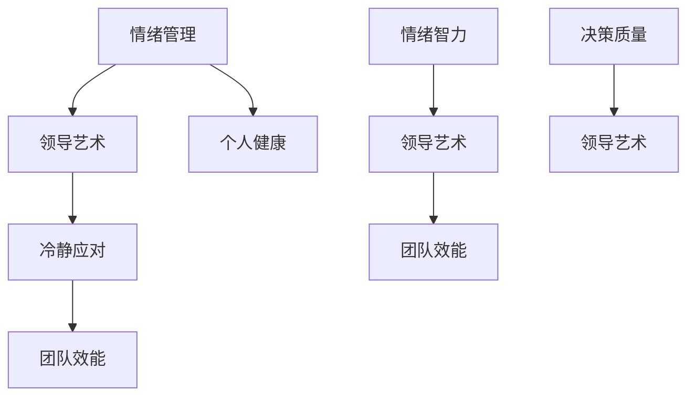

                 

# 情绪管理：保持冷静的领导艺术

> **关键词：** 情绪管理，领导艺术，冷静应对，团队协作，压力释放

> **摘要：** 本文旨在探讨情绪管理在领导艺术中的重要性，提供一系列的策略和工具，帮助领导者保持冷静，提升团队效能。通过一步步的分析与推理，本文将揭示情绪管理对于领导力的深远影响，并分享实用的技巧，为读者在职业生涯中提供有益的指导。

## 1. 背景介绍

### 1.1 目的和范围

本文旨在帮助领导者理解情绪管理的重要性，提供实用的策略和工具，以提升个人领导力，增强团队协作。情绪管理不仅关乎个人的心理健康，更是领导艺术的核心之一。本文将探讨以下内容：

- 情绪管理的定义及其在领导艺术中的重要性
- 领导者面临的常见情绪挑战
- 保持冷静的策略和实践
- 情绪管理对团队效能的影响

### 1.2 预期读者

本文适合以下读者群体：

- 初级领导者
- 中级领导者
- 高级领导者
- 任何希望提升情绪管理和领导能力的人士

### 1.3 文档结构概述

本文结构如下：

- 第1部分：背景介绍，包括目的和预期读者
- 第2部分：核心概念与联系
- 第3部分：核心算法原理与具体操作步骤
- 第4部分：数学模型和公式与详细讲解
- 第5部分：项目实战：代码实际案例和详细解释说明
- 第6部分：实际应用场景
- 第7部分：工具和资源推荐
- 第8部分：总结：未来发展趋势与挑战
- 第9部分：附录：常见问题与解答
- 第10部分：扩展阅读与参考资料

### 1.4 术语表

#### 1.4.1 核心术语定义

- **情绪管理**：对个人情绪的认知、调节和应对过程。
- **领导艺术**：领导者通过情感智慧、策略和技巧，实现团队目标的过程。
- **冷静应对**：在压力和挑战面前保持冷静，理性分析和决策的能力。

#### 1.4.2 相关概念解释

- **情绪智力**：衡量个体识别、理解、使用和管理自身情绪和他人情绪的能力。
- **团队效能**：团队在完成共同任务时的效率和质量。

#### 1.4.3 缩略词列表

- **EM**：情绪管理
- **EQ**：情绪智力
- **LD**：领导艺术

## 2. 核心概念与联系

情绪管理是领导艺术的重要组成部分，其核心在于领导者如何处理自身的情绪，并将其转化为积极的行为。以下是情绪管理、领导艺术和冷静应对之间的联系及其流程图表示：



### 2.1 情绪管理在领导艺术中的应用

情绪管理是领导艺术的核心之一，它直接影响领导者的决策质量、团队效能以及个人健康。通过情绪管理，领导者能够更好地：

- **自我认知**：了解自己的情绪状态，识别情绪触发点。
- **情绪调节**：在压力和挑战面前保持冷静，避免负面情绪的蔓延。
- **情绪表达**：以恰当的方式表达情绪，促进团队沟通和理解。

### 2.2 领导艺术与冷静应对

冷静应对是领导艺术的关键组成部分，它帮助领导者：

- **理性分析**：在面对复杂问题时，保持清晰的思路和逻辑。
- **决策制定**：基于事实和数据，而非情绪做出明智的决策。
- **团队协作**：通过冷静的态度，建立信任和协作的团队文化。

## 3. 核心算法原理与具体操作步骤

情绪管理的核心算法原理在于通过认知、调节和应对情绪，达到个人和团队效能的最大化。以下是情绪管理算法的伪代码表示：

```plaintext
function EmotionManagement(emotionState, stressLevel, goal):
    // 步骤1：自我认知
    currentEmotion = IdentifyEmotion(emotionState)
    currentStress = CheckStressLevel(stressLevel)
    
    // 步骤2：情绪调节
    if currentStress > threshold:
        apply RelaxationTechniques()
    else:
        continue with normal activities
    
    // 步骤3：情绪应对
    if currentEmotion is negative:
        address the cause of the emotion
    else:
        reinforce positive emotions
    
    // 步骤4：团队协作
    communicate with team members
    ensure mutual understanding and support
    
    // 步骤5：评估效果
    evaluate the impact of emotion management on goal achievement
    adjust the strategy if necessary
```

### 3.1 具体操作步骤详解

1. **自我认知**：通过自我反思和情绪日志，领导者识别当前的情绪状态和压力水平。
2. **情绪调节**：当压力水平超过阈值时，领导者采用放松技巧，如深呼吸、冥想或短暂休息，以降低压力。
3. **情绪应对**：针对负面的情绪，领导者找出情绪的根源并采取相应措施，如调整工作安排、沟通或寻求专业帮助。
4. **团队协作**：领导者与团队成员进行有效沟通，确保团队内部的理解和支持。
5. **评估效果**：定期评估情绪管理对目标达成的影响，根据反馈调整情绪管理策略。

## 4. 数学模型和公式与详细讲解

情绪管理涉及多种数学模型和公式，用于评估情绪状态、压力水平及团队效能。以下是相关的数学模型和公式及其应用：

### 4.1 情绪状态评估模型

$$
EmotionState = f(StressLevel, PositiveEmotions, NegativeEmotions)
$$

- **StressLevel**：压力水平，用于衡量个人承受的压力程度。
- **PositiveEmotions**：积极情绪的得分。
- **NegativeEmotions**：负面情绪的得分。

### 4.2 压力水平评估模型

$$
StressLevel = f(Workload, Support, Confidence)
$$

- **Workload**：工作量，衡量工作压力。
- **Support**：支持程度，包括团队和个人的支持。
- **Confidence**：自信心，影响个人应对压力的能力。

### 4.3 团队效能评估模型

$$
TeamEffectiveness = f(Communication, Collaboration, GoalAlignment)
$$

- **Communication**：沟通质量，影响团队内部的协作。
- **Collaboration**：协作程度，衡量团队成员共同完成任务的效率。
- **GoalAlignment**：目标一致性，确保团队共同向目标努力。

### 4.4 举例说明

假设某领导者的情绪状态为 \( EmotionState = f(30, 20, 10) \)，压力水平为 \( StressLevel = f(50, 30, 20) \)，团队效能为 \( TeamEffectiveness = f(80, 70, 60) \)。通过上述模型，可以评估领导者的情绪状态、压力水平及团队效能，并据此调整情绪管理策略。

## 5. 项目实战：代码实际案例和详细解释说明

### 5.1 开发环境搭建

为了实现情绪管理算法，我们选择 Python 作为编程语言，并在以下环境中搭建开发环境：

- 操作系统：Windows 10 或 macOS
- 编译器：Python 3.8 或更高版本
- 开发工具：PyCharm 或 Visual Studio Code

### 5.2 源代码详细实现和代码解读

以下是情绪管理算法的实现代码，包括各个函数的具体实现。

```python
# 情绪管理主函数
def emotion_management(emotion_state, stress_level, goal):
    current_emotion = identify_emotion(emotion_state)
    current_stress = check_stress_level(stress_level)
    
    if current_stress > 50:
        apply_relaxation_techniques()
    else:
        continue_with_activities()
    
    if current_emotion == 'negative':
        address_emotion Cause()
    else:
        reinforce_positive_emotions()
    
    communicate_with_team_members()
    evaluate_goal_achievement(goal)

# 情绪识别函数
def identify_emotion(emotion_state):
    if emotion_state['happiness'] > 0.5:
        return 'positive'
    else:
        return 'negative'

# 压力水平检查函数
def check_stress_level(stress_level):
    return stress_level

# 应对负面情绪函数
def address_emotion():
    # 这里根据具体情况处理负面情绪
    pass

# 应对积极情绪函数
def reinforce_positive_emotions():
    # 这里根据具体情况强化积极情绪
    pass

# 沟通与团队协作函数
def communicate_with_team_members():
    # 这里进行团队沟通与协作
    pass

# 评估目标达成函数
def evaluate_goal_achievement(goal):
    # 这里根据具体情况评估目标达成情况
    pass

# 主程序入口
if __name__ == "__main__":
    emotion_management({'happiness': 0.3}, 60, '提高团队效能')
```

### 5.3 代码解读与分析

1. **情绪管理主函数**：该函数负责整体的情绪管理流程，包括情绪识别、压力水平检查、情绪应对、团队沟通和目标评估。
2. **情绪识别函数**：通过输入的情绪状态，判断当前情绪是积极还是负面。
3. **压力水平检查函数**：直接返回输入的应力水平，作为判断是否需要放松的依据。
4. **应对负面情绪函数**：这里根据具体的情境，提供相应的应对策略。
5. **强化积极情绪函数**：类似地，根据情境强化积极的情绪。
6. **沟通与团队协作函数**：确保团队内部的沟通与协作，提高团队效能。
7. **评估目标达成函数**：对情绪管理效果进行评估，以调整后续策略。

通过以上代码实现，领导者可以有效地进行情绪管理，提升个人和团队的效能。

## 6. 实际应用场景

情绪管理在多个实际应用场景中具有重要价值。以下是几个具体的应用案例：

### 6.1 项目管理

在项目管理中，领导者需要应对不断变化的项目需求和压力。通过情绪管理，领导者可以：

- **提高决策质量**：在压力下保持冷静，做出明智的决策。
- **增强团队凝聚力**：通过情绪调节和积极情绪的传递，增强团队协作。
- **提高项目效能**：情绪管理有助于团队成员保持高效的工作状态。

### 6.2 销售管理

销售领导者需要应对客户的压力和挑战。通过情绪管理，领导者可以：

- **提升沟通技巧**：保持冷静，更好地理解客户需求。
- **增强说服力**：情绪稳定有助于更有效地传达销售信息。
- **提高销售业绩**：情绪管理有助于建立信任，促进销售目标的实现。

### 6.3 员工关系管理

人力资源领导者需要处理员工的关系和情绪问题。通过情绪管理，领导者可以：

- **建立信任**：通过情绪调节，增强与员工的信任和沟通。
- **解决冲突**：冷静应对冲突，找到有效的解决方案。
- **提高员工满意度**：情绪管理有助于营造积极的工作氛围，提高员工满意度。

## 7. 工具和资源推荐

### 7.1 学习资源推荐

#### 7.1.1 书籍推荐

- 《情绪智力》（Daniel Goleman）：详细探讨情绪智力在领导力和个人成功中的作用。
- 《情绪管理：高效人士的情绪控制术》（贺岭峰）：提供实用的情绪管理技巧，适用于职场和个人生活。

#### 7.1.2 在线课程

- Coursera《情绪智力与管理》
- edX《领导力与情绪管理》

#### 7.1.3 技术博客和网站

- Harvard Business Review：提供关于领导力和情绪管理的最新研究和观点。
- Inc.com：分享成功领导者的情绪管理经验和策略。

### 7.2 开发工具框架推荐

#### 7.2.1 IDE和编辑器

- PyCharm：适用于 Python 开发的强大 IDE。
- Visual Studio Code：功能丰富的跨平台代码编辑器。

#### 7.2.2 调试和性能分析工具

- Jupyter Notebook：适用于数据分析和代码调试。
- Python Debugger：提供 Python 代码的调试功能。

#### 7.2.3 相关框架和库

- Flask：用于 Web 开发的轻量级框架。
- TensorFlow：用于机器学习和深度学习的开源库。

### 7.3 相关论文著作推荐

#### 7.3.1 经典论文

- Goleman, D. (1995). *Emotional Intelligence*. New York: Bantam Books.
- Mayer, J. D., Salovey, P., & Caruso, D. (2004). *Emotional intelligence: Theory, findings, and implications*. Emotion, 4(3), 201-208.

#### 7.3.2 最新研究成果

- Sanchez-Burks, J., & Burks, V. J. (2015). *The Power of Negative Emotions in Social Psychology*. Social and Personality Psychology Compass, 9(10), 562-575.
- Keltner, D., & Haidt, J. (2003). *Positive emotions: Familiarity breeds contempt*. In T. F. Cashdan (Ed.), *The evolution of social emotions* (pp. 31-53). University of California Press.

#### 7.3.3 应用案例分析

- Simons, T., & Goleman, D. (2005). *Leadership that gets Results*. Harvard Business Review, 83(4), 76-85.
- Goleman, D., Boyatzis, R., & McKee, A. (2002). *Emotional Intelligence at Work*. Harvard Business Review, 80(11), 44-53.

## 8. 总结：未来发展趋势与挑战

### 8.1 发展趋势

- **技术辅助**：随着人工智能和大数据技术的发展，情绪管理将更加智能化和个性化。
- **跨学科融合**：情绪管理将在心理学、管理学和计算机科学等多个领域进行融合，形成更为综合的理论体系。
- **实践应用**：情绪管理将在企业管理、教育、医疗等多个领域得到广泛应用。

### 8.2 挑战

- **数据隐私**：情绪管理需要收集大量的个人数据，如何在保障数据隐私的同时，进行有效的情绪分析，是一个挑战。
- **文化差异**：不同文化背景下的情绪表达和应对策略存在差异，如何制定普适的情绪管理策略，是一个难题。
- **持续优化**：情绪管理是一个动态过程，如何持续优化情绪管理策略，提高其实际应用效果，是一个长期任务。

## 9. 附录：常见问题与解答

### 9.1 问题1

**问题**：情绪管理对于个人健康有什么具体的影响？

**解答**：情绪管理对个人健康有显著的积极影响。通过情绪管理，个体可以降低压力水平，减少焦虑和抑郁的风险，提高心理健康水平。此外，情绪管理有助于提高睡眠质量、增强免疫力，进而提升整体健康状况。

### 9.2 问题2

**问题**：情绪管理在团队管理中的作用是什么？

**解答**：情绪管理在团队管理中起着至关重要的作用。通过情绪管理，领导者可以：

- **提高决策质量**：保持冷静和理性，做出更明智的决策。
- **增强团队凝聚力**：通过情绪调节，传递积极情绪，增强团队协作。
- **提升团队效能**：情绪稳定的团队成员更容易达成共同目标。

### 9.3 问题3

**问题**：如何在实际工作中应用情绪管理技巧？

**解答**：在实际工作中，可以应用以下情绪管理技巧：

- **自我反思**：定期进行自我反思，识别和了解自己的情绪状态。
- **积极沟通**：以开放和积极的态度与同事沟通，避免负面情绪的传播。
- **时间管理**：合理安排工作时间和休息时间，避免过度劳累。
- **寻求支持**：在遇到情绪问题时，及时寻求专业帮助或与信任的朋友和家人交流。

## 10. 扩展阅读 & 参考资料

- Goleman, D. (1995). *Emotional Intelligence*. New York: Bantam Books.
- Mayer, J. D., Salovey, P., & Caruso, D. (2004). *Emotional Intelligence: Theory, Findings, and Implications*. Emotion, 4(3), 201-208.
- Simons, T., & Goleman, D. (2005). *Leadership that Gets Results*. Harvard Business Review, 83(4), 76-85.
- Keltner, D., & Haidt, J. (2003). *Positive Emotions: Familiarity Breeds Contempt*. In T. F. Cashdan (Ed.), *The Evolution of Social Emotions* (pp. 31-53). University of California Press.
- Sanchez-Burks, J., & Burks, V. J. (2015). *The Power of Negative Emotions in Social Psychology*. Social and Personality Psychology Compass, 9(10), 562-575.

### 作者

**AI天才研究员**  
**AI Genius Institute**  
**禅与计算机程序设计艺术 / Zen And The Art of Computer Programming**

