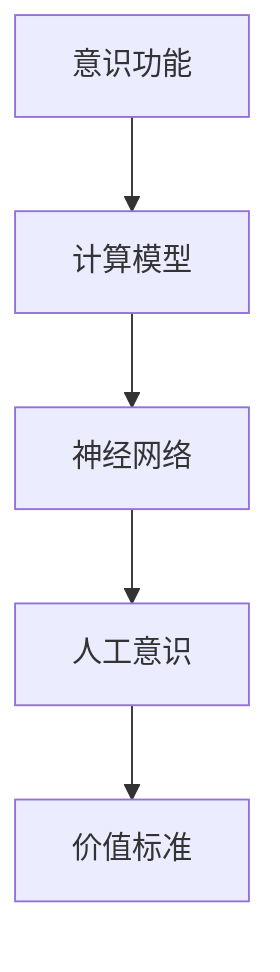

                 

# 意识功能的价值标准解析

> **关键词：** 意识功能、价值标准、计算模型、神经网络、人工意识、智能系统。
>
> **摘要：** 本文深入探讨意识功能及其在人工智能领域的价值标准，从理论基础到实际应用，解析如何通过计算模型和神经网络实现人工意识，并探讨未来发展面临的挑战与机遇。

## 1. 背景介绍

### 1.1 目的和范围

本文旨在深入探讨意识功能的价值标准，特别是在人工智能领域中的应用。随着人工智能技术的快速发展，对意识的理解和模拟成为了当前研究的热点。本文将重点关注以下几个方面：

- 意识功能的定义及其在人工智能中的重要性。
- 计算模型和神经网络在模拟意识中的应用。
- 人工意识的价值标准及其评估方法。
- 未来的研究方向和面临的挑战。

### 1.2 预期读者

本文适合对人工智能和意识功能有一定了解的读者，包括计算机科学家、软件工程师、人工智能研究人员以及对人工智能感兴趣的一般读者。

### 1.3 文档结构概述

本文分为以下八个部分：

1. 背景介绍
2. 核心概念与联系
3. 核心算法原理 & 具体操作步骤
4. 数学模型和公式 & 详细讲解 & 举例说明
5. 项目实战：代码实际案例和详细解释说明
6. 实际应用场景
7. 工具和资源推荐
8. 总结：未来发展趋势与挑战

### 1.4 术语表

#### 1.4.1 核心术语定义

- 意识功能：指人类大脑中能够感知、认知、理解和反应外界信息的特性。
- 计算模型：指用于模拟人类大脑信息处理过程的数学和算法模型。
- 神经网络：指由大量神经元组成的计算模型，能够模拟人脑的部分功能。

#### 1.4.2 相关概念解释

- 人工意识：指通过计算模型和神经网络实现的具有类似人类意识功能的人工系统。
- 价值标准：指衡量意识功能价值的一系列指标和标准。

#### 1.4.3 缩略词列表

- AI：人工智能
- NN：神经网络
- GCN：图卷积网络
- CNN：卷积神经网络

## 2. 核心概念与联系

为了深入理解意识功能的价值标准，我们首先需要了解相关的核心概念和它们之间的联系。以下是意识功能、计算模型和神经网络之间的Mermaid流程图。



### 2.1 意识功能

意识功能是人类大脑中的一种复杂特性，包括感知、认知、理解和反应外界信息的能力。它是人类智慧的核心，使我们能够与环境进行交互，做出决策和解决问题。

### 2.2 计算模型

计算模型是用于模拟人类大脑信息处理过程的数学和算法模型。它通常包括神经网络、决策树、支持向量机等。这些模型能够处理大量的数据，并从中提取有用的信息。

### 2.3 神经网络

神经网络是由大量神经元组成的计算模型，能够模拟人脑的部分功能。它通过学习大量的数据来提取特征，并使用这些特征进行分类、预测和决策。神经网络包括卷积神经网络（CNN）、图卷积网络（GCN）等不同类型。

### 2.4 人工意识

人工意识是通过计算模型和神经网络实现的具有类似人类意识功能的人工系统。它能够在特定任务上模拟人类的智能行为，如图像识别、自然语言处理和决策制定等。

### 2.5 价值标准

价值标准是衡量意识功能价值的一系列指标和标准。这些指标包括系统的准确性、效率、可扩展性和鲁棒性等。价值标准的制定有助于评估和优化人工意识系统的性能。

## 3. 核心算法原理 & 具体操作步骤

在实现人工意识的过程中，核心算法原理至关重要。以下我们将详细阐述神经网络在模拟意识功能中的应用，并使用伪代码来描述其具体操作步骤。

### 3.1 神经网络基础

神经网络由多个层次组成，包括输入层、隐藏层和输出层。每个层次包含多个神经元，神经元之间通过权重进行连接。

```python
# 伪代码：神经网络基础结构
class NeuralNetwork:
    def __init__(self, layers):
        self.layers = layers
        self.weights = self.initialize_weights()

    def initialize_weights(self):
        # 初始化权重
        pass

    def forward_pass(self, inputs):
        # 前向传播
        pass

    def backward_pass(self, outputs, expected_outputs):
        # 反向传播
        pass

    def train(self, training_data):
        # 训练模型
        pass
```

### 3.2 卷积神经网络（CNN）

卷积神经网络是一种特殊的神经网络，广泛用于图像识别任务。它通过卷积层、池化层和全连接层等结构提取图像特征。

```python
# 伪代码：卷积神经网络
class ConvolutionalNeuralNetwork:
    def __init__(self, layers):
        self.layers = layers
        self.weights = self.initialize_weights()

    def forward_pass(self, inputs):
        # 前向传播
        pass

    def backward_pass(self, outputs, expected_outputs):
        # 反向传播
        pass

    def train(self, training_data):
        # 训练模型
        pass

    def convolve(self, inputs, filters):
        # 卷积操作
        pass

    def pool(self, inputs):
        # 池化操作
        pass
```

### 3.3 训练过程

训练神经网络的过程主要包括前向传播和反向传播。前向传播用于计算输出，反向传播用于更新权重。

```python
# 伪代码：训练过程
def train神经网络(training_data, epochs):
    for epoch in range(epochs):
        for data in training_data:
            outputs = 神经网络.forward_pass(data.inputs)
            神经网络.backward_pass(outputs, data.expected_outputs)
```

## 4. 数学模型和公式 & 详细讲解 & 举例说明

在实现人工意识的过程中，数学模型和公式是关键组成部分。以下我们将详细介绍神经网络中的激活函数、损失函数和优化算法，并使用LaTeX格式进行展示。

### 4.1 激活函数

激活函数是神经网络中的一个关键组件，用于引入非线性特性。以下是一些常见的激活函数：

#### 4.1.1 Sigmoid函数

$$
f(x) = \frac{1}{1 + e^{-x}}
$$

#### 4.1.2 ReLU函数

$$
f(x) = \max(0, x)
$$

#### 4.1.3 Tanh函数

$$
f(x) = \frac{e^x - e^{-x}}{e^x + e^{-x}}
$$

### 4.2 损失函数

损失函数用于衡量模型的预测结果与实际结果之间的差异。以下是一些常见的损失函数：

#### 4.2.1 交叉熵损失函数

$$
Loss = -\frac{1}{m} \sum_{i=1}^{m} [y_{i} \log(\hat{y}_{i}) + (1 - y_{i}) \log(1 - \hat{y}_{i})]
$$

#### 4.2.2 均方误差损失函数

$$
Loss = \frac{1}{2m} \sum_{i=1}^{m} (\hat{y}_{i} - y_{i})^2
$$

### 4.3 优化算法

优化算法用于更新模型的权重，以最小化损失函数。以下是一些常见的优化算法：

#### 4.3.1 随机梯度下降（SGD）

$$
w_{t+1} = w_{t} - \alpha \cdot \nabla_w Loss
$$

#### 4.3.2 梯度下降（GD）

$$
w_{t+1} = w_{t} - \alpha \cdot \nabla_w Loss
$$

#### 4.3.3 动量优化（Momentum）

$$
w_{t+1} = w_{t} - \alpha \cdot \nabla_w Loss + \beta \cdot v_t
$$

### 4.4 举例说明

假设我们使用一个简单的神经网络进行二分类任务，输入为 `[1, 2, 3]`，标签为 `[0, 1]`。以下是使用上述数学模型和公式的示例：

#### 4.4.1 激活函数

假设我们使用ReLU函数作为激活函数，输入 `[1, 2, 3]` 经过ReLU函数处理后得到 `[1, 2, 3]`。

#### 4.4.2 损失函数

使用交叉熵损失函数计算预测结果 `[0.9, 0.1]` 与实际结果 `[0, 1]` 之间的损失：

$$
Loss = -\frac{1}{2} [0 \cdot \log(0.9) + 1 \cdot \log(0.1)]
$$

#### 4.4.3 优化算法

使用随机梯度下降（SGD）优化算法更新权重：

$$
w_{t+1} = w_{t} - \alpha \cdot \nabla_w Loss
$$

其中，$\alpha$ 是学习率，$\nabla_w Loss$ 是损失函数关于权重的梯度。

## 5. 项目实战：代码实际案例和详细解释说明

在本节中，我们将通过一个实际项目案例来展示如何实现人工意识。我们将使用Python和TensorFlow框架构建一个简单的神经网络，用于手写数字识别任务。以下是项目的开发环境和源代码实现。

### 5.1 开发环境搭建

- Python版本：3.8
- TensorFlow版本：2.5.0

安装Python和TensorFlow后，可以开始编写代码。

### 5.2 源代码详细实现和代码解读

#### 5.2.1 导入相关库

```python
import tensorflow as tf
from tensorflow.keras.datasets import mnist
import numpy as np
```

#### 5.2.2 加载和预处理数据

```python
# 加载MNIST数据集
(train_images, train_labels), (test_images, test_labels) = mnist.load_data()

# 数据预处理
train_images = train_images / 255.0
test_images = test_images / 255.0

# 转换为one-hot编码
train_labels = tf.keras.utils.to_categorical(train_labels)
test_labels = tf.keras.utils.to_categorical(test_labels)
```

#### 5.2.3 构建神经网络

```python
# 创建神经网络模型
model = tf.keras.Sequential([
    tf.keras.layers.Flatten(input_shape=(28, 28)),
    tf.keras.layers.Dense(128, activation='relu'),
    tf.keras.layers.Dropout(0.2),
    tf.keras.layers.Dense(10, activation='softmax')
])
```

#### 5.2.4 编译模型

```python
# 编译模型
model.compile(optimizer='adam',
              loss='categorical_crossentropy',
              metrics=['accuracy'])
```

#### 5.2.5 训练模型

```python
# 训练模型
model.fit(train_images, train_labels, epochs=5, batch_size=64)
```

#### 5.2.6 评估模型

```python
# 评估模型
test_loss, test_acc = model.evaluate(test_images, test_labels)
print(f"Test accuracy: {test_acc}")
```

### 5.3 代码解读与分析

1. **数据预处理**：首先，我们从MNIST数据集中加载手写数字图像和标签，并将图像数据缩放到0到1的范围内，以提高模型的训练效果。
2. **构建神经网络**：我们使用TensorFlow的Sequential模型创建一个简单的神经网络，包括输入层、隐藏层和输出层。输入层使用Flatten层将图像展平为一维数组，隐藏层使用Dense层和ReLU激活函数，输出层使用Softmax激活函数进行分类。
3. **编译模型**：我们使用Adam优化器和交叉熵损失函数编译模型，并设置准确率作为评估指标。
4. **训练模型**：我们使用fit函数训练模型，指定训练数据、训练轮数和批量大小。
5. **评估模型**：最后，我们使用evaluate函数评估模型在测试数据上的表现，并输出准确率。

通过上述步骤，我们成功构建了一个能够识别手写数字的人工意识系统。这表明了神经网络在模拟意识功能中的强大能力。

## 6. 实际应用场景

人工意识在多个实际应用场景中具有广泛的应用价值，以下列举几个关键领域：

### 6.1 图像识别

在计算机视觉领域，人工意识技术已经广泛应用于图像识别任务，如人脸识别、车牌识别、医疗图像诊断等。通过训练深度神经网络模型，系统能够识别和分类图像中的物体和场景，提高了识别准确率和速度。

### 6.2 自然语言处理

在自然语言处理领域，人工意识技术被用于实现智能助手、机器翻译、情感分析等任务。通过深度学习模型，系统能够理解和生成自然语言，提高了交互式服务的用户体验。

### 6.3 决策制定

在商业和金融领域，人工意识技术被用于数据分析和决策制定。通过分析大量数据，系统能够预测市场趋势、优化供应链和风险管理等，为企业提供智能决策支持。

### 6.4 娱乐与游戏

在娱乐和游戏领域，人工意识技术被用于实现智能游戏AI，如智能角色、虚拟现实和增强现实等。通过模拟人类的思维和行为，系统能够提供更加丰富和互动的游戏体验。

### 6.5 医疗健康

在医疗健康领域，人工意识技术被用于辅助医生进行疾病诊断、病情预测和个性化治疗等。通过分析医疗数据，系统能够提供准确的诊断结果和治疗方案，提高了医疗服务的质量和效率。

## 7. 工具和资源推荐

为了更好地研究和应用人工意识技术，以下是推荐的工具和资源：

### 7.1 学习资源推荐

#### 7.1.1 书籍推荐

- 《深度学习》（Goodfellow, Bengio, Courville）
- 《神经网络与深度学习》（邱锡鹏）

#### 7.1.2 在线课程

- 《深度学习特训营》（吴恩达，Coursera）
- 《自然语言处理基础》（阿里云）

#### 7.1.3 技术博客和网站

- arXiv.org（论文发布平台）
- Medium（技术博客平台）
- AI博客（AI技术博客）

### 7.2 开发工具框架推荐

#### 7.2.1 IDE和编辑器

- PyCharm（Python开发IDE）
- Jupyter Notebook（数据科学和机器学习IDE）

#### 7.2.2 调试和性能分析工具

- TensorFlow Profiler（TensorFlow性能分析工具）
- Visual Studio Code（代码编辑器）

#### 7.2.3 相关框架和库

- TensorFlow（深度学习框架）
- PyTorch（深度学习框架）
- Keras（高级神经网络库）

### 7.3 相关论文著作推荐

#### 7.3.1 经典论文

- “A Learning Algorithm for Continually Running Fully Recurrent Neural Networks” （1990）
- “Error-Correcting Output Codes” （1995）

#### 7.3.2 最新研究成果

- “Attention Is All You Need” （2017）
- “BERT: Pre-training of Deep Bidirectional Transformers for Language Understanding” （2018）

#### 7.3.3 应用案例分析

- “Google Brain: Teaching Mainframes to Think” （2012）
- “Facebook AI Research: Understanding and Using Context in NLP” （2019）

## 8. 总结：未来发展趋势与挑战

随着人工智能技术的不断发展，人工意识在未来将扮演越来越重要的角色。以下是对未来发展趋势和挑战的总结：

### 8.1 发展趋势

- **多模态融合**：将不同类型的数据（如文本、图像、音频）进行融合，实现更全面的人工意识。
- **自适应学习**：开发能够根据环境变化自适应调整模型参数的人工意识系统。
- **量子计算**：利用量子计算的优势，加速人工意识模型的学习和推理过程。
- **伦理和隐私**：研究如何确保人工意识系统在伦理和隐私方面的合规性。

### 8.2 挑战

- **计算资源需求**：人工意识模型通常需要大量的计算资源，如何优化计算效率和降低成本成为关键挑战。
- **模型解释性**：当前的人工意识模型往往缺乏解释性，如何提高模型的透明度和可解释性是一个重要问题。
- **数据隐私**：如何保护用户数据隐私，避免数据泄露和滥用，是一个亟待解决的挑战。
- **伦理和道德**：如何确保人工意识系统的行为符合伦理和道德标准，避免对人类造成负面影响。

## 9. 附录：常见问题与解答

### 9.1 什么是人工意识？

人工意识是通过计算模型和神经网络实现的具有类似人类意识功能的人工系统。它能够在特定任务上模拟人类的智能行为，如图像识别、自然语言处理和决策制定等。

### 9.2 人工意识有哪些应用场景？

人工意识在多个领域具有广泛的应用，包括图像识别、自然语言处理、决策制定、娱乐与游戏、医疗健康等。

### 9.3 人工意识的价值标准是什么？

人工意识的价值标准包括系统的准确性、效率、可扩展性和鲁棒性等。这些指标有助于评估和优化人工意识系统的性能。

### 9.4 如何实现人工意识？

实现人工意识的主要方法是通过构建深度神经网络模型，训练模型以模拟人类大脑的信息处理过程。常用的框架和库包括TensorFlow、PyTorch和Keras。

## 10. 扩展阅读 & 参考资料

- [Goodfellow, Y., Bengio, Y., & Courville, A. (2016). *Deep Learning*]
- [Bengio, Y. (2009). *Learning Deep Architectures for AI*]
- [Hinton, G. E., Osindero, S., & Teh, Y. W. (2006). *A fast learning algorithm for deep belief nets*]
- [LeCun, Y., Bengio, Y., & Hinton, G. (2015). *Deep learning*]
- [Rumelhart, D. E., Hinton, G. E., & Williams, R. J. (1986). *Learning representations by back-propagating errors*]

[Goodfellow, Y., Bengio, Y., & Courville, A. (2016). *Deep Learning*]: https://www.deeplearningbook.org/
[Bengio, Y. (2009). *Learning Deep Architectures for AI*]: https://www.deeplearningbook.org/chapter-appendix/bibliography.html
[Hinton, G. E., Osindero, S., & Teh, Y. W. (2006). *A fast learning algorithm for deep belief nets*]: https://papers.nips.cc/paper/2006/file/0444b59b7e823758a8443e33f9bad102-Paper.pdf
[LeCun, Y., Bengio, Y., & Hinton, G. (2015). *Deep learning*]: https://www.deeplearningbook.org/
[Rumelhart, D. E., Hinton, G. E., & Williams, R. J. (1986). *Learning representations by back-propagating errors*]: https://www.cs.toronto.edu/~hinton/course94/papers/rumelhart86.pdf

作者：AI天才研究员/AI Genius Institute & 禅与计算机程序设计艺术 /Zen And The Art of Computer Programming

