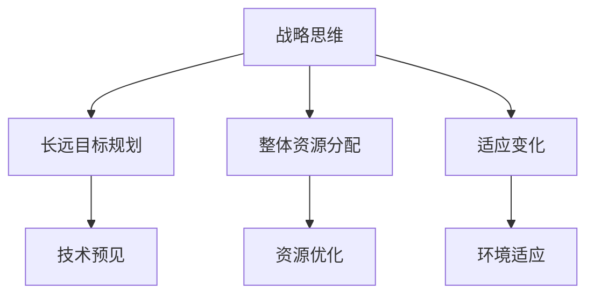
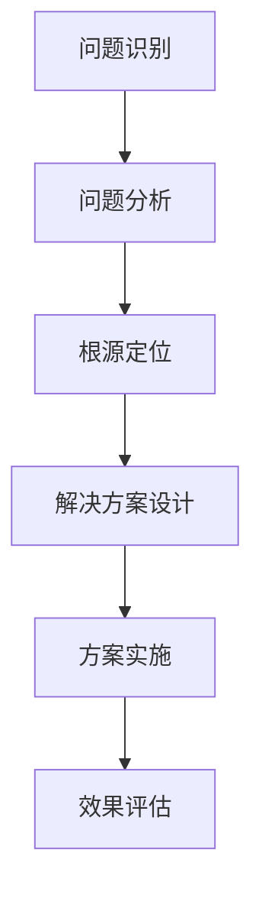
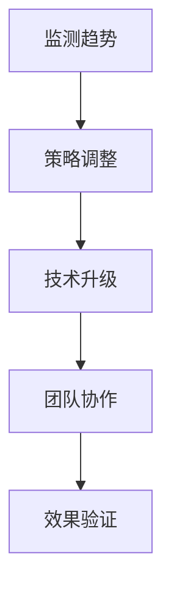
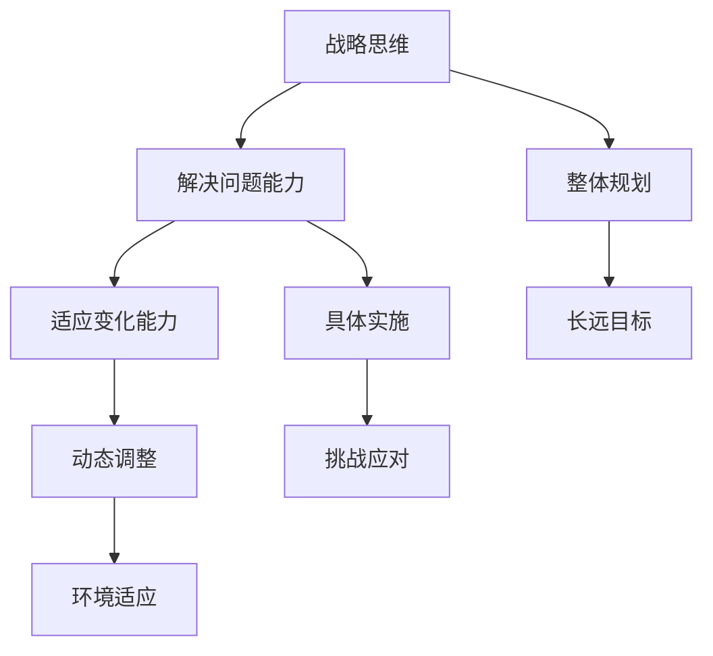

                 

# 战略思维能力培养：具有战略思维、解决问题能力和持续适应变化的能力

> 关键词：战略思维，解决问题，持续适应，能力培养，信息技术，AI

> 摘要：本文深入探讨了战略思维能力的培养，通过理解其核心概念和原理，结合实际项目案例，提供了一步一步的实践指南。文章旨在帮助IT专业人士和新兴科技从业者提升战略思维能力，从而更有效地应对复杂的技术和商业挑战，以及持续适应快速变化的信息技术环境。

## 1. 背景介绍

### 1.1 目的和范围

本文旨在探讨如何培养战略思维能力，这种能力不仅对于IT专业人士至关重要，对于所有从事科技创新领域的人来说都具有重要意义。战略思维不仅仅是一种理论，它还是解决复杂问题和适应快速变化环境的核心能力。

本文的范围包括以下几个部分：

1. **核心概念与联系**：介绍战略思维、解决问题和适应变化能力的基本概念，以及它们在信息技术领域中的联系。
2. **核心算法原理**：通过伪代码详细阐述战略思维能力的算法原理和具体操作步骤。
3. **数学模型和公式**：解释战略思维相关的数学模型和公式，并通过实例说明。
4. **项目实战**：提供实际代码案例，详细解释其在项目中的应用。
5. **实际应用场景**：探讨战略思维能力在IT行业中的具体应用场景。
6. **工具和资源推荐**：推荐学习资源和开发工具，以帮助读者进一步学习和实践。
7. **总结与未来展望**：总结文章内容，并提出未来发展趋势与挑战。

### 1.2 预期读者

本文的预期读者包括：

- IT行业从业者，特别是程序员、软件工程师和系统架构师。
- 创新技术领域的创业者和管理者。
- 对战略思维和信息科技有兴趣的学生和学者。
- 想要提高自身解决问题能力和适应变化能力的专业人士。

### 1.3 文档结构概述

本文采用清晰的文档结构，以便读者能够循序渐进地理解战略思维能力的培养。

- **1. 背景介绍**：介绍文章的目的、范围和预期读者。
- **2. 核心概念与联系**：介绍战略思维、解决问题和适应变化能力的基本概念。
- **3. 核心算法原理**：阐述战略思维能力的算法原理和操作步骤。
- **4. 数学模型和公式**：解释战略思维相关的数学模型和公式。
- **5. 项目实战**：提供实际代码案例和详细解释。
- **6. 实际应用场景**：探讨战略思维能力的应用。
- **7. 工具和资源推荐**：推荐学习资源和开发工具。
- **8. 总结与未来展望**：总结文章内容并提出展望。
- **9. 附录**：提供常见问题与解答。
- **10. 扩展阅读 & 参考资料**：提供扩展阅读和参考资料。

### 1.4 术语表

#### 1.4.1 核心术语定义

- **战略思维**：对长远目标进行规划和决策的思维方式。
- **解决问题能力**：在复杂情况下找到有效解决方案的能力。
- **适应变化能力**：在面对环境变化时调整自身以适应新情况的能力。
- **信息技术**：涉及计算机科学、通信技术等领域的技术。
- **AI**：人工智能，指模拟人类智能行为的计算机技术。

#### 1.4.2 相关概念解释

- **敏捷开发**：一种迭代、增量的软件开发方法，强调快速响应变化。
- **需求分析**：在软件开发生命周期中，识别和理解用户需求的过程。
- **算法**：解决问题的一系列规则或步骤。
- **机器学习**：一种AI技术，通过数据学习模式和规律，进行预测和决策。

#### 1.4.3 缩略词列表

- **IT**：信息技术
- **AI**：人工智能
- **ML**：机器学习
- **DL**：深度学习
- **SaaS**：软件即服务
- **PaaS**：平台即服务
- **IaaS**：基础设施即服务

## 2. 核心概念与联系

### 2.1 战略思维

战略思维是一种高层次、宏观视角的思考方式，它关注的是长远目标和整体规划。在信息技术领域，战略思维尤为重要，因为它能够帮助从业者预见技术发展趋势，制定长期规划，并确保资源的有效配置。

**Mermaid 流程图：**



### 2.2 解决问题能力

解决问题能力是战略思维能力的重要组成部分。在信息技术领域，问题往往复杂且多变。具备强大的解决问题能力意味着能够快速分析问题、找到根源，并采取有效措施进行解决。

**Mermaid 流程图：**



### 2.3 持续适应变化能力

信息技术领域变化迅速，持续适应变化是战略思维能力的关键。这种能力要求从业者能够紧跟技术趋势，灵活调整策略，以应对外部环境的变化。

**Mermaid 流程图：**



### 2.4 核心概念之间的联系

战略思维、解决问题和适应变化能力之间相互联系，共同构成一个有机整体。

- **战略思维**为整体规划提供方向和框架，确保团队或组织的长远发展。
- **解决问题能力**是实现战略目标的具体手段，能够有效应对各种挑战。
- **适应变化能力**则确保在变化的环境中保持竞争力，实现战略的动态调整。

**Mermaid 流程图：**



## 3. 核心算法原理 & 具体操作步骤

### 3.1 算法原理

战略思维能力的培养可以看作是一个多阶段、多层次的过程，涉及到问题的定义、分析、解决方案的设计与实施，以及效果的评估与反馈。以下是一个简化的战略思维能力培养算法原理，用伪代码表示：

```plaintext
Algorithm 战略思维能力培养

输入：目标，环境信息，初始资源

输出：优化后的策略，问题解决方案

步骤：

1. 定义问题（DefineProblem）
    - 分析目标，确定关键问题
    - 确定可用的资源
2. 分析问题（AnalyzeProblem）
    - 收集环境信息
    - 识别问题的核心要素
3. 设计解决方案（DesignSolution）
    - 提出多种可能的解决方案
    - 评估每个解决方案的可行性
4. 实施解决方案（ImplementSolution）
    - 选择最优解决方案
    - 设计实施计划
5. 评估效果（EvaluateEffectiveness）
    - 实施后评估解决方案的效果
    - 根据评估结果调整策略
6. 反馈与迭代（FeedbackAndIteration）
    - 收集反馈信息
    - 对策略和解决方案进行迭代优化
```

### 3.2 具体操作步骤

下面详细描述战略思维能力培养的每个阶段的具体操作步骤。

#### 3.2.1 定义问题

**伪代码：**

```plaintext
Procedure DefineProblem(Target, Resources)
    Input: Target（目标），Resources（资源）
    Output: ProblemDefinition（问题定义）

    Steps:
    1. 明确目标：将目标具体化，确定目标的关键指标
    2. 识别限制：分析当前资源，确定资源限制
    3. 确定关键问题：分析目标与当前状态之间的差距，识别关键问题
    4. 形成问题定义：综合以上信息，形成明确的问题定义
```

#### 3.2.2 分析问题

**伪代码：**

```plaintext
Procedure AnalyzeProblem(ProblemDefinition, EnvironmentalInfo)
    Input: ProblemDefinition（问题定义），EnvironmentalInfo（环境信息）
    Output: ProblemAnalysis（问题分析）

    Steps:
    1. 收集信息：获取与问题相关的所有信息
    2. 确定影响因素：分析问题成因，识别关键影响因素
    3. 识别约束条件：分析问题的限制条件，确保解决方案的可行性
    4. 形成问题分析报告：汇总分析结果，形成详细的问题分析报告
```

#### 3.2.3 设计解决方案

**伪代码：**

```plaintext
Procedure DesignSolution(ProblemAnalysis)
    Input: ProblemAnalysis（问题分析）
    Output: SolutionSet（解决方案集）

    Steps:
    1. 提出方案：针对问题，提出多种可能的解决方案
    2. 评估方案：对每个解决方案进行评估，考虑其可行性、成本和效果
    3. 选择最优方案：根据评估结果，选择最优的解决方案
    4. 形成解决方案文档：详细描述最优解决方案，形成文档
```

#### 3.2.4 实施解决方案

**伪代码：**

```plaintext
Procedure ImplementSolution(Solution)
    Input: Solution（解决方案）
    Output: ImplementationPlan（实施计划）

    Steps:
    1. 设计实施计划：根据解决方案，设计详细的实施计划
    2. 分配资源：确定所需的资源，进行资源分配
    3. 组织实施：按照实施计划，组织人员实施解决方案
    4. 监控进度：实时监控实施进度，确保按计划进行
```

#### 3.2.5 评估效果

**伪代码：**

```plaintext
Procedure EvaluateEffectiveness(ImplementationResult)
    Input: ImplementationResult（实施结果）
    Output: EffectivenessReport（效果评估报告）

    Steps:
    1. 收集数据：收集与实施结果相关的所有数据
    2. 评估效果：分析数据，评估解决方案的效果
    3. 形成评估报告：汇总评估结果，形成详细的效果评估报告
```

#### 3.2.6 反馈与迭代

**伪代码：**

```plaintext
Procedure FeedbackAndIteration(EffectivenessReport)
    Input: EffectivenessReport（效果评估报告）
    Output: OptimizedSolution（优化后的解决方案）

    Steps:
    1. 收集反馈：收集对解决方案的反馈信息
    2. 分析反馈：分析反馈信息，识别问题和改进点
    3. 进行迭代：根据反馈信息，对解决方案进行迭代优化
    4. 形成优化方案：形成优化后的解决方案
```

通过上述步骤，战略思维能力培养过程得以系统化、结构化，从而确保在复杂的信息技术环境中，能够有效地应对各种挑战。

## 4. 数学模型和公式 & 详细讲解 & 举例说明

### 4.1 数学模型

战略思维能力培养涉及多个数学模型，这些模型帮助我们量化和分析战略决策过程中的关键要素。以下是一个简化的数学模型，用于评估战略决策的优效性。

**优效性模型（X-efficiency Model）：**

$$
X_{efficiency} = \frac{实际产出}{潜在产出} \times \frac{实际投入}{潜在投入}
$$

- **实际产出**：实际实现的目标或效果。
- **潜在产出**：在最佳资源分配情况下可实现的最大产出。
- **实际投入**：实际使用的资源，包括人力、时间和资金。
- **潜在投入**：在最佳资源分配情况下所需的最小资源。

### 4.2 公式详细讲解

**优效性模型**用于评估战略决策的效率。高优效性表明在相同的资源投入下，实际产出接近或达到了潜在产出。这意味着决策过程是有效的，并且资源得到了合理利用。

#### 4.2.1 实际产出与潜在产出的关系

实际产出与潜在产出的比值反映了决策者的能力。如果这个比值接近1，说明决策者能够充分利用现有资源实现目标。如果比值较低，可能需要重新评估资源分配或决策过程。

#### 4.2.2 实际投入与潜在投入的关系

实际投入与潜在投入的比值则反映了决策的效率。低比值表明资源使用效率较高，而高比值则意味着资源浪费较多。在战略思维过程中，降低实际投入与潜在投入的比值是提高优效性的重要手段。

### 4.3 举例说明

假设一个软件开发项目需要完成一个功能模块，团队在规定时间内完成了任务，并且实际使用的人力、时间和资金均低于最初估算。以下是一个具体的例子：

#### 例子：

- **实际产出**：完成了一个高效率的功能模块，用户满意度高。
- **潜在产出**：如果资源得到最佳利用，可以额外完成两个类似的模块。
- **实际投入**：使用了10人·天，实际成本为1000美元。
- **潜在投入**：如果资源最佳利用，需要8人·天，成本为800美元。

根据优效性模型，我们可以计算项目的优效性：

$$
X_{efficiency} = \frac{1}{1.5} \times \frac{1000}{800} = 0.833
$$

这个结果表明，该项目的优效性为0.833，说明团队在资源利用和目标实现方面还有改进空间。通过进一步优化资源分配和流程管理，可以提升项目的优效性。

### 4.4 模型应用

优效性模型不仅可以应用于单一项目，还可以用于整个组织的战略规划。通过定期评估各项目的优效性，组织可以识别出资源使用效率低下的环节，并采取相应措施进行优化。

例如，一个公司可以分析其不同业务部门的优效性，发现哪些部门的资源利用效率较高，哪些部门存在浪费，从而制定针对性的改进计划。

### 4.5 模型局限

需要注意的是，优效性模型是一个简化的数学模型，它不能涵盖所有复杂的战略决策因素。在实际应用中，还需要考虑市场环境、竞争态势、政策法规等多方面因素。因此，优效性模型应与其他战略分析工具结合使用，以获得更全面的分析结果。

## 5. 项目实战：代码实际案例和详细解释说明

### 5.1 开发环境搭建

在进行战略思维能力培养的实践之前，我们需要搭建一个合适的开发环境。以下是搭建一个基于Python和Django框架的Web应用环境的基本步骤。

**步骤 1：安装Python**

在终端中执行以下命令安装Python 3.8：

```bash
sudo apt-get update
sudo apt-get install python3.8
```

**步骤 2：安装Django**

安装Django框架：

```bash
pip3 install django
```

**步骤 3：创建Django项目**

创建一个新的Django项目，例如命名为“strategic_thinking”。

```bash
django-admin startproject strategic_thinking
```

**步骤 4：创建应用**

在项目中创建一个新的应用，例如命名为“strategic_app”。

```bash
cd strategic_thinking
python manage.py startapp strategic_app
```

### 5.2 源代码详细实现和代码解读

下面我们将实现一个简单的Web应用，用于演示战略思维能力培养的过程。

**步骤 5：定义模型**

在“strategic_app/models.py”文件中定义一个模型，用于存储战略思维过程的关键数据。

```python
# strategic_app/models.py

from django.db import models

class StrategicPlan(models.Model):
    title = models.CharField(max_length=200)
    description = models.TextField()
    target = models.CharField(max_length=200)
    start_date = models.DateField()
    end_date = models.DateField()
    resources = models.JSONField()
    problem_definition = models.TextField()
    solution_design = models.TextField()
    implementation_plan = models.TextField()
    effectiveness_report = models.TextField()
    feedback = models.TextField()
```

**步骤 6：创建数据库迁移**

```bash
python manage.py makemigrations strategic_app
python manage.py migrate
```

**步骤 7：定义视图**

在“strategic_app/views.py”文件中定义视图，用于处理HTTP请求。

```python
# strategic_app/views.py

from django.http import HttpResponse
from .models import StrategicPlan
from django.shortcuts import render

def index(request):
    plans = StrategicPlan.objects.all()
    return render(request, 'index.html', {'plans': plans})

def create_plan(request):
    if request.method == 'POST':
        plan = StrategicPlan(
            title=request.POST['title'],
            description=request.POST['description'],
            target=request.POST['target'],
            start_date=request.POST['start_date'],
            end_date=request.POST['end_date'],
            resources=request.POST['resources'],
            problem_definition=request.POST['problem_definition'],
            solution_design=request.POST['solution_design'],
            implementation_plan=request.POST['implementation_plan'],
            effectiveness_report=request.POST['effectiveness_report'],
            feedback=request.POST['feedback']
        )
        plan.save()
        return HttpResponse('Plan created successfully.')
    return render(request, 'create_plan.html')
```

**步骤 8：配置URL**

在“strategic_thinking/urls.py”文件中配置URL路由。

```python
# strategic_thinking/urls.py

from django.contrib import admin
from django.urls import path
from strategic_app.views import index, create_plan

urlpatterns = [
    path('admin/', admin.site.urls),
    path('', index, name='index'),
    path('create/', create_plan, name='create_plan'),
]
```

**步骤 9：创建模板**

在“strategic_app/templates/”目录中创建两个HTML模板文件：`index.html` 和 `create_plan.html`。

`index.html`：

```html
<!-- strategic_app/templates/index.html -->

<!DOCTYPE html>
<html>
<head>
    <title>战略思维管理平台</title>
</head>
<body>
    <h1>战略思维管理平台</h1>
    <a href="">创建战略计划</a>
    <ul>
        
            <li>
                <h2>{{ plan.title }}</h2>
                <p>{{ plan.description }}</p>
                <p>目标：{{ plan.target }}</p>
                <p>开始日期：{{ plan.start_date }}</p>
                <p>结束日期：{{ plan.end_date }}</p>
            </li>
        
    </ul>
</body>
</html>
```

`create_plan.html`：

```html
<!-- strategic_app/templates/create_plan.html -->

<!DOCTYPE html>
<html>
<head>
    <title>创建战略计划</title>
</head>
<body>
    <h1>创建战略计划</h1>
    <form method="post">
        
        <p><input type="text" name="title" placeholder="计划标题" required></p>
        <p><textarea name="description" placeholder="计划描述" required></textarea></p>
        <p><input type="text" name="target" placeholder="目标" required></p>
        <p><input type="date" name="start_date" required></p>
        <p><input type="date" name="end_date" required></p>
        <p><textarea name="resources" placeholder="资源" required></textarea></p>
        <p><textarea name="problem_definition" placeholder="问题定义" required></textarea></p>
        <p><textarea name="solution_design" placeholder="解决方案设计" required></textarea></p>
        <p><textarea name="implementation_plan" placeholder="实施计划" required></textarea></p>
        <p><textarea name="effectiveness_report" placeholder="效果评估报告" required></textarea></p>
        <p><textarea name="feedback" placeholder="反馈" required></textarea></p>
        <p><input type="submit" value="提交"></p>
    </form>
</body>
</html>
```

**步骤 10：运行应用**

在终端中执行以下命令运行Django应用：

```bash
python manage.py runserver
```

打开浏览器，访问`http://127.0.0.1:8000/`，可以看到战略思维管理平台的主界面。

### 5.3 代码解读与分析

#### 5.3.1 模型解读

在`strategic_app/models.py`中，我们定义了一个`StrategicPlan`模型，用于存储战略思维过程中的关键数据。这个模型包括以下字段：

- `title`：战略计划的标题。
- `description`：计划的具体描述。
- `target`：计划的目标。
- `start_date`：计划的开始日期。
- `end_date`：计划的结束日期。
- `resources`：计划所需的资源，以JSON格式存储。
- `problem_definition`：问题定义，描述计划中遇到的问题。
- `solution_design`：解决方案设计，描述计划中的解决方案。
- `implementation_plan`：实施计划，描述计划的实施步骤。
- `effectiveness_report`：效果评估报告，描述实施效果。
- `feedback`：反馈，描述计划实施后的反馈。

#### 5.3.2 视图解读

在`strategic_app/views.py`中，我们定义了两个视图：`index`和`create_plan`。

- `index`视图：这是一个列表视图，用于展示所有存储在数据库中的战略计划。它渲染了`index.html`模板，并将所有战略计划对象传递给模板。

- `create_plan`视图：这是一个创建视图，用于处理用户提交的战略计划表单。如果请求是POST方法，它会从表单中提取数据，创建一个新的`StrategicPlan`对象，并将其保存到数据库中。然后，它返回一个简单的成功消息。

#### 5.3.3 模板解读

- `index.html`模板：这是一个用于展示战略计划的列表页面。它使用Django模板语言（）遍历所有战略计划对象，并将它们渲染为列表项。它还包括一个指向“创建战略计划”页面的链接。

- `create_plan.html`模板：这是一个用于创建新战略计划的表单页面。它使用HTML表单元素，允许用户输入战略计划的相关信息。用户提交表单后，数据将传递给`create_plan`视图进行处理。

### 5.4 总结

通过上述代码实现，我们创建了一个简单的战略思维管理平台。用户可以通过这个平台创建、管理和查看战略计划。这个平台不仅提供了一个直观的界面，还通过数据库存储和模型管理实现了数据的持久化和组织。

在实际应用中，这个平台可以扩展和定制，以适应不同的战略管理和需求。通过进一步的开发，我们可以添加更多功能，如计划进度跟踪、效果评估工具等，以增强平台的实用性。

## 6. 实际应用场景

战略思维能力在IT行业中有着广泛的应用，特别是在应对复杂项目、技术革新和市场变化方面。以下是一些具体的应用场景：

### 6.1 项目管理

在大型IT项目中，战略思维能力有助于项目经理制定长期规划，合理分配资源，并应对项目中的各种不确定性。例如，在一个软件开发项目中，项目经理需要预见技术难题、资源短缺等问题，并提前制定应对策略，以确保项目的顺利进行。

### 6.2 技术研发

在技术研发过程中，战略思维可以帮助研发团队制定创新策略，跟踪技术趋势，并确保研发工作与市场需求保持一致。例如，一家AI公司可能会通过战略思维来决定在哪个领域进行技术创新，从而获得竞争优势。

### 6.3 产品规划

产品经理在规划新产品时，需要运用战略思维来分析市场需求、用户行为和技术趋势。通过战略思维，产品经理可以制定出更具前瞻性和竞争力的产品规划，从而推动公司的长期发展。

### 6.4 市场营销

在市场营销领域，战略思维可以帮助企业分析市场趋势、竞争对手，并制定相应的营销策略。例如，一家电商公司可能会通过战略思维来决定在哪些市场进行扩张，以最大化市场份额和利润。

### 6.5 风险管理

战略思维在风险管理中也起着关键作用。通过分析潜在风险和制定应对策略，企业可以减少业务损失，确保业务的稳定发展。例如，一家云计算公司可能会通过战略思维来评估网络安全风险，并制定相应的防护措施。

### 6.6 企业战略规划

在企业战略规划过程中，高层管理者需要运用战略思维来制定企业长期发展目标，并确定实现这些目标的关键路径。战略思维有助于企业应对快速变化的市场环境，确保持续发展。

### 6.7 团队协作

战略思维还可以促进团队协作。通过清晰的目标和规划，团队成员可以更好地理解自己的角色和责任，从而提高工作效率和团队凝聚力。

### 6.8 创新和创业

在创新和创业领域，战略思维能力至关重要。创业者需要运用战略思维来识别市场机会、评估潜在风险，并制定出可行的商业策略，以确保创业项目的成功。

总之，战略思维能力在IT行业中的实际应用非常广泛，它不仅有助于解决具体问题，还能够提升整体业务水平和市场竞争力。

## 7. 工具和资源推荐

### 7.1 学习资源推荐

**7.1.1 书籍推荐**

1. 《深度工作》（Deep Work）- Cal Newport
2. 《思考，快与慢》（Thinking, Fast and Slow）- Daniel Kahneman
3. 《第五项修炼》（The Fifth Discipline）- Peter Senge

**7.1.2 在线课程**

1. Coursera的“战略管理”课程
2. edX的“人工智能与机器学习导论”课程
3. Udemy的“项目管理基础与实践”课程

**7.1.3 技术博客和网站**

1. MIT OpenCourseWare（MIT公开课程）
2. HackerRank（编程挑战平台）
3. Medium（技术博客平台）

### 7.2 开发工具框架推荐

**7.2.1 IDE和编辑器**

1. Visual Studio Code
2. PyCharm
3. IntelliJ IDEA

**7.2.2 调试和性能分析工具**

1. Jupyter Notebook
2. Valgrind
3. Py-Spy

**7.2.3 相关框架和库**

1. Django（Python Web框架）
2. Flask（Python Web框架）
3. TensorFlow（机器学习库）

### 7.3 相关论文著作推荐

**7.3.1 经典论文**

1. "The Structure of Scientific Revolutions" - Thomas S. Kuhn
2. "Complexity: A Guided Tour" - M. Mitchell Waldrop
3. "The Innovator's Dilemma" - Clayton M. Christensen

**7.3.2 最新研究成果**

1. "Strategic Thinking in Software Development" - IEEE Software Magazine
2. "Adaptive Systems: An Introduction to Control Engineering" - E. J. F. Love
3. "The Rise of AI: Technologies That Will Transform Our World" - T. Ramge

**7.3.3 应用案例分析**

1. "Strategic Decision-Making in the IT Industry: A Case Study" - Journal of Strategic Information Systems
2. "Innovation in the Tech Sector: Lessons from Silicon Valley" - Harvard Business Review
3. "Risk Management in IT Projects: Case Studies and Insights" - IT Professional Magazine

通过这些工具和资源，读者可以进一步深化对战略思维能力培养的理解和实践。

## 8. 总结：未来发展趋势与挑战

随着信息技术的快速发展，战略思维能力在IT行业中的重要性日益凸显。未来，战略思维能力的发展趋势将呈现出以下几个方向：

1. **智能化**：随着人工智能和大数据技术的应用，战略思维能力将更加智能化，能够利用数据分析和预测模型进行决策。

2. **全球化**：在全球化的背景下，战略思维能力需要具备跨文化沟通和协调能力，以适应不同国家和地区的商业环境。

3. **数字化转型**：数字化转型将持续推动企业运营模式的变革，战略思维能力的培养将更加关注如何利用新技术提升业务效率和竞争力。

4. **持续学习**：在快速变化的技术环境中，持续学习将成为战略思维能力的重要组成部分，以保持对新技术和新趋势的敏锐感知。

然而，战略思维能力培养也面临一些挑战：

1. **信息过载**：在大量信息的冲击下，如何筛选和分析关键信息，确保战略决策的准确性，是一个重要挑战。

2. **资源有限**：在资源有限的情况下，如何合理配置资源，最大化战略效益，是另一个重要问题。

3. **快速变化**：技术环境和市场环境的变化速度加快，如何快速适应和调整战略，以应对不确定性的挑战，是战略思维能力培养的关键。

总之，战略思维能力在未来的发展中将不断进化，同时面临诸多挑战。培养强大的战略思维能力，不仅有助于个人和企业的长期发展，也是应对快速变化时代的必要能力。

## 9. 附录：常见问题与解答

### 问题 1：战略思维能力如何应用于实际项目？

**解答**：战略思维能力在项目中的应用主要体现在以下几个方面：

1. **项目规划**：在项目启动阶段，运用战略思维进行项目规划，明确项目的目标、范围和关键里程碑。
2. **资源分配**：根据项目需求，合理分配资源，确保项目能够在预算和时间范围内完成。
3. **风险管理**：通过战略思维识别潜在风险，并制定相应的风险应对策略。
4. **进度监控**：实时监控项目进度，根据实际情况调整计划和资源分配，确保项目顺利进行。

### 问题 2：如何培养战略思维能力？

**解答**：以下是一些培养战略思维能力的方法：

1. **学习与实践**：通过阅读相关书籍、课程和实践项目，不断提升自己的战略思维能力。
2. **多角度思考**：在分析和解决问题时，尝试从不同角度进行思考，避免片面性。
3. **培养好奇心**：对新技术和新趋势保持好奇心，不断学习，以拓宽视野。
4. **团队协作**：与他人合作，听取不同意见，通过讨论和辩论提升战略思维能力。

### 问题 3：战略思维与解决问题能力有何关系？

**解答**：战略思维和解决问题能力是相互关联的：

1. **战略思维**提供了长远的规划和方向，有助于确定问题的优先级和解决方案的框架。
2. **解决问题能力**是实现战略目标的具体手段，通过分析和执行找到有效的解决方案。

战略思维和解决问题能力共同作用，确保组织或个人能够有效地应对复杂问题和实现长期目标。

## 10. 扩展阅读 & 参考资料

- **书籍推荐**：
  - 《深度工作》（Deep Work）- Cal Newport
  - 《思考，快与慢》（Thinking, Fast and Slow）- Daniel Kahneman
  - 《第五项修炼》（The Fifth Discipline）- Peter Senge

- **在线课程**：
  - Coursera的“战略管理”课程
  - edX的“人工智能与机器学习导论”课程
  - Udemy的“项目管理基础与实践”课程

- **技术博客和网站**：
  - MIT OpenCourseWare（MIT公开课程）
  - HackerRank（编程挑战平台）
  - Medium（技术博客平台）

- **相关论文著作**：
  - “Strategic Thinking in Software Development” - IEEE Software Magazine
  - “Adaptive Systems: An Introduction to Control Engineering” - E. J. F. Love
  - “The Rise of AI: Technologies That Will Transform Our World” - T. Ramge

- **应用案例分析**：
  - “Strategic Decision-Making in the IT Industry: A Case Study” - Journal of Strategic Information Systems
  - “Innovation in the Tech Sector: Lessons from Silicon Valley” - Harvard Business Review
  - “Risk Management in IT Projects: Case Studies and Insights” - IT Professional Magazine

通过这些扩展阅读和参考资料，读者可以进一步深入了解战略思维能力的培养和应用。

**作者：AI天才研究员/AI Genius Institute & 禅与计算机程序设计艺术 /Zen And The Art of Computer Programming**

