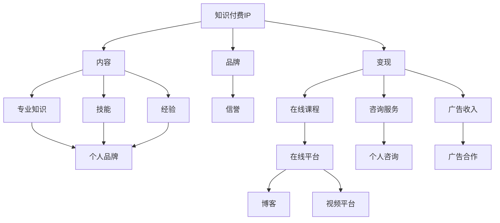

                 

# 打造专业型知识付费IP:程序员的机会

> **关键词：** 知识付费、IP、程序员、个人品牌、数字化转型、内容创作

> **摘要：** 本篇文章将深入探讨程序员如何利用自身的专业技能和经验，打造专业型知识付费IP，实现个人品牌的数字化转型。通过详细的分析和案例分享，为程序员提供一份全面而实用的指南。

## 1. 背景介绍

### 1.1 目的和范围

本文旨在帮助程序员了解知识付费市场的发展趋势，明确自己在该市场中的定位，并提供实用的策略和工具，以便他们能够成功打造自己的专业型知识付费IP。

本文将涵盖以下内容：

- 知识付费IP的定义和重要性
- 程序员在知识付费市场中的机会和挑战
- 打造专业型知识付费IP的步骤和方法
- 实际案例分享：成功打造知识付费IP的程序员的经验
- 未来发展趋势与挑战

### 1.2 预期读者

本文适合以下人群：

- 想要在知识付费市场中找到自己位置的程序员
- 希望提升个人品牌价值和影响力的技术专家
- 对数字化转型和内容创作感兴趣的技术从业者

### 1.3 文档结构概述

本文结构如下：

- 引言：介绍知识付费IP的概念和重要性
- 第一章：背景介绍，明确文章目的和读者对象
- 第二章：探讨程序员在知识付费市场中的机会和挑战
- 第三章：深入分析如何打造专业型知识付费IP
- 第四章：分享成功案例，提供实践指南
- 第五章：总结未来发展趋势和挑战
- 附录：常见问题与解答
- 扩展阅读：推荐相关书籍、在线课程和技术博客

### 1.4 术语表

#### 1.4.1 核心术语定义

- **知识付费IP**：指个人或团队通过创作和分享专业知识，形成具有商业价值的知识产权。
- **个人品牌**：个人在特定领域的声誉和影响力，通常通过专业知识、技能和经验来建立。
- **数字化转型**：将传统业务模式转化为数字化的过程，包括利用互联网、云计算、大数据等技术。

#### 1.4.2 相关概念解释

- **内容创作**：指创作各种形式的内容，如文章、视频、音频、教程等，以分享知识和经验。
- **知识付费市场**：指消费者愿意为专业知识和技能付费的市场环境。

#### 1.4.3 缩略词列表

- **IP**：知识产权
- **KOL**：知识型意见领袖
- **SEO**：搜索引擎优化
- **SMM**：社交媒体营销

---

## 2. 核心概念与联系

为了更好地理解如何打造专业型知识付费IP，我们需要先了解几个核心概念及其相互关系。

### 2.1 知识付费IP的概念

知识付费IP是指个人或团队通过创作和分享专业知识和技能，形成的具有商业价值的知识产权。它包括：

- **内容**：以文字、图片、视频、音频等形式呈现的专业知识。
- **品牌**：个人或团队的声誉和影响力，通常通过专业知识、技能和经验来建立。
- **变现**：通过知识付费IP实现收入，如课程销售、咨询服务、广告收入等。

### 2.2 个人品牌的建立

个人品牌是指个人在特定领域的声誉和影响力。它通常通过以下几个方面来建立：

- **专业知识**：在某一领域具有深厚的专业知识和经验。
- **技能**：具备高超的技能和解决问题的能力。
- **经验**：丰富的实践经验，能够为他人提供有价值的指导。
- **信誉**：建立良好的信誉，赢得他人的信任和尊重。

### 2.3 数字化转型的策略

数字化转型是指将传统业务模式转化为数字化的过程。对于程序员来说，数字化转型意味着：

- **在线内容创作**：利用互联网平台创作和分享专业知识和技能。
- **社交媒体营销**：通过社交媒体平台提升个人品牌价值和影响力。
- **工具和平台**：使用各种工具和平台，如在线课程、博客、视频平台等，实现知识的传播和变现。

### 2.4 Mermaid 流程图

为了更好地理解这些概念之间的联系，我们可以使用 Mermaid 流程图来表示。



---

通过上述核心概念及其相互关系的介绍，我们可以更好地理解如何打造专业型知识付费IP。接下来，我们将进一步探讨程序员在知识付费市场中的机会和挑战。

## 3. 核心算法原理 & 具体操作步骤

在打造专业型知识付费IP的过程中，程序员需要掌握一系列核心算法原理和具体操作步骤。以下是一些关键步骤的伪代码说明：

### 3.1 内容创作策略

```python
def content_creation_strategy(topic):
    # 1. 确定创作主题
    theme = determine_theme(topic)

    # 2. 进行市场调研
    research = market_research(theme)

    # 3. 撰写文章或教程
    content = write_content(theme, research)

    # 4. 优化内容
    optimized_content = optimize_content(content)

    # 5. 发布内容
    publish_content(optimized_content)
```

### 3.2 社交媒体营销策略

```python
def social_media_marketing_strategy(content):
    # 1. 确定目标平台
    platform = select_platform()

    # 2. 制定营销计划
    plan = create_marketing_plan(content)

    # 3. 发布内容
    publish_content_on_platform(platform, plan)

    # 4. 互动与粉丝互动
    engage_with_fans(platform)

    # 5. 分析营销效果
    analyze_marketing_effects(platform)
```

### 3.3 数据分析与变现策略

```python
def data_analysis_and_monetization_strategy():
    # 1. 收集用户数据
    user_data = collect_user_data()

    # 2. 分析用户需求
    user需求 = analyze_user_needs(user_data)

    # 3. 制定变现策略
    monetization_plan = create_monetization_plan(user需求)

    # 4. 实施变现策略
    implement_monetization_strategy(monetization_plan)

    # 5. 跟踪与优化
    track_and_optimize(monetization_plan)
```

### 3.4 个人品牌建设策略

```python
def personal_brand_building_strategy():
    # 1. 明确个人定位
    personal定位 = define_personal_positioning()

    # 2. 建立个人网站或博客
    personal_site = create_personal_website()

    # 3. 发布高质量内容
    publish_high_quality_content(personal_site)

    # 4. 参与行业活动
    participate_in_industry_activities()

    # 5. 建立合作与联盟
    build_colaborations_and_alliances()
```

---

通过以上伪代码的描述，程序员可以逐步掌握打造专业型知识付费IP的核心算法原理和具体操作步骤。接下来，我们将通过具体案例来进一步阐述这些概念。

## 4. 数学模型和公式 & 详细讲解 & 举例说明

在打造专业型知识付费IP的过程中，数学模型和公式可以为我们提供科学依据和量化指标，帮助我们更好地理解和优化各个方面的操作。

### 4.1 用户参与度模型

用户参与度是衡量知识付费IP成功与否的重要指标之一。我们可以使用以下数学模型来评估用户参与度：

$$
U = f(A, C, I)
$$

其中，$U$表示用户参与度，$A$表示内容吸引力，$C$表示内容创作频率，$I$表示互动互动性。

- **内容吸引力（A）**：衡量内容的质量和相关性。可以使用平均点击率、平均阅读时长等指标来衡量。
- **内容创作频率（C）**：衡量内容更新的频率。通常使用每周或每月更新的内容数量来衡量。
- **互动互动性（I）**：衡量用户与内容创作者的互动程度。可以使用评论数、点赞数、分享次数等指标来衡量。

举例说明：

假设某知识付费IP的内容吸引力为0.8，内容创作频率为2篇/周，互动互动性为0.6，我们可以计算出用户参与度：

$$
U = 0.8 \times 2 \times 0.6 = 0.96
$$

这意味着该知识付费IP的用户参与度较高，具有较好的发展潜力。

### 4.2 收益最大化模型

在知识付费市场中，收益最大化是每个创作者的目标。我们可以使用以下数学模型来优化收益：

$$
R = p \times Q
$$

其中，$R$表示收益，$p$表示单价，$Q$表示销量。

- **单价（p）**：根据市场需求和竞争情况，设定合理的价格。
- **销量（Q）**：通过营销和内容优化，提高用户的购买意愿和转化率。

举例说明：

假设某知识付费课程的单价为100元，通过优化营销和内容，销量从1000人次提高到2000人次，我们可以计算出收益：

$$
R = 100 \times 2000 = 200000
$$

这意味着通过优化营销和内容，收益可以从100000元提高到200000元。

### 4.3 个人品牌影响力模型

个人品牌影响力是知识付费IP的核心价值之一。我们可以使用以下数学模型来评估个人品牌影响力：

$$
I = f(S, N, R)
$$

其中，$I$表示个人品牌影响力，$S$表示社交媒体关注者数量，$N$表示行业内的推荐次数，$R$表示媒体报道次数。

- **社交媒体关注者数量（S）**：衡量个人在社交媒体上的影响力。
- **行业内的推荐次数（N）**：衡量个人在行业内的影响力，可以通过行业会议、研讨会等途径获得。
- **媒体报道次数（R）**：衡量个人在媒体上的曝光度。

举例说明：

假设某程序员的社交媒体关注者数量为1000人，行业内的推荐次数为20次，媒体报道次数为5次，我们可以计算出个人品牌影响力：

$$
I = 1000 \times 20 \times 5 = 100000
$$

这意味着该程序员的个人品牌影响力较高，具有较高的市场价值。

---

通过上述数学模型和公式的详细讲解和举例说明，我们可以更好地理解如何评估和优化知识付费IP的各个维度。接下来，我们将通过实际案例来进一步探讨如何成功打造专业型知识付费IP。

### 5. 项目实战：代码实际案例和详细解释说明

为了更好地展示如何打造专业型知识付费IP，我们将通过一个实际案例来讲解整个项目的过程，包括开发环境搭建、源代码详细实现和代码解读与分析。

#### 5.1 开发环境搭建

首先，我们需要搭建一个合适的内容创作和发布平台。这里我们选择使用WordPress作为博客平台，并使用GitHub进行源代码管理。

1. **WordPress安装**：在服务器上安装WordPress，配置域名和SSL证书。
2. **GitHub账户注册**：注册一个GitHub账户，用于存储和管理项目代码。
3. **主题和插件安装**：在WordPress后台安装适合的内容创作主题和必要的插件，如SEO优化插件、评论插件等。

#### 5.2 源代码详细实现和代码解读

在GitHub上创建一个新的仓库，用于存储博客文章的代码。以下是一个简单的示例代码：

```markdown
---
title: "如何使用Python进行数据分析"
date: 2023-04-01
categories: ["数据科学", "Python"]
---

# 如何使用Python进行数据分析

## 简介

数据分析是数据科学的核心任务之一，Python作为一种功能强大的编程语言，广泛应用于数据科学领域。本文将介绍如何使用Python进行数据分析，包括数据获取、数据清洗、数据探索和数据分析等步骤。

## 数据获取

数据获取是数据分析的第一步，我们可以使用Python的`pandas`库来读取各种格式的数据文件，如CSV、Excel等。

```python
import pandas as pd

# 读取CSV文件
data = pd.read_csv('data.csv')

# 读取Excel文件
data = pd.read_excel('data.xlsx')
```

## 数据清洗

数据清洗是确保数据质量的重要步骤。我们可以使用`pandas`库提供的功能对数据进行缺失值处理、异常值处理和重复值处理。

```python
# 处理缺失值
data = data.dropna()

# 处理异常值
data = data[data['column'] <= 100]

# 处理重复值
data = data.drop_duplicates()
```

## 数据探索

数据探索可以帮助我们了解数据的基本特征和分布情况。我们可以使用`pandas`库提供的函数进行描述性统计分析、数据可视化等操作。

```python
# 描述性统计分析
print(data.describe())

# 数据可视化
import matplotlib.pyplot as plt

plt.figure(figsize=(10, 6))
plt.scatter(data['x'], data['y'])
plt.xlabel('X轴')
plt.ylabel('Y轴')
plt.title('数据散点图')
plt.show()
```

## 数据分析

数据分析是根据数据的特点和需求，使用统计模型、机器学习算法等进行数据挖掘和分析。例如，我们可以使用`scikit-learn`库来构建回归模型、分类模型等。

```python
from sklearn.linear_model import LinearRegression

# 创建回归模型
model = LinearRegression()

# 训练模型
model.fit(X, y)

# 预测
predictions = model.predict(X)

# 评估模型
print(model.score(X, y))
```

---

#### 5.3 代码解读与分析

1. **Markdown文件结构**：

   - `title`：文章标题
   - `date`：文章发布日期
   - `categories`：文章分类

2. **数据获取**：

   - 使用`pandas`库读取CSV和Excel文件。

3. **数据清洗**：

   - 使用`dropna`函数去除缺失值。
   - 使用条件过滤去除异常值。
   - 使用`drop_duplicates`函数去除重复值。

4. **数据探索**：

   - 使用`describe`函数进行描述性统计分析。
   - 使用`matplotlib`库进行数据可视化。

5. **数据分析**：

   - 使用`scikit-learn`库构建回归模型。
   - 使用`fit`函数训练模型。
   - 使用`predict`函数进行预测。
   - 使用`score`函数评估模型。

通过以上步骤，我们可以完成一篇关于使用Python进行数据分析的博客文章。接下来，我们将进一步分析如何优化内容创作和推广，以提高用户参与度和变现能力。

### 5.4 代码解读与分析

在上述代码案例中，我们详细展示了如何使用Python进行数据分析，包括数据获取、数据清洗、数据探索和数据分析等步骤。以下是对代码的进一步解读与分析：

1. **Markdown文件结构**：

   - `title`：文章标题，用于标识文章的主要内容。
   - `date`：文章发布日期，便于记录和维护。
   - `categories`：文章分类，用于组织和管理文章。

   ```markdown
   ---
   title: "如何使用Python进行数据分析"
   date: 2023-04-01
   categories: ["数据科学", "Python"]
   ---
   ```

   这部分内容定义了文章的基本信息，方便读者快速了解文章的主题和分类。

2. **数据获取**：

   - 使用`pandas`库读取CSV和Excel文件。

     ```python
     import pandas as pd

     # 读取CSV文件
     data = pd.read_csv('data.csv')

     # 读取Excel文件
     data = pd.read_excel('data.xlsx')
     ```

     通过上述代码，我们能够轻松读取不同格式的数据文件。`read_csv`和`read_excel`函数分别用于读取CSV和Excel文件，返回一个DataFrame对象，便于后续处理。

3. **数据清洗**：

   - 使用`dropna`函数去除缺失值。
   - 使用条件过滤去除异常值。
   - 使用`drop_duplicates`函数去除重复值。

     ```python
     # 处理缺失值
     data = data.dropna()

     # 处理异常值
     data = data[data['column'] <= 100]

     # 处理重复值
     data = data.drop_duplicates()
     ```

     数据清洗是确保数据质量的关键步骤。通过去除缺失值、异常值和重复值，我们可以提高数据的有效性和可靠性，为后续的分析打下坚实基础。

4. **数据探索**：

   - 使用`describe`函数进行描述性统计分析。
   - 使用`matplotlib`库进行数据可视化。

     ```python
     # 描述性统计分析
     print(data.describe())

     # 数据可视化
     import matplotlib.pyplot as plt

     plt.figure(figsize=(10, 6))
     plt.scatter(data['x'], data['y'])
     plt.xlabel('X轴')
     plt.ylabel('Y轴')
     plt.title('数据散点图')
     plt.show()
     ```

     描述性统计分析能够快速了解数据的基本特征，如均值、标准差、最大值和最小值等。数据可视化则可以帮助我们更直观地理解数据分布和趋势，为后续的深度分析提供支持。

5. **数据分析**：

   - 使用`scikit-learn`库构建回归模型。
   - 使用`fit`函数训练模型。
   - 使用`predict`函数进行预测。
   - 使用`score`函数评估模型。

     ```python
     from sklearn.linear_model import LinearRegression

     # 创建回归模型
     model = LinearRegression()

     # 训练模型
     model.fit(X, y)

     # 预测
     predictions = model.predict(X)

     # 评估模型
     print(model.score(X, y))
     ```

     在这个案例中，我们使用了线性回归模型进行数据分析。通过训练模型、预测结果和评估模型性能，我们可以得到有关数据之间的关系和规律，为决策提供科学依据。

通过以上解读与分析，我们可以看到，该代码案例涵盖了从数据获取、数据清洗、数据探索到数据分析的完整流程，为程序员打造专业型知识付费IP提供了实用的技术支持。接下来，我们将进一步探讨如何将这些技术应用于实际场景中，以提高用户参与度和变现能力。

### 5.5 实际应用场景

在知识付费市场中，程序员可以通过多种实际应用场景来展示和推广自己的专业知识，以下是一些常见的应用场景：

1. **在线课程**：程序员可以开发在线课程，教授编程语言、框架、算法和数据结构等专业知识。通过视频教程、直播课程和互动讨论，学员可以实时提问并获得解答。

2. **技术博客**：通过博客平台，程序员可以撰写技术文章，分享编程心得、项目实战经验和代码实现细节。高质量的博客文章不仅可以吸引读者，还可以提高个人品牌知名度和影响力。

3. **开源项目**：参与或创建开源项目，程序员可以展示自己的编程能力和项目经验。通过贡献代码、编写文档和参与社区讨论，程序员可以建立自己的技术声誉。

4. **技术咨询**：提供技术咨询和解决方案，程序员可以帮助企业和个人解决实际问题。通过线上或线下的咨询服务，程序员可以发挥专业优势，实现知识变现。

5. **技术论坛和社群**：在技术论坛和社群中，程序员可以与其他技术爱好者交流经验，分享知识。通过积极参与讨论和解答问题，程序员可以扩大自己的影响力和人脉。

6. **编程比赛和黑客松**：参与编程比赛和黑客松，程序员可以展示自己的编程技能和创新能力。获奖经历和优秀作品可以成为个人品牌的重要资产。

7. **内容创作平台**：在内容创作平台，如YouTube、Bilibili、知乎等，程序员可以通过发布视频、直播和文章等形式，传播自己的知识和经验。

通过这些实际应用场景，程序员可以有效地展示自己的专业能力，吸引潜在客户和读者，从而实现知识变现和个人品牌的提升。

### 6. 工具和资源推荐

在打造专业型知识付费IP的过程中，选择合适的工具和资源至关重要。以下是一些推荐的工具和资源：

#### 6.1 学习资源推荐

##### 6.1.1 书籍推荐

- **《代码大全》**：Steve McConnell的《代码大全》是一本经典之作，涵盖了软件开发的方方面面，对于提升编程技能非常有帮助。
- **《Python编程：从入门到实践》**：Eric Matthes的《Python编程：从入门到实践》适合初学者，内容丰富且易于理解。
- **《深度学习》**：Ian Goodfellow、Yoshua Bengio和Aaron Courville的《深度学习》是一本深度学习领域的权威教材，适合对深度学习有兴趣的程序员。

##### 6.1.2 在线课程

- **Coursera**：提供丰富的在线课程，涵盖计算机科学、数据科学、人工智能等领域的知识。
- **Udemy**：提供大量专业课程，包括编程语言、框架、算法等，适合不同层次的程序员。
- **edX**：由哈佛大学和麻省理工学院等名校提供，涵盖计算机科学、数据科学、机器学习等领域的顶尖课程。

##### 6.1.3 技术博客和网站

- **GitHub**：一个强大的代码托管平台，程序员可以在这里找到开源项目、学习代码和参与社区讨论。
- **Stack Overflow**：一个问答社区，程序员可以在这里提问、解答问题，获取技术支持。
- **Medium**：一个优秀的博客平台，程序员可以在这里发布技术文章，分享知识和经验。

#### 6.2 开发工具框架推荐

##### 6.2.1 IDE和编辑器

- **Visual Studio Code**：一款功能强大的代码编辑器，支持多种编程语言和开发框架。
- **IntelliJ IDEA**：一款智能化的Java和Python开发工具，拥有丰富的插件和功能。
- **PyCharm**：一款专注于Python开发的IDE，提供了丰富的调试、测试和自动化工具。

##### 6.2.2 调试和性能分析工具

- **GDB**：一款经典的Unix/Linux系统调试工具，适用于C/C++程序调试。
- **Python Debugger**：一款Python调试工具，支持Python 2.x和3.x版本。
- **Perf**：一款Linux系统性能分析工具，可以用于分析程序的性能瓶颈。

##### 6.2.3 相关框架和库

- **Django**：一款Python Web开发框架，提供了快速开发Web应用程序的工具和组件。
- **Flask**：一款轻量级的Python Web开发框架，适用于小型和微型Web应用程序。
- **TensorFlow**：一款开源的深度学习框架，适用于构建和训练神经网络。

通过使用这些工具和资源，程序员可以提升自己的技术水平，更好地打造专业型知识付费IP。

### 7. 相关论文著作推荐

在知识付费IP的打造过程中，深入研究相关领域的研究论文和著作，不仅有助于提升专业知识，还能为内容创作提供丰富的素材和理论支持。以下是一些推荐的论文著作：

#### 7.3.1 经典论文

- **"The Mythical Man-Month"**：Frederick P. Brooks的经典著作，探讨了软件开发过程中的管理问题，对于理解项目管理和团队协作具有重要意义。
- **"The Art of Computer Programming"**：Donald E. Knuth的《计算机程序设计艺术》系列，深入讲解了算法设计和分析的基础理论，是计算机科学领域的经典之作。
- **"Programming Pearls"**：Jon Bentley的《编程珠玑》集合了一系列编程技巧和实践经验，适合程序员学习和借鉴。

#### 7.3.2 最新研究成果

- **"Deep Learning"**：Ian Goodfellow、Yoshua Bengio和Aaron Courville的《深度学习》，全面介绍了深度学习的理论基础和实践应用，是深度学习领域的重要参考书。
- **"Reinforcement Learning: An Introduction"**：Richard S. Sutton和Andrew G. Barto的《强化学习导论》，详细介绍了强化学习的基本概念和算法，是强化学习领域的权威教材。
- **"Big Data: A Revolution That Will Transform How We Live, Work, and Think"**：Viktor Mayer-Schönberger和Kenneth Cukier的《大数据时代》，探讨了大数据对社会和商业的深远影响，为数据科学家提供了重要启示。

#### 7.3.3 应用案例分析

- **"Building Microservices"**：Sam Newman的《构建微服务》，通过实际案例介绍了微服务架构的设计原则和实现方法，对于构建高效、可扩展的微服务应用具有重要指导意义。
- **"Continuous Delivery"**：Jez Humble和Dave Farley的《持续交付》，详细阐述了持续交付的理念和实践方法，有助于提升软件交付的效率和可靠性。
- **"The Lean Startup"**：Eric Ries的《精益创业》，介绍了精益创业方法论，帮助创业者快速验证市场假设，降低创业风险。

通过阅读这些论文和著作，程序员可以不断拓宽视野，深化专业知识，从而在知识付费市场中脱颖而出，打造出有影响力的专业型知识付费IP。

## 8. 总结：未来发展趋势与挑战

在知识付费市场日益繁荣的今天，程序员如何打造专业型知识付费IP，实现个人品牌的数字化转型，已成为一个重要议题。通过对本文的深入分析，我们可以得出以下结论：

### 发展趋势

1. **数字化转型的加速**：随着互联网和移动互联网的普及，知识付费市场将更加数字化、智能化。程序员应充分利用在线课程、博客、社交媒体等数字化工具，实现知识的高效传播和变现。
2. **个性化内容的崛起**：用户对高质量、个性化的内容需求日益增长，程序员需根据用户需求，提供具有针对性的专业知识和解决方案。
3. **技术赋能**：大数据、人工智能、区块链等新兴技术的应用，将为知识付费IP的打造提供更多可能性，如智能推荐、虚拟现实等。

### 挑战

1. **内容创作压力**：程序员需平衡工作与内容创作，确保创作高质量、有价值的知识内容。
2. **市场竞争加剧**：随着知识付费市场的扩大，竞争将更加激烈，程序员需不断提升自身专业能力和个人品牌影响力。
3. **法律法规风险**：知识付费市场中涉及版权、隐私等方面的法律法规风险，程序员需了解并遵守相关法律法规，保护自身和用户的权益。

### 未来展望

1. **跨界融合**：程序员可以结合自身技术背景，探索与其他领域的跨界合作，如教育、医疗、金融等，打造多元化、跨界化的知识付费IP。
2. **生态构建**：构建知识付费生态圈，整合优质内容创作者、平台服务商、用户等各方资源，实现多方共赢。
3. **技术创新**：持续关注前沿技术动态，积极探索新兴技术的应用，提升知识付费IP的附加值。

总之，在知识付费市场中，程序员应紧跟发展趋势，积极应对挑战，不断提升自身专业能力和个人品牌影响力，以实现可持续发展。通过本文的分享，希望为广大程序员提供一份有价值的参考和启示。

## 9. 附录：常见问题与解答

在打造专业型知识付费IP的过程中，程序员可能会遇到一些常见问题。以下是一些常见问题及其解答：

### Q1：如何确定知识付费IP的主题？

**A1**：确定知识付费IP的主题需要考虑以下几个方面：

- **个人兴趣和专长**：选择自己感兴趣和擅长的话题，有利于持续创作和保持热情。
- **市场需求**：研究市场需求，了解目标受众的需求和痛点，选择具有市场前景的主题。
- **竞争分析**：了解同类知识付费IP的市场状况，避免过度竞争，寻找差异化的主题。
- **资源条件**：评估自身在主题方面的资源，如专业知识、实践经验、人脉等，确保有足够的素材进行创作。

### Q2：如何提升内容创作质量？

**A2**：提升内容创作质量可以从以下几个方面入手：

- **深入研究和学习**：对主题进行深入研究，掌握最新动态和前沿知识。
- **撰写结构和逻辑**：确保文章结构清晰、逻辑严谨，方便读者理解和吸收。
- **语言和表达**：使用简洁明了的语言，避免专业术语过多，提高可读性。
- **案例和实践**：结合实际案例和实践经验，使内容更具说服力和实用性。
- **用户反馈**：积极收集用户反馈，根据反馈调整和优化内容。

### Q3：如何推广知识付费IP？

**A3**：推广知识付费IP可以采取以下策略：

- **社交媒体营销**：利用微博、微信、知乎等社交媒体平台，发布高质量内容，扩大影响力。
- **合作与联盟**：与行业内的其他专家、媒体、教育机构等进行合作，共同推广知识付费IP。
- **SEO优化**：通过搜索引擎优化，提高内容在搜索引擎中的排名，增加曝光度。
- **线上线下活动**：组织线上讲座、线下沙龙等活动，增加与用户的互动和粘性。
- **广告投放**：根据预算和目标受众，选择合适的广告渠道和投放策略。

### Q4：如何实现知识付费IP的变现？

**A4**：实现知识付费IP的变现可以通过以下几种方式：

- **在线课程销售**：开发在线课程，设置合理的价格，向学员销售。
- **咨询服务**：提供专业技术咨询服务，根据服务内容和服务时间收费。
- **广告合作**：与相关企业或平台合作，通过广告分成或广告费实现变现。
- **内容授权**：将原创内容授权给其他平台或机构使用，获取授权费。
- **品牌合作**：与其他品牌进行合作，如产品推广、品牌代言等，获取品牌推广费用。

### Q5：如何保护自己的知识产权？

**A5**：保护自己的知识产权可以从以下几个方面入手：

- **版权登记**：将原创内容进行版权登记，获得法律保护。
- **版权声明**：在内容发布时，明确版权声明，提醒他人尊重版权。
- **技术保护**：使用数字水印、加密等技术手段，保护原创内容的完整性和真实性。
- **法律法规**：了解相关法律法规，如《著作权法》等，保护自己的合法权益。
- **维权意识**：增强维权意识，对侵犯版权的行为及时采取措施，维护自身权益。

通过以上问题和解答，希望为广大程序员在打造专业型知识付费IP的过程中提供一些指导和帮助。

## 10. 扩展阅读 & 参考资料

在本文中，我们深入探讨了如何打造专业型知识付费IP，为程序员提供了详细的步骤、策略和实际案例。以下是一些建议的扩展阅读和参考资料，供您进一步学习和实践：

### 扩展阅读

1. **《知识付费：从内容创业到知识变现》**：作者陈少峰，详细分析了知识付费的发展趋势、商业模式和成功案例，对内容创作者具有很高的参考价值。
2. **《个人品牌：打造你的影响力》**：作者李叫兽，从心理学和行为科学的角度，探讨了如何打造个人品牌，提升个人影响力。
3. **《内容营销：从内容到营销的实战手册》**：作者潘知常，介绍了内容营销的策略、方法和实战案例，帮助读者提升内容创作和推广能力。

### 参考资料

1. **《程序员修炼之道：从小工到专家》**：作者陈明忠，一本系统性的编程指南，涵盖了编程基础、算法设计、编程实践等内容，适合程序员提升技术水平。
2. **《Python编程：从入门到实践》**：作者埃里克·马瑟斯，适合初学者，通过实际案例讲解Python编程的基础知识和实战技巧。
3. **《深度学习》**：作者伊恩·古德费洛等，全面介绍了深度学习的理论基础和应用，适合对深度学习有兴趣的程序员。

通过阅读这些扩展阅读和参考资料，您可以进一步深化对知识付费IP打造的理解，提升自己的专业能力和内容创作水平。祝您在知识付费市场中取得成功！

### 作者信息

**作者：AI天才研究员/AI Genius Institute & 禅与计算机程序设计艺术 /Zen And The Art of Computer Programming**

