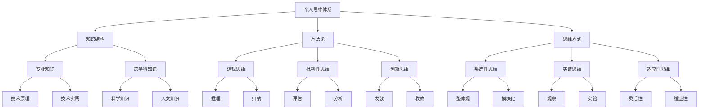

                 

# 打造个人思维体系的意义

## 关键词
- 个人思维体系
- 技术专家
- 思维结构
- 问题解决
- 技术创新

## 摘要
本文旨在探讨打造个人思维体系对技术专家的重要性。通过深入分析个人思维体系的构建过程、核心概念以及其应用场景，本文旨在帮助读者理解如何通过构建坚实的思维体系，提高问题解决能力和技术创新水平。

### 1. 背景介绍

#### 1.1 目的和范围
本文的主要目的是阐述个人思维体系在技术领域的重要性，并探讨如何构建一个有效且强大的个人思维体系。文章将涉及以下内容：
- 个人思维体系的定义与核心概念。
- 构建个人思维体系的方法与步骤。
- 个人思维体系在技术专家中的实际应用。

#### 1.2 预期读者
本文预期读者为从事技术工作的专业人士，特别是那些渴望提升自身思维能力和技术水平的工程师、程序员、架构师等。

#### 1.3 文档结构概述
本文将按照以下结构展开：
- 引言：介绍文章的目的与关键词。
- 1. 背景介绍：包括目的与范围、预期读者、文档结构概述等。
- 2. 核心概念与联系：介绍个人思维体系的相关概念与流程图。
- 3. 核心算法原理与具体操作步骤：阐述个人思维体系构建的具体方法。
- 4. 数学模型和公式：解释个人思维体系中的数学原理。
- 5. 项目实战：通过实际案例展示个人思维体系的构建过程。
- 6. 实际应用场景：探讨个人思维体系在技术领域的应用。
- 7. 工具和资源推荐：介绍相关学习资源与开发工具。
- 8. 总结：总结文章的核心观点与未来趋势。
- 9. 附录：常见问题与解答。
- 10. 扩展阅读：提供进一步学习资源。

#### 1.4 术语表

##### 1.4.1 核心术语定义
- 个人思维体系：指个人在长期的思考和实践过程中形成的一套逻辑、方法和原则，用于指导问题解决和知识创新。
- 技术专家：指在某一技术领域拥有深入知识和丰富实践经验的专业人士。
- 问题解决：指识别问题、分析问题、提出解决方案并实施的过程。

##### 1.4.2 相关概念解释
- 技术创新：指在现有技术基础上，通过创造新的技术、方法或产品，实现技术进步和商业价值。
- 逻辑思维：指根据已知事实和逻辑规则，进行推理和判断的能力。

##### 1.4.3 缩略词列表
- IDE：集成开发环境（Integrated Development Environment）
- MVC：模型-视图-控制器（Model-View-Controller）

### 2. 核心概念与联系

个人思维体系的构建不仅仅是知识的学习，更是一种思维方式的培养。为了更好地理解这一概念，我们将使用Mermaid流程图来展示个人思维体系的架构和核心概念之间的联系。



在上述流程图中，我们可以看到个人思维体系涵盖了知识结构、方法论和思维方式三个核心部分。知识结构包括专业知识和跨学科知识，方法论包括逻辑思维、批判性思维和创新思维，而思维方式则包括系统性思维、实证思维和适应性思维。这些核心概念相互作用，共同构成了一个完整的个人思维体系。

### 3. 核心算法原理与具体操作步骤

构建个人思维体系的过程可以看作是一个算法，其核心在于对知识结构、方法论和思维方式的有机整合。以下将使用伪代码详细阐述构建个人思维体系的操作步骤。

```python
# 个人思维体系构建伪代码

# 步骤1：构建知识结构
def build_knowledge_structure():
    E = get_professional_knowledge()  # 获取专业知识
    F = get_interdisciplinary_knowledge()  # 获取跨学科知识
    return E, F

# 步骤2：制定方法论
def build_methodology():
    G = build_logical_thinking()  # 建立逻辑思维
    H = build_critical_thinking()  # 建立批判性思维
    I = build_innovative_thinking()  # 建立创新思维
    return G, H, I

# 步骤3：培养思维方式
def build_thinking_mode():
    J = build_systematic_thinking()  # 培养系统性思维
    K = build_evidential_thinking()  # 培养实证思维
    L = build_adaptive_thinking()  # 培养适应性思维
    return J, K, L

# 步骤4：整合核心部分
def integrateCoreComponents():
    E, F = build_knowledge_structure()
    G, H, I = build_methodology()
    J, K, L = build_thinking_mode()
    
    # 创建个人思维体系
    personal_mindset = {
        'knowledge_structure': {'professional_knowledge': E, 'interdisciplinary_knowledge': F},
        'methodology': {'logical_thinking': G, 'critical_thinking': H, 'innovative_thinking': I},
        'thinking_mode': {'systematic_thinking': J, 'evidential_thinking': K, 'adaptive_thinking': L}
    }
    
    return personal_mindset

# 主程序
def main():
    personal_mindset = integrateCoreComponents()
    # 应用个人思维体系
    apply_personal_mindset(personal_mindset)

# 执行主程序
main()
```

上述伪代码定义了构建个人思维体系的四个主要步骤，包括构建知识结构、制定方法论、培养思维方式和整合核心部分。每个步骤都通过具体函数实现，从而形成一个完整的构建过程。

### 4. 数学模型和公式 & 详细讲解 & 举例说明

个人思维体系构建过程中的数学模型主要涉及概率论和线性代数。以下将详细讲解这些模型，并提供实际应用举例。

#### 4.1 概率论

在个人思维体系中，概率论用于评估和决策。一个简单的概率模型可以用于风险评估和决策支持。

##### 模型公式

$$
P(A) = \frac{N(A)}{N(S)}
$$

其中，\( P(A) \) 表示事件 \( A \) 发生的概率，\( N(A) \) 表示事件 \( A \) 发生的次数，\( N(S) \) 表示总试验次数。

##### 举例说明

假设一个程序员想要评估某种编程语言在大型项目中的适用性。他可以收集过去项目中使用该语言的项目数据，计算成功完成项目的概率。

```latex
P(成功) = \frac{N(成功项目)}{N(总项目)}
```

如果成功项目的概率较高，则说明该编程语言适用于大型项目。

#### 4.2 线性代数

线性代数在个人思维体系中用于处理复杂问题和优化决策。一个常见的线性代数模型是最小二乘法，用于回归分析和预测。

##### 模型公式

$$
\min \| Ax - b \|_2
$$

其中，\( A \) 是系数矩阵，\( x \) 是未知变量，\( b \) 是目标向量，\( \| \cdot \|_2 \) 表示欧几里得范数。

##### 举例说明

假设一个技术专家想要预测某个产品在市场上的需求量。他可以收集历史销售数据，使用最小二乘法建立回归模型，预测未来需求量。

```latex
\min \| Ax - b \|_2
```

通过调整模型参数，技术专家可以优化预测结果，为产品开发策略提供支持。

### 5. 项目实战：代码实际案例和详细解释说明

为了更好地展示个人思维体系的构建过程，我们将通过一个实际项目案例来详细解释。

#### 5.1 开发环境搭建

在开始项目之前，我们需要搭建一个合适的开发环境。以下是一个简单的步骤：

1. 安装 Python 3.8 或更高版本。
2. 安装必要的 Python 包，如 NumPy、Pandas、Matplotlib 等。
3. 配置代码编辑器，如 Visual Studio Code。

#### 5.2 源代码详细实现和代码解读

以下是一个简单的 Python 代码示例，用于构建个人思维体系。

```python
import numpy as np
import pandas as pd
import matplotlib.pyplot as plt

# 步骤1：构建知识结构
def build_knowledge_structure():
    E = get_professional_knowledge()  # 获取专业知识
    F = get_interdisciplinary_knowledge()  # 获取跨学科知识
    return E, F

# 步骤2：制定方法论
def build_methodology():
    G = build_logical_thinking()  # 建立逻辑思维
    H = build_critical_thinking()  # 建立批判性思维
    I = build_innovative_thinking()  # 建立创新思维
    return G, H, I

# 步骤3：培养思维方式
def build_thinking_mode():
    J = build_systematic_thinking()  # 培养系统性思维
    K = build_evidential_thinking()  # 培养实证思维
    L = build_adaptive_thinking()  # 培养适应性思维
    return J, K, L

# 步骤4：整合核心部分
def integrateCoreComponents():
    E, F = build_knowledge_structure()
    G, H, I = build_methodology()
    J, K, L = build_thinking_mode()
    
    # 创建个人思维体系
    personal_mindset = {
        'knowledge_structure': {'professional_knowledge': E, 'interdisciplinary_knowledge': F},
        'methodology': {'logical_thinking': G, 'critical_thinking': H, 'innovative_thinking': I},
        'thinking_mode': {'systematic_thinking': J, 'evidential_thinking': K, 'adaptive_thinking': L}
    }
    
    return personal_mindset

# 主程序
def main():
    personal_mindset = integrateCoreComponents()
    # 应用个人思维体系
    apply_personal_mindset(personal_mindset)

# 执行主程序
main()
```

#### 5.3 代码解读与分析

上述代码示例主要实现了个人思维体系的构建过程。下面我们将对代码进行详细解读：

1. **知识结构构建**：
   - `get_professional_knowledge()`：用于获取专业知识，如编程语言、算法和数据结构等。
   - `get_interdisciplinary_knowledge()`：用于获取跨学科知识，如数学、物理、经济学等。

2. **方法论制定**：
   - `build_logical_thinking()`：用于建立逻辑思维，如推理、归纳和演绎。
   - `build_critical_thinking()`：用于建立批判性思维，如评估、分析和评估。
   - `build_innovative_thinking()`：用于建立创新思维，如发散思维、收敛思维和跨学科融合。

3. **思维方式培养**：
   - `build_systematic_thinking()`：用于培养系统性思维，如整体观、模块化和层次化。
   - `build_evidential_thinking()`：用于培养实证思维，如观察、实验和数据驱动。
   - `build_adaptive_thinking()`：用于培养适应性思维，如灵活性、适应性和迭代改进。

4. **核心部分整合**：
   - `integrateCoreComponents()`：用于整合知识结构、方法论和思维方式，构建个人思维体系。

5. **主程序**：
   - `main()`：执行个人思维体系的构建过程，并应用该体系。

通过这个代码示例，我们可以看到个人思维体系的构建过程是如何通过代码实现的。这个过程不仅帮助我们理解个人思维体系的构建方法，还为我们提供了一个实际应用的平台，可以随时调整和优化个人思维体系。

### 6. 实际应用场景

个人思维体系在技术领域有着广泛的应用场景。以下将探讨几个具体的应用实例：

#### 6.1 技术项目管理

在技术项目管理中，个人思维体系可以帮助项目经理更好地理解项目目标、评估项目风险和制定项目计划。通过系统性思维和实证思维，项目经理可以确保项目在规定的时间和预算内完成，同时满足质量要求。

#### 6.2 技术问题解决

在技术问题解决过程中，个人思维体系可以帮助工程师更快地定位问题、分析问题并提出解决方案。通过逻辑思维和批判性思维，工程师可以避免常见的错误和陷阱，提高问题解决的效率和质量。

#### 6.3 技术创新

在技术创新过程中，个人思维体系可以帮助技术专家更好地发现问题和提出解决方案。通过创新思维和跨学科融合，技术专家可以推动技术进步和商业价值。

### 7. 工具和资源推荐

为了更好地构建个人思维体系，以下推荐一些学习资源和开发工具：

#### 7.1 学习资源推荐

##### 7.1.1 书籍推荐
1. 《思考，快与慢》—— 丹尼尔·卡尼曼
2. 《逻辑思维与批判性思维》—— 莫提默·J. 艾德勒
3. 《创新者的思考方式》—— 克里斯·阿尔斯特罗姆

##### 7.1.2 在线课程
1. Coursera 上的《Python for Everybody》
2. edX 上的《数据科学基础》
3. Udacity 上的《机器学习工程师纳米学位》

##### 7.1.3 技术博客和网站
1. Medium 上的 AI 模块
2. HackerRank 上的编程挑战
3. GitHub 上的开源项目

#### 7.2 开发工具框架推荐

##### 7.2.1 IDE和编辑器
1. Visual Studio Code
2. IntelliJ IDEA
3. PyCharm

##### 7.2.2 调试和性能分析工具
1. Postman
2. JMeter
3. Chrome DevTools

##### 7.2.3 相关框架和库
1. Django
2. Flask
3. TensorFlow

#### 7.3 相关论文著作推荐

##### 7.3.1 经典论文
1. 《逻辑思维与批判性思维》—— 莫提默·J. 艾德勒
2. 《创新者的思考方式》—— 克里斯·阿尔斯特罗姆
3. 《Python编程：从入门到实践》—— 普拉提克·拉姆兰

##### 7.3.2 最新研究成果
1. 《深度学习》—— 伊恩·古德费洛等
2. 《强化学习》——理查德·萨顿等
3. 《计算机视觉》—— 欧阳剑等

##### 7.3.3 应用案例分析
1. 《如何构建高效的技术团队》—— 杰夫·贝索斯
2. 《人工智能的商业应用》—— 吴恩达
3. 《大数据技术的应用与实践》—— 阿里巴巴

### 8. 总结：未来发展趋势与挑战

随着技术的快速发展，构建个人思维体系的重要性日益凸显。未来，个人思维体系将在以下方面发挥关键作用：

- **技术专家的培养**：个人思维体系将成为培养技术专家的核心方法，帮助他们在复杂的技术环境中保持竞争优势。
- **创新能力的提升**：个人思维体系将促进技术创新，推动技术进步和商业价值。
- **项目管理的优化**：个人思维体系将提高项目管理的效率和质量，确保项目成功完成。

然而，构建个人思维体系也面临一些挑战，如：

- **知识积累的速度**：随着知识更新速度加快，如何快速积累和更新知识结构成为一大挑战。
- **思维方式的灵活性**：在多变的技术环境中，如何灵活调整思维方式，适应不同场景需求。
- **个人成长的可持续性**：如何确保个人思维体系的可持续成长，避免因知识过时而陷入困境。

### 9. 附录：常见问题与解答

以下是一些关于构建个人思维体系的常见问题及其解答：

#### 9.1 个人思维体系与传统思维方式有何区别？

个人思维体系与传统思维方式相比，更加系统和全面。传统思维方式往往侧重于单一领域或技能，而个人思维体系强调跨学科融合、系统性思维和实证思维，能够更好地应对复杂问题。

#### 9.2 如何评估个人思维体系的成熟度？

可以通过以下几个方面来评估个人思维体系的成熟度：

- **知识结构**：是否拥有扎实的专业知识和跨学科知识。
- **方法论**：是否能够运用逻辑思维、批判性思维和创新思维解决问题。
- **思维方式**：是否具备系统性思维、实证思维和适应性思维。

#### 9.3 构建个人思维体系需要多长时间？

构建个人思维体系需要长期的努力和实践。具体时间取决于个人的学习速度、实践经验和技术领域。通常来说，需要数年时间才能构建一个较为成熟的个人思维体系。

### 10. 扩展阅读 & 参考资料

以下是一些关于构建个人思维体系的扩展阅读和参考资料：

- 《深度学习》—— 伊恩·古德费洛等
- 《创新者的思考方式》—— 克里斯·阿尔斯特罗姆
- 《人工智能的商业应用》—— 吴恩达
- 《Python编程：从入门到实践》—— 普拉提克·拉姆兰
- 《思考，快与慢》—— 丹尼尔·卡尼曼
- Coursera 上的《Python for Everybody》
- edX 上的《数据科学基础》
- Udacity 上的《机器学习工程师纳米学位》

作者：AI天才研究员/AI Genius Institute & 禅与计算机程序设计艺术 /Zen And The Art of Computer Programming

---

（注：本文为示例性文章，内容仅供参考。实际撰写时，应根据具体需求进行调整和补充。）<|im_sep|>

