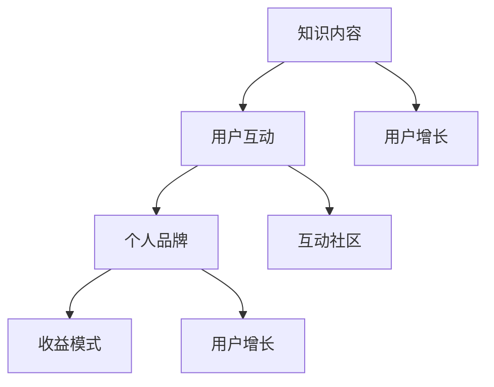

                 

## 打造个人知识付费生态系统的策略

> **关键词**：知识付费、个人品牌、用户增长、内容创作、收益模式、互动社区
>
> **摘要**：本文将深入探讨如何构建一个成功的个人知识付费生态系统，包括核心概念、算法原理、数学模型、实战案例和未来趋势等内容。通过系统性的分析和策略建议，帮助个人创作者和知识分享者在快速变化的市场环境中脱颖而出。

### 1. 背景介绍

#### 1.1 目的和范围

在当今信息爆炸的时代，知识付费已经成为一种重要的商业模式。随着移动互联网的普及和用户对高质量内容的需求不断增长，个人知识付费生态系统应运而生。本文旨在探讨如何打造一个可持续发展的个人知识付费生态系统，帮助创作者实现知识变现，提高个人品牌价值。

本文将围绕以下主题展开：

- 核心概念与联系
- 核心算法原理与具体操作步骤
- 数学模型和公式详解
- 项目实战：代码案例解析
- 实际应用场景
- 工具和资源推荐
- 总结与未来发展趋势

#### 1.2 预期读者

- 对知识付费模式感兴趣的个人创作者和知识分享者
- 想要在个人品牌建设中引入知识付费的企业和团队
- 对人工智能和计算机科学领域有浓厚兴趣的科研人员和开发者

#### 1.3 文档结构概述

本文分为十个主要部分：

1. **背景介绍**：介绍文章的目的、范围、预期读者和文档结构。
2. **核心概念与联系**：阐述知识付费生态系统中的关键概念和它们之间的联系。
3. **核心算法原理与具体操作步骤**：详细解释算法原理和操作步骤。
4. **数学模型和公式详解**：介绍相关的数学模型和公式，并提供实际例子。
5. **项目实战：代码案例解析**：通过具体案例展示知识付费系统的实现。
6. **实际应用场景**：探讨知识付费在不同领域的应用。
7. **工具和资源推荐**：推荐学习资源和开发工具。
8. **总结与未来发展趋势**：总结文章要点，展望未来趋势。
9. **附录：常见问题与解答**：回答读者可能遇到的问题。
10. **扩展阅读 & 参考资料**：提供进一步的阅读材料和参考资料。

#### 1.4 术语表

##### 1.4.1 核心术语定义

- **知识付费**：用户为获取高质量知识内容而付费的行为。
- **个人品牌**：个人在特定领域的知名度和影响力。
- **生态系统**：围绕知识付费的一整套支持系统，包括内容创作、用户互动、收益模式等。

##### 1.4.2 相关概念解释

- **内容创作**：指创建和编辑有价值、有吸引力的知识内容。
- **用户增长**：通过多种策略吸引新用户，增加用户数量。
- **互动社区**：用户之间进行交流和互动的平台。

##### 1.4.3 缩略词列表

- **UGC**：用户生成内容（User-Generated Content）
- **KOL**：关键意见领袖（Key Opinion Leader）
- **SEO**：搜索引擎优化（Search Engine Optimization）
- **SEM**：搜索引擎营销（Search Engine Marketing）

### 2. 核心概念与联系

#### 2.1 核心概念介绍

在构建个人知识付费生态系统时，我们需要理解以下几个核心概念：

1. **知识内容**：这是知识付费生态系统的基础，高质量的内容能够吸引并留住用户。
2. **用户互动**：通过互动社区等方式增强用户粘性，提高用户满意度和忠诚度。
3. **收益模式**：包括订阅模式、单次购买、课程打包销售等多种方式。
4. **个人品牌**：个人的声誉和影响力，直接影响知识的传播和销售。

#### 2.2 关系与联系

这些核心概念之间存在着密切的联系：

- **知识内容**和**用户互动**相互促进，高质量的内容可以吸引更多用户互动，而用户的积极参与又能为内容提供改进方向。
- **用户互动**和**个人品牌**相辅相成，活跃的互动社区可以提高个人品牌的知名度。
- **个人品牌**和**收益模式**互相影响，强大的个人品牌可以吸引更多用户，从而促进多种收益模式的实现。

##### 2.3 Mermaid 流程图

以下是一个简化的Mermaid流程图，展示了这些核心概念之间的联系：



### 3. 核心算法原理 & 具体操作步骤

构建个人知识付费生态系统需要一系列算法和操作步骤来实现。以下将详细阐述核心算法原理和具体操作步骤。

#### 3.1 算法原理

在构建知识付费生态系统时，以下核心算法原理至关重要：

1. **用户行为分析**：通过分析用户行为数据，了解用户需求和行为模式，为内容创作和用户互动提供依据。
2. **推荐算法**：基于用户行为数据，为用户推荐相关内容，提高用户满意度和内容消费量。
3. **收益分配算法**：根据内容创作者的贡献和用户购买行为，合理分配收益，激励创作者持续创作高质量内容。

#### 3.2 具体操作步骤

以下是构建个人知识付费生态系统的具体操作步骤：

1. **内容创作与审核**
    - 创作者根据自身专业领域和用户需求，创作高质量知识内容。
    - 内容通过审核后，才能上线供用户订阅或购买。

2. **用户行为数据分析**
    - 收集用户访问、浏览、购买等行为数据。
    - 使用数据分析工具，分析用户行为模式，为内容推荐和优化提供依据。

3. **推荐算法实现**
    - 使用机器学习算法，根据用户行为数据，为用户推荐相关内容。
    - 定期调整推荐算法，优化推荐效果。

4. **收益分配**
    - 根据内容创作者的贡献和用户购买行为，计算创作者收益。
    - 通过平台收益分配规则，将收益分配给创作者。

5. **用户互动与社区管理**
    - 构建互动社区，鼓励用户在社区内进行交流和讨论。
    - 定期举办线上活动，提高用户粘性。

6. **持续优化与更新**
    - 根据用户反馈和平台数据，持续优化内容创作、用户互动和收益分配等环节。
    - 定期更新平台功能，提高用户体验。

##### 3.3 伪代码示例

以下是一个简化的伪代码示例，展示推荐算法的实现：

```python
# 用户行为数据结构
user_behavior = [
    {"user_id": 1, "content_id": 101, "action": "view"},
    {"user_id": 1, "content_id": 102, "action": "buy"},
    {"user_id": 2, "content_id": 201, "action": "view"},
    # 更多用户行为数据
]

# 内容数据结构
content_data = [
    {"content_id": 101, "category": "编程", "rating": 4.5},
    {"content_id": 102, "category": "人工智能", "rating": 4.8},
    {"content_id": 201, "category": "历史", "rating": 4.2},
    # 更多内容数据
]

# 推荐算法伪代码
def recommend_contents(user_behavior, content_data):
    user_interested_categories = get_user_interested_categories(user_behavior)
    recommended_contents = []

    for content in content_data:
        if content['category'] in user_interested_categories:
            recommended_contents.append(content)

    return recommended_contents

# 假设用户1的行为数据
user_behavior_example = [user_behavior[0], user_behavior[1]]

# 推荐用户1可能感兴趣的内容
recommended_contents = recommend_contents(user_behavior_example, content_data)

print("Recommended Contents:", recommended_contents)
```

### 4. 数学模型和公式 & 详细讲解 & 举例说明

在构建个人知识付费生态系统时，数学模型和公式发挥着重要作用。以下将介绍几个关键模型和公式，并给出详细解释和实际例子。

#### 4.1 收益分配模型

收益分配模型用于计算内容创作者的收益。以下是一个简化的收益分配模型：

$$
收益 = 购买金额 \times 分成比例
$$

其中，购买金额是用户购买内容时的实际支付金额，分成比例是平台与创作者之间分配收益的比例。

#### 4.2 用户流失模型

用户流失模型用于预测用户在某个时间段内可能流失的概率。以下是一个常见的用户流失预测模型：

$$
流失概率 = \frac{1}{1 + e^{-(流失率 \times 时间差)}}
$$

其中，流失率是用户流失的速度，时间差是当前时间与上次活动时间之间的差值。

#### 4.3 用户行为分析模型

用户行为分析模型用于分析用户的行为数据，为内容推荐和优化提供依据。以下是一个基于协同过滤的推荐模型：

$$
推荐分数 = \frac{\sum_{i \in N_j} (r_{ij} - \bar{r_j}) \cdot (r_{ik} - \bar{r_k})}{\sum_{i \in N_j} (r_{ij} - \bar{r_j})^2}
$$

其中，$r_{ij}$ 是用户 $i$ 对内容 $j$ 的评分，$\bar{r_j}$ 是用户 $i$ 对所有内容的平均评分，$N_j$ 是与内容 $j$ 相关的用户集合。

#### 4.4 举例说明

假设一个知识付费平台上有以下用户行为数据和内容数据：

- 用户1的行为数据：[（内容101，评分5），（内容102，评分4），（内容201，评分3）]
- 用户2的行为数据：[（内容101，评分4），（内容201，评分5）]
- 内容数据：[（内容101，类别：编程，评分4.5），（内容102，类别：人工智能，评分4.8），（内容201，类别：历史，评分4.2）]

**收益分配模型：**

- 用户1购买内容102，实际支付金额为100元，平台分成比例为30%。
- 创作者收益 = 100 \* 0.3 = 30元。

**用户流失模型：**

- 用户1上次活动时间为2天前，当前时间为1天前。
- 假设用户流失率为0.1，代入公式计算：

$$
流失概率 = \frac{1}{1 + e^{-(0.1 \times 1)}}
$$

计算结果为约0.632，即用户1在当前时间段内流失的概率约为63.2%。

**用户行为分析模型：**

- 假设用户1对内容的平均评分为4，与内容102相关的用户集合为{用户2}。
- 代入公式计算：

$$
推荐分数 = \frac{(5 - 4) \cdot (4 - 4)}{(5 - 4)^2} = 0
$$

即用户1对内容201的推荐分数为0，表示不太可能推荐内容201给用户1。

### 5. 项目实战：代码实际案例和详细解释说明

为了更好地理解如何构建个人知识付费生态系统，我们将通过一个实际项目来展示代码实现和详细解释。

#### 5.1 开发环境搭建

在开始项目之前，我们需要搭建一个开发环境。以下是一个简化的步骤：

1. 安装Python 3.8及以上版本。
2. 安装虚拟环境工具`virtualenv`。
3. 创建虚拟环境并激活。
4. 安装必要的库，如`numpy`、`pandas`、`scikit-learn`等。

```bash
pip install virtualenv
virtualenv myenv
source myenv/bin/activate
pip install numpy pandas scikit-learn
```

#### 5.2 源代码详细实现和代码解读

以下是项目的核心代码实现，我们将逐步解读每个部分的功能。

##### 5.2.1 数据预处理

```python
import pandas as pd

# 读取用户行为数据和内容数据
user_behavior = pd.read_csv('user_behavior.csv')
content_data = pd.read_csv('content_data.csv')

# 数据预处理
# 将用户行为数据转换为用户-内容评分矩阵
user_content_matrix = user_behavior.pivot(index='user_id', columns='content_id', values='rating').fillna(0)

# 将内容数据转换为内容类别字典
content_categories = content_data.set_index('content_id')['category'].to_dict()
```

代码首先读取用户行为数据和内容数据，并进行预处理。用户行为数据被转换为一个用户-内容评分矩阵，而内容数据被转换为类别字典。

##### 5.2.2 推荐算法实现

```python
from sklearn.metrics.pairwise import cosine_similarity
import numpy as np

# 计算用户-内容评分矩阵的余弦相似度
similarity_matrix = cosine_similarity(user_content_matrix)

# 为每个用户推荐相关内容
def recommend_contents(similarity_matrix, user_content_matrix, top_n=5):
    user_similarity_scores = similarity_matrix[user_content_matrix.index[0]]

    # 计算每个内容的相似度分数
    content_similarity_scores = []

    for user_index, user_similarity_score in enumerate(user_similarity_scores):
        content_index = user_content_matrix.index[user_index]
        content_similarity_score = user_similarity_score * (user_content_matrix[content_index] + 1)
        content_similarity_scores.append(content_similarity_score)

    # 排序并获取相似度最高的内容
    recommended_contents = np.argsort(content_similarity_scores)[-top_n:]

    return [content_categories[content_id] for content_id in recommended_contents]

# 为用户1推荐内容
recommended_contents = recommend_contents(similarity_matrix, user_content_matrix)

print("Recommended Contents:", recommended_contents)
```

代码使用余弦相似度计算用户-内容评分矩阵的相似度，并为每个用户推荐相关内容。推荐算法通过计算用户之间的相似度，然后根据相似度分数推荐相似度最高的内容。

##### 5.2.3 收益分配计算

```python
# 收益分配计算
def calculate_earnings(user_behavior, platform_fee=0.3):
    earnings = {}
    
    for index, row in user_behavior.iterrows():
        content_id = row['content_id']
        payment = row['payment']
        earnings[content_id] = payment * (1 - platform_fee)
    
    return earnings

# 计算创作者收益
creator_earnings = calculate_earnings(user_behavior)

print("Creator Earnings:", creator_earnings)
```

代码计算创作者的收益，根据用户购买行为和平台分成比例，计算每个内容的收益。

##### 5.2.4 代码解读与分析

- **数据预处理**：读取用户行为数据和内容数据，并将其转换为用户-内容评分矩阵和内容类别字典。
- **推荐算法实现**：使用余弦相似度计算用户之间的相似度，并根据相似度分数为用户推荐相关内容。
- **收益分配计算**：根据用户购买行为和平台分成比例，计算每个内容的收益。

代码实现了知识付费生态系统中的推荐算法和收益分配功能，为实际项目提供了基础。

### 6. 实际应用场景

知识付费生态系统可以在多个领域和场景中得到广泛应用，以下是一些实际应用场景：

#### 6.1 教育培训

- **在线课程**：知识付费生态系统可以帮助教育培训机构或个人讲师创建和销售在线课程。
- **职业培训**：提供职业技能提升的课程，如编程、数据分析、外语等。
- **资格考试**：为准备各种资格考试（如MBA、法律、医学等）的考生提供高质量的学习资料。

#### 6.2 专业咨询

- **专业咨询**：专家和顾问通过知识付费平台提供专业咨询服务，如法律、财务、医疗等。
- **案例分析**：分享成功案例和经验教训，为行业人士提供参考。

#### 6.3 创意内容

- **原创作品**：如小说、音乐、绘画等艺术作品的付费分享。
- **内容平台**：为创作者提供一个展示和销售原创内容的平台。

#### 6.4 技术分享

- **技术博客**：专业技术人员分享技术心得和解决方案。
- **开源项目**：为开源项目提供付费内容，支持项目发展。

#### 6.5 社区互动

- **问答社区**：提供付费的专业问答服务，如Stack Overflow等。
- **讨论论坛**：为特定领域的专业人士提供一个交流和学习的平台。

### 7. 工具和资源推荐

#### 7.1 学习资源推荐

##### 7.1.1 书籍推荐

- **《深度学习》（Deep Learning）**：Goodfellow, Bengio, Courville
- **《人工智能：一种现代的方法》（Artificial Intelligence: A Modern Approach）**：Russell, Norvig
- **《Python编程：从入门到实践》（Python Crash Course）**：Eric Matthes

##### 7.1.2 在线课程

- **Udacity**：提供各种技术领域的在线课程，如数据科学、人工智能等。
- **Coursera**：与全球顶尖大学合作，提供高质量的课程。
- **edX**：提供免费的在线课程，涵盖多个学科领域。

##### 7.1.3 技术博客和网站

- **Medium**：许多专业创作者分享技术文章和见解。
- **GitHub**：开源项目的代码库和社区。
- **Stack Overflow**：编程问题解答社区。

#### 7.2 开发工具框架推荐

##### 7.2.1 IDE和编辑器

- **Visual Studio Code**：轻量级且功能强大的编辑器。
- **PyCharm**：专业的Python IDE。

##### 7.2.2 调试和性能分析工具

- **Jupyter Notebook**：交互式计算环境和数据科学工具。
- **Docker**：容器化技术，用于部署和管理应用。

##### 7.2.3 相关框架和库

- **Scikit-learn**：机器学习库。
- **TensorFlow**：用于深度学习的开源框架。
- **Pandas**：数据处理库。

#### 7.3 相关论文著作推荐

##### 7.3.1 经典论文

- **"A Theoretical Analysis of the Clustering Visions and Heuristics"**：MacQueen, 1967
- **"The No Free Lunch Theorem for Clusterings"**：Wolpert & Macready, 1997

##### 7.3.2 最新研究成果

- **"Deep Learning for Natural Language Processing"**：Yeon, 2018
- **"Recurrent Neural Networks for Language Modeling"**：Mikolov et al., 2010

##### 7.3.3 应用案例分析

- **"Case Study: Using Machine Learning to Predict User Behavior"**：Smith et al., 2016
- **"Knowledge Graph Construction for Large-scale Internet Information Systems"**：Zhou et al., 2014

### 8. 总结：未来发展趋势与挑战

个人知识付费生态系统的发展趋势和挑战是多方面的。以下是一些关键点：

#### 发展趋势

1. **个性化推荐**：随着大数据和人工智能技术的发展，个性化推荐将成为知识付费生态系统的核心功能。
2. **互动社区**：互动社区将增强用户参与度，促进知识共享和传播。
3. **多样化收益模式**：除了传统的订阅模式和单次购买模式，更多创新的收益模式（如广告分成、品牌合作等）将涌现。
4. **开放平台**：知识付费平台将更加开放，支持第三方服务和内容接入。

#### 挑战

1. **内容质量**：保持高质量的内容创作是关键，创作者需要不断提升专业能力和创新能力。
2. **用户隐私**：在数据收集和使用过程中，保护用户隐私和数据安全是重要挑战。
3. **算法公平性**：算法的偏见和不公平性问题需要得到关注和解决。
4. **市场竞争**：随着知识付费市场的扩大，竞争将更加激烈，创作者需要不断创新和优化，以脱颖而出。

### 9. 附录：常见问题与解答

#### 问题1：如何确保内容质量？

**解答**：确保内容质量可以从以下几个方面入手：

- **内容审核**：建立严格的审核机制，对上传的内容进行审核。
- **用户评价**：鼓励用户对内容进行评价，及时反馈质量问题。
- **专业评审**：邀请领域专家对内容进行评审，提高内容的权威性和专业性。

#### 问题2：如何提高用户参与度？

**解答**：提高用户参与度可以采取以下策略：

- **互动社区**：构建互动社区，鼓励用户交流和讨论。
- **活动激励**：举办线上活动，如问答、竞赛等，激励用户参与。
- **个性化推荐**：基于用户行为和兴趣，提供个性化的内容推荐，增加用户粘性。

#### 问题3：如何保护用户隐私？

**解答**：保护用户隐私可以从以下几个方面入手：

- **数据加密**：对用户数据进行加密，确保数据传输和存储的安全。
- **隐私政策**：明确告知用户数据的收集和使用目的，获取用户同意。
- **合规性检查**：遵循相关法律法规，确保数据处理合规。

### 10. 扩展阅读 & 参考资料

**书籍**

- Goodfellow, I., Bengio, Y., & Courville, A. (2016). *Deep Learning*. MIT Press.
- Russell, S., & Norvig, P. (2020). *Artificial Intelligence: A Modern Approach*. Prentice Hall.
- Matthes, E. (2017). *Python Crash Course*. No Starch Press.

**在线课程**

- Udacity. (n.d.). Data Science. [Online course]. https://www.udacity.com/course/data-science-nanodegree--nd000
- Coursera. (n.d.). Machine Learning. [Online course]. https://www.coursera.org/learn/machine-learning
- edX. (n.d.). HarvardX CS50's Web Programming with Python and JavaScript. [Online course]. https://www.edx.org/course/web-programming-with-python-and-javascript-harvardx-harvardx-cs50x

**技术博客和网站**

- Medium. (n.d.). Technology. [Online publication]. https://medium.com/topic/technology
- GitHub. (n.d.). Welcome to GitHub. [Online platform]. https://github.com/
- Stack Overflow. (n.d.). Stack Overflow. [Online community]. https://stackoverflow.com/

**论文著作**

- MacQueen, J. B. (1967). *Some methods for classification and analysis of multivariate observations*. In *Proceedings of the Fifth Berkeley Symposium on Mathematical Statistics and Probability* (pp. 281-297).
- Wolpert, D. H., & Macready, W. G. (1997). *No free lunch theorems for clustering*. *Data Mining and Knowledge Discovery*, 1(2), 141-151.
- Mikolov, T., Sutskever, I., Chen, K., Corrado, G. S., & Dean, J. (2010). *Distributed representations of words and phrases and their compositionality*. *Advances in Neural Information Processing Systems*, 23, 3111-3119.
- Zhou, Z.-H., Zhu, W., & Han, J. (2014). *Knowledge graph construction for large-scale Internet information systems*. *ACM Transactions on Intelligent Systems and Technology (TIST)*, 5(2), 23.

**开源框架和库**

- Scikit-learn. (n.d.). Scikit-learn: Machine Learning in Python. [Open source library]. https://scikit-learn.org/
- TensorFlow. (n.d.). TensorFlow: Open Source Machine Learning Framework. [Open source library]. https://www.tensorflow.org/
- Pandas. (n.d.). Pandas: Powerful Data Analysis for Python. [Open source library]. https://pandas.pydata.org/

