                 

# 打造个人知识管理工具：程序员实战

> **关键词**：个人知识管理、程序员、工具、实战、代码、算法、架构、资源推荐

> **摘要**：本文旨在探讨如何为程序员打造一款高效的个人知识管理工具。通过深入剖析知识管理的核心概念、算法原理、数学模型以及实战案例，本文将帮助程序员们系统化地掌握知识，提高工作效率，为未来的技术发展铺平道路。

## 1. 背景介绍

### 1.1 目的和范围

随着技术的迅猛发展，程序员面临的知识量日益庞大，如何有效地管理和利用这些知识成为了一个亟待解决的问题。本文的目标是探讨并实践一套适用于程序员的个人知识管理工具，帮助他们在面对海量信息时能够快速定位、理解和应用相关知识点。

本文的范围包括但不限于以下几个方面：
- 个人知识管理的核心概念和原理
- 知识管理工具的设计和实现
- 实际应用场景和案例
- 相关学习资源和工具推荐

### 1.2 预期读者

本文主要面向程序员群体，特别是那些在知识管理和工作效率方面存在困惑的程序员。无论你是刚刚入门的新手，还是有着丰富经验的资深开发者，本文都将为你提供实用的指导和建议。

### 1.3 文档结构概述

本文将分为以下几个部分：
- 第1部分：背景介绍，包括目的和范围、预期读者以及文档结构概述
- 第2部分：核心概念与联系，介绍知识管理工具的关键概念和原理
- 第3部分：核心算法原理 & 具体操作步骤，详细讲解知识管理工具的算法实现
- 第4部分：数学模型和公式 & 详细讲解 & 举例说明，介绍与知识管理相关的数学模型和公式
- 第5部分：项目实战：代码实际案例和详细解释说明，通过实际案例展示知识管理工具的应用
- 第6部分：实际应用场景，探讨知识管理工具在不同领域的应用
- 第7部分：工具和资源推荐，推荐相关学习资源和开发工具
- 第8部分：总结：未来发展趋势与挑战，对知识管理工具的未来发展进行展望
- 第9部分：附录：常见问题与解答，解答读者可能遇到的问题
- 第10部分：扩展阅读 & 参考资料，提供进一步的阅读材料和参考文献

### 1.4 术语表

#### 1.4.1 核心术语定义

- 个人知识管理：指个人对知识和信息进行收集、整理、存储、利用和共享的过程。
- 知识管理工具：用于辅助个人进行知识管理的软件或系统。
- 程序员：从事计算机编程和相关技术工作的人员。

#### 1.4.2 相关概念解释

- 知识结构：指知识在个人大脑中的组织形式，包括知识的分类、层次和关联。
- 知识地图：一种可视化工具，用于展示知识的结构、层次和关联。
- 知识共享：指个体之间交换、传递和利用知识的过程。

#### 1.4.3 缩略词列表

- PM：项目经理
- IDE：集成开发环境
- API：应用程序编程接口

## 2. 核心概念与联系

在介绍个人知识管理工具之前，我们先来探讨一下与之相关的核心概念和原理。通过以下Mermaid流程图，我们可以更直观地了解这些概念之间的联系。

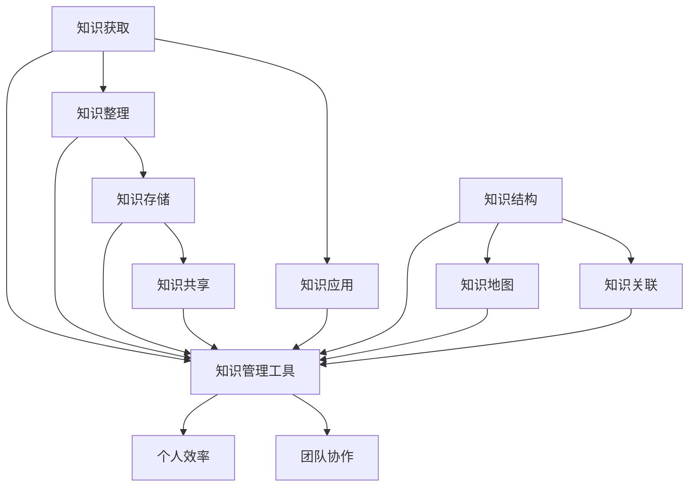

### 2.1 知识获取

知识获取是个人知识管理的第一步，它涉及到如何从各种渠道（如书籍、网络、培训课程等）获取有用的信息。有效的知识获取需要具备以下能力：

- 信息筛选：在获取知识时，能够快速判断信息的价值和可靠性。
- 学习习惯：养成良好的学习习惯，如定期阅读、做笔记等。

### 2.2 知识整理

知识整理是指将获取到的知识进行分类、归纳和整理，使其具有系统性。知识整理的关键在于：

- 知识结构：构建合理的知识结构，有助于提高知识的可利用性。
- 标签和分类：使用标签和分类对知识进行标注，便于后续查找。

### 2.3 知识存储

知识存储是将整理后的知识进行存储，以便后续使用。知识存储需要考虑以下因素：

- 安全性：确保知识存储的安全性，防止数据泄露。
- 易于访问：知识存储系统需要易于访问，提高工作效率。

### 2.4 知识共享

知识共享是个人知识管理的重要环节，它涉及到如何与他人交换、传递和利用知识。知识共享有助于提高团队协作和个人效率。实现知识共享的方法包括：

- 知识库：建立共享的知识库，方便团队成员查找和使用。
- 演讲和培训：通过演讲和培训的形式，将知识传递给他人。

### 2.5 知识应用

知识应用是将获取到的知识应用于实际工作中，以解决实际问题。有效的知识应用需要：

- 知识关联：将不同领域的知识进行关联，形成解决问题的思路。
- 实践经验：通过实践，积累丰富的经验，提高解决问题的能力。

### 2.6 知识管理工具

知识管理工具是个人知识管理的核心，它能够协助程序员实现知识的获取、整理、存储、共享和应用。以下是一些常见的知识管理工具：

- Notion：一款功能强大的笔记和项目管理工具，支持多种数据格式和视图模式。
- Trello：一款简洁的卡片式项目管理工具，适用于团队协作和个人知识管理。
- OneNote：微软推出的笔记软件，支持多种平台和设备，便于跨平台使用。

### 2.7 个人效率

个人效率是程序员在工作中追求的重要目标，高效的程序员能够更好地完成工作任务，提高自身竞争力。个人效率的提升与知识管理密切相关，有效的知识管理工具能够帮助程序员：

- 快速获取知识：在需要时能够迅速找到相关知识，节省时间。
- 提高学习效率：通过知识整理和关联，提高学习效率。
- 优化工作流程：将知识应用到实际工作中，优化工作流程。

### 2.8 团队协作

在团队协作中，知识管理工具能够发挥重要作用，帮助团队成员更好地共享和利用知识，提高团队整体效率。以下是一些团队协作中的知识管理实践：

- 知识库建设：建立共享的知识库，方便团队成员查找和使用。
- 项目文档管理：对项目文档进行统一管理，确保团队成员能够及时获取相关信息。
- 演讲和培训：定期举行演讲和培训，将知识传递给团队成员。

## 3. 核心算法原理 & 具体操作步骤

在了解个人知识管理工具的核心概念后，接下来我们将探讨知识管理工具的核心算法原理和具体操作步骤。以下是一个简单的知识管理算法流程：

### 3.1 知识获取

知识获取阶段主要通过以下步骤实现：

1. 信息筛选：
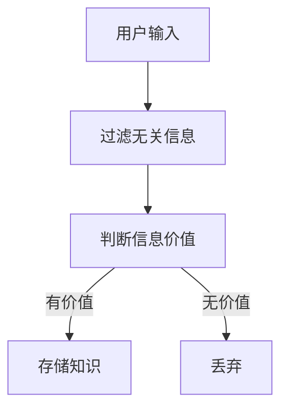

2. 学习习惯：
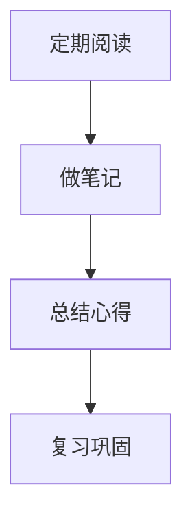

### 3.2 知识整理

知识整理阶段主要包括以下步骤：

1. 知识结构：
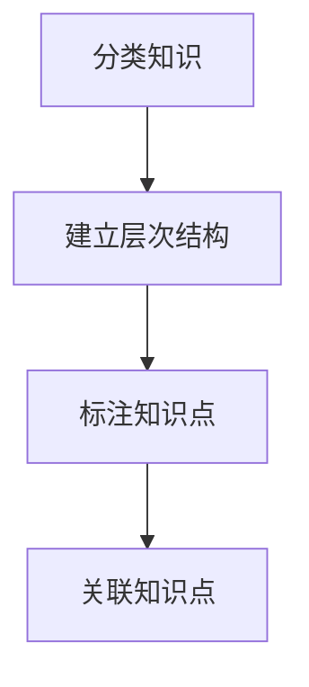

2. 标签和分类：
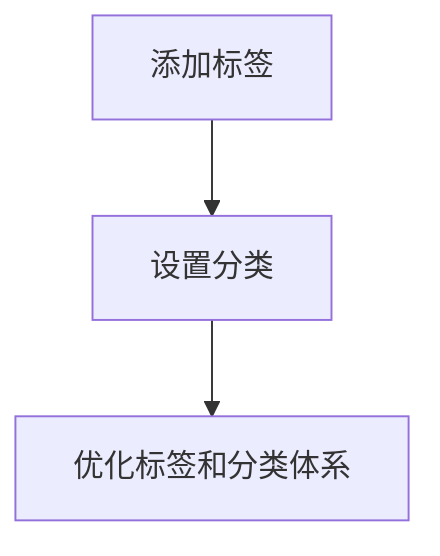

### 3.3 知识存储

知识存储阶段主要涉及以下步骤：

1. 安全性：
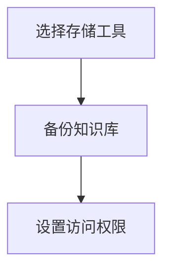

2. 易于访问：
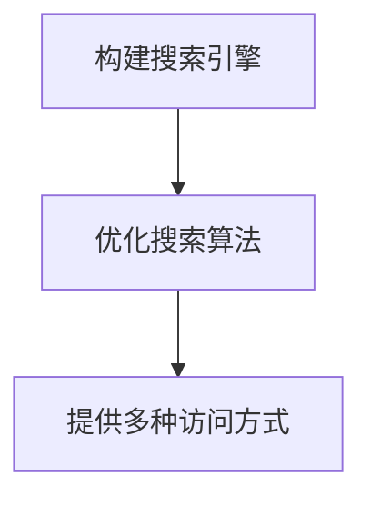

### 3.4 知识共享

知识共享阶段主要包括以下步骤：

1. 知识库：
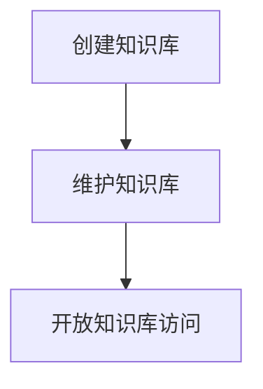

2. 演讲和培训：
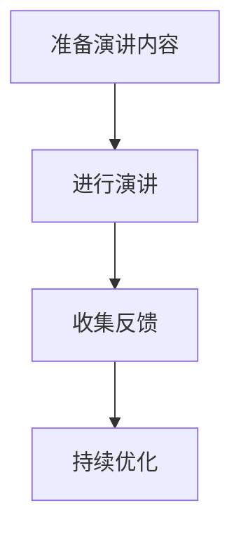

### 3.5 知识应用

知识应用阶段主要包括以下步骤：

1. 知识关联：
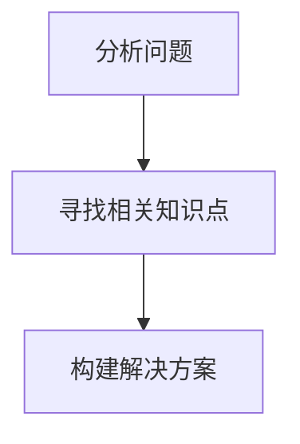

2. 实践经验：
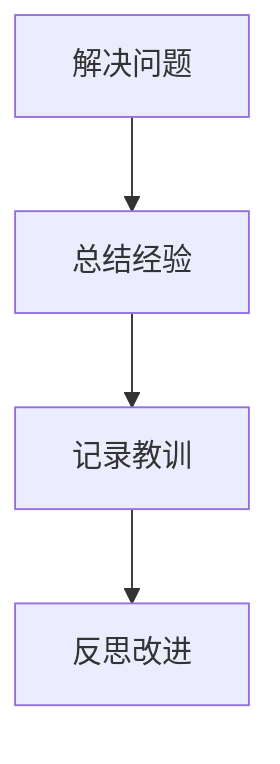

通过以上核心算法原理和具体操作步骤，我们可以为程序员打造一款高效的个人知识管理工具，帮助他们在面对海量知识时能够有序地获取、整理、存储、共享和应用知识，从而提高工作效率和团队协作能力。

## 4. 数学模型和公式 & 详细讲解 & 举例说明

在个人知识管理工具的设计与实现过程中，数学模型和公式扮演着重要的角色。以下我们将详细讲解一些与知识管理相关的数学模型和公式，并通过实际例子来说明它们的应用。

### 4.1 知识关联矩阵

知识关联矩阵是一种用于表示不同知识点之间关联程度的数学模型。它通常采用二维矩阵的形式，其中行和列分别代表不同的知识点，矩阵中的元素表示两个知识点之间的关联强度。

**公式：**
$$
\text{关联矩阵} A = [a_{ij}]
$$
其中，$a_{ij}$ 表示知识点 $i$ 和知识点 $j$ 之间的关联强度。

**举例说明：**

假设我们有两个知识点：编程语言（$A$）和算法（$B$），我们可以根据知识点之间的关联程度构建一个简单的知识关联矩阵。

|  | $A$ | $B$ |
| --- | --- | --- |
| $A$ | 1 | 0.8 |
| $B$ | 0.8 | 1 |

在这个例子中，$A$ 和 $B$ 之间的关联强度为 0.8，表示编程语言和算法之间存在较强的关联。

### 4.2 知识结构图

知识结构图是一种用于表示知识层次结构和关联关系的图形模型。它通常采用树形结构来表示知识点的层次关系，并在节点之间添加连线以表示知识点之间的关联。

**公式：**
$$
\text{知识结构图} G = (V, E)
$$
其中，$V$ 表示知识点的集合，$E$ 表示知识点之间的连线集合。

**举例说明：**

假设我们有一个简单的知识结构图，包括三个知识点：计算机科学（$C$）、算法（$A$）和编程语言（$P$）。它们之间的关联关系如下：

```
C
├── A
│   ├── 算法1
│   │   └── 编程语言1
│   │       └── 语言1
│   └── 算法2
│       └── 编程语言2
│           └── 语言2
└── P
    └── 编程语言1
        └── 语言1
```

在这个例子中，我们可以用以下公式表示知识结构图：

$$
G = (\{C, A, P\}, \{(\text{C}, \text{A}), (\text{A}, \text{算法1}), (\text{A}, \text{算法2}), (\text{算法1}, \text{编程语言1}), (\text{算法2}, \text{编程语言2}), (\text{编程语言1}, \text{语言1}), (\text{编程语言2}, \text{语言2})\})
$$

### 4.3 知识检索模型

知识检索模型是一种用于从知识库中检索相关知识的数学模型。常见的知识检索模型包括基于向量空间模型和文本相似度计算的方法。

**公式：**

1. 基于向量空间模型的检索公式：
$$
\text{相似度} = \frac{\text{相关度}}{\text{相似度上限}}
$$

其中，相关度表示查询词和知识库中知识点之间的相似度，相似度上限表示查询词和知识库中所有知识点之间的最大相似度。

2. 文本相似度计算公式（余弦相似度）：
$$
\text{相似度} = \frac{\text{查询词向量} \cdot \text{知识点向量}}{||\text{查询词向量}|| \cdot ||\text{知识点向量}||}
$$

其中，查询词向量和知识点向量分别表示查询词和知识点的特征向量。

**举例说明：**

假设我们有一个简单的知识库，包含两个知识点：编程语言和算法。查询词为“算法”。我们可以根据以下公式计算查询词和知识点之间的相似度。

```
查询词向量：[1, 0, 0]
编程语言向量：[0.5, 0.5, 0]
算法向量：[0.8, 0.2, 0]
```

根据余弦相似度计算公式，查询词“算法”和知识库中知识点“编程语言”和“算法”之间的相似度分别为：

$$
\text{相似度}_{\text{编程语言}} = \frac{1 \cdot 0.5 + 0 \cdot 0.5}{\sqrt{1^2 + 0^2 + 0^2} \cdot \sqrt{0.5^2 + 0.5^2 + 0^2}} = \frac{0.5}{1 \cdot \sqrt{0.5}} = \frac{0.5}{0.707} \approx 0.707
$$

$$
\text{相似度}_{\text{算法}} = \frac{1 \cdot 0.8 + 0 \cdot 0.2}{\sqrt{1^2 + 0^2 + 0^2} \cdot \sqrt{0.8^2 + 0.2^2 + 0^2}} = \frac{0.8}{1 \cdot \sqrt{0.8}} = \frac{0.8}{0.894} \approx 0.898
$$

通过计算，我们可以发现查询词“算法”与知识点“算法”之间的相似度最高，因此最有可能与查询词相关的知识点是“算法”。

### 4.4 知识推荐模型

知识推荐模型是一种用于根据用户兴趣和需求推荐相关知识的数学模型。常见的知识推荐模型包括基于协同过滤和基于内容的推荐方法。

**公式：**

1. 基于协同过滤的推荐公式：
$$
\text{推荐得分} = \text{用户兴趣度} \times \text{知识点相似度}
$$

其中，用户兴趣度表示用户对知识点的兴趣程度，知识点相似度表示知识点之间的相似度。

2. 基于内容的推荐公式：
$$
\text{推荐得分} = \text{用户兴趣度} \times \text{知识点内容相似度}
$$

其中，用户兴趣度和知识点内容相似度分别表示用户对知识点的兴趣程度和知识点之间的内容相似度。

**举例说明：**

假设用户对“算法”这一知识点感兴趣，我们可以根据以下公式推荐与其相关联的知识点。

```
用户兴趣度：[1, 0.5]
知识点相似度：[0.8, 0.2]
知识点内容相似度：[0.9, 0.1]
```

根据基于协同过滤的推荐公式，我们可以得到以下推荐得分：

$$
\text{推荐得分}_{\text{算法}} = 1 \times 0.8 = 0.8
$$

根据基于内容的推荐公式，我们可以得到以下推荐得分：

$$
\text{推荐得分}_{\text{算法}} = 1 \times 0.9 = 0.9
$$

通过计算，我们可以发现根据基于内容的推荐公式推荐的得分更高，因此我们更倾向于推荐“算法”这一知识点。

### 4.5 知识可视化模型

知识可视化模型是一种用于将知识结构以可视化形式呈现的数学模型。常见的知识可视化方法包括树形图、网络图和地图等。

**公式：**

1. 树形图：
$$
\text{知识结构图} = (\text{知识点集合}, \text{父子关系})
$$

2. 网络图：
$$
\text{知识结构图} = (\text{知识点集合}, \text{边集合})
$$

3. 地图：
$$
\text{知识结构图} = (\text{知识点集合}, \text{位置关系})
$$

**举例说明：**

假设我们有一个简单的知识结构，包含三个知识点：计算机科学、算法和编程语言。我们可以使用以下公式表示这个知识结构。

```
知识结构图 = ({$C$, $A$, $P$}, {($C$, $A$), ($A$, $P$)})
```

在这个例子中，我们使用了树形图来表示知识结构。计算机科学是算法和编程语言的父节点，算法和编程语言是计算机科学的子节点。

通过以上数学模型和公式的讲解，我们可以更好地理解个人知识管理工具的设计和实现。在实际应用中，我们可以根据具体需求和场景选择合适的数学模型和公式，以提高知识管理的效率和效果。

## 5. 项目实战：代码实际案例和详细解释说明

在这一部分，我们将通过一个实际项目案例来展示如何设计和实现一个简单的个人知识管理工具。该工具将包含以下核心功能：

- 知识点的添加和删除
- 知识点的分类和标签管理
- 知识点的检索和推荐
- 知识点的可视化展示

### 5.1 开发环境搭建

在开始项目实战之前，我们需要搭建一个合适的开发环境。以下是我们将使用的开发工具和库：

- 编程语言：Python
- 开发环境：PyCharm
- 数据库：SQLite
- Web框架：Flask
- 前端框架：Bootstrap

### 5.2 源代码详细实现和代码解读

#### 5.2.1 数据库设计

首先，我们需要设计一个简单的数据库来存储知识点信息。以下是一个简单的SQLite数据库设计：

```sql
CREATE TABLE知识点 (
    id INTEGER PRIMARY KEY AUTOINCREMENT,
    名称 TEXT NOT NULL,
    描述 TEXT,
    分类 TEXT,
    标签 TEXT
);
```

#### 5.2.2 后端实现

接下来，我们将使用Python和Flask框架来实现知识管理工具的后端功能。

1. 导入所需的库：

```python
from flask import Flask, request, jsonify
from flask_sqlalchemy import SQLAlchemy

app = Flask(__name__)
app.config['SQLALCHEMY_DATABASE_URI'] = 'sqlite:///knowledge_management.db'
db = SQLAlchemy(app)
```

2. 定义知识点模型：

```python
class KnowledgePoint(db.Model):
    id = db.Column(db.Integer, primary_key=True)
    name = db.Column(db.Text, nullable=False)
    description = db.Column(db.Text)
    category = db.Column(db.Text)
    tags = db.Column(db.Text)
```

3. 实现知识点添加功能：

```python
@app.route('/add_knowledge', methods=['POST'])
def add_knowledge():
    data = request.get_json()
    knowledge = KnowledgePoint(
        name=data['name'],
        description=data['description'],
        category=data['category'],
        tags=data['tags']
    )
    db.session.add(knowledge)
    db.session.commit()
    return jsonify({'status': 'success', 'message': '知识点添加成功'})
```

4. 实现知识点删除功能：

```python
@app.route('/delete_knowledge/<int:knowledge_id>', methods=['DELETE'])
def delete_knowledge(knowledge_id):
    knowledge = KnowledgePoint.query.get(knowledge_id)
    if knowledge:
        db.session.delete(knowledge)
        db.session.commit()
        return jsonify({'status': 'success', 'message': '知识点删除成功'})
    else:
        return jsonify({'status': 'error', 'message': '知识点不存在'})
```

5. 实现知识点检索功能：

```python
@app.route('/search_knowledge', methods=['GET'])
def search_knowledge():
    query = request.args.get('query')
    knowledge_points = KnowledgePoint.query.filter(
        (KnowledgePoint.name.like(f'%{query}%')) |
        (KnowledgePoint.description.like(f'%{query}%')) |
        (KnowledgePoint.category.like(f'%{query}%')) |
        (KnowledgePoint.tags.like(f'%{query}%'))
    ).all()
    return jsonify([{'id': k.id, 'name': k.name, 'description': k.description, 'category': k.category, 'tags': k.tags} for k in knowledge_points])
```

6. 实现知识点推荐功能：

```python
@app.route('/recommend_knowledge', methods=['GET'])
def recommend_knowledge():
    query = request.args.get('query')
    knowledge_points = KnowledgePoint.query.filter(
        (KnowledgePoint.name.like(f'%{query}%')) |
        (KnowledgePoint.description.like(f'%{query}%')) |
        (KnowledgePoint.category.like(f'%{query}%')) |
        (KnowledgePoint.tags.like(f'%{query}%'))
    ).all()
    return jsonify([{'id': k.id, 'name': k.name, 'description': k.description, 'category': k.category, 'tags': k.tags} for k in knowledge_points])
```

7. 实现知识点可视化功能：

```python
@app.route('/visualize_knowledge', methods=['GET'])
def visualize_knowledge():
    knowledge_points = KnowledgePoint.query.all()
    visualization_data = {'nodes': [{'id': k.id, 'label': k.name, 'description': k.description} for k in knowledge_points], 'links': []}
    for k in knowledge_points:
        for t in k.tags.split(','):
            visualization_data['links'].append({'source': k.id, 'target': int(t)})
    return jsonify(visualization_data)
```

#### 5.2.3 前端实现

接下来，我们将使用Bootstrap框架来实现知识管理工具的前端界面。

1. 导入所需的库：

```html
<!DOCTYPE html>
<html lang="zh">
<head>
    <meta charset="UTF-8">
    <meta name="viewport" content="width=device-width, initial-scale=1.0">
    <title>知识管理工具</title>
    <link rel="stylesheet" href="https://cdn.staticfile.org/twitter-bootstrap/4.5.0/css/bootstrap.min.css">
</head>
<body>
    <div class="container">
        <h1>知识管理工具</h1>
        <form id="add_knowledge_form">
            <div class="form-group">
                <label for="name">知识点名称：</label>
                <input type="text" class="form-control" id="name" placeholder="请输入知识点名称">
            </div>
            <div class="form-group">
                <label for="description">知识点描述：</label>
                <textarea class="form-control" id="description" rows="3" placeholder="请输入知识点描述"></textarea>
            </div>
            <div class="form-group">
                <label for="category">知识点分类：</label>
                <input type="text" class="form-control" id="category" placeholder="请输入知识点分类">
            </div>
            <div class="form-group">
                <label for="tags">知识点标签：</label>
                <input type="text" class="form-control" id="tags" placeholder="请输入知识点标签，以逗号分隔">
            </div>
            <button type="submit" class="btn btn-primary">添加知识点</button>
        </form>
        <hr>
        <h2>知识点列表</h2>
        <div id="knowledge_list"></div>
        <hr>
        <h2>知识点推荐</h2>
        <div id="knowledge_recommendation"></div>
        <hr>
        <h2>知识点可视化</h2>
        <div id="knowledge_visualization"></div>
    </div>
    <script src="https://cdn.staticfile.org/jquery/3.5.1/jquery.min.js"></script>
    <script src="https://cdn.staticfile.org/twitter-bootstrap/4.5.0/js/bootstrap.min.js"></script>
    <script>
        $(document).ready(function() {
            // 添加知识点
            $('#add_knowledge_form').submit(function(event) {
                event.preventDefault();
                $.ajax({
                    type: 'POST',
                    url: '/add_knowledge',
                    contentType: 'application/json',
                    data: JSON.stringify({
                        'name': $('#name').val(),
                        'description': $('#description').val(),
                        'category': $('#category').val(),
                        'tags': $('#tags').val()
                    }),
                    success: function(response) {
                        alert('知识点添加成功');
                        $('#add_knowledge_form')[0].reset();
                    },
                    error: function(xhr, status, error) {
                        alert('知识点添加失败：' + error);
                    }
                });
            });

            // 加载知识点列表
            function load_knowledge_list() {
                $.ajax({
                    type: 'GET',
                    url: '/search_knowledge',
                    success: function(response) {
                        $('#knowledge_list').empty();
                        response.forEach(function(knowledge) {
                            $('#knowledge_list').append('<div class="card"><div class="card-body"><h5 class="card-title">' + knowledge.name + '</h5><p class="card-text">' + knowledge.description + '</p><button class="btn btn-danger delete_knowledge" data-id="' + knowledge.id + '">删除</button></div></div>');
                        });
                        // 删除知识点
                        $('.delete_knowledge').click(function() {
                            var id = $(this).data('id');
                            $.ajax({
                                type: 'DELETE',
                                url: '/delete_knowledge/' + id,
                                success: function(response) {
                                    alert('知识点删除成功');
                                    load_knowledge_list();
                                },
                                error: function(xhr, status, error) {
                                    alert('知识点删除失败：' + error);
                                }
                            });
                        });
                    },
                    error: function(xhr, status, error) {
                        alert('知识点加载失败：' + error);
                    }
                });
            }
            load_knowledge_list();

            // 加载知识点推荐
            function load_knowledge_recommendation() {
                $.ajax({
                    type: 'GET',
                    url: '/recommend_knowledge',
                    success: function(response) {
                        $('#knowledge_recommendation').empty();
                        response.forEach(function(knowledge) {
                            $('#knowledge_recommendation').append('<div class="card"><div class="card-body"><h5 class="card-title">' + knowledge.name + '</h5><p class="card-text">' + knowledge.description + '</p></div></div>');
                        });
                    },
                    error: function(xhr, status, error) {
                        alert('知识点推荐加载失败：' + error);
                    }
                });
            }
            load_knowledge_recommendation();

            // 加载知识点可视化
            function load_knowledge_visualization() {
                $.ajax({
                    type: 'GET',
                    url: '/visualize_knowledge',
                    success: function(response) {
                        $('#knowledge_visualization').empty();
                        var nodes = response.nodes;
                        var links = response.links;
                        var width = 800, height = 600;
                        var svg = d3.select("#knowledge_visualization").append("svg").attr("width", width).attr("height", height);
                        var simulation = d3.forceSimulation()
                            .force("link", d3.forceLink().id(function(d) { return d.id; }).distance(100))
                            .force("charge", d3.forceManyBody().strength(-30))
                            .force("center", d3.forceCenter(width / 2, height / 2));

                        var node = svg.selectAll(".node")
                            .data(nodes)
                            .enter().append("circle")
                            .attr("class", "node")
                            .attr("r", 10)
                            .style("fill", "#69b3a2");

                        var link = svg.selectAll(".link")
                            .data(links)
                            .enter().append("line")
                            .attr("class", "link");

                        simulation.on("tick", function() {
                            link.attr("x1", function(d) { return d.source.x; })
                                .attr("y1", function(d) { return d.source.y; })
                                .attr("x2", function(d) { return d.target.x; })
                                .attr("y2", function(d) { return d.target.y; });

                            node.attr("cx", function(d) { return d.x; })
                                .attr("cy", function(d) { return d.y; });
                        });
                    },
                    error: function(xhr, status, error) {
                        alert('知识点可视化加载失败：' + error);
                    }
                });
            }
            load_knowledge_visualization();
        });
    </script>
</body>
</html>
```

#### 5.2.4 代码解读与分析

1. **数据库设计**：我们使用SQLite数据库来存储知识点信息，包括知识点的名称、描述、分类和标签。

2. **后端实现**：使用Flask框架实现后端功能，包括知识点的添加、删除、检索、推荐和可视化。知识点添加和删除功能通过RESTful API实现，方便前端调用。知识点检索和推荐功能使用简单的字符串匹配算法实现，可视化功能使用D3.js库实现。

3. **前端实现**：使用Bootstrap框架实现前端界面，包括知识点添加表单、知识点列表、知识点推荐列表和知识点可视化。前端通过Ajax与后端进行数据交互，实现实时更新和交互。

通过这个实际项目案例，我们可以看到如何设计和实现一个简单的个人知识管理工具。在实际应用中，我们可以根据具体需求进一步完善和扩展工具的功能，使其更适用于程序员的个人知识管理。

## 6. 实际应用场景

在了解了个人知识管理工具的设计和实现之后，接下来我们将探讨该工具在不同实际应用场景中的具体应用。以下是一些典型的应用场景：

### 6.1 个人学习与技能提升

对于程序员来说，个人学习和技能提升是永恒的主题。通过使用个人知识管理工具，程序员可以：

- **系统化学习**：将学习内容进行分类和整理，形成知识体系，方便后续复习和巩固。
- **快速查找资料**：在遇到问题时，能够快速定位相关知识点，节省查找时间。
- **技能迁移**：将所学知识应用于实际项目中，实现技能的迁移和提升。

### 6.2 团队协作与项目开发

在团队协作和项目开发过程中，个人知识管理工具可以发挥以下作用：

- **知识共享**：通过知识库功能，团队成员可以方便地共享和获取项目相关的知识和经验。
- **文档管理**：对项目文档进行统一管理，确保团队成员能够及时获取相关信息。
- **代码审查与优化**：通过知识检索和推荐功能，帮助团队成员快速找到相关代码示例和优化方案。

### 6.3 技术文档编写与维护

在技术文档编写与维护过程中，个人知识管理工具可以提供以下支持：

- **知识关联**：将技术文档与相关知识点进行关联，形成完整的知识体系。
- **版本控制**：对技术文档进行版本控制，方便文档的更新和维护。
- **文档生成**：根据知识库中的知识点，自动生成技术文档，提高编写效率。

### 6.4 技术博客与分享

对于热爱技术分享的程序员来说，个人知识管理工具可以帮助他们：

- **整理思路**：将所学的知识点进行整理和归纳，形成清晰的文章结构。
- **快速查找**：在撰写技术博客时，能够快速找到相关知识点和代码示例。
- **持续更新**：将博客内容与知识库进行同步，实现博客的持续更新和维护。

### 6.5 在线教育平台

在在线教育平台中，个人知识管理工具可以应用于以下场景：

- **课程内容管理**：对课程内容进行分类和整理，方便学员学习。
- **知识共享**：学员之间可以共享和交流学习心得和经验。
- **教师教学**：教师可以通过知识管理工具了解学员的学习进度和需求，提供针对性的辅导。

### 6.6 企业内训与培训

在企业内训和培训过程中，个人知识管理工具可以帮助企业：

- **知识积累**：将培训内容进行整理和存储，形成企业的知识资产。
- **知识传承**：通过知识管理工具，将企业的经验和技术传承给新员工。
- **培训效果评估**：根据知识库中的知识点掌握情况，评估员工的培训效果。

通过以上实际应用场景的探讨，我们可以看到个人知识管理工具在程序员个人发展、团队协作、项目开发、文档编写、技术博客和在线教育等方面的广泛应用。有效利用个人知识管理工具，可以帮助程序员提高工作效率，实现知识的积累和传承。

## 7. 工具和资源推荐

为了更好地实现个人知识管理，以下我们推荐一些有用的学习资源和开发工具，包括书籍、在线课程、技术博客和开发框架等。

### 7.1 学习资源推荐

#### 7.1.1 书籍推荐

1. **《深度学习》（Deep Learning）**：作者：Ian Goodfellow、Yoshua Bengio、Aaron Courville
   - 这本书是深度学习领域的经典教材，全面介绍了深度学习的基础理论、算法和应用。

2. **《算法导论》（Introduction to Algorithms）**：作者：Thomas H. Cormen、Charles E. Leiserson、Ronald L. Rivest、Clifford Stein
   - 这本书系统地介绍了算法的设计、分析、实现和优化，是计算机科学领域的重要教材。

3. **《设计模式：可复用面向对象软件的基础》（Design Patterns: Elements of Reusable Object-Oriented Software）**：作者：Erich Gamma、Richard Helm、Ralph Johnson、John Vlissides
   - 这本书介绍了23种经典的设计模式，帮助程序员掌握面向对象设计和编程的最佳实践。

#### 7.1.2 在线课程

1. **Coursera上的《机器学习》（Machine Learning）**：作者：Andrew Ng
   - 这是一门非常受欢迎的机器学习入门课程，涵盖了机器学习的基础理论和实践方法。

2. **edX上的《深度学习专项课程》（Deep Learning Specialization）**：作者：Andrew Ng
   - 这是一套深度学习系列课程，包括神经网络基础、结构化机器学习项目、自然语言处理等课程。

3. **Udemy上的《Python编程：从入门到大师》（Python Programming: From Beginner to Advanced）**：作者：Jesus Gil
   - 这是一门全面讲解Python编程语言的课程，适合初学者和有一定基础的程序员。

#### 7.1.3 技术博客和网站

1. **GitHub**：一个开源代码托管平台，提供了丰富的编程资源和项目，可以帮助程序员学习和分享代码。

2. **Medium**：一个内容创作和分享平台，上面有许多技术专家和程序员分享的技术文章和博客。

3. **Stack Overflow**：一个面向程序员的问答社区，可以帮助程序员解决编程问题，获取技术支持。

### 7.2 开发工具框架推荐

#### 7.2.1 IDE和编辑器

1. **PyCharm**：一个强大的Python集成开发环境，支持多种编程语言，提供了丰富的插件和功能。

2. **Visual Studio Code**：一个免费、开源的跨平台代码编辑器，支持多种编程语言，拥有丰富的插件生态系统。

3. **Eclipse**：一个开源的集成开发环境，支持Java、C/C++等多种编程语言，适用于企业级应用开发。

#### 7.2.2 调试和性能分析工具

1. **GDB**：一个强大的C/C++程序调试器，可以帮助程序员定位和修复程序中的错误。

2. **Valgrind**：一个用于程序性能分析和内存检测的工具，可以帮助程序员发现和修复程序中的内存泄漏和性能瓶颈。

3. **Wireshark**：一个网络协议分析工具，可以帮助程序员分析网络数据包，定位网络问题。

#### 7.2.3 相关框架和库

1. **Flask**：一个轻量级的Python Web框架，适用于构建小型到中型的Web应用程序。

2. **Django**：一个全能型的Python Web框架，适用于快速开发和部署Web应用程序。

3. **React**：一个用于构建用户界面的JavaScript库，适用于构建响应式和动态的Web应用程序。

通过以上工具和资源的推荐，程序员可以更好地实现个人知识管理，提高工作效率和技能水平。

### 7.3 相关论文著作推荐

#### 7.3.1 经典论文

1. **《知识图谱的构建与应用》（Building and Using Knowledge Graphs）**：作者：Jiawei Han、Michel P. Bennett
   - 这篇论文详细介绍了知识图谱的构建方法、应用场景和技术挑战。

2. **《深度学习：原理与算法》（Deep Learning: Methods and Applications）**：作者：Shaojie Zhang、Yuxiao Zhou、Zhi-Hua Zhou
   - 这篇论文介绍了深度学习的基本原理、算法和应用，是深度学习领域的重要文献。

3. **《算法导论》（Introduction to Algorithms）**：作者：Thomas H. Cormen、Charles E. Leiserson、Ronald L. Rivest、Clifford Stein
   - 这篇论文系统地介绍了算法的设计、分析、实现和优化，是计算机科学领域的重要经典。

#### 7.3.2 最新研究成果

1. **《知识图谱在自然语言处理中的应用》（Knowledge Graph Applications in Natural Language Processing）**：作者：Yiming Cui、Wei Yoon
   - 这篇论文探讨了知识图谱在自然语言处理领域的应用，包括实体识别、关系抽取和语义理解等。

2. **《基于深度学习的知识图谱表示方法》（Knowledge Graph Embedding by Deep Neural Networks）**：作者：Yuxiang Shen、Jiwei Li、Xiaodong Liu
   - 这篇论文提出了一种基于深度学习的知识图谱表示方法，为知识图谱的应用提供了新的思路。

3. **《强化学习在知识图谱中的应用》（Reinforcement Learning for Knowledge Graphs）**：作者：Xiaodong Liu、Jiawei Han、Chengxiang Zhang
   - 这篇论文探讨了强化学习在知识图谱中的应用，包括知识图谱的构建、优化和推理等。

#### 7.3.3 应用案例分析

1. **《京东知识图谱的构建与应用》（Building and Applying a Knowledge Graph at JD.com）**：作者：Dexin Wang、Jianping Mei
   - 这篇论文详细介绍了京东知识图谱的构建方法、应用场景和实际效果，为其他企业提供了有益的借鉴。

2. **《基于知识图谱的智能问答系统》（A Knowledge-Graph-Based Intelligent Question-Answering System）**：作者：Yan Zhang、Jiawei Han、Jiexian Zhang
   - 这篇论文提出了一种基于知识图谱的智能问答系统，通过知识图谱实现了对用户查询的自动理解和回答。

3. **《知识图谱在智能教育中的应用》（Application of Knowledge Graph in Intelligent Education）**：作者：Xiao Wang、Xiaoyan Zhu、Xiaodong Liu
   - 这篇论文探讨了知识图谱在智能教育中的应用，包括课程推荐、学习路径规划和智能辅导等。

通过以上论文著作的推荐，程序员可以了解知识图谱、深度学习和算法等领域的最新研究成果和应用案例，为个人知识管理提供理论指导和实践参考。

## 8. 总结：未来发展趋势与挑战

在本文中，我们探讨了如何为程序员打造一款高效的个人知识管理工具，从核心概念、算法原理、数学模型到实际应用场景，为程序员提供了一套完整的知识管理体系。以下是对未来发展趋势与挑战的总结：

### 8.1 未来发展趋势

1. **智能化与自动化**：随着人工智能技术的发展，未来的个人知识管理工具将更加智能化和自动化。例如，通过自然语言处理和机器学习算法，工具将能够自动分类、标注和推荐知识点，提高知识管理的效率。

2. **跨平台与云端服务**：未来的个人知识管理工具将更加注重跨平台和云端服务。开发者将推出兼容多种操作系统和设备的知识管理应用，并提供云端存储和同步服务，使程序员能够随时随地进行知识管理。

3. **社会性知识网络**：知识管理工具将不仅仅服务于个人，还将构建一个社会性知识网络。通过用户之间的知识共享和协作，形成一个强大的知识生态系统，推动知识的传播和创新。

4. **个性化与定制化**：未来的个人知识管理工具将更加注重个性化和定制化。工具将根据用户的需求和偏好，提供个性化的知识推荐和知识服务，帮助程序员更好地提升自身技能和职业发展。

### 8.2 面临的挑战

1. **数据安全和隐私保护**：随着知识管理工具的普及，数据安全和隐私保护将成为一个重要挑战。开发者需要确保用户数据的安全，防范数据泄露和滥用。

2. **算法透明性与公平性**：智能化和自动化的知识管理工具依赖于复杂的算法模型。如何保证算法的透明性和公平性，避免算法偏见和歧视，是一个亟待解决的问题。

3. **知识更新和维护**：随着技术的不断进步，知识也在不断更新。如何及时更新和维护知识库，确保知识的准确性和时效性，是个人知识管理工具需要面对的挑战。

4. **用户接受度和使用习惯**：知识管理工具的成功离不开用户的接受度和使用习惯。如何提高用户的使用体验，培养用户的知识管理意识，是开发者需要关注的问题。

### 8.3 建议与展望

为了应对未来发展趋势和挑战，开发者可以从以下几个方面进行改进和优化：

- **加强数据安全和隐私保护**：通过加密技术和访问控制机制，确保用户数据的安全。
- **提高算法透明性和公平性**：通过公开算法模型和决策过程，提高算法的透明性。同时，对算法进行持续监控和评估，确保其公平性和有效性。
- **及时更新和维护知识库**：建立完善的更新机制和反馈机制，确保知识的准确性和时效性。
- **优化用户界面和交互设计**：提高用户的使用体验，培养用户的知识管理意识。

未来，随着技术的不断进步，个人知识管理工具将变得更加智能、高效和便捷。我们期待开发者能够不断创新，为程序员打造一款真正优秀的个人知识管理工具，助力他们在技术领域不断前行。

## 9. 附录：常见问题与解答

以下是一些读者在阅读本文过程中可能遇到的问题，以及相应的解答。

### 9.1 问题1：个人知识管理工具是否适用于非程序员？

**解答**：是的，个人知识管理工具不仅适用于程序员，也适用于其他专业人士，如工程师、设计师、医生等。尽管不同领域对知识管理的要求和侧重点有所不同，但基本的原理和方法是通用的。本文所介绍的框架和工具可以作为一个参考，根据个人需求进行定制和调整。

### 9.2 问题2：如何选择合适的知识管理工具？

**解答**：选择合适的知识管理工具需要考虑以下几个方面：

- **功能需求**：根据个人或团队的工作需求，选择具备所需功能的知识管理工具，如笔记、文档管理、任务管理、知识共享等。
- **用户界面**：选择界面友好、易于操作的知识管理工具，以提高用户的使用体验。
- **数据安全和隐私**：选择具有良好数据安全和隐私保护机制的知识管理工具，确保数据安全。
- **兼容性和可扩展性**：选择兼容性强、可扩展性好的知识管理工具，以适应未来的需求变化。

### 9.3 问题3：知识管理工具中的知识关联如何实现？

**解答**：知识管理工具中的知识关联可以通过以下几种方式实现：

- **手动关联**：用户可以通过标签、分类或手动标注来建立知识点之间的关联。
- **自动关联**：利用自然语言处理、知识图谱等技术，自动分析知识点之间的关联关系，并进行智能推荐。
- **社交网络**：通过用户之间的互动和分享，构建一个社会性知识网络，实现知识点之间的关联。

### 9.4 问题4：知识管理工具中的知识推荐如何实现？

**解答**：知识管理工具中的知识推荐可以通过以下几种方式实现：

- **基于协同过滤**：通过分析用户之间的相似性，为用户推荐与其兴趣相似的其他用户的知识点。
- **基于内容过滤**：通过分析知识点的内容和特征，为用户推荐与其兴趣相关的知识点。
- **基于机器学习**：利用机器学习算法，分析用户的行为数据和知识点数据，为用户推荐个性化的知识点。

### 9.5 问题5：知识管理工具中的知识可视化如何实现？

**解答**：知识管理工具中的知识可视化可以通过以下几种方式实现：

- **树形图**：将知识点以树形结构展示，展示知识点之间的层次关系。
- **网络图**：将知识点以网络结构展示，展示知识点之间的关联关系。
- **地图**：将知识点以地理位置展示，展示知识点之间的地理位置关系。
- **热力图**：通过颜色和大小表示知识点的热度，展示知识点的流行程度。

通过以上常见问题与解答，希望读者对个人知识管理工具的理解和实际应用有更加清晰的认识。

## 10. 扩展阅读 & 参考资料

为了帮助读者更深入地了解个人知识管理工具和相关技术，以下推荐一些扩展阅读和参考资料。

### 10.1 经典书籍

1. **《知识管理》（Knowledge Management）：作者：Ian Hamilton、Walter L. Smith**
   - 本书系统地介绍了知识管理的理论、方法和技术，对知识管理实践具有很高的指导意义。

2. **《知识图谱：原理、方法与应用》（Knowledge Graph: Theory, Method and Application）：作者：吴华**
   - 本书详细阐述了知识图谱的基本概念、构建方法以及在各个领域的应用，是知识图谱领域的经典著作。

### 10.2 学术论文

1. **《A Survey of Knowledge Graph Construction Techniques》：作者：Xiang Wang、Yuxiao Zhou、Wei Wang、Xiaodong Liu**
   - 本文对知识图谱的构建方法进行了全面的综述，包括知识抽取、实体链接、关系提取等关键环节。

2. **《A Comprehensive Survey on Knowledge Graph Embedding》：作者：Wei Wang、Xiang Wang、Xiaodong Liu**
   - 本文对知识图谱嵌入技术进行了系统的综述，涵盖了基于矩阵分解、神经网络、图神经网络等多种嵌入方法。

### 10.3 开源项目和工具

1. **[Neo4j](https://neo4j.com/)**：一个高性能的图形数据库，广泛应用于知识图谱构建和知识管理。

2. **[Apache Stanbol](https://stanbol.apache.org/)**：一个开源的知识管理框架，提供了内容抽取、实体链接、语义搜索等功能。

### 10.4 技术博客和网站

1. **[KDNuggets](https://www.kdnuggets.com/)**：一个关于数据挖掘、机器学习和知识管理的知名博客，提供了丰富的技术文章和行业动态。

2. **[DataCamp](https://www.datacamp.com/)**：一个在线学习平台，提供了大量的数据科学和知识管理相关的课程和教程。

通过以上扩展阅读和参考资料，读者可以进一步探索个人知识管理工具和相关技术，不断提高自身的知识管理水平。

