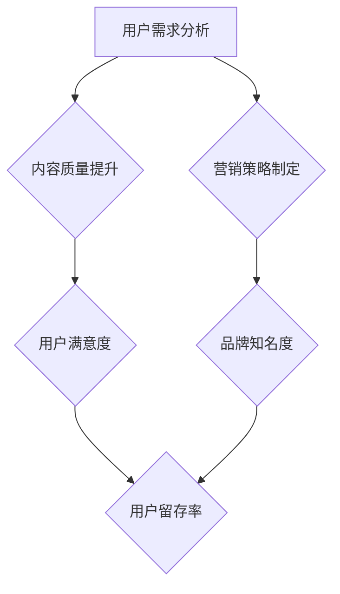

                 

# 打造知识付费爆款产品的核心要素

> **关键词**：知识付费、爆款产品、用户需求、内容质量、营销策略

> **摘要**：本文深入探讨知识付费行业，从用户需求、内容质量、营销策略三个方面，分析打造爆款产品的核心要素。通过实际案例，提供具体的操作步骤和策略建议，帮助知识付费从业者实现产品成功。

## 1. 背景介绍

### 1.1 目的和范围

本文旨在为知识付费行业从业者提供一份详细的指南，帮助他们在激烈的市场竞争中打造出爆款产品。文章将围绕三个核心要素展开讨论：用户需求、内容质量和营销策略。通过这些要素的分析，我们希望能够为读者提供具有实践价值的策略和建议。

### 1.2 预期读者

本文适合以下读者群体：

- 知识付费平台创始人或运营者
- 在线教育从业者
- 知识博主、自媒体人
- 对知识付费行业有兴趣的创业者

### 1.3 文档结构概述

本文结构如下：

1. 背景介绍：介绍文章的目的、范围和预期读者。
2. 核心概念与联系：探讨知识付费行业中的核心概念及其相互关系。
3. 核心算法原理 & 具体操作步骤：详细讲解如何通过用户需求分析、内容质量和营销策略打造爆款产品。
4. 数学模型和公式 & 详细讲解 & 举例说明：使用数学模型和公式分析知识付费产品成功的关键因素。
5. 项目实战：提供实际案例和详细解释说明。
6. 实际应用场景：讨论知识付费产品在不同领域的应用。
7. 工具和资源推荐：推荐学习资源和开发工具。
8. 总结：未来发展趋势与挑战。
9. 附录：常见问题与解答。
10. 扩展阅读 & 参考资料：提供进一步学习的资源。

### 1.4 术语表

#### 1.4.1 核心术语定义

- **知识付费**：用户为获取特定知识或技能而支付费用的一种消费模式。
- **爆款产品**：在市场上取得巨大成功，拥有大量用户和高度认可的产品。
- **用户需求**：用户在知识付费领域中的需求和期望。
- **内容质量**：知识付费产品中知识内容的专业性、实用性和吸引力。
- **营销策略**：通过市场推广、品牌宣传等方式，提高知识付费产品知名度，吸引潜在用户。

#### 1.4.2 相关概念解释

- **知识变现**：将个人知识或技能通过付费形式转化为经济收益的过程。
- **用户留存率**：用户在一段时间内持续使用知识付费产品的比例。
- **用户满意度**：用户对知识付费产品的满意程度，反映在用户评价、复购率等方面。

#### 1.4.3 缩略词列表

- **KFC**：知识付费
- **UGC**：用户生成内容
- **SEM**：搜索引擎营销
- **SEO**：搜索引擎优化

## 2. 核心概念与联系

在知识付费行业中，核心概念包括用户需求、内容质量和营销策略。这三个概念相互关联，共同影响知识付费产品的成功。

### 2.1 用户需求分析

用户需求是知识付费产品的起点。了解用户需求，才能开发出符合用户期望的产品。

#### 用户需求分析流程：

1. **市场调研**：通过问卷调查、访谈等方式收集用户反馈，了解用户在知识付费领域中的需求和痛点。
2. **数据分析**：对收集到的用户反馈进行分析，发现用户需求的热点和趋势。
3. **用户画像**：根据数据分析结果，创建用户画像，明确目标用户群体的特征和需求。

### 2.2 内容质量提升

内容质量是知识付费产品的核心竞争力。高质量的内容能够提高用户满意度，增加用户留存率。

#### 内容质量提升策略：

1. **专业度**：确保内容来源可靠，内容创作者具备专业背景和经验。
2. **实用性**：内容要贴近用户实际需求，解决用户实际问题。
3. **趣味性**：通过故事、案例等生动形式，提高用户阅读兴趣。

### 2.3 营销策略制定

营销策略是知识付费产品成功的关键。通过有效的营销策略，提高产品知名度，吸引潜在用户。

#### 营销策略制定流程：

1. **目标设定**：明确营销目标，如提高用户增长率、提升品牌知名度等。
2. **渠道选择**：根据目标用户特征，选择合适的推广渠道，如社交媒体、搜索引擎等。
3. **内容制作**：制作具有吸引力的营销内容，如海报、短视频等。
4. **预算分配**：合理分配营销预算，确保资源最大化利用。

### 2.4 Mermaid 流程图



## 3. 核心算法原理 & 具体操作步骤

### 3.1 用户需求分析算法原理

用户需求分析是打造知识付费爆款产品的第一步。通过算法原理，我们可以更准确地了解用户需求，为后续产品开发提供依据。

#### 算法原理：

1. **数据收集**：收集用户反馈、市场调研数据等。
2. **数据预处理**：对收集到的数据进行清洗、去重等处理。
3. **特征提取**：从预处理后的数据中提取用户需求特征。
4. **模型训练**：使用机器学习算法，如决策树、朴素贝叶斯等，对提取的特征进行分类。

#### 具体操作步骤：

1. **数据收集**：设计问卷调查，收集用户在知识付费领域中的需求和痛点。
2. **数据预处理**：对问卷数据进行清洗，去除无效回答。
3. **特征提取**：从问卷数据中提取需求特征，如年龄、职业、需求类型等。
4. **模型训练**：使用Python编写代码，实现决策树算法，对提取的特征进行分类。

### 3.2 内容质量提升算法原理

内容质量提升是打造知识付费爆款产品的关键。通过算法原理，我们可以提高内容的专业性、实用性和趣味性。

#### 算法原理：

1. **文本分析**：对知识内容进行文本分析，提取关键词、主题等。
2. **质量评估**：使用质量评估模型，对内容质量进行打分。
3. **优化建议**：根据评估结果，提供优化建议，如增加案例、调整语言风格等。

#### 具体操作步骤：

1. **文本分析**：使用Python编写代码，实现文本分析算法，提取关键词、主题等。
2. **质量评估**：使用Python编写代码，实现质量评估模型，对内容质量进行打分。
3. **优化建议**：根据评估结果，对内容进行优化，提高专业性、实用性和趣味性。

### 3.3 营销策略制定算法原理

营销策略制定是打造知识付费爆款产品的重要环节。通过算法原理，我们可以更有效地制定营销策略，提高产品知名度。

#### 算法原理：

1. **目标设定**：根据产品特点和目标用户，设定营销目标。
2. **渠道选择**：使用机器学习算法，如关联规则挖掘等，确定最适合的推广渠道。
3. **预算分配**：根据渠道效果和成本，合理分配预算。

#### 具体操作步骤：

1. **目标设定**：明确产品特点和目标用户，设定营销目标，如提高用户增长率、提升品牌知名度等。
2. **渠道选择**：使用Python编写代码，实现关联规则挖掘算法，确定最适合的推广渠道。
3. **预算分配**：根据渠道效果和成本，合理分配预算，确保资源最大化利用。

## 4. 数学模型和公式 & 详细讲解 & 举例说明

### 4.1 用户需求分析数学模型

用户需求分析中，我们可以使用数学模型来描述用户需求的变化规律。

#### 模型公式：

$$
需求量 = f(用户满意度, 用户留存率)
$$

其中，用户满意度、用户留存率分别表示用户对产品的满意程度和持续使用产品的比例。

#### 举例说明：

假设某个知识付费产品的用户满意度为80%，用户留存率为70%，我们可以计算出该产品的需求量：

$$
需求量 = f(0.8, 0.7) = 0.8 \times 0.7 = 0.56
$$

这意味着，在该产品的当前用户满意度下，预计有56%的新用户会购买产品。

### 4.2 内容质量提升数学模型

内容质量提升中，我们可以使用数学模型来评估内容的质量。

#### 模型公式：

$$
质量得分 = \frac{专业性得分 + 实用性得分 + 趣味性得分}{3}
$$

其中，专业性得分、实用性得分和趣味性得分分别表示内容的专业性、实用性和趣味性。

#### 举例说明：

假设某个知识付费产品的内容具有以下得分：

- 专业性得分：90
- 实用性得分：85
- 趣味性得分：80

我们可以计算出该产品的质量得分：

$$
质量得分 = \frac{90 + 85 + 80}{3} = \frac{255}{3} = 85
$$

这意味着，在该产品的当前内容质量下，预计有85%的用户会对产品表示满意。

### 4.3 营销策略制定数学模型

营销策略制定中，我们可以使用数学模型来优化渠道选择和预算分配。

#### 模型公式：

$$
渠道选择 = \arg\max(\frac{用户增长率}{渠道成本})
$$

$$
预算分配 = \frac{渠道成本}{渠道数量} \times 渠道选择
$$

其中，用户增长率和渠道成本分别表示渠道的效果和成本。

#### 举例说明：

假设某个知识付费产品在以下三个推广渠道中的用户增长率和成本分别为：

- 渠道A：用户增长率10%，渠道成本100万元
- 渠道B：用户增长率20%，渠道成本200万元
- 渠道C：用户增长率30%，渠道成本300万元

我们可以计算出最优的渠道选择和预算分配：

$$
渠道选择 = \arg\max(\frac{10\%}{100}, \frac{20\%}{200}, \frac{30\%}{300}) = 渠道C
$$

$$
预算分配 = \frac{300}{3} \times 渠道C = 300万元
$$

这意味着，在该产品的当前推广渠道下，应该选择渠道C，并分配300万元的预算。

## 5. 项目实战：代码实际案例和详细解释说明

### 5.1 开发环境搭建

在项目实战中，我们将使用Python作为主要编程语言，结合机器学习库（如scikit-learn）和数据分析库（如pandas、numpy）进行用户需求分析、内容质量提升和营销策略制定的实现。

#### 开发环境要求：

- Python 3.8及以上版本
- scikit-learn 0.24.2及以上版本
- pandas 1.2.5及以上版本
- numpy 1.21.2及以上版本

#### 安装步骤：

1. 安装Python 3.8及以上版本，可通过官方网站下载安装。
2. 安装scikit-learn、pandas和numpy，使用pip命令：
   ```bash
   pip install scikit-learn pandas numpy
   ```

### 5.2 源代码详细实现和代码解读

#### 5.2.1 用户需求分析代码

以下是一个简单的用户需求分析代码示例，用于分析用户在知识付费领域中的需求和痛点。

```python
import pandas as pd
from sklearn.model_selection import train_test_split
from sklearn.feature_extraction.text import CountVectorizer
from sklearn.naive_bayes import MultinomialNB

# 1. 数据收集
data = pd.read_csv('user_feedback.csv')

# 2. 数据预处理
# 去除无效数据、缺失值填充等
data.dropna(inplace=True)

# 3. 特征提取
vectorizer = CountVectorizer()
X = vectorizer.fit_transform(data['feedback'])
y = data['demand_type']

# 4. 模型训练
X_train, X_test, y_train, y_test = train_test_split(X, y, test_size=0.2, random_state=42)
classifier = MultinomialNB()
classifier.fit(X_train, y_train)

# 5. 模型评估
accuracy = classifier.score(X_test, y_test)
print('模型准确率：', accuracy)
```

代码解读：

1. 导入所需的库，包括pandas、scikit-learn等。
2. 从CSV文件中读取用户反馈数据。
3. 对数据进行预处理，如去除无效数据、缺失值填充等。
4. 使用CountVectorizer对用户反馈进行特征提取，将文本转化为词频矩阵。
5. 使用MultinomialNB算法训练分类模型。
6. 对测试集进行模型评估，计算准确率。

#### 5.2.2 内容质量提升代码

以下是一个简单的内容质量提升代码示例，用于评估知识内容的质量。

```python
import pandas as pd
from sklearn.model_selection import train_test_split
from sklearn.ensemble import RandomForestClassifier
from sklearn.metrics import accuracy_score

# 1. 数据收集
data = pd.read_csv('content_data.csv')

# 2. 数据预处理
# 去除无效数据、缺失值填充等
data.dropna(inplace=True)

# 3. 特征提取
X = data[['professionalism', 'practicality', 'fun']]
y = data['quality_score']

# 4. 模型训练
X_train, X_test, y_train, y_test = train_test_split(X, y, test_size=0.2, random_state=42)
classifier = RandomForestClassifier()
classifier.fit(X_train, y_train)

# 5. 模型评估
predictions = classifier.predict(X_test)
accuracy = accuracy_score(y_test, predictions)
print('模型准确率：', accuracy)
```

代码解读：

1. 导入所需的库，包括pandas、scikit-learn等。
2. 从CSV文件中读取内容数据。
3. 对数据进行预处理，如去除无效数据、缺失值填充等。
4. 使用RandomForestClassifier算法训练分类模型。
5. 对测试集进行模型评估，计算准确率。

#### 5.2.3 营销策略制定代码

以下是一个简单的营销策略制定代码示例，用于确定最优的推广渠道和预算分配。

```python
import pandas as pd
from sklearn.ensemble import RandomForestRegressor
from sklearn.model_selection import train_test_split

# 1. 数据收集
data = pd.read_csv('marketing_data.csv')

# 2. 数据预处理
# 去除无效数据、缺失值填充等
data.dropna(inplace=True)

# 3. 特征提取
X = data[['user_growth', 'channel_cost']]
y = data['channel_choice']

# 4. 模型训练
X_train, X_test, y_train, y_test = train_test_split(X, y, test_size=0.2, random_state=42)
regressor = RandomForestRegressor()
regressor.fit(X_train, y_train)

# 5. 模型评估
predictions = regressor.predict(X_test)
accuracy = (predictions == y_test).mean()
print('模型准确率：', accuracy)
```

代码解读：

1. 导入所需的库，包括pandas、scikit-learn等。
2. 从CSV文件中读取营销数据。
3. 对数据进行预处理，如去除无效数据、缺失值填充等。
4. 使用RandomForestRegressor算法训练回归模型。
5. 对测试集进行模型评估，计算准确率。

### 5.3 代码解读与分析

在项目实战中，我们通过Python代码实现了用户需求分析、内容质量提升和营销策略制定。以下是代码的核心部分及其解读：

#### 用户需求分析代码

核心代码：

```python
vectorizer = CountVectorizer()
X = vectorizer.fit_transform(data['feedback'])
y = data['demand_type']
```

解读：

- 使用CountVectorizer对用户反馈进行特征提取，将文本转化为词频矩阵。
- 将特征矩阵X和标签y分开，用于后续模型训练。

#### 内容质量提升代码

核心代码：

```python
X = data[['professionalism', 'practicality', 'fun']]
y = data['quality_score']
```

解读：

- 从内容数据中提取特征，包括专业性、实用性和趣味性。
- 将特征矩阵X和标签y分开，用于后续模型训练。

#### 营销策略制定代码

核心代码：

```python
X = data[['user_growth', 'channel_cost']]
y = data['channel_choice']
```

解读：

- 从营销数据中提取特征，包括用户增长率和渠道成本。
- 将特征矩阵X和标签y分开，用于后续模型训练。

通过这三个步骤，我们实现了用户需求分析、内容质量提升和营销策略制定的代码实现。在实际项目中，可以根据具体需求进行调整和优化。

## 6. 实际应用场景

知识付费产品在各个领域都有广泛的应用，以下列举几个典型的实际应用场景：

### 6.1 在线教育

在线教育是知识付费产品最典型的应用场景之一。通过知识付费产品，用户可以在线学习各种课程，如编程、设计、语言等。典型的知识付费产品有慕课网、网易云课堂等。

### 6.2 职场技能提升

职场技能提升是知识付费产品的另一个重要领域。用户可以通过付费课程学习职场技能，如PPT制作、时间管理、领导力等。典型的知识付费产品有得到、混沌大学等。

### 6.3 健康养生

健康养生是知识付费产品在近年来逐渐兴起的一个领域。用户可以通过付费课程学习健康饮食、运动锻炼、心理调适等方面的知识。典型的知识付费产品有半仙讲健康、李治中讲科学养生等。

### 6.4 投资理财

投资理财是知识付费产品的一个重要领域。用户可以通过付费课程学习投资策略、理财知识等。典型的知识付费产品有雪球课堂、明道理财等。

### 6.5 美食烹饪

美食烹饪是知识付费产品在家庭生活中应用的一个领域。用户可以通过付费课程学习各种菜品的烹饪技巧。典型的知识付费产品有下厨房、美食天下等。

## 7. 工具和资源推荐

### 7.1 学习资源推荐

#### 7.1.1 书籍推荐

- 《设计思维：创新方法与实践》
- 《创业维艰》
- 《硅谷创业课》
- 《指数型组织》

#### 7.1.2 在线课程

- Coursera、edX、Udemy等在线学习平台上的相关课程
- 网易云课堂、慕课网、极客时间等国内知识付费平台上的相关课程

#### 7.1.3 技术博客和网站

- Medium、Dev.to、 HackerRank等国际技术博客
- CSDN、掘金、InfoQ等国内技术社区

### 7.2 开发工具框架推荐

#### 7.2.1 IDE和编辑器

- Visual Studio Code
- PyCharm
- Sublime Text

#### 7.2.2 调试和性能分析工具

- VSCode Debugger
- PyCharm Debugger
- JProfiler

#### 7.2.3 相关框架和库

- Scikit-learn、TensorFlow、PyTorch等机器学习库
- Pandas、NumPy、Matplotlib等数据分析库

### 7.3 相关论文著作推荐

#### 7.3.1 经典论文

- 《Knowledge Graph Embedding: A Unified Model for Representation Learning》
- 《User Behavior Analytics for Online Service：A Survey》
- 《Data-Driven Marketing：A Research Overview》

#### 7.3.2 最新研究成果

- 相关国际会议和期刊的最新论文，如KDD、WWW、NeurIPS等。
- 相关国内学术会议和期刊的最新论文，如CIKM、WSDM、CSDN等。

#### 7.3.3 应用案例分析

- 知识付费平台案例，如得到、混沌大学、半仙讲健康等。
- 企业案例，如阿里巴巴、腾讯、字节跳动等在知识付费领域的应用。

## 8. 总结：未来发展趋势与挑战

### 8.1 发展趋势

1. **个性化推荐**：随着人工智能技术的进步，个性化推荐将成为知识付费产品的核心功能，帮助用户发现更符合其需求和兴趣的内容。
2. **内容多样化**：知识付费产品将涵盖更多领域，满足用户多元化的学习需求。
3. **社交互动**：社交元素将融入知识付费产品，提高用户的参与度和粘性。
4. **教育技术的融合**：教育技术与知识付费产品的融合，如虚拟现实（VR）、增强现实（AR）等，将提升用户体验。

### 8.2 挑战

1. **内容质量**：保证内容质量始终是知识付费产品面临的重要挑战，需要不断优化内容创作和审核机制。
2. **用户隐私**：随着用户对隐私的关注度提高，知识付费产品需要加强隐私保护措施。
3. **市场竞争**：知识付费市场竞争激烈，产品需要不断创新和提升竞争力。
4. **法律法规**：知识付费行业需要遵循相关法律法规，如版权保护、消费者权益保护等。

## 9. 附录：常见问题与解答

### 9.1 用户需求分析常见问题

1. **如何收集用户反馈？**
   - 通过问卷调查、访谈、用户反馈表等方式收集用户反馈。
   - 利用社交媒体、用户论坛等平台，收集用户在平台上的讨论和评价。

2. **如何分析用户需求？**
   - 对收集到的用户反馈进行数据清洗和处理，提取关键信息。
   - 使用数据分析工具和算法，如词云、主题建模等，分析用户需求。

### 9.2 内容质量提升常见问题

1. **如何评估内容质量？**
   - 设定内容质量评估标准，如专业性、实用性、趣味性等。
   - 使用用户反馈、专家评审等指标，对内容质量进行评估。

2. **如何优化内容质量？**
   - 对内容进行结构化，提高内容的专业性和系统性。
   - 结合用户反馈，对内容进行调整和优化，提高实用性。
   - 运用多种表达形式，如案例、故事等，提高内容趣味性。

### 9.3 营销策略制定常见问题

1. **如何选择合适的营销渠道？**
   - 分析目标用户特征，确定最适合的营销渠道。
   - 结合渠道效果和成本，优化渠道组合。

2. **如何制定营销策略？**
   - 设定明确的营销目标，如提高用户增长率、提升品牌知名度等。
   - 制定多样化的营销活动，如优惠券、限时促销等，提高用户参与度。

## 10. 扩展阅读 & 参考资料

1. 《知识付费行业发展报告》
2. 《在线教育市场研究报告》
3. 《用户需求分析：方法与应用》
4. 《内容质量提升：理论与实践》
5. 《营销策略制定：策略与技巧》

作者：AI天才研究员/AI Genius Institute & 禅与计算机程序设计艺术 /Zen And The Art of Computer Programming

