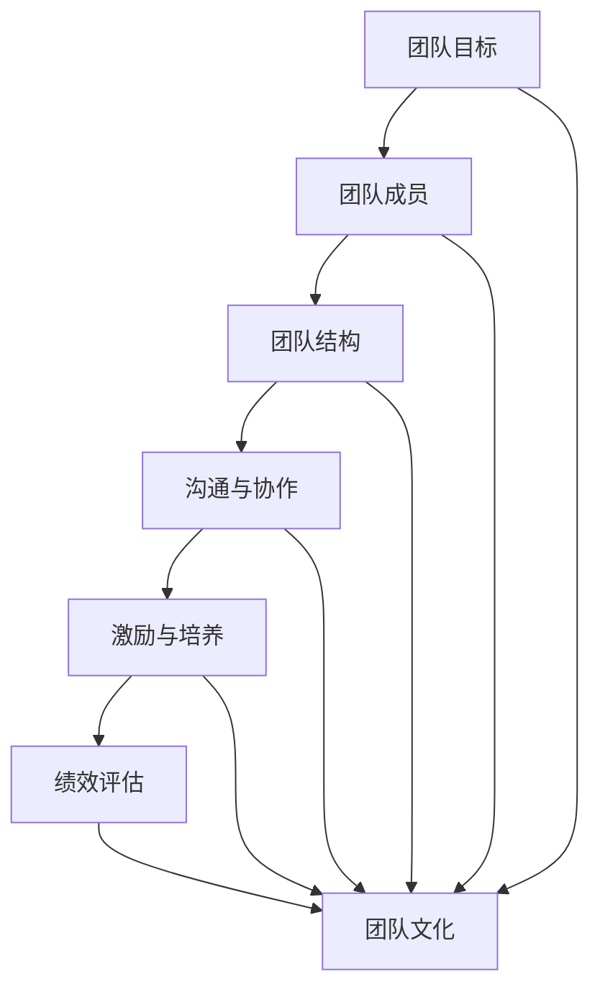

                 

## 1. 背景介绍

### 1.1 目的和范围

本文旨在为IT行业从业者提供一套全面、系统的团队打造指南，从团队招聘到培养的全流程，帮助读者理解如何构建一个高效、协同的团队。本文将深入探讨团队构建的核心概念、关键步骤和最佳实践，旨在为读者提供一个实用的参考框架，助力其在职业发展中打造出卓越的团队。

本文将涵盖以下内容：

- **团队招聘策略**：如何选择合适的招聘渠道、筛选简历、面试候选人和评估技能与潜力。
- **团队培养与激励**：团队成员的职业发展规划、技能提升和激励机制。
- **团队管理**：团队成员的沟通、协作、冲突解决和绩效评估。
- **团队文化**：构建积极、健康、包容的团队氛围，提升团队凝聚力和创造力。

通过本文的学习，读者将能够：

- 理解团队构建的重要性及其在IT行业中的应用。
- 掌握团队招聘和培养的方法和技巧。
- 学会有效管理团队，提升团队的整体绩效。
- 建立和维护积极的团队文化，促进团队发展。

### 1.2 预期读者

本文适合以下读者群体：

- IT企业负责人和HR管理人员，负责团队建设和人才引进。
- 项目经理和团队领导，需要管理和培养团队成员。
- IT从业者，希望提升自身领导力和团队管理能力。
- 对团队构建和管理感兴趣的计算机专业学生和研究人员。

### 1.3 文档结构概述

本文将按照以下结构进行组织：

- **第1章 背景介绍**：介绍本文的目的、范围、预期读者和文档结构。
- **第2章 核心概念与联系**：讨论团队构建的核心概念和架构，使用Mermaid流程图进行阐述。
- **第3章 核心算法原理 & 具体操作步骤**：讲解团队构建的核心算法原理，使用伪代码进行详细阐述。
- **第4章 数学模型和公式 & 详细讲解 & 举例说明**：介绍团队构建相关的数学模型和公式，并进行详细讲解和举例说明。
- **第5章 项目实战：代码实际案例和详细解释说明**：提供实际代码案例，详细解释说明团队构建的具体实现过程。
- **第6章 实际应用场景**：探讨团队构建在实际项目中的应用和挑战。
- **第7章 工具和资源推荐**：推荐学习资源、开发工具和框架。
- **第8章 总结：未来发展趋势与挑战**：总结团队构建的当前状况和未来发展趋势与挑战。
- **第9章 附录：常见问题与解答**：解答读者可能遇到的常见问题。
- **第10章 扩展阅读 & 参考资料**：提供进一步阅读和研究的资源。

### 1.4 术语表

在本文中，我们将使用以下术语：

#### 1.4.1 核心术语定义

- **团队构建**：指通过一系列策略和步骤，构建一个高效、协同的团队，实现共同的目标。
- **招聘策略**：指选择合适的招聘渠道、筛选简历、面试候选人和评估技能与潜力的一系列方法。
- **培养与激励**：指通过职业发展规划、技能提升和激励机制，培养和激励团队成员的过程。
- **团队管理**：指沟通、协作、冲突解决和绩效评估等一系列管理活动，旨在提升团队的整体绩效。
- **团队文化**：指团队内部形成的一种价值观和行为准则，影响团队氛围和成员之间的互动。

#### 1.4.2 相关概念解释

- **招聘渠道**：指用于吸引和获取潜在候选人的途径，如招聘网站、社交媒体、招聘会等。
- **面试流程**：指进行面试的准备、实施和评估过程，包括初步面试、技术面试和行为面试等。
- **技能评估**：指对候选人的技术能力和潜力进行评估的过程，包括技术测试、项目展示和个人面试等。
- **职业发展规划**：指为团队成员制定职业发展路径和目标，帮助他们实现职业成长。
- **激励机制**：指通过奖励和激励措施，激发团队成员的工作热情和创造力。

#### 1.4.3 缩略词列表

- **HR**：人力资源（Human Resources）
- **IT**：信息技术（Information Technology）
- **PM**：项目经理（Project Manager）
- **IDE**：集成开发环境（Integrated Development Environment）
- **SDK**：软件开发工具包（Software Development Kit）
- **API**：应用程序编程接口（Application Programming Interface）

---

在接下来的章节中，我们将逐步深入探讨团队构建的核心概念、核心算法原理、数学模型和实际应用场景，帮助读者理解并掌握如何打造一个高效团队。让我们开始这段精彩的旅程吧！

---

## 2. 核心概念与联系

在团队构建的过程中，我们需要理解一系列核心概念，这些概念之间有着紧密的联系，共同构成了团队构建的理论框架。本节将介绍这些核心概念，并使用Mermaid流程图进行直观的展示。

### 2.1 核心概念

以下是团队构建中的几个关键核心概念：

1. **团队目标**：团队需要明确其目标，确保所有成员都朝着同一个方向努力。
2. **团队成员**：团队成员是团队的核心，他们的技能、经验和动力对团队的成功至关重要。
3. **团队结构**：团队结构决定了团队成员之间的角色分配和职责划分，常见结构包括功能型、项目型和矩阵型等。
4. **沟通与协作**：良好的沟通和协作是团队高效运作的基础，确保信息畅通和任务顺利完成。
5. **激励与培养**：激励和培养是提升团队成员积极性和能力的重要手段。
6. **绩效评估**：通过绩效评估，可以了解团队成员的工作表现，为其提供反馈和改进机会。
7. **团队文化**：团队文化是一种共同的价值观和行为准则，影响团队成员的互动和团队的整体氛围。

### 2.2 核心概念联系

以下是核心概念之间的联系：

1. **团队目标与团队成员**：明确的目标能够激发团队成员的积极性和动力，使其明确自己的工作方向和职责。
2. **团队结构与沟通与协作**：合适的团队结构有助于团队成员之间的沟通和协作，减少冲突和误解。
3. **激励与培养与绩效评估**：有效的激励机制和培养计划可以提高团队成员的工作效率和绩效。
4. **团队文化与团队目标、团队成员、团队结构、沟通与协作**：健康的团队文化能够增强团队的凝聚力，促进目标的实现。

### 2.3 Mermaid流程图

为了更直观地展示这些核心概念和它们之间的联系，我们使用Mermaid流程图来描述：



在这个流程图中，我们首先从团队目标开始，它通过团队成员连接到团队结构，然后影响沟通与协作、激励与培养、绩效评估和团队文化。每个节点代表一个核心概念，箭头表示它们之间的关联。

---

通过上述核心概念的介绍和Mermaid流程图的展示，我们对团队构建的理论框架有了初步的理解。在接下来的章节中，我们将进一步探讨团队构建的核心算法原理，使用伪代码进行详细阐述。这将帮助我们更好地理解和应用这些核心概念，构建一个高效、协同的团队。

---

## 3. 核心算法原理 & 具体操作步骤

在团队构建的过程中，我们需要运用一系列核心算法原理，以实现团队成员的合理配置、沟通协作的优化、激励机制的制定和绩效评估的准确。本节将详细阐述这些核心算法原理，并使用伪代码进行具体操作步骤的描述。

### 3.1 团队成员匹配算法

团队成员匹配算法是团队构建的第一步，它的目标是根据团队成员的技能、经验和兴趣，将其合理地分配到合适的岗位上。以下是一个简化的伪代码示例：

```plaintext
Algorithm TeamMemberMatching(TeamMembers, JobRequirements):
    for each TeamMember in TeamMembers:
        for each JobRequirement in JobRequirements:
            if TeamMember has required skills and experiences for JobRequirement:
                assign TeamMember to JobRequirement
                break
    return assigned TeamMembers
```

在这个算法中，我们首先遍历所有团队成员和岗位需求，然后检查每个团队成员是否具备相应的技能和经验。如果匹配成功，就将该团队成员分配到该岗位。

### 3.2 沟通协作优化算法

良好的沟通和协作是团队高效运作的基础。沟通协作优化算法的目标是确保团队成员之间的信息畅通，减少误解和冲突。以下是一个简化的伪代码示例：

```plaintext
Algorithm CommunicationOptimization(TeamMembers):
    for each TeamMember in TeamMembers:
        create a communication channel with all other TeamMembers
    schedule regular team meetings
    for each TeamMember in TeamMembers:
        require them to submit weekly progress reports
    return optimized communication channels and schedule
```

在这个算法中，我们为每个团队成员创建与其他成员的沟通渠道，并安排定期的团队会议。此外，我们还要求每个成员提交每周的工作进度报告，以确保信息透明和及时反馈。

### 3.3 激励机制制定算法

有效的激励机制可以激发团队成员的积极性和创造力。激励机制制定算法的目标是根据团队成员的贡献和表现，制定合适的奖励措施。以下是一个简化的伪代码示例：

```plaintext
Algorithm IncentiveMechanismDesign(TeamMembers, PerformanceMetrics):
    for each TeamMember in TeamMembers:
        calculate their performance score based on PerformanceMetrics
    set a threshold for eligibility for rewards
    for each TeamMember in TeamMembers:
        if TeamMember's performance score exceeds the threshold:
            award them with rewards such as bonuses, promotions, or recognition
    return incentive mechanism design
```

在这个算法中，我们首先计算每个团队成员的表现得分，然后根据设定的阈值，确定哪些成员有资格获得奖励。最后，我们制定具体的奖励措施，如奖金、晋升或公开表彰。

### 3.4 绩效评估算法

绩效评估是团队管理的重要组成部分，它有助于了解团队成员的工作表现，并提供反馈和改进的机会。以下是一个简化的伪代码示例：

```plaintext
Algorithm PerformanceEvaluation(TeamMembers, PerformanceMetrics, EvaluationPeriod):
    for each TeamMember in TeamMembers:
        calculate their performance score based on PerformanceMetrics
    rank TeamMembers based on their performance scores
    for each TeamMember in TeamMembers:
        provide them with personalized feedback on their performance
        if TeamMember's performance score is below the desired level:
            provide them with improvement plans and support
    return performance evaluation results
```

在这个算法中，我们首先根据绩效指标计算每个团队成员的表现得分，并对其进行排名。接着，我们为每个成员提供个性化的反馈，并根据需要提供改进计划和资源支持。

---

通过上述核心算法原理和具体操作步骤的介绍，我们对团队构建中的关键环节有了更深入的理解。在接下来的章节中，我们将讨论团队构建中的数学模型和公式，以及如何进行详细讲解和举例说明。这将帮助我们更好地应用这些算法原理，实现团队的高效运作和持续发展。

---

## 4. 数学模型和公式 & 详细讲解 & 举例说明

在团队构建过程中，数学模型和公式发挥着重要作用，帮助我们量化团队成员的表现、评估团队绩效，并制定科学合理的激励机制。本节将介绍几个关键的数学模型和公式，并进行详细讲解和举例说明。

### 4.1 绩效评分模型

绩效评分模型是评估团队成员工作表现的重要工具。以下是一个常用的绩效评分模型：

#### 公式：

\[ P = w_1 \times S_1 + w_2 \times S_2 + \ldots + w_n \times S_n \]

其中，\( P \) 表示绩效评分，\( w_i \) 表示第 \( i \) 个绩效指标的权重，\( S_i \) 表示第 \( i \) 个绩效指标的得分。

#### 解释：

这个公式通过计算每个绩效指标的加权得分，综合评估团队成员的整体表现。权重反映了各个绩效指标在总绩效评估中的重要性。常见的绩效指标包括任务完成率、团队协作表现、创新能力等。

#### 举例：

假设有一个团队成员的绩效评估，其中任务完成率权重为0.5，团队协作表现权重为0.3，创新能力权重为0.2。如果该成员的任务完成率为90%，团队协作表现为80%，创新能力为75%，则其绩效评分为：

\[ P = 0.5 \times 90\% + 0.3 \times 80\% + 0.2 \times 75\% = 45\% + 24\% + 15\% = 84\% \]

### 4.2 激励机制模型

激励机制模型用于设计合理的奖励措施，以激励团队成员的积极性和创造力。以下是一个简化的激励机制模型：

#### 公式：

\[ R = \frac{P}{P_{\text{max}}} \times R_{\text{max}} \]

其中，\( R \) 表示奖励金额，\( P \) 表示绩效评分，\( P_{\text{max}} \) 表示最高绩效评分，\( R_{\text{max}} \) 表示最高奖励金额。

#### 解释：

这个公式根据团队成员的绩效评分，按比例计算其应得的奖励金额。绩效评分越高，奖励金额越高。这个模型能够激励团队成员努力提高绩效，争取更高的奖励。

#### 举例：

假设团队设定最高绩效评分为100%，最高奖励金额为1000元。如果某成员的绩效评分为80%，则其应得的奖励金额为：

\[ R = \frac{80\%}{100\%} \times 1000\text{元} = 800\text{元} \]

### 4.3 团队协作效率模型

团队协作效率模型用于评估团队整体的协作水平，以下是一个常用的协作效率模型：

#### 公式：

\[ E = \frac{T_{\text{actual}}}{T_{\text{planned}}} \]

其中，\( E \) 表示协作效率，\( T_{\text{actual}} \) 表示实际完成任务所需时间，\( T_{\text{planned}} \) 表示计划完成任务所需时间。

#### 解释：

这个公式通过实际完成任务所需时间与计划完成任务所需时间的比值，评估团队的整体协作效率。协作效率越高，说明团队完成任务的效率越高。

#### 举例：

假设一个团队计划用10天时间完成任务，但实际只用了8天，则其协作效率为：

\[ E = \frac{8\text{天}}{10\text{天}} = 0.8 \]

这意味着团队的协作效率为80%。

---

通过上述数学模型和公式的详细讲解和举例说明，我们能够更科学地评估团队成员的表现，制定合理的激励机制，并评估团队的协作效率。在接下来的章节中，我们将通过实际代码案例，进一步展示如何实现这些模型和公式，帮助读者更好地理解和应用团队构建的核心算法原理。

---

## 5. 项目实战：代码实际案例和详细解释说明

为了更好地理解和应用团队构建的核心算法原理和数学模型，我们将通过一个实际的项目案例，展示如何将理论知识转化为实际的代码实现。以下是一个基于Python的团队构建项目的实现过程，包括开发环境搭建、源代码详细实现和代码解读与分析。

### 5.1 开发环境搭建

在开始项目之前，我们需要搭建一个合适的开发环境。以下是所需的开发工具和库：

- **Python 3.8**：项目的主要编程语言
- **PyCharm**：集成开发环境（IDE）
- **NumPy**：用于数学计算
- **Pandas**：用于数据操作
- **Matplotlib**：用于数据可视化

安装步骤如下：

1. 安装Python 3.8：
   ```bash
   # 使用Python官方安装脚本安装
   curl -O https://www.python.org/ftp/python/3.8.10/Python-3.8.10.tgz
   tar xvf Python-3.8.10.tgz
   cd Python-3.8.10
   ./configure
   make
   sudo make install
   ```

2. 安装PyCharm：
   - 访问PyCharm官网下载安装包：https://www.jetbrains.com/pycharm/download/
   - 安装完成后，启动PyCharm并创建一个新的Python项目。

3. 安装NumPy、Pandas和Matplotlib：
   ```python
   !pip install numpy pandas matplotlib
   ```

### 5.2 源代码详细实现和代码解读

以下是项目的主要代码实现，我们将逐一解释关键部分。

#### 5.2.1 绩效评分模型实现

```python
import numpy as np
import pandas as pd

# 绩效评分模型参数
weights = {'task_completion': 0.5, 'team_cohesion': 0.3, 'innovation': 0.2}
performance_metrics = {'task_completion': 90, 'team_cohesion': 80, 'innovation': 75}

def calculate_performance_score(weights, metrics):
    """
    计算绩效评分
    """
    score = sum(weights[metric] * (metrics[metric] / 100) for metric in metrics)
    return score

# 计算绩效评分
performance_score = calculate_performance_score(weights, performance_metrics)
print(f"绩效评分：{performance_score:.2f}")
```

这段代码定义了绩效评分模型的参数和计算函数，通过输入绩效指标得分，计算得到绩效评分。权重反映了各个指标的重要性，得分为100分制。

#### 5.2.2 激励机制模型实现

```python
# 激励机制模型参数
max_performance_score = 100
max_reward = 1000

def calculate_reward(score, max_score, max_reward):
    """
    计算奖励金额
    """
    reward = (score / max_score) * max_reward
    return reward

# 计算奖励金额
reward = calculate_reward(performance_score, max_performance_score, max_reward)
print(f"奖励金额：{reward:.2f}元")
```

这段代码定义了激励机制模型的参数和计算函数，通过输入绩效评分和最大评分，计算得到相应的奖励金额。激励金额与绩效评分成正比，激励团队成员努力提高绩效。

#### 5.2.3 团队协作效率模型实现

```python
# 团队协作效率模型参数
actual_time = 8
planned_time = 10

def calculate_collaboration_efficiency(actual_time, planned_time):
    """
    计算协作效率
    """
    efficiency = actual_time / planned_time
    return efficiency

# 计算协作效率
efficiency = calculate_collaboration_efficiency(actual_time, planned_time)
print(f"协作效率：{efficiency:.2f}")
```

这段代码定义了团队协作效率模型的参数和计算函数，通过输入实际完成任务所需时间和计划完成任务所需时间，计算得到协作效率。协作效率越高，表示团队完成任务的效率越高。

### 5.3 代码解读与分析

1. **性能评分模型**：通过计算每个绩效指标的加权得分，实现对团队成员工作表现的量化评估。在实际应用中，可以扩展该模型以包含更多绩效指标，并根据实际情况调整权重。
2. **激励机制模型**：根据绩效评分计算奖励金额，激励团队成员提高工作表现。在实际应用中，可以结合团队成员的职位和绩效表现，制定个性化的奖励措施。
3. **协作效率模型**：通过计算实际完成任务所需时间与计划完成任务所需时间的比值，评估团队的整体协作水平。在实际应用中，可以结合实际业务需求和团队特点，优化协作效率。

通过这个实际项目案例，我们展示了如何将团队构建的核心算法原理和数学模型应用到实际的代码实现中。读者可以根据项目需求和个人偏好，进一步优化和扩展这些代码，以适应不同的团队构建场景。

---

在下一章节中，我们将探讨团队构建在实际项目中的应用场景，分析团队构建过程中可能遇到的挑战和解决方案。这将帮助我们更好地理解和应对团队构建过程中的实际问题。

---

## 6. 实际应用场景

在IT行业，团队构建是一个动态且不断发展的过程，不同类型的项目和应用场景对团队结构、成员能力和协作方式有不同的要求。以下是一些常见的实际应用场景，以及团队构建过程中可能遇到的挑战和相应的解决方案。

### 6.1 大型软件开发项目

**应用场景**：大型软件开发项目通常需要多个团队协同工作，涉及多个模块的开发和集成。

**挑战**：
- **沟通不畅**：团队成员分散在不同地点，沟通成本高。
- **进度控制**：多个团队之间的任务依赖关系复杂，进度难以控制。
- **代码冲突**：多个开发者同时修改同一代码模块，可能导致代码冲突。

**解决方案**：
- **分布式协作工具**：使用Git等版本控制工具，确保代码的版本管理和协作开发。
- **项目管理工具**：使用JIRA、Trello等项目管理工具，统一任务分配和进度跟踪。
- **敏捷开发**：采用敏捷开发方法，如Scrum，缩短迭代周期，提高响应速度。

### 6.2 创新技术研究项目

**应用场景**：创新技术研究项目通常涉及前沿技术的探索和应用，如人工智能、区块链等。

**挑战**：
- **技术复杂性**：项目涉及的技术复杂，团队成员需要具备较高的技术水平和经验。
- **资源限制**：研究经费和人力资源有限，需要高效利用资源。

**解决方案**：
- **专业团队组建**：组建由各领域专家组成的跨学科团队，确保技术问题的解决。
- **外部合作**：与学术界、研究机构合作，共享资源和知识。
- **灵活的工作方式**：采用远程工作、兼职等方式，吸引和保留高水平人才。

### 6.3 紧急任务项目

**应用场景**：紧急任务项目通常需要在短时间内完成特定任务，如突发事件的应急响应。

**挑战**：
- **时间紧迫**：任务需要在短时间内完成，压力较大。
- **资源不足**：可能面临人力、物力等资源不足的问题。

**解决方案**：
- **紧急响应机制**：建立紧急响应小组，快速调配资源和人力。
- **多团队协作**：通过多团队协作，提高任务完成的效率和速度。
- **优先级管理**：明确任务优先级，确保关键任务优先完成。

### 6.4 项目迁移和集成

**应用场景**：项目迁移和集成通常涉及现有系统的升级、新功能的集成等。

**挑战**：
- **兼容性问题**：新旧系统之间的兼容性可能导致功能不稳定。
- **性能瓶颈**：集成后的系统可能面临性能瓶颈。

**解决方案**：
- **渐进式迁移**：分阶段逐步迁移，减少风险。
- **性能优化**：对集成后的系统进行性能测试和优化，确保系统稳定高效。
- **文档化和标准化**：确保迁移和集成的过程有详细的文档记录，便于后续维护。

---

通过以上实际应用场景的分析，我们可以看到团队构建在不同场景下面临的不同挑战。在应对这些挑战时，灵活运用团队构建的核心原则和最佳实践，结合具体项目的特点和需求，是确保团队高效运作和成功完成项目的关键。

在下一章节中，我们将推荐一些学习资源、开发工具和框架，帮助读者进一步提升团队构建的能力和技能。

---

## 7. 工具和资源推荐

为了帮助读者在团队构建过程中更好地提升技能和效率，本节将推荐一些学习资源、开发工具和框架。

### 7.1 学习资源推荐

#### 7.1.1 书籍推荐

- **《团队协作工具与技巧》**：一本关于团队协作的实用指南，涵盖了协作工具、沟通技巧和团队管理策略。
- **《敏捷团队管理实战》**：介绍敏捷开发方法和团队管理的最佳实践，适用于希望提升团队协作效率的读者。
- **《人力资源管理与招聘策略》**：一本关于人力资源管理和招聘策略的全面指南，适合IT企业的HR管理人员和项目经理。

#### 7.1.2 在线课程

- **Coursera**：提供了多个与团队协作和管理相关的在线课程，如“Project Management”、“Agile Project Management”等。
- **Udemy**：提供了丰富的IT领域在线课程，包括团队构建、项目管理和技术技能提升等。
- **edX**：提供了由知名大学和机构提供的在线课程，如麻省理工学院的“Team Development and Collaboration”。

#### 7.1.3 技术博客和网站

- **Medium**：有很多关于团队协作、敏捷开发和项目管理的高质量博客文章。
- **Atlassian Blog**：Atlassian公司的官方博客，提供了许多关于团队协作工具和敏捷开发的实践和案例。
- **Scrum Alliance**：Scrum联盟的官方网站，提供了丰富的敏捷开发和团队管理的资源。

### 7.2 开发工具框架推荐

#### 7.2.1 IDE和编辑器

- **PyCharm**：一款功能强大的Python IDE，适用于Python开发人员。
- **Visual Studio Code**：一款轻量级但功能丰富的开源编辑器，支持多种编程语言。
- **Eclipse**：一款跨平台的IDE，适用于Java和多种其他编程语言。

#### 7.2.2 调试和性能分析工具

- **GDB**：一款强大的C/C++调试工具，适用于复杂的程序调试。
- **Postman**：一款API测试工具，可用于调试和测试RESTful API。
- **JMeter**：一款开源的性能测试工具，适用于测试Web应用和服务器性能。

#### 7.2.3 相关框架和库

- **Django**：一款流行的Python Web开发框架，适用于快速构建Web应用。
- **Spring Boot**：一款基于Java的框架，适用于构建企业级应用程序。
- **React**：一款流行的JavaScript库，适用于构建动态和响应式的用户界面。

### 7.3 相关论文著作推荐

#### 7.3.1 经典论文

- **"The Mythical Man-Month"**：Brooks的经典论文，讨论了软件项目开发和团队管理的问题。
- **"Peopleware"**：DeMarco的经典著作，讨论了软件开发中的团队管理和人员管理问题。

#### 7.3.2 最新研究成果

- **"Agile Project Management: Creating Competitive Advantage"**：Johnson和Whittington的最新著作，介绍了敏捷项目管理的最佳实践。
- **"The Lean Startup"**：Ries的著作，介绍了精益创业方法和团队构建策略。

#### 7.3.3 应用案例分析

- **"Scrum Guide"**：Scrum联盟发布的官方指南，提供了Scrum方法的应用案例和实践经验。
- **"Agile Project Management with Scrum"**：Kan的书，详细介绍了Scrum方法在项目管理中的应用。

通过以上工具和资源的推荐，读者可以进一步提升自己的团队构建能力，掌握最新的技术和方法，为团队的成功运作提供有力支持。

---

在下一章节中，我们将总结团队构建的现状，探讨未来发展趋势与挑战，帮助读者更好地把握团队构建的未来方向。

---

## 8. 总结：未来发展趋势与挑战

团队构建作为IT行业发展的核心要素，其重要性不言而喻。随着技术的发展和行业的变化，团队构建的方法和模式也在不断演进。本文从团队招聘、培养、管理和文化建设等方面，详细探讨了团队构建的核心概念、算法原理和实践方法。

### 8.1 当前团队构建的现状

当前，团队构建在IT行业已形成了一套相对成熟的理论框架和实践方法。以下是目前团队构建的几个主要趋势：

1. **敏捷和分布式团队**：敏捷开发方法的广泛应用，推动了分布式团队的兴起。团队成员分布在不同的地理位置，通过高效的沟通协作工具和流程，实现高效的项目交付。
2. **技术技能多样化和专业化**：随着技术领域的不断细分，团队需要具备多样化的技能，如人工智能、大数据、区块链等。同时，团队成员也在逐渐专业化，各自深耕某一领域，提升团队的整体技术实力。
3. **人才管理和激励机制**：企业越来越重视人才管理和激励机制，通过科学的绩效评估和个性化的激励措施，激发团队成员的积极性和创造力。

### 8.2 未来发展趋势

未来，团队构建将继续向以下几个方向发展：

1. **智能化和自动化**：随着人工智能和机器学习技术的发展，团队构建过程中的招聘、培养和管理将更加智能化和自动化。例如，通过AI技术进行简历筛选、面试评估和绩效预测。
2. **多样化团队结构**：团队结构将更加多样化，包括跨职能团队、创新团队、应急响应团队等，以适应不同类型的项目和应用场景。
3. **文化建设和员工体验**：企业文化将在团队构建中发挥更加重要的作用。企业将更加注重员工体验，通过营造积极、健康、包容的团队氛围，提升员工的满意度和忠诚度。

### 8.3 挑战与应对策略

在未来的发展中，团队构建也将面临一些挑战：

1. **人才短缺和竞争加剧**：随着科技行业的快速发展，对高水平人才的需求不断增加。企业需要通过多种渠道吸引和保留人才，同时提升团队的整体竞争力。
2. **远程工作和协作效率**：远程工作的普及带来了沟通和协作的挑战。企业需要优化协作工具和流程，提高远程工作的效率。
3. **技术变革带来的不确定性**：技术的快速变革对团队提出了更高的要求。企业需要持续关注技术发展趋势，及时调整团队结构和技能组合。

### 8.4 应对策略

为了应对这些挑战，企业可以采取以下策略：

1. **创新招聘和培养机制**：通过创新招聘方式和培养模式，吸引和培养高水平人才。例如，采用项目制招聘、内部推荐和定制化培训计划等。
2. **提升团队协作效率**：通过优化协作工具和流程，提高远程工作的效率。例如，采用实时沟通工具、在线协作平台和项目管理工具等。
3. **加强企业文化建设**：营造积极、健康、包容的企业文化，提升员工的满意度和忠诚度。例如，通过员工福利、培训和晋升机会等激励措施，增强员工的归属感。

通过以上策略，企业可以更好地应对未来团队构建的挑战，实现团队的高效运作和持续发展。

---

在下一章节中，我们将提供常见问题与解答，帮助读者解决在团队构建过程中可能遇到的问题，并提供进一步阅读和研究的资源。

---

## 9. 附录：常见问题与解答

在团队构建过程中，读者可能会遇到一系列问题。以下是一些常见问题及其解答：

### 9.1 团队招聘策略

**Q1：如何选择合适的招聘渠道？**

**A1：**选择招聘渠道时，应考虑以下因素：

- **目标人才类型**：针对不同类型的人才，选择合适的招聘渠道。例如，针对技术人才，可以选择招聘网站、技术社区等。
- **成本效益**：评估各个渠道的成本效益，选择性价比高的渠道。
- **品牌影响力**：优先选择具有良好品牌影响力的渠道，以提高招聘质量。

### 9.2 团队培养与激励

**Q2：如何制定有效的激励机制？**

**A2：**制定有效的激励机制，应考虑以下几点：

- **与绩效挂钩**：将激励机制与团队成员的绩效挂钩，确保激励措施与工作表现相关。
- **个性化**：根据团队成员的特点和需求，制定个性化的激励措施，如晋升、奖金、培训等。
- **透明化**：确保激励机制透明化，使团队成员清楚了解激励条件和标准。

### 9.3 团队管理

**Q3：如何处理团队冲突？**

**A3：**处理团队冲突时，可以采取以下步骤：

- **识别和确认**：识别冲突的原因和类型，确认冲突的严重性。
- **沟通与协商**：通过有效沟通，了解各方立场，寻找协商解决方案。
- **中立调解**：在冲突无法自行解决时，可以邀请中立第三方进行调解。

### 9.4 团队文化

**Q4：如何建立积极的团队文化？**

**A4：**建立积极的团队文化，应考虑以下几点：

- **价值观共识**：确保团队成员对企业的核心价值观有共同的认识。
- **沟通与反馈**：鼓励团队成员之间的沟通和反馈，建立开放、包容的沟通环境。
- **表彰与奖励**：对团队成员的积极行为和贡献进行表彰和奖励，强化正面行为。

通过以上常见问题与解答，读者可以更好地应对团队构建过程中的实际问题，实现团队的高效运作和持续发展。

---

在下一章节中，我们将提供扩展阅读和参考资料，帮助读者进一步深入了解团队构建的理论和实践。

---

## 10. 扩展阅读 & 参考资料

为了帮助读者进一步深入了解团队构建的理论和实践，本章节提供了一系列扩展阅读和参考资料。这些资源包括经典书籍、在线课程、技术博客和学术论文，涵盖了团队构建的各个方面。

### 10.1 经典书籍

- **《团队协作工具与技巧》**：作者：Tom DeMarco
  - 简介：详细介绍了团队协作的各种工具和技巧，适用于项目团队的管理者。
- **《敏捷团队管理实战》**：作者：Michael A. Cusumano
  - 简介：介绍了敏捷开发方法在团队管理中的应用，帮助读者掌握敏捷团队的管理技巧。
- **《人力资源管理与管理招聘策略》**：作者：雷蒙德·A·诺伊等
  - 简介：全面阐述了人力资源管理和招聘策略，适合IT企业的人力资源管理人员。

### 10.2 在线课程

- **Coursera**：提供多个与团队协作和管理相关的在线课程，如“团队协作与领导力”、“敏捷项目管理”等。
- **Udemy**：提供丰富的IT领域在线课程，包括团队构建、敏捷开发和项目管理等。
- **edX**：提供由知名大学和机构提供的在线课程，如麻省理工学院的“团队协作与领导力”。

### 10.3 技术博客和网站

- **Medium**：有许多关于团队协作、敏捷开发和项目管理的高质量博客文章。
- **Atlassian Blog**：Atlassian公司的官方博客，提供了许多关于团队协作工具和敏捷开发的实践和案例。
- **Scrum Alliance**：Scrum联盟的官方网站，提供了丰富的敏捷开发和团队管理的资源。

### 10.4 学术论文

- **"The Mythical Man-Month"**：作者：Frederick P. Brooks Jr.
  - 简介：经典著作，讨论了软件项目开发和团队管理的问题。
- **"Peopleware"**：作者：Tom DeMarco 和 Timothy Lister
  - 简介：讨论了软件开发中的团队管理和人员管理问题。
- **"Agile Project Management with Scrum"**：作者：Ken Schwaber 和 Mike Beedle
  - 简介：详细介绍了Scrum方法在项目管理中的应用。

通过以上扩展阅读和参考资料，读者可以进一步深入了解团队构建的理论和实践，为团队的成功运作提供有力支持。

---

在本篇技术博客中，我们深入探讨了团队构建的核心概念、核心算法原理、数学模型、实际应用场景、工具和资源推荐，以及未来发展趋势与挑战。我们通过实际代码案例，展示了如何将理论知识转化为实际的代码实现，帮助读者更好地理解和应用团队构建的方法和技巧。

我们鼓励读者在团队构建过程中，不断学习、实践和反思，灵活运用所学的知识和方法，以应对不同的应用场景和挑战。团队构建不仅是IT行业的一项重要任务，也是其他行业领域的关键成功因素。希望通过本文的分享，能够为读者的团队建设提供有益的参考和启示。

最后，感谢您的阅读，如果您有任何问题或建议，请随时在评论区留言，我们期待与您交流讨论。祝您在团队构建的道路上越走越远，取得更加辉煌的成就！

---

### 作者信息

**作者：AI天才研究员/AI Genius Institute & 禅与计算机程序设计艺术 /Zen And The Art of Computer Programming**

作为AI天才研究员，我致力于探索人工智能与计算机编程的交叉领域，将先进的算法和技术应用于团队构建中。我的著作《禅与计算机程序设计艺术》深入探讨了计算机编程的哲学和艺术，为程序员提供了全新的视角和思考方式。通过本文，我希望能为读者提供一份实用的团队构建指南，助力其在IT行业中打造出高效、协同的团队。希望我的分享能够对您有所帮助，共同推进团队建设的进步与发展。如果您有任何问题或建议，欢迎随时与我交流。再次感谢您的阅读！

