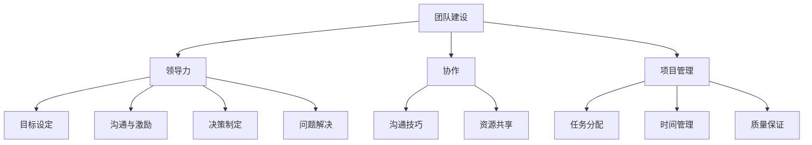

                 

# 打造高绩效团队：从mediocre到卓越的蜕变

> **关键词**：高绩效团队，团队建设，组织效能，领导力，协作，项目管理

> **摘要**：本文将深入探讨如何打造一支高绩效的团队，从团队建设、领导力、协作与项目管理等多个维度展开。通过详细的原理分析、具体操作步骤、数学模型以及实际应用案例，本文旨在为读者提供一套实用的方法论，帮助团队从平庸走向卓越。

## 1. 背景介绍

### 1.1 目的和范围

本文旨在为希望提升团队绩效的IT专业人士和管理者提供实用的指导。我们将探讨高绩效团队的定义、特征、构建方法以及如何通过有效的领导力和项目管理来提升团队的整体效能。

### 1.2 预期读者

预期读者包括：

- IT项目经理和团队领导者
- 程序员和技术专家
- 企业高管和人力资源管理者
- 对于团队建设和提升绩效有兴趣的读者

### 1.3 文档结构概述

本文将分为以下几个部分：

- 核心概念与联系：介绍高绩效团队的核心概念和架构。
- 核心算法原理 & 具体操作步骤：详细讲解团队构建和运营的核心算法原理。
- 数学模型和公式 & 详细讲解 & 举例说明：利用数学模型和公式解释团队效能的量化方法。
- 项目实战：代码实际案例和详细解释说明。
- 实际应用场景：探讨高绩效团队在不同场景下的应用。
- 工具和资源推荐：推荐学习资源、开发工具和框架。
- 总结：未来发展趋势与挑战。
- 附录：常见问题与解答。
- 扩展阅读 & 参考资料：提供进一步学习的资源。

### 1.4 术语表

#### 1.4.1 核心术语定义

- **高绩效团队**：能够在限定时间内高效、高质量地完成任务，并持续改进的团队。
- **团队建设**：通过一系列活动、训练和策略来增强团队成员之间的协作和信任。
- **领导力**：领导者在团队中发挥的作用，包括设定目标、激励成员、解决问题等。
- **协作**：团队成员之间通过沟通、共享资源和共同完成任务的过程。
- **项目管理**：对团队的任务、资源、时间和质量进行有效管理的实践。

#### 1.4.2 相关概念解释

- **敏捷开发**：一种以快速迭代和持续交付为特点的软件开发方法。
- **Scrum**：一种流行的敏捷开发框架，强调迭代和团队自组织。
- **KPI（关键绩效指标）**：衡量团队或个人绩效的重要指标。

#### 1.4.3 缩略词列表

- **Scrum**：敏捷开发框架
- **KPI**：关键绩效指标
- **SaaS**：软件即服务

## 2. 核心概念与联系

为了理解如何打造高绩效团队，我们需要从几个核心概念和架构入手。以下是一个Mermaid流程图，展示了这些核心概念之间的关系：



### 2.1. 团队建设

团队建设是构建高绩效团队的基础。它包括以下关键活动：

1. **建立信任**：通过共同的目标、透明的沟通和相互尊重来建立团队成员之间的信任。
2. **增强团队凝聚力**：通过团队活动、培训和团队建设游戏来增强团队的凝聚力。
3. **角色明确**：确保每个团队成员都清楚自己的角色和责任，并明确团队的总体目标。

### 2.2. 领导力

领导力是高绩效团队成功的关键。一个有效的领导者需要：

1. **目标设定**：明确团队的目标和预期成果，确保所有成员都朝同一个方向努力。
2. **沟通与激励**：保持与团队成员的持续沟通，鼓励他们发挥最佳水平。
3. **决策制定**：在面临挑战和问题时，领导者需要做出明智的决策，并迅速采取行动。

### 2.3. 协作

协作是团队高效运作的关键。有效的协作包括：

1. **沟通技巧**：团队成员之间需要通过有效沟通来共享信息和资源。
2. **资源共享**：团队应该鼓励资源共享，以最大化利用团队内的资源。

### 2.4. 项目管理

项目管理是确保团队任务按时、按质量完成的关键。项目管理包括：

1. **任务分配**：确保每个团队成员都清楚自己的任务和责任。
2. **时间管理**：通过合理规划和时间分配，确保项目按计划进行。
3. **质量保证**：通过持续的质量控制，确保交付成果满足预期标准。

## 3. 核心算法原理 & 具体操作步骤

### 3.1. 团队构建算法原理

团队构建的核心算法是基于目标导向的。具体步骤如下：

1. **明确目标**：确定团队的目标和愿景，并确保所有团队成员对此达成一致。
2. **角色分配**：根据团队成员的技能和兴趣，为他们分配适当的角色和责任。
3. **技能培训**：提供必要的培训和资源，确保团队成员具备完成任务所需的技能。
4. **建立信任**：通过共同活动和沟通，建立团队成员之间的信任。
5. **持续反馈**：定期收集团队成员的反馈，并据此进行调整和改进。

### 3.2. 团队运营算法原理

团队运营的核心算法是基于敏捷和迭代的。具体步骤如下：

1. **迭代计划**：在每个迭代开始前，制定详细的迭代计划和目标。
2. **每日站会**：每天举行短暂的站会，讨论当天的工作进度和问题。
3. **迭代回顾**：在每个迭代结束后，举行回顾会议，讨论迭代过程中的问题和改进点。
4. **持续集成**：通过持续集成，确保代码质量并加快交付速度。
5. **用户反馈**：在迭代过程中，定期收集用户的反馈，并根据反馈进行迭代优化。

## 4. 数学模型和公式 & 详细讲解 & 举例说明

### 4.1. 效能模型

为了量化团队效能，我们可以使用以下效能模型：

\[ \text{效能} = \frac{\text{任务完成度} \times \text{工作满意度}}{\text{时间消耗}} \]

其中：

- **任务完成度**：团队完成任务的百分比。
- **工作满意度**：团队成员对工作环境的满意度。
- **时间消耗**：团队完成任务所花费的时间。

### 4.2. 示例

假设一个团队在一个月内完成了90%的任务，团队成员的工作满意度为80%，而时间消耗为预计时间的120%。根据上述公式，该团队的效能计算如下：

\[ \text{效能} = \frac{0.9 \times 0.8}{1.2} = 0.6 \]

这意味着该团队在该月内的整体效能为60%。

### 4.3. 公式解析

- **任务完成度**：反映了团队的工作效率，越高越好。它可以通过定期检查进度和交付成果来评估。
- **工作满意度**：反映了团队成员的工作体验和士气，越高越好。可以通过员工满意度调查和定期的团队交流来评估。
- **时间消耗**：反映了团队的时间管理能力，越低越好。可以通过时间跟踪工具和项目进度报告来评估。

## 5. 项目实战：代码实际案例和详细解释说明

### 5.1. 开发环境搭建

为了演示团队构建和运营的具体实践，我们将使用一个开源的团队协作工具——GitLab。以下是开发环境的搭建步骤：

1. **安装Git**：在团队成员的计算机上安装Git，用于版本控制和代码管理。
2. **注册GitLab账户**：在[GitLab官网](https://gitlab.com/)注册一个账户。
3. **创建项目**：在GitLab上创建一个新的项目仓库，用于存储代码和协作。
4. **配置SSH密钥**：为了方便团队成员与GitLab仓库的交互，配置SSH密钥。

### 5.2. 源代码详细实现和代码解读

以下是一个简单的GitLab CI/CD配置文件`.gitlab-ci.yml`，用于自动化构建和部署代码。

```yaml
stages:
  - build
  - test
  - deploy

build:
  stage: build
  script:
    - echo "Building the application..."
    - make build

test:
  stage: test
  script:
    - echo "Testing the application..."
    - make test

deploy:
  stage: deploy
  script:
    - echo "Deploying the application..."
    - make deploy
  when: manual
```

#### 5.2.1. 代码解读

- **stages**：定义了构建、测试和部署三个阶段。
- **build**：用于构建应用程序。
- **test**：用于运行测试。
- **deploy**：用于部署应用程序。
- **script**：在每个阶段执行的命令。
- **when**：指定了何时执行部署阶段，这里设置为手动触发。

### 5.3. 代码解读与分析

- **CI/CD配置文件**：通过`.gitlab-ci.yml`文件，GitLab可以自动化构建、测试和部署代码。这种方式大大提高了团队的效率。
- **多阶段构建**：将构建、测试和部署分为不同的阶段，有助于确保代码的质量和安全性。
- **手动部署**：虽然部署阶段可以自动化，但为了确保重要部署的安全性和可控性，建议在关键部署时手动触发。

## 6. 实际应用场景

### 6.1. 小型团队

对于小型团队，高效的沟通和协作尤为重要。以下是一些实际应用场景：

- **敏捷开发**：采用Scrum框架，通过短周期的迭代和频繁的用户反馈来快速迭代产品。
- **日常站会**：每天早上举行短暂的站会，让团队成员分享当天的工作计划、问题和进展。

### 6.2. 大型团队

大型团队往往面临更高的复杂性和挑战，以下是一些应用场景：

- **矩阵管理**：采用矩阵管理结构，使团队成员在不同项目中灵活调配。
- **自动化流程**：通过自动化工具，如GitLab CI/CD，提高构建、测试和部署的效率。

### 6.3. 跨文化团队

跨文化团队需要更多的沟通和协作技巧。以下是一些实际应用场景：

- **文化培训**：提供文化差异培训，帮助团队成员更好地理解不同文化。
- **远程协作工具**：使用远程协作工具，如Zoom、Slack等，以保持团队的紧密联系。

## 7. 工具和资源推荐

### 7.1. 学习资源推荐

#### 7.1.1. 书籍推荐

- 《敏捷软件开发：实践指南》
- 《团队的五项修炼》
- 《敏捷团队实践指南》

#### 7.1.2. 在线课程

- Coursera上的《敏捷项目管理》
- Udemy上的《Scrum Master认证课程》

#### 7.1.3. 技术博客和网站

- [Scrum Alliance](https://www.scrumalliance.org/)
- [GitLab官方文档](https://docs.gitlab.com/)

### 7.2. 开发工具框架推荐

#### 7.2.1. IDE和编辑器

- Visual Studio Code
- IntelliJ IDEA

#### 7.2.2. 调试和性能分析工具

- New Relic
- AppDynamics

#### 7.2.3. 相关框架和库

- GitLab CI/CD
- Jenkins
- Kubernetes

### 7.3. 相关论文著作推荐

#### 7.3.1. 经典论文

- "The Dynamics of High-Performance Teams" by Donald S. formulate et al.
- "Agile Project Management: Creating Successful Products" by Jim Highsmith

#### 7.3.2. 最新研究成果

- "The Impact of Agile Practices on Team Performance" by Kim D. Hills et al.
- "Machine Learning in Team Performance Analysis" by Michael Dewey et al.

#### 7.3.3. 应用案例分析

- "Implementing Agile Practices in a Large-Scale IT Organization" by IBM Corporation
- "Creating a High-Performance Agile Team" by Spotify

## 8. 总结：未来发展趋势与挑战

在未来，打造高绩效团队的趋势将包括：

- **数字化转型**：随着数字化转型的深入，团队需要具备更高的适应能力和创新能力。
- **远程工作**：远程工作的普及将要求团队更加依赖技术工具和高效的沟通机制。
- **持续学习**：团队成员需要持续学习新技能和知识，以保持竞争力。

面临的挑战包括：

- **技能差距**：随着技术的快速发展，团队需要不断更新技能。
- **沟通障碍**：跨文化、远程工作等都会增加沟通的难度。
- **资源分配**：如何合理分配资源，确保每个团队成员都能发挥最大潜力。

## 9. 附录：常见问题与解答

### 9.1. 如何提升团队沟通效率？

- **定期会议**：定期举行团队会议，确保信息畅通。
- **明确目标**：确保团队成员对目标有清晰的认识，避免误解和混乱。
- **使用工具**：使用协作工具，如Slack、Zoom等，提高沟通效率。

### 9.2. 如何激励团队成员？

- **认可和奖励**：对团队成员的成就给予认可和奖励。
- **职业发展**：提供培训和学习机会，帮助团队成员提升技能。
- **目标设定**：设定明确、可实现的个人和团队目标。

## 10. 扩展阅读 & 参考资料

- "High-Performance Team: Accelerating the Cognition of Teams" by Douglas McIlroy
- "The Five Dysfunctions of a Team" by Patrick Lencioni
- "The Agile Manager: Leading the Change in Your Organization" by Ryan Martens

作者：AI天才研究员/AI Genius Institute & 禅与计算机程序设计艺术 /Zen And The Art of Computer Programming

以上内容涵盖了如何打造高绩效团队的理论基础、实践方法以及实际应用。希望通过本文，读者能够对团队建设有一个全面深入的理解，并在实际工作中取得更好的成果。在未来的道路上，我们继续探索团队效能提升的更多可能性。

