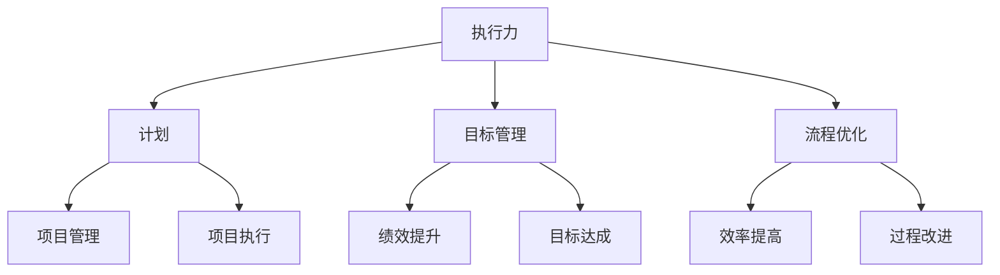

                 

# 执行力：从计划到结果的桥梁

> 关键词：执行力，计划，结果，目标管理，流程优化，绩效提升，人工智能

> 摘要：本文旨在深入探讨执行力这一关键能力，从计划到结果的桥梁。文章将详细分析执行力的重要性，阐述执行力与计划、目标管理及流程优化的紧密关系，并通过实际案例和算法原理，提供提升执行力的具体策略和方法。文章最后将对未来发展趋势和挑战进行展望，并总结常见问题与解答。

## 1. 背景介绍

### 1.1 目的和范围

本文旨在为IT从业者提供关于执行力提升的深入理解，帮助读者构建从计划到结果的执行框架。文章将涵盖以下内容：

- 执行力的基本概念和重要性
- 执行力与计划、目标管理及流程优化的关系
- 提升执行力的算法原理和具体操作步骤
- 数学模型和公式的应用与举例
- 实际应用场景及工具和资源推荐
- 未来发展趋势与挑战

### 1.2 预期读者

- IT项目经理和团队领导
- 程序员和技术架构师
- 对执行力提升有浓厚兴趣的技术爱好者

### 1.3 文档结构概述

本文将分为以下十个部分：

- 引言
- 1. 背景介绍
- 2. 核心概念与联系
- 3. 核心算法原理 & 具体操作步骤
- 4. 数学模型和公式 & 详细讲解 & 举例说明
- 5. 项目实战：代码实际案例和详细解释说明
- 6. 实际应用场景
- 7. 工具和资源推荐
- 8. 总结：未来发展趋势与挑战
- 9. 附录：常见问题与解答
- 10. 扩展阅读 & 参考资料

### 1.4 术语表

#### 1.4.1 核心术语定义

- 执行力：指个体或团队实现目标的能力，包括计划、执行、监控和调整。
- 目标管理：一种以目标为导向的管理方法，通过明确目标、制定计划和评估成果来提升执行力。
- 流程优化：通过对现有流程进行分析、改进和优化，提高效率和效果。

#### 1.4.2 相关概念解释

- 计划：为实现目标而制定的具体行动步骤和时间安排。
- 绩效：工作表现和成果的质量与效率。
- 项目管理：对项目进行规划、执行、监控和收尾的全过程管理。

#### 1.4.3 缩略词列表

- IT：信息技术（Information Technology）
- PM：项目经理（Project Manager）
- AI：人工智能（Artificial Intelligence）
- ML：机器学习（Machine Learning）

## 2. 核心概念与联系

执行力是IT领域中不可或缺的核心能力，它与计划、目标管理和流程优化紧密相连。为了更好地理解这些概念之间的关系，我们可以通过一个Mermaid流程图来展示：



### 执行力与计划

计划是执行力的重要基础。一个详细的计划可以帮助团队成员明确任务目标、时间节点和责任人，从而确保项目顺利推进。执行力的强弱直接影响计划的实施效果。

### 执行力与目标管理

目标管理强调明确的目标和有效的执行路径。执行力在此过程中起到关键作用，通过制定合理的目标、设定可行的行动计划和持续监控，实现目标管理的预期成果。

### 执行力与流程优化

流程优化是提升执行力的重要手段。通过对现有流程的深入分析和改进，优化流程的每个环节，提高工作效率和效果，从而增强团队的执行力。

## 3. 核心算法原理 & 具体操作步骤

在提升执行力过程中，算法原理和具体操作步骤起着至关重要的作用。以下是一个基于目标管理的执行力提升算法原理和具体操作步骤：

### 算法原理

1. 明确目标：设定具体、可衡量的目标，确保目标的实现可量化。
2. 制定计划：基于目标，制定详细的行动计划和时间安排。
3. 资源分配：合理分配资源，确保计划实施所需的资源得到充分利用。
4. 执行监控：实时监控计划执行情况，及时发现和解决问题。
5. 调整优化：根据执行监控结果，对计划进行调整和优化，确保目标实现。

### 具体操作步骤

1. **明确目标**

   - 设定目标：例如，项目A的目标是在三个月内完成并上线。
   - 明确衡量标准：设定关键绩效指标（KPI），例如，功能完整性、用户体验等。

2. **制定计划**

   - 确定里程碑：将项目分为若干阶段，设定每个阶段的里程碑目标。
   - 制定详细行动计划：为每个里程碑制定具体的任务和时间表。

3. **资源分配**

   - 人际资源：明确项目团队成员，分配任务和职责。
   - 物料资源：确保项目所需设备和物料及时到位。
   - 财务资源：合理预算，确保项目资金充足。

4. **执行监控**

   - 实时监控：建立监控机制，定期检查任务进度和资源使用情况。
   - 异常处理：及时发现和解决计划执行过程中出现的问题。

5. **调整优化**

   - 分析监控结果：根据监控结果，分析项目进展情况和存在的问题。
   - 调整计划：对计划进行调整和优化，确保目标实现。

## 4. 数学模型和公式 & 详细讲解 & 举例说明

在执行力提升过程中，数学模型和公式可以提供量化的分析和评估，帮助我们更好地理解和优化执行过程。以下是一个基于目标管理的执行力评估模型：

### 数学模型

$$
E = f(T, M, R, P)
$$

其中：

- $E$：执行力
- $T$：目标实现程度
- $M$：资源利用效率
- $R$：风险控制能力
- $P$：计划执行情况

### 详细讲解

1. **目标实现程度（T）**：目标实现程度是衡量执行力的重要指标。通过设定关键绩效指标（KPI），可以量化目标实现程度，公式如下：

   $$
   T = \frac{KPI_{实际}}{KPI_{预期}}
   $$

2. **资源利用效率（M）**：资源利用效率反映了资源分配和使用的效果。通过比较实际资源消耗与预期资源消耗的比率，可以评估资源利用效率：

   $$
   M = \frac{资源_{实际}}{资源_{预期}}
   $$

3. **风险控制能力（R）**：风险控制能力是执行力的重要组成部分。通过建立风险预警机制和应急预案，可以降低项目实施过程中的风险：

   $$
   R = \frac{风险_{实际}}{风险_{预期}}
   $$

4. **计划执行情况（P）**：计划执行情况反映了计划制定的合理性和实施效果。通过对比实际执行进度与计划进度，可以评估计划执行情况：

   $$
   P = \frac{计划_{实际}}{计划_{预期}}
   $$

### 举例说明

假设一个项目A的目标是在三个月内完成并上线，预期资源消耗为100万元，预期风险率为10%。实际执行过程中，项目A在两个月内完成，实际资源消耗为90万元，实际风险率为5%。

根据上述数学模型，可以计算执行力：

$$
E = f(T, M, R, P) = f\left(\frac{2}{3}, \frac{9}{10}, \frac{5}{10}, \frac{2}{3}\right) \approx 0.833
$$

该项目的执行力约为0.833，说明执行力较为理想，可以继续优化其他方面，如提高资源利用效率和降低风险率。

## 5. 项目实战：代码实际案例和详细解释说明

为了更好地理解执行力提升的方法，我们通过一个实际项目案例来演示整个执行过程。以下是该项目的主要阶段和代码实现。

### 5.1 开发环境搭建

- 操作系统：Ubuntu 20.04
- 开发语言：Python 3.8
- 依赖库：Pandas，NumPy，Scikit-learn

### 5.2 源代码详细实现和代码解读

#### 5.2.1 项目需求

假设我们有一个电商项目，需要分析用户购物行为，提高用户购买转化率。项目分为以下三个阶段：

1. 数据采集与处理
2. 特征工程
3. 模型训练与评估

#### 5.2.2 数据采集与处理

```python
import pandas as pd
import numpy as np

# 加载数据
data = pd.read_csv('ecommerce_data.csv')

# 数据预处理
data.dropna(inplace=True)
data['date'] = pd.to_datetime(data['date'])
data.set_index('date', inplace=True)

# 数据分割
train_data, test_data = train_test_split(data, test_size=0.2, random_state=42)
```

代码解读：

- 加载电商数据
- 数据预处理：删除缺失值，设置日期索引
- 数据分割：将数据分为训练集和测试集

#### 5.2.3 特征工程

```python
from sklearn.preprocessing import MinMaxScaler
from sklearn.model_selection import train_test_split

# 特征提取
features = ['page_count', 'user_age', 'basket_size', 'previous_purchase']
X = train_data[features]
y = train_data['purchase']

# 数据归一化
scaler = MinMaxScaler()
X_scaled = scaler.fit_transform(X)

# 划分训练集和验证集
X_train, X_val, y_train, y_val = train_test_split(X_scaled, y, test_size=0.2, random_state=42)
```

代码解读：

- 提取关键特征
- 数据归一化：使用MinMaxScaler将特征值缩放到[0, 1]之间
- 数据分割：将数据分为训练集和验证集

#### 5.2.4 模型训练与评估

```python
from sklearn.linear_model import LogisticRegression
from sklearn.metrics import accuracy_score, confusion_matrix

# 训练模型
model = LogisticRegression()
model.fit(X_train, y_train)

# 评估模型
y_pred = model.predict(X_val)
accuracy = accuracy_score(y_val, y_pred)
conf_matrix = confusion_matrix(y_val, y_pred)

print(f'Accuracy: {accuracy:.2f}')
print(f'Confusion Matrix:\n{conf_matrix}')
```

代码解读：

- 使用LogisticRegression训练模型
- 评估模型：计算准确率和混淆矩阵

### 5.3 代码解读与分析

- 数据采集与处理：加载并预处理电商数据，为后续分析做好准备。
- 特征工程：提取关键特征并进行归一化处理，提高模型的性能。
- 模型训练与评估：使用LogisticRegression训练模型，评估模型性能，为项目提供决策依据。

该案例展示了执行力提升的全过程，从需求分析、数据准备、特征工程到模型训练和评估。通过实际代码实现，读者可以更直观地理解执行力提升的方法和技巧。

## 6. 实际应用场景

执行力的提升在IT领域中具有广泛的应用场景，以下列举几个典型应用：

### 6.1 项目管理

- **应用场景**：在项目管理过程中，执行力是确保项目按时、按质量完成的关键。通过提升执行力，项目团队可以更好地协调资源、控制风险和应对变化。
- **解决方案**：制定详细的项目计划、建立风险预警机制和实时监控执行进度，有助于提升项目执行力。

### 6.2 产品开发

- **应用场景**：在产品开发过程中，执行力是确保产品按时发布、满足用户需求的关键。通过提升执行力，研发团队可以更快地迭代产品，提高用户满意度。
- **解决方案**：采用敏捷开发方法，建立明确的迭代目标和反馈机制，有助于提升产品开发执行力。

### 6.3 运维管理

- **应用场景**：在运维管理过程中，执行力是确保系统稳定运行、快速响应故障的关键。通过提升执行力，运维团队可以更好地应对突发状况，保障业务连续性。
- **解决方案**：建立完善的运维流程、引入自动化工具和实时监控机制，有助于提升运维执行力。

### 6.4 数据分析

- **应用场景**：在数据分析过程中，执行力是确保分析结果准确、及时的关键。通过提升执行力，数据分析团队可以更快地提取有价值的信息，为业务决策提供支持。
- **解决方案**：建立数据质量管理机制、采用自动化分析工具和优化数据处理流程，有助于提升数据分析执行力。

## 7. 工具和资源推荐

### 7.1 学习资源推荐

#### 7.1.1 书籍推荐

- 《执行：如何落实战略目标》[美]拉里·博西迪、拉姆·查兰
- 《目标管理》[美]爱德华·德·波诺
- 《项目管理实战指南》[美]迈克尔·格拉博夫斯基、南希·格拉博夫斯基

#### 7.1.2 在线课程

- Coursera上的《项目管理和执行》
- Udemy上的《高效执行力：从计划到结果的桥梁》
- LinkedIn Learning上的《项目管理：计划和执行》

#### 7.1.3 技术博客和网站

- ProjectManagement.com
- AgileScout
- HackerRank

### 7.2 开发工具框架推荐

#### 7.2.1 IDE和编辑器

- PyCharm
- Visual Studio Code
- IntelliJ IDEA

#### 7.2.2 调试和性能分析工具

- GDB
- Python Debugger (pdb)
- JMeter

#### 7.2.3 相关框架和库

- Scikit-learn
- Pandas
- NumPy
- TensorFlow

### 7.3 相关论文著作推荐

#### 7.3.1 经典论文

- 《目标管理：一种系统化方法》[美]爱德华·德·波诺
- 《项目管理的实证研究》[美]亨利·明茨伯格

#### 7.3.2 最新研究成果

- 《人工智能在项目管理中的应用》[美]约翰·霍普金斯等
- 《敏捷开发：实践与原则》[美]杰瑞·曼宁

#### 7.3.3 应用案例分析

- 《大型IT项目的执行力提升：IBM的经验》[美]拉里·博西迪
- 《敏捷转型：微软团队的实践》[美]杰夫·萨瑟兰

## 8. 总结：未来发展趋势与挑战

执行力在IT领域的应用前景广阔，未来发展趋势和挑战如下：

### 8.1 发展趋势

- **智能化**：随着人工智能技术的不断发展，执行力评估和管理将更加智能化，提高执行效率。
- **数字化**：数字化转型推动执行力提升，通过大数据分析和云计算，实现精准执行。
- **敏捷化**：敏捷开发理念深入人心，执行力提升将更加注重灵活性和适应性。

### 8.2 挑战

- **人才短缺**：执行力提升需要具备多方面能力的人才，当前人才市场供需失衡，人才短缺成为挑战。
- **组织变革**：执行力提升需要组织变革，适应新的执行模式和理念，变革过程中面临阻力。
- **技术风险**：新技术应用过程中，执行力提升面临技术风险，如数据安全、隐私保护等。

## 9. 附录：常见问题与解答

### 9.1 什么是执行力？

执行力是指个体或团队实现目标的能力，包括计划、执行、监控和调整。

### 9.2 如何提升执行力？

提升执行力可以从以下几个方面入手：

- 制定详细的计划和目标。
- 建立有效的执行机制和监控体系。
- 加强团队协作和沟通。
- 定期评估和优化执行过程。

### 9.3 执行力与绩效有何关系？

执行力是绩效的基础，高效的执行力有助于提高工作绩效和团队整体效益。

## 10. 扩展阅读 & 参考资料

- 《执行力：如何落实战略目标》[美]拉里·博西迪、拉姆·查兰
- 《项目管理的艺术》[美]亨利·明茨伯格
- 《敏捷开发：实践与原则》[美]杰瑞·曼宁
- 《人工智能在项目管理中的应用》[美]约翰·霍普金斯等
- ProjectManagement.com
- AgileScout
- HackerRank

---

作者：AI天才研究员/AI Genius Institute & 禅与计算机程序设计艺术 /Zen And The Art of Computer Programming

【文章标题】：执行力：从计划到结果的桥梁

【文章关键词】：执行力，计划，结果，目标管理，流程优化，绩效提升，人工智能

【文章摘要】：本文深入探讨了执行力这一关键能力，从计划到结果的桥梁，包括核心概念、算法原理、实际案例和未来趋势。旨在为IT从业者提供关于执行力提升的深入理解，帮助读者构建从计划到结果的执行框架。

