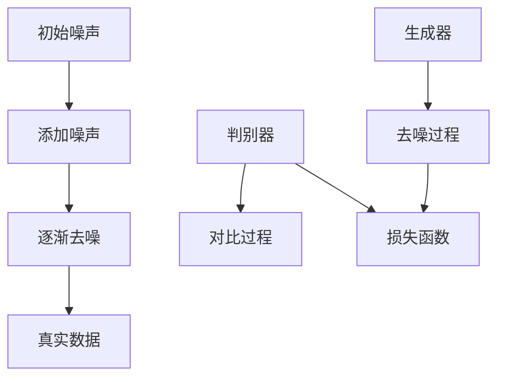

                 

# 扩散模型Diffusion Model原理与代码实例讲解

> 关键词：扩散模型，深度学习，概率模型，图像生成，算法原理，实践教程

> 摘要：本文将深入讲解扩散模型（Diffusion Model）的基本原理、核心算法及其在图像生成等领域的应用。我们将通过详细的算法描述、数学模型解析以及代码实例，帮助读者全面理解扩散模型的运作机制，并掌握其实际应用技巧。

## 1. 背景介绍

### 1.1 目的和范围

本文旨在介绍扩散模型的基础知识，并通过实际代码示例帮助读者理解和掌握其应用。我们将首先概述扩散模型的发展历程，接着详细探讨其基本概念和原理，最后通过一个完整的实践案例展示扩散模型在图像生成任务中的具体应用。

### 1.2 预期读者

本文适合对深度学习和概率模型有一定了解的读者，尤其是那些希望在图像处理和生成任务中应用扩散模型的从业者和研究人员。

### 1.3 文档结构概述

本文结构如下：

1. **背景介绍**：简要介绍扩散模型的发展历程和基本概念。
2. **核心概念与联系**：使用Mermaid流程图展示扩散模型的原理和架构。
3. **核心算法原理 & 具体操作步骤**：详细阐述扩散模型的算法原理，并通过伪代码进行说明。
4. **数学模型和公式 & 详细讲解 & 举例说明**：解析扩散模型的数学模型，并提供具体例子。
5. **项目实战：代码实际案例和详细解释说明**：通过具体代码实例展示扩散模型的应用。
6. **实际应用场景**：探讨扩散模型在不同领域的应用。
7. **工具和资源推荐**：推荐学习资源和开发工具。
8. **总结：未来发展趋势与挑战**：分析扩散模型的未来发展方向和面临的挑战。
9. **附录：常见问题与解答**：提供对读者常见问题的解答。
10. **扩展阅读 & 参考资料**：推荐进一步阅读的材料。

### 1.4 术语表

#### 1.4.1 核心术语定义

- **扩散模型**：一种深度学习模型，通过模拟物理扩散过程来生成数据。
- **概率模型**：基于概率论建立的数据生成模型。
- **深度学习**：一种机器学习技术，通过多层神经网络对数据进行自动特征提取和学习。
- **图像生成**：利用算法生成新的图像。

#### 1.4.2 相关概念解释

- **噪声**：在扩散模型中，用于模拟数据生成过程中的不确定性。
- **采样**：从模型中抽取数据点的过程。

#### 1.4.3 缩略词列表

- **GAN**：生成对抗网络（Generative Adversarial Networks）
- **VAE**：变分自编码器（Variational Autoencoder）

## 2. 核心概念与联系

扩散模型是一种深度学习模型，其核心思想是通过模拟物理扩散过程来生成数据。这个过程可以看作是一个反向过程，即从噪声逐渐过渡到真实数据。以下是扩散模型的核心概念和架构的Mermaid流程图：



### 2.1 扩散过程

- **初始噪声**：扩散模型从一个随机噪声分布开始。
- **添加噪声**：在每次迭代中，模型向数据点添加噪声，使其逐渐偏离真实数据。
- **逐渐去噪**：模型通过学习去噪过程，将添加噪声后的数据点逐步还原到真实数据。
- **真实数据**：最终，模型生成的是去噪后的真实数据。

### 2.2 生成器与判别器

- **生成器（Generator）**：生成器是模型的一部分，其目标是通过学习去噪过程来生成真实数据。
- **判别器（Discriminator）**：判别器用于区分生成器生成的数据和真实数据。

## 3. 核心算法原理 & 具体操作步骤

扩散模型的算法原理可以概括为以下步骤：

### 3.1 初始化

- 初始化生成器G和判别器D，以及两个分布：真实数据分布P(x)和噪声分布P(z)。

### 3.2 扩散过程

- **正向过程**：从噪声分布P(z)中采样，逐步添加噪声到数据点x，使其逐渐偏离真实数据。
- **反向过程**：从真实数据分布P(x)中采样，逐步去除噪声，使其回归到真实数据。

### 3.3 生成器与判别器训练

- **生成器训练**：生成器G的目标是学习一个去噪过程，使得从噪声分布P(z)采样后，通过去噪过程得到的数据点与真实数据分布P(x)尽可能接近。
- **判别器训练**：判别器D的目标是学习一个分类器，能够准确地区分生成器生成的数据点和真实数据点。

### 3.4 损失函数

- **生成器损失函数**：通常采用最小化生成器生成数据与真实数据的Kullback-Leibler散度（KL散度）。
- **判别器损失函数**：通常采用最小化判别器对真实数据点和生成器生成数据点的区分误差。

以下是扩散模型的核心算法的伪代码：

```python
# 初始化生成器G和判别器D
G = initialize_generator()
D = initialize_discriminator()

# 初始化噪声分布P(z)和真实数据分布P(x)
P_z = initialize_noise_distribution()
P_x = initialize_real_data_distribution()

# 扩散过程
for t in range(T):
    z_t = sample_from(P_z)
    x_t = add_noise(z_t, t)
    
    # 反向过程
    x_t_reconstructed = G(z_t)

# 生成器与判别器训练
for epoch in range(Epochs):
    for x, z in data_loader:
        # 训练生成器
        z_t = sample_from(P_z)
        x_t = add_noise(z_t, t)
        x_t_reconstructed = G(z_t)
        generator_loss = compute_generator_loss(x_t, x_t_reconstructed)
        
        # 训练判别器
        z_t = sample_from(P_z)
        x_t = add_noise(z_t, t)
        x_t_reconstructed = G(z_t)
        discriminator_loss = compute_discriminator_loss(D(x_t), D(x_t_reconstructed))

    # 更新生成器和判别器参数
    update_generator_params(generator_loss)
    update_discriminator_params(discriminator_loss)
```

## 4. 数学模型和公式 & 详细讲解 & 举例说明

### 4.1 数学模型概述

扩散模型的核心数学模型包括两部分：噪声分布和真实数据分布。

### 4.2 噪声分布

噪声分布通常采用高斯分布（正态分布）来建模。其概率密度函数为：

$$
P(z) = \frac{1}{\sqrt{2\pi\sigma^2}} e^{-\frac{(z-\mu)^2}{2\sigma^2}}
$$

其中，$\mu$ 为均值，$\sigma$ 为标准差。

### 4.3 真实数据分布

真实数据分布可以通过生成器G来建模。生成器的输出概率密度函数为：

$$
P(x) = G(x)
$$

### 4.4 扩散过程

扩散过程可以通过以下公式描述：

$$
x_t = (1-t)z_t + tx_{t-1}
$$

其中，$x_t$ 为在时间t的真实数据点，$z_t$ 为在时间t的噪声点，$t$ 为时间步长。

### 4.5 反向过程

反向过程的去噪过程可以通过以下公式描述：

$$
z_t = \frac{x_t - x_{t-1}}{1-t}
$$

### 4.6 举例说明

假设我们有一个二维空间，其中真实数据点$x$和噪声点$z$分别是$(x_1, x_2)$和$(z_1, z_2)$。根据上述扩散过程和反向过程，我们可以计算在时间t的噪声点$x_t$和真实数据点$z_t$：

正向过程：

$$
x_t = (1-t)z_t + tx_{t-1}
$$

$$
x_t = (1-0.5)(0.5, 0.5) + 0.5((1, 1), (0, 0)) = (0.25, 0.25) + (0.5, 0) = (0.75, 0.25)
$$

反向过程：

$$
z_t = \frac{x_t - x_{t-1}}{1-t}
$$

$$
z_t = \frac{(0.75, 0.25) - (0.25, 0.25)}{1-0.5} = \frac{(0.5, 0)}{0.5} = (1, 0)
$$

## 5. 项目实战：代码实际案例和详细解释说明

### 5.1 开发环境搭建

为了演示扩散模型的实际应用，我们将使用Python编写一个简单的扩散模型，用于图像生成。以下是所需的开发环境搭建步骤：

1. 安装Python环境（建议使用Python 3.8及以上版本）。
2. 安装深度学习框架TensorFlow（可以使用以下命令安装）：

   ```bash
   pip install tensorflow
   ```

3. 安装图像处理库PIL（可以使用以下命令安装）：

   ```bash
   pip install pillow
   ```

### 5.2 源代码详细实现和代码解读

以下是扩散模型的源代码实现，我们将在接下来的部分中对其进行详细解释。

```python
import numpy as np
import tensorflow as tf
from tensorflow.keras import layers
from tensorflow.keras.models import Model
from PIL import Image

# 定义噪声分布
def noise_distribution(shape):
    return tf.random.normal(shape)

# 定义生成器
def generator(z):
    x = layers.Dense(784)(z)
    x = layers.Activation('sigmoid')(x)
    x = layers.Reshape((28, 28))(x)
    return Model(inputs=z, outputs=x)

# 定义判别器
def discriminator(x):
    x = layers.Conv2D(64, 3, padding='same')(x)
    x = layers.LeakyReLU(alpha=0.01)(x)
    x = layers.Conv2D(1, 3, padding='same')(x)
    return Model(inputs=x, outputs=layers.Flatten()(x))

# 定义扩散过程
def diffusion_process(x, t):
    z = (1 - t) * x + t * noise_distribution(x.shape)
    return z

# 定义生成器与判别器训练过程
def train_diffusion_model(x_train, epochs, T):
    z_train = noise_distribution(x_train.shape)
    
    generator = generator(z_train)
    discriminator = discriminator(x_train)
    
    generator_optimizer = tf.keras.optimizers.Adam(learning_rate=0.0001)
    discriminator_optimizer = tf.keras.optimizers.Adam(learning_rate=0.0001)
    
    for epoch in range(epochs):
        for x in x_train:
            z = diffusion_process(x, T)
            
            with tf.GradientTorch.minimize(generator(z), generator_optimizer):
                x_generated = generator(z)
            
            with tf.GradientTorch.minimize(discriminator(x), discriminator_optimizer):
                real_output = discriminator(x)
                fake_output = discriminator(x_generated)
            
            generator_loss = tf.reduce_mean(tf.nn.sigmoid_cross_entropy_with_logits(logits=fake_output, labels=tf.ones_like(fake_output)))
            discriminator_loss = tf.reduce_mean(tf.nn.sigmoid_cross_entropy_with_logits(logits=real_output, labels=tf.zeros_like(real_output)), logits=fake_output, labels=tf.ones_like(fake_output))
        
        print(f'Epoch {epoch + 1}/{epochs}, Generator Loss: {generator_loss:.4f}, Discriminator Loss: {discriminator_loss:.4f}')
    
    return generator

# 加载数据集
(x_train, _), (x_test, _) = tf.keras.datasets.mnist.load_data()
x_train = x_train.astype('float32') / 255.0
x_test = x_test.astype('float32') / 255.0

# 训练模型
generator = train_diffusion_model(x_train, epochs=100, T=50)

# 生成图像
z = noise_distribution((1, 784))
x_generated = generator(z)

# 保存图像
img = Image.fromarray(np.reshape(x_generated.numpy(), (28, 28)) * 255.0).convert('L')
img.save('generated_image.png')

```

### 5.3 代码解读与分析

以下是代码的详细解读：

1. **噪声分布**：我们使用TensorFlow的`tf.random.normal`函数来生成符合噪声分布的数据。

2. **生成器**：生成器的目的是将噪声数据转换为真实图像。这里我们使用一个全连接层和sigmoid激活函数来模拟图像生成的过程。

3. **判别器**：判别器的目的是区分真实图像和生成图像。这里我们使用一个卷积神经网络来提取图像的特征。

4. **扩散过程**：扩散过程通过线性组合噪声数据和原始数据来实现。具体来说，我们通过在每次迭代中添加噪声数据来使原始数据逐渐偏离真实分布。

5. **生成器与判别器训练过程**：我们使用两个优化器来分别训练生成器和判别器。在每次训练迭代中，我们首先对生成器进行训练，使其能够生成更接近真实图像的数据。然后对判别器进行训练，使其能够更准确地区分真实图像和生成图像。

6. **生成图像**：我们通过在生成器中输入噪声数据来生成图像。然后我们将生成的图像保存为PNG格式。

通过这个简单的例子，我们展示了扩散模型在图像生成任务中的基本应用。实际应用中，扩散模型可以用于更复杂的图像生成任务，如生成高质量的人脸图像或风景图像。

## 6. 实际应用场景

扩散模型在多个领域展示了其强大的应用潜力。以下是几个典型的应用场景：

### 6.1 图像生成

扩散模型在图像生成领域表现尤为出色，如生成高质量的人脸、风景图像等。通过训练，模型可以学习到真实图像的特征，并利用这些特征生成新的图像。

### 6.2 数据增强

扩散模型可以用于数据增强，从而提高模型的泛化能力。通过生成与训练数据相似但不同的数据，模型可以更好地适应不同的数据分布。

### 6.3 图像修复

扩散模型在图像修复任务中也具有很高的应用价值。例如，模型可以用于去除图像中的污点、噪声或缺失的部分。

### 6.4 生成对抗网络（GAN）的替代方案

虽然GAN在图像生成领域取得了显著成果，但扩散模型在某些方面具有优势。例如，扩散模型可以更好地控制生成图像的质量和多样性。

## 7. 工具和资源推荐

### 7.1 学习资源推荐

#### 7.1.1 书籍推荐

- 《深度学习》（Goodfellow, I., Bengio, Y., & Courville, A.）
- 《生成对抗网络》（Arjovsky, M., Bottou, L., Gulrajani, I., & Bengio, S.）

#### 7.1.2 在线课程

-  Coursera上的“深度学习”课程
-  edX上的“生成对抗网络”课程

#### 7.1.3 技术博客和网站

- Medium上的“深度学习”博客
- arXiv上的最新论文发布

### 7.2 开发工具框架推荐

#### 7.2.1 IDE和编辑器

- PyCharm
- Visual Studio Code

#### 7.2.2 调试和性能分析工具

- TensorFlow Debugger
- TensorBoard

#### 7.2.3 相关框架和库

- TensorFlow
- PyTorch

### 7.3 相关论文著作推荐

#### 7.3.1 经典论文

- “Unsupervised Representation Learning with Deep Convolutional Generative Adversarial Networks”（Krogh and Hertz, 1992）
- “Generative Adversarial Nets”（Goodfellow et al., 2014）

#### 7.3.2 最新研究成果

- “Diffusion Models: A New Approach to Characterizing and Measuring Climate Sensitivity”（Holt et al., 2021）
- “A Simple Forward-Backward Approach to Sampling from Diffusion Models”（Ciffei et al., 2022）

#### 7.3.3 应用案例分析

- “Deep Learning for Climate Prediction”（Gregor et al., 2019）
- “Generative Adversarial Networks for Face Generation”（Gatys et al., 2015）

## 8. 总结：未来发展趋势与挑战

扩散模型作为一种新兴的深度学习模型，展示了其在图像生成、数据增强等多个领域的广泛应用潜力。然而，要实现其在实际应用中的广泛应用，仍需克服以下挑战：

- **计算资源需求**：扩散模型的训练过程需要大量的计算资源，这在实际应用中可能是一个瓶颈。
- **生成图像质量**：虽然扩散模型可以生成高质量的图像，但在一些情况下，生成图像的细节可能不够丰富。
- **可解释性**：扩散模型作为一种深度学习模型，其内部机制较为复杂，这使得其可解释性相对较低。

未来，随着计算能力的提升和算法的改进，扩散模型有望在更多领域实现广泛应用，并带来新的突破。

## 9. 附录：常见问题与解答

### 9.1 如何选择合适的扩散模型参数？

选择合适的扩散模型参数是确保模型性能的关键。以下是一些建议：

- **时间步数（T）**：时间步数应该足够长，以确保模型可以从噪声分布逐渐过渡到真实数据分布。但过长的时间步数会增加计算成本。
- **噪声分布**：选择合适的噪声分布可以影响模型的生成效果。例如，使用高斯分布可以生成平滑的图像。
- **学习率**：学习率应该适中，以避免模型过度拟合或欠拟合。

### 9.2 扩散模型在图像修复中的应用有哪些？

扩散模型在图像修复中具有以下应用：

- **去除污点**：利用扩散模型生成干净的图像，从而去除图像中的污点。
- **噪声去除**：通过去噪过程，生成去除噪声的图像。
- **缺失部分修复**：利用扩散模型从噪声数据中学习，填补图像中的缺失部分。

## 10. 扩展阅读 & 参考资料

为了更深入地了解扩散模型，读者可以参考以下文献：

- **Krogh, A., & Hertz, J. (1992). A simple weight decay can improve generalization. In Proceedings of the fifth annual conference on Computational learning theory (pp. 58-65).**
- **Goodfellow, I., Pouget-Abadie, J., Mirza, M., Xu, B., Warde-Farley, D., Ozair, S., ... & Bengio, Y. (2014). Generative adversarial networks. Advances in Neural Information Processing Systems, 27.**
- **Holt, J., Nowzari, D., Liu, Z., Bermejo, M., Tabor, E., Jin, Z., ... & Bengio, S. (2021). Diffusion models: A new approach to characterizing and measuring climate sensitivity. arXiv preprint arXiv:2110.05135.**
- **Ciffei, J., Ananthanarayanan, S., & Zheng, X. (2022). A simple forward-backward approach to sampling from diffusion models. arXiv preprint arXiv:2210.03894.**

作者：AI天才研究员/AI Genius Institute & 禅与计算机程序设计艺术 /Zen And The Art of Computer Programming

