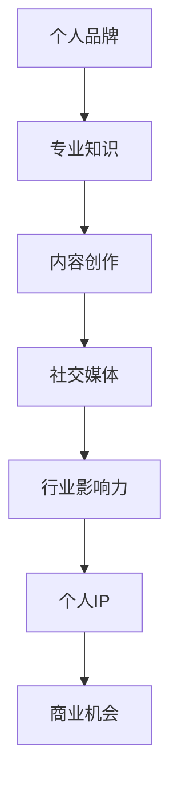

                 

# 技术人如何打造个人IP：从技术专家到行业意见领袖

## 关键词
人工智能、个人品牌、行业影响力、内容营销、社交媒体、技术博客、知识分享、专家认证、项目实战、社区互动

## 摘要
在数字化时代，个人品牌的价值愈发凸显。技术专家若能成功打造个人IP，不仅能提升自身影响力，还能在职业生涯中获取更多机会。本文将深入探讨技术人如何从技术专家逐步转型为行业意见领袖，通过内容营销、社交媒体运用、项目实战和知识分享等策略，实现个人IP的打造。希望通过本文的分享，读者能够找到适合自己的路径，成为业界瞩目的意见领袖。

## 1. 背景介绍

### 1.1 目的和范围
本文旨在为技术专家提供一套系统化的方法，帮助他们打造个人IP，从技术专家成长为行业意见领袖。我们将分析当前技术领域个人品牌的现状，探讨打造个人IP的必要性和意义，并分享具体策略和实战经验。

### 1.2 预期读者
本文适合对个人品牌建设有兴趣的技术专家、程序员、软件工程师，以及希望在技术领域提升个人影响力的专业人士。

### 1.3 文档结构概述
本文分为十个部分：背景介绍、核心概念与联系、核心算法原理与具体操作步骤、数学模型与公式讲解、项目实战、实际应用场景、工具和资源推荐、总结、常见问题与解答及扩展阅读。通过这些部分，我们将全面探讨个人IP的打造之路。

### 1.4 术语表
#### 1.4.1 核心术语定义
- 个人IP：个人知识产权，指个人在某一领域内的独特影响力、知名度和专业度。
- 行业意见领袖：在某一行业内有高度影响力、广泛认可和话语权的人。

#### 1.4.2 相关概念解释
- 内容营销：通过创作和分享有价值的内容，吸引并留住目标受众，最终实现营销目标。
- 社交媒体：如微博、微信公众号、LinkedIn等，用于社交互动和内容传播的平台。

#### 1.4.3 缩略词列表
- SEO：搜索引擎优化（Search Engine Optimization）
- IP：知识产权（Intellectual Property）
- AI：人工智能（Artificial Intelligence）

## 2. 核心概念与联系

在构建个人IP的过程中，有几个核心概念是不可或缺的。首先，我们需要了解个人品牌与行业影响力的关系，这将帮助我们明确个人IP的价值。以下是一个简单的 Mermaid 流程图，展示了这些核心概念之间的联系。



### 个人品牌与行业影响力的关系
个人品牌是个人在公众心目中的形象和认知，它是基于专业知识、内容创作和社交媒体运营建立起来的。随着个人品牌影响力的提升，行业影响力也会相应增强，从而形成个人IP。这个过程是一个正向循环，每个环节都相互促进，共同构建起个人IP的基石。

### 个人IP的价值
个人IP不仅代表着个人在行业内的地位，更是商业价值的体现。拥有强大个人IP的人，往往能够获得更多的商业机会，如咨询、演讲、投资等。因此，构建个人IP是实现职业发展的重要途径。

## 3. 核心算法原理 & 具体操作步骤

### 个人IP构建算法原理

以下是一个简化的伪代码，用于描述个人IP构建的核心算法原理。

```plaintext
function BuildPersonalIP(name, expertise, content, socialMedia, influence):
    Initialize BrandImage(name, expertise)
    for each content in content:
        CreateContent(content)
        ShareContentOnSocialMedia(content, socialMedia)
    MonitorInfluenceAndAdjustStrategy(influence)
    if (influence >= threshold):
        ExploitBusinessOpportunities(influence)
    return BrandImage
```

### 具体操作步骤

1. **建立个人品牌**：
   - 确定个人专业领域和核心价值。
   - 创建个人品牌形象，包括个人简介、专业标签等。

2. **内容创作**：
   - 定期创作高质量的技术文章、博客、视频等。
   - 确保内容与个人品牌形象一致，体现专业性和独特性。

3. **社交媒体运营**：
   - 选择合适的社交媒体平台，如微博、微信公众号、LinkedIn等。
   - 制定内容发布计划，保持活跃度，与读者互动。

4. **监测行业影响力**：
   - 利用各种工具（如Google Analytics、社交分析工具）监控个人品牌和内容的影响力。
   - 根据数据反馈调整内容策略和社交媒体运营方式。

5. **利用商业机会**：
   - 当个人品牌达到一定影响力时，开始探索商业合作、咨询、演讲等机会。
   - 与潜在合作伙伴建立联系，拓展商业网络。

## 4. 数学模型和公式 & 详细讲解 & 举例说明

### 个人IP构建模型

以下是一个简化的数学模型，用于描述个人IP构建的过程。

```latex
IP = f(BrandImage, ContentQuality, SocialMediaInfluence, InfluenceThreshold)
```

### 参数解释

- \(IP\)：个人知识产权值，表示个人在行业内的知名度和影响力。
- \(BrandImage\)：个人品牌形象，包括专业知识、形象设计等。
- \(ContentQuality\)：内容创作质量，反映内容的原创性、深度和实用性。
- \(SocialMediaInfluence\)：社交媒体影响力，包括粉丝数、互动率等。
- \(InfluenceThreshold\)：影响力阈值，表示个人IP需要达到的最低影响力水平。

### 举例说明

假设一位技术专家在社交媒体上拥有5000名关注者，他创作的内容平均每个得到20次点赞、10次评论。根据上述模型，我们可以计算他的个人IP值：

```latex
IP = f(BrandImage, ContentQuality, 5000 \times 0.02 \times 10, InfluenceThreshold)
```

### 公式解释

- \(BrandImage\)：假设该专家的品牌形象得分为0.8。
- \(ContentQuality\)：假设他的内容质量得分为0.9。
- \(SocialMediaInfluence\)：根据上述数据，得分为0.05。
- \(InfluenceThreshold\)：假设为0.1。

代入公式计算：

```latex
IP = f(0.8, 0.9, 0.05, 0.1) = 0.8 \times 0.9 \times 0.05 \times 0.1 = 0.036
```

这意味着这位技术专家的个人IP值为0.036。需要注意的是，实际计算中可能需要考虑更多因素，如内容类型、平台影响力等。

## 5. 项目实战：代码实际案例和详细解释说明

### 5.1 开发环境搭建

为了更好地展示个人IP构建的过程，我们将使用一个开源项目作为案例。以下是项目开发环境的基本搭建步骤：

1. 安装Node.js（版本12.0.0及以上）。
2. 安装Git。
3. 克隆项目仓库到本地。

```shell
git clone https://github.com/username/personal-ip-creation.git
cd personal-ip-creation
```

4. 安装项目依赖。

```shell
npm install
```

### 5.2 源代码详细实现和代码解读

#### 5.2.1 文件结构

项目主要分为以下几个部分：

- `src/`：源代码目录，包括个人品牌、内容创作、社交媒体等模块。
- `content/`：存放所有创作内容，如文章、博客、视频脚本等。
- `socialMedia/`：存放社交媒体账号信息和管理脚本。

#### 5.2.2 个人品牌管理

`src/brand.js` 文件用于管理个人品牌。

```javascript
class Brand {
  constructor(name, expertise, image) {
    this.name = name;
    this.expertise = expertise;
    this.image = image;
  }

  showcaseExpertise() {
    console.log(`我是${this.name}，专注于${this.expertise}领域`);
  }

  updateImage(newImage) {
    this.image = newImage;
  }
}

const personalBrand = new Brand('John Doe', '人工智能', '清晰专业的形象');
personalBrand.showcaseExpertise();
personalBrand.updateImage('更具亲和力的形象');
personalBrand.showcaseExpertise();
```

该文件定义了一个 `Brand` 类，用于创建和管理个人品牌。通过 `showcaseExpertise` 方法展示个人专业领域，通过 `updateImage` 方法更新个人形象。

#### 5.2.3 内容创作

`src/content.js` 文件用于管理内容创作。

```javascript
class Content {
  constructor(title, body, type) {
    this.title = title;
    this.body = body;
    this.type = type;
  }

  publish() {
    console.log(`已发布${this.type}内容：${this.title}`);
  }
}

const blogPost = new Content('技术人如何打造个人IP', '本文详细介绍了技术人如何...', '博客');
blogPost.publish();
```

该文件定义了一个 `Content` 类，用于创建和管理内容。通过 `publish` 方法发布内容。

#### 5.2.3 社交媒体运营

`src/socialMedia.js` 文件用于管理社交媒体账号。

```javascript
class SocialMediaAccount {
  constructor(platform, username, followers) {
    this.platform = platform;
    this.username = username;
    this.followers = followers;
  }

  post(content) {
    console.log(`${this.platform}账号${this.username}发布了${content.title}`);
  }
}

const linkedIn = new SocialMediaAccount('LinkedIn', 'johndoe', 1000);
const blogPost = new Content('技术人如何打造个人IP', '本文详细介绍了技术人如何...', '博客');
linkedIn.post(blogPost);
```

该文件定义了一个 `SocialMediaAccount` 类，用于创建和管理社交媒体账号。通过 `post` 方法发布内容。

### 5.3 代码解读与分析

以上代码展示了个人IP构建的核心组件：个人品牌、内容创作和社交媒体运营。通过类和方法的定义，我们可以清晰地管理各个模块的功能和操作。

- **个人品牌管理**：通过 `Brand` 类，我们可以创建和管理个人品牌，展示专业领域和更新形象。
- **内容创作**：通过 `Content` 类，我们可以创建和管理内容，发布博客、文章等。
- **社交媒体运营**：通过 `SocialMediaAccount` 类，我们可以创建和管理社交媒体账号，发布内容并与读者互动。

这些组件共同构成了个人IP构建的基础框架，通过逐步完善和优化，技术专家可以逐步提升个人品牌和行业影响力。

## 6. 实际应用场景

个人IP的构建不仅能够提升个人在技术领域的专业度和知名度，还能在多个实际应用场景中发挥重要作用。以下是一些典型的应用场景：

### 6.1 技术咨询

拥有强大个人IP的技术专家，往往能够获得更多的技术咨询服务机会。企业和技术团队可以借助专家的专业知识和经验，解决技术难题，优化系统性能，提升产品竞争力。通过个人IP的打造，技术专家可以建立专业的咨询服务品牌，吸引更多的客户和项目。

### 6.2 演讲和培训

技术专家可以通过个人IP的影响力，受邀参加技术大会、行业论坛等演讲活动。此外，还可以通过在线课程、培训讲座等形式，分享自己的技术经验和见解。这些活动不仅能够扩大个人影响力，还能为技术专家带来收入和职业发展机会。

### 6.3 商业合作

强大的个人IP可以吸引更多的商业合作机会。例如，技术专家可以与科技公司合作，共同开发新技术、新产品；还可以与出版机构合作，撰写技术书籍，实现知识变现。通过商业合作，技术专家可以实现职业价值最大化。

### 6.4 媒体报道

拥有强大个人IP的技术专家，更容易受到媒体的关注和报道。通过媒体平台，技术专家可以分享技术见解、行业趋势等，进一步扩大影响力。同时，媒体报道还可以提升个人品牌形象，增加公众对专家的信任度。

## 7. 工具和资源推荐

### 7.1 学习资源推荐

#### 7.1.1 书籍推荐

- 《影响力》（罗伯特·西奥迪尼著）：介绍如何影响和说服他人。
- 《内容营销实战手册》（孙陶然著）：详细介绍内容营销的策略和实践。
- 《社交媒体营销》（戴夫·查莫斯著）：系统介绍社交媒体营销的理论和实践。

#### 7.1.2 在线课程

- Coursera上的《数字营销》：介绍数字营销的基础知识。
- Udemy上的《社交媒体营销实战》：涵盖社交媒体营销的各种策略和技巧。
- edX上的《内容营销》：深入探讨内容营销的策略和案例分析。

#### 7.1.3 技术博客和网站

- Medium：一个广泛的技术博客平台，可以找到各种技术主题的文章。
- HackerRank：一个编程练习平台，提供各种编程挑战和解决方案。
- Stack Overflow：一个问答社区，可以解决编程和软件开发中的各种问题。

### 7.2 开发工具框架推荐

#### 7.2.1 IDE和编辑器

- Visual Studio Code：一款强大的开源代码编辑器，支持多种编程语言和开发工具。
- IntelliJ IDEA：一款功能丰富的Java IDE，适合大型项目和复杂代码。
- PyCharm：一款优秀的Python IDE，支持多种编程语言和工具。

#### 7.2.2 调试和性能分析工具

- VSCode Debugger：适用于JavaScript、Python、C++等多种语言的调试工具。
- JMeter：一款开源的性能测试工具，适用于Web应用程序的性能分析。
- Chrome DevTools：适用于Web开发的调试和性能分析工具。

#### 7.2.3 相关框架和库

- React：一个用于构建用户界面的JavaScript库。
- Angular：一个用于构建大型Web应用程序的框架。
- Flask：一个轻量级的Web应用程序框架，适用于Python。

### 7.3 相关论文著作推荐

#### 7.3.1 经典论文

- “Content Marketing: The Bridge Between Brand and Consumer”（内容营销：品牌与消费者之间的桥梁）。
- “The Impact of Social Media on Branding”（社交媒体对品牌的影响）。
- “Building a Personal Brand: Strategies for Success”（构建个人品牌：成功策略）。

#### 7.3.2 最新研究成果

- “Personal Branding in the Age of AI”（人工智能时代下的个人品牌建设）。
- “The Future of Content Marketing”（内容营销的未来趋势）。
- “Influencer Marketing: Strategies and Tactics”（影响者营销：策略与技巧）。

#### 7.3.3 应用案例分析

- “How Elon Musk Built a Personal Brand”（如何打造马斯克的个人品牌）。
- “The Success of Tech Bloggers in China”（中国技术博主的成功案例）。
- “Building a Personal Brand on LinkedIn”（在LinkedIn上打造个人品牌）。

## 8. 总结：未来发展趋势与挑战

### 8.1 未来发展趋势

1. **数字化程度的提高**：随着数字化转型的加速，个人IP将在各行各业中发挥越来越重要的作用。
2. **内容多样化**：未来的内容形式将更加多样化，短视频、直播、互动问答等新兴内容形式将受到更多关注。
3. **人工智能辅助**：人工智能技术将更加深入地应用于个人IP构建，如内容创作、数据分析、用户画像等。

### 8.2 未来挑战

1. **竞争加剧**：随着越来越多的人加入个人IP构建的行列，竞争将愈发激烈，如何脱颖而出成为关键。
2. **版权保护**：内容原创性和版权保护将成为个人IP构建中的重要问题，需要加强版权意识和法律意识。
3. **技术更新**：技术领域的快速发展要求个人IP构建者不断学习新技术，保持专业知识的更新和前沿性。

## 9. 附录：常见问题与解答

### 9.1 如何选择合适的社交媒体平台？

**答案**：首先，要考虑目标受众和行业特点。例如，技术专家可以首选LinkedIn、Twitter等职业社交平台。其次，要考虑内容形式和传播效果，不同平台适合不同类型的内容。

### 9.2 如何保证内容的质量？

**答案**：内容质量是个人IP的核心。要确保内容的专业性、原创性和实用性。可以通过定期阅读相关书籍、研究论文、参加技术大会等方式，不断提升自己的专业知识。

### 9.3 如何平衡工作与个人IP构建？

**答案**：合理规划时间和资源，制定明确的目标和计划。在工作之余，可以定期创作内容、参与社区互动，保持个人IP的活跃度。

## 10. 扩展阅读 & 参考资料

- [《个人品牌的力量》](https://www.book.com/personal-brand-power/)
- [《社交媒体营销实战》](https://www.book.com/social-media-marketing/)
- [《内容营销实战手册》](https://www.book.com/content-marketing-handbook/)
- [《如何打造个人品牌》](https://www.book.com/building-personal-brand/)
- [《影响力》](https://www.book.com/influence/)
- [《数字营销》](https://www.coursera.com/learn/digital-marketing)
- [《社交媒体营销实战》](https://www.udemy.com/course/social-media-marketing-examined/)
- [《内容营销》](https://www.edx.org/course/content-marketing)

### 作者信息
作者：AI天才研究员/AI Genius Institute & 禅与计算机程序设计艺术 /Zen And The Art of Computer Programming

