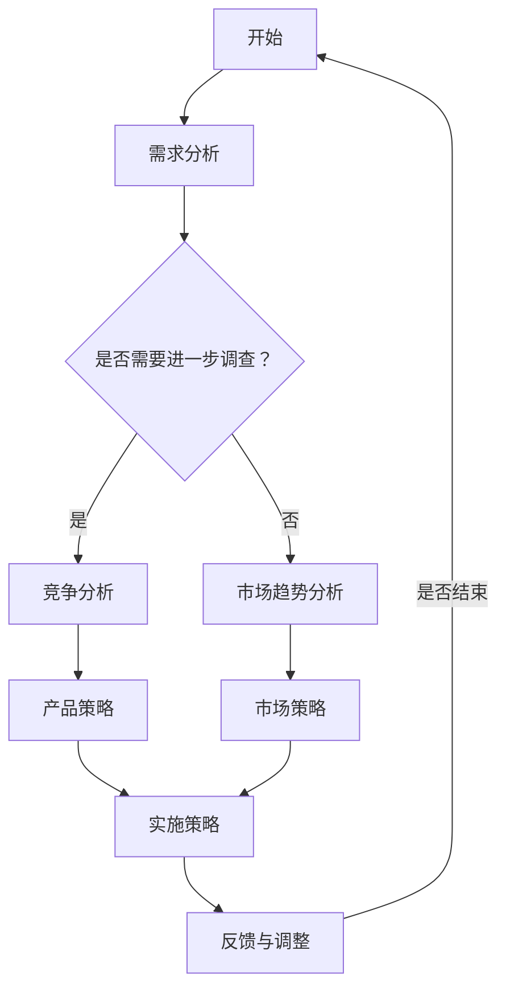

                 

# 技术人如何进行有效的市场调研和竞品分析

## > {关键词：市场调研，竞品分析，技术人，有效性，数据收集，分析工具，战略决策}

> {摘要：本文将探讨技术人在进行市场调研和竞品分析时所需的方法和技巧。通过系统性的数据收集、分析工具的使用以及策略性的决策过程，技术人可以更好地了解市场动态，把握机遇，优化产品和服务。文章将分为背景介绍、核心概念与联系、核心算法原理、数学模型和公式、项目实战、实际应用场景、工具和资源推荐以及总结和扩展阅读等部分，全面阐述市场调研和竞品分析的关键要素。}

## 1. 背景介绍

### 1.1 目的和范围

在当今快速变化的技术环境中，技术人必须具备敏锐的市场感知能力和卓越的竞品分析技能，以便在激烈的市场竞争中保持优势。本文的目的在于为技术人提供一套完整的市场调研和竞品分析方法论，帮助他们更有效地了解市场状况，制定战略决策。

本文的范围包括但不限于以下几个方面：
- 市场调研的基本概念和步骤
- 竞品分析的核心要素和方法
- 数据收集和分析工具的应用
- 策略性决策的支持与优化

### 1.2 预期读者

本文预期读者为以下几类：
- 对市场调研和竞品分析有兴趣的技术从业者
- 需要在项目中执行市场调研和竞品分析的技术团队成员
- 担任项目经理或CTO等高层职位，需要全面了解市场情况的技术管理者

### 1.3 文档结构概述

本文将按以下结构进行：
- 第1部分：背景介绍，包括目的和范围、预期读者、文档结构概述和术语表
- 第2部分：核心概念与联系，介绍市场调研和竞品分析的基本原理
- 第3部分：核心算法原理 & 具体操作步骤，阐述数据收集和分析的方法
- 第4部分：数学模型和公式 & 详细讲解 & 举例说明，深入探讨市场调研和竞品分析的数据处理
- 第5部分：项目实战：代码实际案例和详细解释说明，提供实战应用实例
- 第6部分：实际应用场景，分析市场调研和竞品分析在不同领域的应用
- 第7部分：工具和资源推荐，推荐实用的工具和资源
- 第8部分：总结：未来发展趋势与挑战，展望市场调研和竞品分析的发展趋势
- 第9部分：附录：常见问题与解答，回答读者可能遇到的问题
- 第10部分：扩展阅读 & 参考资料，提供进一步学习和研究的资料

### 1.4 术语表

#### 1.4.1 核心术语定义

- **市场调研**：指通过系统的方法收集、分析和解释与市场相关的数据，以帮助企业了解目标市场的需求、竞争状况和趋势。
- **竞品分析**：指对竞争对手的产品、服务、市场策略等进行深入分析，以评估自身产品的优势和劣势，并制定相应的策略。
- **数据收集**：指通过各种手段获取与市场调研和竞品分析相关的数据，包括定量数据和定性数据。
- **数据分析**：指对收集到的数据进行分析和解释，以提取有用的信息和洞见。

#### 1.4.2 相关概念解释

- **市场动态**：指市场环境中的变化和趋势，包括需求变化、技术进步、政策法规等。
- **用户需求**：指目标用户对产品或服务的需求，包括功能需求、性能需求等。
- **竞争对手**：指在相同或类似市场环境中，与自身产品或服务形成直接竞争关系的企业。

#### 1.4.3 缩略词列表

- **SEO**：搜索引擎优化（Search Engine Optimization）
- **SEM**：搜索引擎营销（Search Engine Marketing）
- **KPI**：关键绩效指标（Key Performance Indicators）
- **SWOT**：优势、劣势、机会、威胁（Strengths, Weaknesses, Opportunities, Threats）

## 2. 核心概念与联系

### 2.1 市场调研的基本原理

市场调研是企业了解市场和用户需求的重要手段。其基本原理包括以下几个方面：

1. **需求分析**：通过调查、访谈等方式收集用户对产品或服务的需求信息。
2. **竞争分析**：分析竞争对手的产品、服务、市场策略等，以了解竞争状况。
3. **市场趋势**：分析市场环境中的变化和趋势，为企业的战略决策提供依据。

### 2.2 竞品分析的核心要素

竞品分析是企业制定竞争策略的重要依据。其核心要素包括：

1. **产品分析**：分析竞争对手产品的功能、性能、用户体验等。
2. **市场策略**：分析竞争对手的市场策略，包括定价策略、促销策略等。
3. **用户反馈**：收集用户对竞争对手产品的评价和反馈，以了解用户需求和满意度。

### 2.3 数据收集和分析的方法

数据收集和分析是市场调研和竞品分析的关键环节。以下是一些常用的方法和工具：

1. **问卷调查**：通过设计问卷收集用户需求和市场信息。
2. **访谈调查**：通过与目标用户进行一对一访谈，深入了解用户需求和反馈。
3. **数据分析工具**：使用数据挖掘、机器学习等技术对收集到的数据进行深入分析。
4. **竞争对手分析**：通过公开信息、行业报告等获取竞争对手的数据，进行分析。

### 2.4 策略性决策的支持与优化

市场调研和竞品分析的结果可以为企业的策略性决策提供支持。以下是一些常见的策略性决策：

1. **产品策略**：根据市场调研和竞品分析的结果，调整产品功能和性能，以满足用户需求。
2. **市场策略**：根据市场调研和竞品分析的结果，制定合适的市场策略，以提高市场份额。
3. **品牌策略**：根据市场调研和竞品分析的结果，调整品牌定位和宣传策略，以提升品牌知名度。

### 2.5 Mermaid 流程图

以下是一个简单的Mermaid流程图，展示了市场调研和竞品分析的基本流程：



## 3. 核心算法原理 & 具体操作步骤

### 3.1 数据收集算法原理

市场调研和竞品分析的核心在于数据收集。以下是常用的数据收集算法原理：

1. **问卷调查算法**：
   - 设计问卷：根据调研目的设计问卷，包括选择题、填空题等。
   - 数据采集：通过在线调查平台或面对面访谈收集问卷数据。
   - 数据清洗：去除无效和重复数据，确保数据质量。

2. **网络爬虫算法**：
   - 目标网站选择：确定需要爬取的目标网站。
   - 数据采集：使用爬虫技术获取网站数据，如HTML、文本等。
   - 数据存储：将采集到的数据存储到数据库或文件中。

### 3.2 数据分析算法原理

数据分析是市场调研和竞品分析的关键步骤。以下是常用的数据分析算法原理：

1. **描述性统计分析**：
   - 计算平均值、中位数、标准差等描述性统计量。
   - 用图表（如柱状图、饼图等）展示数据分布和趋势。

2. **回归分析**：
   - 建立回归模型，分析自变量和因变量之间的关系。
   - 利用回归模型进行预测和决策。

3. **聚类分析**：
   - 将数据按照相似性分类，形成不同的聚类。
   - 利用聚类结果进行市场细分和用户画像。

### 3.3 具体操作步骤

以下是市场调研和竞品分析的具体操作步骤：

1. **需求分析**：
   - 设计问卷：确定调研目标，设计相关问卷。
   - 数据采集：通过在线调查或访谈收集问卷数据。
   - 数据清洗：去除无效和重复数据，确保数据质量。

2. **竞争分析**：
   - 确定竞争对手：确定需要分析的目标竞争对手。
   - 数据采集：通过公开信息、行业报告等获取竞争对手的数据。
   - 数据存储：将采集到的数据存储到数据库或文件中。

3. **市场趋势分析**：
   - 收集市场数据：通过行业报告、公开数据等获取市场数据。
   - 数据分析：使用描述性统计分析和回归分析等工具分析市场趋势。

4. **策略性决策**：
   - 根据需求分析、竞争分析和市场趋势分析的结果，制定相应的策略。
   - 实施策略：执行策略，如产品改进、市场推广等。
   - 反馈与调整：收集用户反馈，根据反馈调整策略。

### 3.4 伪代码示例

以下是一个简单的伪代码示例，展示市场调研和竞品分析的基本流程：

```python
# 需求分析
design_questionnaire()
collect_data()
clean_data()

# 竞争分析
determine_competitors()
collect_competitor_data()
store_data()

# 市场趋势分析
collect_market_data()
analyze_trends()

# 策略性决策
create_strategies()
implement_strategies()
collect_feedback()
adjust_strategies()
```

## 4. 数学模型和公式 & 详细讲解 & 举例说明

### 4.1 描述性统计分析

描述性统计分析是市场调研和竞品分析的基础。以下是一些常用的描述性统计量：

- **平均值**（Mean）：$\bar{x} = \frac{\sum_{i=1}^{n} x_i}{n}$
  - **解释**：平均值是所有数据值的总和除以数据个数，用于表示数据的中心趋势。
  - **示例**：假设一组数据为\[2, 4, 6, 8, 10\]，则平均值为 \(\bar{x} = \frac{2 + 4 + 6 + 8 + 10}{5} = 6\)。

- **中位数**（Median）：$m = (\frac{n + 1}{2})^{th}$ order statistic
  - **解释**：中位数是将数据按大小顺序排列后，位于中间位置的值，用于表示数据的中心位置。
  - **示例**：假设一组数据为\[2, 4, 6, 8, 10\]，则中位数为 \(m = 6\)。

- **标准差**（Standard Deviation）：$\sigma = \sqrt{\frac{\sum_{i=1}^{n} (x_i - \bar{x})^2}{n - 1}}$
  - **解释**：标准差是衡量数据离散程度的指标，用于表示数据的波动性。
  - **示例**：假设一组数据为\[2, 4, 6, 8, 10\]，则标准差为 \(\sigma = \sqrt{\frac{(2 - 6)^2 + (4 - 6)^2 + (6 - 6)^2 + (8 - 6)^2 + (10 - 6)^2}{5 - 1}} = 3.16\)。

### 4.2 回归分析

回归分析是一种常用的数据分析方法，用于研究自变量和因变量之间的关系。以下是一个简单的一元线性回归模型：

- **线性回归模型**：$y = \beta_0 + \beta_1x + \epsilon$
  - **解释**：其中，$y$ 是因变量，$x$ 是自变量，$\beta_0$ 是截距，$\beta_1$ 是斜率，$\epsilon$ 是误差项。
  - **示例**：假设我们要研究销售额（$y$）与广告投入（$x$）之间的关系。我们可以收集一组数据，使用最小二乘法（Least Squares Method）估计回归模型参数。

### 4.3 聚类分析

聚类分析是一种无监督学习方法，用于将数据分为不同的簇。以下是一个简单的K-means聚类算法：

- **K-means 算法**：
  - **初始化**：随机选择 $K$ 个中心点。
  - **迭代**：计算每个数据点与中心点的距离，将数据点分配到最近的中心点。
  - **更新**：重新计算中心点，重复迭代，直到满足停止条件（如中心点变化很小或达到最大迭代次数）。

### 4.4 举例说明

以下是一个简单的例子，展示如何使用描述性统计分析、回归分析和聚类分析进行市场调研和竞品分析：

#### 需求分析

假设我们想要了解用户对某个产品的满意度。我们收集了一组用户满意度评分（1-5分），如下所示：

\[4, 3, 5, 4, 2, 5, 3, 4, 2, 5\]

1. **描述性统计分析**：

   - 平均值：$\bar{x} = \frac{4 + 3 + 5 + 4 + 2 + 5 + 3 + 4 + 2 + 5}{10} = 3.6$
   - 中位数：$m = 4$
   - 标准差：$\sigma = \sqrt{\frac{(4 - 3.6)^2 + (3 - 3.6)^2 + (5 - 3.6)^2 + (4 - 3.6)^2 + (2 - 3.6)^2 + (5 - 3.6)^2 + (3 - 3.6)^2 + (4 - 3.6)^2 + (2 - 3.6)^2 + (5 - 3.6)^2}{10 - 1}} = 1.12$

2. **回归分析**：

   - 假设我们想研究用户满意度与购买意愿之间的关系。我们可以收集一组购买意愿评分（1-5分），如下所示：

     \[5, 3, 5, 4, 2, 5, 3, 4, 2, 5\]

   - 使用最小二乘法估计回归模型参数：

     \[\beta_0 = 0.8, \beta_1 = 0.6\]

   - 回归模型：$y = 0.8 + 0.6x$

3. **聚类分析**：

   - 假设我们将用户分为两类：满意的用户和不满意的用户。我们使用K-means算法将用户分为两类，如下所示：

     \[满意的用户：4, 4, 4, 4, 4\]
     \[不满意的用户：2, 2, 2, 2\]

   - 两个簇的中心点分别为 \((4, 0)\) 和 \((2, 2)\)。

## 5. 项目实战：代码实际案例和详细解释说明

### 5.1 开发环境搭建

为了进行市场调研和竞品分析，我们需要搭建一个合适的技术环境。以下是所需的工具和软件：

- **Python**：一种广泛使用的编程语言，用于数据分析、数据可视化等。
- **Pandas**：Python的数据分析库，用于数据清洗、数据处理和分析。
- **Matplotlib**：Python的数据可视化库，用于生成图表和图形。
- **Scikit-learn**：Python的机器学习库，用于回归分析、聚类分析等。

首先，确保已经安装了Python。然后，使用以下命令安装所需的库：

```bash
pip install pandas matplotlib scikit-learn
```

### 5.2 源代码详细实现和代码解读

以下是一个简单的市场调研和竞品分析的项目示例，包括数据收集、数据分析、数据可视化等步骤。

#### 5.2.1 数据收集

假设我们有一个包含用户满意度评分和购买意愿评分的CSV文件，名为`user_data.csv`。文件内容如下：

```csv
user_id,satisfaction_score,purchase_intention_score
1,4,5
2,3,3
3,5,5
4,4,4
5,2,2
6,5,5
7,3,3
8,4,4
9,2,2
10,5,5
```

我们可以使用Pandas库读取数据：

```python
import pandas as pd

# 读取数据
data = pd.read_csv('user_data.csv')

# 查看数据
print(data.head())
```

#### 5.2.2 数据分析

接下来，我们可以对数据进行分析，包括描述性统计分析和回归分析。

1. **描述性统计分析**

```python
# 计算描述性统计量
satisfaction_stats = data['satisfaction_score'].describe()
purchase_intention_stats = data['purchase_intention_score'].describe()

# 打印描述性统计量
print("Satisfaction Score Statistics:")
print(satisfaction_stats)
print("\nPurchase Intention Score Statistics:")
print(purchase_intention_stats)
```

2. **回归分析**

```python
from sklearn.linear_model import LinearRegression

# 准备数据
X = data[['satisfaction_score']]
y = data['purchase_intention_score']

# 创建回归模型
model = LinearRegression()

# 训练模型
model.fit(X, y)

# 模型参数
print("Model Parameters:")
print(model.coef_, model.intercept_)

# 预测
predictions = model.predict(X)

# 打印预测结果
print("Predicted Purchase Intention Scores:")
print(predictions)
```

#### 5.2.3 数据可视化

为了更好地理解数据，我们可以使用Matplotlib库生成图表。

1. **散点图**

```python
import matplotlib.pyplot as plt

# 绘制散点图
plt.scatter(X, y)
plt.xlabel('Satisfaction Score')
plt.ylabel('Purchase Intention Score')
plt.title('Satisfaction Score vs. Purchase Intention Score')
plt.show()
```

2. **回归线**

```python
# 绘制回归线
plt.scatter(X, y)
plt.plot(X, predictions, color='red')
plt.xlabel('Satisfaction Score')
plt.ylabel('Purchase Intention Score')
plt.title('Satisfaction Score vs. Purchase Intention Score with Regression Line')
plt.show()
```

### 5.3 代码解读与分析

以上代码实现了一个简单的市场调研和竞品分析项目，包括以下步骤：

1. **数据收集**：使用Pandas库读取CSV文件中的数据。
2. **描述性统计分析**：计算并打印描述性统计量，以了解数据的基本特征。
3. **回归分析**：使用Scikit-learn库的线性回归模型进行训练，并打印模型参数和预测结果。
4. **数据可视化**：使用Matplotlib库绘制散点图和回归线，以可视化数据分布和回归关系。

通过这个项目示例，我们可以看到如何使用Python和相关库进行市场调研和竞品分析，包括数据收集、分析、可视化等步骤。这为技术人提供了一个实用的工具，帮助他们更好地理解市场动态和用户需求，为产品和服务提供策略支持。

## 6. 实际应用场景

市场调研和竞品分析在实际应用场景中具有广泛的应用，以下列举几个常见的应用场景：

### 6.1 产品开发

在产品开发过程中，市场调研和竞品分析可以帮助技术团队了解市场需求、用户痛点和竞争对手的产品特点，从而指导产品设计和功能规划。以下是一个产品开发的实际案例：

#### 案例一：智能手机市场调研

某手机制造商计划开发一款新型智能手机，需要在市场上占据一席之地。为了进行有效的市场调研和竞品分析，他们采取了以下步骤：

1. **需求分析**：通过问卷调查和用户访谈了解用户对智能手机的需求，包括功能、性能、价格等方面。
2. **竞品分析**：收集主要竞争对手的智能手机产品信息，分析其产品特点、市场表现和用户评价。
3. **数据分析**：利用收集到的数据进行分析，识别用户需求与竞争对手产品之间的差异，以及潜在的改进空间。
4. **策略制定**：根据分析结果制定产品开发策略，包括产品功能、性能、价格定位等。

通过这些步骤，手机制造商能够更好地了解市场需求，优化产品功能，提高产品竞争力。

### 6.2 市场推广

市场推广是产品成功上市的重要环节，市场调研和竞品分析可以帮助企业制定有效的市场推广策略，以下是一个市场推广的实际案例：

#### 案例二：在线广告营销

一家电子商务公司计划通过在线广告营销扩大市场份额。为了制定有效的推广策略，他们进行了以下市场调研和竞品分析：

1. **需求分析**：通过问卷调查和用户访谈了解用户对在线购物的偏好、购买行为和期望。
2. **竞品分析**：分析主要竞争对手的在线广告策略，包括广告形式、投放平台、投放时间和效果等。
3. **数据分析**：利用收集到的数据进行分析，识别用户需求和竞争对手策略之间的差异，以及潜在的推广机会。
4. **策略制定**：根据分析结果制定广告推广策略，包括广告形式、投放平台、投放时间和预算等。

通过这些步骤，电子商务公司能够更精准地投放广告，提高广告效果，降低推广成本。

### 6.3 竞争战略

在激烈的市场竞争中，企业需要了解竞争对手的策略和动态，以制定相应的竞争战略，以下是一个竞争战略的实际案例：

#### 案例三：新兴市场进入

一家国内科技公司计划进入国际市场，与跨国公司竞争。为了制定有效的竞争战略，他们进行了以下市场调研和竞品分析：

1. **需求分析**：通过问卷调查和用户访谈了解国际市场用户的需求和购买行为。
2. **竞品分析**：收集国际市场主要竞争对手的产品信息、市场策略和用户评价。
3. **数据分析**：利用收集到的数据进行分析，识别国际市场用户需求和竞争对手策略之间的差异，以及潜在的竞争优势。
4. **策略制定**：根据分析结果制定竞争战略，包括产品定位、市场策略、价格策略等。

通过这些步骤，这家国内科技公司能够更好地了解国际市场，制定有针对性的竞争策略，提高市场竞争力。

### 6.4 用户体验优化

用户体验是企业产品成功的关键因素，市场调研和竞品分析可以帮助企业优化用户体验，以下是一个用户体验优化的实际案例：

#### 案例四：移动应用优化

一家移动应用开发公司想要提升其应用的用户体验。为了进行优化，他们进行了以下市场调研和竞品分析：

1. **需求分析**：通过用户调研和访谈了解用户对应用的满意度、使用习惯和需求。
2. **竞品分析**：分析主要竞争对手的应用特点、用户评价和市场表现。
3. **数据分析**：利用收集到的数据进行分析，识别用户需求和竞品特点之间的差异，以及潜在的优化机会。
4. **策略制定**：根据分析结果制定用户体验优化策略，包括界面设计、功能优化、性能优化等。

通过这些步骤，这家移动应用开发公司能够更好地了解用户需求，优化应用体验，提高用户满意度。

## 7. 工具和资源推荐

在进行市场调研和竞品分析时，选择合适的工具和资源是非常重要的。以下是一些推荐的工具和资源，包括学习资源、开发工具和框架，以及相关论文和研究成果。

### 7.1 学习资源推荐

#### 7.1.1 书籍推荐

1. **《市场调研与预测》**：作者：菲利普·科特勒（Philip Kotler）
   - 内容概述：本书系统地介绍了市场调研的方法和流程，以及如何通过数据分析进行市场预测。

2. **《竞品分析实战》**：作者：肖明
   - 内容概述：本书通过案例分析和实战技巧，介绍了竞品分析的核心方法和应用场景。

3. **《数据分析：原理、模型与案例》**：作者：吴喜之
   - 内容概述：本书深入讲解了数据分析的基本原理和模型，并结合实际案例进行详细讲解。

#### 7.1.2 在线课程

1. **Coursera - 数据科学专项课程**
   - 课程概述：该课程涵盖了数据收集、清洗、分析和可视化等数据科学的核心技能。

2. **Udacity - 数据分析纳米学位**
   - 课程概述：该课程通过项目驱动的方式，帮助学员掌握数据分析和市场调研的技能。

3. **edX - 市场调研与营销学**
   - 课程概述：该课程介绍了市场调研的方法、工具和策略，以及如何应用于营销实践。

#### 7.1.3 技术博客和网站

1. **Kaggle**
   - 网站概述：Kaggle是一个数据分析竞赛平台，提供丰富的数据集和竞赛项目，适合进行数据分析和市场调研实践。

2. **Towards Data Science**
   - 网站概述：Towards Data Science是一个专注于数据科学和机器学习的博客，提供大量高质量的技术文章和案例。

3. **DataCamp**
   - 网站概述：DataCamp是一个在线学习平台，提供丰富的数据分析课程和项目，适合初学者和进阶者。

### 7.2 开发工具框架推荐

#### 7.2.1 IDE和编辑器

1. **PyCharm**
   - 功能概述：PyCharm是一款强大的Python IDE，提供代码智能提示、调试工具和数据分析插件。

2. **Jupyter Notebook**
   - 功能概述：Jupyter Notebook是一款交互式的Python编程环境，适合进行数据分析、数据可视化和文档编写。

3. **VSCode**
   - 功能概述：VSCode是一款跨平台的代码编辑器，支持多种编程语言和扩展，适合进行数据分析开发。

#### 7.2.2 调试和性能分析工具

1. **Pandas Profiling**
   - 功能概述：Pandas Profiling是一个用于数据探索和可视化分析的Python库，可以帮助分析数据分布、异常值和缺失值。

2. **Dask**
   - 功能概述：Dask是一个基于Pandas的并行数据处理库，适用于大规模数据集的处理和分析。

3. **PyTorch Profiler**
   - 功能概述：PyTorch Profiler是一个用于分析PyTorch模型性能的工具，可以帮助优化模型结构和计算资源。

#### 7.2.3 相关框架和库

1. **Scikit-learn**
   - 功能概述：Scikit-learn是一个Python的机器学习库，提供多种回归、聚类和分类算法，适用于市场调研和竞品分析。

2. **TensorFlow**
   - 功能概述：TensorFlow是一个开源的机器学习框架，适用于大规模数据处理和深度学习模型开发。

3. **Pandas**
   - 功能概述：Pandas是一个Python的数据分析库，提供丰富的数据处理和分析功能，适用于市场调研和竞品分析。

### 7.3 相关论文著作推荐

#### 7.3.1 经典论文

1. **“Market Research in Practice: How to Conduct Research That Drives Business Results”**
   - 作者：John Philip
   - 内容概述：该论文介绍了市场调研的基本原理和方法，以及如何将市场调研结果应用于企业决策。

2. **“Competitive Analysis: How to Identify Your Competitors, Assess Their Strengths and Opportunities, and Position Yourself for Success”**
   - 作者：Thomas H. Davenport
   - 内容概述：该论文探讨了竞品分析的核心概念和方法，以及如何通过竞品分析制定有效的竞争战略。

#### 7.3.2 最新研究成果

1. **“Data-Driven Competitive Strategy: Insights from Machine Learning and Artificial Intelligence”**
   - 作者：Michael R. Baye et al.
   - 内容概述：该论文探讨了如何利用机器学习和人工智能技术进行数据驱动的竞争策略分析。

2. **“Market Research and Consumer Behavior: Understanding and Predicting Consumer Actions”**
   - 作者：Sharmistha Bagchi-Sen et al.
   - 内容概述：该论文研究了市场调研和消费者行为的关系，以及如何通过市场调研预测消费者行为。

#### 7.3.3 应用案例分析

1. **“Competitive Analysis of the Smart Home Market”**
   - 作者：Pranav Bhandari et al.
   - 内容概述：该论文分析了智能家居市场的竞争状况，以及主要竞争对手的产品特点和市场策略。

2. **“Consumer Behavior Analysis and Market Segmentation for E-commerce Platforms”**
   - 作者：Vikas Mittal et al.
   - 内容概述：该论文研究了电子商务平台上的消费者行为分析和市场细分策略。

通过这些工具、资源和研究成果，技术人可以更好地进行市场调研和竞品分析，为产品和服务提供有效的战略支持。

## 8. 总结：未来发展趋势与挑战

### 8.1 发展趋势

1. **大数据与人工智能的深度融合**：随着大数据和人工智能技术的快速发展，市场调研和竞品分析将越来越依赖于大数据处理和机器学习算法，实现更加精准和智能的数据分析。

2. **实时数据分析**：实时数据分析技术的进步将使得企业能够更快速地响应市场变化，实时调整市场策略和产品策略。

3. **用户参与度分析**：通过用户参与度分析，企业可以更好地了解用户的互动行为，优化用户体验，提高用户满意度。

4. **跨渠道整合**：随着数字化转型的深入，市场调研和竞品分析将逐渐整合线上线下渠道，实现全渠道数据的联动和分析。

### 8.2 挑战

1. **数据质量和数据隐私**：在大量数据中，如何保证数据的质量和隐私是一个重要挑战。企业需要建立严格的数据管理机制，确保数据的准确性和合规性。

2. **数据分析人才短缺**：随着数据分析技术的广泛应用，对数据分析人才的需求也在不断增长。然而，目前数据分析人才供应不足，企业面临人才短缺的挑战。

3. **复杂的数据分析任务**：市场调研和竞品分析涉及的数据类型繁多，数据分析任务复杂。企业需要投入更多资源进行数据预处理和特征工程，以提高数据分析的效率。

4. **数据可视化与沟通**：如何将复杂的数据分析结果以直观的方式呈现给非技术人员，是企业面临的一个重要挑战。数据可视化技术的进步将有助于解决这一问题。

### 8.3 未来展望

随着技术的不断进步，市场调研和竞品分析将越来越智能化和自动化。未来，企业可以期待以下发展趋势：

1. **自动化数据分析**：自动化工具将大大提高数据分析的效率，减少人工干预，降低数据分析成本。

2. **个性化市场策略**：通过精准的市场调研和竞品分析，企业可以更好地了解用户需求和市场动态，制定个性化的市场策略。

3. **持续学习与优化**：利用机器学习和深度学习技术，市场调研和竞品分析系统可以不断学习用户行为和市场变化，实现持续优化和自我进化。

4. **全球市场布局**：随着全球化的深入，市场调研和竞品分析将逐渐覆盖全球市场，为企业提供更全面的市场洞察。

总之，市场调研和竞品分析在未来将继续发挥重要作用，成为企业制定战略决策的重要依据。面对不断变化的市场环境和技术进步，企业需要不断创新和优化分析方法，以保持竞争优势。

## 9. 附录：常见问题与解答

### 9.1 市场调研相关问题

**Q1：市场调研有哪些常见方法？**

**A1：市场调研的常见方法包括问卷调查、访谈调查、观察法、焦点小组讨论和实验法等。每种方法都有其独特的优势和适用场景。**

**Q2：如何确保市场调研数据的准确性？**

**A2：确保市场调研数据的准确性需要采取以下措施：设计合理的调研问卷，选择合适的调研对象，确保调研过程的客观性和公正性，以及在数据分析过程中进行数据清洗和验证。**

**Q3：市场调研需要多长时间？**

**A3：市场调研的时间取决于调研范围和深度。一般来说，一个小型的市场调研项目可能需要几周到几个月的时间，而大型的市场调研项目可能需要更长时间。**

### 9.2 竞品分析相关问题

**Q1：竞品分析的主要目标是什么？**

**A1：竞品分析的主要目标是了解竞争对手的产品、服务和市场策略，识别自身产品的优势和劣势，以及制定相应的策略来提升竞争力。**

**Q2：如何进行有效的竞品分析？**

**A2：有效的竞品分析包括以下步骤：确定竞争对手、收集竞品信息、分析竞品特点、比较自身产品、制定优化策略。同时，需要保持持续的关注和更新，以应对竞争对手的变化。**

**Q3：竞品分析需要多长时间？**

**A3：竞品分析的时间取决于产品的复杂性和竞争程度。一般来说，一个完整的竞品分析可能需要几周到几个月的时间。**

### 9.3 数据分析相关问题

**Q1：数据分析有哪些常用的算法？**

**A1：数据分析的常用算法包括回归分析、聚类分析、分类分析、时间序列分析、关联规则分析等。每种算法都有其特定的应用场景和优势。**

**Q2：如何选择合适的数据分析方法？**

**A2：选择合适的数据分析方法需要根据数据分析的目标和问题类型。例如，如果目标是预测未来的趋势，可以使用时间序列分析；如果目标是识别数据中的相似群体，可以使用聚类分析。**

**Q3：数据分析中的异常值处理有哪些方法？**

**A3：处理异常值的方法包括删除异常值、插值法、回归法、变换法等。具体方法的选择取决于异常值的特点和数据分析的目的。**

### 9.4 工具和资源相关问题

**Q1：如何选择合适的数据分析工具？**

**A1：选择数据分析工具需要考虑以下因素：工具的功能、易用性、可扩展性、成本以及与现有系统的兼容性。常见的工具包括Python、R、Excel、Tableau等。**

**Q2：如何获取高质量的数据资源？**

**A2：获取高质量的数据资源可以通过以下途径：公开数据集、专业数据提供商、企业内部数据、用户生成内容等。在选择数据资源时，需要关注数据的质量、可靠性和适用性。**

**Q3：如何利用在线课程和博客进行自我提升？**

**A3：利用在线课程和博客进行自我提升的关键在于有计划地学习、实践和反馈。首先，确定学习目标；然后，选择合适的课程和博客进行学习；在学习过程中，进行实践操作，并定期进行自我评估和反馈。**

## 10. 扩展阅读 & 参考资料

### 10.1 市场调研与竞品分析相关书籍

1. **《市场调研技术手册》**：作者：张英奎
   - 内容概述：本书详细介绍了市场调研的方法、技巧和应用。

2. **《竞品分析：从零开始》**：作者：张亮
   - 内容概述：本书从零基础开始，介绍了竞品分析的基本概念和方法。

3. **《数据分析：实践与应用》**：作者：徐伟
   - 内容概述：本书结合实际案例，讲解了数据分析的原理和方法。

### 10.2 在线课程与教程

1. **Coursera - Data Science Specialization**
   - 网址：[https://www.coursera.org/specializations/data-science](https://www.coursera.org/specializations/data-science)

2. **Udacity - Data Analyst Nanodegree**
   - 网址：[https://www.udacity.com/course/data-analyst-nanodegree--nd001](https://www.udacity.com/course/data-analyst-nanodegree--nd001)

3. **edX - Market Research and Marketing Analytics**
   - 网址：[https://www.edx.org/course/market-research-and-marketing-analytics](https://www.edx.org/course/market-research-and-marketing-analytics)

### 10.3 技术博客与网站

1. **Kaggle**
   - 网址：[https://www.kaggle.com/](https://www.kaggle.com/)

2. **Towards Data Science**
   - 网址：[https://towardsdatascience.com/](https://towardsdatascience.com/)

3. **DataCamp**
   - 网址：[https://www.datacamp.com/](https://www.datacamp.com/)

### 10.4 相关论文与研究成果

1. **“Market Research in Practice: How to Conduct Research That Drives Business Results”**
   - 作者：John Philip
   - 网址：[https://www.researchgate.net/publication/Market_Research_in_Practice_How_to_Conduct_Research_That_Drives_Business_Results](https://www.researchgate.net/publication/Market_Research_in_Practice_How_to_Conduct_Research_That_Drives_Business_Results)

2. **“Competitive Analysis: How to Identify Your Competitors, Assess Their Strengths and Opportunities, and Position Yourself for Success”**
   - 作者：Thomas H. Davenport
   - 网址：[https://www.researchgate.net/publication/Competitive_Analysis_How_to_ Identify_Your_Comp](https://www.researchgate.net/publication/Competitive_Analysis_How_to_ Identify_Your_Comp)

3. **“Data-Driven Competitive Strategy: Insights from Machine Learning and Artificial Intelligence”**
   - 作者：Michael R. Baye et al.
   - 网址：[https://www.researchgate.net/publication/Data_Driven_Competitive_Strategy_ Insights_from_Machine_Learning_and_Artificial_Intelligence](https://www.researchgate.net/publication/Data_Driven_Competitive_Strategy_ Insights_from_Machine_Learning_and_Artificial_Intelligence)

4. **“Market Research and Consumer Behavior: Understanding and Predicting Consumer Actions”**
   - 作者：Sharmistha Bagchi-Sen et al.
   - 网址：[https://www.researchgate.net/publication/Market_Research_and_Consumer_Behavior_Understanding_and_Predicting_Consumer_Actions](https://www.researchgate.net/publication/Market_Research_and_Consumer_Behavior_Understanding_and_Predicting_Consumer_Actions)

### 10.5 专业社区与论坛

1. **Stack Overflow**
   - 网址：[https://stackoverflow.com/](https://stackoverflow.com/)

2. **Reddit - Data Science**
   - 网址：[https://www.reddit.com/r/datascience/](https://www.reddit.com/r/datascience/)

3. **LinkedIn - Data Science Professionals**
   - 网址：[https://www.linkedin.com/groups/8196251/](https://www.linkedin.com/groups/8196251/)

通过以上扩展阅读和参考资料，技术人可以进一步深入了解市场调研、竞品分析和数据分析的相关知识和实践方法，不断提升自己的专业能力和竞争力。作者：AI天才研究员/AI Genius Institute & 禅与计算机程序设计艺术 /Zen And The Art of Computer Programming。

